# Genetics · Lesson 3.6: Reading & editing genes (a taste)

> ⏱ ~15 min · Module 3: Molecular Genetics & Gene Regulation · Builds on: [3.5](03-05-eukaryotic-regulatory-logic-epigenetics.md), [3.3](03-03-dna-repair.md) · Unlocks: 4.1 (quantitative traits)

## Why this matters

Every inference in this course so far has been indirect. Mendel counted phenotypes and deduced factors; Morgan counted flies and deduced chromosomes; Benzer counted phage and deduced that a gene is a stretch of bases. **None of them could look.**

This lesson is about the tools that made looking possible, and the point is not the protocols — it is what each tool made *thinkable*. PCR turned a single molecule into a visible band, and with it turned forensics, diagnosis and ancient DNA into fields. Sequencing turned "which gene" into "which base." CRISPR turned "observe a mutation" into "make one, anywhere, in anything." Each tool moved a question from impossible to routine, and knowing which question each one answers is more durable than knowing the buffer conditions.

## The idea

**Restriction enzymes: cutting DNA at a defined sequence.** Bacterial defence enzymes that cleave specific short palindromic sites — EcoRI cuts `GAATTC`, leaving staggered "sticky" ends that can re-anneal with any other fragment cut by the same enzyme. That last property is what made **recombinant DNA** possible: cut two different DNAs with the same enzyme, mix, ligate, and you have joined them.

**Cloning: making many copies in a living cell.** Insert the fragment into a **vector** (a plasmid with an origin of replication and a selectable marker), transform bacteria, and let them grow. Each colony is a clone from one cell, carrying one insert.

**PCR: making many copies in a tube.** Two primers flanking the target, a thermostable polymerase, and repeated cycles of melt–anneal–extend. Each cycle doubles the target:

$$N_{\text{cycles}} \;\Rightarrow\; 2^{n} \text{-fold amplification}$$

30 cycles is $2^{30} \approx 10^{9}$. **PCR is exponential, which is why it can start from a single molecule** — and also why contamination is catastrophic.

**Sanger sequencing: reading the bases by controlled chain termination.** Include a small fraction of **dideoxynucleotides**, which lack the 3′-OH needed for the next bond. A chain terminates whenever one is incorporated, giving a nested set of fragments of every possible length, each ending in a known base. Separate by size, read off the sequence.

**Next-generation sequencing: read short pieces, and read a great many at once.** Fragment the genome, sequence millions of short reads in parallel, and assemble computationally by aligning to a reference. The individual reads are worse than Sanger's; the **throughput** is a billion times better, and that is what matters.

**CRISPR-Cas9: cutting at a sequence you choose.** A guide RNA of about 20 bases directs the Cas9 nuclease to a matching genomic site (adjacent to a short PAM motif) and Cas9 makes a **double-strand break**. What happens next is not up to CRISPR — it is up to the cell's repair machinery from [3.3](03-03-dna-repair.md) and [molecular-cell-biology 3.3](../../molecular-cell-biology/lessons/03-03-double-strand-breaks-hr-nhej.md):

$$\text{NHEJ} \Rightarrow \text{small indels} \Rightarrow \textbf{knockout}$$
$$\text{HR with a supplied donor template} \Rightarrow \textbf{precise edit}$$

**This is the crucial conceptual point about genome editing.** The nuclease provides *targeting*; the cell provides *editing*. The efficiency and precision of any CRISPR experiment is set by which repair pathway the cell chooses — which, from [molecular-cell-biology 3.3](../../molecular-cell-biology/lessons/03-03-double-strand-breaks-hr-nhej.md), depends on the cell-cycle phase. **Editing works well in dividing cells and badly in post-mitotic ones**, and that limitation is inherited directly from repair biology rather than from the tool.

## The formal version

**PCR amplification, and why it needs a plateau.** Ideal amplification after $n$ cycles from $N_0$ starting molecules:

$$N_n = N_0 \times (1+E)^{n}, \qquad E = \text{efficiency}, \ 0 \le E \le 1 .$$

At perfect efficiency $E = 1$ and $N_n = N_0 2^{n}$. In practice $E \approx 0.9$ early and falls toward zero as reagents deplete — **so PCR plateaus**, and endpoint product amount is a poor measure of starting amount.

**Quantitative PCR fixes this by measuring the cycle, not the product.** Define $C_t$ as the cycle at which fluorescence crosses a fixed threshold. Since amplification is exponential, a sample with more starting material crosses earlier:

$$\boxed{\;\frac{N_0^{(A)}}{N_0^{(B)}} = 2^{\,C_t^{(B)} - C_t^{(A)}}\;}$$

*In words: each cycle of difference in $C_t$ is a twofold difference in starting amount.* A $\Delta C_t$ of 3.32 is a tenfold difference, since $2^{3.32} = 10$. **Measuring the cycle rather than the endpoint is what turned PCR from a preparative method into a quantitative one.**

**Sequencing coverage and why it must be redundant.** For a genome of length $G$ sequenced with $N$ reads of length $L$, the mean **coverage** (depth) is

$$C = \frac{N L}{G}.$$

Reads land approximately at random, so the number covering any given base is Poisson with mean $C$, and the fraction of the genome missed entirely is

$$P(0 \text{ reads}) = e^{-C}.$$

| Coverage $C$ | Fraction of genome with zero reads |
|---|---|
| 1× | $e^{-1} = 37$ percent |
| 5× | 0.7 percent |
| 10× | $4.5\times10^{-5}$ |
| 30× | $9\times10^{-14}$ |

**This is why "30× coverage" is the standard for human genome sequencing** — not because you need 30 reads to see a base, but because you need enough depth that essentially no base is missed *and* enough independent reads at each position to call a heterozygous variant confidently. A heterozygote contributes each allele to about half the reads, so at 10× you might see 10:0 by chance ($P = 2 \times 0.5^{10} = 0.2$ percent per site, which across $3\times10^9$ sites is millions of miscalls). **Depth buys both completeness and confidence, and the confidence requirement is the binding one.**

**Restriction mapping and RFLPs, briefly.** A mutation that creates or destroys a restriction site changes the fragment lengths produced by that enzyme — a **restriction fragment length polymorphism**. Before sequencing was cheap this was the workhorse marker for linkage mapping ([2.2](02-02-linkage-recombination.md)) and for detecting known point mutations. Sickle-cell disease was the first human disease diagnosed prenatally by DNA analysis, in 1978, exactly this way: the $HbS$ mutation destroys an *MstII* site.

**Reporters and knockouts, as logic rather than protocol.**

| Question | Tool | Logic |
|---|---|---|
| Where and when is this gene expressed? | **reporter** — fuse the gene's regulatory region to GFP or *lacZ* | the reporter's expression pattern reports the promoter's activity |
| What does this gene do? | **knockout** — destroy it and see what breaks | loss of function reveals requirement |
| Is this the gene responsible? | **rescue** — restore the wild-type copy to the mutant | if the phenotype reverts, the gene is confirmed |

**The knockout–rescue pair is the modern complementation test** ([3.1](03-01-gene-as-molecule-complementation.md)). Asking "does supplying a good copy restore function?" is exactly the *trans* test, run with a cloned gene instead of a mating.

**Base and prime editing — avoiding the break.** Because a double-strand break is dangerous and its repair is unpredictable, newer editors avoid making one:

- **Base editors** fuse a catalytically-impaired Cas9 to a deaminase, chemically converting C→T or A→G at a targeted position. No break, no donor template, and it works in **non-dividing cells** — which the HR route cannot.
- **Prime editors** fuse a nicking Cas9 to a reverse transcriptase, writing a new sequence from an extended guide RNA. More flexible, no double-strand break.

**Both were designed by asking what was wrong with the repair step, not the targeting step** — the clearest possible demonstration that the limitation was never the nuclease.

## Picture

```mermaid
flowchart LR
    subgraph READ["READING"]
        R1["Restriction enzymes<br/>cut at a fixed sequence<br/><i>&rarr; recombinant DNA</i>"]
        R2["PCR: 2&#8319; amplification<br/>30 cycles &asymp; 10&#8313;&times;<br/><i>&rarr; one molecule becomes visible</i>"]
        R3["Sanger: chain termination<br/><i>&rarr; which base</i>"]
        R4["NGS: millions of short reads<br/>coverage C = NL/G, missed = e&#8315;&#7580;<br/><i>&rarr; whole genomes, cheaply</i>"]
    end
    subgraph EDIT["EDITING"]
        E1["CRISPR-Cas9<br/>guide RNA targets, Cas9 CUTS"]
        E1 --> E2{"Which repair pathway<br/>does the CELL choose?"}
        E2 -->|NHEJ| KO["small indels &rarr; KNOCKOUT"]
        E2 -->|"HR + donor template<br/>(dividing cells only)"| PE["PRECISE EDIT"]
        E3["Base / prime editors:<br/>no double-strand break at all<br/><i>&rarr; works in non-dividing cells</i>"]
    end
    R2 --> E1
    E2 -.->|"the limitation was never<br/>the nuclease &mdash; it was the repair"| E3

    style E2 fill:#fdeee0,stroke:#c9871f
    style E3 fill:#e6f4ea,stroke:#2e8b57
```

**The diamond is the lesson.** CRISPR supplies targeting; the cell supplies editing, using the pathways of [3.3](03-03-dna-repair.md). Every practical limitation of genome editing — poor efficiency in post-mitotic cells, unpredictable indels, off-target breaks — traces to that handoff, and the newest editors work by refusing to make it.

## Worked examples

**Example 1 (mechanical — qPCR and coverage).** (a) Two samples are compared by qPCR. Sample A crosses threshold at $C_t = 22.4$, sample B at $C_t = 25.7$. How much more target does A contain? (b) A human genome ($3\times10^{9}$ bp) is sequenced with $6\times10^{8}$ reads of 150 bp. What is the coverage, and what fraction of the genome is expected to have zero reads?

(a) $$\Delta C_t = 25.7 - 22.4 = 3.3 \;\Longrightarrow\; \frac{N_0^{(A)}}{N_0^{(B)}} = 2^{3.3} = \mathbf{9.8},$$

so **about tenfold more**. (The useful shortcut: $\Delta C_t = 3.32$ is exactly tenfold, so a $\Delta C_t$ of 3.3 is essentially one order of magnitude, and 6.6 is two.)

(b) $$C = \frac{NL}{G} = \frac{6\times10^{8} \times 150}{3\times10^{9}} = \frac{9\times10^{10}}{3\times10^{9}} = \mathbf{30\times}.$$

$$P(0 \text{ reads}) = e^{-30} = 9.4\times10^{-14},$$

so the expected number of uncovered bases is

$$3\times10^{9} \times 9.4\times10^{-14} = \mathbf{2.8\times10^{-4}} \ \text{bases} \approx 0 .$$

**Essentially the whole genome is covered**, which is why 30× is the standard — and note that the Poisson model is optimistic, since real reads are not uniformly distributed (repetitive and GC-extreme regions are systematically under-covered, and this, not depth, is what actually limits genome sequencing).

**Example 2 (why you'd care — designing a CRISPR experiment and predicting what will go wrong).** You want to correct a single-base point mutation in a patient's haematopoietic stem cells. (a) Sketch the standard Cas9 approach and identify the step most likely to fail. (b) Estimate what fraction of edited cells will carry the desired correction versus a disruptive indel, and explain the ratio. (c) Propose a better tool and justify it from repair biology.

(a) The standard approach: design a guide RNA matching a sequence within about 20 bp of the mutation, deliver Cas9 plus the guide plus a **donor template** carrying the corrected sequence flanked by homology arms. Cas9 cuts; the cell repairs the break; with luck it uses the donor as a template via **homology-directed repair** and the correction is installed.

**The step most likely to fail is the repair-pathway choice.** The cell decides, not you — and NHEJ is faster, always available, and does not need a template ([molecular-cell-biology 3.3](../../molecular-cell-biology/lessons/03-03-double-strand-breaks-hr-nhej.md)).

(b) In most cell types, NHEJ dominates by roughly **10:1**. So of cells that repair the break at all:

$$\sim 90\ \text{percent} \Rightarrow \text{indel} \Rightarrow \textbf{a second broken allele}, \qquad \sim 10\ \text{percent} \Rightarrow \text{correction}.$$

**The ratio is set by cell-cycle phase.** HR requires resection, resection requires CDK activity, and CDK is high only in S and G2 ([molecular-cell-biology 3.3](../../molecular-cell-biology/lessons/03-03-double-strand-breaks-hr-nhej.md)). Haematopoietic stem cells are largely **quiescent** — mostly in G0 — so HR is essentially unavailable to them. The efficiency problem is not a delivery problem or a guide-design problem; **it is a cell-cycle problem**, and stimulating the cells to divide improves editing at the cost of losing their stem-cell character.

Worse, the 90 percent are not neutral failures. An indel in the target gene is a **new loss-of-function allele** — you have converted some point-mutant cells into null cells.

(c) **Use a base editor.** If the correction is a C→T or A→G transition (and most pathogenic point mutations are, since transitions dominate — [3.2](03-02-mutation.md)), a base editor chemically deaminates the target base with no double-strand break at all.

The justification is entirely from repair biology:

| | Cas9 + donor | Base editor |
|---|---|---|
| Makes a double-strand break? | **yes** | no (a nick at most) |
| Depends on HR? | **yes** | **no** |
| Works in G0 / non-dividing cells? | **poorly** | **yes** |
| Dominant failure mode | indels from NHEJ | bystander edits at nearby identical bases |

**By not creating the break, the base editor never hands control to the repair pathway**, and the cell-cycle dependence disappears with it. This is exactly why base editing has advanced fastest in exactly the settings where HR fails — post-mitotic neurons, quiescent stem cells, and *in vivo* liver.

(An honest caveat: base editors have their own failure mode, editing other C's or A's within the same few-base window, and they can only make certain transitions. Prime editing is more flexible and correspondingly less efficient. **There is no tool without a failure mode; the skill is knowing which one you are choosing.**)

## Watch out

- **You might think endpoint PCR is quantitative.** It plateaus as reagents deplete, so the final amount is nearly independent of the starting amount. Quantification requires measuring the **cycle** at which signal appears, not the product at the end.
- **You might read coverage as "reads per base needed."** It is a Poisson mean, and the requirement is set by variant-calling confidence — a heterozygote must be seen on both alleles enough times to be distinguished from a sequencing error.
- **You might think CRISPR edits DNA.** It **cuts** DNA. The cell edits, using NHEJ or HR, and which one it picks determines your result — and it picks based on cell-cycle phase, not on what you wanted.
- **You might expect the failed edits to be neutral.** They are indels in your target gene — new loss-of-function alleles. A 10 percent correction rate means 90 percent of edited cells were made *worse*.
- **You might treat sequencing as complete.** Repetitive regions, GC-extreme regions and structural variants are systematically under-represented, and — as [3.5](03-05-eukaryotic-regulatory-logic-epigenetics.md) established — methylation and parental origin are not in the sequence at all.

## One-liner

> CRISPR does not edit DNA — it cuts it and hands the result to the repair pathways of [3.3](03-03-dna-repair.md), which is why editing works in dividing cells and why the newest editors were designed to avoid making a break at all.

## Problems

**P1 (🟢)** (a) After 25 PCR cycles at perfect efficiency, by what factor is a target amplified? (b) Starting from a single molecule, how many copies is that? (c) At 90 percent efficiency instead, what is the amplification after 25 cycles?

**P2 (🟡)** A genome of $1.2\times10^{8}$ bp is sequenced with 150 bp reads. (a) How many reads are needed for 40× coverage? (b) At that coverage, what fraction of bases is expected to have zero reads? (c) At 8× coverage, what is the probability that a heterozygous site is seen as homozygous because all reads happened to come from one allele? Comment on what this implies for calling variants at low depth.

**P3 (🔴, bridges to 3.3, 3.5 and to therapy)** You want to treat a disease caused by a promoter methylation defect that silences an otherwise-normal gene ([3.5](03-05-eukaryotic-regulatory-logic-epigenetics.md)). (a) Explain why Cas9, base editing and prime editing are all the wrong tool. (b) Propose an approach based on what you know about how Cas9's targeting and cutting functions can be separated. (c) State one advantage and one serious concern of your approach relative to conventional editing.

Solutions

**P1 (a)** $$2^{25} = \mathbf{3.36\times10^{7}}\text{-fold}.$$

**(b)** From one molecule, $\mathbf{3.36\times10^{7}}$ copies — about 34 million, from a single starting template. **This is why PCR made single-molecule forensics and ancient DNA possible, and why a single contaminating molecule ruins an experiment.**

**(c)** $$N_{25} = (1 + 0.9)^{25} = 1.9^{25} = \mathbf{9.3\times10^{6}},$$

a 3.6-fold shortfall from the ideal. **A 10 percent drop in per-cycle efficiency costs most of an order of magnitude over 25 cycles** — the same compounding logic as multiplicative gain in a signalling cascade ([molecular-cell-biology 2.2](../../molecular-cell-biology/lessons/02-02-second-messengers-amplification.md)), and the reason primer design and reaction conditions matter so much.

**P2 (a)** From $C = NL/G$:

$$N = \frac{CG}{L} = \frac{40 \times 1.2\times10^{8}}{150} = \frac{4.8\times10^{9}}{150} = \mathbf{3.2\times10^{7}\ \text{reads}}.$$

**(b)** $$P(0) = e^{-40} = \mathbf{4.2\times10^{-18}},$$

so the expected number of uncovered bases is $1.2\times10^{8} \times 4.2\times10^{-18} = 5\times10^{-10}$ — **effectively zero**.

**(c)** At a site with exactly 8 reads, each read comes from either allele with probability $\tfrac12$. All 8 from one allele:

$$P = 2 \times \left(\tfrac12\right)^{8} = 2 \times \frac{1}{256} = \frac{1}{128} = \mathbf{0.78\ \text{percent}}.$$

(The factor of 2 covers both alleles.)

**What this implies.** Nearly 1 percent of heterozygous sites would be miscalled as homozygous at 8× depth. In a human genome with roughly $3\times10^{6}$ heterozygous sites:

$$3\times10^{6} \times 0.0078 = \mathbf{\sim 23{,}000\ \text{missed heterozygotes}}.$$

**Coverage depth is driven by confidence, not by completeness.** At 8×, essentially every base *is* covered ($e^{-8} = 0.03$ percent missed), and yet tens of thousands of variants would be wrong. That is the real reason 30× is standard: at 30×, the same calculation gives $2 \times 0.5^{30} = 1.9\times10^{-9}$, or $3\times10^{6} \times 1.9\times10^{-9} = 0.006$ expected miscalls genome-wide — effectively none.

**P3 (a)** All three edit the **sequence**, and the sequence is **normal**. The gene is intact; the problem is a methylation mark on the promoter ([3.5](03-05-eukaryotic-regulatory-logic-epigenetics.md)). Cutting it, deaminating a base, or writing in a new sequence would all *damage* a healthy gene, not restore it. There is nothing to correct.

**This is the diagnostic point.** The tool must match the layer the defect is on — and this defect is on the epigenetic layer, not the sequence layer.

**(b)** Separate Cas9's two functions. Cas9 is a **programmable DNA-binding protein** that happens to also cut. Mutating both of its nuclease domains gives **dCas9** ("dead" Cas9) — it still binds wherever the guide RNA directs it and does nothing else.

Fuse dCas9 to an **effector** that acts on the epigenetic layer:

- **dCas9–TET1** (a demethylase) targeted to the silenced promoter would strip the methylation and reactivate the gene.
- **dCas9–p300** (a histone acetyltransferase, [molecular-cell-biology 4.1](../../molecular-cell-biology/lessons/04-01-chromatin-packaging-regulation.md)) would acetylate local histones, opening the chromatin.
- **dCas9–VP64** (a transcriptional activator) would recruit the transcription machinery directly — "CRISPRa".

All three achieve the goal — restore expression of a gene that is present and intact — **without touching a single base**. This family of tools is exactly what the CRISPR platform becomes once you notice that targeting and cutting are separable.

**(c)** *Advantage:* **it is reversible and it leaves no permanent lesion.** The DNA sequence is never altered, so an off-target binding event causes a transient change in expression rather than a permanent mutation — a far gentler failure mode than an off-target double-strand break. It also works in non-dividing cells, since no repair pathway is involved at all.

*Serious concern:* **the effect may not persist.** Epigenetic states are maintained by self-reinforcing loops ([molecular-cell-biology 4.1](../../molecular-cell-biology/lessons/04-01-chromatin-packaging-regulation.md)), and the loop that silenced this promoter is still intact. Once the dCas9 fusion is degraded or diluted by cell division, the silencing machinery may simply re-establish the mark — and the gene goes quiet again. Durability is the central unsolved problem for epigenetic editing: some targets stay reactivated for months, and others revert within days, and predicting which is not yet possible.

*(A second legitimate concern: dCas9 fusions recruit powerful chromatin-modifying enzymes, and off-target binding events — of which there are many more than off-target cutting events, since binding tolerates more mismatches than cutting — could alter expression of genes across the genome.)*

## Flashback

**From Lesson 3.5 (imprinting and epigenetic inheritance):** A child has Prader–Willi syndrome. Testing shows a normal karyotype, no deletion on microarray, a normal sequence across 15q11–13, and an abnormal methylation pattern showing a maternal-only imprint. (a) What is the most likely mechanism, and what is the second possibility? (b) What test distinguishes them? (c) Which of the two carries a recurrence risk near 50 percent, and why?

Solution

**(a)** With no deletion and a normal sequence but a maternal-only imprint, both chromosome 15s are carrying a maternal pattern. Two possibilities:

1. **Maternal uniparental disomy** — the child received both chromosome 15s from the mother, so both genuinely carry maternal imprints. This is the more common of the two (about 25 percent of Prader–Willi cases overall).
2. **An imprinting-centre defect on the paternal chromosome** — the paternal chromosome is present but failed to acquire the paternal imprint, so it behaves as maternal.

**(b)** **Genotype polymorphic markers across chromosome 15 in the child and both parents.**

- **UPD:** the child inherits **no paternal alleles** on chromosome 15 — every marker matches the mother. Decisive.
- **Imprinting-centre defect:** the child has **one paternal and one maternal allele** at every marker, i.e. normal biparental inheritance, and only the methylation is wrong.

A SNP array covering chromosome 15 answers this directly, and the two results are completely unambiguous.

**(c)** The **imprinting-centre defect** carries the high risk, if it is caused by a sequence mutation in the imprinting centre that the father carries. He would transmit that chromosome to half his children, and in each of them the paternal imprint would fail to be established — silencing the paternally-expressed genes. **Recurrence risk up to 50 percent.**

Maternal UPD arises from a sporadic nondisjunction event followed by trisomy rescue, neither of which is heritable, so its recurrence risk is **under 1 percent**.

**The counselling difference is fiftyfold, and it turns on a marker genotyping run** — which is the clearest possible argument for finishing the molecular workup rather than stopping at "abnormal methylation, diagnosis confirmed."

## Connections

- **Backward:** [3.3](03-03-dna-repair.md)'s repair pathways are what CRISPR actually depends on; [3.1](03-01-gene-as-molecule-complementation.md)'s complementation test reappears as the knockout–rescue experiment.
- **Forward:** Module 4 uses these tools throughout — markers for QTL mapping ([4.2](04-02-response-to-selection-qtl.md)), SNP arrays for LD and GWAS ([4.4](04-04-linkage-disequilibrium-gwas.md)), and sequencing for clinical variant interpretation ([4.5](04-05-human-genetics-genome-medicine.md)).
- **Sideways:** the double-strand-break pathway choice that governs editing efficiency is [molecular-cell-biology 3.3](../../molecular-cell-biology/lessons/03-03-double-strand-breaks-hr-nhej.md); the epigenetic layer that dCas9 fusions target is [molecular-cell-biology 4.1](../../molecular-cell-biology/lessons/04-01-chromatin-packaging-regulation.md); sequence-alignment and assembly algorithms are [computational-biology](../../computational-biology/syllabus.md).
