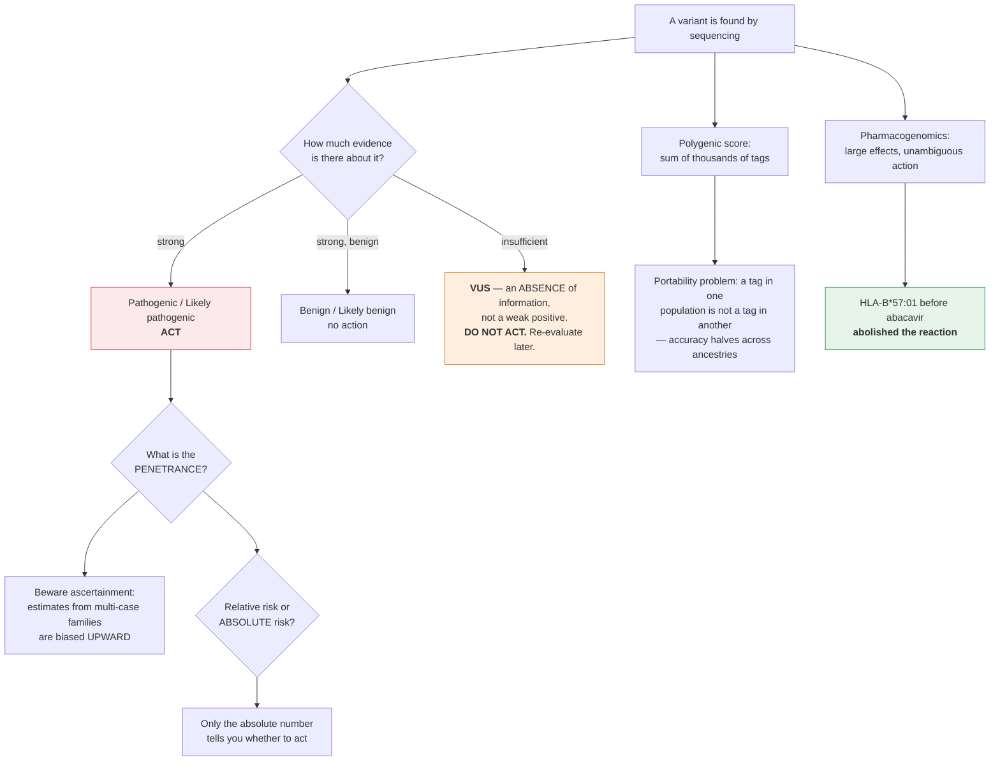

# Genetics · Lesson 4.5: Human genetics — risk, testing & genome medicine

> ⏱ ~15 min · Module 4: Quantitative Genetics, Populations & Genomes · Builds on: [4.4](04-04-linkage-disequilibrium-gwas.md), [1.4](01-04-pedigrees-human-inheritance.md) · Unlocks: end of course

## Why this matters

Every technique in this course now converges on one question: **what can you actually tell a person about their genome?**

The honest answer is more limited than the technology suggests and more useful than the sceptics allow, and the gap between the two is where most clinical genetics lives. A pathogenic *BRCA1* variant changes a woman's management immediately and substantially. A polygenic score for coronary disease shifts a risk estimate by a few percentage points. A variant of uncertain significance changes nothing except how worried everyone is. **Knowing which is which is the skill**, and it rests on Bayes ([1.4](01-04-pedigrees-human-inheritance.md)), on effect sizes ([4.4](04-04-linkage-disequilibrium-gwas.md)), and on the distinction between relative and absolute risk.

## The idea

**Penetrance, not "the gene for."** For a variant to be clinically useful you need to know **what fraction of carriers develop the condition**, and that number is usually far below 100 percent and usually poorly estimated.

**And penetrance estimates are systematically inflated by ascertainment.** Early estimates come from families identified *because* they had many affected members — so the families studied were selected for high penetrance. As unselected population cohorts have been sequenced, penetrance estimates for many "high-penetrance" variants have fallen substantially.

$$\textbf{The penetrance of a variant depends on how the carriers were found.}$$

**Relative versus absolute risk.** A relative risk of 3 sounds alarming and means very different things at different baselines:

| Baseline risk | RR = 3 | Absolute increase |
|---|---|---|
| 0.1 percent | 0.3 percent | +0.2 points |
| 2 percent | 6 percent | +4 points |
| 20 percent | 60 percent | +40 points |

**Only the absolute number tells you whether to act**, and it is the one least often reported.

**Variant classification: the five-tier system.** Clinical laboratories classify each variant found:

| Class | Meaning | Clinical action |
|---|---|---|
| Pathogenic | causes disease | act |
| Likely pathogenic | ≥90 percent confident | act |
| **VUS** | **variant of uncertain significance** | **do not act** |
| Likely benign | ≥90 percent confident benign | no action |
| Benign | no effect | no action |

**The VUS is the central practical problem of clinical sequencing.** Sequencing anyone finds variants nobody has seen before, and the correct handling — *do nothing, and re-evaluate as evidence accumulates* — is psychologically very hard for patients and clinicians alike. **A VUS is not "a little bit pathogenic."** It is an absence of information, and treating it as a weak positive causes real harm: unnecessary surgery, unnecessary surveillance, and misdirected family testing.

**And VUS rates are ancestry-dependent**, badly. Most variant databases were built from European-ancestry patients, so a variant common and benign in an under-represented population is more likely to be novel to the database and reported as a VUS. **A patient's chance of receiving an uninterpretable result depends on their ancestry**, which is a concrete inequity built into the interpretation infrastructure rather than into the biology.

**Polygenic risk scores sum thousands of small effects.** From [4.4](04-04-linkage-disequilibrium-gwas.md), individual GWAS hits have odds ratios near 1.1 and predict nothing. Summed across the genome, weighted by effect size, they produce a distribution with real spread — the top few percent of a coronary-disease PRS have risk comparable to a monogenic familial hypercholesterolaemia mutation.

**But PRS have a portability problem that is not a detail.** A score derived in European samples loses roughly half or more of its accuracy in African-ancestry individuals, because the score is built from **tag** SNPs whose LD relationship to the causal variants differs between populations ([4.4](04-04-linkage-disequilibrium-gwas.md)). **A tag that works in one population is not a tag in another.**

## The formal version

**Bayes with a test, which is the whole of interpretation.** For a test with sensitivity $\mathrm{Se}$ and specificity $\mathrm{Sp}$ applied to someone with prior probability $\pi$ of carrying a variant:

$$\text{PPV} = P(\text{carrier} \mid \text{positive}) = \frac{\pi\,\mathrm{Se}}{\pi\,\mathrm{Se} + (1-\pi)(1-\mathrm{Sp})}$$

*In words: a positive result's meaning depends on how likely the person was to be a carrier before the test.* This is [1.4](01-04-pedigrees-human-inheritance.md)'s pedigree Bayes with a laboratory assay substituted for a family history, and it is why **population screening and diagnostic testing are different activities with the same technology**.

**The crucial consequence: screening a low-prevalence population produces mostly false positives**, no matter how good the test. This is not a criticism of the test; it is arithmetic, and it is why screening programmes are targeted rather than universal.

**Polygenic scores, formally.**

$$\mathrm{PRS}_i = \sum_{j=1}^{m} \beta_j\, g_{ij}$$

where $g_{ij} \in \{0,1,2\}$ is the count of risk alleles individual $i$ carries at SNP $j$, and $\beta_j$ is the effect size estimated from a GWAS. With $m$ in the hundreds of thousands or millions, and $\beta_j$ shrunk appropriately to handle LD between SNPs.

The resulting score is approximately normally distributed (the central limit theorem again, [4.1](04-01-quantitative-traits-heritability.md)), so an individual's position is naturally reported as a **percentile**. The relationship between percentile and risk is what matters clinically:

$$\text{risk}(x) = \text{baseline} \times \frac{\text{OR}^{x}}{\text{population average of } \mathrm{OR}^{x}}$$

**A PRS explains a fraction of variance, not a fraction of cases.** A score with $R^2 = 0.10$ on the liability scale is genuinely useful epidemiologically and leaves 90 percent of the liability unexplained for any individual.

**Pharmacogenomics — the clearest current win.** A handful of variants have large, actionable effects on drug handling:

| Gene | Drug | Consequence |
|---|---|---|
| *CYP2C19* | clopidogrel | poor metabolizers get no antiplatelet effect — the prodrug is not activated |
| *TPMT*, *NUDT15* | thiopurines | poor metabolizers get life-threatening myelosuppression at standard doses |
| *DPYD* | 5-fluorouracil | deficiency causes severe, sometimes fatal toxicity |
| *HLA-B\*57:01* | abacavir | near-certain hypersensitivity reaction; testing is mandatory |
| *CYP2D6* | codeine | ultrarapid metabolizers convert too much to morphine — fatal in children |

**These work where PRS do not because the effect sizes are large and the action is unambiguous.** *HLA-B\*57:01* testing before abacavir has essentially eliminated abacavir hypersensitivity — a genetic test that abolished a drug reaction, which is the clearest demonstration in the field that genotype-guided prescribing works when the effect is big enough.

**Carrier and prenatal screening.** Expanded carrier screening tests hundreds of recessive conditions in prospective parents; both carriers means a 1-in-4 risk per pregnancy ([1.1](01-01-mendels-laws-probability.md)) and the option of prenatal diagnosis, IVF with preimplantation testing, or informed preparation.

**Non-invasive prenatal testing (NIPT)** sequences cell-free fetal DNA in maternal blood and is excellent for common trisomies — and its performance for **rare** microdeletions illustrates the Bayes point above so sharply that it is worth a worked example.

**Gene therapy, briefly.** Two strategies:

- ***Ex vivo*** — remove the patient's cells, correct them in the laboratory, return them. Works for haematopoietic disease; the corrected cells must have a survival advantage or be given one by conditioning.
- ***In vivo*** — deliver the therapeutic construct into the body, usually with AAV vectors. Limited by immune responses to the vector, by cargo size, and by the fact that AAV does not integrate, so it dilutes out in dividing tissues.

**Approved therapies now exist** for spinal muscular atrophy, some inherited blindness, haemophilia and — via base editing and CRISPR — sickle-cell disease and beta-thalassaemia. The sickle-cell therapy is a nice closing example, because it does not fix the mutation at all: it edits a *regulatory* element to reactivate fetal haemoglobin, using [molecular-cell-biology 4.1](../../molecular-cell-biology/lessons/04-01-chromatin-packaging-regulation.md)'s chromatin logic rather than [3.6](03-06-reading-editing-genes.md)'s repair-dependent correction.

## Picture

**The three branches out of "a variant is found" have completely different value.** Pharmacogenomics works today because the effects are large and the action is clear. Monogenic findings work when penetrance is known and honestly estimated. Polygenic scores shift probabilities modestly and do not transfer between ancestries. **The technology is one thing; the interpretive footing under each use is entirely different.**

## Worked examples

**Example 1 (mechanical — why NIPT for a rare condition mostly reports false positives).** A non-invasive prenatal test for 22q11.2 deletion syndrome has sensitivity 90 percent and specificity 99.9 percent. The condition affects 1 in 4000 pregnancies. (a) Compute the positive predictive value. (b) Compute it for Down syndrome in a 40-year-old, where the prevalence is 1 in 100 and the same test has sensitivity 99 percent and specificity 99.9 percent. (c) Explain the difference and its clinical implication.

(a) Prior $\pi = 1/4000 = 2.5\times10^{-4}$.

$$\text{PPV} = \frac{(2.5\times10^{-4})(0.90)}{(2.5\times10^{-4})(0.90) + (0.99975)(0.001)} = \frac{2.25\times10^{-4}}{2.25\times10^{-4} + 9.998\times10^{-4}} = \frac{2.25\times10^{-4}}{1.2248\times10^{-3}} = \mathbf{0.184}.$$

**Only 18 percent of positive results are true positives** — more than four out of five positives are false, with a test that is 99.9 percent specific.

(b) Prior $\pi = 0.01$.

$$\text{PPV} = \frac{(0.01)(0.99)}{(0.01)(0.99) + (0.99)(0.001)} = \frac{0.0099}{0.0099 + 0.00099} = \frac{0.0099}{0.01089} = \mathbf{0.909}.$$

**Ninety-one percent of positives are true.**

(c) **The test barely changed; the prior changed by a factor of 40, and the PPV changed from 18 percent to 91 percent.**

The mechanism is that false positives scale with the number of *unaffected* pregnancies tested, which is nearly all of them, while true positives scale with prevalence. When prevalence is very low, the (1 − specificity) term dominates the denominator no matter how small it is.

**Clinical implication, and it is the central one in screening:**

- A **screening** result must never be treated as diagnostic. NIPT results for rare microdeletions require confirmation by an invasive diagnostic test (CVS or amniocentesis with a karyotype or microarray) before any irreversible decision.
- **The counselling must include the PPV, not the specificity.** A patient told "this test is 99.9 percent accurate" and given a positive result for a rare condition has been badly misled — the number relevant to them is 18 percent.
- **Expanding a screening panel to rarer conditions makes the panel worse**, in the specific sense that the fraction of its positive results that are true falls as the conditions get rarer. This is a genuine argument against indefinitely expanding NIPT panels, and it is arithmetic rather than opinion.

**Example 2 (why you'd care — a polygenic score in the clinic).** A coronary artery disease PRS is developed in European-ancestry cohorts. Individuals in the top 5 percent have a 3-fold increased risk relative to the population average; population lifetime risk is 10 percent. (a) What is the absolute risk for someone in the top 5 percent? (b) How does that compare with carrying a familial hypercholesterolaemia mutation (roughly 4-fold risk, prevalence 1 in 250)? (c) The score is applied to a patient of African ancestry. What is the concern, and what would you do?

(a) $$0.10 \times 3 = \mathbf{0.30}, \ \text{a 30 percent lifetime risk}.$$

That is a substantial and actionable number — it crosses the threshold at which statin therapy and aggressive risk-factor management are indicated.

(b) $$0.10 \times 4 = \mathbf{0.40} \ \text{for an FH mutation carrier}.$$

**Comparable in magnitude**, and here is the striking part: FH affects 1 in 250 people, while the top 5 percent of the PRS is 1 in 20 — **twelve times as many people carry the polygenic risk as carry the monogenic one.**

$$\textbf{At a population level, the polygenic risk accounts for far more excess disease than the monogenic one.}$$

This is the strongest argument for PRS in cardiovascular medicine, and it inverts the usual intuition that monogenic causes matter more. They matter more *per person* and less *in total*.

(c) **The concern is portability.** The score is a weighted sum of **tag** SNPs, and its predictive accuracy depends on those tags being in LD with the causal variants ([4.4](04-04-linkage-disequilibrium-gwas.md)). LD structure differs between populations — African-ancestry populations have shorter LD blocks — so a tag with $r^2 = 0.8$ to a causal variant in Europeans may have $r^2 = 0.3$ or 0 in an African-ancestry individual.

Measured consequence: PRS accuracy typically falls by **half or more** when transferred to African-ancestry individuals. Allele frequencies also differ, so the score's *distribution* shifts, and a raw score cannot be converted to a percentile using European reference data.

**What to do:**

1. **Do not report a percentile** derived from a European reference distribution. It is not interpretable.
2. **Use an ancestry-matched or trans-ancestry score** if one exists, and report the validated accuracy in that ancestry rather than the accuracy in the discovery cohort.
3. **Fall back on the well-validated clinical risk factors** — lipids, blood pressure, smoking, diabetes, family history — which transfer across ancestries far better than a PRS does. Family history in particular captures much of what a PRS captures, without the portability problem.
4. **Say so.** The honest statement is "this score has not been validated in your ancestry group and I cannot give you a reliable number from it," which is more useful than a confidently wrong percentile.

**The equity dimension is not incidental.** The under-representation of non-European ancestries in GWAS is the direct cause, and it means the benefits of polygenic prediction accrue disproportionately to the populations already best-served by genomic medicine. Fixing it requires more diverse discovery cohorts — which is also, from [4.4](04-04-linkage-disequilibrium-gwas.md), the fastest route to fine-mapping causal variants. **The scientific and equity arguments point the same way**, which is fortunate and not always the case.

## Watch out

- **You might treat a screening result as diagnostic.** PPV depends on prevalence, and for rare conditions most positives are false even with an excellent test. Confirmation is mandatory before irreversible action.
- **You might act on a VUS.** A VUS means *there is not enough evidence*, not *probably pathogenic*. Acting on one causes real harm, and VUS rates are higher for patients from under-represented ancestries.
- **You might quote a relative risk.** Only absolute risk tells a patient whether to do anything. A tripled risk of a 0.1 percent condition is still 0.3 percent.
- **You might trust an early penetrance estimate.** Estimates from multi-case families are biased upward by ascertainment, sometimes by a large factor, and have fallen substantially as unselected cohorts have been sequenced.
- **You might apply a PRS across ancestries.** It is built from tags, and tags do not transfer. Report a score only in an ancestry where it has been validated.
- **You might think a negative result means no risk.** A negative gene panel excludes the variants tested in the genes tested — not disease risk, and not variants in genes nobody has yet associated with the condition.

## One-liner

> The same sequencing produces a finding that should change management, a score that shifts a probability a few points and does not transfer between populations, and a VUS that means nothing at all — and telling them apart is Bayes, effect size, and absolute risk.

## Problems

**P1 (🟢)** A carrier screening test has sensitivity 95 percent and specificity 99 percent. It is applied to a condition with a carrier frequency of 1 in 25. (a) Compute the PPV. (b) Repeat for a condition with carrier frequency 1 in 500. (c) State the general lesson in one sentence.

**P2 (🟡)** A woman is found to carry a pathogenic *BRCA1* variant. Early family-based studies estimated lifetime breast cancer penetrance at 85 percent; a large unselected population cohort estimates 60 percent. (a) Explain the discrepancy. (b) Which figure should be used for counselling, and why? (c) Her lifetime risk of breast cancer without the variant would be 12 percent. Compute the relative risk implied by each penetrance estimate, and comment on which number is more useful to her.

**P3 (🔴, synthesis — bridges the whole course)** A 35-year-old man has a family history of early coronary disease and asks for genetic testing. Sequencing finds: (i) no pathogenic variants in familial hypercholesterolaemia genes; (ii) a VUS in *LDLR*; (iii) a coronary-disease PRS at the 92nd percentile of a European reference distribution — and the patient is of South Asian ancestry. His LDL cholesterol is 4.8 mmol/L. (a) How should each of the three genetic findings be handled? (b) Which single piece of information in the whole case is most predictive, and why? (c) Write the two-sentence summary you would give him.

Solutions

**P1 (a)** Prior $\pi = 1/25 = 0.04$.

$$\text{PPV} = \frac{(0.04)(0.95)}{(0.04)(0.95) + (0.96)(0.01)} = \frac{0.038}{0.038 + 0.0096} = \frac{0.038}{0.0476} = \mathbf{0.798}.$$

About **80 percent** of positives are true.

**(b)** Prior $\pi = 1/500 = 0.002$.

$$\text{PPV} = \frac{(0.002)(0.95)}{(0.002)(0.95) + (0.998)(0.01)} = \frac{0.0019}{0.0019 + 0.00998} = \frac{0.0019}{0.01188} = \mathbf{0.160}.$$

Only **16 percent** of positives are true.

**(c)** **The same test means completely different things at different prevalences — a positive result's value is set by the prior, not by the test's accuracy.** Screening for rare conditions generates mostly false positives, which is why panels are targeted by ancestry and family history rather than applied universally.

**P2 (a)** **Ascertainment bias.** The early estimate came from families identified *because* they had multiple affected members across generations — such families were noticed by clinicians precisely because the variant was behaving with high penetrance in them, whether through modifier genes, shared environment, or chance.

The population cohort ascertained carriers **without reference to their phenotype**, so it includes the many carriers who never developed disease and never came to attention. **The two studies are estimating penetrance in two different, non-comparable populations of carriers**, and the family-based one is selected for the high tail.

**(b)** **The population estimate, 60 percent**, for a woman found through population or cascade screening rather than through a heavily affected family.

The logic is that counselling should use the penetrance estimated in a population resembling the person in front of you. If she was identified through a family with many affected relatives, her risk really is higher than 60 percent — her family's modifiers and environment are shared — and an intermediate figure is appropriate.

**The general rule: the correct penetrance depends on how the carrier was ascertained**, which is Bayes again — family history is additional evidence, and it should raise the estimate above the population baseline rather than being ignored.

**(c)** Baseline 12 percent.

$$\text{RR from 85 percent}: \frac{0.85}{0.12} = \mathbf{7.1}, \qquad \text{RR from 60 percent}: \frac{0.60}{0.12} = \mathbf{5.0}.$$

**Which number is more useful to her: neither relative risk. The absolute one.**

A relative risk of 5 versus 7 is a difference she cannot act on. What she can act on is that her lifetime risk is **60 percent rather than 12 percent** — and that number determines whether she considers risk-reducing mastectomy, whether she starts MRI surveillance at 30, and how she talks to her sisters and daughters.

**Relative risk is the epidemiologist's summary; absolute risk is the patient's decision variable.** This is the same distinction as Example 2 and it recurs constantly.

**P3 (a)**

**(i) No pathogenic FH variant.** This **lowers** the probability of monogenic familial hypercholesterolaemia but does not exclude it — panels cover known genes and known variant types, and roughly 20–40 percent of clinically diagnosed FH cases have no identifiable variant. It also says nothing at all about polygenic risk. Report it as a negative for the specific conditions tested, and explicitly not as a clean bill of health.

**(ii) The VUS in *LDLR*.** **Do nothing with it.** A VUS is an absence of evidence, not weak evidence. Specifically:

- Do **not** use it to diagnose FH.
- Do **not** offer cascade testing to relatives on the basis of it — testing relatives for a VUS generates anxiety and no information, since a relative who also carries it learns nothing.
- **Do** re-contact the laboratory periodically; VUS are reclassified as databases grow, and roughly 5–10 percent are eventually resolved in either direction.
- Segregation analysis in the family *can* provide evidence, but only if there are enough affected and unaffected relatives to be informative.

**(iii) The PRS at the 92nd percentile.** **Not interpretable as reported.** The percentile comes from a European reference distribution, and the patient is South Asian. Both the score's *accuracy* and its *distribution* differ across ancestries ([4.4](04-04-linkage-disequilibrium-gwas.md)), so "92nd percentile" is a statement about where he would fall in a population he is not from.

The correct handling is either to use a score validated in South Asian populations and report that percentile with its validated accuracy, or to say clearly that this result cannot be interpreted for him.

*(A relevant complication worth noting: South Asian populations have substantially elevated coronary disease risk that standard European-derived risk equations underestimate — so this is a setting where ancestry-specific calibration matters for the clinical risk score too, not only for the PRS.)*

**(b)** **The LDL cholesterol of 4.8 mmol/L, together with the family history of early coronary disease.**

Reasons:

- **It is a direct measurement of the causal quantity.** Every genetic finding in this case is an attempt to predict LDL and its consequences; the LDL has been measured. Genetics predicts the phenotype, and the phenotype is in hand.
- **It integrates everything.** A patient's LDL already reflects their FH variants (if any), their polygenic burden, and their environment. There is no genetic result that adds much to a measured LDL for the purpose of deciding on treatment.
- **Family history is itself a genetic test with perfect portability.** It captures shared variants of every frequency and effect size — common and rare, coding and regulatory, known and unknown — with no ancestry bias whatsoever. **A well-taken family history outperforms most polygenic scores and costs nothing.**

**This is the honest and slightly deflating conclusion of the module:** for a common disease with a measurable intermediate phenotype, the genetics adds relatively little to good clinical medicine. It adds most where there is *no* measurable intermediate — predicting disease decades before onset, or guiding a drug choice where the phenotype only reveals itself as toxicity.

**(c)** Two sentences:

> "Your cholesterol is high and you have a strong family history of early heart disease, and those two facts together are the important ones — they mean you should be on treatment and managing your other risk factors now, regardless of any genetic result. The genetic testing did not find a definite cause: there is one variant we cannot yet interpret, which we should not act on but will re-check in a few years, and the risk score is not reliable for people of your ancestry, so I am not going to give you a number from it."

**What that summary does right:** it leads with the actionable finding, it does not let the genetics displace the clinical picture, it names the VUS honestly as uninterpretable rather than reassuring or alarming, and it says plainly that the PRS cannot be used for him rather than reporting a percentile that would be confidently wrong.

## Flashback

**From Lesson 4.4 (GWAS effect sizes and stratification):** A GWAS finds a variant with $p = 2\times10^{-11}$ and odds ratio 1.12 for a disease with 5 percent lifetime risk. (a) Is it genome-wide significant? (b) Compute the absolute risk for a homozygous carrier and comment on clinical utility. (c) The study's genomic inflation factor is $\lambda_{GC} = 1.4$. What does that indicate and what should have been done?

Solution

**(a)** **Yes** — the threshold is $5\times10^{-8}$, and $2\times10^{-11}$ is roughly 2500 times more extreme.

**(b)** Homozygote odds ratio $= 1.12^{2} = 1.254$. At a 5 percent baseline, odds and risk are close enough:

$$0.05 \times 1.254 = \mathbf{0.0627}, \ \text{i.e. } 6.3\ \text{percent versus } 5\ \text{percent}.$$

**Clinical utility: essentially none for this variant alone.** An absolute risk difference of 1.3 percentage points changes no management decision. The finding is scientifically valuable — it names a locus and, with follow-up, possibly a pathway — and predictively negligible for an individual.

**(c)** $\lambda_{GC} = 1.4$ means the **median** test statistic across the whole genome is 40 percent higher than expected under the null.

**No single causal locus can do that.** A real association inflates a handful of correlated statistics near one position and leaves the median untouched. A genome-wide median shift means something is inflating *every* test — almost always **population stratification** ([4.3](04-03-inbreeding-relatedness-structure.md)), or occasionally cryptic relatedness or a systematic genotyping-batch difference between cases and controls.

**What should have been done:**

1. **Compute principal components** from genome-wide markers and include the leading ones as covariates, which removes the ancestry axis from the association test.
2. Or fit a **linear mixed model** using a genetic relatedness matrix, which handles both stratification and cryptic relatedness in one step.
3. **Re-check $\lambda_{GC}$ after correction** — it should fall to near 1. If it does not, the problem is not ancestry and the genotyping and QC pipeline should be examined.
4. **Check whether the reported hit survives.** Any signal that disappears once PCs are included was stratification, not biology — which was the fate of a great many pre-2007 candidate-gene associations.

## Connections

- **Backward:** [1.4](01-04-pedigrees-human-inheritance.md)'s Bayes is the whole of test interpretation with a laboratory assay replacing a pedigree; [4.4](04-04-linkage-disequilibrium-gwas.md)'s tags are what a polygenic score is made of, and why it does not transfer; [4.3](04-03-inbreeding-relatedness-structure.md)'s structure is the reason for both the stratification correction and the portability failure.
- **Forward:** [computational-biology](../../computational-biology/syllabus.md) takes up the algorithms behind variant calling, imputation and fine-mapping; [evolution-ecology](../../evolution-ecology/syllabus.md) explains why allele frequencies differ between populations in the first place.
- **Sideways:** the editing tools that make gene therapy possible are [3.6](03-06-reading-editing-genes.md) and [molecular-cell-biology 3.3](../../molecular-cell-biology/lessons/03-03-double-strand-breaks-hr-nhej.md); the sickle-cell therapy that reactivates fetal haemoglobin works through [molecular-cell-biology 4.1](../../molecular-cell-biology/lessons/04-01-chromatin-packaging-regulation.md)'s chromatin logic rather than by correcting the mutation.
