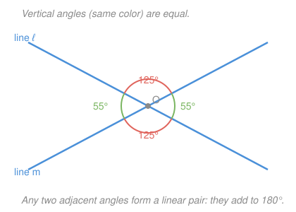

# Euclidean Geometry · Lesson 1.1: Points, lines, planes & angles

> ⏱ ~15 min · Module 1: Foundations & the art of proof · Builds on: nothing (course start) · Unlocks: 1.2 (deductive proof & two-column reasoning)

## Why this matters

Every geometric argument you'll ever write starts by naming a few objects and agreeing on a handful of rules for them. Get sloppy here and every proof downstream inherits the rot; get it clean and the rest of the course is just careful bookkeeping. The immediate payoff is concrete: by the end of this lesson you can look at two crossing lines, read off which angles must be equal and which must sum to a straight angle, and solve for an unknown — the single most reused move in all of plane geometry, and the reflex behind directions in physics and angle measure in `trigonometry`.

## The idea

Geometry is built like a game, and every game needs pieces you don't try to define — you just point at them. A **point** is a location with no size (a dot). A **line** is perfectly straight, infinitely long, infinitely thin (a taut thread going both ways forever). A **plane** is a flat sheet extending forever in every direction (an endless tabletop). Nobody defines these from anything simpler; they're the primitives, and everything else is built on top.

From those you *build* named objects. Mark two points and keep only what's between them: a **segment**. Keep one endpoint and shoot off to infinity through the other: a **ray**. Pin two rays at a shared endpoint and the opening between them is an **angle** — and an angle's whole job is to measure *turning*: how far you'd swing one ray to lie on top of the other. That turning is what a protractor reads in degrees, from a barely-open $0^\circ$ to a half-turn $180^\circ$.

The one fact that does all the work: **a straight line is a $180^\circ$ turn.** So whenever angles sit side by side along a straight line, their measures must add up to $180^\circ$. That single constraint is where nearly every angle computation comes from.

## The formal version

**Ruler postulate.** The points of a line can be matched with the real numbers so that any point is a "coordinate," and the **distance** between two points is the absolute value of the difference of their coordinates. In words: a ruler lets us turn geometry into arithmetic — length is just subtraction. If $A$ and $B$ sit at coordinates $a$ and $b$, then $AB = |a - b|$.

**Protractor postulate.** Rays from a common vertex can be matched with numbers from $0$ to $180$, and the **measure** of the angle between two rays is the absolute difference of their numbers. In words: a protractor does for turning what a ruler does for length. We write $m\angle AOB$ for "the measure of angle $AOB$," with vertex $O$ named in the middle.

**Angle addition postulate.** If a ray $OB$ lies in the interior of $\angle AOC$, then $m\angle AOB + m\angle BOC = m\angle AOC$. In words: adjacent angles that share a side just add.

**Classifying by measure.** An angle is **acute** if $0^\circ < m < 90^\circ$, **right** if $m = 90^\circ$, **obtuse** if $90^\circ < m < 180^\circ$, and **straight** if $m = 180^\circ$.

**The four angle relationships.**
- **Complementary:** two angles with measures summing to $90^\circ$.
- **Supplementary:** two angles with measures summing to $180^\circ$.
- **Linear pair:** two adjacent angles whose non-shared sides form a straight line. A linear pair is *always* supplementary — this is a special case of the angle-addition postulate along a $180^\circ$ line, not a separate assumption.
- **Vertical angles:** the two opposite (non-adjacent) angles formed by two intersecting lines. Vertical angles are *always* equal in measure — you'll prove exactly why in Lesson 1.2.

## Picture

Two lines cross at $O$. The two red angles are a vertical pair, so they share a measure ($125^\circ$); the two green angles are the other vertical pair ($55^\circ$). Any red-and-green neighbor is a linear pair sitting along a straight line, and indeed $125^\circ + 55^\circ = 180^\circ$.

## Worked examples

**Example 1 (mechanical).** An angle measures $35^\circ$.

- Classify it: since $0^\circ < 35^\circ < 90^\circ$, it is **acute**.
- Its **complement** is what's left to reach $90^\circ$: $90^\circ - 35^\circ = 55^\circ$.
- Its **supplement** is what's left to reach $180^\circ$: $180^\circ - 35^\circ = 145^\circ$.

That's the entire mechanic — "complement" and "supplement" are just $90^\circ$ minus and $180^\circ$ minus. Note a complement need not sit next to the angle; the words describe an arithmetic relationship between two measures, not a picture.

**Example 2 (why you'd care).** Two lines cross, and one of the four angles is labeled $(2x + 40)^\circ$ while the angle *right next to it* (its linear-pair partner) is labeled $(6x)^\circ$. Find $x$ and both angles.

A linear pair is supplementary, so their measures add to $180^\circ$:
$$(2x + 40) + 6x = 180 \quad\Longrightarrow\quad 8x + 40 = 180 \quad\Longrightarrow\quad 8x = 140 \quad\Longrightarrow\quad x = 17.5.$$
Then the two angles are $2(17.5) + 40 = 75^\circ$ and $6(17.5) = 105^\circ$. Check: $75^\circ + 105^\circ = 180^\circ$. ✓ The angle *vertical* to the $75^\circ$ one is also $75^\circ$, and by the same logic the last angle is $105^\circ$ — so labeling one angle in a crossing pins down all four. This "set the sum equal to $180^\circ$ and solve" is the workhorse of the whole module.

## Watch out

- You might think complementary and supplementary angles must be drawn touching. **Not so** — the terms only compare *measures*. A $30^\circ$ angle on one page and a $60^\circ$ angle on another are complementary. (A *linear pair*, by contrast, is defined geometrically: the angles really must be adjacent and share a side.)
- You might think vertical angles are the ones stacked vertically. **No** — "vertical" comes from *vertex*, not from up-and-down. They're the pair that sit across the crossing point from each other, in any orientation.
- You might read $m\angle AOB$ as naming the vertex first. **The middle letter is always the vertex.** $\angle AOB$ and $\angle BOA$ are the same angle (vertex $O$); $\angle OAB$ is a different angle entirely (vertex $A$).

## One-liner

> A straight line is a $180^\circ$ turn — so angles along a line add to $180^\circ$, angles across a crossing match, and almost every unknown angle falls out of those two facts.

## Problems

**P1 (🟢)** An angle measures $62^\circ$. Classify it, then state its complement and its supplement.

**P2 (🟡)** Two lines intersect. One angle measures $(3x + 18)^\circ$ and the angle *vertical* to it measures $(5x - 22)^\circ$. Find $x$, then give the measures of all four angles at the intersection.

**P3 (🔴, optional)** A robot sits at point $O$ facing due east and turns counterclockwise to end up facing due north — a $90^\circ$ turn in total. It does this in two stages: a first turn of $(3y + 4)^\circ$ immediately followed by a second turn of $(y + 6)^\circ$. Find $y$ and each turn, and name the relationship between the two turns.

Solutions

**P1** Since $0^\circ < 62^\circ < 90^\circ$, the angle is **acute**. Complement: $90^\circ - 62^\circ = 28^\circ$. Supplement: $180^\circ - 62^\circ = 118^\circ$.

**P2** Vertical angles are equal, so set the measures equal:
$$3x + 18 = 5x - 22 \;\Longrightarrow\; 40 = 2x \;\Longrightarrow\; x = 20.$$
Each of that vertical pair measures $3(20) + 18 = 78^\circ$ (check: $5(20) - 22 = 78^\circ$ ✓). The other two angles are each a linear pair with a $78^\circ$ angle, so they measure $180^\circ - 78^\circ = 102^\circ$. The four angles are $78^\circ,\ 102^\circ,\ 78^\circ,\ 102^\circ$ going around the crossing.

**P3** The two turns are adjacent and together make up the $90^\circ$ swing from east to north, so by the angle-addition postulate they sum to $90^\circ$:
$$(3y + 4) + (y + 6) = 90 \;\Longrightarrow\; 4y + 10 = 90 \;\Longrightarrow\; 4y = 80 \;\Longrightarrow\; y = 20.$$
First turn: $3(20) + 4 = 64^\circ$. Second turn: $20 + 6 = 26^\circ$. Check: $64^\circ + 26^\circ = 90^\circ$ ✓. Because they add to $90^\circ$, the two turns are **complementary**.

## Flashback

*(None — course start.)*

## Connections

- **Forward:** Lesson 1.2 takes the vertical-angle *fact* you used freely here and *proves* it in a two-column format — the linear-pair relationship is the key step. Lesson 1.3 then unleashes these same angle pairs on parallel lines cut by a transversal.
- **Sideways (physics):** an angle is a measure of turning, which is exactly how directions, bearings, and rotations are specified in mechanics — P3 is a rotation problem in disguise.
- **Sideways (trigonometry):** the degree measure defined here by the protractor postulate is the raw input that `trigonometry` feeds into sine and cosine; every angle you classify now becomes an argument of a trig function later.
