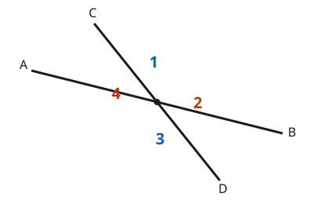

# Euclidean Geometry · Lesson 1.2: Deductive proof & two-column reasoning

> ⏱ ~15 min · Module 1: Foundations & the art of proof · Builds on: 1.1 (points, lines, planes & angles) · Unlocks: 1.3 (parallel lines & angle relationships)

## Why this matters

Up to now geometry has been *measuring* — read the protractor, plug into a formula. A proof is the opposite move: you show a fact must hold for **every** figure of a given kind, without measuring a single one. That's the skill physics and economics quietly demand — a conservation law or an equilibrium condition is a theorem, not a data point — and the two-column proof is the cleanest place to build the reflex. Master the format here and every later theorem in this course is just this pattern with more steps. It's your first taste of the rigor `proofs-primer` formalizes.

## The idea

A proof is a game with a strict rule: **you may only write down a statement if you can name why it's forced.** No "looks like it," no measuring. You start from what you're *given*, and each new line follows from the ones above it by a reason you're allowed to cite.

There are exactly four kinds of reason you'll ever cite:

- a **definition** (what a word means — e.g. "a right angle is $90^\circ$"),
- a **postulate** (a rule we accept without proof — Euclid's starting assumptions),
- an **algebraic property** (if $a=b$ then $a+c=b+c$, and friends), or
- a **theorem already proved** (a fact earned earlier, now reusable).

Picture it as building with certified blocks. Definitions and postulates are the blocks the factory ships you for free; every theorem is a block *you* certified, which you may now stack on. A two-column proof is just the inspection log: left column, the block you placed; right column, the certification stamp.

## The formal version

**Definition vs. postulate vs. theorem.** A **definition** fixes the meaning of a term. A **postulate** (or axiom) is a statement accepted as true without proof — the ground floor. A **theorem** is a statement *proved* true from definitions, postulates, and earlier theorems.

**Anatomy of a statement.** Nearly every theorem is an "if–then": *If* $P$, *then* $Q$. The hypothesis $P$ is what you're **given**; the conclusion $Q$ is what you must **prove**. In words: the hypothesis is your starting blocks, the conclusion is the block you're trying to certify. Stripping a claim into "given $P$ / prove $Q$" is the first thing you do, every time.

**The two-column format.** A table. Left column: **Statements**, a numbered chain ending in the conclusion. Right column: **Reasons**, one justification per statement, each a definition, postulate, algebraic property, or prior theorem. Line 1 is almost always "Given."

**The Angle-Addition Postulate.** If point $B$ lies in the interior of $\angle AOC$, then
$$m\angle AOB + m\angle BOC = m\angle AOC.$$
In words: adjacent angle measures add, exactly like adjacent segment lengths add. Here $m\angle AOB$ means "the measure of angle $AOB$" in degrees. This is the postulate that lets you turn a picture of side-by-side angles into an *equation* — and once you have an equation, algebra takes over.

## Picture

Two lines cross at a point, cutting the plane into four angles. $\angle 1$ and $\angle 3$ sit opposite each other (a **vertical pair**); so do $\angle 2$ and $\angle 4$. $\angle 1$ and $\angle 2$ are **adjacent** and together form a straight line — a **linear pair**. This is the figure the worked proof below argues over: we'll show $\angle 1 \cong \angle 3$ using only the fact that each shares a straight line with $\angle 2$.

## Worked examples

**Example 1 (mechanical — algebra as a reason).** Ray $OB$ splits $\angle AOC$, with $m\angle AOB = 2x+10$, $m\angle BOC = x+5$, and $m\angle AOC = 60^\circ$. Prove $x = 15$.

| Statements | Reasons |
|---|---|
| 1. $B$ is in the interior of $\angle AOC$; $m\angle AOB = 2x+10$, $m\angle BOC = x+5$, $m\angle AOC = 60$ | 1. Given |
| 2. $m\angle AOB + m\angle BOC = m\angle AOC$ | 2. Angle-Addition Postulate |
| 3. $(2x+10) + (x+5) = 60$ | 3. Substitution |
| 4. $3x + 15 = 60$ | 4. Combine like terms |
| 5. $3x = 45$ | 5. Subtraction property of equality |
| 6. $x = 15$ | 6. Division property of equality |

Notice every algebraic step earns its own line and its own named reason. In a proof, "$3x=45$ so $x=15$" is not one move — it's the *division property of equality*, cited.

**Example 2 (why you'd care — vertical angles are congruent).** This is a genuine theorem, the first you'll reuse constantly. Referring to the figure: **Given** two lines intersecting so that $\angle 1$ and $\angle 3$ are vertical angles. **Prove** $\angle 1 \cong \angle 3$.

The idea before the formalism: $\angle 1$ and $\angle 2$ make a straight line, so they sum to $180^\circ$. But $\angle 3$ and $\angle 2$ *also* make a straight line, so they too sum to $180^\circ$. Two things equal to "$180$ minus $\angle 2$" must equal each other — so $\angle 1 = \angle 3$. The whole proof is that sentence, formalized:

| Statements | Reasons |
|---|---|
| 1. Two lines intersect forming $\angle 1$, $\angle 2$, $\angle 3$ as shown | 1. Given |
| 2. $\angle 1$ and $\angle 2$ form a linear pair; $\angle 3$ and $\angle 2$ form a linear pair | 2. Definition of a linear pair (adjacent angles whose non-shared sides form a line) |
| 3. $m\angle 1 + m\angle 2 = 180$ and $m\angle 3 + m\angle 2 = 180$ | 3. Linear Pair Postulate (angles in a linear pair are supplementary) |
| 4. $m\angle 1 + m\angle 2 = m\angle 3 + m\angle 2$ | 4. Substitution (both equal $180$) |
| 5. $m\angle 1 = m\angle 3$ | 5. Subtraction property of equality (subtract $m\angle 2$) |
| 6. $\angle 1 \cong \angle 3$ | 6. Definition of congruent angles (equal measure) |

Line 6 is worth pausing on: $m\angle 1 = m\angle 3$ is a statement about *numbers*; $\angle 1 \cong \angle 3$ is a statement about *angles*. The definition of congruence is the bridge, and skipping it is the single most common way a beginner's proof "ends one line early."

## Watch out

- **You might think a picture that looks right is proof enough — it isn't.** Two angles that *look* equal, or a point that *looks* like a midpoint, count for nothing until a reason forces it. The figure guides your intuition; only the reasons carry the argument.
- **You might think you can cite a fact because it's "obvious" — you can only cite the four kinds.** If your reason isn't a definition, postulate, algebraic property, or already-proved theorem, it's not yet allowed. "Vertical angles are equal" is a legal reason *after* Example 2, and illegal before it.
- **You might think congruent ($\cong$) and equal ($=$) are interchangeable — keep them apart.** Write $=$ between *measures* ($m\angle 1 = m\angle 3$) and $\cong$ between *figures* ($\angle 1 \cong \angle 3$). The last line of a congruence proof almost always converts one to the other by definition.

## One-liner

> A two-column proof is a chain where every link is a statement and every statement wears the name of the rule that forces it — definition, postulate, algebra, or a theorem you already earned.

## Problems

**P1 (🟢)** Ray $OB$ is in the interior of $\angle AOC$ with $m\angle AOB = 40^\circ$ and $m\angle AOC = 105^\circ$. Write a short two-column proof that $m\angle BOC = 65^\circ$. Name the postulate and the algebraic property you use.

**P2 (🟡)** In the figure, $\angle 1$ and $\angle 2$ are a linear pair, and $m\angle 1 = 3x + 10$, $m\angle 2 = 5x - 30$. Prove $x = 25$, giving a reason for every line.

**P3 (🔴, optional)** Prove the theorem **"if two angles are each supplementary to the *same* angle, then they are congruent."** (Given: $\angle A$ and $\angle C$ are both supplementary to $\angle B$. Prove: $\angle A \cong \angle C$.) Notice this is Example 2 with the specifics stripped away — vertical angles are just one instance of it.

Solutions

**P1**

| Statements | Reasons |
|---|---|
| 1. $B$ interior to $\angle AOC$; $m\angle AOB = 40$, $m\angle AOC = 105$ | 1. Given |
| 2. $m\angle AOB + m\angle BOC = m\angle AOC$ | 2. Angle-Addition Postulate |
| 3. $40 + m\angle BOC = 105$ | 3. Substitution |
| 4. $m\angle BOC = 65$ | 4. Subtraction property of equality |

**P2**

| Statements | Reasons |
|---|---|
| 1. $\angle 1$, $\angle 2$ form a linear pair; $m\angle 1 = 3x+10$, $m\angle 2 = 5x-30$ | 1. Given |
| 2. $m\angle 1 + m\angle 2 = 180$ | 2. Linear Pair Postulate (linear pairs are supplementary) |
| 3. $(3x+10) + (5x-30) = 180$ | 3. Substitution |
| 4. $8x - 20 = 180$ | 4. Combine like terms |
| 5. $8x = 200$ | 5. Addition property of equality |
| 6. $x = 25$ | 6. Division property of equality |

(As a check: $m\angle 1 = 3(25)+10 = 85^\circ$ and $m\angle 2 = 5(25)-30 = 95^\circ$, and $85 + 95 = 180$. ✓)

**P3**

| Statements | Reasons |
|---|---|
| 1. $\angle A$ and $\angle C$ are each supplementary to $\angle B$ | 1. Given |
| 2. $m\angle A + m\angle B = 180$ and $m\angle C + m\angle B = 180$ | 2. Definition of supplementary angles |
| 3. $m\angle A + m\angle B = m\angle C + m\angle B$ | 3. Substitution (both equal $180$) |
| 4. $m\angle A = m\angle C$ | 4. Subtraction property of equality (subtract $m\angle B$) |
| 5. $\angle A \cong \angle C$ | 5. Definition of congruent angles |

This is the **Congruent Supplements Theorem**. Vertical angles are the special case where the "same angle $\angle B$" is the one adjacent to both — which is exactly why Example 2's proof reads identically.

## Flashback

*(None — course start; flashbacks begin at Lesson 1.3.)*

## Connections

- **Backward:** the angle vocabulary from Lesson 1.1 (linear pair, supplementary, vertical, congruent) supplies every *reason* you cited here. A proof is only as sharp as the definitions feeding it.
- **Forward:** Lesson 1.3 proves the parallel-line angle relationships with this exact machinery, and Lesson 2.1 uses it to prove triangles congruent (SSS, SAS, …). Every theorem for the rest of the course is a longer two-column table — the format never changes, only the length.
- **Sideways (logic everywhere):** "given $P$, prove $Q$, justify each step" is the skeleton of every rigorous argument — an $\varepsilon$–$\delta$ proof in `proofs-primer`, a derivation in physics, an equilibrium argument in economics. Geometry just makes the chain visible in a table.
