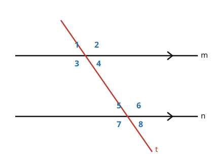

# Euclidean Geometry · Lesson 1.3: Parallel lines & angle relationships

> ⏱ ~15 min · Module 1: Foundations & the art of proof · Builds on: 1.1 (points, lines, planes & angles) · Unlocks: 2.1 (triangle congruence & isosceles triangles)

## Why this matters

The moment a single straight line crosses two parallels, a whole grid of equal and supplementary angles snaps into existence — and almost every classical theorem cashes in on it. The triangle angle-sum ($180^\circ$), the properties of parallelograms, why a staircase's steps stay parallel: all of them are one clever parallel line away. Master the eight angles a transversal makes and you get two powers at once — *computing* an unknown angle from a known one, and *proving* two lines are parallel without ever measuring them.

## The idea

Draw two lines and cut across both with a third line — the **transversal**. At each crossing you get the usual four angles, so eight in total. Here's the payoff: **when the two lines are parallel, the transversal hits them at the exact same tilt both times.** So the four angles at the top intersection are a perfect copy of the four at the bottom — just slid down the transversal. That single fact ("same tilt, same angles") is the whole lesson. Every named relationship below is just a different way of pointing at "this angle up top equals (or fills out) that angle down below."

If the lines are *not* parallel, the tilts differ and the copies break. Which is exactly why matching angles can be used *backwards*: see the copy, conclude the lines are parallel.

## The formal version

A **transversal** is a line that intersects two other lines at two distinct points. The eight angles it creates are named by where they sit (see the picture: 1–4 at the top crossing, 5–8 at the bottom). Two useful groupings:

- **Interior** angles lie *between* the two lines (angles 3, 4, 5, 6); **exterior** angles lie outside them (1, 2, 7, 8).

The four relationships, for lines $m$ and $n$ cut by transversal $t$:

- **Corresponding** — same position at each crossing (1 & 5, 2 & 6, 3 & 7, 4 & 8).
- **Alternate interior** — interior, opposite sides of $t$ (3 & 6, 4 & 5).
- **Alternate exterior** — exterior, opposite sides of $t$ (1 & 8, 2 & 7).
- **Co-interior** (same-side interior) — interior, *same* side of $t$ (3 & 5, 4 & 6).

**Parallel Postulate (angle form).** If $m \parallel n$, then each pair of corresponding angles is congruent.

In words: parallel lines force the matching angles to be equal — this is taken as a starting assumption, not proved. From it, the rest follow in one step each (via vertical angles and linear pairs from Lesson 1.1):

$$m \parallel n \;\Longrightarrow\; \text{corresponding} =,\quad \text{alt. interior} =,\quad \text{alt. exterior} =,\quad \text{co-interior sum} = 180^\circ.$$

**The converse (the real workhorse).** Each of these is an *if-and-only-if*. So if *any one* of those angle conditions holds — one pair of corresponding angles equal, or alternate angles equal, or co-interior angles supplementary — then $m \parallel n$.

In words: the angles don't just report parallelism, they *certify* it. Find the equal copy and you've proven the lines never meet.

## Picture

The arrowheads on $m$ and $n$ are the standard mark for "these are parallel." Notice angles 3, 4, 5, 6 are boxed *between* the lines (interior); 1, 2, 7, 8 sit outside (exterior).

## Worked examples

**Example 1 (mechanical — one angle unlocks all eight).** In the figure, $m \parallel n$ and angle $\angle 1 = 108^\circ$. Find the other seven.

At the top crossing, use Lesson 1.1: $\angle 4$ is vertical to $\angle 1$, so $\angle 4 = 108^\circ$. $\angle 2$ and $\angle 3$ each form a linear pair with $\angle 1$, so $\angle 2 = \angle 3 = 180^\circ - 108^\circ = 72^\circ$. Now cross the parallel bridge with corresponding angles: $\angle 5 = \angle 1 = 108^\circ$, $\angle 6 = \angle 2 = 72^\circ$, $\angle 7 = \angle 3 = 72^\circ$, $\angle 8 = \angle 4 = 108^\circ$.

So every angle is either $108^\circ$ or $72^\circ$ — and the two values are supplementary. That's the general pattern: **a transversal on parallel lines produces just two distinct angle measures, and they add to $180^\circ$.** Quick check: co-interior $\angle 4 + \angle 6 = 108^\circ + 72^\circ = 180^\circ$. ✓

**Example 2 (why you'd care — proving parallel).** A draftsman draws transversal $t$ across two lines. The corresponding angles it makes measure $(2x + 30)^\circ$ and $(3x - 10)^\circ$. For what $x$ are the two lines parallel?

By the converse of the parallel postulate, the lines are parallel *exactly when* the corresponding angles are equal:

$$2x + 30 = 3x - 10 \;\Longrightarrow\; x = 40.$$

Then each corresponding angle is $2(40) + 30 = 110^\circ$. The draftsman never has to extend the lines to the horizon to check they never meet — the local angle test settles it. This "certify a global property from a local measurement" move is the seed of the two-column proof you'll write in the boss problem.

## Watch out

- You might think co-interior angles are *equal* like the others — but they're **supplementary** ($\text{sum} = 180^\circ$), because they sit on the same side of the transversal. Only the "alternate" and "corresponding" pairs are equal.
- You might think these equalities hold for *any* two lines and a transversal. They hold **only when the lines are parallel.** Non-parallel lines still make eight angles, but the top and bottom copies no longer match — the whole toolkit switches off.
- You might apply the converse from angles that aren't a genuine pair. Before concluding "parallel," name the relationship precisely: are they really corresponding / alternate / co-interior? An equal pair of *unrelated* angles proves nothing.

## One-liner

> A transversal on parallel lines makes just two angles — one value and its supplement — and any matching pair, read backwards, is a certificate that the lines are parallel.

## Problems

**P1 (🟢)** In the picture, $m \parallel n$ and $\angle 1 = 115^\circ$. Find $\angle 4$, $\angle 5$, and $\angle 6$, naming the relationship you used for each.

**P2 (🟡)** Lines $m \parallel n$ are cut by a transversal. One pair of co-interior (same-side interior) angles measure $(3x + 15)^\circ$ and $(2x + 35)^\circ$. Solve for $x$, then give the measures of all eight angles.

**P3 (🔴, optional)** In a figure like the one above, $\angle 4 = (5x - 12)^\circ$ and $\angle 6 = (3x + 16)^\circ$. (a) Find the value of $x$ that makes $m \parallel n$. (b) Name the theorem (converse form) that justifies the conclusion.

Solutions

**P1** $\angle 4 = 115^\circ$ — **vertical angles** with $\angle 1$. $\angle 5 = 115^\circ$ — **corresponding angles** with $\angle 1$ (parallel lines). $\angle 6 = 180^\circ - 115^\circ = 65^\circ$ — $\angle 6$ forms a **linear pair** with $\angle 5$ (equivalently, $\angle 6$ is co-interior to $\angle 1$, so $180^\circ - 115^\circ$).

**P2** Co-interior angles on parallel lines are supplementary:
$$(3x + 15) + (2x + 35) = 180 \;\Longrightarrow\; 5x + 50 = 180 \;\Longrightarrow\; x = 26.$$
The two angles are $3(26) + 15 = 93^\circ$ and $2(26) + 35 = 87^\circ$ (check: $93 + 87 = 180$ ✓). Every angle is one of these two values: four measure $93^\circ$ and four measure $87^\circ$. Concretely, taking $\angle 3 = 93^\circ$ and $\angle 5 = 87^\circ$ as the given co-interior pair: $\angle 3 = \angle 2 = \angle 6 = \angle 7 = 93^\circ$ and $\angle 1 = \angle 4 = \angle 5 = \angle 8 = 87^\circ$.

**P3** (a) $\angle 4$ and $\angle 6$ are **co-interior** (both interior, both on the right side of the transversal), so they must be supplementary for the lines to be parallel:
$$(5x - 12) + (3x + 16) = 180 \;\Longrightarrow\; 8x + 4 = 180 \;\Longrightarrow\; x = 22.$$
Then $\angle 4 = 5(22) - 12 = 98^\circ$ and $\angle 6 = 3(22) + 16 = 82^\circ$ (check: $98 + 82 = 180$ ✓).
(b) The **converse of the same-side (co-interior) interior angles theorem**: if a transversal makes a pair of co-interior angles supplementary, the two lines are parallel.

## Flashback

**From Lesson 1.1 (Points, lines, planes & angles):** Two lines intersect. One of the four angles measures $(3x - 10)^\circ$, and the angle *vertical* to it measures $(x + 50)^\circ$. Find $x$, then find the measure of an angle that forms a linear pair with it.

Solution

Vertical angles are congruent, so
$$3x - 10 = x + 50 \;\Longrightarrow\; 2x = 60 \;\Longrightarrow\; x = 30.$$
The angle measures $3(30) - 10 = 80^\circ$. An adjacent angle forms a **linear pair** with it, so the two are supplementary:
$$180^\circ - 80^\circ = 100^\circ.$$

## Connections

- **Backward:** every step here rides on Lesson 1.1's vertical-angle and linear-pair facts — those are what turn one corresponding-angle equality into all eight measures.
- **Forward:** in Module 2 (Lesson 2.1 and the triangle angle-sum theorem), the proof that a triangle's angles total $180^\circ$ works by drawing a line through one vertex *parallel* to the opposite side — the alternate-interior angles from this lesson are exactly what make the three angles line up along a straight line. Lesson 3.1 then extends this to the $(n-2)\cdot 180^\circ$ polygon angle sum.
- **Sideways (`proofs-primer`):** the converse arguments here — "equal angles certify parallel lines" — are your first real *if-and-only-if* proofs, the same two-column discipline you'll formalize in `proofs-primer` and use to write Boss Problem 1.
