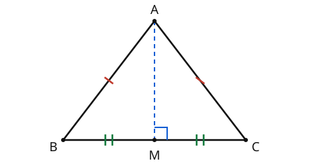

# Euclidean Geometry · Lesson 2.1: Triangle congruence & isosceles triangles

> ⏱ ~15 min · Module 2: Triangles · Builds on: 1.2 (deductive proof & two-column reasoning) · Unlocks: 2.2 (similarity & proportional reasoning)

## Why this matters

"Congruent" is how geometry says two things are *the same shape and size* — and the triangle is the figure where sameness is cheapest to certify. You don't need all six parts (three sides, three angles) to guarantee two triangles are identical; a well-chosen **three** will do. That's the engine behind almost every proof you'll write: show two triangles congruent, then harvest *every* remaining part for free. Isosceles triangles are the first place this pays off, and the right-triangle machinery you unlock here is exactly what `trigonometry` promotes into sine and cosine.

## The idea

Two triangles are **congruent** if you could pick one up, flip or spin it, lay it on the other, and have them coincide exactly — every vertex on a vertex, every side on a side. Six measurements match in total.

The surprise is that you never have to check all six. Fix three sides of a triangle and you've fixed it rigidly — there's no way to flex a triangle without changing a side length (unlike a four-bar frame, which wobbles into a parallelogram). So *three sides determine the whole triangle*. A handful of other three-part combinations lock it just as tightly. Find one that matches, and the other three parts are forced to agree — you get them without measuring. That "for free" harvest is the whole point.

## The formal version

Write $\triangle ABC \cong \triangle DEF$ to mean the two triangles are congruent **with vertices matched in that order**: $A\leftrightarrow D$, $B\leftrightarrow E$, $C\leftrightarrow F$. The order encodes which parts correspond, so it is not optional.

The criteria — each a set of three matching parts that guarantees congruence:

- **SSS** — three pairs of sides.
- **SAS** — two sides and the **included** angle (the one *between* those two sides).
- **ASA** — two angles and the **included** side (the one *between* those two angles).
- **AAS** — two angles and a **non-included** side. (Fine, because two angles fix the third, which reduces it to ASA.)
- **HL** — in **right** triangles only: the hypotenuse and one leg.

> In words: any of these five three-part matches is enough to force all six parts to match.

**Why SSA fails.** Two sides and a *non-included* angle do **not** determine a triangle. With the angle not wedged between the two given sides, the second side can swing to two different landing spots (the "ambiguous case"), producing two genuinely different triangles from the same data. HL is the one safe SSA-shaped case: the right angle plus the hypotenuse (the longest side) removes the ambiguity.

**CPCTC** — *Corresponding Parts of Congruent Triangles are Congruent.* Once $\triangle ABC \cong \triangle DEF$ is established, **any** pair of matched parts is congruent: $AB = DE$, $\angle B = \angle E$, and so on. This is the payoff line that ends most proofs.

**Isosceles base-angle theorem.** If $AB = AC$, then $\angle B = \angle C$.
> In words: equal sides sit opposite equal angles — the two "base angles" match.

**Its converse.** If $\angle B = \angle C$, then $AB = AC$.
> In words: equal base angles force the sides opposite them to be equal, so the triangle is isosceles.

**The apex altitude.** In isosceles $\triangle ABC$ with $AB = AC$, the altitude dropped from the apex $A$ to the base $BC$ **bisects the base** (its foot $M$ is the midpoint, $BM = MC$) **and is perpendicular to it** ($\angle AMB = \angle AMC = 90^\circ$). One segment does the work of three: altitude, median, and perpendicular bisector at once. It also bisects the apex angle $\angle BAC$.

## Picture

The single red ticks mark the equal sides $AB = AC$; the double green ticks mark the equal base halves $BM = MC$; the blue square at $M$ is the right angle. All three facts come from *one* congruence: $\triangle ABM \cong \triangle ACM$.

## Worked examples

**Example 1 (mechanical — pick the criterion).** Two triangles $\triangle ABC$ and $\triangle DEF$ satisfy $AB = DE$, $\angle A = \angle D$, and $AC = DF$. Which criterion applies, and what does it buy?

The matched parts are side $AB$, angle $A$, side $AC$ — and $\angle A$ is wedged **between** sides $AB$ and $AC$. Included angle ⟹ **SAS**, so $\triangle ABC \cong \triangle DEF$. By **CPCTC** we now get, for free, $BC = EF$, $\angle B = \angle E$, and $\angle C = \angle F$ — no further measuring.

Contrast: had the given angle been $\angle B$ (not between $AB$ and $AC$), we'd have SSA and *no* guarantee.

**Example 2 (why you'd care — the base-angle theorem, proved).** Prove that if $AB = AC$ then $\angle B = \angle C$, using the apex altitude.

Drop the altitude from $A$ to base $BC$, foot $M$, so $\angle AMB = \angle AMC = 90^\circ$.

| Statements | Reasons |
|---|---|
| 1. $AB = AC$ | Given (isosceles) |
| 2. $AM = AM$ | Reflexive property (shared side) |
| 3. $\angle AMB = \angle AMC = 90^\circ$ | $AM$ is an altitude ⟹ $\perp BC$ |
| 4. $\triangle ABM \cong \triangle ACM$ | **HL** (hyp. $AB=AC$, leg $AM$ shared; right triangles) |
| 5. $\angle B = \angle C$ | CPCTC |

And a bonus from the same step 4: $BM = MC$ (CPCTC), so the altitude *also* bisects the base — the picture's green ticks, proved. That is exactly the tool you'll wield in Boss Problem 2.

## Watch out

- You might think matching order in $\triangle ABC \cong \triangle DEF$ is cosmetic — it isn't. The order *is* the correspondence; writing $\triangle ABC \cong \triangle EDF$ instead claims $A\leftrightarrow E$ and can make a true congruence read as false. Line up the equal parts, then read off the order.
- You might think **SSA** is a valid criterion because "it has three parts and it worked that one time." It doesn't work in general — the non-included angle lets the triangle flip into a second shape. Only the right-angle special case (**HL**) is safe. There is likewise no **AAA**: equal angles give the same *shape* but any *size* (that's similarity, next lesson — not congruence).
- You might think the base-angle theorem needs the triangle drawn "sitting flat" on its base. The base is just whichever side is *opposite the apex* (the vertex where the equal sides meet); orientation on the page is irrelevant. Equal sides ⟺ equal opposite angles, always.

## One-liner

> The right three parts lock a triangle rigid; prove two triangles congruent and CPCTC hands you the other three for free — and in an isosceles triangle, the apex altitude is median, angle-bisector, and perpendicular all at once.

## Problems

**P1 (🟢)** In isosceles $\triangle PQR$ with $PQ = PR$, the base angles are $\angle Q = 5x - 10$ and $\angle R = 3x + 20$ (degrees). Find $x$ and the measure of each base angle.

**P2 (🟡)** Kite $ABCD$ has $AB = AD$ and $CB = CD$. Write a two-column proof that $\triangle ABC \cong \triangle ADC$, name the criterion, and use CPCTC to conclude $\angle B = \angle D$.

**P3 (🔴, optional)** Show by construction why **SSA fails**: given $AB = 7$, $BC = 5$, and $\angle A = 30^\circ$ (with $\angle A$ *not* between the two given sides), describe two different triangles fitting all three facts, and explain what makes two landing spots possible. *(This is the "ambiguous case" you'll meet again as the law of sines in `trigonometry`.)*

Solutions

**P1** Since $PQ = PR$, the base-angle theorem gives $\angle Q = \angle R$:
$$5x - 10 = 3x + 20 \implies 2x = 30 \implies x = 15.$$
Each base angle is $5(15) - 10 = 65^\circ$ (check: $3(15)+20 = 65^\circ$ ✓). (The apex angle is then $180 - 65 - 65 = 50^\circ$, though it wasn't asked.)

**P2**

| Statements | Reasons |
|---|---|
| 1. $AB = AD$ | Given |
| 2. $CB = CD$ | Given |
| 3. $AC = AC$ | Reflexive property (shared diagonal) |
| 4. $\triangle ABC \cong \triangle ADC$ | **SSS** (steps 1, 2, 3) |
| 5. $\angle B = \angle D$ | CPCTC |

Criterion: **SSS**. The shared diagonal $AC$ is the "small idea" — it supplies the third pair of sides without any extra given.

**P3** Fix $A$ and draw the two sides of the $30^\circ$ angle. Put $B$ on one side at distance $AB = 7$; let ray $AC$ be the other side, and $C$ must land on it with $BC = 5$.

Drop a perpendicular from $B$ to ray $AC$, with foot $F$. In right triangle $ABF$ the angle at $A$ is $30^\circ$, and the leg opposite a $30^\circ$ angle is half the hypotenuse (the 30-60-90 fact), so $BF = \tfrac{1}{2}(7) = 3.5$.

Now think of a circle of radius $BC = 5$ centered at $B$: the points where it meets ray $AC$ are the allowed positions of $C$. Because the closest the circle reaches the ray is $BF = 3.5$, and $3.5 < 5 < 7 = AB$, the circle **crosses the ray twice** — once "before" $F$ and once "after." Call them $C_1$ and $C_2$.

Both $\triangle ABC_1$ and $\triangle ABC_2$ have $AB = 7$, $BC = 5$, $\angle A = 30^\circ$ — identical SSA data — yet they are different triangles: $AC_1 \ne AC_2$, and their angles at $B$ and $C$ differ (one has an acute angle at $C$, the other obtuse). So SSA does **not** determine a triangle. Note the escape hatch: if $BC$ had been $\ge 7$, the circle would cross the ray only once — which is why HL (where the hypotenuse is the longest side) is unambiguous.

## Flashback

**From Lesson 1.3 (Parallel lines & angle relationships):** A transversal crosses lines $m$ and $n$. On the *same side* of the transversal, the interior angle at $m$ measures $(2x + 10)^\circ$ and the interior angle at $n$ measures $(3x)^\circ$. (a) If $m \parallel n$, find $x$ and both angles. (b) Name the relationship and the theorem that justifies your equation.

Solution

(a) Same-side interior (co-interior) angles between parallel lines are **supplementary**:
$$(2x + 10) + 3x = 180 \implies 5x + 10 = 180 \implies 5x = 170 \implies x = 34.$$
The angles are $2(34) + 10 = 78^\circ$ and $3(34) = 102^\circ$ (check: $78 + 102 = 180$ ✓).

(b) They are **co-interior (same-side interior) angles**, and the co-interior angle theorem says that when the lines are parallel these are supplementary. *(Read backward — if two co-interior angles are supplementary, the lines must be parallel — that's the converse used to prove parallelism.)*

## Connections

- **Backward:** this is Lesson 1.2's two-column proof machine put to work — every congruence proof is a chain of given → statements → reasons ending in a criterion, and 1.3's angle relationships supply many of those reasons.
- **Forward:** Lesson 2.2 (similarity) relaxes congruence from "same size" to "same shape, any scale" — AAA that failed here becomes the *AA similarity* criterion there; congruence is the scale-factor-$1$ special case.
- **Sideways (geometry):** Lesson 4.3 shows that "congruent" *means* "related by a rigid motion" — a translation, rotation, or reflection carries one triangle exactly onto the other, which is the pick-it-up-and-lay-it-down intuition made precise.
- **Sideways (trig):** right-triangle setups (HL, the apex altitude, the 30-60-90 fact in P3, the SSA ambiguous case) are the raw material `trigonometry` turns into sine, cosine, and the law of sines.
