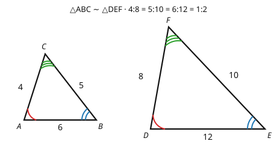

# Euclidean Geometry · Lesson 2.2: Similarity & proportional reasoning
> ⏱ ~15 min · Module 2: Triangles · Builds on: 2.1 (triangle congruence & isosceles triangles) · Unlocks: 2.3 (the Pythagorean theorem)

## Why this matters

Congruence was about *same shape, same size*. Similarity keeps the shape but frees the size — and that one relaxation is the workhorse of everything downstream. It's how a map lets you read real distances, how a shadow's length tells you a tree's height, and, most importantly, why trigonometry exists at all: the sine of an angle is a *ratio* that never changes when you scale the triangle, which only makes sense because scaled triangles are similar. Get similarity into your reflexes and half of the next two courses is already paid for.

## The idea

Two figures are **similar** when one is a perfect scaled photocopy of the other — same shape, possibly different size. Enlarge or shrink, rotate, flip: as long as no part gets stretched more than any other, similarity survives.

That "no part stretched more than any other" has a precise cash value: **all angles stay equal, and every length scales by the same number.** That number is the **scale factor** $k$. If the big triangle is $k=2$ times the small one, *every* side, *every* altitude, *every* median doubles — but the angles don't budge. So the moment you know two triangles are similar, you own a machine for finding missing lengths: set up a proportion between corresponding sides and solve.

The subtle, powerful fact is that you rarely have to check all of this. For triangles, matching **just the angles is enough** — if the angles agree, the sides are *forced* to be proportional. That's why the main tool is almost embarrassingly cheap to use.

## The formal version

Write $\triangle ABC \sim \triangle DEF$ (order matters: $A\leftrightarrow D$, $B\leftrightarrow E$, $C\leftrightarrow F$). This asserts two things at once:

$$\angle A = \angle D,\quad \angle B = \angle E,\quad \angle C = \angle F \qquad\text{and}\qquad \frac{AB}{DE}=\frac{BC}{EF}=\frac{CA}{FD}=k.$$

In words: corresponding angles are equal *and* corresponding sides share one common ratio $k$, the scale factor.

You establish similarity with one of three criteria — the analogues of SSS/SAS/ASA from Lesson 2.1:

- **AA** — two pairs of equal angles. (The third is then forced, since angles sum to $180^\circ$.) *In words: same angles ⇒ similar. This is the one you'll reach for 90% of the time.*
- **SAS$\sim$** — one pair of equal angles, with the two sides around it in proportion. *In words: a matching angle wedged between two proportional sides.*
- **SSS$\sim$** — all three pairs of sides in proportion. *In words: same side-ratios all around ⇒ similar.*

Two consequences you'll use constantly:

- **Side-splitter theorem.** A line parallel to one side of a triangle cuts the other two sides **proportionally**. If $DE \parallel BC$ with $D$ on $AB$ and $E$ on $AC$, then $\dfrac{AD}{DB}=\dfrac{AE}{EC}$. *(Why: $DE\parallel BC$ makes equal corresponding angles, so $\triangle ADE \sim \triangle ABC$ by AA.)*
- **Geometric mean in a right triangle.** Drop the altitude from the right angle to the hypotenuse. It splits the big right triangle into **two smaller ones, each similar to the original and to each other.** If the altitude has length $h$ and it cuts the hypotenuse into pieces $p$ and $q$, then
$$h = \sqrt{pq},$$
and each leg is the geometric mean of the whole hypotenuse and the piece next to it. *In words: the altitude is the geometric mean of the two hypotenuse chunks — one figure hides three similar triangles.*

## Picture

Same three angle marks appear in both triangles (single/double/triple arcs) — that's the AA content. The big triangle's sides are each exactly twice the small one's: $4{:}8 = 5{:}10 = 6{:}12$, one scale factor $k=2$ running through all of them.

## Worked examples

**Example 1 (mechanical — solve a proportion).** Given $\triangle ABC \sim \triangle DEF$ with $AB=6$, $BC=8$, and the corresponding side $DE=15$. Find $EF$.

The scale factor from the small triangle to the big one is $k=\dfrac{DE}{AB}=\dfrac{15}{6}=2.5$. Since $BC\leftrightarrow EF$,
$$EF = k\cdot BC = 2.5\times 8 = 20.$$
Equivalently, set up the proportion directly: $\dfrac{AB}{DE}=\dfrac{BC}{EF}\Rightarrow \dfrac{6}{15}=\dfrac{8}{EF}\Rightarrow EF=\dfrac{8\cdot 15}{6}=20.$ Same answer — pick whichever setup you can write without stopping to think about which side goes on top.

**Example 2 (why you'd care — the shadow trick).** A person 1.8 m tall casts a shadow 1.2 m long. At the same moment, a flagpole casts a shadow 8 m long. How tall is the pole?

The sun's rays hit both at the same angle, and both stand vertically — so the person-plus-shadow triangle and the pole-plus-shadow triangle share two angles (the ground angle and the right angle). By **AA** they're similar, and height-to-shadow is one fixed ratio:
$$\frac{\text{height}}{\text{shadow}}=\frac{1.8}{1.2}=1.5 \quad\Rightarrow\quad \text{pole height}=1.5\times 8 = 12\text{ m}.$$
You just measured a flagpole with a tape measure and a proportion. That fixed ratio $\tfrac{\text{height}}{\text{shadow}}=1.5$ is a preview of the tangent of the sun's angle — a number that depends only on the angle, not the object, precisely *because* all these triangles are similar.

## Watch out

- **You might think equal side *differences* mean similar; only equal *ratios* do.** A $3$–$4$–$5$ triangle and a $4$–$5$–$6$ triangle are not similar (you added 1 to each side, but $\tfrac34\ne\tfrac45$). Similarity is multiplicative, never additive.
- **You might read $\triangle ABC \sim \triangle DEF$ loosely, but the letter order is a promise.** It says $A$ pairs with $D$, not with whichever vertex looks closest on the page. Match sides by their position in the name — $AB$ with $DE$ — not by eyeballing the drawing.
- **AA settles similarity but *not* congruence.** Two triangles can have identical angles and wildly different sizes. Equal angles ⇒ same shape; you need an actual equal *length* somewhere before you can claim same size.
- **The side-splitter needs the line *parallel* to a side.** A line that merely crosses two sides splits nothing proportionally unless it's parallel to the third — that parallelism is what manufactures the equal angles.

## One-liner

> Similar = same angles, one scale factor on every length; match the angles (usually just two), then let a proportion hand you the missing side.

## Problems

**P1 (🟢)** $\triangle PQR \sim \triangle XYZ$ with $PQ=9$, $QR=12$, $RP=6$, and the corresponding side $XY=15$. Find $YZ$ and $ZX$.

**P2 (🟡)** In $\triangle ABC$, point $D$ lies on $AB$ and $E$ on $AC$ with $DE \parallel BC$. You measure $AD=4$, $DB=6$, and $AE=6$. Find $EC$. Then find $AC$.

**P3 (🔴, optional)** In right triangle $\triangle ABC$ the right angle is at $C$. The altitude from $C$ meets the hypotenuse $AB$ at $H$, cutting it into $AH=9$ and $HB=4$. Find the altitude $CH$, and then find both legs $CA$ and $CB$. *(Sets up 2.3: notice $CA^2+CB^2$ had better equal $AB^2$.)*

Solutions

**P1** Scale factor small→big: $k=\dfrac{XY}{PQ}=\dfrac{15}{9}=\dfrac53$. Then
$$YZ = k\cdot QR = \tfrac53\cdot 12 = 20,\qquad ZX = k\cdot RP = \tfrac53\cdot 6 = 10.$$
(Check the ratios: $\tfrac{9}{15}=\tfrac{12}{20}=\tfrac{6}{10}=\tfrac35$ ✓ — one common ratio throughout.)

**P2** Side-splitter: $DE\parallel BC \Rightarrow \dfrac{AD}{DB}=\dfrac{AE}{EC}$, so
$$\frac{4}{6}=\frac{6}{EC}\ \Rightarrow\ EC=\frac{6\cdot 6}{4}=9.$$
Then $AC = AE + EC = 6 + 9 = 15.$
(Sanity check via the similar triangles $\triangle ADE\sim\triangle ABC$: $\tfrac{AE}{AC}=\tfrac{6}{15}=\tfrac25$ should equal $\tfrac{AD}{AB}=\tfrac{4}{10}=\tfrac25$ ✓.)

**P3** The altitude to the hypotenuse creates two smaller triangles similar to the whole, giving the geometric-mean relations.
- Altitude: $CH=\sqrt{AH\cdot HB}=\sqrt{9\cdot 4}=\sqrt{36}=6.$
- Legs, each the geometric mean of the whole hypotenuse ($AB=9+4=13$) and its adjacent piece:
$$CA=\sqrt{AB\cdot AH}=\sqrt{13\cdot 9}=3\sqrt{13},\qquad CB=\sqrt{AB\cdot HB}=\sqrt{13\cdot 4}=2\sqrt{13}.$$
Check: $CA^2+CB^2 = 9\cdot 13 + 4\cdot 13 = 13\cdot 13 = 169 = 13^2 = AB^2.$ The Pythagorean theorem falls out for free — which is exactly the road into Lesson 2.3.

## Flashback

**From Lesson 2.1 (Triangle congruence & isosceles triangles):** In isosceles $\triangle PQR$, $PQ = PR$. The ray $PS$ bisects the apex angle $\angle QPR$, with $S$ on $QR$. Prove $\triangle PQS \cong \triangle PRS$, name the criterion, and conclude that $PS \perp QR$.

Solution

| Statement | Reason |
|---|---|
| $PQ = PR$ | Given (isosceles) |
| $\angle QPS = \angle RPS$ | $PS$ bisects $\angle QPR$ (given) |
| $PS = PS$ | Common side (reflexive) |
| $\triangle PQS \cong \triangle PRS$ | **SAS** (side–angle–side) |
| $\angle PSQ = \angle PSR$ | CPCTC |
| $\angle PSQ + \angle PSR = 180^\circ$ | Linear pair ($Q$, $S$, $R$ collinear) |
| $\angle PSQ = \angle PSR = 90^\circ$ | Equal angles summing to $180^\circ$ |
| $PS \perp QR$ | Definition of perpendicular |

Criterion: **SAS**. The apex bisector in an isosceles triangle is also the altitude — the symmetry fact you'll lean on again in the Module 2 boss problem.

## Connections

- **Backward:** this is Lesson 2.1's congruence with the size lock removed — SSS/SAS/ASA become SSS$\sim$/SAS$\sim$/AA. CPCTC's parallel here is "corresponding parts of similar triangles are *proportional*."
- **Forward:** Lesson 2.3 proves the Pythagorean theorem straight from the altitude-on-hypotenuse similarity you met above (P3 is a dry run) — no rearrangement puzzle required.
- **Sideways (`trigonometry`):** sine, cosine, and tangent are ratios of a right triangle's sides that depend *only on the angle*. That independence-from-size is similarity itself — Example 2's fixed height-to-shadow ratio is a tangent in disguise.
- **Sideways (scale drawings & maps):** a map's scale bar *is* the factor $k$; every real distance is a map distance times $k$, which is why one proportion converts the whole sheet.
