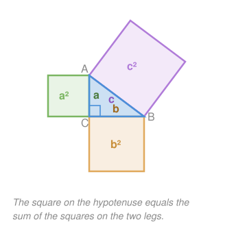

# Euclidean Geometry · Lesson 2.3: The Pythagorean theorem

> ⏱ ~15 min · Module 2: Triangles · Builds on: 2.2 (similarity & proportional reasoning) · Unlocks: 3.1 (quadrilaterals & polygons)

## Why this matters

This is the single most reused identity in all of geometry, and it barely looks geometric once it grows up. The distance between two points on a plane, the length of a vector in `linalg-refresher`, the magnitude of a force built from perpendicular components in physics, the sine and cosine you'll meet in `trigonometry` — every one of them is $a^2+b^2=c^2$ in disguise. Learn to see it, and half of coordinate geometry becomes bookkeeping.

## The idea

Take a right triangle — one $90^\circ$ corner. Call the two short sides that make the right angle the **legs**, and the long side across from it the **hypotenuse**. The claim is almost unreasonable: build an actual square on each side, and the two smaller squares, if you melted them down, contain exactly enough area to tile the big one. Nothing about the two legs' lengths is free — fix them, and the hypotenuse is forced.

The reason it's true is scaling, not magic. Drop a straight line from the right angle down onto the hypotenuse, and you slice the triangle into two smaller triangles that are *the same shape* as the original — just shrunk. Same shape means proportional sides (that's Lesson 2.2), and chasing those proportions makes the two leg-squares add up to the big one on the nose.

## The formal version

**Theorem (Pythagoras).** In a right triangle with legs of length $a$ and $b$ and hypotenuse of length $c$ (the side opposite the right angle),
$$a^2 + b^2 = c^2.$$
*In words:* the areas of the squares on the two legs sum to the area of the square on the hypotenuse. $c$ is always the longest side.

**Proof (by similarity — the altitude on the hypotenuse).** Let $\triangle ABC$ have its right angle at $C$, with legs $a = CB$, $b = CA$, and hypotenuse $c = AB$. Drop the altitude from $C$ to the hypotenuse, meeting it at $H$; write $p = AH$ and $q = HB$, so $p+q=c$.

Each small triangle shares one acute angle with the original and has its own right angle at $H$, so by **AA** (Lesson 2.2):
$$\triangle CBH \sim \triangle ABC \quad\Rightarrow\quad \frac{a}{c}=\frac{q}{a}\ \Rightarrow\ a^2 = cq,$$
$$\triangle ACH \sim \triangle ABC \quad\Rightarrow\quad \frac{b}{c}=\frac{p}{b}\ \Rightarrow\ b^2 = cp.$$
Add them: $a^2+b^2 = cq+cp = c(p+q) = c\cdot c = c^2.\ \blacksquare$

Those two relations $a^2=cq$ and $b^2=cp$ are exactly the **geometric-mean-in-a-right-triangle** facts from 2.2 — each leg is the geometric mean of the whole hypotenuse and the segment next to it. Pythagoras is just their sum.

**The converse (a triangle classifier).** Take *any* triangle, label its longest side $c$, and compare:
$$a^2+b^2 = c^2 \Rightarrow \text{right}, \qquad a^2+b^2 > c^2 \Rightarrow \text{acute}, \qquad a^2+b^2 < c^2 \Rightarrow \text{obtuse}.$$
*In words:* if the legs' squares fall short of the longest side's square, the big angle has been pried open past $90^\circ$; if they overshoot, it's been squeezed under.

## Picture

## Worked examples

**Example 1 (mechanical — find a missing side).** A right triangle has hypotenuse $26$ and one leg $10$. Find the other leg. Here $c=26$ (opposite the right angle), $a=10$, solve for $b$:
$$b^2 = c^2 - a^2 = 26^2 - 10^2 = 676 - 100 = 576 \ \Rightarrow\ b = 24.$$
Note the move: when the *hypotenuse* is known you **subtract**; when both legs are known you add. The $\{10,24,26\}$ here is just the $\{5,12,13\}$ triple doubled.

**Example 2 (why you'd care — distance on the plane).** How far apart are the points $(1,2)$ and $(5,5)$? Walk there in two perpendicular steps: right by $5-1=4$, up by $5-2=3$. Those steps are the legs of a right triangle whose hypotenuse *is* the straight-line distance:
$$d = \sqrt{4^2 + 3^2} = \sqrt{16+9} = \sqrt{25} = 5.$$
That's the entire content of the **distance formula** you'll meet in Lesson 4.2: $d=\sqrt{(x_2-x_1)^2+(y_2-y_1)^2}$ is Pythagoras with the legs written as coordinate differences. Same in three dimensions — and that's the length of a vector.

## Watch out

- You might think you can drop any two sides into $a$ and $b$, but the hypotenuse $c$ is *always* the side opposite the right angle (the longest one). If a problem hands you the hypotenuse, you're solving $b^2=c^2-a^2$, not $c^2=a^2+b^2$ — get that backwards and you'll take the square root of a negative number.
- You might think $\sqrt{a^2+b^2}=a+b$. It never does (unless a side is $0$). $3+4=7$ but $\sqrt{3^2+4^2}=5$. Squaring and adding is not the same as adding.
- The converse only works once you've identified the **longest** side as $c$. Test $a^2+b^2$ against the square of the *biggest* side, or the acute/obtuse verdict flips.

## One-liner

> On a right triangle the square on the hypotenuse is the sum of the squares on the legs — and every distance you'll ever compute is that fact wearing coordinates.

## Problems

**P1 (🟢)** A right triangle has legs $20$ and $21$. Find the hypotenuse.

**P2 (🟡)** A triangle has sides $9$, $40$, $41$. Classify it (right/acute/obtuse) using the converse. Then a second triangle keeps $9$ and $40$ but stretches the longest side to $42$ — reclassify it.

**P3 (🔴, optional)** A rectangular box measures $2 \times 3 \times 6$. Find the length of its longest interior diagonal (corner to opposite corner). *Hint: apply Pythagoras twice — first across the base, then up.* Where have you seen $\sqrt{a^2+b^2+c^2}$ before?

Solutions

**P1** Both $20$ and $21$ are legs, so add: $c^2 = 20^2 + 21^2 = 400 + 441 = 841$, and $c = \sqrt{841} = \boxed{29}$. (The triple $\{20,21,29\}$.)

**P2** Longest side is $c=41$: $9^2+40^2 = 81+1600 = 1681 = 41^2$. Since $a^2+b^2 = c^2$, it's a **right** triangle (the triple $\{9,40,41\}$). Now with $c=42$: $9^2+40^2 = 1681$ but $42^2 = 1764$. Since $1681 < 1764$, i.e. $a^2+b^2 < c^2$, the triangle is **obtuse** — stretching the far side past $41$ opened the opposite angle past $90^\circ$.

**P3** First find the diagonal $d$ across the $2\times 3$ base: $d^2 = 2^2 + 3^2 = 13$. That base-diagonal and the vertical edge $6$ form a right triangle whose hypotenuse is the space diagonal $D$:
$$D^2 = d^2 + 6^2 = 13 + 36 = 49 \ \Rightarrow\ D = \boxed{7}.$$
The pattern $D = \sqrt{2^2+3^2+6^2}$ is the 3-D distance formula — and the **magnitude of the vector** $(2,3,6)$, i.e. $\lVert v \rVert = \sqrt{x^2+y^2+z^2}$ in `linalg-refresher`. Pythagoras stacks cleanly into any number of dimensions.

## Flashback

**From Lesson 2.2 (Similarity & proportional reasoning):** A $6$-foot-tall person standing in sunlight casts a $4$-foot shadow. At the same moment a nearby flagpole casts a $22$-foot shadow. How tall is the flagpole?

Solution

The sun's rays hit both objects at the same angle, and both the person and the pole stand vertical (right angles to the ground). So the person-and-shadow triangle and the pole-and-shadow triangle share two equal angles — similar by **AA**. Corresponding sides are proportional:
$$\frac{\text{height}}{\text{shadow}}:\quad \frac{6}{4} = \frac{h}{22} \ \Rightarrow\ h = \frac{6}{4}\cdot 22 = 33 \text{ feet}.$$
The shadow ratio $\tfrac{6}{4} = 1.5$ is the scale factor between the two triangles, so every object is $1.5\times$ the length of its shadow: the pole stands $1.5 \times 22 = 33$ feet tall.

## Connections

- **Backward:** the proof *is* Lesson 2.2 — the two similar sub-triangles and their geometric-mean relations $a^2=cq$, $b^2=cp$ are the side-splitting proportions summed. If similarity felt abstract, this is the payoff.
- **Forward:** Lesson 4.1 uses Pythagoras to recover a triangle's height from its sides so you can compute area; Lesson 4.2's distance formula is literally Example 2 with variables. Boss problem 2 leans on this theorem to find the altitude of an isosceles triangle.
- **Sideways:** `trigonometry` promotes the right-triangle side ratios here into $\sin$ and $\cos$ (and $a^2+b^2=c^2$ becomes the identity $\sin^2\theta+\cos^2\theta=1$); vector magnitude in `linalg-refresher` and the resultant of perpendicular force/velocity components in physics are both $\sqrt{a^2+b^2}$ under new names.
