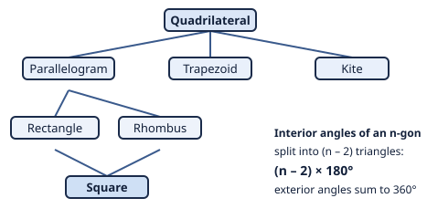

# Euclidean Geometry · Lesson 3.1: Quadrilaterals & polygons

> ⏱ ~15 min · Module 3: Polygons & circles · Builds on: 1.3 (parallel lines & angle relationships) · Unlocks: 3.2 (circles: chords, tangents, arcs & inscribed angles)

## Why this matters

Triangles are rigid and simple; the world is built out of four-and-more-sided figures. Floor tiles, truss panels, crystal cross-sections, the cells of a hex grid in a simulation — all are polygons, and each carries a fixed angle budget you can compute before drawing a single line. Master two facts here — the special quadrilaterals' fingerprints and the angle-sum formula — and you can classify a figure from a scrap of information, predict which shapes tile a floor, and set up nearly every area problem in Module 4.

## The idea

A **polygon** is a closed figure made of straight segments. The four-sided ones (**quadrilaterals**) come in a small family, and the whole family is organized by how much *regularity* you demand. Start loose — just four sides — and keep adding constraints:

- force **both** pairs of opposite sides parallel and you get a **parallelogram**;
- add right angles → **rectangle**; add equal sides → **rhombus**; add both → **square**.

Off to the side sit the near-misses: a **trapezoid** (only *one* pair of parallel sides) and a **kite** (two pairs of *adjacent* equal sides). Each shape has a fingerprint — a signature in its sides, its angles, and especially its **diagonals** — that lets you name it or prove it.

The second idea is even simpler. Any polygon can be sliced into triangles by drawing diagonals from one corner. An $n$-sided polygon splits into exactly $n-2$ triangles, and since each triangle donates $180^\circ$, the interior angles must add to $(n-2)\cdot 180^\circ$. That's the entire angle-sum formula — no memorization, just counting triangles.

## The formal version

**The special quadrilaterals** (each row *adds* to the one it descends from):

| Figure | Defining property | Diagonals |
|---|---|---|
| Parallelogram | both pairs of opposite sides parallel | bisect each other |
| Rectangle | parallelogram + one right angle (hence all four) | bisect each other **and are equal** |
| Rhombus | parallelogram + two adjacent sides equal (hence all four) | bisect each other **and are perpendicular** (and bisect the angles) |
| Square | rectangle **and** rhombus | equal, perpendicular, and bisect each other |
| Trapezoid | exactly one pair of parallel sides (the *bases*) | — (isosceles trapezoid: legs equal, diagonals equal) |
| Kite | two pairs of *adjacent* sides equal | perpendicular; one diagonal bisects the other |

In words: a parallelogram is the "opposite sides matched" shape; rectangles fix the angles, rhombi fix the sides, and a square does both. Diagonals are the quickest tell — *equal* diagonals mean rectangle-ish, *perpendicular* diagonals mean rhombus/kite-ish.

**Interior angle sum.** For a convex polygon with $n$ sides,
$$S = (n-2)\cdot 180^\circ.$$
In words: cut the polygon into $n-2$ triangles from one vertex; the angles of those triangles *are* the polygon's interior angles, so they total $(n-2)$ times $180^\circ$.

**Exterior angle sum.** At each vertex the interior and exterior angles form a linear pair, so they add to $180^\circ$. For **any** convex polygon,
$$\text{sum of exterior angles} = 360^\circ,$$
one exterior angle per vertex — independent of $n$. In words: walk the perimeter once; the total turning you do to face back the way you started is one full revolution.

**Regular polygon.** All sides and all angles equal. Then each interior angle is
$$\frac{(n-2)\cdot 180^\circ}{n}, \qquad \text{and each exterior angle is } \frac{360^\circ}{n}.$$

## Picture

## Worked examples

**Example 1 (mechanical — the angle sum).** Find the interior angle sum of a hexagon, then each angle of a *regular* hexagon.

Slice the hexagon from one corner: $n=6$ gives $6-2=4$ triangles, so
$$S = (6-2)\cdot 180^\circ = 4\cdot 180^\circ = 720^\circ.$$
Regular means all six angles are equal, so each is $720^\circ/6 = 120^\circ$. Check with the exterior route: each exterior angle is $360^\circ/6 = 60^\circ$, and $180^\circ - 60^\circ = 120^\circ$. Both roads agree — always run the exterior check; it catches arithmetic slips instantly.

**Example 2 (why you'd care — which shapes tile a floor?).** A regular polygon tiles the plane (no gaps, no overlaps, meeting corner-to-corner) only if a whole number of its interior angles fit around a point, i.e. the interior angle must divide $360^\circ$.

- Triangle: $60^\circ$ → $360/60 = 6$ fit. ✓
- Square: $90^\circ$ → $360/90 = 4$ fit. ✓
- Regular pentagon: $108^\circ$ → $360/108 = 3.33\ldots$ **not** a whole number. ✗
- Regular hexagon: $120^\circ$ → $360/120 = 3$ fit. ✓

So exactly three regular polygons tile the plane by themselves — triangle, square, hexagon — which is *why* bathroom tiles and honeycombs look the way they do, and why you never see a floor of regular pentagons. That's a real theorem falling straight out of the angle formula.

## Watch out

- You might think "a square isn't a rectangle" — but the definitions are **inclusive**: a square *is* a rectangle (it has a right angle) and *is* a rhombus (equal sides), sitting at the bottom of the family tree. "Rectangle" means *at least* rectangle. Every property of a parallelogram is automatically true of squares, rhombi, and rectangles too.
- You might reach for $(n-2)\cdot 180^\circ$ when asked about *exterior* angles. Don't — the exterior sum is **always** $360^\circ$, no $n$ in sight. Only the *interior* sum grows with $n$.
- You might assume any four-sided figure with perpendicular diagonals is a rhombus, or with equal diagonals is a rectangle. Not without the parallelogram premise: a **kite** has perpendicular diagonals but unequal sides, and an **isosceles trapezoid** has equal diagonals but only one pair of parallel sides. Diagonals classify a shape *only once you also know the diagonals bisect each other* (which is what makes it a parallelogram in the first place).

## One-liner

> Every polygon is a fistful of triangles — $(n-2)$ of them — and every special quadrilateral is a parallelogram wearing extra constraints, readable off its diagonals.

## Problems

**P1 (🟢)** Find the sum of the interior angles of a decagon ($n=10$), and the measure of each interior angle if the decagon is regular. What is each exterior angle?

**P2 (🟡)** In parallelogram $ABCD$ the angles are $\angle A = (2x+30)^\circ$ and $\angle B = (3x-10)^\circ$, where $A$ and $B$ are consecutive vertices. Find $x$ and all four angles. *(Hint: what do consecutive angles of a parallelogram add to, and why?)*

**P3 (🔴, optional)** A quadrilateral is known to have diagonals that **bisect each other** and are **equal in length**, but are **not perpendicular**. Name the most specific figure it must be, and justify each clue's role. What single extra fact would force it to be a square?

Solutions

**P1** Sum $= (10-2)\cdot 180^\circ = 8\cdot 180^\circ = \boxed{1440^\circ}$. Regular ⇒ each interior angle $= 1440^\circ/10 = \boxed{144^\circ}$. Each exterior angle $= 360^\circ/10 = \boxed{36^\circ}$ (check: $180^\circ - 144^\circ = 36^\circ$ ✓).

**P2** Consecutive angles of a parallelogram are **supplementary**: side $AB$ is a transversal cutting the parallel sides $AD \parallel BC$, making $\angle A$ and $\angle B$ co-interior angles, which sum to $180^\circ$. So
$$(2x+30) + (3x-10) = 180 \;\Rightarrow\; 5x + 20 = 180 \;\Rightarrow\; x = 32.$$
Then $\angle A = 2(32)+30 = 94^\circ$ and $\angle B = 3(32)-10 = 86^\circ$. Opposite angles are equal, so $\angle C = \angle A = 94^\circ$ and $\angle D = \angle B = 86^\circ$. (Sanity check: $94+86+94+86 = 360^\circ = (4-2)\cdot 180^\circ$ ✓.)

**P3** Diagonals **bisecting each other** ⇒ the figure is a **parallelogram** (that's the diagonal test for parallelograms). Adding **equal** diagonals upgrades a parallelogram to a **rectangle**. The diagonals being **not perpendicular** rules out the rhombus/square branch. So the most specific figure is a **rectangle**. To force a **square**, add any one of: the diagonals *are* perpendicular, or two adjacent sides are equal, or one diagonal bisects a corner angle — each turns the rectangle into a rhombus as well, and rectangle + rhombus = square.

## Flashback

**From Lesson 2.1 (Triangle congruence & isosceles triangles):** In parallelogram $ABCD$, draw the diagonal $AC$. Prove that the opposite sides are equal, i.e. $AB = CD$ and $BC = DA$, using a triangle-congruence criterion and CPCTC.

Solution

The diagonal $AC$ splits the parallelogram into $\triangle ABC$ and $\triangle CDA$. Compare them:

1. $AB \parallel DC$ (opposite sides of a parallelogram), and $AC$ is a transversal, so $\angle BAC = \angle DCA$ (alternate interior angles).
2. $AD \parallel BC$ (opposite sides), and $AC$ is a transversal, so $\angle BCA = \angle DAC$ (alternate interior angles).
3. $AC = CA$ (the shared diagonal — reflexive).

By **ASA** (angle $\angle BAC$, included side $AC$, angle $\angle BCA$ matched to $\angle DCA$, side $CA$, $\angle DAC$), $\triangle ABC \cong \triangle CDA$. Therefore, by **CPCTC**, $AB = CD$ and $BC = DA$. $\blacksquare$

This is exactly *why* the family tree starts where it does: "opposite sides parallel" secretly guarantees "opposite sides equal."

## Connections

- **Backward:** the whole angle-sum argument rests on Lesson 1.3's parallel-line angle pairs — alternate interior angles are what let a diagonal transfer angles across a parallelogram, and co-interior angles are why consecutive angles are supplementary (P2).
- **Forward:** Lesson 3.2 puts a quadrilateral *inside a circle* — a **cyclic quadrilateral** — where opposite angles turn out supplementary; and Lesson 4.1 uses these shapes' defining dimensions (base, height, diagonals) to derive their **areas**.
- **Sideways (tilings):** Example 2 is the seed of **tessellation** theory — which polygons fill the plane — the geometry behind tile patterns, honeycombs, and Islamic ornament.
- **Sideways (`abstract-algebra`):** a regular $n$-gon's rotations and reflections form its **symmetry group**, the dihedral group $D_n$ — the square's eight symmetries ($D_4$) are the first nontrivial example you'll meet there, and the family tree above is really a hierarchy of *how much symmetry* each shape has.
