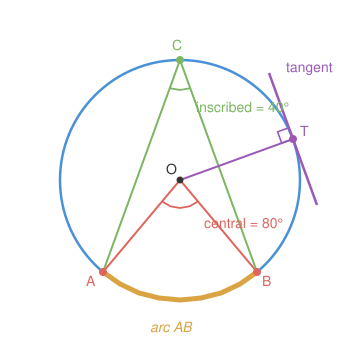

# Euclidean Geometry · Lesson 3.2: Circles — chords, tangents, arcs & inscribed angles

> ⏱ ~15 min · Module 3: Polygons & circles · Builds on: 3.1 (quadrilaterals & polygons) · Unlocks: 4.1 (perimeter, area, surface area & volume)

## Why this matters

The circle is the one curve you cannot avoid downstream: it *is* the unit circle of `trigonometry`, the path of every orbit and every spinning wheel in physics, and the stage on which `complex-analysis` draws $e^{i\theta}$. All of that runs on a single surprising fact you'll prove here — an angle drawn from a point *on* the circle is exactly half the angle drawn from its *center*. Master the vocabulary of arcs, chords, and tangents now, and those later subjects become bookkeeping.

## The idea

A circle has no corners, so at first it seems to have no angles to reason about. The trick is to measure angles by the **arc** they cut off — the slice of the rim between two points. The most natural angle is the **central angle**: stand at the center $O$, look out at two points $A$ and $B$, and the angle $\angle AOB$ *equals* the arc $AB$ it opens onto. That's just the definition of how we measure an arc in degrees.

Now step from the center to a point $C$ on the rim and look at the same two points. Your viewing angle $\angle ACB$ shrinks to **exactly half**. Why half? Because you've backed away: the center sees the arc "head-on," a point on the far rim sees it at a slant, and the geometry works out to precisely a factor of two — every time, no matter where on the far arc you stand. That single fact ("inscribed = half central") is the engine of the whole lesson.

Two more players complete the cast. A **chord** is a segment joining two points of the circle (a diameter is the longest chord). A **tangent** is a line that grazes the circle at one point — and it always meets the radius there at a perfect right angle, because the radius points "straight out" and the tangent runs "straight across."

## The formal version

Let a circle have center $O$ and radius $r$. Standard vocabulary: a **chord** joins two points on the circle; a **diameter** is a chord through $O$; a **secant** is a line cutting the circle twice; a **tangent** is a line meeting it once, at the **point of tangency**. An **arc** is a piece of the circle between two points — **minor** if less than a semicircle, **major** if more, a **semicircle** if exactly half. The **measure** of an arc is defined to be the central angle that subtends it.

**Central angle = arc.** $\ \angle AOB = \text{arc } AB$. *In words: the angle at the center literally reports the arc's degree measure.*

**Inscribed-angle theorem.** If $C$ lies on the circle, then
$$\angle ACB = \tfrac{1}{2}\,\text{arc } AB = \tfrac{1}{2}\,\angle AOB.$$
*In words: an angle with its vertex on the circle is half the central angle cutting the same arc.* A corollary: **all** inscribed angles subtending the same arc are equal (they're all half of the one arc).

**Thales' corollary.** If $AB$ is a diameter and $C$ is any other point on the circle, then $\angle ACB = 90^\circ$. *In words: the angle in a semicircle is a right angle* — because the arc is $180^\circ$, and half of that is $90^\circ$.

**Chord facts.** Equal chords cut equal arcs, and vice versa. And **a radius (or diameter) perpendicular to a chord bisects it**: if $OM \perp AB$ with $M$ on $AB$, then $AM = MB$.

**Tangent facts.** The tangent at $T$ is perpendicular to the radius $OT$: $\ OT \perp \text{tangent}$. The **tangent–chord angle** between a tangent at $T$ and a chord $TA$ equals half the intercepted arc: $\ \tfrac{1}{2}\,\text{arc } TA$ — the same "half the arc" rule, read with one arm laid flat along the rim.

**Cyclic quadrilateral.** If all four vertices of a quadrilateral lie on one circle, its opposite angles are supplementary: $\ \angle A + \angle C = 180^\circ$ and $\angle B + \angle D = 180^\circ$. *In words: opposite corners of an inscribed quadrilateral always add to a straight angle.*

## Picture

The gold arc $AB$ is subtended two ways: from the center $O$ (red, $80^\circ$) and from the point $C$ on the far rim (green, $40^\circ$ — exactly half). On the right, the tangent at $T$ meets radius $OT$ in a right angle.

## Worked examples

**Example 1 (mechanical — inscribed angle & Thales).** Points $A$, $B$, $C$ lie on a circle with center $O$, and the central angle $\angle AOB = 84^\circ$ (with $C$ on the major arc).

The inscribed angle on the same arc is half the central angle:
$$\angle ACB = \tfrac{1}{2}(84^\circ) = 42^\circ.$$
If you slide $C$ anywhere else along that major arc, $\angle ACB$ stays $42^\circ$ — all inscribed angles on one arc agree. And if you instead open the central angle all the way to $\angle AOB = 180^\circ$ (so $AB$ is a diameter), then $\angle ACB = \tfrac{1}{2}(180^\circ) = 90^\circ$: that's Thales' right angle in a semicircle.

**Example 2 (application — tangent-chord meets a cyclic quadrilateral).** A tangent touches a circle at $A$, and a chord $AB$ leaves that point making a tangent–chord angle of $58^\circ$ with the tangent.

The tangent–chord angle is half its intercepted arc, so
$$\text{arc } AB = 2(58^\circ) = 116^\circ.$$
Now put a point $C$ on the *other* arc and inscribe $\angle ACB$: it's half of arc $AB$, so $\angle ACB = \tfrac{1}{2}(116^\circ) = 58^\circ$ — the tangent–chord angle and the inscribed angle in the alternate segment come out equal, a fact worth remembering on its own. Finally, add a fourth point $D$ to make cyclic quadrilateral $ABCD$: if $\angle ABC$ works out to $95^\circ$, then its opposite angle must satisfy $\angle ADC = 180^\circ - 95^\circ = 85^\circ$, no further computation needed. This chain — tangent to arc to inscribed angle to opposite angle — is the exact toolkit Boss Problem 3 asks for.

## Watch out

- You might think an inscribed angle equals its arc, like the central one does — but it's **half**. Only the angle *at the center* reads the arc directly; every vertex *on the rim* halves it.
- You might think "chord perpendicular to a radius" is what bisects. It's the reverse pairing that's automatic: a radius **through the center** that meets a chord at a right angle bisects it (and conversely, the perpendicular bisector of any chord passes through the center). A random perpendicular that misses $O$ guarantees nothing.
- You might read "opposite angles equal" from parallelograms into cyclic quadrilaterals. In a **cyclic** quadrilateral opposite angles are **supplementary** (sum to $180^\circ$), not equal — different figure, different rule.

## One-liner

> The center sees an arc at full size; every point on the rim sees it at half — and a tangent always leaves the radius at a right angle.

## Problems

**P1 (🟢)** A chord $AB$ subtends a central angle of $130^\circ$. Find the inscribed angle on the **major** arc, and the inscribed angle on the **minor** arc. Check that they're supplementary and explain why.

**P2 (🟡)** In a circle of radius $10$, chord $AB$ has length $12$. (a) How far is the chord from the center? (b) The minor arc $AB$ measures $74^\circ$; find the tangent–chord angle the tangent at $A$ makes with $AB$.

**P3 (🔴, optional)** Prove Thales' corollary from scratch: if $AB$ is a diameter and $C$ is any other point on the circle, then $\angle ACB = 90^\circ$. *Hint: draw radius $OC$ and use the isosceles triangles it creates (base angles from Lesson 2.1).*

Solutions

**P1** The inscribed angle on the major arc subtends the *minor* arc $AB$, whose measure equals the central angle $130^\circ$, so it is $\tfrac{1}{2}(130^\circ) = 65^\circ$. The inscribed angle on the *minor* arc subtends the *major* arc, whose measure is $360^\circ - 130^\circ = 230^\circ$, giving $\tfrac{1}{2}(230^\circ) = 115^\circ$. Sum: $65^\circ + 115^\circ = 180^\circ$. They're supplementary because together they are the two opposite angles of the cyclic quadrilateral formed by $A$, $B$, and the two vertices — equivalently, the two arcs they halve add to the full $360^\circ$, and half of $360^\circ$ is $180^\circ$.

**P2** (a) The radius from $O$ to the midpoint $M$ of the chord is perpendicular to the chord and bisects it, so $AM = 6$. Then $OM = \sqrt{OA^2 - AM^2} = \sqrt{10^2 - 6^2} = \sqrt{64} = 8$. (b) The tangent–chord angle is half the intercepted (minor) arc: $\tfrac{1}{2}(74^\circ) = 37^\circ$.

**P3** Draw radius $OC$. Since $OA = OC = OB = r$ (all radii), triangles $OAC$ and $OBC$ are **isosceles**. By the isosceles base-angle theorem (Lesson 2.1), let $\angle OAC = \angle OCA = \alpha$ and $\angle OBC = \angle OCB = \beta$. Now the angle we want is $\angle ACB = \angle OCA + \angle OCB = \alpha + \beta$. Look at the whole triangle $ACB$: its three angles are $\angle A = \alpha$, $\angle B = \beta$, and $\angle ACB = \alpha + \beta$, and they sum to $180^\circ$:
$$\alpha + \beta + (\alpha + \beta) = 180^\circ \;\Rightarrow\; 2(\alpha + \beta) = 180^\circ \;\Rightarrow\; \alpha + \beta = 90^\circ.$$
So $\angle ACB = 90^\circ$. (This is the inscribed-angle theorem in miniature: the $180^\circ$ arc halves to a $90^\circ$ angle.)

## Flashback

**From Lesson 3.1 (Quadrilaterals & polygons):** A regular polygon has each interior angle equal to $156^\circ$. How many sides does it have?

Solution

For a regular $n$-gon, each interior angle is $\dfrac{(n-2)\,180^\circ}{n}$. Set it equal to $156^\circ$:
$$\frac{(n-2)180}{n} = 156 \;\Rightarrow\; 180n - 360 = 156n \;\Rightarrow\; 24n = 360 \;\Rightarrow\; n = 15.$$
A regular **15-gon**. (Quick check via exterior angles: each exterior angle is $180^\circ - 156^\circ = 24^\circ$, and $360^\circ / 24^\circ = 15$. ✓)

## Connections

- **Backward:** the inscribed-angle proof (P3) runs entirely on isosceles-triangle base angles from Lesson 2.1, and the cyclic-quadrilateral rule leans on the quadrilateral angle sum of $360^\circ$ from Lesson 3.1 — circles reward everything you've already built.
- **Forward:** Lesson 4.1 takes the *arc measure* in degrees you defined here and converts it to physical **arc length** and **sector area** by multiplying by the arc's fraction of the whole circle — the degrees become distances and areas.
- **Sideways (trigonometry):** the unit circle is just this lesson's circle with $r = 1$; a central angle $\theta$ locates the point $(\cos\theta, \sin\theta)$, and inscribed angles quietly underlie the angle-addition identities.
- **Sideways (complex-analysis):** points on a circle are $e^{i\theta}$, and the "argument" of such a point is precisely a central angle measured from the positive axis — the same arc-as-angle idea, now on the plane of complex numbers.
- **Sideways (physics):** in circular motion, a particle's angular position *is* a central angle and its angular velocity is that angle's rate of change — reading position as an arc is step one of orbital mechanics.
