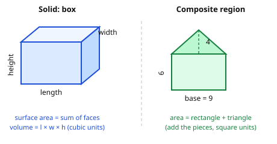

# Euclidean Geometry · Lesson 4.1: Perimeter, area, surface area & volume

> ⏱ ~15 min · Module 4: Measurement, coordinates & transformations · Builds on: 2.3 (the Pythagorean theorem) · Unlocks: 4.2 (coordinate geometry)

## Why this matters

Every figure you've proved things about also has *size*, and size is what the rest of science actually measures: the area under a curve is an integral, the volume swept by a spinning region is a solid of revolution, flux through a surface and mass inside a volume are the whole language of physics. This lesson is where "how big is it?" stops being a bag of memorized formulas and becomes a small, self-checking system — one you can rebuild from a rectangle and a triangle, and one whose *units* catch your mistakes before you do.

## The idea

There are only three kinds of size, and they climb one dimension at a time.

- **Perimeter** (and its curved cousin, **circumference**) is length — the walk *around* a flat figure. One dimension, measured in plain units.
- **Area** is how much flat *surface* a region covers. Two dimensions. Its natural unit is a $1 \times 1$ square, so area is always in *square* units.
- **Volume** is how much *space* a solid fills — how many $1 \times 1 \times 1$ cubes it holds. Three dimensions, *cubic* units. **Surface area** is a hybrid: the total area of a solid's skin, so it's an area (square units) even though it wraps a 3-D thing.

Almost every formula reduces to one honest picture: **area is base times height**, and everything else is that idea bent, halved, or stacked. A triangle is half a parallelogram. A prism is an area dragged straight up. A cylinder is a circle dragged up. Once you see the base-times-height skeleton, you stop memorizing and start reconstructing.

## The formal version

**Perimeter / circumference.** For a polygon, perimeter is the sum of the side lengths. For a circle of radius $r$ (diameter $d = 2r$):

$$C = 2\pi r = \pi d.$$

In words: the distance around a circle is $\pi$ times across, always.

**Areas of the plane figures.** With base $b$, height $h$ (the height is *perpendicular* to the base), parallel sides $b_1, b_2$, radius $r$:

$$A_{\triangle} = \tfrac{1}{2}bh, \qquad A_{\text{parallelogram}} = bh, \qquad A_{\text{trap}} = \tfrac{1}{2}(b_1+b_2)\,h, \qquad A_{\circ} = \pi r^2.$$

**Why the triangle is half a parallelogram.** Take any triangle and copy it, rotated $180°$; the two copies snap together along a shared side into a parallelogram with the same base and height. The parallelogram's area is $bh$, so *one* triangle is $\tfrac{1}{2}bh$. The trapezoid works the same way — glue a rotated copy to get a parallelogram of base $b_1+b_2$ and height $h$, then halve.

**Composite regions.** Any irregular flat region is measured by **decomposition**: cut it into rectangles, triangles, and circular pieces whose areas you know, then add (or subtract a piece that was cut away). The answer is independent of *how* you cut.

**Solids** — surface area $S$ (square units) and volume $V$ (cubic units), with $B$ = area of the base:

$$
\begin{array}{lll}
\textbf{Prism / cylinder} & V = B\,h & S = 2B + (\text{perimeter of base})\cdot h \\[2pt]
\text{cylinder, radius } r & V = \pi r^2 h & S = 2\pi r^2 + 2\pi r h \\[2pt]
\textbf{Pyramid / cone} & V = \tfrac{1}{3}B\,h & S = B + \tfrac{1}{2}(\text{base perimeter})\cdot \ell \\[2pt]
\text{cone, radius } r,\ \text{slant } \ell & V = \tfrac{1}{3}\pi r^2 h & S = \pi r^2 + \pi r \ell \\[2pt]
\textbf{Sphere, radius } r & V = \tfrac{4}{3}\pi r^3 & S = 4\pi r^2
\end{array}
$$

In words: a prism or cylinder is "base area $\times$ height" — the base dragged straight up. A pyramid or cone tapers to a point and holds exactly **one-third** as much as the prism/cylinder on the same base and height. The sphere is its own pair of facts worth memorizing outright.

**The slant height is a Pythagorean payoff.** A cone's surface uses the **slant height** $\ell$ (apex straight down the *side* to the base rim), but its volume uses the vertical **height** $h$ (apex straight down to the *center*). Those two, with the radius $r$, form a right triangle: $\ell^2 = r^2 + h^2$. Same story for a pyramid, where the slant height rides from the apex to the *midpoint of a base edge*. You almost never get $\ell$ for free — you compute it with Lesson 2.3.

## Picture

## Worked examples

**Example 1 (mechanical — a composite region).** The green figure above is a $9 \times 6$ rectangle with a triangular "roof" of base $9$ and height $4$. Decompose:

$$A = \underbrace{9 \cdot 6}_{\text{rectangle}} + \underbrace{\tfrac{1}{2}\cdot 9 \cdot 4}_{\text{triangle}} = 54 + 18 = 72 \text{ square units}.$$

Two shapes you know, added. Had the roof been a *notch cut out* instead, you'd subtract the $18$. Note the unit: an area came out in **square** units — if it hadn't, something's wrong.

**Example 2 (why you'd care — a cone, via Pythagoras).** An ice-cream cone has radius $r = 6$ cm and vertical height $h = 8$ cm. Volume is direct:

$$V = \tfrac{1}{3}\pi r^2 h = \tfrac{1}{3}\pi (36)(8) = 96\pi \approx 301.6 \text{ cubic cm}.$$

For the **surface** (the cone wall plus its circular lid, say) you need the slant height, which isn't given — so build the right triangle from $r$ and $h$:

$$\ell = \sqrt{r^2 + h^2} = \sqrt{36 + 64} = \sqrt{100} = 10 \text{ cm}, \qquad S = \pi r^2 + \pi r \ell = 36\pi + 60\pi = 96\pi \approx 301.6 \text{ square cm}.$$

The two numbers happen to match here, but read the units: $V$ is cubic, $S$ is square. Same number, different *kind* of size — never conflate them.

## Watch out

- **Height means *perpendicular* height, not a slanted side.** In $\tfrac12 bh$ or $bh$, $h$ is the straight-across distance from the base to the opposite point — measured at a right angle. Grabbing the tilted edge of a parallelogram instead of its true height is the single most common area error.
- **Volume and surface area are *different kinds* of size — don't mix their units.** You might think doubling every dimension of a box doubles everything. It doesn't: area scales by $2^2 = 4$, volume by $2^3 = 8$. This is why a mouse and an elephant can't have the same proportions — surface-to-volume ratios drive biology and heat loss.
- **The height for volume is not the slant height for surface area.** A cone's $V$ wants the vertical $h$; its lateral $S$ wants $\ell$. Plugging $\ell$ into the volume (or $h$ into the lateral surface) is a silent, wrong-but-plausible answer. Draw the $r$–$h$–$\ell$ right triangle every time.

## One-liner

> Length, area, volume climb one dimension at a time — everything is base-times-height bent or stacked, and the units (plain, square, cubic) are a truth-check built into every answer.

## Problems

**P1 (🟢)** A trapezoidal garden bed has parallel sides of $8$ m and $14$ m, separated by a perpendicular distance of $5$ m. Find its area, and state the units.

**P2 (🟡)** A closed cylindrical can has radius $3$ cm and height $10$ cm. Find its volume and its total surface area (both circular ends included). Leave answers in terms of $\pi$, with units.

**P3 (🔴, optional)** A grain silo is a cylinder of radius $3$ m and height $10$ m, capped by a hemispherical dome of the same radius; it sits on flat ground. Find the total volume of grain it can hold, and the total exterior surface area to be painted (the curved cylinder wall, the dome, and the circular floor). Leave answers in terms of $\pi$. *(Hint: a hemisphere is half a sphere — for both volume and surface.)*

Solutions

**P1** Trapezoid area with $b_1 = 8$, $b_2 = 14$, $h = 5$:
$$A = \tfrac{1}{2}(b_1 + b_2)\,h = \tfrac{1}{2}(8 + 14)(5) = \tfrac{1}{2}(22)(5) = 55 \text{ square meters}.$$
A length times a length gives a *square* unit — the sanity check passes.

**P2** Volume: $V = \pi r^2 h = \pi (3)^2 (10) = 90\pi \approx 282.7$ cubic cm.
Surface area = two circular ends + the wrapped side (a rectangle of width $2\pi r$ and height $h$):
$$S = 2\pi r^2 + 2\pi r h = 2\pi (9) + 2\pi (3)(10) = 18\pi + 60\pi = 78\pi \approx 245.0 \text{ square cm}.$$

**P3** Split the solid into a cylinder plus a hemisphere; the two share the radius $r = 3$.

*Volume* — cylinder plus half a sphere:
$$V = \pi r^2 h + \tfrac{1}{2}\!\left(\tfrac{4}{3}\pi r^3\right) = \pi (9)(10) + \tfrac{2}{3}\pi (27) = 90\pi + 18\pi = 108\pi \approx 339.3 \text{ cubic m}.$$

*Surface area* — add only the *exposed* skin: the cylinder's side wall, the hemisphere's curved surface (half of $4\pi r^2$), and the circular floor. The cylinder's top disk is *not* painted — the dome sits on it — and the two shared rims aren't surfaces at all.
$$S = \underbrace{2\pi r h}_{\text{wall}} + \underbrace{\tfrac{1}{2}(4\pi r^2)}_{\text{dome}} + \underbrace{\pi r^2}_{\text{floor}} = 2\pi(3)(10) + 2\pi(9) + \pi(9) = 60\pi + 18\pi + 9\pi = 87\pi \approx 273.3 \text{ square m}.$$
The trap here is double-counting the hidden disk between cylinder and dome — decomposition means adding only what's actually on the outside.

## Flashback

**From Lesson 2.3 (The Pythagorean theorem):** A pyramid has a square base of edge length $10$ and a vertical height of $12$ (apex directly above the center). Find the **slant height** — the distance from the apex down the middle of a triangular face to the midpoint of a base edge.

Solution

The slant height, the vertical height, and the segment from the base center to the midpoint of an edge form a right triangle. That base segment runs from the center to a side's midpoint, so its length is *half* the edge: $10 / 2 = 5$. With legs $12$ (height) and $5$:
$$\ell = \sqrt{12^2 + 5^2} = \sqrt{144 + 25} = \sqrt{169} = 13.$$
This $5$–$12$–$13$ triangle is exactly the setup you'll use whenever a pyramid or cone problem hands you the *height* but asks for a *surface*.

## Connections

- **Backward (Lesson 2.3):** every slant height in this lesson is a right triangle in disguise — you didn't learn a new tool, you deployed the Pythagorean theorem inside a solid. Lesson 4.2 (coordinate geometry) then turns "length" itself into the distance formula, another Pythagorean child.
- **Forward (`calc-refresher`):** area-by-decomposition becomes area *under a curve* when the pieces shrink to infinitely thin strips — that's the integral. And $V = \tfrac13\pi r^2 h$ and $V = \tfrac43\pi r^3$, which we quoted as facts, get *derived* as volumes of revolution once you can integrate. This lesson is the geometry those formulas rest on.
- **Sideways (physics & `arithmetic-number-sense`):** surface area and volume are the home of flux (field through a surface) and density (mass per unit volume) — and the linear/square/cubic unit check here is the same dimensional-analysis and estimation reflex from `arithmetic-number-sense`, now doing real error-catching work.
