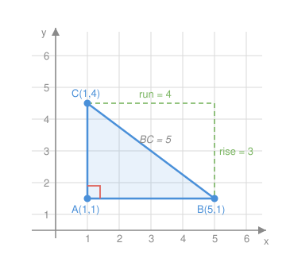

# Euclidean Geometry · Lesson 4.2: Coordinate geometry

> ⏱ ~15 min · Module 4: Measurement, coordinates & transformations · Builds on: 2.3 (the Pythagorean theorem) · Unlocks: 4.3 (rigid transformations & symmetry)

## Why this matters

For three modules you've proved things by *reasoning* about a figure — congruent triangles, equal angles, a chain of justified statements. Coordinate geometry hands you a second, utterly different weapon: pin the figure to a grid, and every geometric claim ("this angle is right," "these sides are equal," "this is a parallelogram") becomes a short piece of **arithmetic**. This is the bridge from Euclid to Descartes, and it's the exact machinery that `calc-refresher` runs on (slopes are derivatives) and that `linalg-refresher` generalizes (points become vectors). Once a shape lives on axes, you can *compute* the truth instead of arguing for it.

## The idea

Give every point an address $(x, y)$. Then three questions carry almost all of plane geometry, and each has a one-line answer:

- **How far apart are two points?** Draw the right triangle whose hypotenuse joins them; the horizontal and vertical gaps are the legs, and Pythagoras gives the distance.
- **What's the point exactly between them?** Average the two addresses.
- **Which way does a line tilt?** Count how much it rises per step it runs — that's the slope.

And two facts about slope decide the shape's whole character: **parallel lines have the same slope** (same tilt), and **perpendicular lines have slopes that multiply to $-1$** (tilt one, then quarter-turn). With just distance and slope you can prove a triangle is right, a triangle is isosceles, or a quadrilateral is a parallelogram — no protractor, no two-column proof.

## The formal version

Let $P=(x_1,y_1)$ and $Q=(x_2,y_2)$.

**Distance** — Pythagoras on the plane:
$$d(P,Q)=\sqrt{(x_2-x_1)^2+(y_2-y_1)^2}.$$
In words: the straight-line gap is the square root of (horizontal gap)² plus (vertical gap)². The horizontal gap $x_2-x_1$ and vertical gap $y_2-y_1$ are the two legs of a right triangle; $d$ is its hypotenuse. (Squaring erases the sign, so order doesn't matter.)

**Midpoint** — the average address:
$$M=\left(\frac{x_1+x_2}{2},\ \frac{y_1+y_2}{2}\right).$$
In words: the halfway point's coordinates are the averages of the endpoints' coordinates.

**Slope** — rise over run:
$$m=\frac{\Delta y}{\Delta x}=\frac{y_2-y_1}{x_2-x_1}\quad(x_1\ne x_2).$$
In words: how many units the line climbs for each unit it moves right. A vertical line has $\Delta x=0$, so its slope is undefined (not zero).

**Parallel test:** $\ell_1\parallel\ell_2\iff m_1=m_2$ (and they're distinct lines). Same tilt.

**Perpendicular test:** $\ell_1\perp\ell_2\iff m_1\,m_2=-1$, equivalently $m_2=-\dfrac{1}{m_1}$ — the **negative reciprocal**. In words: flip the fraction and change its sign. (Special case: a horizontal line, $m=0$, is perpendicular to a vertical line, whose slope is undefined — the formula can't see this one, so check it by eye.)

## Picture

Triangle $ABC$ with $A(1,1)$, $B(5,1)$, $C(1,4)$. Leg $AB$ runs $4$ right, leg $AC$ climbs $3$ up, and they meet at the right angle marked at $A$. The dashed rise/run along the hypotenuse $BC$ shows Pythagoras directly: $BC=\sqrt{4^2+3^2}=\sqrt{25}=5$. Slope of $BC=\dfrac{\Delta y}{\Delta x}=\dfrac{4-1}{1-5}=-\dfrac{3}{4}$ — it falls as you move right.

## Worked examples

**Example 1 (mechanical).** For $P(-1,2)$ and $Q(3,5)$, find the distance, the midpoint, and the slope of $PQ$.

Horizontal gap $\Delta x = 3-(-1)=4$; vertical gap $\Delta y = 5-2=3$.
$$d=\sqrt{4^2+3^2}=\sqrt{16+9}=\sqrt{25}=5.$$
$$M=\left(\frac{-1+3}{2},\ \frac{2+5}{2}\right)=\left(1,\ \tfrac{7}{2}\right).$$
$$m=\frac{\Delta y}{\Delta x}=\frac{3}{4}.$$
Notice the distance reused the same $3$–$4$–$5$ triangle from the Picture: distance *is* Pythagoras, every time.

**Example 2 (why you'd care).** Show that $A(0,0)$, $B(6,3)$, $C(4,7)$, $D(-2,4)$ is a **rectangle** — the coordinate proof a surveyor or a graphics engine runs to check that a frame is truly square-cornered.

*Step 1 — parallelogram?* Compare slopes of opposite sides.
$$m_{AB}=\frac{3-0}{6-0}=\frac12,\qquad m_{DC}=\frac{7-4}{4-(-2)}=\frac{3}{6}=\frac12\ \Rightarrow\ AB\parallel DC.$$
$$m_{AD}=\frac{4-0}{-2-0}=-2,\qquad m_{BC}=\frac{7-3}{4-6}=\frac{4}{-2}=-2\ \Rightarrow\ AD\parallel BC.$$
Both pairs of opposite sides are parallel, so $ABCD$ is a parallelogram.

*Step 2 — right angles?* Test adjacent sides $AB$ and $AD$:
$$m_{AB}\cdot m_{AD}=\tfrac12\cdot(-2)=-1\ \Rightarrow\ AB\perp AD.$$
A parallelogram with one right angle has four (opposite sides parallel force the rest), so $ABCD$ is a rectangle. $\blacksquare$

Two arithmetic checks replaced a page of classical argument — and if you wanted, $AB=\sqrt{6^2+3^2}=\sqrt{45}$ while $AD=\sqrt{2^2+4^2}=\sqrt{20}$ are unequal, so it's a genuine rectangle, not a square.

## Watch out

- You might think perpendicular slopes are just "opposite signs," but you need the **negative *reciprocal***: slope $2$ is perpendicular to $-\tfrac12$, **not** to $-2$. Flip *and* negate. A quick check: their product must be exactly $-1$.
- You might read a vertical line as slope $0$. It's the reverse — a **vertical** line has *undefined* slope ($\Delta x = 0$, division by zero); a **horizontal** line has slope $0$. Mixing these up flips your parallel/perpendicular conclusions.
- You might subtract inconsistently in the slope: $\dfrac{y_2-y_1}{x_1-x_2}$ silently flips the sign. Keep the *same* point first in both numerator and denominator: $\dfrac{y_2-y_1}{x_2-x_1}$.

## One-liner

> Pin a figure to a grid and geometry turns into arithmetic: distance is Pythagoras, the midpoint is an average, and slope — equal for parallel, negative-reciprocal for perpendicular — decides the shape.

## Problems

**P1 (🟢)** For $A(-2,1)$ and $B(4,9)$, find the length $AB$, the midpoint of $AB$, and the slope of line $AB$.

**P2 (🟡)** Triangle with vertices $A(2,1)$, $B(5,7)$, $C(8,1)$. Use the distance formula to prove it is isosceles. Then use slopes to decide whether the apex angle at $B$ is a right angle.

**P3 (🔴, optional)** Quadrilateral $ABCD$ has $A(-1,0)$, $B(2,-1)$, $C(5,3)$, $D(2,4)$. Prove it is a parallelogram by showing the diagonals $AC$ and $BD$ share a midpoint (i.e. bisect each other), then use slopes to decide whether it is a rectangle. *(That "diagonals bisect each other" test is a vector statement in disguise — you'll meet it again as $\vec{AC}$ and $\vec{BD}$ having the same midpoint in `linalg-refresher`.)*

Solutions

**P1** $\Delta x = 4-(-2)=6$, $\Delta y = 9-1=8$.
$$AB=\sqrt{6^2+8^2}=\sqrt{36+64}=\sqrt{100}=10.$$
$$M=\left(\frac{-2+4}{2},\ \frac{1+9}{2}\right)=(1,\ 5).$$
$$m=\frac{8}{6}=\frac{4}{3}.$$
(Another $6$–$8$–$10$ Pythagorean triple — a scaled $3$–$4$–$5$.)

**P2** Side lengths:
$$AB=\sqrt{(5-2)^2+(7-1)^2}=\sqrt{9+36}=\sqrt{45},$$
$$BC=\sqrt{(8-5)^2+(1-7)^2}=\sqrt{9+36}=\sqrt{45},$$
$$AC=\sqrt{(8-2)^2+(1-1)^2}=\sqrt{36}=6.$$
Since $AB=BC=\sqrt{45}$, the triangle is isosceles.
Now the apex $B$: $m_{BA}=\dfrac{1-7}{2-5}=\dfrac{-6}{-3}=2$ and $m_{BC}=\dfrac{1-7}{8-5}=\dfrac{-6}{3}=-2$. Their product is $2\cdot(-2)=-4\ne -1$, so $BA$ and $BC$ are **not** perpendicular — the apex angle is not a right angle. (Isosceles does not imply right.)

**P3** *Diagonals share a midpoint?*
$$\text{mid }AC=\left(\frac{-1+5}{2},\ \frac{0+3}{2}\right)=\left(2,\ \tfrac32\right),\qquad \text{mid }BD=\left(\frac{2+2}{2},\ \frac{-1+4}{2}\right)=\left(2,\ \tfrac32\right).$$
The diagonals meet at their common midpoint $\left(2,\tfrac32\right)$, so each bisects the other — and a quadrilateral whose diagonals bisect each other is a parallelogram. $\blacksquare$
*Rectangle?* Test adjacent sides at $B$: $m_{AB}=\dfrac{-1-0}{2-(-1)}=-\dfrac13$ and $m_{BC}=\dfrac{3-(-1)}{5-2}=\dfrac43$. Product $=-\dfrac13\cdot\dfrac43=-\dfrac{4}{9}\ne -1$, so the corner is not a right angle: it is a parallelogram but **not** a rectangle.

## Flashback

**From Lesson 2.3 (The Pythagorean theorem):** A triangle has side lengths $9$, $12$, and $16$. Using the converse of the Pythagorean theorem, classify it as acute, right, or obtuse.

Solution

Compare the square of the longest side to the sum of the squares of the other two:
$$16^2 = 256,\qquad 9^2+12^2 = 81+144 = 225.$$
Since $256 > 225$, the longest side is *longer* than a right triangle would require, so the angle opposite it opens past $90^\circ$: the triangle is **obtuse**. (Rule of thumb from the converse: $c^2>a^2+b^2$ ⇒ obtuse; $c^2=a^2+b^2$ ⇒ right; $c^2<a^2+b^2$ ⇒ acute.)

## Connections

- **Backward:** the distance formula *is* Lesson 2.3's Pythagorean theorem, applied to the right triangle whose legs are the coordinate gaps — nothing new, just re-dressed on a grid.
- **Forward:** Lesson 4.3 (rigid transformations) acts directly on these coordinates — a reflection over $y=x$ swaps $(x,y)\to(y,x)$, a translation adds a constant to each — and you'll verify that distances and slopes are preserved, which is *why* rigid motions produce congruent figures.
- **Sideways (calculus & linear algebra):** slope here becomes the derivative in `calc-refresher` (the tilt of a curve's tangent line) and the point $(x,y)$ becomes a **vector** in `linalg-refresher`, where distance is a norm and the perpendicular test $m_1 m_2=-1$ is the dot product equalling zero.
- **Sideways (trigonometry):** the unit circle of `trigonometry` lives on exactly these axes — $(\cos\theta,\sin\theta)$ is just a point whose distance from the origin is $1$, checked with the distance formula.
