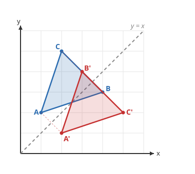

# Euclidean Geometry · Lesson 4.3: Rigid transformations & symmetry

> ⏱ ~15 min · Module 4: Measurement, coordinates & transformations · Builds on: 4.2 (coordinate geometry) · Unlocks: trigonometry (next course)

## Why this matters

Back in Lesson 2.1 you proved triangles congruent by hunting for matching sides and angles. There's a deeper, more physical definition hiding underneath: two figures are congruent when you can *pick one up and lay it exactly on the other* without bending or stretching it. Formalizing "pick up and lay down" gives you the three **rigid motions** — and once motion is described by coordinates, "rotate by an angle" is one algebra step away from $\sin$ and $\cos$. This is the door from geometry into trigonometry, and from there into how physics talks about changing your point of view.

## The idea

A **rigid motion** (or **isometry**) is any way of moving the whole plane that keeps every distance the same. Nothing gets stretched, squashed, or torn — a shape comes out the far side as an identical copy in a new position. There are exactly three basic kinds, and every rigid motion is a combination of them:

- **Translation** — slide everything the same distance in the same direction. No turning.
- **Rotation** — spin everything around a fixed pivot point by a fixed angle.
- **Reflection** — flip everything across a fixed mirror line, like a lake reflecting a shoreline.

The point that a shape lands on is its **image**; we mark it with a prime, so $A$ maps to $A'$. Because distances never change, the image is always **congruent** to the original — same side lengths, same angles, same area. That's the whole payoff: rigid motions are exactly the moves that preserve congruence.

## The formal version

A map $T$ of the plane is a **rigid motion** if it preserves distance: for every pair of points $P, Q$,
$$\lvert T(P)\,T(Q)\rvert = \lvert PQ\rvert .$$
*In words:* the distance between any two image points equals the distance between the originals. Distance-preservation automatically drags angle-preservation and area-preservation along with it.

On the coordinate plane, the basic motions become tidy rules on $(x,y)$:

- **Translation** by $(a,b)$: $\;(x,y)\mapsto (x+a,\;y+b)$.
- **Reflection** over the $x$-axis: $(x,y)\mapsto(x,\,-y)$; over the $y$-axis: $(x,y)\mapsto(-x,\,y)$; over the line $y=x$: $\;(x,y)\mapsto(y,\,x)$ — **just swap the coordinates**.
- **Rotation** about the origin, counterclockwise: $90^\circ$ sends $(x,y)\mapsto(-y,\,x)$; $\;180^\circ$ sends $(x,y)\mapsto(-x,\,-y)$; $\;270^\circ$ sends $(x,y)\mapsto(y,\,-x)$.

**Composition.** Doing one motion and then another gives another rigid motion. A brand-new type appears this way: a **glide reflection** is a reflection followed by a translation *along the mirror line* — the pattern of footprints you leave walking in a straight line (left, right, left, ...).

**Congruence, redefined.** Two figures are **congruent** exactly when some rigid motion carries one onto the other. This is the same congruence you proved with SSS/SAS/ASA in Lesson 2.1 — those criteria are just checkable fingerprints of "a rigid motion exists."

**Symmetry** is a rigid motion that maps a figure *onto itself*. A figure has **line symmetry** if some reflection leaves it unchanged (the mirror is an axis of symmetry), and **rotational symmetry of order $n$** if a rotation by $\dfrac{360^\circ}{n}$ about its center lands it back on itself.

## Picture

The blue triangle $ABC$ with $A(1,2),\,B(4,3),\,C(2,5)$ is reflected across the dashed mirror $y=x$. Swapping each point's coordinates gives the red image $A'(2,1),\,B'(3,4),\,C'(5,2)$. Notice each faint tie-line joining a point to its image crosses the mirror at a right angle and is bisected by it — that's what "mirror" means geometrically.

## Worked examples

**Example 1 (mechanical — reflect over $y=x$).** Reflect $\triangle ABC$ with $A(1,2),\,B(4,3),\,C(2,5)$ over the line $y=x$.

Apply $(x,y)\mapsto(y,x)$ to each vertex:
$$A(1,2)\mapsto A'(2,1),\qquad B(4,3)\mapsto B'(3,4),\qquad C(2,5)\mapsto C'(5,2).$$
Check that congruence survived. Original $AB=\sqrt{(4-1)^2+(3-2)^2}=\sqrt{10}$; image $A'B'=\sqrt{(3-2)^2+(4-1)^2}=\sqrt{10}$. Same length — as guaranteed, since reflection is a rigid motion. (One thing *does* flip: reading $A\to B\to C$ counterclockwise, the image reads $A'\to B'\to C'$ clockwise. Reflections reverse orientation; translations and rotations preserve it.)

**Example 2 (why you'd care — a glide reflection).** A designer stamps a footprint at $P(1,3)$, then wants the opposite foot: mirrored *and* stepped forward. Model "forward" as the $x$-direction. Reflect over the $x$-axis, then translate by $(4,0)$:
$$P(1,3)\;\xmapsto{\text{reflect}}\;(1,-3)\;\xmapsto{\text{glide }+4}\;(5,-3)=P'.$$
Repeat the same glide and you get the next left foot at $(9,3)$ — back to the original height, shifted by $8$. The whole trail is invariant under gliding by $8$ in $x$: that repeating footprint pattern *is* glide-reflection symmetry, and it's why you can't build such a strip from any single translation, rotation, or reflection alone. Composition genuinely buys you new motions.

## Watch out

- **You might think reflecting over $y=x$ means "negate the coordinates."** It doesn't — you **swap** them: $(x,y)\mapsto(y,x)$. Negating, $(x,y)\mapsto(-x,-y)$, is the $180^\circ$ rotation about the origin. Different move, different result.
- **You might think the pivot of a rotation is always the origin.** The clean rule $(x,y)\mapsto(-y,x)$ only holds for rotation *about the origin*. To rotate about another point, first translate that point to the origin, rotate, then translate back — order matters, and composition is generally **not** commutative (reflect-then-rotate $\neq$ rotate-then-reflect).
- **You might think more symmetry axes always means more rotational symmetry, or vice versa.** They're separate counts. A non-square rectangle has two lines of symmetry but only order-$2$ rotational symmetry; a pinwheel can have order-$4$ rotational symmetry and *no* mirror line at all. Check each independently.

## One-liner

> A rigid motion is any way of moving the plane that never changes a distance — slide, spin, or flip — and congruence is nothing more than "one rigid motion away."

## Problems

**P1 (🟢)** Let $A(3,1)$. Find its image under (a) reflection over $y=x$, (b) rotation $90^\circ$ counterclockwise about the origin, (c) rotation $180^\circ$ about the origin. State which of (a)–(c) reverse orientation.

**P2 (🟡)** For each figure, give the number of lines of symmetry and the order of rotational symmetry: (a) a non-square rectangle, (b) an equilateral triangle, (c) a regular hexagon, (d) the capital letter $\mathsf{S}$.

**P3 (🔴, optional)** Reflect the point $(x,y)$ over the $x$-axis, then reflect the result over the line $y=x$. Write the single rule for the composite map, identify it as one of the named rotations, and explain why the turn angle is $90^\circ$ using the angle between the two mirror lines.

Solutions

**P1** (a) Swap coordinates: $A'(1,3)$. (b) $90^\circ$ CCW uses $(x,y)\mapsto(-y,x)$: $A'(-1,3)$. (c) $180^\circ$ uses $(x,y)\mapsto(-x,-y)$: $A'(-3,-1)$. Reflection (a) reverses orientation; the two rotations (b) and (c) preserve it.

**P2**
(a) Non-square rectangle: $2$ lines of symmetry (the two through opposite side-midpoints), rotational symmetry of order $2$ (a $180^\circ$ turn).
(b) Equilateral triangle: $3$ lines of symmetry, order $3$ (turns of $120^\circ$).
(c) Regular hexagon: $6$ lines of symmetry, order $6$ (turns of $60^\circ$).
(d) Letter $\mathsf{S}$: $0$ lines of symmetry, but rotational symmetry of order $2$ — a $180^\circ$ turn maps it onto itself. (A clean example that rotational symmetry can exist with no mirror line.)

**P3** Reflect over the $x$-axis: $(x,y)\mapsto(x,-y)$. Now reflect *that* over $y=x$ (swap its coordinates): $(x,-y)\mapsto(-y,\,x)$. So the composite is
$$(x,y)\;\mapsto\;(-y,\,x),$$
which is exactly the rule for a **$90^\circ$ counterclockwise rotation about the origin**. Why $90^\circ$: composing two reflections across lines that meet at angle $\theta$ produces a rotation about their intersection by $2\theta$. The $x$-axis and the line $y=x$ meet at the origin at $\theta=45^\circ$, so the turn is $2\times 45^\circ = 90^\circ$. (This "two mirrors make a rotation" fact is the seed of how rotation-by-an-angle gets built in `trigonometry`.)

## Flashback

**From Lesson 4.2 (Coordinate geometry):** Quadrilateral $PQRS$ has vertices $P(-1,1),\,Q(2,2),\,R(3,-1),\,S(0,-2)$. Prove it is a parallelogram using slopes, then decide whether it is in fact a rhombus.

Solution

**Parallelogram (slopes).** Compute the four side slopes:
$$m_{PQ}=\frac{2-1}{2-(-1)}=\frac{1}{3},\qquad m_{RS}=\frac{-2-(-1)}{0-3}=\frac{-1}{-3}=\frac{1}{3},$$
$$m_{QR}=\frac{-1-2}{3-2}=-3,\qquad m_{SP}=\frac{1-(-2)}{-1-0}=\frac{3}{-1}=-3.$$
$PQ\parallel RS$ and $QR\parallel SP$, so both pairs of opposite sides are parallel — $PQRS$ is a parallelogram.

**Rhombus? (distances).** A rhombus is a parallelogram with all four sides equal:
$$PQ=\sqrt{3^2+1^2}=\sqrt{10},\quad QR=\sqrt{1^2+(-3)^2}=\sqrt{10},$$
$$RS=\sqrt{(-3)^2+(-1)^2}=\sqrt{10},\quad SP=\sqrt{(-1)^2+3^2}=\sqrt{10}.$$
All four sides equal $\sqrt{10}$, so yes — $PQRS$ is a rhombus. (Cross-check: the diagonals have slopes $m_{PR}=\frac{-1-1}{3-(-1)}=-\tfrac12$ and $m_{QS}=\frac{-2-2}{0-2}=2$; their product is $-1$, so the diagonals meet at right angles — the signature of a rhombus.)

## Connections

- **Backward:** This is the physical face of the congruence you proved with SSS/SAS/ASA in Lesson 2.1 — "congruent" now means "related by a rigid motion," and Lesson 4.2's distance and slope formulas are what let you *verify* a motion preserved the figure.
- **Forward:** In `trigonometry`, rotation by a general angle $\theta$ about the origin sends $(x,y)\mapsto(x\cos\theta-y\sin\theta,\;x\sin\theta+y\cos\theta)$ — the $90^\circ$ rule $(x,y)\mapsto(-y,x)$ is just the $\theta=90^\circ$ case. $\sin$ and $\cos$ are born precisely to describe rotations.
- **Sideways (`linalg-refresher`):** Every rotation and reflection about the origin is a $2\times 2$ **matrix** acting on the vector $\binom{x}{y}$; composition of motions becomes matrix multiplication, and "distance-preserving" becomes the condition for an **orthogonal** matrix.
- **Sideways (`abstract-algebra`):** The set of symmetries of a figure is closed under composition and inverses — it forms a **symmetry group** (the rectangle's group has order $4$, the regular hexagon's the dihedral group of order $12$). Symmetry is where group theory first becomes visible.
- **Sideways (physics):** "The laws don't change when you translate, rotate, or reflect your reference frame" is exactly rigid-motion invariance; via Noether's theorem those invariances are *why* momentum and angular momentum are conserved.
