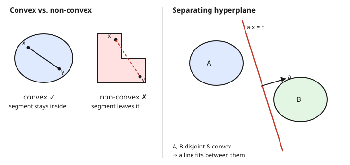

# Grad Game Theory · Lesson 1.1: Convex sets, convex functions, and separating hyperplanes

> ⏱ ~15 min · Module 1: Mathematical foundations · Builds on: [syllabus](../syllabus.md) · Unlocks: [1.2 Correspondences and Berge's maximum theorem](01-02-correspondences-berge-maximum-theorem.md)

## Why this matters

Every existence theorem in this course — a Nash equilibrium exists, a zero-sum game has a value, an optimal auction exists — rests on one geometric fact: **you can slip a flat wall between two convex bodies that don't touch**. That's the separating hyperplane theorem, and it is the engine behind minimax (1.4), Nash existence (2.3), and the Second Welfare Theorem in `grad-micro`. Game theory is unusually friendly to it, because the objects players choose over — mixed strategies — form convex, compact sets (simplices), and expected payoffs are *linear* in those choices. Convexity isn't a side topic here; it's the reason equilibria exist at all. This lesson installs the geometry.

## The idea

A set is **convex** if, whenever two points are in it, the whole straight segment joining them is in it too — no dents, no holes, no crescents. A filled disk is convex; a filled ring is not (a chord jumps the hole); an L-shape is not (the segment across the corner leaves the L). That's the entire concept: *closed under connecting the dots*.

A **convex function** is a different animal wearing a similar name. Picture the graph of $f$ as a valley. $f$ is convex if the valley "holds water" — every chord you draw between two points on the graph lies *above* the graph. A **concave** function is an upside-down valley (a hill): chords lie *below*. The bridge between the two ideas: a function is convex exactly when the region *above* its graph is a convex set. Same word, and now you see why.

Why a game theorist cares: a player mixing over three actions picks a probability vector $(p_1,p_2,p_3)$ with $p_i \ge 0$ and $\sum p_i = 1$. That set — the **simplex** — is a convex, compact triangle. And expected payoff, being an average weighted by these probabilities, is *linear* in $p$. Linear functions are both convex and concave, which is the best possible case: it is exactly the ingredient the fixed-point machinery of 1.3 needs to guarantee a best response exists and behaves well.

## The formal version

Throughout, we work in $\mathbb{R}^n$ with the usual inner product $a \cdot x = \sum_{i} a_i x_i$.

**Convex set.** A set $C \subseteq \mathbb{R}^n$ is convex if for all $x, y \in C$ and all $\lambda \in [0,1]$,
$$\lambda x + (1-\lambda) y \in C.$$
In words: mix any two members in any proportion and you stay inside. The point $\lambda x + (1-\lambda)y$ is a **convex combination** of $x$ and $y$; more generally $\sum_{i} \lambda_i x_i$ with $\lambda_i \ge 0$, $\sum_i \lambda_i = 1$ is a convex combination of the $x_i$. The **convex hull** $\operatorname{conv}(S)$ is the set of all convex combinations of points of $S$ — the smallest convex set containing $S$ (shrink-wrap $S$).

**Convex function.** A function $f : C \to \mathbb{R}$ on a convex domain is convex if for all $x,y \in C$, $\lambda \in [0,1]$,
$$f(\lambda x + (1-\lambda)y) \le \lambda f(x) + (1-\lambda) f(y).$$
In words: the graph never rises above its own chords. $f$ is **concave** if the inequality flips ($\ge$), equivalently if $-f$ is convex. It is **linear/affine** if equality always holds — then it is convex *and* concave at once.

**Epigraph criterion.** Let $\operatorname{epi}(f) = \{(x,t) : x \in C,\ t \ge f(x)\}$ be the region on and above the graph. Then
$$f \text{ convex} \iff \operatorname{epi}(f) \text{ is a convex set.}$$
In words: the "convex function" idea is literally the "convex set" idea applied to the region above the graph — one concept, two costumes.

**Jensen's inequality.** If $f$ is convex and $X$ is a random variable (or $\lambda_i$ a set of weights), then $f(\mathbb{E}[X]) \le \mathbb{E}[f(X)]$. In words: for a convex $f$, the function of the average is below the average of the function — the one-line engine behind risk aversion (1.5) and many bounds.

**Separating hyperplane theorem.** A **hyperplane** is a level set $H = \{x \in \mathbb{R}^n : a \cdot x = c\}$ for some nonzero normal vector $a$ and scalar $c$; it splits space into two half-spaces $\{a\cdot x \le c\}$ and $\{a \cdot x \ge c\}$. Now: let $A, B \subseteq \mathbb{R}^n$ be nonempty, disjoint, convex sets, with $A$ compact and $B$ closed. Then there exist a nonzero $a$ and scalar $c$ with
$$a \cdot x \le c \le a \cdot y \quad \text{for all } x \in A,\ y \in B,$$
and the separation can be made **strict** ($<$ on both sides). In words: two convex sets that don't touch — one of them compact — can be walled off by a flat plane, with $A$ entirely on one side and $B$ on the other.

**Supporting hyperplane.** If $x_0$ is a boundary point of a convex set $C$, there is a hyperplane through $x_0$ with all of $C$ on one side: $a \cdot x \le a \cdot x_0$ for all $x \in C$. In words: a convex body has a flat "tangent wall" resting against it at every boundary point.

**Extreme points and Krein–Milman (lightly).** A point $e \in C$ is an **extreme point** if it is *not* a convex combination of two other points of $C$ — a genuine corner, not an interior or edge point. Krein–Milman: a compact convex set equals the convex hull of its extreme points. For the simplex $\Delta = \{p \in \mathbb{R}^n : p_i \ge 0,\ \sum_i p_i = 1\}$, the extreme points are the vertices $e_1, \dots, e_n$ — the **pure strategies**. So: every mixed strategy is a convex combination of pure strategies, and the pure strategies are exactly the corners.

## Picture

## Worked examples

**Example 1 (the mixed-strategy simplex is convex; its extreme points are the pure strategies).**

Take three actions, so mixed strategies live in $\Delta = \{p \in \mathbb{R}^3 : p_1,p_2,p_3 \ge 0,\ p_1+p_2+p_3 = 1\}$ — a triangle with vertices $e_1=(1,0,0)$, $e_2=(0,1,0)$, $e_3=(0,0,1)$.

*Convex?* Take $p, q \in \Delta$ and $\lambda \in [0,1]$, and set $r = \lambda p + (1-\lambda) q$. Each coordinate $r_i = \lambda p_i + (1-\lambda)q_i \ge 0$ (a nonnegative mix of nonnegatives). And $\sum_i r_i = \lambda \sum_i p_i + (1-\lambda)\sum_i q_i = \lambda \cdot 1 + (1-\lambda)\cdot 1 = 1$. Both defining conditions survive, so $r \in \Delta$. Hence $\Delta$ is convex. (The same two lines work for any number of actions: $\Delta$ is always convex, and it's compact — closed and bounded in $\mathbb{R}^n$.)

*Extreme points?* A vertex like $e_1 = (1,0,0)$ cannot be written as $\lambda p + (1-\lambda)q$ with $p \ne q$ both in $\Delta$ and $\lambda \in (0,1)$: to get the second coordinate $0 = \lambda p_2 + (1-\lambda) q_2$ with all terms $\ge 0$ forces $p_2 = q_2 = 0$, and likewise $p_3 = q_3 = 0$, so $p = q = e_1$ — no genuine mixing. So each vertex is extreme. Conversely any interior or edge point *is* a nontrivial mix (e.g. $(\tfrac12,\tfrac12,0) = \tfrac12 e_1 + \tfrac12 e_2$), so it is not extreme. The extreme points are exactly the three pure strategies, and $\Delta = \operatorname{conv}(e_1,e_2,e_3)$ — Krein–Milman made concrete.

**Example 2 (expected payoff is linear — hence concave — in your own mixed strategy).**

Two players; you have $m$ actions, the opponent $n$. Your payoffs are a matrix $A \in \mathbb{R}^{m\times n}$, so if you play row $i$ and they play column $j$ you get $A_{ij}$. With your mixed strategy $p \in \Delta_m$ and theirs $q \in \Delta_n$ *held fixed*, your expected payoff is
$$u(p) = p^{\top} A q = \sum_{i=1}^m \sum_{j=1}^n p_i\, A_{ij}\, q_j.$$
Fix $q$ and define the constant vector $w = Aq \in \mathbb{R}^m$ (the expected payoff of each pure row against $q$). Then $u(p) = p^\top w = \sum_i p_i w_i$ — a *linear* function of $p$. Check the definition directly: for $\lambda \in [0,1]$,
$$u(\lambda p + (1-\lambda)p') = (\lambda p + (1-\lambda)p')^\top w = \lambda\, p^\top w + (1-\lambda)\, p'^\top w = \lambda\, u(p) + (1-\lambda)\, u(p').$$
Equality holds always, so $u$ is convex *and* concave in $p$ — in particular **quasiconcave**. That matters downstream: the set of best responses $\arg\max_{p \in \Delta_m} u(p)$ is then a *convex* subset of the (convex, compact) simplex, which is exactly the "convex-valued best-response correspondence" that Kakutani's theorem demands in 2.3. Convex strategy set + linear payoff = existence machinery, fully loaded.

## Watch out

- **Convex SET vs convex FUNCTION are different objects.** A set is convex or not; a function is convex or not. The only bridge is the epigraph: $f$ is a convex function iff the *set* above its graph is convex. Don't say "the simplex is a convex function" — it's a set.
- **Separation needs a closedness/compactness hypothesis; drop it and even disjoint convex sets can fail to be strictly separated.** Classic counterexample in $\mathbb{R}^2$: let $A = \{(x,y) : y \le 0\}$ (closed lower half-plane) and $B = \{(x,y) : x > 0,\ y \ge 1/x\}$ (the region above a hyperbola in the first quadrant). Both are convex and *disjoint* — $B$ stays strictly above the $x$-axis. But $B$ hugs the axis asymptotically as $x \to \infty$, so the *only* line separating them is $y = 0$, which touches $A$: no **strict** separation exists. The compactness of one set (absent here — both are unbounded) is exactly what buys the strict gap.
- **Linear ⇒ both convex and concave.** Because equality holds in the defining inequality, an affine payoff satisfies concavity *and* convexity. This is a feature, not a bug: it's why expected payoff is quasiconcave in a player's own mixed strategy, which is precisely what makes best responses convex-valued. Concavity would be enough; linearity gives it for free.

## One-liner

> Convex means "closed under connecting the dots," a convex function is one whose epigraph is convex, and two non-touching convex sets (one compact) can always be walled apart by a flat hyperplane — the geometric fact every existence proof in game theory secretly uses.

## Problems

**P1 (🟢)** Show that the intersection of two convex sets $C, D \subseteq \mathbb{R}^n$ is convex. Then give a one-line reason the feasible set of a linear program, $\{x : Ax \le b,\ x \ge 0\}$, is convex.

**P2 (🟡)** Separate the two disjoint convex sets $A = \{(x,y) : x \le 0\}$ and $B = \{(x,y) : (x-3)^2 + y^2 \le 1\}$ (the closed disk of radius 1 centered at $(3,0)$) with an *explicit* hyperplane $a\cdot x = c$: give $a$ and $c$, and verify the separating inequalities.

**P3 (🔴, optional)** A function $f:\mathbb{R}\to\mathbb{R}$ is convex, and $g$ is convex *and* nondecreasing. Prove the composition $g \circ f$ is convex. Then use this (with $g(t)=e^t$) plus Jensen to give a one-line proof that $\mathbb{E}[e^{X}] \ge e^{\mathbb{E}[X]}$ for any random variable $X$ — the inequality behind the moment generating function's convexity.

Solutions

**P1** Let $x, y \in C \cap D$ and $\lambda \in [0,1]$. Since $x,y \in C$ and $C$ is convex, $\lambda x + (1-\lambda)y \in C$; since $x,y \in D$ and $D$ is convex, $\lambda x + (1-\lambda)y \in D$. Hence the mix lies in $C \cap D$, which is therefore convex. (The argument extends to any intersection of convex sets, finite or infinite.)

For the LP feasible set: each constraint defines a half-space $\{x : a_k \cdot x \le b_k\}$ or $\{x : x_i \ge 0\}$, and a half-space is convex (if $a\cdot x \le b$ and $a \cdot y \le b$ then $a\cdot(\lambda x + (1-\lambda)y) = \lambda(a\cdot x)+(1-\lambda)(a\cdot y) \le b$). The feasible set is the intersection of these half-spaces, hence convex by the first part. (A convex set carved out by finitely many linear inequalities is a **polyhedron**; the simplex is one.)

**P2** Both sets are convex and disjoint: $A$ is the closed left half-plane, $B$ is a disk sitting to the right of the $y$-axis (its leftmost point is $(2,0)$, still positive). The obvious wall is the vertical line between them. Take $a = (1,0)$ and $c = 1$, i.e. the hyperplane $x = 1$.

- For $(x,y) \in A$: $x \le 0 \le 1$, so $a\cdot(x,y) = x \le 1 = c$. ✓
- For $(x,y) \in B$: $(x-3)^2 \le 1$ forces $2 \le x \le 4$, so $a\cdot(x,y) = x \ge 2 > 1 = c$. ✓

Thus $a \cdot z \le c \le a \cdot w$ for all $z \in A$, $w \in B$, with strict separation (the gap is the strip $0 < x < 2$). Any $c \in (0,2)$ works; $c=1$ centers the wall in the gap.

**P3** *Composition.* Fix $x, y$ and $\lambda \in [0,1]$, write $z = \lambda x + (1-\lambda)y$. Since $f$ is convex, $f(z) \le \lambda f(x) + (1-\lambda)f(y)$. Since $g$ is nondecreasing, applying $g$ preserves the inequality:
$$g(f(z)) \le g\big(\lambda f(x) + (1-\lambda)f(y)\big).$$
Since $g$ is convex, the right-hand side is $\le \lambda\, g(f(x)) + (1-\lambda)\, g(f(y))$. Chaining:
$$g(f(z)) \le \lambda\, g(f(x)) + (1-\lambda)\, g(f(y)),$$
which is exactly convexity of $g \circ f$. (The monotonicity of $g$ is essential — without it, the first step could reverse.)

*Application.* $g(t) = e^t$ is convex and increasing, and any $X$ gives $\mathbb{E}[e^X] \ge e^{\mathbb{E}[X]}$ directly from Jensen's inequality applied to the convex function $t \mapsto e^t$: $\mathbb{E}[g(X)] \ge g(\mathbb{E}[X])$. (This is Jensen used raw; the composition rule is what lets you build such convex $g\circ f$ in the first place — e.g. $e^{f(x)}$ is convex whenever $f$ is.)

## Connections

- **Forward (1.2):** [Correspondences and Berge's maximum theorem](01-02-correspondences-berge-maximum-theorem.md) upgrades "best response" from a point to a *set*; convex-valuedness (Example 2) is one of the properties Berge and Kakutani track.
- **Forward (1.3):** [Brouwer and Kakutani fixed-point theorems](01-03-brouwer-kakutani-fixed-points.md) require a *convex, compact* domain — the simplex of Example 1 is that domain, and convexity is not optional (Brouwer fails on a ring).
- **Forward (1.4 & 2.3):** the minimax theorem (1.4) *is* a separating-hyperplane statement about the payoff sets of a zero-sum game, and Nash existence (2.3) feeds a convex-valued best-response map into Kakutani. This lesson is the tool; those are the payoffs.
- **Sideways (`grad-micro`):** the *same* separating hyperplane theorem proves the **Second Welfare Theorem** — a Pareto-efficient allocation can be supported as a competitive equilibrium by separating the aggregate "better-than" set from the aggregate production set with a price hyperplane (the normal $a$ is the price vector). See [grad-micro](../../grad-micro/syllabus.md); it is genuinely the identical theorem, prices playing the role of $a$.
- **Sideways (`real-analysis`):** compactness (closed + bounded in $\mathbb{R}^n$) is the hypothesis that makes separation *strict* and that guarantees the max in "best response" is attained — see [real-analysis](../../real-analysis/syllabus.md). Hyperplanes, inner products, and half-spaces are the linear-algebra layer from [linalg-refresher](../../linalg-refresher/syllabus.md).
