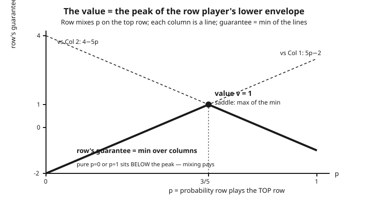

# Grad Game Theory · Lesson 1.4: Zero-sum games, minimax, and LP duality

> ⏱ ~15 min · Module 1: Mathematical foundations · Builds on: [1.3 Brouwer and Kakutani fixed-point theorems](01-03-brouwer-kakutani-fixed-points.md) · Unlocks: [1.5 Expected utility and the von Neumann–Morgenstern axioms](01-05-expected-utility-vnm-axioms.md)

## Why this matters

Zero-sum games are the one corner of game theory that is *completely solved*: a two-player, strictly-opposed game has a single well-defined "value," a price of playing it, and both players can guarantee it. This is the theorem that launched the field — von Neumann's 1928 minimax result — and it is the cleanest possible instance of the equilibrium ideas that dominate the rest of the course. It also reveals a structural fact you will meet again in mechanism design: the row player's optimization and the column player's optimization are **the same linear program viewed from two sides**, so the entire theorem falls out of LP duality. Learn it here where interests are perfectly opposed, and the general-sum machinery in Module 2 will feel like a controlled loosening of these bolts.

## The idea

Two players, one payoff matrix $A$. The **row player** picks a row, the **column player** picks a column, and the number sitting at that entry is paid *by the column player to the row player*. So the row player wants it large, the column player wants it small — their interests are exactly opposed (whatever one gains, the other loses; that is what "zero-sum" means).

Now think about guarantees. If the row player must commit first, she reasons: "for each row I could pick, the opponent will drive me to the *worst* entry in that row; I'll pick the row whose worst case is best." That best-of-the-worst number is her **maxmin** — what she can *guarantee* no matter what. The column player, committing first, reasons symmetrically and lands on his **minmax**. Obviously committing first is a disadvantage, so maxmin $\le$ minmax: what you can guarantee never beats what your opponent can hold you to.

Here is the miracle. With *pure* rows and columns there is usually a gap — think of matching pennies, where whoever moves first gets exploited. But allow each player to **randomize** — pick a *probability distribution* over their moves — and the gap slams shut. Randomizing hides your choice, and von Neumann proved that once both players can hide, maxmin and minmax meet at a single number: the **value** of the game. Neither player can do better than guarantee the value; neither can be forced below it.

## The formal version

Let $A$ be an $m \times n$ real matrix. A **mixed strategy** for the row player is a probability vector $x \in \Delta_m = \{x \in \mathbb{R}^m : x_i \ge 0, \sum_i x_i = 1\}$; similarly $y \in \Delta_n$ for the column player. The expected payoff (row receives, column pays) is
$$x^\top A y = \sum_{i,j} x_i A_{ij} y_j.$$

**Weak duality (the easy direction).** For every matrix $A$,
$$\max_{x \in \Delta_m} \ \min_{y \in \Delta_n} \ x^\top A y \ \le \ \min_{y \in \Delta_n} \ \max_{x \in \Delta_m} \ x^\top A y.$$

*In words:* what the row player can guarantee by moving first (worst-case over the opponent's reply) can never exceed what the column player can hold her to by moving first. Committing first is weakly worse.

*Why it's true — one line.* Write $L(x) = \min_y x^\top A y$ and $R(y) = \max_x x^\top A y$. For **any** $x,y$ we have $L(x) \le x^\top A y \le R(y)$. So $L(x) \le R(y)$ for every pair, and therefore $\max_x L(x) \le \min_y R(y)$.

**Von Neumann Minimax Theorem.** For every real matrix $A$,
$$\max_{x \in \Delta_m} \ \min_{y \in \Delta_n} \ x^\top A y \ = \ \min_{y \in \Delta_n} \ \max_{x \in \Delta_m} \ x^\top A y \ =: \ v,$$
and there exist $x^* \in \Delta_m$, $y^* \in \Delta_n$ (a **saddle point**) with
$$x^\top A y^* \ \le \ v \ \le \ (x^*)^\top A y \qquad \text{for all } x \in \Delta_m,\ y \in \Delta_n.$$

*In words:* with mixing allowed, the two guarantees coincide at a single number $v$, the **value** of the game. The pair $(x^*, y^*)$ is a mutual best response — $x^*$ secures *at least* $v$ against every column play, and $y^*$ holds the row to *at most* $v$ — so neither player regrets their choice.

Two ways to prove it; they are the same idea twice.

**(a) Separating hyperplane (von Neumann's route).** Let $C = \{Ay : y \in \Delta_n\} \subset \mathbb{R}^m$ be the set of payoff-vectors the column player can produce (coordinate $i$ = row $i$'s payoff). $C$ is convex and compact. After shifting $A$ by a constant so the value is nonnegative, either $C$ meets the nonpositive orthant — the column player can make *every* row's payoff $\le 0$, so the value is $\le 0$ — or it is disjoint from it, and the **separating hyperplane theorem** (Lesson [1.1](01-01-convex-sets-functions-separating-hyperplanes.md)) produces a normal vector which, normalized, is a mixed strategy $x^*$ guaranteeing the row a strictly positive payoff. Chasing the shift constant pins maxmin $=$ minmax. The convexity of the payoff set and the ability to separate are doing all the work.

**(b) LP duality.** The row player's problem is a **linear program**: choose $x \in \Delta_m$ and a scalar $v$ to
$$\max_{x, v} \ v \quad \text{s.t.} \quad (x^\top A)_j \ge v \ \ \forall j, \qquad \textstyle\sum_i x_i = 1, \quad x \ge 0.$$
*In words:* maximize the floor $v$ subject to "against every pure column $j$, my expected payoff $(x^\top A)_j$ is at least $v$." Its **dual** is exactly the column player's LP,
$$\min_{y, w} \ w \quad \text{s.t.} \quad (Ay)_i \le w \ \ \forall i, \qquad \textstyle\sum_j y_j = 1, \quad y \ge 0,$$
i.e. minimize the ceiling $w$ subject to "against every pure row $i$, the payoff is at most $w$." **Strong LP duality** says the two optima are equal, $v = w$ — which is precisely maxmin $=$ minmax. And strong LP duality is itself a corollary of the separating hyperplane theorem, so (a) and (b) are one theorem in two costumes.

**Complementary slackness $\leftrightarrow$ support.** At an optimal pair, if a column $j$ has *slack* — $(x^*{}^\top A)_j > v$, i.e. it is strictly worse than the value for the column player — then $y^*_j = 0$; symmetrically, a row that earns strictly less than $v$ gets $x^*_i = 0$. *In words:* each player puts positive weight only on actions that are exactly best responses (tight constraints). Support equals tightness.

## Picture

The row player mixes probability $p$ on the top row. Against each pure column the payoff is a straight line in $p$; the row player is only *guaranteed* the **minimum** of those lines (the opponent picks the column that hurts most). That lower envelope is a tent, and its **peak** — the highest floor the row player can secure — is the value $v$, attained at the mixing probability where the binding columns cross. Pure play ($p=0$ or $p=1$) sits strictly below the peak: that gap *is* the reason to randomize.

## Worked examples

**Example 1 (a 2×2 game with no pure saddle — solve by indifference).** Take
$$A = \begin{pmatrix} 3 & -1 \\ -2 & 4 \end{pmatrix}.$$
*Check there is no pure saddle.* Row minima are $-1$ (row 1) and $-2$ (row 2), so pure maxmin $= -1$. Column maxima are $3$ (col 1) and $4$ (col 2), so pure minmax $= 3$. Since $-1 < 3$, no entry is simultaneously the min of its row and max of its column — pure play has a gap. Mixing must close it.

*Row player's mix.* Let the row player play row 1 with probability $p$. Against the two columns her expected payoffs are
$$\text{col 1: } 3p - 2(1-p) = 5p - 2, \qquad \text{col 2: } -1\cdot p + 4(1-p) = 4 - 5p.$$
Her optimum makes the column *indifferent* (if one column were better for the opponent, he'd exploit it and she could do better by re-tilting). Set them equal:
$$5p - 2 = 4 - 5p \ \Rightarrow\ 10p = 6 \ \Rightarrow\ p = \tfrac{3}{5}, \qquad v = 5\cdot\tfrac{3}{5} - 2 = 1.$$
So $x^* = \left(\tfrac{3}{5}, \tfrac{2}{5}\right)$ and $v = 1$.

*Column player's mix.* Let him play column 1 with probability $q$; make the *row* indifferent:
$$\text{row 1: } 3q - (1-q) = 4q - 1, \qquad \text{row 2: } -2q + 4(1-q) = 4 - 6q,$$
$$4q - 1 = 4 - 6q \ \Rightarrow\ 10q = 5 \ \Rightarrow\ q = \tfrac{1}{2}, \qquad v = 4\cdot\tfrac12 - 1 = 1.$$
So $y^* = \left(\tfrac12, \tfrac12\right)$.

*Verify the saddle.* $(x^*)^\top A = \left(\tfrac35, \tfrac25\right)A = \left(\tfrac{9-4}{5}, \tfrac{-3+8}{5}\right) = (1,1)$, so $x^*$ earns exactly $1$ against **either** column, hence $\ge 1$ against any mix. Likewise $Ay^* = \left(\tfrac{3-1}{2}, \tfrac{-2+4}{2}\right)^\top = (1,1)^\top$, so any row earns exactly $1$ against $y^*$. Thus maxmin $=$ minmax $= v = 1$ — a number strictly between the pure guarantees $-1$ and $3$. This is the game drawn in the Picture.

**Example 2 (a 2×3 game via LP duality — complementary slackness picks the support).** Take
$$A = \begin{pmatrix} 2 & 0 & 3 \\ -1 & 4 & 1 \end{pmatrix}.$$
Row player mixes $p$ on row 1. The three column lines are
$$\text{col 1: } 3p - 1, \qquad \text{col 2: } 4 - 4p, \qquad \text{col 3: } 2p + 1.$$
Graphically (the lower envelope of three lines), the top of the envelope is where cols 1 and 2 cross:
$$3p - 1 = 4 - 4p \ \Rightarrow\ 7p = 5 \ \Rightarrow\ p = \tfrac{5}{7}, \qquad v = 3\cdot\tfrac57 - 1 = \tfrac{8}{7}.$$
At $p = \tfrac57$, col 3 gives $2\cdot\tfrac57 + 1 = \tfrac{17}{7} > \tfrac{8}{7}$ — **strictly above** the value. Column 3 is slack: the column player would never use it, so **complementary slackness forces $y^*_3 = 0$**.

Now solve the column's LP on the support $\{1,2\}$: play col 1 with probability $q$, col 2 with $1-q$, make the row indifferent:
$$\text{row 1: } 2q, \qquad \text{row 2: } -q + 4(1-q) = 4 - 5q, \qquad 2q = 4 - 5q \ \Rightarrow\ q = \tfrac47,$$
giving $y^* = \left(\tfrac47, \tfrac37, 0\right)$ and $v = 2\cdot\tfrac47 = \tfrac{8}{7}$ — matching the primal value exactly, as strong duality demands. The primal LP was
$$\max v \ \text{ s.t. } \ 2x_1 - x_2 \ge v,\ \ 4x_2 \ge v,\ \ 3x_1 + x_2 \ge v,\ \ x_1 + x_2 = 1,\ x \ge 0,$$
with optimum $x^* = \left(\tfrac57, \tfrac27\right)$, $v = \tfrac87$; its dual is the column LP above. The two agree — LP duality *is* the minimax theorem, and slackness *is* the reason column 3 sits idle.

## Watch out

- **You might think maxmin $=$ minmax always holds. It does not — only for *mixed* strategies.** In pure strategies the gap in Example 1 ($-1$ vs $3$) is real; that gap is exactly *why* you randomize. The theorem needs the convexity of $\Delta_m, \Delta_n$; drop mixing and it fails.
- **You might think the optimal strategies are unique. Only the *value* $v$ is unique.** A player can have a whole set of optimal mixes (e.g. when a strategy is redundant), yet every optimal pair yields the same $v$. Bet on the number, not the strategy.
- **You might think a player's security level always equals their equilibrium payoff. That is a zero-sum-only coincidence.** In general-sum games, what you can *guarantee* (maxmin) is typically strictly below your Nash equilibrium payoff, because your opponent is pursuing his own gain rather than purely minimizing yours. The clean "value" collapses; you need Nash existence via Kakutani (Lesson 2.3) instead. Zero-sum is special precisely because the two players' objectives are one function with opposite signs.

## One-liner

> Let both players randomize and a strictly-opposed game acquires a single price — the value — where the row's best floor meets the column's best ceiling; and that meeting is nothing but LP duality (a separating hyperplane) in disguise.

## Problems

**P1 (🟢)** For the game $A = \begin{pmatrix} 1 & -1 \\ -1 & 1 \end{pmatrix}$ (matching pennies), find the value and both players' optimal mixed strategies by the indifference method, and state the pure maxmin and pure minmax to confirm there is a gap.

**P2 (🟡)** A game has value $v$ and optimal strategies $(x^*, y^*)$. Prove that if a pure column $j$ is played with positive weight at optimum ($y^*_j > 0$), then $(x^*{}^\top A)_j = v$ exactly — i.e. every column in the support earns the column player precisely the value. (This is complementary slackness; prove it directly from the saddle inequalities, no LP machinery.)

**P3 (🔴, optional)** Consider $A = \begin{pmatrix} 4 & 0 & 2 \\ 0 & 3 & 5 \end{pmatrix}$. Row player mixes $p$ on row 1. Write the three column lines in $p$, find the value and $x^*$ from the lower envelope, identify which column is *not* in the column player's support, and solve for $y^*$ on the remaining support. Confirm the primal and dual values agree.

Solutions

**P1** Row plays row 1 with probability $p$. Payoffs: col 1 gives $p - (1-p) = 2p - 1$; col 2 gives $-p + (1-p) = 1 - 2p$. Indifference: $2p - 1 = 1 - 2p \Rightarrow p = \tfrac12$, and $v = 2\cdot\tfrac12 - 1 = 0$. By symmetry the column player also plays $\left(\tfrac12, \tfrac12\right)$. So $x^* = y^* = \left(\tfrac12,\tfrac12\right)$, $v = 0$.

Pure guarantees: row minima are $-1, -1$, so pure maxmin $= -1$; column maxima are $1, 1$, so pure minmax $= +1$. Gap of $-1 < 1$: no pure saddle, and mixing lands cleanly in the middle at $0$. ✓

**P2** From the saddle definition, $x^\top A y^* \le v \le (x^*)^\top A y$ for all $x, y$. Take the right inequality with $y = e_j$ (the pure column $j$): $(x^*)^\top A e_j = (x^*{}^\top A)_j \ge v$ for **every** $j$. So each column earns the row *at least* $v$; equivalently, no column can hold the row below $v$.

Now suppose $(x^*{}^\top A)_j > v$ for some $j$ with $y^*_j > 0$. Average these column-payoffs with weights $y^*$:
$$(x^*)^\top A y^* = \sum_j y^*_j\, (x^*{}^\top A)_j \ge v,$$
with the inequality **strict** if any positively-weighted column has $(x^*{}^\top A)_j > v$ (a strict term with positive weight lifts the weighted average). That gives $(x^*)^\top A y^* > v$. But the left saddle inequality with $x = x^*$ says $(x^*)^\top A y^* \le v$ — contradiction. Hence every $j$ in the support satisfies $(x^*{}^\top A)_j = v$. $\qquad\blacksquare$

**P3** Row mixes $p$ on row 1. Column lines:
$$\text{col 1: } 4p + 0(1-p) = 4p, \quad \text{col 2: } 0\cdot p + 3(1-p) = 3 - 3p, \quad \text{col 3: } 2p + 5(1-p) = 5 - 3p.$$
Note col 3 $= 5 - 3p$ sits *always* above col 2 $= 3 - 3p$ by exactly $2$: it pays the row strictly more than col 2 at every $p$, so the column player never touches it. The lower envelope is therefore $\min(4p,\ 3-3p,\ 5-3p) = \min(4p,\ 3-3p)$. Cols 1 and 2 cross at
$$4p = 3 - 3p \ \Rightarrow\ 7p = 3 \ \Rightarrow\ p = \tfrac37, \qquad v = 4\cdot\tfrac37 = \tfrac{12}{7}.$$
So $x^* = \left(\tfrac37, \tfrac47\right)$, value $\tfrac{12}{7}$, and **column 3 is not in the support** ($y^*_3 = 0$): at $p = \tfrac37$ it pays $5 - 3\cdot\tfrac37 = \tfrac{26}{7} > \tfrac{12}{7}$, slack.

Column solves on $\{1, 2\}$: play col 1 with probability $q$, col 2 with $1-q$; make the row indifferent:
$$\text{row 1: } 4q + 0(1-q) = 4q, \qquad \text{row 2: } 0\cdot q + 3(1-q) = 3 - 3q,$$
$$4q = 3 - 3q \ \Rightarrow\ 7q = 3 \ \Rightarrow\ q = \tfrac37, \qquad v = 4\cdot\tfrac37 = \tfrac{12}{7}.$$
So $y^* = \left(\tfrac37, \tfrac47, 0\right)$ and the dual value $\tfrac{12}{7}$ matches the primal — strong duality holds. ✓

## Flashback

**From Lesson 1.1 (Convexity and separating hyperplanes):** Let $C = \operatorname{conv}\{(0,0),\ (2,0),\ (0,2)\} \subset \mathbb{R}^2$ (a filled triangle) and let $z = (3,3)$. Produce an explicit separating hyperplane: a vector $p \in \mathbb{R}^2$ and scalar $c$ with $p \cdot w \le c$ for all $w \in C$ and $p \cdot z > c$.

Solution

Take $p = (1,1)$, $c = 2$. On $C$, every point is a convex combination of the three vertices, and $p \cdot (\text{vertex})$ equals $0, 2, 2$ respectively — all $\le 2$ — so by linearity $p \cdot w \le 2$ for all $w \in C$ (the max over a convex hull is attained at a vertex). At the outside point, $p \cdot z = 3 + 3 = 6 > 2$. So the line $x_1 + x_2 = 2$ strictly separates $z$ from $C$. (This is the same construction that, applied to the column player's payoff set $C = \{Ay\}$, produces the minimax theorem — a separating direction, normalized, becomes an optimal mixed strategy.) ✓

## Connections

- **Backward:** the minimax theorem *is* the separating hyperplane theorem of [1.1](01-01-convex-sets-functions-separating-hyperplanes.md) applied to the convex payoff set $\{Ay : y \in \Delta_n\}$; and it is equally a corollary of Kakutani ([1.3](01-03-brouwer-kakutani-fixed-points.md)), since a saddle point is a fixed point of the joint best-response correspondence — the zero-sum special case of the Nash existence proof.
- **Forward:** [2.2–2.3](../syllabus.md) generalize this to **general-sum** Nash equilibrium, where the clean single value dissolves (interests no longer perfectly oppose) and existence needs Kakutani rather than LP duality. Zero-sum is the frictionless limit that case study builds on. LP duality returns in Module 5's mechanism design, where the primal–dual structure organizes optimal auctions.
- **Sideways (economics):** the primal–dual pairing here is the same object as the Lagrangian/shadow-price duality of constrained optimization in [grad-micro](../../grad-micro/syllabus.md) — the dual variables are prices that value each constraint, exactly as $y^*$ prices the row player's actions. The full linear-programming duality machinery is developed in [linalg-refresher](../../linalg-refresher/syllabus.md); this lesson is its most famous application.
- See also the [syllabus](../syllabus.md) for where Module 1 is heading.
