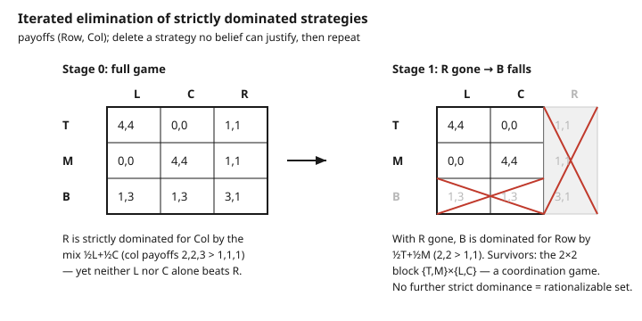

# Grad Game Theory · Lesson 2.1: Normal-form games, dominance, and rationalizability

> ⏱ ~15 min · Module 2: Nash equilibrium — existence and structure · Builds on: [1.5 Expected utility and the von Neumann–Morgenstern axioms](01-05-expected-utility-vnm-axioms.md) · Unlocks: [2.2 Nash equilibrium and mixed strategies](02-02-nash-equilibrium-mixed-strategies.md)

## Why this matters

Before you can ask "what will rational players *do*?" you need a language for "what could rational players *never* do." Dominance is that language: it prunes the strategy space using nothing but each player's own preferences — no guess about what the others believe, no equilibrium fixed point, no coordination. It is the weakest, safest solution concept, and everything stronger (Nash, correlated equilibrium, mechanism-design incentive compatibility) is a *refinement* that adds assumptions on top. Rationalizability then asks the sharpest question dominance can answer: which strategies are consistent with common knowledge that everyone is rational? Get this layer right and Nash in [2.2](02-02-nash-equilibrium-mixed-strategies.md) becomes "dominance plus mutual consistency," not a definition dropped from the sky.

## The idea

A normal-form game is a payoff table: each player picks a strategy simultaneously, and the profile of choices determines everyone's payoff. That's it — no timing, no information sets, just "everyone moves at once."

Now reason like a player. A strategy is **strictly dominated** if you have another option that pays *strictly more no matter what the opponents do*. You would never play it — not because you predict the opponents, but because you don't have to. Deleting it is belief-free. And once it's gone, the game is smaller, so a strategy that *wasn't* dominated before might become dominated now (some of the columns that propped it up are gone). Repeat until nothing more falls. That loop is **iterated elimination of strictly dominated strategies** (IESDS).

One twist that trips everyone: the dominating strategy might have to be a *mixture*. A pure strategy can beat every opponent-response only on average across a coin flip between two of your other strategies, while losing to each of those two alone in some column. Checking only pure alternatives will miss it. Keep that in your pocket — it's the single most common IESDS error.

Rationalizability comes at the same pruning from the belief side: keep a strategy only if it is a **best response to *some* belief** about what the opponents (rationally) do. Iterate that. The two procedures nearly coincide — and for two players they coincide exactly.

## The formal version

**Normal-form game.** A (finite) strategic game is $G = \langle N, (S_i)_{i\in N}, (u_i)_{i\in N}\rangle$: a set of players $N$, a finite pure-strategy set $S_i$ for each player $i$, and a payoff function $u_i : S \to \mathbb{R}$ where $S = \prod_{j\in N} S_j$ is the set of strategy profiles. Write $s = (s_i, s_{-i})$, splitting a profile into player $i$'s choice $s_i$ and everyone else's choices $s_{-i} \in S_{-i} = \prod_{j\neq i} S_j$.

> In words: everyone picks at once from their own menu; the full plate of choices pins down each person's payoff. $s_{-i}$ is "what everybody except $i$ did."

**Mixed extension.** A mixed strategy $\sigma_i \in \Delta(S_i)$ is a probability distribution over $i$'s pure strategies. Payoffs extend by expectation, and — crucially — are **linear in own mix**:
$$u_i(\sigma_i, s_{-i}) = \sum_{s_i \in S_i} \sigma_i(s_i)\, u_i(s_i, s_{-i}).$$

> In words: your expected payoff is just the weighted average of your pure-strategy payoffs, weights being how often you play each. This linearity — the vN–M expected-utility payoff from [1.5](01-05-expected-utility-vnm-axioms.md) — is the engine that makes mixed dominators possible.

**Strict dominance.** Strategy $\sigma_i$ **strictly dominates** $s_i$ if
$$u_i(\sigma_i, s_{-i}) > u_i(s_i, s_{-i}) \quad \text{for all } s_{-i} \in S_{-i}.$$
**Weak dominance** replaces $>$ with $\ge$, strict for at least one $s_{-i}$.

> In words: strict = "better in every single column"; weak = "never worse, and strictly better somewhere." A rational player never plays a strictly dominated strategy — a fact needing no belief about opponents.

**IESDS.** Set $S_i^0 = S_i$. Given the surviving sets $(S_j^k)_j$, let $S_i^{k+1}$ be the strategies in $S_i^k$ not strictly dominated (allowing mixed dominators over $S_i^k$) against the reduced opponent set $S_{-i}^k$. The survivors are $S_i^\infty = \bigcap_k S_i^k$.

> In words: throw out the obviously-never-played, shrink the game, and re-check — a strategy propped up only by a now-deleted opponent option can fall on the next pass.

**Order independence (a real theorem).** For strict dominance, $S_i^\infty$ does **not** depend on the order in which strategies are eliminated. Any maximal sequence of deletions reaches the same surviving set.

> In words: with *strict* dominance you can't paint yourself into a corner — delete greedily, lazily, in any order, you land on the same answer.

**Rationalizability.** A strategy is rationalizable if it survives iterated deletion of strategies that are **never a best response** to any belief over the opponents' surviving strategies. Equivalently, the rationalizable set is the largest set $B = \prod_i B_i$ such that every $s_i \in B_i$ is a best response to some belief $\mu_i \in \Delta(S_{-i})$ supported on $B_{-i}$ (a *best-response set*).

> In words: keep a strategy only if there's a coherent story — a belief about rational opponents — under which it's optimal; the rationalizable strategies are the ones with such a story, all the way down.

**Relation.** Rationalizable $\subseteq$ IESDS survivors always, and for **two players** the two sets are **equal**. (With three or more they can differ — see Watch out.) The epistemic foundation is **common knowledge of rationality**: everyone is a best-responder, everyone knows that, knows that they know it, and so on.

## Picture

## Worked examples

**Example 1 (mechanical — IESDS with a mixed dominator).** Take the $3\times 3$ game of the figure, payoffs $(u_{\text{Row}}, u_{\text{Col}})$:

|        | **L** | **C** | **R** |
|--------|-------|-------|-------|
| **T**  | 4, 4  | 0, 0  | 1, 1  |
| **M**  | 0, 0  | 4, 4  | 1, 1  |
| **B**  | 1, 3  | 1, 3  | 3, 1  |

*Step 1 — hunt for pure dominance.* Check Col's strategy $R$ (payoffs $1,1,1$ against Row's $T,M,B$). Against $L$ Col gets $(4,0,3)$ over rows $T,M,B$; against $C$, $(0,4,3)$. Neither $L$ nor $C$ beats $R$ in every row: $L$ gives $0<1$ in row $M$, $C$ gives $0<1$ in row $T$. **No pure strategy dominates $R$** — the naive check finds nothing.

*Step 2 — check mixtures.* Try $\sigma = \tfrac12 L + \tfrac12 C$. Col's expected payoff by row: $T:\ \tfrac12(4)+\tfrac12(0)=2$; $M:\ \tfrac12(0)+\tfrac12(4)=2$; $B:\ \tfrac12(3)+\tfrac12(3)=3$. Against $R$'s $(1,1,1)$: $2>1,\ 2>1,\ 3>1$. So $\sigma$ **strictly dominates $R$** — delete $R$.

*Step 3 — iterate.* With $R$ gone, look at Row's $B$ (payoffs $1,1$ against $L,C$). The mix $\tfrac12 T + \tfrac12 M$ pays $\tfrac12(4)+\tfrac12(0)=2$ against $L$ and $\tfrac12(0)+\tfrac12(4)=2$ against $C$ — both $>1$. So $B$ is now strictly dominated; delete it. (Note $B$ was *not* dominated before: against the then-live column $R$, $\tfrac12 T+\tfrac12 M$ paid only $1$ versus $B$'s $3$ — losing badly, so no domination. Deleting $R$ first is what let $B$ fall — exactly the iteration mechanism.)

*Step 4 — stop.* The residual is the $2\times 2$ block $\{T,M\}\times\{L,C\}$, a pure coordination game; each pure strategy is a strict best response to one of the opponent's, so nothing more is dominated. **IESDS survivors** $=\{T,M\}\times\{L,C\}$, and since there are two players this is also the **rationalizable set**.

**Example 2 (why you'd care — weak dominance is order-dependent).** Strict dominance is order-safe; weak dominance is not, and the difference bites. Consider:

|        | **L** | **R** |
|--------|-------|-------|
| **T**  | 1, 1  | 0, 0  |
| **M**  | 1, 1  | 2, 0  |
| **B**  | 0, 0  | 2, 1  |

For Row, $T$ is *weakly* dominated by $M$ (equal against $L$: $1=1$; strictly better against $R$: $2>0$). Also $B$ is weakly dominated by $M$ against $L$ ($0<1$) but not against $R$ ($2=2$) — so $M$ weakly dominates $B$ too.

- **Order A:** delete $T$ first. Now rows $\{M,B\}$. Against these, Col's $R$ payoffs are $(0,1)$ and $L$'s are $(1,0)$ — neither dominates. But $B$ is now weakly dominated by $M$? Against $L$: $0<1$; against $R$: $2=2$ — yes, weakly. Delete $B$: rows $\{M\}$, and Col picks $L$ (payoff $1>0$). Prediction: $(M, L)$.
- **Order B:** delete $B$ first (weakly dominated by $M$). Rows $\{T,M\}$. Now for Col, against $\{T,M\}$: $L$ pays $(1,1)$, $R$ pays $(0,0)$ — $L$ strictly dominates $R$. Delete $R$: columns $\{L\}$, and Row is indifferent between $T$ and $M$ (both pay $1$). Prediction: $\{T,M\}\times\{L\}$ — $T$ survives.

Same game, two legal orders, **different surviving sets** ($T$ dies in one, lives in the other). Weak dominance throws away strategies that are "just as good" against the *current* opponent set, and that judgment depends on which opponents are still around — so the order matters. Strict dominance never has this problem (the figure's game gives the same answer no matter what you delete first).

## Watch out

- **You might think a strategy is undominated because no pure strategy beats it — but actually a mixture can.** Example 1's $R$ survives every pure-vs-pure check yet dies to $\tfrac12 L+\tfrac12 C$. Always test mixed dominators; "dominated" quantifies over $\Delta(S_i)$, not just $S_i$. (Convexity of $\Delta(S_i)$ plus payoff linearity is *why* mixtures can strictly beat what no vertex can.)
- **You might think elimination order never matters — but for *weak* dominance it does.** Example 2 is the whole warning. Strict dominance is order-independent (a theorem); iterated weak dominance is not, so a weak-dominance "solution" is only well-defined once you fix and report the order. Prefer strict whenever you can.
- **You might think "strictly dominated" and "never a best response" are the same — they're nearly, but not exactly, and rationalizable can differ from IESDS with 3+ players.** For *strict* dominance the two coincide when beliefs may be *correlated* across opponents; standard rationalizability restricts to *independent* (product) beliefs, so with three or more players a strategy can be a best response to a correlated belief yet fall to no single strategy's domination — making the rationalizable set (independent beliefs) possibly smaller than the IESDS survivors. With two players there's no independence issue and the sets are equal.
- **You might think dominance predicts play — but it's deliberately belief-free and usually leaves a set, not a point.** Example 1 stops at a whole $2\times 2$ block. Dominance rules out the impossible; it does not select among the possible. Pinning down a specific profile needs *mutual consistency* of beliefs — that's Nash, next lesson.

## One-liner

> Delete what no belief can justify (iterated strict dominance — order-free, and mind the mixed dominators); rationalizability is the same pruning from the belief side, and Nash is what's left once beliefs must also be mutually correct.

## Problems

**P1 (🟢)** In this game, find the strategy that is strictly dominated by a *mixed* strategy (no pure strategy dominates it), name a dominating mixture, then run IESDS to the end. Payoffs $(u_{\text{Row}}, u_{\text{Col}})$:

|        | **L** | **R** |
|--------|-------|-------|
| **U**  | 5, 1  | 0, 1  |
| **D**  | 0, 1  | 5, 1  |
| **X**  | 1, 0  | 1, 0  |

(Focus on Row's three strategies.)

**P2 (🟡)** Two firms simultaneously pick a price in $\{1, 2, 3, 4, 5\}$ (integers). Each firm's profit is strictly increasing in the *rival's* price and, for any fixed rival price, strictly decreasing in its own price above the rival's but increasing up to it — concretely, suppose price $5$ is strictly dominated by price $4$ for each firm regardless of the rival. Argue, using order-independence, that iterating this reasoning collapses the game, and state the surviving profile. (You may assume at each stage the current highest price is strictly dominated by the next one down.)

**P3 (🔴, optional)** Prove the mixed-dominator half of a standard fact: if pure strategy $s_i$ is strictly dominated by some mixed strategy $\sigma_i$, then $s_i$ is **never a best response** to any belief $\mu \in \Delta(S_{-i})$. (Use linearity of expected payoff in the belief and in the mix — the [1.5](01-05-expected-utility-vnm-axioms.md) property.)

Solutions

**P1** Check Row's $X$ (payoffs $1,1$ against $L,R$). Pure $U$ gives $(5,0)$ — fails against $R$ ($0<1$). Pure $D$ gives $(0,5)$ — fails against $L$ ($0<1$). So **no pure strategy dominates $X$**. Try $\sigma=\tfrac12 U+\tfrac12 D$: against $L$, $\tfrac12(5)+\tfrac12(0)=2.5>1$; against $R$, $\tfrac12(0)+\tfrac12(5)=2.5>1$. So $\sigma$ **strictly dominates $X$** — delete it. Now the game is $\{U,D\}\times\{L,R\}$. Col is indifferent (payoff $1$ everywhere), so no column is dominated, and neither $U$ nor $D$ is dominated (each is the unique best response to one column). IESDS stops: survivors $\{U,D\}\times\{L,R\}$. (This is a matching-pennies-like coordination residual; dominance alone can't refine it further.)

**P2** By hypothesis, at the full game price $5$ is strictly dominated by $4$ for each firm, so delete $5$ for both (order-independence says we may delete in any order, e.g. both at once). In the reduced game $\{1,2,3,4\}$, the current highest price $4$ is now strictly dominated by $3$ (same reasoning applied to the smaller game), so delete $4$ for both. Iterating, $3$ falls to $2$, then $2$ falls to $1$. Because strict-dominance IESDS is order-independent, the sequence of "delete the current top price" reaches the same survivor no matter how we interleave the two firms' deletions. Surviving profile: **both firms price at $1$** — a unique IESDS (hence rationalizable, two players) outcome. This is the Bertrand-style unraveling: iterated strict dominance drives price to the floor.

**P3** Let $\sigma_i$ strictly dominate $s_i$: $u_i(\sigma_i, s_{-i}) > u_i(s_i, s_{-i})$ for all $s_{-i}\in S_{-i}$. Fix any belief $\mu\in\Delta(S_{-i})$. Expected payoff is linear in the belief, so
$$U_i(\sigma_i,\mu):=\sum_{s_{-i}}\mu(s_{-i})\,u_i(\sigma_i,s_{-i}) \;>\; \sum_{s_{-i}}\mu(s_{-i})\,u_i(s_i,s_{-i})=:U_i(s_i,\mu),$$
where the strict inequality holds because it holds termwise ($u_i(\sigma_i,s_{-i})>u_i(s_i,s_{-i})$ each $s_{-i}$) and $\mu$ is a probability weight summing to $1$ (a nonnegative combination of strict inequalities with total weight $1$ is strict). Now $\sigma_i$ is itself a mixture over pure strategies, so by linearity in the mix $U_i(\sigma_i,\mu)=\sum_{s_i'}\sigma_i(s_i')\,U_i(s_i',\mu)$, an average of the pure-strategy expected payoffs — hence **some** pure $s_i'$ in $\sigma_i$'s support satisfies $U_i(s_i',\mu)\ge U_i(\sigma_i,\mu) > U_i(s_i,\mu)$. That $s_i'$ strictly beats $s_i$ against $\mu$, so $s_i$ is not a best response to $\mu$. Since $\mu$ was arbitrary, $s_i$ is never a best response. $\blacksquare$

## Flashback

**From Lesson 1.5 (Expected utility and the vN–M axioms):** A decision-maker with vN–M utility $u$ over money faces two lotteries: $A$ pays $100$ with probability $1$; $B$ pays $0$ or $225$ each with probability $\tfrac12$. She has $u(x)=\sqrt{x}$. Which does she choose, and what does the answer say about linearity — *in probabilities* versus *in money*?

Solution

Expected utilities: $EU(A)=u(100)=\sqrt{100}=10$. $EU(B)=\tfrac12 u(0)+\tfrac12 u(225)=\tfrac12(0)+\tfrac12(15)=7.5$. She picks **$A$** (the sure $100$), even though $B$'s expected *money* is $\tfrac12(0)+\tfrac12(225)=112.5>100$. The vN–M representation is **linear in probabilities** — expected utility is exactly the probability-weighted average of $u$-values, which is the linearity IESDS exploits in the mixed extension — but $u$ itself is **concave in money** ($\sqrt{x}$), which is risk aversion. The two "linearities" are different axes: averaging over states is linear (that's the theorem), while the utility of money need not be. This is precisely why a *mixed* strategy's payoff is a clean average over its pure payoffs (linear in the mixing weights), the fact that powers Example 1's mixed dominator.

## Connections

- **Backward:** the mixed extension and every dominance-by-mixture argument run on the expected-utility linearity of [1.5](01-05-expected-utility-vnm-axioms.md); $\Delta(S_i)$ is a simplex — a convex set from [1.1](01-01-convex-sets-functions-separating-hyperplanes.md) — and convexity plus linearity is exactly why a mixture can strictly dominate what no vertex does.
- **Forward:** [2.2](02-02-nash-equilibrium-mixed-strategies.md) adds *mutual consistency* — a Nash equilibrium is a rationalizable profile where each player's belief is correct, so Nash $\subseteq$ rationalizable $\subseteq$ IESDS survivors; and [2.4]'s support-enumeration method uses dominance first to prune the candidate supports before solving indifference conditions.
- **Sideways (mechanism design):** the same "strictly dominant regardless of others" logic is **dominant-strategy incentive compatibility** — truth-telling in a Vickrey/second-price auction is a (weakly) dominant strategy, the strongest and most belief-robust solution concept a designer can ask for; see [grad-micro](../../grad-micro/syllabus.md).
- **Sideways (undergrad foundation):** this is the rigorous version of the pure-strategy dominance you first met in [game-theory-refresher](../../game-theory-refresher/syllabus.md) — now with mixed dominators, order-independence as a theorem, and the belief-based rationalizability twin. Full spine: [syllabus](../syllabus.md).
