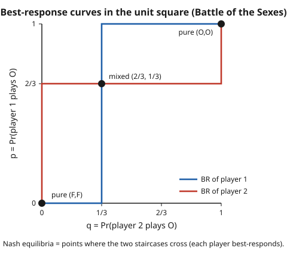

# Grad Game Theory · Lesson 2.2: Nash equilibrium and mixed strategies

> ⏱ ~15 min · Module 2: Nash equilibrium — existence and structure · Builds on: [2.1 Normal-form games, dominance, and rationalizability](02-01-normal-form-dominance-rationalizability.md) · Unlocks: [2.3 Existence of Nash equilibrium](02-03-existence-of-nash-equilibrium.md)

## Why this matters

Dominance and rationalizability (Lesson 2.1) *prune* a game — they rule out what a rational player would never do — but they usually leave a whole region of plausible play standing. Nash equilibrium is the solution concept that finally names a *point*: a profile so mutually consistent that, given what everyone else is doing, no one has a reason to move. It is the workhorse of the entire field — Cournot and Bertrand oligopoly in grad-micro, minimax play in zero-sum games, the equilibria of every signaling and auction model downstream — and its computational engine, the **indifference principle**, is a trick you will run hundreds of times. This lesson defines the object; Lesson 2.3 proves it always exists.

## The idea

Fix what everybody *except* you is doing. Your **best response** is simply the set of your own strategies that maximize your expected payoff against that fixed backdrop. A **Nash equilibrium** is a profile where this holds for *everyone at once*: each player is already best-responding to the others. Equivalently — and this is the phrase to memorize — **no player can gain by a unilateral deviation.** It's a mutual no-regret snapshot: freeze it, let any single person reconsider their own move alone, and they find nothing better to do.

Sometimes the best response is a single pure action and equilibria are pure. But often there is no pure profile that's stable — think of matching pennies, where whatever you'd settle on, your opponent wants to move, and then so do you. The fix is to let players **randomize**: a mixed strategy is a probability distribution over your pure actions. And here's the one genuinely surprising fact, the hinge of the whole lesson: **if you are willing to randomize between two actions, it can only be because you are indifferent between them.** Nobody rolls dice over options they can rank — they'd just pick the winner. So in a mixed equilibrium, every action you actually use must give you *exactly the same* expected payoff. That equal-payoff requirement is not a coincidence to observe after the fact; it is the equation you *solve* to find the equilibrium.

The twist that trips everyone up: it's not *your* payoffs that pin down *your* mixing probabilities. Your probabilities are chosen to keep your *opponent* indifferent, so that they're willing to mix in the way that keeps *you* indifferent. The two indifference conditions cross-wire the players. We'll see exactly why.

## The formal version

Setup, from Lesson 2.1: a finite game has players $i = 1,\dots,n$, each with a finite pure-action set $A_i$, and payoffs $u_i$. A **mixed strategy** for player $i$ is a probability distribution $\sigma_i$ over $A_i$; write $\sigma_i(a_i)$ for the probability it puts on action $a_i$, and $\Delta(A_i)$ for the set of all such distributions (the simplex from Lesson 1.1). A **strategy profile** is $\sigma = (\sigma_1,\dots,\sigma_n)$, and $\sigma_{-i}$ denotes everyone's strategy but $i$'s. Expected payoff extends multilinearly:

$$u_i(\sigma_i, \sigma_{-i}) = \sum_{a \in A} \Big(\prod_{j} \sigma_j(a_j)\Big)\, u_i(a).$$

*In words:* your expected payoff is the average of the payoff table, weighted by the probability each action combination occurs — and because players randomize independently, that probability is a product.

**Best response.** Player $i$'s best-response correspondence is

$$\mathrm{BR}_i(\sigma_{-i}) = \arg\max_{\sigma_i \in \Delta(A_i)} \; u_i(\sigma_i, \sigma_{-i}).$$

*In words:* against a fixed profile $\sigma_{-i}$ of the others, $\mathrm{BR}_i$ is the *set* of your own strategies that maximize your expected payoff. It is a **set**, not a point — when two actions tie, every mixture of them is equally good, so the best response is a whole line segment. (This set-valued object is exactly what Kakutani's theorem will need in 2.3.)

**Nash equilibrium.** A profile $\sigma^* = (\sigma_1^*,\dots,\sigma_n^*)$ is a **Nash equilibrium** if

$$\sigma_i^* \in \mathrm{BR}_i(\sigma_{-i}^*) \quad \text{for every player } i.$$

*In words:* everyone is simultaneously best-responding to everyone else — no one, moving alone, can do better. Equivalently, $u_i(\sigma_i^*, \sigma_{-i}^*) \ge u_i(\sigma_i, \sigma_{-i}^*)$ for all $i$ and all $\sigma_i \in \Delta(A_i)$: no profitable unilateral deviation. If every $\sigma_i^*$ puts all its weight on one action, the equilibrium is **pure**; otherwise it is **mixed**.

**The indifference principle (the computational engine).** Because $u_i(\sigma_i,\sigma_{-i})$ is *linear* in your own mix $\sigma_i$ (Lesson 1.1's linearity; the vNM expected-utility form of 1.5), maximizing over the simplex is maximizing a linear function over a polytope — the optimum is attained at the pure actions that score highest. Precisely, define the **support** of $\sigma_i$ as $\mathrm{supp}(\sigma_i) = \{a_i : \sigma_i(a_i) > 0\}$, the actions it actually uses. Then $\sigma_i \in \mathrm{BR}_i(\sigma_{-i})$ **if and only if**

$$u_i(a_i, \sigma_{-i}) = \max_{a_i' \in A_i} u_i(a_i', \sigma_{-i}) \quad \text{for every } a_i \in \mathrm{supp}(\sigma_i).$$

*In words:* every action you play with positive probability must earn you the **same** expected payoff, and that payoff must be at least as large as any action you leave out. Two consequences you'll use constantly:

- **Equal-payoff on the support.** If you mix over actions $a_i$ and $b_i$, then $u_i(a_i,\sigma_{-i}) = u_i(b_i,\sigma_{-i})$. This is the equation that determines the *other* player's mixing probabilities.
- **No profitable outside action.** Every action *outside* your support must pay $\le$ the support value — otherwise you'd shift weight onto it. You must *check* this, not assume it.

## Picture

Each axis is a mixing probability: $q$ on the horizontal is player 2's probability of playing $O$, and $p$ on the vertical is player 1's. The blue staircase is player 1's best response to each $q$ (play $O$ for sure once $q$ is high enough, play $F$ for sure when it's low, and — crucially — willing to mix *anywhere* on the vertical segment at the single value $q = 1/3$ where she's indifferent). The red staircase is player 2's best response to each $p$. A **Nash equilibrium is exactly a point on both curves at once** — a mutual best response — so the equilibria are the three crossings: two at the corners (the pure equilibria) and one in the interior at $(q,p) = (1/3, 2/3)$ (the mixed one). The mixed equilibrium lives precisely where both staircases go vertical/horizontal — the indifference values.

## Worked examples

**Example 1 (all Nash equilibria of Battle of the Sexes — two pure, one mixed).** Two people prefer to spend the evening together, but disagree on where. Player 1 favors the opera $O$, player 2 the football $F$; being apart pleases no one:

$$
\begin{array}{c|cc}
 & O & F\\\hline
O & 2,\,1 & 0,\,0\\
F & 0,\,0 & 1,\,2
\end{array}
$$

*Pure equilibria.* Check each cell for a profitable unilateral deviation. At $(O,O)$: player 1 gets $2$, deviating to $F$ gives $0$ — no gain; player 2 gets $1$, deviating to $F$ gives $0$ — no gain. So $(O,O)$ is a Nash equilibrium. Symmetrically $(F,F)$ is one (payoffs $1,2$). The off-diagonal cells $(O,F)$ and $(F,O)$ pay $0,0$ and either player gains by switching, so they are not equilibria. **Two pure equilibria.**

*Mixed equilibrium.* Let $p = \sigma_1(O)$ and $q = \sigma_2(O)$, so player 1 plays $O$ with probability $p$ and $F$ with probability $1-p$; likewise $q$ for player 2. For a *fully mixed* equilibrium, each player must be indifferent between their two actions — and, per the watch-out, **player 1's indifference determines $q$, player 2's determines $p$.**

Player 1's expected payoffs, as a function of player 2's mix $q$:
$$u_1(O, q) = 2q + 0\,(1-q) = 2q, \qquad u_1(F, q) = 0\,q + 1\,(1-q) = 1 - q.$$
Indifference $u_1(O,q) = u_1(F,q)$: $\;2q = 1 - q \Rightarrow 3q = 1 \Rightarrow \boxed{q^* = \tfrac13}.$

Player 2's expected payoffs, as a function of player 1's mix $p$:
$$u_2(O, p) = 1\,p + 0\,(1-p) = p, \qquad u_2(F, p) = 0\,p + 2\,(1-p) = 2 - 2p.$$
Indifference $p = 2 - 2p \Rightarrow 3p = 2 \Rightarrow \boxed{p^* = \tfrac23}.$

So the mixed equilibrium is $\sigma_1^* = (\tfrac23\,O, \tfrac13\,F)$, $\sigma_2^* = (\tfrac13\,O, \tfrac23\,F)$. Both actions are in each support, and there are no actions outside the support to check (only two actions each), so the support condition holds automatically. **Expected payoffs:** since player 1 is indifferent, her payoff equals $u_1(O,q^*) = 2\cdot\tfrac13 = \tfrac23$; player 2's equals $u_2(O,p^*) = p^* = \tfrac23$. Both get $\tfrac23$ — *worse* than either pure equilibrium gives to *anyone* ($1$ or $2$). Coordinating badly is the price of mixing here; the mixed equilibrium is the payoff-worst of the three.

Notice the cross-wiring made concrete: solving $q^* = \tfrac13$ came out of *player 1's* equation but is *player 2's* probability, and vice versa. Each player's randomization is tuned to keep the *opponent* willing to randomize.

**Example 2 (matching pennies — a unique, fully mixed equilibrium, and the value of a zero-sum game).** Each player shows a coin, heads $H$ or tails $T$. Player 1 (the *matcher*) wins on a match, player 2 (the *mismatcher*) wins on a mismatch. Payoffs $(u_1,u_2)$, a zero-sum game:

$$
\begin{array}{c|cc}
 & H & T\\\hline
H & 1,-1 & -1,\,1\\
T & -1,\,1 & 1,-1
\end{array}
$$

*No pure equilibrium.* In every cell the loser wants to switch (and switching flips who wins), so no pure profile survives — a chase with no fixed corner. By the existence theorem (2.3) an equilibrium must still exist, so it has to be mixed.

Let $p = \sigma_1(H)$, $q = \sigma_2(H)$. Make each player indifferent — using the *opponent's* mix.

Player 1 indifferent between $H$ and $T$ against $q$:
$$u_1(H,q) = q - (1-q) = 2q - 1, \qquad u_1(T,q) = -q + (1-q) = 1 - 2q.$$
$2q - 1 = 1 - 2q \Rightarrow 4q = 2 \Rightarrow q^* = \tfrac12.$

Player 2 indifferent between $H$ and $T$ against $p$:
$$u_2(H,p) = -p + (1-p) = 1 - 2p, \qquad u_2(T,p) = p - (1-p) = 2p - 1.$$
$1 - 2p = 2p - 1 \Rightarrow p^* = \tfrac12.$

Unique Nash equilibrium: both play $H$ and $T$ with probability $\tfrac12$. Each player's equilibrium payoff is $0$ (plug $q^*=\tfrac12$ into $u_1(H,q)$: $2\cdot\tfrac12 - 1 = 0$). This $0$ is the **value of the zero-sum game** from Lesson 1.4: the minimax value the matcher can guarantee and the mismatcher can hold them to. Mixed Nash equilibrium and the minimax solution coincide for zero-sum games — that is von Neumann's theorem wearing Nash's clothes.

## Watch out

- **You solve for your own mix from the *opponent's* indifference — not your own.** This is *the* classic error. Player 1's probabilities $p$ are chosen so that *player 2* is indifferent; they never appear in player 1's own indifference equation. If you set player 1's payoffs equal and solve for $p$, you've computed the wrong player's probability. Rule of thumb: *my indifference equation determines the other player's probabilities.* Whenever the algebra pins down $p$ from player 2's payoffs, it's working correctly.
- **A support is only a candidate equilibrium until you check the actions outside it.** The indifference conditions make the used actions tie, but you must also verify that every *unused* action pays no more than the support value. Skip this and you'll "find" mixed equilibria that a player would happily deviate away from. (With only two actions each and both in support, there's nothing to check — but in $3\times 3$ games and larger, this step is where candidates die.)
- **Nash $\subseteq$ rationalizable, but not conversely.** Every strategy played in a Nash equilibrium is rationalizable (Lesson 2.1) — it's a best response to a belief, namely the belief that the opponents play their equilibrium strategies. The converse fails: rationalizability permits mutually inconsistent beliefs, so many rationalizable profiles are not equilibria. Nash adds the demand that the beliefs be *correct*.
- **"Mixed" is an interpretation, not necessarily literal dice.** A mixed strategy can mean deliberate randomization (matching pennies, where predictability is fatal), or your *opponents' beliefs* about which action you'll take (they're uncertain, and $\sigma_i$ encodes that uncertainty), or a *population frequency* — the fraction of a large population playing each action (the reading that leads to evolutionary game theory in 6.4). All three satisfy the same equations; pick the one that fits the application.
- **Pure equilibria may not exist, but a mixed one always does (for finite games).** Don't conclude "no equilibrium" when you find no pure one — matching pennies has none pure and exactly one mixed. Finiteness plus mixing guarantees existence; that's the theorem of Lesson 2.3.

## One-liner

> A Nash equilibrium is a profile where everyone best-responds at once; you find the mixed ones by making each player *indifferent* over the actions they use — and your mix is set by your **opponent's** indifference, not your own.

## Problems

**P1 (🟢)** Stag Hunt. Two hunters each choose to hunt Stag $S$ (needs cooperation) or Hare $H$ (safe, solo):

$$
\begin{array}{c|cc}
 & S & H\\\hline
S & 3,\,3 & 0,\,2\\
H & 2,\,0 & 2,\,2
\end{array}
$$

(a) Find both pure Nash equilibria. (b) Find the mixed equilibrium: let $p = \sigma_1(S)$, $q = \sigma_2(S)$, and use indifference. (c) What is each player's expected payoff in the mixed equilibrium?

**P2 (🟡)** In the mixed equilibrium of Battle of the Sexes (Example 1), suppose you (player 1) tried to raise your own payoff by shifting to play $O$ more often — say $p = 0.9$ instead of $\tfrac23$ — while player 2 stays at $q^* = \tfrac13$. Compute your expected payoff at $p = 0.9$ and compare to $\tfrac23$. Explain the result using the indifference principle.

**P3 (🔴, optional)** Consider the $2\times 2$ game

$$
\begin{array}{c|cc}
 & L & R\\\hline
T & 3,\,1 & 0,\,2\\
B & 1,\,3 & 2,\,0
\end{array}
$$

(a) Show there is no pure Nash equilibrium. (b) Find the mixed equilibrium (probabilities and both players' expected payoffs). (c) Verify directly that neither player can profitably deviate to a pure action.

Solutions

**P1** (a) *Pure.* At $(S,S)$: each gets $3$; deviating to $H$ gives $2 < 3$ — no gain, so $(S,S)$ is an equilibrium. At $(H,H)$: each gets $2$; deviating to $S$ gives $0 < 2$ — no gain, so $(H,H)$ is an equilibrium. (The off-diagonal cells are not: e.g. at $(S,H)$ player 1 gets $0$ and would switch to $H$ for $2$.) **Two pure equilibria**, the payoff-dominant $(S,S)$ and the risk-dominant $(H,H)$.

(b) *Mixed.* Player 1 indifferent, using player 2's mix $q$:
$$u_1(S,q) = 3q + 0(1-q) = 3q, \qquad u_1(H,q) = 2q + 2(1-q) = 2.$$
$3q = 2 \Rightarrow q^* = \tfrac23.$ By the symmetry of the payoff table, player 2's indifference gives $p^* = \tfrac23$ identically. So the mixed equilibrium is each player choosing $S$ with probability $\tfrac23$.

(c) Since player 1 is indifferent, her payoff is $u_1(H,q^*) = 2$ (easiest branch), and by symmetry player 2's is also $2$. Each gets **$2$** — the same as the safe $(H,H)$ equilibrium and below the $3$ of $(S,S)$. (Check via the other branch: $3q^* = 3\cdot\tfrac23 = 2$ ✓.)

**P2** With $q^* = \tfrac13$ fixed, player 1's payoff to playing $O$ is $u_1(O,q^*) = 2\cdot\tfrac13 = \tfrac23$, and to playing $F$ is $u_1(F,q^*) = 1 - \tfrac13 = \tfrac23$ — equal, by construction of $q^*$. Any mix earns the same:
$$u_1(p, q^*) = p\cdot\tfrac23 + (1-p)\cdot\tfrac23 = \tfrac23 \quad\text{for every } p.$$
At $p = 0.9$: still $\tfrac23$. **No change.** This is the indifference principle's point: once the opponent sits at the indifference mix $q^*$, *all* of your strategies are best responses and tie at $\tfrac23$ — you cannot improve your own payoff by adjusting your own probability. (Your mix matters only for *player 2's* incentives, not your own payoff.) The only way to earn more is for the opponent to move off $q^*$ — which is why equilibrium requires *both* indifference conditions to hold together.

**P3** (a) *No pure equilibrium.* Trace the best responses — they cycle. Given $L$, player 1 prefers $T$ ($3 > 1$); given $R$, prefers $B$ ($2 > 0$). Given $T$, player 2 prefers $R$ ($2 > 1$); given $B$, prefers $L$ ($3 > 0$). Check each cell: $(T,L)$ — player 2 deviates $L\to R$; $(T,R)$ — player 1 deviates $T\to B$; $(B,R)$ — player 2 deviates $R\to L$; $(B,L)$ — player 1 deviates $B\to T$. Every cell has a live deviation, so **no pure Nash equilibrium** (the best responses chase around a cycle).

(b) *Mixed.* Let $p = \sigma_1(T)$, $q = \sigma_2(L)$. Player 1 indifferent, using $q$:
$$u_1(T,q) = 3q + 0(1-q) = 3q, \qquad u_1(B,q) = 1\cdot q + 2(1-q) = 2 - q.$$
$3q = 2 - q \Rightarrow 4q = 2 \Rightarrow q^* = \tfrac12.$ Player 2 indifferent, using $p$:
$$u_2(L,p) = 1\cdot p + 3(1-p) = 3 - 2p, \qquad u_2(R,p) = 2p + 0(1-p) = 2p.$$
$3 - 2p = 2p \Rightarrow 4p = 3 \Rightarrow p^* = \tfrac34.$ Both lie in $(0,1)$, so the unique equilibrium is $\sigma_1^* = (\tfrac34\,T, \tfrac14\,B)$, $\sigma_2^* = (\tfrac12\,L, \tfrac12\,R)$. *Payoffs:* player 1 (indifferent) gets $u_1(T,q^*) = 3\cdot\tfrac12 = \tfrac32$; player 2 gets $u_2(R,p^*) = 2\cdot\tfrac34 = \tfrac32$. Both earn $\tfrac32$.

(c) *No profitable deviation.* At $q^* = \tfrac12$: $u_1(T) = \tfrac32$ and $u_1(B) = 2 - \tfrac12 = \tfrac32$ — equal, so player 1 is indifferent and any pure action (or mix) yields $\tfrac32$; no gain. At $p^* = \tfrac34$: $u_2(L) = 3 - 2\cdot\tfrac34 = \tfrac32$ and $u_2(R) = 2\cdot\tfrac34 = \tfrac32$ — equal; no gain. Neither player can beat $\tfrac32$ by deviating, confirming the mixed profile is a Nash equilibrium.

## Flashback

**From Lesson 2.1 (Normal-form games, dominance, and rationalizability):** In the game below, use iterated elimination of strictly dominated strategies (IESDS) to solve it, then confirm the surviving profile is a Nash equilibrium.

$$
\begin{array}{c|ccc}
 & L & C & R\\\hline
U & 3,\,1 & 0,\,2 & 1,\,0\\
M & 1,\,1 & 2,\,3 & 4,\,2\\
D & 2,\,0 & 1,\,1 & 3,\,3
\end{array}
$$

Solution

Scan for a strictly dominated *action* (pure-strategy domination is enough here). Compare player 1's rows $M$ and $D$ against each column: $M$ gives $(1,2,4)$ across $L,C,R$; $D$ gives $(2,1,3)$. Neither dominates the other. Compare $U = (3,0,1)$: against $D=(2,1,3)$, $U$ beats $D$ only in column $L$ ($3>2$) and loses in $C$ and $R$ — no domination yet. Turn to player 2's columns. $L$ gives $(1,1,0)$ across rows $U,M,D$; $C$ gives $(2,3,1)$; $R$ gives $(0,2,3)$. Compare $L$ and $C$: $C$ beats $L$ in every row ($2>1$, $3>1$, $1>0$), so **$L$ is strictly dominated by $C$** — delete $L$.

Now rows are over $\{C,R\}$ only. Player 1: $U=(0,1)$, $M=(2,4)$, $D=(1,3)$. Compare $M$ vs $U$: $2>0$ and $4>1$ — **$U$ dominated by $M$**, delete $U$. Compare $M$ vs $D$: $2>1$ and $4>3$ — **$D$ dominated by $M$**, delete $D$. Only $M$ survives for player 1. With row $M=(C{:}3, R{:}2)$ fixed for player 2, player 2 prefers $C$ ($3>2$) — delete $R$. Survivor: **$(M,C)$**, payoffs $(2,3)$.

Confirm Nash: at $(M,C)$, player 1 compares column $C$: $U{:}0, M{:}2, D{:}1$ → $M$ best ✓; player 2 compares row $M$: $L{:}1, C{:}3, R{:}2$ → $C$ best ✓. Neither can profitably deviate, so $(M,C)$ is a (pure) Nash equilibrium — and since IESDS left a unique survivor, it is the *only* rationalizable profile, hence the unique Nash equilibrium. This is the containment from the watch-out made concrete: IESDS narrows to the rationalizable set, and here that set is a single point that Nash then certifies.

## Connections

- **Backward (2.1):** Nash equilibrium *refines* [rationalizability](02-01-normal-form-dominance-rationalizability.md) — every equilibrium strategy is rationalizable (a best response to the belief that others play equilibrium), but Nash additionally demands those beliefs be *correct and mutually consistent*. IESDS is a legitimate first pass: dominated actions never enter any support.
- **Backward (1.1, 1.5):** the indifference principle is pure linearity — expected payoff is linear in your own mix ([1.1](01-01-convex-sets-functions-separating-hyperplanes.md)'s convex/linear structure), and the payoff numbers being averaged are von Neumann–Morgenstern expected utilities ([1.5](01-05-expected-utility-vnm-axioms.md)), which is *why* you're allowed to take expectations at all.
- **Backward (1.4):** for zero-sum games the mixed Nash equilibrium *is* the [minimax solution](01-04-zero-sum-minimax-lp-duality.md); Example 2's value-$0$ equilibrium is von Neumann's minimax theorem as a special case of Nash.
- **Forward (2.3):** the best-response correspondence $\mathrm{BR}_i$ built here — nonempty, convex-valued (linear payoffs), closed graph (Berge) — is the exact input to [Kakutani's theorem](02-03-existence-of-nash-equilibrium.md), whose fixed point $\sigma^* \in \mathrm{BR}(\sigma^*)$ *is* a Nash equilibrium. This lesson defines the object; 2.3 proves it's never empty.
- **Forward (2.5):** [correlated equilibrium](02-05-correlated-equilibrium.md) generalizes Nash by letting a signaling device correlate players' actions — Nash is the special case where the signal is independent across players.
- **Forward (6.4):** the population-frequency reading of a mixed strategy is the doorway to evolutionary game theory, where equilibria are the rest points of replicator dynamics rather than the deductions of rational players.
- **Sideways (grad-micro):** Cournot and Bertrand oligopoly equilibria *are* Nash equilibria — the firms' quantity/price choices are mutual best responses, found by exactly the first-order-condition-as-indifference move used here. Same solution concept, continuous action sets: [grad-micro](../../grad-micro/syllabus.md). The refresher-level version of this material lives in [game-theory-refresher](../../game-theory-refresher/syllabus.md).
