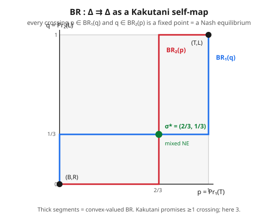

# Grad Game Theory · Lesson 2.3: Existence of Nash equilibrium

> ⏱ ~15 min · Module 2: Nash equilibrium — existence and structure · Builds on: [2.2 Nash equilibrium and mixed strategies](02-02-nash-equilibrium-mixed-strategies.md) · Unlocks: [2.4 Computing and characterizing equilibria](02-04-computing-characterizing-equilibria.md)

## Why this matters

A solution concept you can't guarantee exists is a liability: you'd never know whether "no equilibrium found" means the game is pathological or you just didn't look hard enough. Nash's theorem removes the doubt for the entire class of games a first-year sequence cares about — **every finite game has at least one Nash equilibrium** — and it does so by cashing in exactly the machinery Module 1 built. This is the payoff lesson: convex simplices (1.1), Berge's maximum theorem (1.2), and Kakutani's fixed-point theorem (1.3) were all assembled for this five-line proof. The same argument, with the best-response map swapped for an excess-demand map, is how [grad-micro](../../grad-micro/syllabus.md) proves competitive equilibrium exists — so learning it here is learning it once for all of economic theory.

## The idea

You already saw the trick in [1.3](01-03-brouwer-kakutani-fixed-points.md): "an equilibrium exists" is a disguised way of saying "some map has a point it can't move." Here the map is the obvious one. Hand every player the current strategy profile and let each reply with a best response; collect the replies into a new profile. A profile that maps to *itself* under this "everybody best-responds simultaneously" operation is one where nobody wants to move — a Nash equilibrium, by definition.

So the whole existence question reduces to: **does the best-response map have a fixed point?** Two facts make the answer yes. First, the arena is nice: the space of mixed-strategy profiles is a product of simplices — nonempty, compact, convex, no holes, no escape to infinity. Second, the map is nice in the set-valued sense Kakutani needs: at a tie a player is happy with *any* mixture of the tied strategies, so the best-response value is a convex blob, and because payoffs are continuous the blob never jumps. Feed those two facts to Kakutani and a fixed point drops out — for free, and for every finite game at once.

The one subtlety that makes it *work* is mixing. Pure best responses live at the corners of the simplex, a finite scatter of points with gaps between them — the map can leap across the diagonal through a gap and dodge every fixed point (that's why pure Nash equilibria can fail to exist). Allowing mixed strategies fills the gaps into solid convex faces, and a convex-valued map can't leap. Mixing isn't a modeling flourish; it's the convexity that lets the theorem close.

## The formal version

Fix a finite game: players $i=1,\dots,n$, finite pure-strategy set $S_i$ for each, and payoff $u_i(s)$ for each profile $s=(s_1,\dots,s_n)$. Write $\Delta(S_i)$ for player $i$'s mixed strategies (probability distributions over $S_i$) and $\Delta=\prod_i\Delta(S_i)$ for the set of profiles. Extend payoffs to mixtures by expectation, $U_i(\sigma)=\mathbb{E}_{s\sim\sigma}[u_i(s)]$, and write $\sigma_{-i}$ for everyone's mix but $i$'s.

**Nash's existence theorem (1950).** Every finite normal-form game has at least one Nash equilibrium in mixed strategies: a profile $\sigma^*\in\Delta$ such that for every player $i$,
$$U_i(\sigma_i^*,\sigma_{-i}^*)\ \ge\ U_i(\sigma_i,\sigma_{-i}^*)\quad\text{for all }\sigma_i\in\Delta(S_i).$$

*In words:* there is always a profile at which no player can raise their own expected payoff by unilaterally changing their (possibly randomized) strategy.

**The Kakutani proof (the 1.3 template, instantiated).** Define the **best-response correspondence** $\mathrm{BR}:\Delta\rightrightarrows\Delta$ by
$$\mathrm{BR}(\sigma)=\prod_i \mathrm{BR}_i(\sigma_{-i}),\qquad \mathrm{BR}_i(\sigma_{-i})=\arg\max_{\sigma_i\in\Delta(S_i)} U_i(\sigma_i,\sigma_{-i}).$$
A fixed point $\sigma^*\in\mathrm{BR}(\sigma^*)$ means $\sigma_i^*\in\mathrm{BR}_i(\sigma_{-i}^*)$ for every $i$ — exactly the equilibrium condition. Now check Kakutani's hypotheses one by one; each is a Module 1 result cashed in.

- **Domain is nonempty, compact, convex.** Each $\Delta(S_i)$ is a simplex — nonempty, compact, convex ([1.1](01-01-convex-sets-functions-separating-hyperplanes.md)). A finite product of such sets is again nonempty, compact, and convex. *In words:* the arena has no holes, no missing edges, and no way to run off to infinity.
- **$\mathrm{BR}_i$ is nonempty-valued.** $U_i(\cdot,\sigma_{-i})$ is continuous (it's linear in $\sigma_i$) and $\Delta(S_i)$ is compact, so by Weierstrass the maximum is attained: $\mathrm{BR}_i(\sigma_{-i})\ne\varnothing$. *In words:* a best response always exists because you're maximizing a continuous function over a closed, bounded set.
- **$\mathrm{BR}_i$ is convex-valued.** $U_i(\sigma_i,\sigma_{-i})=\sum_{s_i}\sigma_i(s_i)\,U_i(s_i,\sigma_{-i})$ is **linear** in $\sigma_i$. The maximizers of a linear function over a convex set form a face — a convex set (Ex 2 proves this). *In words:* if two mixes are both optimal, so is every average of them, so the best-response set is a solid blob, never a scatter.
- **$\mathrm{BR}_i$ has closed graph.** $\mathrm{BR}_i$ is the argmax of a jointly continuous payoff over the fixed compact set $\Delta(S_i)$, so by **Berge's maximum theorem** ([1.2](01-02-correspondences-berge-maximum-theorem.md)) it is upper hemicontinuous with closed values — i.e. has a closed graph. A product of closed-graph correspondences has a closed graph. *In words:* the best-response blob never jumps discontinuously as the opponents' mix drifts.

All of Kakutani's hypotheses hold, so there exists $\sigma^*\in\mathrm{BR}(\sigma^*)$: a Nash equilibrium. $\blacksquare$

**The Brouwer route (Nash's original 1951 proof).** Instead of a set-valued map, build a continuous *function* $g:\Delta\to\Delta$ — the **Nash map** — that nudges each player's mix toward pure strategies currently beating their average:
$$g_i(\sigma)(s_i)=\frac{\sigma_i(s_i)+\big[U_i(s_i,\sigma_{-i})-U_i(\sigma)\big]_+}{1+\sum_{s_i'}\big[U_i(s_i',\sigma_{-i})-U_i(\sigma)\big]_+},\qquad [x]_+=\max(x,0).$$
This $g$ is continuous and maps $\Delta$ into itself, so Brouwer hands it a fixed point; a short check shows the fixed points of $g$ are **exactly** the Nash equilibria (at a fixed point no strategy can beat the average, i.e. no profitable deviation). Same conclusion, single-valued route — Kakutani is just the streamlined repackaging.

**Beyond finite games (Glicksberg / Debreu, mentioned).** Finiteness is a *sufficient* convenience, not a necessity. If each $S_i$ is a compact convex subset of a Euclidean space and each $u_i$ is continuous and quasiconcave in $\sigma_i$, a pure-strategy equilibrium still exists (Debreu–Fan–Glicksberg) — the exact same three Kakutani checks go through. What you cannot drop is compactness, continuity, and the convexity that quasiconcavity supplies.

## Picture

## Worked examples

**Example 1 (the machine on a $2\times2$ game — this is Boss Problem 1).** Battle of the Sexes: players want to coordinate but disagree on where. Player 1 chooses a row (T/B) with $\Pr(\text{T})=p$; player 2 chooses a column (L/R) with $\Pr(\text{L})=q$.

$$
\begin{array}{c|cc}
 & L & R\\\hline
T & 2,1 & 0,0\\
B & 0,0 & 1,2
\end{array}
$$

Domain $\Delta=[0,1]^2$ (product of two simplices — nonempty, compact, convex ✓). Player 1's expected payoff to T is $2q$, to B is $1-q$, so she prefers T iff $2q>1-q\iff q>\tfrac13$:
$$
\mathrm{BR}_1(q)=\begin{cases}\{1\}& q>\tfrac13\\ [0,1]& q=\tfrac13\\ \{0\}& q<\tfrac13,\end{cases}
\qquad
\mathrm{BR}_2(p)=\begin{cases}\{1\}& p>\tfrac23\\ [0,1]& p=\tfrac23\\ \{0\}& p<\tfrac23.\end{cases}
$$
(Player 2's payoff to L is $p$, to R is $2(1-p)$; she prefers L iff $p>\tfrac23$.)

*Verify the three Kakutani hypotheses on $\varphi(p,q)=\mathrm{BR}_1(q)\times\mathrm{BR}_2(p)$:*
- **Nonempty:** every branch is $\{0\}$, $\{1\}$, or $[0,1]$ — never empty (Weierstrass: a continuous payoff on $[0,1]$ attains its max).
- **Convex-valued:** each value is a point or a full interval, both convex — and the interval appears *exactly* at the indifference threshold because the payoff is linear in one's own probability.
- **Closed graph:** at $q=\tfrac13$ the value swells to the segment $[0,1]$, which *bridges* the branches $\{0\}$ and $\{1\}$ with no gap; that filled segment is the upper hemicontinuity Berge guarantees. Same at $p=\tfrac23$.

*Exhibit the fixed points* ($p\in\mathrm{BR}_1(q)$ and $q\in\mathrm{BR}_2(p)$ at once): the two pure corners $(1,1)=(\text{T,L})$ and $(0,0)=(\text{B,R})$, and the interior point where both are indifferent, $q=\tfrac13$ and $p=\tfrac23$, giving the mixed equilibrium $\sigma^*=(p,q)=(\tfrac23,\tfrac13)$. Kakutani only promised *one*; the game has three (the crossings in the figure). Existence, never uniqueness.

**Example 2 (no equilibrium — which hypothesis broke, and why $\mathrm{BR}$ is a convex face).** *First, a game with no Nash equilibrium at all.* Two players each name a positive integer, $s_i\in\{1,2,3,\dots\}$; whoever names the larger wins ($+1$), the smaller loses ($-1$), ties pay $0$. There is no best response to anything — whatever your opponent might play, "one more" does strictly better — so no profile can be an equilibrium, pure *or* mixed. **Which hypothesis failed?** The strategy set $\{1,2,3,\dots\}$ is not compact (unbounded), so $\mathrm{BR}_i$ is *empty-valued*: Weierstrass has no compact set to attain a max on, and Kakutani never gets off the ground. The equilibrium escaped to infinity, precisely the compactness failure from [1.3](01-03-brouwer-kakutani-fixed-points.md).

*Second, why convexity of $\mathrm{BR}_i$ is automatic.* Fix opponents at $\sigma_{-i}$ and let $M=\max_{\sigma_i}U_i(\sigma_i,\sigma_{-i})$. Since $U_i(\cdot,\sigma_{-i})$ is linear in $\sigma_i$, if two mixes $\sigma_i,\sigma_i'$ both attain $M$ then for any $\lambda\in[0,1]$,
$$U_i\big(\lambda\sigma_i+(1-\lambda)\sigma_i',\ \sigma_{-i}\big)=\lambda U_i(\sigma_i,\sigma_{-i})+(1-\lambda)U_i(\sigma_i',\sigma_{-i})=\lambda M+(1-\lambda)M=M,$$
so the average is optimal too. Hence $\mathrm{BR}_i(\sigma_{-i})$ is convex — in fact it is the set of all mixtures supported on $i$'s pure best responses, a *face* of the simplex. This is the linearity that Kakutani's convex-valued hypothesis rides on, and it is why finite games always mix their way to existence.

## Watch out

- **Existence needs finiteness (or a compact–continuous–quasiconcave substitute).** "Every game has a Nash equilibrium" is false — the name-the-larger-integer game is the standing counterexample. Finiteness is the clean sufficient condition; Glicksberg/Debreu relax it to compact strategy sets with continuous, quasiconcave payoffs, but you cannot drop those.
- **Continuity of payoffs is not optional.** [Bertrand price competition](../../grad-micro/syllabus.md) with tie-splitting has a *discontinuous* payoff (undercut by a cent and you jump from half the market to all of it), which can break upper hemicontinuity of $\mathrm{BR}$ and, in variants, destroy pure-strategy existence — the same failure the name-the-integer game shows, wearing an economics costume. When a game "has no equilibrium," a discontinuous or non-compact payoff is almost always the culprit.
- **The proof is nonconstructive.** Kakutani (and Brouwer) swear a fixed point is *somewhere* in $\Delta$; neither hands you an algorithm to find it, nor a count of how many there are (Example 1 had three). Actually locating equilibria is a separate, harder problem — that's [2.4](02-04-computing-characterizing-equilibria.md).
- **Convex-valuedness relies on mixing.** Pure best responses form a finite, generally non-convex set of vertices; a map into that scatter can dodge the diagonal, which is *why pure Nash equilibria can fail to exist*. Passing to mixed strategies convexifies both the domain (into simplices) and the values (into faces). Mixing is the price of admission to the fixed-point theorems.

## One-liner

> Every finite game has a Nash equilibrium because the "everyone best-responds at once" map is a Kakutani self-map on a product of simplices — nonempty, compact, convex domain; nonempty, convex, closed-graph values — and mixing is exactly the convexity that forces the crossing.

## Problems

**P1 (🟢)** Consider the matching-pennies-style game where player 1 wants to match and player 2 to mismatch:
$$
\begin{array}{c|cc}
 & H & T\\\hline
H & 1,-1 & -1,1\\
T & -1,1 & 1,-1
\end{array}
$$
With $p=\Pr_1(\text{H})$, $q=\Pr_2(\text{H})$, write $\mathrm{BR}_1(q)$ and $\mathrm{BR}_2(p)$, confirm each is convex-valued, and find the unique fixed point of $\varphi(p,q)=\mathrm{BR}_1(q)\times\mathrm{BR}_2(p)$. Why must it be interior?

**P2 (🟡)** For each game, say whether Nash's theorem *guarantees* an equilibrium; if a hypothesis fails, name which one, and say whether an equilibrium happens to exist anyway.
(a) Two firms simultaneously choose prices $p_i\in[0,10]$; demand goes entirely to the cheaper firm, split evenly on a tie (Bertrand with a price cap).
(b) A single player chooses $x\in[0,1)$ to maximize $u(x)=x$.
(c) Rock–paper–scissors (finite, $3\times3$, zero-sum).

**P3 (🔴, optional)** Prove that for a finite game, $\mathrm{BR}_i(\sigma_{-i})$ is not merely convex but equals the set of all mixtures over $i$'s *pure* best responses:
$$\mathrm{BR}_i(\sigma_{-i})=\Big\{\sigma_i\in\Delta(S_i):\ \operatorname{supp}(\sigma_i)\subseteq B_i(\sigma_{-i})\Big\},\quad B_i(\sigma_{-i})=\arg\max_{s_i\in S_i}U_i(s_i,\sigma_{-i}).$$
Deduce that $\mathrm{BR}_i(\sigma_{-i})$ is a nonempty convex face of the simplex. (This is the "indifference condition" of [2.2](02-02-nash-equilibrium-mixed-strategies.md), proved from scratch.)

Solutions

**P1** Player 1 (wants a match): playing H pays $q\cdot 1+(1-q)(-1)=2q-1$; playing T pays $q(-1)+(1-q)(1)=1-2q$. Prefer H iff $2q-1>1-2q\iff q>\tfrac12$:
$$\mathrm{BR}_1(q)=\begin{cases}\{1\}&q>\tfrac12\\ [0,1]&q=\tfrac12\\ \{0\}&q<\tfrac12.\end{cases}$$
Player 2 (wants a mismatch): playing H pays $p(-1)+(1-p)(1)=1-2p$; playing T pays $2p-1$. Prefer H (i.e. $q=1$) iff $1-2p>2p-1\iff p<\tfrac12$:
$$\mathrm{BR}_2(p)=\begin{cases}\{1\}&p<\tfrac12\\ [0,1]&p=\tfrac12\\ \{0\}&p>\tfrac12.\end{cases}$$
Each value is a single point or the full interval $[0,1]$ — both convex (the payoff is linear in one's own probability, so maximizer sets are faces). **Fixed point:** if $q>\tfrac12$ then $p=1$, which forces $q=0<\tfrac12$ — contradiction; every corner attempt loops (player 1 chases, player 2 flees). The only consistent point is $p=q=\tfrac12$: then $q=\tfrac12\Rightarrow p\in[0,1]\ni\tfrac12$ ✓ and $p=\tfrac12\Rightarrow q\in[0,1]\ni\tfrac12$ ✓. Unique NE $(\tfrac12,\tfrac12)$. It **must be interior** because the pursuit structure rules out every corner; the players can only mutually best-respond where both are *indifferent*, and indifference is exactly where $\mathrm{BR}$ goes thick (convex-valued). Without that convex value the graph would leap across the diagonal and no equilibrium would exist.

**P2**
(a) Strategy sets $[0,10]$ are compact and convex, but the payoff is **discontinuous** (undercutting flips you from half the market to all of it, and the tie-split is a jump). Nash's finite theorem doesn't apply, and the Glicksberg extension fails on continuity. An equilibrium happens to exist anyway here — both firms pricing at marginal cost is the classic Bertrand equilibrium — but the theorem did not *guarantee* it; you must check by hand. (Small perturbations of this game can lose existence, which is the point.)
(b) $K=[0,1)$ is convex but **not compact** (not closed — the endpoint $1$ is missing). The max of $u(x)=x$ is not attained ($\mathrm{BR}=\varnothing$), so no equilibrium and no guarantee — the same compactness failure as the name-the-integer game.
(c) Finite ($3\times3$), so Nash's theorem **guarantees** an equilibrium. It is the fully mixed profile $(\tfrac13,\tfrac13,\tfrac13)$ for each player (each pure strategy earns $0$ against it, so all are best responses — indifference across the whole support).

**P3** Fix $\sigma_{-i}$ and abbreviate $v(s_i)=U_i(s_i,\sigma_{-i})$, the expected payoff of pure strategy $s_i$. By linearity of expectation,
$$U_i(\sigma_i,\sigma_{-i})=\sum_{s_i\in S_i}\sigma_i(s_i)\,v(s_i).$$
Let $M=\max_{s_i}v(s_i)$ and $B_i=\{s_i:v(s_i)=M\}$ (nonempty since $S_i$ is finite). For any $\sigma_i\in\Delta(S_i)$,
$$U_i(\sigma_i,\sigma_{-i})=\sum_{s_i}\sigma_i(s_i)v(s_i)\ \le\ \sum_{s_i}\sigma_i(s_i)M=M,$$
a weighted average of the $v(s_i)$'s can't exceed their maximum. Equality holds iff all the weight sits on strategies achieving $M$, i.e. $\operatorname{supp}(\sigma_i)\subseteq B_i$. Hence
$$\mathrm{BR}_i(\sigma_{-i})=\{\sigma_i:U_i(\sigma_i,\sigma_{-i})=M\}=\{\sigma_i:\operatorname{supp}(\sigma_i)\subseteq B_i\},$$
which is the set of distributions supported on $B_i$ — the face $\Delta(B_i)$ of the simplex $\Delta(S_i)$. It is nonempty (put all weight on any single element of $B_i$) and convex (a convex combination of two distributions supported on $B_i$ is again supported on $B_i$). This is precisely the indifference principle: in equilibrium a player randomizes only over strategies that are all tied for best. $\blacksquare$

## Flashback

**From Lesson 1.3 (Brouwer and Kakutani fixed-point theorems):** Let $K=[0,1]$ and define the correspondence $\varphi:K\rightrightarrows K$ by $\varphi(x)=\{1\}$ for $x<\tfrac12$ and $\varphi(x)=\{0\}$ for $x\ge\tfrac12$. Does Kakutani guarantee a fixed point? Check each hypothesis, then determine whether a fixed point actually exists — and connect the verdict to why Nash's proof insists on continuous payoffs.

Solution

**Domain:** $[0,1]$ is nonempty, compact, convex ✓. **Nonempty-valued:** every value is a singleton ✓. **Convex-valued:** each value is a single point, which is convex ✓. **Closed graph:** *fails.* Take $x_n\to\tfrac12$ from below with $y_n=1\in\varphi(x_n)$; then $y_n\to1$, but $\varphi(\tfrac12)=\{0\}$, so the limit point $(\tfrac12,1)$ is not in the graph. The graph is not closed, so Kakutani does **not** apply.

**Is there a fixed point?** No. For $x<\tfrac12$, $\varphi(x)=\{1\}$ needs $x=1$ — impossible; for $x\ge\tfrac12$, $\varphi(x)=\{0\}$ needs $x=0$ — impossible. The "flip" leaps clean over the diagonal.

**Connection:** this is exactly the failure mode Nash's proof rules out. A best-response correspondence gets its closed graph *for free* from Berge's maximum theorem — but only because payoffs are continuous. A discontinuous payoff (Bertrand ties, a game with a jump like this one) could produce precisely such a flipping $\mathrm{BR}$, and then equilibrium can genuinely vanish. Continuity is not bookkeeping; it is the hypothesis that keeps the graph from jumping across the diagonal.

## Connections

- **Backward (all of Module 1):** this proof is Module 1's ledger being cashed. Compact convex simplices are [1.1](01-01-convex-sets-functions-separating-hyperplanes.md); the closed graph of $\mathrm{BR}$ is the *output* of Berge's maximum theorem in [1.2](01-02-correspondences-berge-maximum-theorem.md); the fixed point itself is [1.3](01-03-brouwer-kakutani-fixed-points.md)'s Kakutani template run verbatim. The payoff numbers being maximized are justified by the expected-utility axioms of Lesson 1.5.
- **Backward (2.2):** the equilibrium condition $\sigma_i^*\in\mathrm{BR}_i(\sigma_{-i}^*)$ and the indifference principle (P3) are [2.2](02-02-nash-equilibrium-mixed-strategies.md)'s definitions — this lesson proves such a $\sigma^*$ always exists.
- **Forward (2.4):** existence is nonconstructive; [2.4](02-04-computing-characterizing-equilibria.md) turns "an equilibrium is somewhere in $\Delta$" into support enumeration and the Lemke–Howson algorithm that actually finds it.
- **Sideways (grad-micro):** existence of Walrasian (competitive) equilibrium runs the *identical* machine — swap the best-response map for the excess-demand / price-adjustment map on the price simplex and apply Brouwer/Kakutani; Cournot oligopoly existence is this literal theorem, and the discontinuous-payoff caveat is the Bertrand pathology: [grad-micro](../../grad-micro/syllabus.md).
- **Sideways (topology):** Brouwer is a topological statement (no continuous retraction of a ball onto its boundary) and Kakutani its set-valued upgrade; the deeper proofs and the degree theory behind them live in [topology](../../topology/syllabus.md).
