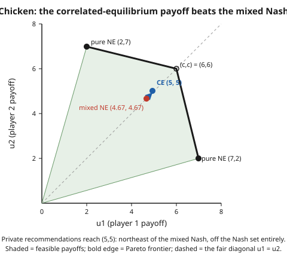

# Grad Game Theory · Lesson 2.5: Correlated equilibrium

> ⏱ ~15 min · Module 2: Nash equilibrium — existence and structure · Builds on: [2.4 Computing and characterizing equilibria](02-04-computing-characterizing-equilibria.md) · Unlocks: [3.1 Extensive-form games and behavior strategies](03-01-extensive-form-behavior-strategies.md)

## Why this matters

A traffic light does something remarkable: it lets two streams of cars share an intersection with no crashes and no negotiation, purely because everyone trusts a shared signal and follows its private instruction. Nash equilibrium can't describe this — it insists each player randomizes *independently*, so it never captures "we coordinate through a common device." Aumann's **correlated equilibrium** (CE) fixes that, and it pays off three times: it is strictly more permissive than Nash (it can beat every player's Nash payoff at once), it is the natural resting point of simple learning dynamics (no central planner required), and — unlike Nash — it is defined by *linear* constraints, so computing one is just a linear program. This is the moment game theory stops being a nonlinear fixed-point hunt and becomes, in part, easy.

## The idea

Picture a trusted referee holding a jar of slips. Each slip names a full action profile — one action per player — and the slips are mixed in known proportions $p$. The referee draws one slip and privately whispers to each player *only their own* coordinate: "you, play $s_i$." You never see anyone else's instruction.

Now ask: should you obey? You know the recipe $p$, so from your own whispered $s_i$ you can compute the *posterior* over what everyone else was told. Obeying is smart exactly when, given that posterior, $s_i$ is a best response. If that holds for every player and every possible whisper, no one ever wants to deviate, the recipe runs itself on trust alone, and $p$ is a correlated equilibrium.

Two things make this bigger than Nash. First, the slips can **correlate** actions — "both go left" and "both go right" can each be likely while "one left, one right" is impossible — something independent randomization can never produce. Second, the whisper is **informative**: hearing your instruction shifts your belief about others, and it's that shared-but-private information that unlocks outcomes Nash can't reach. Nash is the flat special case where the slips are made by each player independently, so the whisper tells you nothing new about anyone else.

## The formal version

Fix a finite game: players $i = 1, \dots, n$, finite action set $S_i$ for each, profiles $S = S_1 \times \cdots \times S_n$, and payoffs $u_i : S \to \mathbb{R}$. Write $s = (s_i, s_{-i})$, splitting player $i$'s action from the others' $s_{-i} \in S_{-i}$.

**Definition.** A **correlated equilibrium** is a probability distribution $p$ over the profile set $S$ such that for every player $i$, every recommended action $s_i$ with positive marginal probability, and every alternative $s_i' \in S_i$,

$$\sum_{s_{-i} \in S_{-i}} p(s_i, s_{-i}) \,\big[\, u_i(s_i, s_{-i}) - u_i(s_i', s_{-i}) \,\big] \;\ge\; 0.$$

In words: whenever the device tells you to play $s_i$, actually playing $s_i$ earns at least as much, in expectation over what the others were secretly told, as switching to any $s_i'$. The sum is over the *joint* weights $p(s_i, s_{-i})$ rather than the conditional probabilities $p(s_{-i} \mid s_i)$ — the two differ only by the constant factor $p(s_i)$, and dropping it keeps the inequality **linear in $p$**, which is the whole computational point.

**Two structural facts follow immediately.**

*Nash $\subseteq$ CE.* Given any (mixed) Nash equilibrium $\sigma = (\sigma_1, \dots, \sigma_n)$, the product distribution $p(s) = \prod_i \sigma_i(s_i)$ is a correlated equilibrium. In words: independent randomization is the special case where the device draws each player's slip separately, so it satisfies the CE constraints automatically (proof in Example 2).

*CE is a polytope.* The constraints above are finitely many linear inequalities in the unknowns $p(s)$, together with $p(s) \ge 0$ and $\sum_s p(s) = 1$. In words: the set of correlated equilibria is the intersection of half-spaces with the probability simplex — a **convex polytope**. Maximizing any linear objective (say, expected total welfare) over it is a **linear program**, solvable in polynomial time. Contrast Nash, a nonlinear complementarity problem that is PPAD-hard in general: CE is the computationally friendly cousin.

## Picture

The shaded region is every payoff pair the game can produce; the bold edge is the Pareto frontier. The three Nash payoffs — two lopsided pure ones and the symmetric mixed one — all sit *inside*. The correlated equilibrium reaches $(5,5)$: strictly northeast of the mixed Nash and not a Nash payoff at all.

## Worked examples

Throughout, use the game of **Chicken**. Two drivers speed toward each other; each chooses $c$ (chicken out — swerve) or $d$ (dare — go straight). Payoffs $(u_1, u_2)$:

$$
\begin{array}{c|cc}
 & c & d \\\hline
c & 6,\,6 & 2,\,7 \\
d & 7,\,2 & 0,\,0
\end{array}
$$

If your rival swerves you'd rather dare ($7 > 6$); if your rival dares you'd rather swerve ($2 > 0$). Two pure Nash equilibria, $(d,c)$ and $(c,d)$, plus a symmetric mixed one.

**Example 1 (the traffic-light CE — verify it, then beat Nash).**

First pin down the symmetric mixed Nash. Let each player swerve with probability $\pi$. The rival is indifferent when

$$\underbrace{6\pi + 2(1-\pi)}_{\text{payoff to } c} = \underbrace{7\pi + 0(1-\pi)}_{\text{payoff to } d} \;\Longrightarrow\; 2 + 4\pi = 7\pi \;\Longrightarrow\; \pi = \tfrac{2}{3}.$$

Each player's expected payoff is $7\pi = \tfrac{14}{3} \approx 4.67$. Note the waste: with probability $\pi_d^2 = \tfrac{1}{9}$ both dare and crash to $(0,0)$.

Now install a device with distribution

$$p(c,c) = p(c,d) = p(d,c) = \tfrac{1}{3}, \qquad p(d,d) = 0.$$

It never recommends the crash. Check player 1's two incentive constraints (player 2's are identical by symmetry).

*Told $c$* (happens with probability $p(c,c) + p(c,d) = \tfrac{2}{3}$). Posterior on player 2: $\Pr(c \mid c) = \tfrac{1/3}{2/3} = \tfrac12$, $\Pr(d \mid c) = \tfrac12$. Obey vs. deviate:

$$\text{obey } c:\ \tfrac12(6) + \tfrac12(2) = 4, \qquad \text{deviate to } d:\ \tfrac12(7) + \tfrac12(0) = 3.5. \quad 4 \ge 3.5\ ✓$$

*Told $d$* (probability $p(d,c) = \tfrac13$). Then player 2 was certainly told $c$: $\Pr(c \mid d) = 1$. Obey vs. deviate:

$$\text{obey } d:\ 1(7) = 7, \qquad \text{deviate to } c:\ 1(6) = 6. \quad 7 \ge 6\ ✓$$

Both hold, so $p$ is a correlated equilibrium. Its expected payoff to each player:

$$\tfrac13(6) + \tfrac13(2) + \tfrac13(7) = \tfrac{15}{3} = 5.$$

So $5 > \tfrac{14}{3}$: **both players strictly prefer the correlated equilibrium to the symmetric mixed Nash.** The device Pareto-dominates that Nash equilibrium — a fair, crash-free $(5,5)$ that independent randomization simply cannot buy. (It does not dominate the *pure* Nash equilibria, which hand one player $7$; but those are lopsided, and no symmetric outcome could.) This is the second half of Boss Problem 2.

**Example 2 (why every Nash equilibrium is already a CE).**

Take any mixed Nash equilibrium $\sigma = (\sigma_1, \dots, \sigma_n)$ and build the product distribution $p(s) = \prod_j \sigma_j(s_j)$. Fix a player $i$ and a recommendation $s_i$ with $\sigma_i(s_i) > 0$. Because the slips are drawn independently, the posterior over others factors and is *independent of $s_i$*:

$$p(s_{-i} \mid s_i) = \frac{\prod_j \sigma_j(s_j)}{\sigma_i(s_i)} = \prod_{j \ne i} \sigma_j(s_j) = \sigma_{-i}(s_{-i}).$$

In words: your own instruction tells you nothing about anyone else. So "best response given the posterior" just means "best response to $\sigma_{-i}$" — and since $\sigma$ is a Nash equilibrium, every $s_i$ in $\sigma_i$'s support already is a best response to $\sigma_{-i}$. The CE inequality holds for all $s_i'$. Hence $p$ is a correlated equilibrium, proving $\text{Nash} \subseteq \text{CE}$.

This also names *why* CE is strictly larger: it drops the independence factorization. Allow $p$ to correlate — to make your whisper informative about others — and you gain exactly the outcomes (like Chicken's $(5,5)$) that no product distribution can reach.

## Watch out

- **Recommendations are private, and that privacy does the work.** You see only your own slip and reason about the *conditional* distribution of everyone else's. A **public** signal both players observe collapses the power: after a public draw each player faces a standard game and must play a Nash equilibrium of it, so public randomization buys only *convex combinations of Nash payoffs* — never Chicken's $(5,5)$ (Problem 3). Public correlation $\subsetneq$ private correlation.
- **CE always contains Nash, never the reverse.** $\text{Nash} \subseteq \text{CE}$ is a theorem (Example 2); the inclusion is usually strict. If someone "finds a CE" that isn't a Nash equilibrium, nothing is broken — that's the entire point.
- **The constraints are linear, so don't reach for a fixed-point theorem.** Nash needs Kakutani because best response is a nonlinear map; CE needs only linear programming. Optimizing over correlated equilibria (best CE, worst CE, most egalitarian CE) is a solvable LP, not a search for a fixed point.
- **The device needs trust, not enforcement.** No one is forced to obey. The incentive constraints guarantee obedience is self-interested given the posterior — the referee only has to be believed, not obeyed at gunpoint.

## One-liner

> A correlated equilibrium is a joint recommendation you'd always follow knowing only your own tip; Nash is the flat special case where the tips are independent, and — unlike Nash — the whole set is carved out by linear inequalities.

## Problems

**P1 (🟢)** Show that the **uniform** device on Chicken — $p(c,c) = p(c,d) = p(d,c) = p(d,d) = \tfrac14$ — is *not* a correlated equilibrium. (Check both of a player's incentive constraints; find the one that fails.)

**P2 (🟡)** Consider the symmetric family of Chicken devices $p(c,c) = a$, $p(c,d) = p(d,c) = b$, $p(d,d) = 0$, with $a + 2b = 1$. (a) Show the only binding incentive constraint is $a \le 2b$. (b) Write total expected welfare $u_1 + u_2$ as a function of $a$, and solve the resulting linear program to find the welfare-maximizing correlated equilibrium in this family. (c) Report each player's payoff and compare to Example 1's $(5,5)$.

**P3 (🔴, optional)** A **public** correlating device draws a signal both players observe. Argue that the set of payoffs it can implement is exactly the convex hull of the Nash-equilibrium payoffs. Using Chicken's Nash payoffs $(7,2)$, $(2,7)$, $(\tfrac{14}{3}, \tfrac{14}{3})$, conclude that no public device achieves a symmetric payoff above $\tfrac{14}{3}$ — so the private $(5,5)$ of Example 1 is genuinely out of reach, and the privacy of the whisper is essential.

Solutions

**P1** *Told $c$* (probability $\tfrac12$): posterior $\Pr(c\mid c) = \Pr(d\mid c) = \tfrac12$. Obey $c$: $\tfrac12(6)+\tfrac12(2) = 4$; deviate to $d$: $\tfrac12(7)+\tfrac12(0) = 3.5$. Holds ($4 \ge 3.5$).

*Told $d$* (probability $\tfrac12$): posterior $\Pr(c\mid d) = \Pr(d\mid d) = \tfrac12$. Obey $d$: $\tfrac12(7)+\tfrac12(0) = 3.5$; deviate to $c$: $\tfrac12(6)+\tfrac12(2) = 4$. Here $3.5 < 4$: **the constraint fails.** When told to dare, you now think it's a coin flip whether your rival also dares, and the crash risk makes swerving strictly better. So the uniform device is not a CE — putting weight on the $(d,d)$ crash is what breaks it.

**P2** (a) By symmetry check player 1.

*Told $c$* (probability $a+b$): posterior $\Pr(c\mid c) = \tfrac{a}{a+b}$, $\Pr(d\mid c) = \tfrac{b}{a+b}$. Using the linear (unnormalized) form, obedience requires

$$a\,u_1(c,c) + b\,u_1(c,d) \ge a\,u_1(d,c) + b\,u_1(d,d) \;\Longrightarrow\; 6a + 2b \ge 7a + 0 \;\Longrightarrow\; a \le 2b.$$

*Told $d$* (probability $b$): player 2 was certainly told $c$, so obey $d$ gives $7$, deviate to $c$ gives $6$; $7 \ge 6$ holds for all $a,b \ge 0$. So the single binding constraint is $a \le 2b$. With $a + 2b = 1$ this reads $a \le 1 - a$, i.e. $a \le \tfrac12$.

(b) Welfare per profile: $(c,c)\!: 12$, $(c,d)\!: 9$, $(d,c)\!: 9$, $(d,d)\!: 0$. So

$$W(a) = 12a + 9b + 9b = 12a + 9(2b) = 12a + 9(1-a) = 9 + 3a.$$

$W$ increases in $a$, so the LP "maximize $9+3a$ subject to $a \le \tfrac12$, $a \ge 0$" is solved at $a^* = \tfrac12$, giving $b = \tfrac14$. The welfare-maximizing device is $p(c,c) = \tfrac12$, $p(c,d) = p(d,c) = \tfrac14$, $p(d,d) = 0$, with $W = 10.5$.

(c) Each player's payoff: $\tfrac12(6) + \tfrac14(2) + \tfrac14(7) = 3 + 0.5 + 1.75 = 5.25$. So $(5.25, 5.25) > (5,5)$: pushing weight onto the cooperative $(c,c)$ corner as far as the incentive constraint $a \le \tfrac12$ allows beats Example 1's device. This is the LP at work — the optimum sits at a vertex of the CE polytope where the constraint $a \le 2b$ binds.

**P3** With a public signal taking values $\omega$ with probabilities $\lambda_\omega$, both players condition on the *same* $\omega$. After observing $\omega$ each faces the original game with common information, so any obeyed continuation must be a Nash equilibrium $\sigma^\omega$ of Chicken — otherwise some player deviates. The realized payoff is then $\sum_\omega \lambda_\omega \, U(\sigma^\omega)$, a convex combination of Nash payoffs; conversely any such combination is implementable by drawing $\omega$ with those weights. Hence the achievable set is exactly $\text{conv}\{(7,2), (2,7), (\tfrac{14}{3},\tfrac{14}{3})\}$.

The symmetric payoffs $(t,t)$ in this triangle: the vertex $(\tfrac{14}{3},\tfrac{14}{3})$ gives $t = \tfrac{14}{3}$, and mixing the two pure Nash equally gives only $(4.5, 4.5)$. Every point of the triangle is a convex combination of vertices with $u_1$-coordinates at most $7$ and symmetric mass, and the largest symmetric value is attained at the mixed-Nash vertex, $t = \tfrac{14}{3} \approx 4.67$. Since $5 > \tfrac{14}{3}$, no public device reaches $(5,5)$. The private correlation of Example 1 — where "told $d$" reveals the rival was "told $c$" — carries information a public signal cannot, and that is precisely what buys the extra payoff.

## Flashback

**From Lesson 2.2 (Nash equilibrium and mixed strategies):** In this Battle-of-the-Sexes variant, find the mixed-strategy Nash equilibrium and each player's expected payoff.

$$
\begin{array}{c|cc}
 & L & R \\\hline
T & 3,\,1 & 0,\,0 \\
B & 0,\,0 & 1,\,3
\end{array}
$$

Solution

Let player 1 play $T$ with probability $p$ and player 2 play $L$ with probability $q$. Each must be made indifferent by the other's mix.

Player 2 indifferent between $L$ and $R$: $u_2(L) = p(1) + (1-p)(0) = p$ and $u_2(R) = p(0) + (1-p)(3) = 3(1-p)$. Set equal: $p = 3 - 3p \Rightarrow 4p = 3 \Rightarrow p = \tfrac34$.

Player 1 indifferent between $T$ and $B$: $u_1(T) = q(3) + (1-q)(0) = 3q$ and $u_1(B) = q(0) + (1-q)(1) = 1-q$. Set equal: $3q = 1 - q \Rightarrow 4q = 1 \Rightarrow q = \tfrac14$.

Mixed NE: player 1 plays $T$ w.p. $\tfrac34$, player 2 plays $L$ w.p. $\tfrac14$. Expected payoffs: player 1 gets $3q = \tfrac34$; player 2 gets $p = \tfrac34$. Each earns $\tfrac34$ — worse than either pure coordinated outcome, the familiar miscoordination tax that a correlated device would erase.

## Connections

- **Backward:** Nash equilibrium ([2.2](02-02-nash-equilibrium-mixed-strategies.md)) is the special case of a CE with independent recommendations (Example 2) — its indifference conditions are exactly the CE constraints under a product distribution. The mixed-NE computation in the Flashback is the object CE generalizes.
- **Backward (computation):** [2.4](02-04-computing-characterizing-equilibria.md) hunted equilibria by support enumeration and complementarity because Nash is nonlinear. CE replaces that with a **linear program** — the polytope structure here is why "best correlated equilibrium" is easy where "best Nash" is not.
- **Forward:** [6.5 (no-regret learning and the Nash program)](06-05-learning-nash-program.md) closes the loop: if every player uses a **no-internal-regret** (no-swap-regret) learning rule, the empirical distribution of play converges to the set of correlated equilibria — decentralized learners reach CE with no referee at all, which is the deepest argument for taking the concept seriously.
- **Sideways (mechanism design):** the correlating device is a stripped-down mechanism — a distribution over outcomes plus incentive constraints making obedience optimal. This is the seed of the revelation principle and correlation in [grad-micro](../../grad-micro/syllabus.md), where a designer chooses the device to serve an objective.
- **Sideways (tools):** the CE polytope is a linear-programming object — half-spaces, vertices, and optimization live in [linalg-refresher](../../linalg-refresher/syllabus.md); the posterior "given my own recommendation, what were the others told" is conditional probability from [probability-theory](../../probability-theory/syllabus.md).
- [syllabus](../syllabus.md)
