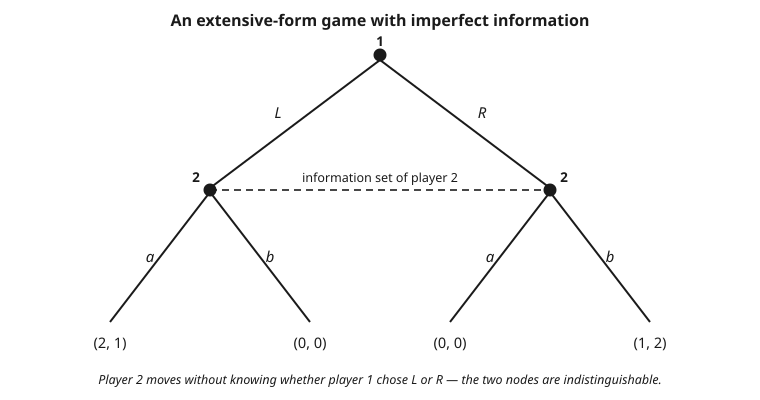

# Grad Game Theory · Lesson 3.1: Extensive-form games and behavior strategies

> ⏱ ~15 min · Module 3: Dynamic and repeated games · Builds on: [2.5 Correlated equilibrium](02-05-correlated-equilibrium.md) · Unlocks: [3.2 Backward induction and subgame perfection](03-02-backward-induction-subgame-perfection.md)

## Why this matters

Module 2 lived in the strategic form: everyone commits a strategy at once, we read off a payoff matrix, done. But most economics is *sequential* — an incumbent sees entry before it fights, a bidder sees the auction unfold, a central bank moves before firms set prices. To model who-knows-what-when we need the game **tree**: nodes for decisions, edges for actions, and — the crucial device — **information sets** that record exactly what a player can and cannot observe when it's their turn. This lesson builds that object and settles a foundational question: when a player can randomize, should we think of them as mixing over whole battle plans, or flipping a fresh coin at each decision? Kuhn's theorem says that under one natural condition these coincide, which is why every later credibility argument (3.2) and every belief system (4.4) gets to use the simpler of the two.

## The idea

Picture a story unfolding move by move. Each moment where *someone* must choose is a node; the branches leaving it are the available actions; follow branches down and you eventually hit a leaf, where the story ends and everyone collects a payoff. Some nodes belong to **Nature** — a non-strategic player who rolls fixed dice (the card you're dealt, whether demand is high or low).

The subtle part is *knowledge*. When it's your turn, you might not know exactly where in the tree you are — you know it's your move, but two different histories could have led here and you can't tell them apart. Bundle those indistinguishable nodes into one **information set**. If every information set is a single node, you always know exactly where you stand: **perfect information** (chess). If some information set has two or more nodes, you're moving in the fog: **imperfect information** (a simultaneous move, or a hidden card).

A **strategy** must then be a complete instruction manual: at *every* information set you own, name the action you'd take — even at sets you never expect to reach. Two ways to randomize such a manual. You can shuffle a deck of fully-specified manuals and draw one (a **mixed strategy**). Or you can carry one manual and, at each information set, flip an independent coin to pick the action then and there (a **behavior strategy**). The first randomizes *once, globally*; the second randomizes *locally, repeatedly*. Kuhn's theorem is the happy news that — as long as you never forget what you knew — these two produce exactly the same distribution over outcomes.

## The formal version

**Extensive-form game (finite).** A tuple consisting of:

- a finite tree with node set, a unique **root**, and **terminal nodes** (leaves) $Z$;
- a set of **players** $\{1, \dots, n\}$ plus **Nature** (player $0$); every non-terminal node is assigned to one player;
- for each node, a set of **actions** labeling its outgoing edges;
- for Nature's nodes, a fixed probability distribution over its actions;
- for each player $i$, a partition of $i$'s nodes into **information sets** $\mathcal{I}_i = \{I_{i,1}, I_{i,2}, \dots\}$, where all nodes in one set have the *same* available actions;
- a **payoff** $u_i(z) \in \mathbb{R}$ for every player at every leaf $z \in Z$.

In words: a labeled tree recording who moves where, what they can do, what Nature does by chance, what each mover can see (the information sets), and what everyone gets at the end.

**Perfect vs. imperfect information.** The game has **perfect information** if every information set is a singleton; otherwise **imperfect information**.

In words: perfect information means every player always knows the exact current node; a non-singleton information set is genuine ignorance about which node you're at.

**Pure strategy.** A pure strategy for player $i$ is a function $s_i : \mathcal{I}_i \to \text{actions}$ assigning to each information set $I \in \mathcal{I}_i$ one action available at $I$. The set of pure strategies is the Cartesian product $S_i = \prod_{I \in \mathcal{I}_i} A(I)$, where $A(I)$ is the action set at $I$.

In words: a pure strategy is a full contingency plan — one chosen action at each of your information sets, whether or not you expect to land there. Its size is the *product* of the branch counts, so plans grow exponentially in the number of decision points.

**Reduction to strategic form.** Fixing a pure strategy for every player determines a path through the tree (Nature's nodes split into branches weighted by its probabilities), hence a distribution over leaves and an expected payoff vector. Tabulating $u_i(s_1, \dots, s_n)$ over all pure profiles yields the **strategic (normal) form** of the tree — an ordinary matrix game, to which all of Module 2 applies.

**Mixed vs. behavior strategy.**

- A **mixed strategy** $\sigma_i$ is a probability distribution over the pure-strategy set $S_i$ — one global lottery over complete plans.
- A **behavior strategy** $\beta_i$ assigns to *each* information set $I \in \mathcal{I}_i$ an independent distribution $\beta_i(\cdot \mid I)$ over the actions $A(I)$.

In words: a mixed strategy draws one plan up front and follows it; a behavior strategy randomizes freshly and independently at each information set as it's reached.

**Perfect recall.** Player $i$ has **perfect recall** if, informally, $i$ never forgets (a) their own past actions and (b) anything they once knew. Formally: whenever two nodes lie in the same information set of $i$, they are preceded by the same sequence of $i$'s own information sets *and* the same actions chosen by $i$ at those sets. A game has perfect recall if every player does.

In words: within any information set, everything *you* did and knew earlier is identical across its nodes — your uncertainty is only about others' or Nature's moves, never about your own history.

**Kuhn's theorem.** In a finite extensive-form game of **perfect recall**, every mixed strategy has an outcome-equivalent behavior strategy and conversely — the two induce the same probability distribution over terminal nodes against any fixed profile of opponents.

In words: with perfect recall it makes no difference whether you randomize once over plans or locally at each node, so we may work with the far more economical behavior strategies. Without perfect recall, the equivalence can fail.

## Picture

## Worked examples

**Example 1 (mechanical — pure strategies and the normal form of a tree).**
Take a two-stage entry game with *perfect* information. Player 1 (Entrant) chooses **In** or **Out**. If **Out**, the game ends at payoffs $(0, 2)$ (entrant, incumbent). If **In**, Player 2 (Incumbent) — who *observes* entry, so this is a singleton information set — chooses **Fight** ($(-1,-1)$) or **Accommodate** ($(1,1)$).

*Enumerate strategies.* Player 1 has one information set (the root) with two actions: $S_1 = \{\text{In}, \text{Out}\}$. Player 2 has one information set (reached only after **In**) with two actions: $S_2 = \{\text{Fight}, \text{Accommodate}\}$. A strategy for 2 must still name an action there *even though 2 might never move* — that off-path specification is the whole point (it's what makes "Fight" a threat we can test in 3.2).

*Build the matrix.* Columns are 2's plan, rows are 1's:

$$
\begin{array}{c|cc}
 & \text{Fight} & \text{Accommodate}\\\hline
\text{In} & (-1,-1) & (1,1)\\
\text{Out} & (0,2) & (0,2)
\end{array}
$$

Notice the **Out** row is constant across 2's choices: once 1 stays out, 2 never moves, so 2's plan can't change the payoff. Reading off Nash equilibria: $(\text{In}, \text{Accommodate})$ and $(\text{Out}, \text{Fight})$ are both Nash — but the second rests on a threat 2 would never carry out. Killing that non-credible equilibrium is exactly what backward induction does next lesson.

**Example 2 (Kuhn — converting a mixed strategy to its behavior twin).**
Consider a player who moves at *two* information sets on a single path: first $I_1$ with actions $\{A, B\}$, then (only after $A$) $I_2$ with actions $\{c, d\}$. This player has perfect recall (at $I_2$ they remember playing $A$). Their pure plans are

$$S = \{\,(A,c),\ (A,d),\ (B,c),\ (B,d)\,\},$$

where the second coordinate specifies $I_2$'s action even when $B$ makes $I_2$ unreachable. Suppose the mixed strategy is

$$\sigma = \big(\tfrac{3}{10},\ \tfrac{3}{10},\ \tfrac{2}{10},\ \tfrac{2}{10}\big) \text{ over } \big((A,c),(A,d),(B,c),(B,d)\big).$$

*Find the equivalent behavior strategy* $\beta$. At each information set, the behavior probability of an action is its conditional probability under $\sigma$, given the set is reached.

At $I_1$ (always reached): $\Pr(A) = \tfrac{3}{10} + \tfrac{3}{10} = \tfrac{6}{10}$, so
$$\beta(A \mid I_1) = \tfrac{3}{5}, \qquad \beta(B \mid I_1) = \tfrac{2}{5}.$$

At $I_2$ (reached only when $A$ was played): condition on the plans that play $A$, namely $(A,c)$ and $(A,d)$ with total weight $\tfrac{6}{10}$. Among those, $c$ has weight $\tfrac{3}{10}$:
$$\beta(c \mid I_2) = \frac{3/10}{6/10} = \tfrac{1}{2}, \qquad \beta(d \mid I_2) = \tfrac{1}{2}.$$

*Check outcome-equivalence.* The path reaching leaf "$A$ then $c$" has probability $\beta(A)\,\beta(c) = \tfrac{3}{5}\cdot\tfrac{1}{2} = \tfrac{3}{10}$ under $\beta$ — matching $\sigma(A,c) = \tfrac{3}{10}$. Likewise "$A$ then $d$" gives $\tfrac{3}{10}$, and "$B$" (either plan) gives $\beta(B) = \tfrac{2}{5} = \tfrac{4}{10} = \sigma(B,c) + \sigma(B,d)$. Same distribution over outcomes — Kuhn in action. The independence across $I_1$ and $I_2$ is legitimate *because* perfect recall guarantees reaching $I_2$ tells the player nothing new about their own earlier randomization.

**Where it fails (absent-minded driver).** A driver heading home passes two identical exits; the second is home. At each exit they choose **Continue** or **Exit**. Continuing past both (miss home) pays $0$; exiting at the first (too early) pays $0$; exiting at the second pays $4$. The catch: the two intersections look *identical* and the driver can't remember whether they've already passed one — a *single* information set containing both nodes, so this violates perfect recall (the driver forgets their own past action). A behavior strategy must use the **same** continue-probability $p$ at both (they're one information set). Expected payoff is $4\,p(1-p)$, maximized at $p = \tfrac12$ giving $1$. But a *mixed* strategy over the pure plans {always continue, always exit} can do no better here, and more pointedly the "optimal" $p$ recomputed at the intersection using consistent beliefs disagrees with the ex-ante $p$ — the mixed/behavior reconciliation Kuhn guarantees under perfect recall simply breaks. The lesson: drop perfect recall and randomizing-once is no longer the same as randomizing-locally.

## Watch out

- **You might think** a strategy only needs to specify actions on the path you expect to play — **but actually** it must name an action at *every* information set you own, including unreached ones. Those off-path specifications are not idle: they are precisely the threats and promises whose credibility 3.2 scrutinizes. A plan silent off-path isn't a strategy.
- **You might think** behavior strategies and mixed strategies are always interchangeable — **but actually** the equivalence is *Kuhn's theorem, and it needs perfect recall*. The absent-minded driver shows it can fail when a player forgets their own history; there, local randomization and global randomization genuinely differ.
- **You might think** an information set with two nodes means the player is indifferent between them — **but actually** it means the player *cannot distinguish* them: they literally do not know which node they're at. Indifference is about payoffs; an information set is about knowledge.
- **You might think** "imperfect information" and "imperfect recall" are the same phrase twice — **but actually** they are different failures. Imperfect *information* = you can't see others'/Nature's moves (a non-singleton set, totally normal). Imperfect *recall* = you've forgotten your *own* past (rare, pathological). Perfect-recall games routinely have imperfect information — that's most of game theory.

## One-liner

> An extensive-form game is a tree whose information sets encode what each mover knows; a strategy fixes an action at every set (even off-path), and — under perfect recall only — Kuhn lets you randomize locally (behavior) instead of globally (mixed) for free.

## Problems

**P1 (🟢)** A game tree: Player 1 chooses $U$ or $D$ at the root. After $U$, Player 2 moves at an information set with actions $\{\ell, r\}$; after $D$, Player 2 moves at a *separate* information set with actions $\{\ell, r\}$ (Player 2 observes 1's choice — perfect information). How many pure strategies does Player 2 have? Write them out.

**P2 (🟡)** Now change P1's tree so Player 2 does *not* observe whether 1 chose $U$ or $D$: both of 2's nodes lie in a *single* information set (still actions $\{\ell, r\}$). How many pure strategies does Player 2 have now, and why did the count drop? Does Player 2 still have perfect recall?

**P3 (🔴, optional)** On the perfect-recall tree of Example 2 (info sets $I_1 = \{A,B\}$, then $I_2 = \{c,d\}$ after $A$), you are given a behavior strategy $\beta(A\mid I_1) = \tfrac14$, $\beta(c \mid I_2) = \tfrac13$. Construct a mixed strategy over $S = \{(A,c),(A,d),(B,c),(B,d)\}$ that is outcome-equivalent, and verify the induced leaf distribution matches. (Hint: many mixed strategies work; the natural one factorizes the behavior probabilities.)

Solutions

**P1** Player 2 has **two** information sets (one after $U$, one after $D$), each with $2$ actions. A pure strategy names an action at *each*, so there are $2 \times 2 = 4$ pure strategies:
$$\{(\ell,\ell),\ (\ell,r),\ (r,\ell),\ (r,r)\},$$
where the first coordinate is 2's action after $U$ and the second after $D$. (This is why perfect information inflates strategy counts: every distinguishable history is its own decision.)

**P2** Now Player 2 has **one** information set containing both nodes, with $2$ actions, so only $2^1 = 2$ pure strategies: $\{\ell, r\}$. The count dropped from $4$ to $2$ because merging the two nodes into one information set forces 2 to choose the *same* action at both — 2 can no longer condition on 1's move, since 2 can't see it. Player 2 still has **perfect recall**: 2 has only this one move and forgets nothing about their own (empty) past; the uncertainty is about *1's* action, which is imperfect *information*, not imperfect recall.

**P3** The natural equivalent mixed strategy assigns each pure plan the product of its behavior probabilities. With $\beta(A) = \tfrac14$, $\beta(B) = \tfrac34$, $\beta(c) = \tfrac13$, $\beta(d) = \tfrac23$:

$$
\sigma(A,c) = \tfrac14\cdot\tfrac13 = \tfrac{1}{12}, \quad
\sigma(A,d) = \tfrac14\cdot\tfrac23 = \tfrac{2}{12}, \quad
\sigma(B,c) = \tfrac34\cdot\tfrac13 = \tfrac{3}{12}, \quad
\sigma(B,d) = \tfrac34\cdot\tfrac23 = \tfrac{6}{12}.
$$

These sum to $\tfrac{1+2+3+6}{12} = 1$. ✓ Now check the leaf distribution. Leaves are: "$A$ then $c$", "$A$ then $d$", and "$B$" (which ends the same way regardless of the unreached $I_2$ coordinate).
- $\Pr(A\text{ then }c) = \sigma(A,c) = \tfrac{1}{12}$, matching $\beta(A)\beta(c) = \tfrac14\cdot\tfrac13 = \tfrac{1}{12}$. ✓
- $\Pr(A\text{ then }d) = \sigma(A,d) = \tfrac{2}{12} = \tfrac16$, matching $\beta(A)\beta(d) = \tfrac14\cdot\tfrac23 = \tfrac16$. ✓
- $\Pr(B) = \sigma(B,c) + \sigma(B,d) = \tfrac{3}{12} + \tfrac{6}{12} = \tfrac{9}{12} = \tfrac34 = \beta(B)$. ✓

Same distribution over outcomes — the converse direction of Kuhn. (Note the choice isn't unique: because $B$ makes $I_2$ irrelevant, any split of $\beta(B) = \tfrac34$ across $(B,c)$ and $(B,d)$ is outcome-equivalent; the factorized one is simply the tidiest.)

## Flashback

**From Lesson 2.2 (Nash equilibrium and mixed strategies):** In Matching Pennies, each player picks Heads or Tails; the matcher wins ($+1$, opponent $-1$) if they agree, the mismatcher wins if they differ. Find the mixed-strategy Nash equilibrium and state each player's equilibrium expected payoff.

Solution

Let the matcher play Heads with probability $p$ and the mismatcher play Heads with probability $q$. The matcher is indifferent only when the mismatcher's mix makes Heads and Tails yield equal payoff. The mismatcher wins on a *mismatch*, so from the matcher's side: playing Heads gives expected payoff $q(1) + (1-q)(-1)$... let's set it up cleanly with payoffs to the matcher: agree $\to +1$, disagree $\to -1$.

Matcher's payoff to Heads: $q(+1) + (1-q)(-1) = 2q - 1$. To Tails: $q(-1) + (1-q)(+1) = 1 - 2q$. Indifference: $2q - 1 = 1 - 2q \Rightarrow q = \tfrac12$. By the symmetric argument, the mismatcher is indifferent when $p = \tfrac12$. So the unique equilibrium is **each player mixing $\big(\tfrac12, \tfrac12\big)$**.

Expected payoff: at $p = q = \tfrac12$ every outcome has probability $\tfrac14$, two are matches ($+1$ to matcher) and two are mismatches ($-1$), so the matcher's expected payoff is $0$ and the mismatcher's is $0$. Each player nets **$0$** in equilibrium — as it must be for a symmetric zero-sum game with a unique value. (This is the strategic form of a one-shot simultaneous game; drawn as a tree it is exactly the imperfect-information picture above — a single information set for the second mover.)

## Connections

- **Backward:** the strategic form of a tree is an ordinary matrix game, so all of Module 2 — Nash existence, mixed equilibria, [correlated equilibrium](02-05-correlated-equilibrium.md) — applies directly to the reduced normal form. The Flashback's simultaneous Matching Pennies *is* a two-node information set, showing the strategic form is the special case where nobody sees anyone's move.
- **Forward:** [3.2 Backward induction and subgame perfection](03-02-backward-induction-subgame-perfection.md) exploits exactly the off-path part of a strategy to rule out non-credible threats (Example 1's "Out, Fight"); [4.4 Perfect Bayesian and sequential equilibrium](04-04-perfect-bayesian-sequential-equilibrium.md) equips each information set with a *belief* over its nodes, turning the fog of imperfect information into probabilities players optimize against.
- **Sideways (grad-micro):** sequential-move models — Stackelberg leadership, entry deterrence, and extensive-form bargaining (alternating offers) — are this machinery applied to markets; see [grad-micro](../../grad-micro/syllabus.md). The entry game of Example 1 is the skeleton of every incumbent-vs-entrant model there.
- **Sideways (game-theory-refresher):** the intuitive game-tree pictures from [game-theory-refresher](../../game-theory-refresher/syllabus.md) are formalized here into information-set partitions with the perfect-recall condition made precise.
