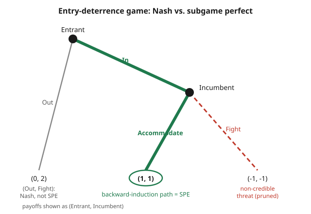

# Grad Game Theory · Lesson 3.2: Backward induction and subgame perfection

> ⏱ ~15 min · Module 3: Dynamic and repeated games · Builds on: [3.1 Extensive-form games and behavior strategies](03-01-extensive-form-behavior-strategies.md) · Unlocks: [3.3 Repeated games: finite and infinite horizons](03-03-repeated-games-finite-infinite.md)

## Why this matters

Nash equilibrium was built for one-shot, simultaneous choice. Turn it loose on a game that unfolds *over time* and it starts certifying nonsense: it will happily bless an equilibrium propped up by a **threat the threatener would never actually carry out**. An incumbent monopolist "deters" entry by promising a price war it would rather not fight; a parent "enforces" a rule with a punishment they'd never inflict once the moment came. These are Nash equilibria that dissolve the instant you ask "and would you really do that?" Subgame perfection is the refinement that asks exactly that question — at every node, not just the start — and backward induction is the algorithm that answers it. This is the foundation for everything in repeated games (3.3), the folk theorem (3.4), and the Stackelberg and entry-deterrence models you'll meet in [grad-micro](../../grad-micro/syllabus.md).

## The idea

Play a movie of the game forward and you can talk yourself into believing any threat. Play it *backward* and threats have to prove themselves.

Start at the very end, where whoever moves last faces no future — just leaf payoffs — so their choice is a trivial max. Pencil in that choice; now the second-to-last mover knows exactly what follows each of their actions, so their choice becomes trivial too. Fold the tree leaf-by-leaf toward the root, and at every step each player optimizes *given the already-solved future*. What survives is the only plan in which nobody is ever counting on someone else to act against their own interest down the line. Every promise in it is one the promiser would actually keep, because keeping it is optimal at the node where it's tested. That's credibility, and Nash alone doesn't require it.

## The formal version

Fix a finite extensive-form game with perfect information (every information set is a single node — nobody ever moves in ignorance).

**Subgame.** A *subgame* is the piece of the tree that starts at a single decision node $h$ (a singleton information set), together with **all** of $h$'s descendants, and it must not slice through any information set (if it contains one node of an information set, it contains them all).

*In words:* a subgame is a self-contained game-within-the-game hanging off some node — a fresh tree you could hand to a player and say "play from here." In perfect-information games, every node starts a subgame.

**Subgame-perfect equilibrium (SPE).** A strategy profile $s = (s_1,\dots,s_n)$ is an SPE if its restriction to *every* subgame is a Nash equilibrium of that subgame.

*In words:* the plan is not just optimal from the opening — it's optimal from **every** point the game could reach, including nodes that equilibrium play never visits. Credible everywhere, not just on average from the start.

**Backward induction.** In a finite perfect-information game, process nodes from the leaves up: at each decision node, the mover selects an action maximizing their payoff given the (already-determined) continuation play in the subtree below. The resulting profile is the backward-induction solution.

**Zermelo / Kuhn.** Every finite extensive-form game with perfect information has a subgame-perfect equilibrium in pure strategies, obtainable by backward induction; if no player is ever indifferent between two actions at any node, it is unique.

*In words:* folding the tree always works and always lands on an SPE — and generically there's exactly one answer.

**One-shot deviation principle (the workhorse).** A strategy profile $s$ is an SPE **if and only if** no player, at any single information set, can raise their payoff by deviating there *once* and conforming to $s$ everywhere else — holding all other players' strategies (and the player's own actions at every other node) fixed.

*In words:* to certify an SPE you don't have to check every wild alternative full strategy; you only check "is one lone step off the path ever profitable?" at each node. If no single-step detour pays, no complicated multi-step scheme can either.

Why it works: any profitable deviation, however elaborate, differs from $s$ at some set of nodes. In a finite game (or an infinite game where distant payoffs are discounted, so **continuation payoffs are continuous at infinity**), take a *last* node where the deviation acts differently and revert it to $s$ from there on — by the "no profitable single deviation" hypothesis this can't lower the payoff, and iterating erases the whole deviation without ever losing value. So no deviation beats $s$. The continuity-at-infinity caveat matters: without discounting, an infinite game can have a deviation with no "last" node to peel off, and the principle can fail — you'll lean on this heavily in 3.3.

## Picture

The green path is what backward induction keeps: at the Incumbent's node, Accommodate (payoff 1) beats Fight (payoff $-1$), so the Entrant — anticipating that — enters, landing on $(1,1)$. The dashed red Fight branch is the threat that supports the *other* Nash equilibrium $(\text{Out}, \text{Fight})$ — and it's exactly what backward induction prunes, because the Incumbent would never actually fight.

## Worked examples

**Example 1 (entry deterrence — every NE, then the SPE).** The Entrant chooses In or Out; if In, the Incumbent chooses Accommodate or Fight. Payoffs $(\text{Entrant}, \text{Incumbent})$: Out $\to (0,2)$; (In, Accommodate) $\to (1,1)$; (In, Fight) $\to (-1,-1)$.

First, the **normal form**. The Entrant's pure strategies are $\{\text{In}, \text{Out}\}$; the Incumbent's are $\{\text{Accommodate}, \text{Fight}\}$ (what it *would* do if entry occurred):

$$
\begin{array}{c|cc}
 & \text{Accommodate} & \text{Fight} \\ \hline
\text{In} & (1,\,1) & (-1,\,-1) \\
\text{Out} & (0,\,2) & (0,\,2)
\end{array}
$$

Scan for pure-strategy Nash equilibria (each player best-responding):

- $(\text{In}, \text{Accommodate})$: given Accommodate, In (1) beats Out (0) ✓; given In, Accommodate (1) beats Fight ($-1$) ✓. **NE.**
- $(\text{Out}, \text{Fight})$: given Fight, Out (0) beats In ($-1$) ✓; given Out, the Incumbent is never called on to move, so both its actions yield 2 — Fight is a (weak) best response ✓. **NE.**
- $(\text{In}, \text{Fight})$: Incumbent would deviate to Accommodate. Not NE. $(\text{Out}, \text{Accommodate})$: Entrant would deviate to In. Not NE.

So Nash gives **two** equilibria. Now **backward induction**. At the Incumbent's node, $\text{Accommodate}=1 > \text{Fight}=-1$, so it accommodates. Folding up: the Entrant compares In $\to 1$ against Out $\to 0$, so it enters. The unique SPE is $(\text{In}, \text{Accommodate})$ with outcome $(1,1)$.

The verdict on $(\text{Out}, \text{Fight})$: it *is* a Nash equilibrium, but it fails subgame perfection. Consider the subgame starting at the Incumbent's node — a one-player game whose Nash solution is Accommodate. The profile prescribes Fight there, which is not a Nash equilibrium of that subgame. The Fight threat is **non-credible**: it deters entry only because the Entrant "believes" it, yet the Incumbent would abandon it the instant entry happened ($-1 < 1$). SPE deletes exactly this kind of empty threat.

**Example 2 (centipede — backward induction and its paradox).** Two players alternate over four decision nodes; at each, the mover can **Take** (end now) or **Pass** (grow the pot but hand the move over). Payoffs $(\text{P1}, \text{P2})$: Take at node 1 $\to (2,0)$; at node 2 $\to (1,3)$; at node 3 $\to (4,2)$; at node 4 $\to (3,5)$; and if P2 Passes at node 4, the game ends at $(6,4)$.

Fold from the last node:

- **Node 4 (P2):** Take gives P2 $5$; Pass gives $4$. $5>4 \Rightarrow$ **Take** $\to (3,5)$.
- **Node 3 (P1):** Take gives P1 $4$; Pass leads to node-4 Take $=(3,5)$, so P1 gets $3$. $4>3 \Rightarrow$ **Take** $\to (4,2)$.
- **Node 2 (P2):** Take gives P2 $3$; Pass leads to node-3 Take, P2 gets $2$. $3>2 \Rightarrow$ **Take** $\to (1,3)$.
- **Node 1 (P1):** Take gives P1 $2$; Pass leads to node-2 Take, P1 gets $1$. $2>1 \Rightarrow$ **Take** $\to (2,0)$.

The unique SPE: **P1 Takes immediately**, ending at $(2,0)$. But look — passing all the way to the end pays $(6,4)$, which strictly dominates $(2,0)$ for *both* players. Backward induction insists on the outcome that leaves everyone poorer. That's the **centipede paradox**: iterated common knowledge of rationality unravels cooperation from the back, even though a single mutual "Pass" would make both better off. It's the sharpest reminder that SPE is a model of a certain idealized rationality, not a prediction that always survives contact with real players — who, in experiments, routinely pass.

## Watch out

- **You might think** every Nash equilibrium is subgame perfect — **but actually** it's the reverse containment: SPE $\subseteq$ NE. Every SPE is a Nash equilibrium (a subgame perfect profile is in particular a NE of the whole-game "subgame"), but not conversely — SPE is the *strict* refinement that strips out non-credible-threat NE like $(\text{Out}, \text{Fight})$.
- **You might think** backward induction always applies — **but actually** it needs **perfect information and a finite horizon**. With imperfect information (a player moves inside a non-singleton information set), a node need not start a subgame and there's nothing clean to fold from the leaves; you need Perfect Bayesian Equilibrium instead (4.4). With an infinite horizon there are no leaves to start from.
- **You might think** the one-shot deviation principle is always safe — **but actually** it requires **continuity at infinity** (guaranteed by finite horizon, or by discounting future payoffs). Without it, an infinite deviation may have no last differing node to unwind, and a profile can survive every single-step check yet still not be an SPE.
- **You might think** a threat being *stated* makes it strategically real — **but actually** a threat is credible only if executing it is optimal *at the node where it would be tested*. If carrying it out is suboptimal there, backward induction erases it, no matter how firmly it's promised in advance.

## One-liner

> Fold the tree from the leaves: subgame perfection keeps only the plans whose every promise the promiser would actually keep when the moment came.

## Problems

**P1 (🟢)** A two-stage game: Player 1 chooses L or R. If R, Player 2 then chooses $u$ or $d$. Payoffs $(P_1, P_2)$: L $\to (3,3)$; (R, $u$) $\to (4,1)$; (R, $d$) $\to (0,0)$. Find the SPE by backward induction, and identify a Nash equilibrium of the normal form that is *not* subgame perfect.

**P2 (🟡)** In Example 1, suppose fighting is cheaper for the Incumbent, so the payoffs change to: (In, Fight) $\to (-1, 3)$, with Out $\to (0,2)$ and (In, Accommodate) $\to (1,1)$ unchanged. Now what is the SPE? Is the Fight threat credible here? Explain what changed.

**P3 (🔴, optional)** Consider an infinitely repeated game where each player's total payoff is $\sum_{t=0}^{\infty} \delta^t g_t$ with per-period payoff $g_t$ and discount factor $\delta \in (0,1)$. Explain, in two or three sentences, why the one-shot deviation principle is valid here — i.e., why discounting supplies the "continuity at infinity" the principle needs. (No computation; this is the conceptual bridge to 3.3.)

Solutions

**P1** Backward induction: at Player 2's node (reached only after R), $u$ gives 1, $d$ gives 0, so P2 plays $u$. Folding up, P1 compares L $\to 3$ against R (which yields $(4,1)$, so P1 gets 4). $4 > 3$, so P1 plays R. **SPE: $(R, u)$, outcome $(4,1)$.**

Normal form (P1 rows $\{L,R\}$, P2 columns $\{u,d\}$ — note L makes P2's move irrelevant, so both its columns pay $(3,3)$):

$$
\begin{array}{c|cc}
 & u & d \\ \hline
L & (3,3) & (3,3) \\
R & (4,1) & (0,0)
\end{array}
$$

Nash equilibria: $(R,u)$ — check: given $u$, R (4) beats L (3) ✓; given R, $u$ (1) beats $d$ (0) ✓. And $(L,d)$ — given $d$, L (3) beats R (0) ✓; given L, P2 never moves, so $d$ is a weak best response ✓. So $(L,d)$ is a **Nash equilibrium that is not subgame perfect**: in the subgame at P2's node, $d$ is not optimal (0 < 1). The threat "if you play R, I'll play $d$" deters R but is non-credible — P2 would switch to $u$ if actually reached.

**P2** At the Incumbent's node the payoffs are now Accommodate $= 1$ versus Fight $= 3$. So the Incumbent strictly prefers to **Fight** ($3 > 1$). Folding up: the Entrant compares In $\to -1$ (it will be fought) against Out $\to 0$, and chooses **Out**. **SPE: $(\text{Out}, \text{Fight})$, outcome $(0,2)$.**

Here the Fight threat *is* credible: fighting is genuinely optimal at the node where it's tested, so backward induction keeps it. What changed is that deterrence is now real, not empty — with fighting profitable ($3 > 1$) rather than costly ($-1 < 1$), the same "Fight" that was a bluff in Example 1 becomes the incumbent's honest best response, and entry is deterred in equilibrium.

**P3** With $\delta \in (0,1)$, the tail of the payoff sum from period $T$ onward is bounded by $\sum_{t=T}^{\infty}\delta^t \bar{g} = \delta^T \bar g/(1-\delta)$ (for bounded per-period payoffs $|g_t|\le\bar g$), which $\to 0$ as $T \to \infty$. So changes to play in the far future move total payoffs arbitrarily little — that is precisely continuity at infinity. It means any profitable deviation is well-approximated by one that differs from equilibrium at only finitely many nodes, so it has a "last" differing node to peel off, and the one-shot deviation argument goes through exactly as in a finite game.

## Flashback

**From Lesson 3.1 (Extensive-form games and behavior strategies):** For the entry-deterrence game in Example 1 (Entrant: In/Out; then Incumbent: Accommodate/Fight), (a) how many *pure strategies* does each player have, and (b) does this game have any non-singleton information sets — i.e., is it a game of perfect information?

Solution

(a) A pure strategy specifies an action at every information set where the player moves. The Entrant moves at exactly one node with two actions $\Rightarrow$ **2 pure strategies** (In, Out). The Incumbent also moves at exactly one node (reached only after In) with two actions $\Rightarrow$ **2 pure strategies** (Accommodate, Fight). Note a strategy must prescribe an action even at nodes that equilibrium play never reaches — which is exactly why the Incumbent's off-path choice (Fight vs. Accommodate) is what distinguishes the two Nash equilibria.

(b) Every information set is a single node — the Incumbent sees that entry has occurred before choosing — so there are no non-singleton information sets. **Yes, it is a game of perfect information**, which is exactly why backward induction applies and delivers the SPE directly.

## Connections

- **Backward** — [3.1](03-01-extensive-form-behavior-strategies.md): subgames are read off the game tree and information sets defined there, and the "action at an unreached node" that a full strategy must specify is precisely the off-path choice SPE disciplines. The pruned Fight branch is a strategy component that never gets played on the equilibrium path.
- **Forward** — [3.3](03-03-repeated-games-finite-infinite.md): the one-shot deviation principle is the tool for checking whether trigger strategies (grim, tit-for-tat) form an SPE of a repeated game; and [3.4] extends this to the folk theorem, which characterizes the *whole set* of SPE payoffs sustainable by credible punishment.
- **Forward** — 4.4: with imperfect information, backward induction and SPE are replaced by Perfect Bayesian Equilibrium, which pairs sequentially-optimal strategies with beliefs — the natural generalization when nodes no longer start clean subgames.
- **Sideways (micro)** — [grad-micro](../../grad-micro/syllabus.md): Stackelberg leader-follower competition is backward induction (the leader chooses quantity anticipating the follower's best response), and entry deterrence here is the strategic skeleton of the industrial-organization models of predation and limit pricing.
- **Sideways (foundations)** — [game-theory-refresher](../../game-theory-refresher/syllabus.md): this sharpens the refresher's picture of Nash equilibrium by showing which equilibria to *distrust* in a dynamic setting, and why "credibility" is the operative refinement.
- See also the [course syllabus](../syllabus.md) for where Module 3 sits in the arc.
