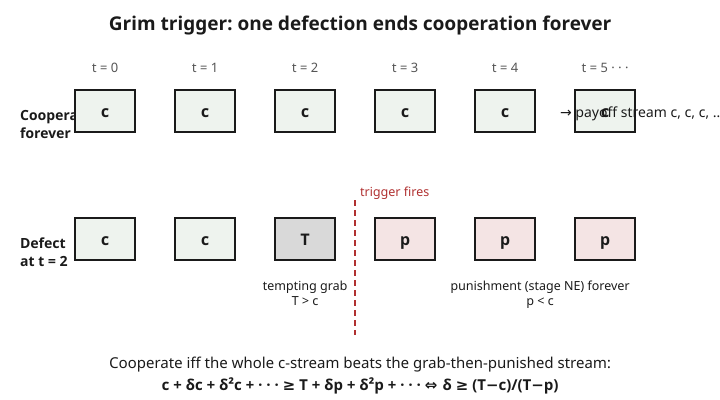

# Grad Game Theory · Lesson 3.3: Repeated games — finite and infinite horizons

> ⏱ ~15 min · Module 3: Dynamic and repeated games · Builds on: [3.2 Backward induction and subgame perfection](03-02-backward-induction-subgame-perfection.md) · Unlocks: [3.4 The folk theorems](03-04-folk-theorems.md)

## Why this matters

In a one-shot prisoner's dilemma, cooperation is impossible: defection strictly dominates, full stop. Yet real firms hold cartels, neighbors keep promises, and nations honor treaties — all situations where the one-shot logic screams "defect." The missing ingredient is *repetition*. When the same players meet again and again, today's cheating buys tomorrow's retaliation, and a patient enough player will forgo the grab. This lesson makes that precise: it derives the exact threshold of patience above which "cooperate, or else" is a genuine equilibrium — the analytical core of collusion, reputation, and the folk theorems ahead.

## The idea

Take any one-shot game $G$ — the **stage game** — and play it over and over. A **history** is the full record of what everyone has done so far; a **strategy** now maps each history to an action, so a player can *condition* today's move on the entire past. That single change — "I can remember, and punish" — is what unlocks cooperation.

The intuition is a cost-benefit trade at every moment. Defecting today wins a one-time bonus. But if your partner's strategy is "cooperate until you cross me, then punish forever," that bonus is followed by an infinite tail of worse payoffs. Whether cooperation holds comes down to a race between a *fixed* temptation grabbed once and a *recurring* loss suffered forever. Patience — caring about the future — tips the race toward cooperation.

The twist is that the horizon matters enormously. Play forever and the future is a bottomless well of punishment: cooperation can survive. Play a *known finite* number of times and the whole thing unravels from the last period backward — because everyone knows the final round has no tomorrow to fear.

## The formal version

**The repeated game.** Fix a stage game $G$ with action profile payoffs $g(a)$. In period $t = 0, 1, 2, \dots$ players simultaneously choose actions, observe the resulting profile $a^t$, and move on. Write $g_t = g(a^t)$ for the stage payoff earned in period $t$. Players aggregate the infinite payoff stream by **discounting** with a factor $\delta \in (0,1)$:

$$U = (1-\delta)\sum_{t=0}^{\infty} \delta^t\, g_t.$$

**In words:** each future period counts a bit less than the one before, shrinking by $\delta$ each step; the $(1-\delta)$ out front normalizes so that a constant stream $g_t = g$ is worth exactly $g$ (a clean "per-period average"). Two readings of $\delta$: **patience** (how much you value tomorrow) or the **probability the relationship continues** one more round. A higher $\delta$ means the future weighs more.

For comparing streams the normalizer is cosmetic, so I'll often drop it and compare raw sums $\sum \delta^t g_t$; the geometric fact $\sum_{t=0}^\infty \delta^t = \frac{1}{1-\delta}$ does all the work.

**Finite horizon — unraveling.** Suppose $G$ has a *unique* Nash equilibrium $a^{\ast}$, and we repeat it exactly $T < \infty$ times.

> **Claim.** The unique subgame-perfect equilibrium plays $a^{\ast}$ in *every* period.

**In words:** backward induction (from [3.2](03-02-backward-induction-subgame-perfection.md)) eats cooperation from the end. In the last period there is no future, so players play the stage NE $a^{\ast}$. Knowing period $T$ is settled regardless of history, period $T-1$ also has nothing to gain by cooperating — so $a^{\ast}$ again — and the argument marches back to period $0$. Finite repetition of a unique-NE stage game buys you *nothing*.

*(Exception, briefly: if $G$ has* multiple *Nash equilibria, the last period can be used as a reward or punishment — "behave and we play the good NE at the end, misbehave and we play the bad one" — and this can sustain some cooperation even with a finite horizon. Multiplicity, not infinity, is what the finite case needs.)*

**Infinite horizon — grim trigger.** Now repeat forever. Consider the **grim-trigger strategy**: *play the cooperative action $C$ every period, until any player deviates; from the next period on, play the stage-NE action forever.* Let the stage-game numbers be

- $c$ = payoff when everyone cooperates,
- $T$ = the one-period payoff from defecting while the other cooperates (the **temptation**, with $T > c$),
- $p$ = the stage-NE payoff, played during punishment (with $p < c$).

> **Proposition.** Grim trigger is a subgame-perfect equilibrium iff $\displaystyle \delta \ge \delta^{\ast} = \frac{T - c}{T - p}$.

**In words:** cooperation is sustainable exactly when players are patient enough. Bigger temptation $T$ raises the bar; a harsher punishment (smaller $p$) lowers it.

**The derivation — one-shot deviation principle.** From [3.2](03-02-backward-induction-subgame-perfection.md): in a game with discounting, a strategy is subgame-perfect iff *no single-period deviation* is profitable at *any* history. So we only ever check "deviate once, then revert." There are two kinds of history:

*On the cooperative path.* Sticking to $C$ yields $c$ forever, worth $c \sum \delta^t = \frac{c}{1-\delta}$. Deviating once grabs $T$ today, then triggers punishment $p$ forever after, worth $T + \delta\,\frac{p}{1-\delta}$. Cooperation is optimal iff

$$\frac{c}{1-\delta} \;\ge\; T + \delta\,\frac{p}{1-\delta}.$$

Multiply by $(1-\delta)$: $c \ge (1-\delta)T + \delta p$, i.e. $c - \delta p \ge T - \delta T$, i.e. $\delta(T - p) \ge T - c$, giving $\delta \ge \frac{T-c}{T-p}$. **In words:** the recurring cooperation surplus, magnified by patience, must swamp the one-time grab.

*On the punishment path.* Here everyone is playing the stage NE. A one-shot deviation is a unilateral move away from a Nash equilibrium of the stage game — by definition it cannot pay. So the punishment is **credible**: it is itself an equilibrium, requiring no one to do anything against their interest. That is precisely why grim trigger survives the subgame-perfection test and a mere Nash threat need not.

## Picture

## Worked examples

**Example 1 (infinitely repeated PD — find $\delta^{\ast}$ and verify SPE).** Stage game, row-player payoffs, with the standard ordering $T > c > p > s$:

| | C | D |
|---|---|---|
| **C** | $c=3$ | $s=0$ |
| **D** | $T=5$ | $p=1$ |

The unique stage NE is $(D,D)$ with payoff $p=1$; cooperation gives $c=3$; the temptation is $T=5$. The critical factor:

$$\delta^{\ast} = \frac{T-c}{T-p} = \frac{5-3}{5-1} = \frac{2}{4} = \frac{1}{2}.$$

So grim-trigger cooperation is an SPE iff $\delta \ge \tfrac12$. **Verify at $\delta = \tfrac12$** (the knife-edge). Cooperating forever is worth $\frac{c}{1-\delta} = \frac{3}{1/2} = 6$. Deviating once is worth $T + \delta\frac{p}{1-\delta} = 5 + \tfrac12\cdot\frac{1}{1/2} = 5 + 1 = 6$. Equal — the player is exactly indifferent, so cooperation is (weakly) optimal; for any $\delta > \tfrac12$ it is strictly optimal. **Check punishment credibility:** on the punishment path both play $D$; a one-shot switch to $C$ earns the sucker payoff $s = 0$ this period instead of $p = 1$, then reverts — strictly worse. Nobody wants to break the punishment, so it is credible and the profile is genuinely subgame-perfect. ✓

**Example 2 (finite PD — unraveling).** Play the *same* PD exactly $T = 3$ times, no discounting, and look for SPE by backward induction. **Period 2 (last):** no future, so each plays the dominant action $D$; outcome $(D,D)$. **Period 1:** since period 2 is $(D,D)$ *regardless* of what happens now, cooperating today buys no future reward — again $D$ dominates, outcome $(D,D)$. **Period 0:** same logic — the continuation is fixed, so $D$. The unique SPE is $(D,D)$ in all three periods: total cooperation collapse. The intuition: cooperation must be propped up by a credible future threat, and a *known* last period has no future to threaten with — the rot spreads backward from there. Only an infinite (or indefinite) horizon, or a stage game with multiple equilibria to reward and punish with, escapes this.

## Watch out

- **You might think** finite repetition is "basically infinite" for large $T$, **but** a unique-NE stage game unravels completely no matter how huge $T$ is — the effect is discontinuous at "infinity." What actually rescues real-world cooperation is *uncertainty about the end*: reinterpret $\delta$ as the probability the game continues, and an indefinite horizon behaves exactly like the discounted infinite game. Never being sure it's the last round is as good as it never being the last round.
- **You might think** a higher discount factor makes cooperation *harder*, **but** it's the reverse: larger $\delta$ means the future (hence the punishment) weighs more, which *lowers* the threshold's bite — patient players cooperate more easily. $\delta \to 1$ makes almost anything sustainable (the folk theorem, [3.4](03-04-folk-theorems.md)).
- **You might think** any nasty threat sustains cooperation, **but** the punishment must itself be an equilibrium of the continuation game, or subgame perfection kills it. Grim trigger works because it punishes with the *stage Nash equilibrium* — credible by construction. A threat to play something even worse (that hurts the punisher too) is the non-credible threat SPE was invented to rule out.
- **You might think** "discounted" and "average" payoff criteria give different equilibria. **but** for a *fixed* $\delta$ they can, yet the set of SPE payoffs they sustain coincides in the patient limit $\delta \to 1$. Use whichever is cleaner; just don't mix them mid-argument.

## One-liner

> Repetition sustains cooperation exactly when the discounted future punishment outweighs the one-shot temptation — $\delta \ge \frac{T-c}{T-p}$ — and only if the punishment is itself an equilibrium; finitely repeat a unique-NE game and it all unravels from the last period back.

## Problems

**P1 (🟢)** In an infinitely repeated PD with $c = 4$, $T = 6$, $p = 1$ (and $s = 0$), find the critical discount factor $\delta^{\ast}$ above which grim trigger sustains cooperation as an SPE.

**P2 (🟡)** In the Example 1 game ($c=3, T=5, p=1, s=0$), a player proposes a *softer* punishment: after a defection, both revert to $(D,D)$ for exactly **two** periods and then return to cooperating. Assuming players are back on the cooperative path afterward, write the on-path no-deviation condition and find the critical $\delta$. (You should find cooperation is *harder* to sustain than under grim trigger — explain in one sentence why.)

**P3 (🔴, optional)** Two firms play an infinitely repeated Cournot-style stage game. Colluding (each producing the monopoly-half quantity) gives each $c = 18$ per period; the stage-game Nash (Cournot) output gives each $p = 16$; a firm that secretly overproduces while its rival colludes earns $T = 20$ that period. (a) Find $\delta^{\ast}$ for grim-trigger collusion. (b) The market's per-period continuation probability is $0.9$ and the firms additionally discount money at factor $0.95$ per period; the *effective* discount factor is the product. Can the cartel hold? *(This is the collusion-as-equilibrium bridge to `grad-micro`.)*

Solutions

**P1** $\delta^{\ast} = \dfrac{T-c}{T-p} = \dfrac{6-4}{6-1} = \dfrac{2}{5} = 0.4$. Cooperation is an SPE iff $\delta \ge 0.4$. (Higher temptation relative to the cooperation surplus than Example 1's raw gap would suggest, but the large punishment drop $c - p = 3$ keeps the threshold moderate.)

**P2** On the cooperative path, cooperating forever is worth $\frac{c}{1-\delta}$. A one-shot deviation grabs $T$ today, suffers $p$ for the next two periods (weights $\delta, \delta^2$), then cooperation resumes from period 3 (value $\frac{c}{1-\delta}$ discounted by $\delta^3$). No-deviation condition:

$$\frac{c}{1-\delta} \;\ge\; T + \delta p + \delta^2 p + \delta^3 \frac{c}{1-\delta}.$$

The left side minus the last right-hand term is $\frac{c}{1-\delta}(1 - \delta^3) = c(1 + \delta + \delta^2)$ (using $\frac{1-\delta^3}{1-\delta} = 1+\delta+\delta^2$). So the condition becomes

$$c(1 + \delta + \delta^2) \ge T + \delta p + \delta^2 p.$$

Plug in $c=3, T=5, p=1$: $3 + 3\delta + 3\delta^2 \ge 5 + \delta + \delta^2$, i.e. $2\delta^2 + 2\delta - 2 \ge 0$, i.e. $\delta^2 + \delta - 1 \ge 0$. The positive root is $\delta = \frac{-1+\sqrt{5}}{2} \approx 0.618$. So $\delta^{\ast} \approx 0.618 > 0.5$: cooperation is **harder** than under grim trigger. **Why:** a punishment that ends after two periods forgives the deviator, so the future loss from cheating is smaller — a weaker deterrent needs more patience to bite. Grim's *permanent* punishment is the maximal credible threat, hence the lowest threshold. (Both punishments are credible: two periods of the stage NE is still stage-NE play, so subgame perfection holds either way.)

**P3** (a) $\delta^{\ast} = \frac{T-c}{T-p} = \frac{20-18}{20-16} = \frac{2}{4} = \frac12$. Collusion is sustainable iff the effective discount factor is at least $0.5$.
(b) The effective factor is $\delta = 0.9 \times 0.95 = 0.855$. Since $0.855 \ge 0.5$, the cartel holds under grim trigger. Note how the continuation probability enters exactly like patience: a relationship likely to continue and money valued over time both push toward collusion — which is why stable, long-lived markets are the ones prone to tacit collusion.

## Flashback

**From Lesson 3.2 (Backward induction and subgame perfection):** An entrant chooses **In** or **Out**. If Out, payoffs are $(0, 2)$ (entrant, incumbent). If In, the incumbent then chooses **Fight** (payoffs $(-1,-1)$) or **Accommodate** (payoffs $(1,1)$). (a) Find the subgame-perfect equilibrium by backward induction. (b) There is also a Nash equilibrium in which the entrant stays Out — identify it and say precisely why it fails subgame perfection.

Solution

(a) Work backward. At the incumbent's decision node (reached only after In), Accommodate gives $1 > -1$ from Fight, so the incumbent **accommodates**. Anticipating this, the entrant compares In → $1$ versus Out → $0$, and enters. The unique SPE is **(In, Accommodate)**, payoffs $(1,1)$.

(b) The profile **(Out, Fight)** — entrant plays Out, incumbent plans to Fight if entry occurs — is a Nash equilibrium: given the incumbent's threat to fight, the entrant's best response is indeed Out ($0 > -1$), and given the entrant stays out, the incumbent's off-path plan is never tested, so it's a best response too. It fails subgame perfection because in the subgame following In, Fight ($-1$) is *not* optimal — Accommodate ($1$) is. The threat to fight is **non-credible**: it would hurt the incumbent to carry out, so a rational entrant ignores it. This is the one-shot deviation logic — a profitable single-period deviation (Accommodate) exists at that node — and it is exactly the credibility requirement that makes grim-trigger punishment need to be a real stage equilibrium.

## Connections

- **Backward:** the whole engine is [3.2](03-02-backward-induction-subgame-perfection.md)'s one-shot deviation principle and subgame perfection — finite unraveling *is* backward induction, and grim trigger's credibility check *is* the SPE test applied on the punishment path.
- **Forward:** [3.4 The folk theorems](03-04-folk-theorems.md) generalizes the single number $\delta^{\ast}$ into a whole picture — as $\delta \to 1$, essentially *any* feasible, individually rational payoff (not just cooperation) becomes sustainable, with minmax playing the role our $p$ played. [3.5 Bargaining](03-05-bargaining.md) reuses the same discounting to divide a surplus over time (Rubinstein alternating offers).
- **Sideways (`grad-micro`):** collusion in a repeated oligopoly is exactly this lesson in disguise — the cartel price is a grim-trigger equilibrium, price wars are the punishment, and the "is the market patient/stable enough to collude?" question is $\delta \ge \delta^{\ast}$. See [grad-micro](../../grad-micro/syllabus.md). The modeling vocabulary (stage game, best response, dominance) is from [game-theory-refresher](../../game-theory-refresher/syllabus.md).
