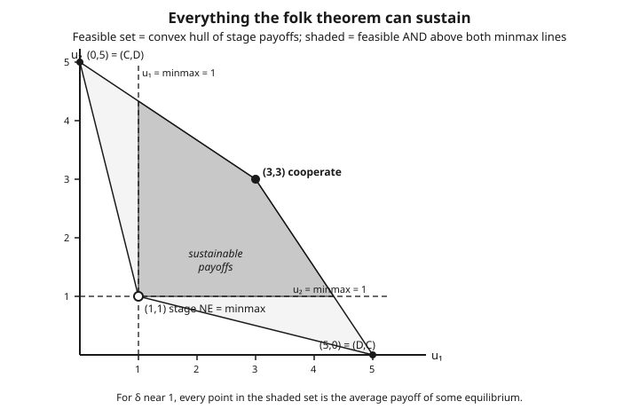

# Grad Game Theory · Lesson 3.4: The folk theorems

> ⏱ ~15 min · Module 3: Dynamic and repeated games · Builds on: [3.3 Repeated games: finite and infinite horizons](03-03-repeated-games-finite-infinite.md) · Unlocks: [3.5 Bargaining](03-05-bargaining.md)

## Why this matters

In [3.3](03-03-repeated-games-finite-infinite.md) you saw one miracle: grim-trigger turns the prisoner's dilemma's lonely defection into cooperation, provided players are patient enough. The folk theorems say that miracle was not special. With patient players, an infinitely repeated game can sustain **almost any outcome you can name** — cooperation, partial cooperation, taking turns exploiting each other, one player extracting everything short of a revolt — all as equilibria. This is the theoretical backbone of repeated cooperation, collusion, and reputation, and it is why economists both love and distrust repeated games: the model can rationalize nearly anything, so "it's an equilibrium" stops being a sharp prediction. The name is a joke that stuck — the result was folklore, known and used before anyone bothered to publish a proof.

## The idea

Two coordinates pin down what a repeated game can and cannot deliver.

**The ceiling: what is even achievable.** Average over the infinite horizon and a player's long-run payoff is some weighted mixture of the stage game's payoff vectors. The set of achievable long-run payoff vectors is therefore the **convex hull** of the stage game's outcome points — every point you can reach by mixing outcomes over time (or by a shared coin flip). That's the *feasible set*.

**The floor: what a player will tolerate.** No strategy in your head forces you to accept less than you can guarantee yourself. Suppose everyone else gangs up to hold you as low as possible, and you respond as well as you can to their assault. The payoff you can still guarantee under that worst case is your **minmax** value. No equilibrium can ever pay you below it — you'd walk away and best-respond instead. Payoffs at or above minmax for *every* player are *individually rational*.

The folk theorem is the marriage of these two: **feasible and above everyone's minmax = sustainable**, once players are patient. The floor and the ceiling fence off a whole region, and patience lets equilibrium reach every point inside. The engine is the threat you already met: deviate, and the others switch to minmaxing you forever. When the future is heavy enough, one round's greedy gain never outweighs an eternity of punishment.

## The formal version

Fix a stage game with players $i = 1,\dots,n$, action sets $A_i$, and payoffs $u_i$. It is played in periods $t = 0,1,2,\dots$; players discount with common factor $\delta \in (0,1)$. Normalize a payoff stream $(u_i^0, u_i^1, \dots)$ to its **average** value

$$U_i = (1-\delta)\sum_{t=0}^{\infty} \delta^{t}\, u_i^{t},$$

so that a constant stream of $c$ per period is worth exactly $c$ (the $(1-\delta)$ cancels $\sum \delta^t = \tfrac{1}{1-\delta}$). *In words: the average payoff rescales the discounted sum so it lives on the same axes as the stage payoffs — you can compare it directly to "cooperate gets 3."*

**Feasible set.**

$$V = \operatorname{conv}\{\, (u_1(a),\dots,u_n(a)) : a \in A \,\},$$

the convex hull of the pure-outcome payoff vectors. *In words: the achievable long-run payoffs are exactly the outcome points and everything between them — you fill the interior by time-averaging or a public coin flip, since a single outcome can only sit at a vertex.*

**Minmax payoff.** For player $i$,

$$\underline{v}_i = \min_{\sigma_{-i}} \ \max_{a_i} \ u_i(a_i, \sigma_{-i}),$$

where $\sigma_{-i}$ ranges over the others' (possibly mixed) strategy profiles. *In words: the others move first, choosing the profile that boxes $i$ in as tightly as possible; then $i$ best-responds. The result is the most the pack can hold $i$ down to — equivalently, the least $i$ can guarantee.* The order matters: **others minimize, then $i$ maximizes.** A payoff vector $v$ is **strictly individually rational** if $v_i > \underline{v}_i$ for all $i$.

**Nash-threat folk theorem.** *For every feasible, strictly individually rational $v \in V$, there is a $\bar\delta < 1$ such that for all $\delta \in (\bar\delta, 1)$, $v$ is the average payoff of a Nash equilibrium of the repeated game.* *In words: pick any payoff above the floor and inside the ceiling; if players are patient enough, some Nash equilibrium delivers it on average.* Construction: play the action path achieving $v$; if anyone ever deviates, all others switch to minmaxing that player **forever**. Patience makes the one-shot gain too small to justify triggering the eternal punishment.

**Subgame-perfect folk theorem (Fudenberg–Maskin, 1986).** *Same conclusion, but for subgame-perfect equilibrium, provided the set of feasible strictly-IR payoffs is full-dimensional (dimension $n$).* *In words: the strong version survives the credibility test — but you need a little room to maneuver in payoff space, and a smarter punishment.*

The catch the SPE version fixes: "minmax them forever" may itself be **non-credible**. Holding player $i$ down can be costly or unappealing for the punishers, so once the moment arrives they'd rather not carry it out — the threat unravels under subgame perfection, exactly the non-credibility [3.2](03-02-backward-induction-subgame-perfection.md) taught you to rule out. Fudenberg–Maskin's fix: minmax the deviator for a **finite** stretch, then switch to a continuation that **rewards the punishers** for having done the dirty work. Full-dimensionality is what guarantees the room to hand each punisher a private bonus without touching the deviator's floor. Now punishing is itself an equilibrium, so the threat is credible.

## Picture

The four stage outcomes of the prisoner's dilemma sit as points; their convex hull is the feasible set. The dashed lines are each player's minmax ($=1$). The shaded quadrilateral — feasible **and** above both minmax lines — is the set of payoffs the folk theorem sustains for $\delta$ near 1. The stage Nash equilibrium $(1,1)$ sits at the corner: it is the worst individually-rational point, and cooperation at $(3,3)$ is only one of a continuum of things repetition can buy.

## Worked examples

**Example 1 (the folk theorem in the prisoner's dilemma — extends Boss Problem 3).** Take the stage game

$$\begin{array}{c|cc} & C & D \\\hline C & 3,3 & 0,5 \\ D & 5,0 & 1,1 \end{array}$$

*Minmax.* Against player 1, player 2 wants to minimize 1's best response. If 2 plays $D$, player 1's best is $\max(0,1)=1$; if 2 plays $C$, it's $\max(3,5)=5$. Player 2 minimizes by playing $D$, giving $\underline{v}_1 = 1$; by symmetry $\underline{v}_2 = 1$. Here minmax coincides with the stage-NE payoff $(1,1)$ — the punishment *is* mutual defection.

*Feasible IR set.* The hull of $(3,3),(0,5),(5,0),(1,1)$, intersected with $\{u_1 \ge 1, u_2 \ge 1\}$ — the shaded region in the picture.

*Sustaining cooperation.* Target $(3,3)$ with grim trigger: play $C$; if anyone plays $D$, switch to $D$ forever. Cooperating is worth $3$ per period. Deviating grabs $5$ once, then $1$ forever:

$$3 \ge (1-\delta)\cdot 5 + \delta \cdot 1 \iff 3 \ge 5 - 4\delta \iff \delta \ge \tfrac{1}{2}.$$

So for $\delta \ge \tfrac12$, $(3,3)$ — a payoff the *stage game can never produce in equilibrium* — is a subgame-perfect equilibrium average.

*The interval (the folk theorem's real punchline).* Any symmetric payoff $(x,x)$ with $1 \le x \le 3$ is sustainable for $\delta$ near 1: use a public coin each period to play $(C,C)$ with probability $p$ and $(D,D)$ otherwise, giving average $3p + 1(1-p) = x$, and back it with grim trigger. As $\delta \to 1$ the whole segment from $(1,1)$ up to $(3,3)$ — indeed the entire shaded region — becomes equilibrium payoffs. One threat, a continuum of outcomes: that is why repetition destroys sharp prediction.

**Example 2 (minmax can require mixing — pure minmax overstates the floor).** Consider player 1's payoffs against player 2:

$$\begin{array}{c|cc} & L & R \\\hline U & 3 & 0 \\ D & 0 & 3 \end{array}$$

a matching-pennies structure for player 1 (1 wants to match 2's "side," 2 wants to mismatch).

*Pure minmax.* If 2 is restricted to pure columns: against $L$, player 1 gets $\max(3,0)=3$; against $R$, $\max(0,3)=3$. Either pure column leaves player 1 able to grab $3$, so the pure-strategy minmax is $3$.

*Mixed minmax.* Let 2 play $L$ with probability $q$. Then $U$ yields $3q$ and $D$ yields $3(1-q)$, so player 1 guarantees $3\max(q,\,1-q)$. Player 2 minimizes this at $q = \tfrac12$:

$$\underline{v}_1 = \min_q 3\max(q, 1-q) = 3 \cdot \tfrac12 = \tfrac{3}{2}.$$

The genuine minmax is $\tfrac32$, **half** the pure-strategy value. By randomizing $50\text{–}50$, player 2 holds player 1 to $\tfrac32$ — something no pure column can do. Consequence: the individually-rational floor sits at $\tfrac32$, not $3$, so the sustainable set is *larger* than the pure calculation suggests. Punishments must be allowed to mix, or you understate the pack's power and wrongly rule out sustainable payoffs.

## Watch out

- **You might think** minmax is $\max_{a_i}\min_{\sigma_{-i}}$, but the order is the reverse: **others minimize first**, then $i$ best-responds ($\min_{\sigma_{-i}}\max_{a_i}$). Swapping the operators is a different (weakly larger) number — the maximin — and it is not the punishment floor.
- **You might think** the pure-action minmax is the real floor, but Example 2 shows the pack may need to **mix** to hold you down. Pure minmax overstates your guarantee, which wrongly shrinks the sustainable set.
- **You might think** minmax equals the stage Nash payoff. In the PD it happens to (both are $1$), but in general the stage NE can pay *more* than minmax — Nash is a mutual best response, minmax is a hostile gang-up. Never conflate "the punishment" with "the equilibrium."
- **You might think** "minmax them forever" is automatically a valid SPE threat. It need not be credible — punishing can hurt the punishers. Subgame perfection demands the reward-phase fix and full-dimensionality; the Nash version has no such worry.
- **You might think** the feasible set is just the finite list of outcome points. It's their **convex hull** — the interior is reachable only with time-averaging or a **public randomization** device, not by any single stage outcome.
- **You might think** the folk theorem predicts cooperation. It predicts **everything** above minmax — a feature (it explains why cooperation is possible) and a bug (it explains almost any behavior, so it predicts almost nothing).

## One-liner

> Feasible (in the convex hull) and individually rational (above every player's minmax) is exactly what patient repetition can sustain — so "it's an equilibrium" becomes an alibi for nearly anything.

## Problems

**P1 (🟢)** In the coordination stage game below, compute each player's minmax value (pure strategies suffice — check that mixing can't do better for the minimizer). Is the "miscoordination" payoff $(0,0)$ individually rational?

$$\begin{array}{c|cc} & L & R \\\hline U & 2,1 & 0,0 \\ D & 0,0 & 1,2 \end{array}$$

**P2 (🟡)** Return to Example 1's prisoner's dilemma ($C,C = 3$; temptation $= 5$; mutual $D = 1$; sucker $= 0$). A player uses grim trigger to sustain cooperation. Find the exact critical discount factor, then say what happens to it if the temptation payoff rises from $5$ to $7$ (everything else fixed). Interpret.

**P3 (🔴, optional)** In the game of Example 2, player 1's payoffs are $\begin{smallmatrix}3&0\\0&3\end{smallmatrix}$ and — to make it a full two-player game — suppose player 2's payoffs are the mirror image $\begin{smallmatrix}0&3\\3&0\end{smallmatrix}$ (2 wants to mismatch). Find each player's minmax value, and explain in one line why "minmax player 1 forever" is an awkward punishment to make subgame-perfect here — connecting to the reward-phase idea.

Solutions

**P1** *Player 1's minmax.* Player 1's payoffs are $\begin{smallmatrix}2&0\\0&1\end{smallmatrix}$. If 2 plays $L$, player 1 best-responds to $\max(2,0)=2$; if 2 plays $R$, $\max(0,1)=1$. Player 2 minimizes by playing $R$, so $\underline{v}_1 = 1$. Could mixing help player 2 push lower? Let 2 play $L$ with probability $q$: player 1 guarantees $\max(2q,\ 1-q)$. At $q=0$ this is $1$; increasing $q$ raises $2q$ and the $\max$ only goes up, so $q=0$ (pure $R$) is already optimal for the minimizer — mixing gives nothing. $\underline{v}_1 = 1$.

*Player 2's minmax.* Player 2's payoffs are $\begin{smallmatrix}1&0\\0&2\end{smallmatrix}$. If 1 plays $U$, 2 best-responds to $\max(1,0)=1$; if 1 plays $D$, $\max(0,2)=2$. Player 1 minimizes by playing $U$, so $\underline{v}_2 = 1$ (again pure is optimal by the same monotonicity check). 

*Is $(0,0)$ individually rational?* No: $0 < 1 = \underline{v}_1$ (and $0 < \underline{v}_2$). Miscoordination pays each player below minmax, so no equilibrium — repeated or not — can average $(0,0)$; either player would deviate to guarantee at least $1$.

**P2** Cooperation is worth $3$ per period. Deviating grabs the temptation $T$ once, then mutual defection ($1$) forever. Grim trigger sustains $C$ iff

$$3 \ge (1-\delta)T + \delta \cdot 1 \iff 3 - 1 \ge (1-\delta)(T-1) \iff \delta \ge 1 - \frac{2}{T-1} = \frac{T-3}{T-1}.$$

At $T=5$: $\delta \ge \tfrac{2}{4} = \tfrac12$. At $T=7$: $\delta \ge \tfrac{4}{6} = \tfrac23$. Raising the temptation raises the bar — cooperation now demands more patience, because the one-shot prize from cheating is bigger and only a heavier weight on the future can offset it.

**P3** *Player 1's minmax.* Exactly Example 2: player 2 mixes $50\text{–}50$ and holds player 1 to $\underline{v}_1 = \tfrac32$. *Player 2's minmax.* Player 2's payoffs are $\begin{smallmatrix}0&3\\3&0\end{smallmatrix}$; by the identical matching-pennies argument, player 1 mixes $50\text{–}50$ to hold player 2 to $\underline{v}_2 = \tfrac32$.

*Why the punishment is awkward.* To minmax player 1, player 2 must randomize $50\text{–}50$ — but that same mixing gives player 2 an expected $\tfrac32$, and 2 is not best-responding to anything in particular; 2 is being *asked* to punish at a cost, with no immediate reason to comply. So "minmax player 1 forever" is not automatically credible: once it's 2's turn to punish, 2 gains nothing from it in the moment. The Fudenberg–Maskin fix is to make the punishment finite and follow it with a phase that pays player 2 a bonus for having carried it out — turning the threat into a genuine subgame-perfect equilibrium (this is precisely where full-dimensionality earns its keep).

## Flashback

**From Lesson 3.3 (Repeated games):** Two firms play an infinitely repeated stage game where colluding (both restrict output) pays each $4$ per period, undercutting the partner pays the cheater $7$ that period, mutual price war (the stage Nash reversion) pays each $2$, and being undercut pays $1$. They use grim trigger to sustain collusion. Find the critical discount factor above which collusion is a subgame-perfect equilibrium.

Solution

Collusion is worth $4$ per period. Deviating grabs $7$ once, then the price-war reversion ($2$) forever. Grim trigger sustains collusion iff

$$4 \ge (1-\delta)\cdot 7 + \delta \cdot 2 \iff 4 \ge 7 - 5\delta \iff 5\delta \ge 3 \iff \delta \ge \tfrac{3}{5}.$$

So for $\delta \ge 0.6$ collusion holds. Note the punishment payoff is the stage-Nash price war ($2$), not the being-undercut sucker payoff ($1$) — the threat is reversion to the static equilibrium, which here is also the minmax. The being-undercut payoff of $1$ never enters the arithmetic; it only describes the off-path victim, not the on-path incentive.

## Connections

- **Backward:** grim-trigger sustaining cooperation in [3.3](03-03-repeated-games-finite-infinite.md) is the folk-theorem construction specialized to a *single* target payoff; this lesson shows that same threat spans an entire region. Non-credible punishments are the [3.2](03-02-backward-induction-subgame-perfection.md) problem resurfacing, which is exactly what the SPE version must handle.
- **Sideways (within course):** minmax is the per-player echo of the zero-sum *value* from [1.4](01-04-zero-sum-minimax-lp-duality.md) — there the two players' minmax and maximin coincide at a single number (von Neumann); here each player has their own minmax floor, and mixed minmax is the same "you may need to randomize to guarantee your value" lesson.
- **Forward:** [3.5 Bargaining](03-05-bargaining.md) confronts exactly the folk theorem's embarrassment of riches — when a whole region is sustainable, *which* point gets chosen? Bargaining theory (Nash's axioms, Rubinstein's alternating offers) is a theory of selection inside the feasible IR set.
- **Sideways (economics):** repeated-oligopoly collusion — sustaining supra-competitive prices by threatening a price war — is the folk theorem in industrial organization; the flashback is its skeleton. See [grad-micro](../../grad-micro/syllabus.md) for the market-structure side, and [game-theory-refresher](../../game-theory-refresher/syllabus.md) for the one-shot dilemma this all repeats.
- Full course map: [syllabus](../syllabus.md).
