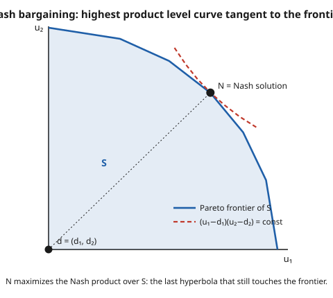

# Grad Game Theory · Lesson 3.5: Bargaining

> ⏱ ~15 min · Module 3: Dynamic and repeated games · Builds on: [3.4 The folk theorems](03-04-folk-theorems.md) · Unlocks: [4.1 Bayesian games and Bayes–Nash equilibrium](04-01-bayesian-games-bayes-nash.md)

## Why this matters

Two firms can merge and split a joint profit; a union and management can divide a surplus; a buyer and seller both gain from trade at any price between cost and value. In every case there is a pie *and* a fight over how to cut it. The folk theorems (3.4) told us that in a repeated game almost *any* division can be an equilibrium — a devastating amount of indeterminacy. Bargaining theory is how we cut through it and predict a *single* split. Remarkably, two completely different methods — one axiomatic, one strategic — give the **same** answer. That agreement is one of the deepest results in the subject.

## The idea

Picture all the utility pairs $(u_1, u_2)$ the two players can jointly achieve — the **feasible set** $S$. If they fail to agree, they fall back to a **disagreement point** $d = (d_1, d_2)$: what each gets by walking away. Bargaining is the question, *which efficient point of $S$ do they land on?*

Two ways to answer.

- **Axiomatic (Nash, 1950).** Don't model the haggling at all. Just write down properties any "reasonable" solution should have — efficiency, fairness, unit-independence — and ask what point they force. Astonishingly, they force *exactly one*: the point that maximizes the product of the two players' gains above disagreement.
- **Strategic (Rubinstein, 1982).** Model the haggling explicitly: players alternate making offers, and delay is costly because future payoffs are discounted. Solve for subgame-perfect equilibrium. There is a unique one, and it has a clean closed form.

The punchline — the **Nash program** — is that as haggling gets frictionless (players become patient), the strategic answer converges to the axiomatic one. The cooperative "fairness" story and the noncooperative "who-can-wait-longer" story describe the same split.

## The formal version

**A bargaining problem** is a pair $(S, d)$ where $S \subset \mathbb{R}^2$ is convex and compact, $d \in S$, and at least one point of $S$ strictly dominates $d$. *In words:* $S$ is the menu of achievable utility pairs (convex because players can randomize over agreements — vNM utilities from [1.5](01-05-expected-utility-vnm-axioms.md) make expected utility linear in the lottery), and $d$ is the fallback if talks collapse.

A **bargaining solution** is a rule $f(S,d) \in S$. Nash asked it to satisfy:

1. **Pareto efficiency (PAR).** No point of $S$ dominates $f(S,d)$. *In words:* leave nothing on the table.
2. **Symmetry (SYM).** If the problem is unchanged by swapping the players ($d_1=d_2$ and $S$ symmetric across the diagonal), then $f_1 = f_2$. *In words:* identical players get identical shares.
3. **Invariance to affine rescaling (INV).** If each $u_i$ is replaced by $a_i u_i + b_i$ with $a_i > 0$, the solution transforms the same way. *In words:* the answer can't depend on whether you measure utility in dollars or cents — legitimate for vNM utilities, which are only defined up to positive affine transforms.
4. **Independence of irrelevant alternatives (IIA).** If $S' \subseteq S$, $d$ unchanged, and $f(S,d) \in S'$, then $f(S',d) = f(S,d)$. *In words:* deleting options that weren't chosen doesn't change the choice.

**Nash's theorem.** There is a *unique* rule satisfying PAR, SYM, INV, IIA, namely the **Nash bargaining solution**

$$f(S,d) = \arg\max_{(u_1,u_2)\in S,\; u\geq d}\ (u_1 - d_1)(u_2 - d_2).$$

*In words:* pick the feasible point that maximizes the **Nash product** — the product of the two gains over disagreement. The **generalized (asymmetric)** version, dropping SYM and inserting a bargaining-power weight $\alpha \in (0,1)$, maximizes $(u_1-d_1)^{\alpha}(u_2-d_2)^{1-\alpha}$.

**Rubinstein alternating offers.** Players split a pie of size 1. In periods $t=0,1,2,\dots$ they alternate: player 1 proposes in even periods, player 2 in odd periods; the responder accepts (game ends) or rejects (next period, roles flip). A share received $t$ periods from now is worth $\delta_i^{t}$ times its face value, with discount factors $\delta_i \in (0,1)$. This infinite-horizon game has a **unique subgame-perfect equilibrium** (proof via the one-shot deviation principle of [3.2](03-02-backward-induction-subgame-perfection.md)), in which agreement is *immediate* and player 1 (moving first) receives

$$x_1^* = \frac{1-\delta_2}{1-\delta_1\delta_2}.$$

*In words:* no delay ever occurs, and your share is set by how badly *the other player* dreads waiting. As $\delta_1,\delta_2 \to 1$ this tends to $\tfrac12$ — the symmetric Nash solution of splitting the pie.

## Picture

The dashed curves are level sets of the Nash product $(u_1-d_1)(u_2-d_2)$ — rectangular hyperbolas centered at $d$. Bigger product means further out toward the top-right. The solution $N$ sits where the *last* hyperbola that still touches $S$ kisses the frontier: the tangency point.

## Worked examples

**Example 1 (Nash bargaining on a linear frontier).** A pie of size 1 with efficient frontier $u_1 + u_2 = 1$ and disagreement point $d = (d_1, d_2)$ (with $d_1 + d_2 < 1$). Substitute $u_2 = 1 - u_1$ into the Nash product:

$$g(u_1) = (u_1 - d_1)(1 - u_1 - d_2).$$

Differentiate and set to zero:

$$g'(u_1) = (1 - u_1 - d_2) - (u_1 - d_1) = 1 - 2u_1 - d_2 + d_1 = 0 \implies u_1^* = \frac{1 + d_1 - d_2}{2}.$$

Rewrite it to see the meaning. Let the **surplus** be $\sigma = 1 - d_1 - d_2$ (what agreement creates over disagreement). Then

$$u_1^* = d_1 + \tfrac12\sigma, \qquad u_2^* = d_2 + \tfrac12\sigma.$$

**Each player keeps their disagreement value, then splits the leftover surplus 50–50.** With $d=(0,0)$: $(1/2, 1/2)$. With $d = (0.4, 0)$: $u_1^* = 0.4 + \tfrac12(0.6) = 0.7$, so a better outside option turns into a bigger slice.

*Generalized version.* Maximize $(u_1-d_1)^{\alpha}(u_2-d_2)^{1-\alpha}$ on the same frontier. Taking logs turns the product into a sum; with $u_2 = 1-u_1$,

$$\frac{d}{du_1}\Big[\alpha\ln(u_1-d_1) + (1-\alpha)\ln(1-u_1-d_2)\Big] = \frac{\alpha}{u_1-d_1} - \frac{1-\alpha}{u_2-d_2} = 0,$$

so the gains split in the power ratio, $\alpha(u_2 - d_2) = (1-\alpha)(u_1 - d_1)$. Solving with $u_2 = 1-u_1$ gives

$$u_1^* = d_1 + \alpha\,\sigma.$$

Player 1 grabs fraction $\alpha$ of the surplus; $\alpha = \tfrac12$ recovers the symmetric answer.

**Example 2 (Rubinstein — the stationary equations).** Let $v_1$ be player 1's equilibrium payoff *when it is player 1's turn to propose*, and $v_2$ player 2's payoff *when it is player 2's turn to propose*. The equilibrium is stationary: a proposer offers the responder exactly the responder's continuation value and keeps the rest.

- When **1 proposes**, player 2's continuation from rejecting is "become proposer next period," worth $\delta_2 v_2$ today. So 1 offers 2 exactly $\delta_2 v_2$ and keeps the rest: $\;v_1 = 1 - \delta_2 v_2.$
- Symmetrically, $\;v_2 = 1 - \delta_1 v_1.$

Substitute the second into the first:

$$v_1 = 1 - \delta_2(1 - \delta_1 v_1) = 1 - \delta_2 + \delta_1\delta_2\, v_1 \implies v_1(1 - \delta_1\delta_2) = 1 - \delta_2,$$

$$\boxed{\,v_1 = \frac{1-\delta_2}{1-\delta_1\delta_2}, \qquad v_2 = \frac{1-\delta_1}{1-\delta_1\delta_2}.\,}$$

*One-shot deviation check.* Fix the candidate strategies: every proposer demands their $v_i$ (offering the other exactly their discounted continuation), every responder accepts any offer $\geq$ their continuation value. Consider player 1 as proposer. Demanding *more* than $v_1$ means offering player 2 below $\delta_2 v_2$; player 2 rejects, and next period player 1 is the responder, collecting $\delta_1 v_1 < v_1$ — a loss. Demanding *less* obviously loses. As responder, player 1 is offered exactly their continuation value and is indifferent, so accepting is optimal. No single deviation pays, so by the one-shot deviation principle ([3.2](03-02-backward-induction-subgame-perfection.md)) these strategies form an SPE — and one can show it is the *only* one.

*The $\delta \to 1$ limit (the Nash program).* Take a common $\delta_1=\delta_2=\delta$:

$$v_1 = \frac{1-\delta}{1-\delta^2} = \frac{1-\delta}{(1-\delta)(1+\delta)} = \frac{1}{1+\delta} \xrightarrow[\delta\to 1]{} \frac12.$$

The split approaches $(1/2, 1/2)$ — exactly the symmetric Nash bargaining solution over the pie ($d=(0,0)$, frontier $u_1+u_2=1$). More finely, let $\delta_i = e^{-r_i\Delta}$ (discount rate $r_i$, period length $\Delta$). As $\Delta \to 0$, $1-\delta_i \approx r_i\Delta$ and $1-\delta_1\delta_2 \approx (r_1+r_2)\Delta$, so

$$v_1 \to \frac{r_2}{r_1 + r_2}.$$

The strategic split becomes the *generalized* Nash solution with $\alpha = r_2/(r_1+r_2)$: the more patient player (smaller $r$) gets the larger share, and relative patience *is* the bargaining power $\alpha$. Two theories, one number.

## Watch out

- **The disagreement point is not a technicality — it is half the answer.** Example 1 showed $u_1^* = d_1 + \tfrac12\sigma$: raising $d_1$ raises your share dollar-for-dollar. "Bargaining" is mostly a fight over whose walk-away threat is scarier, not an even split of the whole pie. (Distinguish $d$ from an *outside option* — a payoff a player can grab by opting out *mid-game*. An outside option only bites when it exceeds the Rubinstein continuation value; below that threshold it's irrelevant, unlike $d$, which always matters.)
- **IIA is the controversial axiom.** PAR, SYM, INV are hard to argue with; IIA — "deleting unchosen options changes nothing" — is what pins down the *product*. Drop it and you get a different theory: **Kalai–Smorodinsky** replaces IIA with a monotonicity axiom (expanding the pie in your favor can't hurt you) and selects the point where the segment from $d$ to the "ideal" point meets the frontier. Different axiom, different split.
- **First-mover advantage is real but vanishes with patience.** At $\delta$ near 1, $v_1 = 1/(1+\delta) \to 1/2$; the edge from proposing first evaporates as delay becomes cheap. Don't over-read the asymmetry in $x_1^*$ — it's a friction effect.
- **Affine invariance means utility units are meaningless.** You cannot say "player 1 values the pie more, so give them more" by comparing raw utilities across people — INV forbids it. Interpersonal comparison enters only through $\alpha$ (or through the disagreement point), never through the scale of $u_i$.

## One-liner

> Split the surplus above disagreement in proportion to bargaining power — and whether you get there by Nash's fairness axioms or Rubinstein's patience contest, you land on the same point.

## Problems

**P1 (🟢)** A pie of size 1 with frontier $u_1 + u_2 = 1$ and disagreement point $d = (0.2, 0.4)$. Find the (symmetric) Nash bargaining split. Who does better, and why?

**P2 (🟡)** Rubinstein alternating offers with $\delta_1 = 0.8$, $\delta_2 = 0.5$. (a) Find player 1's share when player 1 proposes first. (b) Find what player 1 gets if instead player 2 proposes first. (c) Does patience or moving first matter more here?

**P3 (🔴, optional)** A *nonlinear* frontier: $S = \{(u_1,u_2): u_2 \le 1 - u_1^2,\ u_1,u_2\ge 0\}$, disagreement $d=(0,0)$. Find the Nash bargaining solution and confirm geometrically that a Nash-product level curve is tangent to the frontier there.

Solutions

**P1** Surplus $\sigma = 1 - 0.2 - 0.4 = 0.4$. Symmetric Nash gives each their disagreement value plus half the surplus:
$$u_1^* = 0.2 + \tfrac12(0.4) = 0.4, \qquad u_2^* = 0.4 + \tfrac12(0.4) = 0.6.$$
Player 2 does better ($0.6$ vs $0.4$) purely because of a stronger fallback ($d_2 = 0.4 > d_1 = 0.2$): the surplus is split evenly, but player 2 starts from a higher floor. The split ratio is $0.4:0.6$, *not* $0.2:0.4$ — the pie above disagreement is what's shared equally.

**P2** Using $v_1 = \dfrac{1-\delta_2}{1-\delta_1\delta_2}$ and $\delta_1\delta_2 = 0.8\cdot 0.5 = 0.4$:

(a) Player 1 proposes first:
$$v_1 = \frac{1 - 0.5}{1 - 0.4} = \frac{0.5}{0.6} = \frac{5}{6} \approx 0.833.$$

(b) If player 2 proposes first, player 1 is the responder in period 0. Player 2 as proposer keeps $v_2 = \dfrac{1-\delta_1}{1-\delta_1\delta_2} = \dfrac{0.2}{0.6} = \dfrac13$, offering player 1 the rest. That offer must equal player 1's continuation value $\delta_1 v_1 = 0.8 \cdot \tfrac56 = \tfrac{2}{3}$. Indeed $1 - \tfrac13 = \tfrac23$. So player 1 gets $\tfrac23 \approx 0.667$.

(c) Player 1 gets $5/6$ moving first and still $2/3$ moving second — a majority *either way*. The reason is patience: $\delta_1 = 0.8 \gg \delta_2 = 0.5$, so player 2 dreads delay and concedes. Here patience dominates the first-mover effect (which only moves player 1 from $2/3$ to $5/6$).

**P3** Maximize the Nash product on the frontier $u_2 = 1 - u_1^2$ with $d=(0,0)$:
$$P(u_1) = u_1\,(1 - u_1^2) = u_1 - u_1^3, \qquad P'(u_1) = 1 - 3u_1^2 = 0 \implies u_1^* = \frac{1}{\sqrt 3}.$$
Then $u_2^* = 1 - \tfrac13 = \tfrac23$, and the maximal product is $P = \tfrac{1}{\sqrt3}\cdot\tfrac23 = \dfrac{2}{3\sqrt3}$.

Tangency check: the level curve $u_1 u_2 = c$ has slope $\dfrac{du_2}{du_1} = -\dfrac{u_2}{u_1}$; the frontier $u_2 = 1-u_1^2$ has slope $-2u_1$. At $u_1^* = 1/\sqrt3$: frontier slope $= -2/\sqrt3$, and level-curve slope $= -\dfrac{2/3}{1/\sqrt3} = -\dfrac{2}{3}\sqrt3 = -\dfrac{2}{\sqrt3}$. Equal — the hyperbola is tangent to the frontier at the solution, exactly as the Picture shows. ✓

## Flashback

**From Lesson 3.2 (Subgame perfection & backward induction):** A *finite*, three-round alternating-offers game over a pie of size 1, common discount factor $\delta$. Player 1 proposes in round 1, player 2 in round 2, player 1 in round 3; if round 3 is rejected both get 0. Solve by backward induction for player 1's round-1 share, and evaluate at $\delta = 0.9$.

Solution

Work backward from the last round.

- **Round 3** (player 1 proposes, last chance): player 2's rejection yields 0, so player 1 offers player 2 nothing and keeps the whole pie. Player 1's round-3 value $= 1$.
- **Round 2** (player 2 proposes): player 1's continuation from rejecting is $\delta \cdot 1 = \delta$ (round-3 value discounted one period). So player 2 offers player 1 exactly $\delta$ and keeps $1 - \delta$. Player 2's round-2 value $= 1 - \delta$.
- **Round 1** (player 1 proposes): player 2's continuation from rejecting is $\delta(1-\delta)$. Player 1 offers player 2 exactly that and keeps
$$x_1 = 1 - \delta(1-\delta) = 1 - \delta + \delta^2.$$

At $\delta = 0.9$: $x_1 = 1 - 0.9 + 0.81 = 0.91$, leaving player 2 with $0.09$. Being the *last* proposer in a finite horizon is powerful; note that as the horizon grows this alternating sum $1-\delta+\delta^2-\cdots$ converges to $\dfrac{1}{1+\delta}$, exactly the infinite-horizon Rubinstein share — the finite game marching toward the stationary one.

## Connections

- **Backward:** the Rubinstein SPE is [3.2](03-02-backward-induction-subgame-perfection.md)'s one-shot deviation principle applied to an infinite tree; the finite-horizon flashback is its backward-induction skeleton. The convexity of $S$ rests on the vNM utilities of [1.5](01-05-expected-utility-vnm-axioms.md) — and INV is precisely their affine non-uniqueness made into an axiom.
- **Forward:** bargaining is the natural *selection device* among the [3.4](03-04-folk-theorems.md) folk-theorem payoffs — of the continuum of sustainable divisions, which one do rational negotiators reach? The deeper unification, that cooperative axioms and noncooperative equilibrium coincide, is the **Nash program**, revisited in [6.5](06-05-learning-nash-program.md).
- **Sideways (grad-micro):** this is the engine behind the Coase theorem and cooperative surplus-division — bargaining over gains from trade, wage-setting, and joint-venture profit splits all run on $(S,d)$ and the Nash product. See [grad-micro](../../grad-micro/syllabus.md). For the cooperative-game vocabulary (core, Shapley value) that sits alongside this, see [game-theory-refresher](../../game-theory-refresher/syllabus.md).
- [Course syllabus](../syllabus.md)
