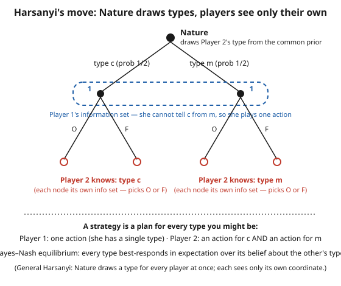

# Grad Game Theory · Lesson 4.1: Bayesian games and Bayes–Nash equilibrium

> ⏱ ~15 min · Module 4: Games of incomplete information · Builds on: [3.5 Bargaining](03-05-bargaining.md) · Unlocks: [4.2 Auctions and equilibrium bidding](04-02-auctions-equilibrium-bidding.md)

## Why this matters

Everything in Modules 1–3 assumed the game itself was common knowledge: everyone knew everyone's payoffs. But the situations that actually pay the rent break that assumption. A bidder doesn't know how much the painting is worth to the person sitting next to her. A firm doesn't know its rival's true cost. A lender doesn't know whether the borrower is safe or reckless. This is **incomplete information** — uncertainty not about what others will *do*, but about *who they are*. Harsanyi's Nobel-winning trick tames it: convert "I don't know your payoffs" into "I don't know which of several possible opponents Nature handed me," and suddenly the whole existence-and-equilibrium machine of Module 2 applies verbatim. This lesson builds that bridge; [4.2 Auctions](04-02-auctions-equilibrium-bidding.md) drives across it.

## The idea

Suppose you're playing against someone whose payoffs you don't know — maybe they're a tough competitor, maybe a soft one. You can't solve a game you can't even write down. Harsanyi's move is to *invent a first move by Nature*: before anyone acts, a fictitious referee draws each player's **type** — a full description of that player's payoffs — from a probability distribution everyone agrees on in advance (the **common prior**). Each player is then told their *own* type, but not the others'. Your ignorance about your opponent is now ordinary probabilistic uncertainty about a random draw you didn't see.

Two consequences reshape how you plan. First, a **strategy is no longer a single action** — it's a *contingency plan*, one action for each type you might turn out to be, because you must decide what to do before you know how the world's other draws will interact with yours. Your opponent, watching, has to reason about *all* your possible types at once. Second, "best response" now means **best in expectation**: knowing only your own type, you weight your opponent's possible types by the beliefs you get from conditioning the common prior on what you learned, and maximize your *average* payoff. A **Bayes–Nash equilibrium** is just a Nash equilibrium of this enlarged game — a profile of contingency plans where *every type of every player* is already best-responding to everyone else's plan. Nothing new under the hood: it's Nash, taken one type at a time.

## The formal version

**Bayesian game.** A (finite) Bayesian game is a tuple
$$\Gamma = \big(N,\ \{\Theta_i\}_{i\in N},\ p,\ \{A_i\}_{i\in N},\ \{u_i\}_{i\in N}\big),$$
where $N=\{1,\dots,n\}$ is the players; $\Theta_i$ is player $i$'s finite set of **types** and $\Theta=\Theta_1\times\cdots\times\Theta_n$ the type profiles; $p\in\Delta(\Theta)$ is the **common prior**, a probability distribution over type profiles; $A_i$ is $i$'s action set; and $u_i(a,\theta)$ is $i$'s payoff when the action profile is $a=(a_1,\dots,a_n)$ and the type profile is $\theta=(\theta_1,\dots,\theta_n)$.

*In words:* Nature draws a whole profile of types $\theta$ from $p$; player $i$ is privately told $\theta_i$; then everyone acts; payoffs can depend on all actions and all types.

**Beliefs (the posterior).** After learning $\theta_i$, player $i$ updates by Bayes' rule to a belief over the others' types $\theta_{-i}=(\theta_j)_{j\ne i}$:
$$p(\theta_{-i}\mid\theta_i)=\frac{p(\theta_i,\theta_{-i})}{\sum_{\theta_{-i}'}\,p(\theta_i,\theta_{-i}')}.$$
*In words:* condition the shared prior on your own type. If types are drawn **independently**, this collapses to the others' marginal distribution — learning your own type tells you nothing about theirs; if types are **correlated**, your own draw is informative about the rest.

**Strategy.** A (pure) strategy for player $i$ is a function $s_i:\Theta_i\to A_i$. Write $s_{-i}=(s_j)_{j\ne i}$.

*In words:* a strategy is a plan that specifies an action for **every** type $i$ could be — not one action, but a lookup table indexed by type.

**Bayes–Nash equilibrium (BNE).** A profile $s^*=(s_1^*,\dots,s_n^*)$ is a Bayes–Nash equilibrium if for every player $i$ and every type $\theta_i$ with $p(\theta_i)>0$,
$$s_i^*(\theta_i)\ \in\ \operatorname*{arg\,max}_{a_i\in A_i}\ \sum_{\theta_{-i}}\ p(\theta_{-i}\mid\theta_i)\; u_i\big(a_i,\,s_{-i}^*(\theta_{-i}),\,(\theta_i,\theta_{-i})\big).$$
*In words:* fix everyone else's contingency plans; then each of your types, using its own posterior beliefs, picks the action that maximizes its **expected** payoff — and no type of any player wants to change. A Nash equilibrium, checked type by type.

**Three vantage points.** The same equilibrium can be scored at three stages: **ex ante** (before Nature moves, averaging over your own type too), **interim** (after you learn $\theta_i$ but before others act — the belief above, and the standard stage at which BNE is stated), and **ex post** (after all types are revealed). The interim condition is the operative one: it must hold for *each* type separately, which is strictly stronger than merely doing well on average.

**Why this is just Nash.** With finitely many types, a strategy $s_i$ is a finite object (one action per type), so we can treat "player $i$ of type $\theta_i$" as a *separate agent*. The result is an ordinary finite normal-form game — the **agent-normal form** — over type-contingent plans, and a BNE is exactly a Nash equilibrium of it. So Nash's existence theorem ([2.3](02-03-existence-of-nash-equilibrium.md), via Kakutani) hands us existence of a BNE in mixed strategies for free.

## Picture

## Worked examples

**Example 1 — a $2\times 2$ Bayesian game (Battle of the Sexes with a private mood).**
Players 1 and 2 each choose Opera ($O$) or Fight ($F$). Player 1 has no private information and always wants to *match* Player 2, preferring to match on $O$:
$$u_1(O,O)=2,\quad u_1(F,F)=1,\quad u_1(O,F)=u_1(F,O)=0.$$
Player 2 has a private type, drawn with equal probability: type $c$ (**c**oordinate — wants to match, but prefers matching on $F$) or type $m$ (**m**ismatch — wants to avoid Player 1):
$$
\underbrace{u_2(O,O;c)=1,\ u_2(F,F;c)=2,\ \text{mismatch}=0}_{\text{type }c},\qquad
\underbrace{u_2(O,F;m)=2,\ u_2(F,O;m)=1,\ \text{match}=0}_{\text{type }m}.
$$
Player 1 knows the 50/50 split but not the realized type. Player 2's strategy is a pair $\big(s_2(c),s_2(m)\big)$; Player 1's is a single action.

*Solve type by type, then check consistency.* Guess Player 1 plays $O$.
- Type $c$ (wants to match $O$): matching gives $u_2(O,O;c)=1$; playing $F$ against $O$ mismatches, giving $0$. Best response: $s_2(c)=O$.
- Type $m$ (wants to mismatch): matching $(O,O)$ gives $0$; playing $F$ against $O$ mismatches, giving $u_2(O,F;m)=2$. Best response: $s_2(m)=F$.

Now verify Player 1. Facing $s_2=(O\text{ if }c,\ F\text{ if }m)$, she meets $O$ with prob $\tfrac12$ and $F$ with prob $\tfrac12$:
$$\mathbb{E}[u_1(O)]=\tfrac12(2)+\tfrac12(0)=1,\qquad \mathbb{E}[u_1(F)]=\tfrac12(0)+\tfrac12(1)=\tfrac12.$$
So $O$ is optimal — the guess is consistent. The **Bayes–Nash equilibrium** is
$$s_1^*=O,\qquad s_2^*=(O\text{ if type }c,\ F\text{ if type }m),$$
with Player 1's expected payoff $1$. Notice neither of Player 2's types has a dominant action (each depends on Player 1's move), so this genuinely required the interim best-response-plus-consistency loop, not a shortcut.

**Example 2 — Bayesian Cournot (a firm with private cost).**
Two firms choose quantities $q_1,q_2\ge 0$; the market price is $P=a-q_1-q_2$. Firm 1's marginal cost is a known constant $c$. Firm 2's cost is **private**: it is $c_L$ with probability $\tfrac12$ and $c_H$ with probability $\tfrac12$ (with $c_L<c_H$), known only to Firm 2. Firm 1 knows only the distribution. A strategy for Firm 2 is a quantity per type, $\big(q_2(L),q_2(H)\big)$; for Firm 1 it is a single quantity $q_1$.

*Firm 2, interim (knows its own cost $c_t$, takes $q_1$ as given):*
$$q_2(t)=\operatorname*{arg\,max}_{q\ge 0}\ (a-q_1-q-c_t)\,q \;\Longrightarrow\; q_2(t)=\frac{a-q_1-c_t}{2},\qquad t\in\{L,H\}.$$
*Firm 1 maximizes expected profit* (it faces $q_2(L)$ or $q_2(H)$, each with prob $\tfrac12$), and profit is linear in $q_2$, so only the mean quantity matters:
$$q_1=\operatorname*{arg\,max}_{q\ge 0}\ \big(a-q-\mathbb{E}[q_2]-c\big)\,q \;\Longrightarrow\; q_1=\frac{a-\mathbb{E}[q_2]-c}{2},\quad \mathbb{E}[q_2]=\tfrac12 q_2(L)+\tfrac12 q_2(H).$$
Substitute the type responses. With $\bar c=\tfrac12 c_L+\tfrac12 c_H$ the *average* cost, $\mathbb{E}[q_2]=\tfrac{a-q_1-\bar c}{2}$, so
$$q_1=\frac{a-c-\tfrac{a-q_1-\bar c}{2}}{2}\ \Longrightarrow\ 4q_1=2a-2c-a+q_1+\bar c\ \Longrightarrow\ \boxed{q_1=\frac{a-2c+\bar c}{3}},$$
and back-substituting,
$$q_2(t)=\frac{a-q_1-c_t}{2}=\frac{2a-3c_t+2c-\bar c}{6}.$$
*Read it off:* Firm 1 cannot tune its output to Firm 2's realized cost — only to the *average* $\bar c$, so it produces exactly what it would against a rival of known cost $\bar c$. The low-cost type of Firm 2 exploits this by producing more than the high-cost type. Concretely, with $a=12,\ c=3,\ c_L=2,\ c_H=4$ (so $\bar c=3$):
$$q_1=\frac{12-6+3}{3}=3,\qquad q_2(L)=\frac{12-3-2}{2}=3.5,\qquad q_2(H)=\frac{12-3-4}{2}=2.5.$$
Check: $\mathbb{E}[q_2]=3$, and $q_1=(12-3-3)/2=3$ ✓. This private-information structure is exactly what auction bidding in [4.2](04-02-auctions-equilibrium-bidding.md) generalizes.

## Watch out

- **A strategy is not an action.** You might think "Player 2 plays $F$"; but Player 2's strategy is the *whole table* $(s_2(c),s_2(m))$. Two types, two entries. With $k$ types and $|A|$ actions a player has $|A|^k$ pure strategies — the game blows up combinatorially, which is why we solve type by type.
- **Best response is in expectation over the posterior, not against a fixed opponent action.** Each type maximizes $\sum_{\theta_{-i}}p(\theta_{-i}\mid\theta_i)\,u_i(\cdots)$. Forgetting to weight by beliefs — or using the prior instead of the *conditional* when types are correlated — is the classic error.
- **The interim condition binds type by type.** "This plan is good on average across my types" is *not* enough; the equilibrium requires each type $\theta_i$ (with positive probability) to be separately optimal. Averaging over your own type is the ex-ante view, and it is weaker.
- **The common prior is an assumption, not a law.** Harsanyi posits that players start from the *same* distribution $p$ and merely condition differently on private draws. It's a clean modeling device, but it rules out players who simply disagree about the odds — the reason "common prior" is a named, and debated, hypothesis.

## One-liner

> Incomplete information becomes ordinary uncertainty once Nature draws the types: a strategy is a plan for every type you might be, and Bayes–Nash equilibrium is plain Nash with each type best-responding in expectation over its beliefs.

## Problems

**P1 (🟢)** Player 1 (no private info) chooses $T$ or $B$. Player 2 has a private type, $H$ with prob $\tfrac12$ and $L$ with prob $\tfrac12$; for type $H$ the action $R$ is strictly dominant, and for type $L$ the action $L$ is strictly dominant. Player 1's payoffs are $u_1(T,L)=2,\ u_1(T,R)=3,\ u_1(B,L)=4,\ u_1(B,R)=0$. (a) Write Player 2's equilibrium strategy as a function of type. (b) Compute Player 1's expected payoff to each of $T,B$ and give her best response. (c) State the Bayes–Nash equilibrium.

**P2 (🟡)** Redo the Bayesian Cournot of Example 2, but with Firm 2's cost equal to $c_L$ with probability $\theta$ and $c_H$ with probability $1-\theta$. Find Firm 1's equilibrium quantity $q_1$ in terms of $\bar c=\theta c_L+(1-\theta)c_H$, and confirm it reduces to the Example-2 answer at $\theta=\tfrac12$. What single number about Firm 2 does Firm 1's output depend on, and why only that one?

**P3 (🔴, optional — previews [4.2](04-02-auctions-equilibrium-bidding.md))** In a sealed-bid *second-price* (Vickrey) auction, your value $v$ for the object is private; the high bidder wins and pays the *second*-highest bid. Let $m$ be the highest bid among your rivals. Show that bidding your true value, $b=v$, is a **weakly dominant** strategy — for any $m$, neither shading down ($b<v$) nor inflating ($b>v$) can do better. Why does this make the prior over others' types irrelevant to your optimal bid?

Solutions

**P1** (a) Each type plays its dominant action regardless of Player 1: $s_2(H)=R,\ s_2(L)=L$. So Player 1 meets $L$ with prob $\tfrac12$ (from type $L$) and $R$ with prob $\tfrac12$ (from type $H$).
(b) $\mathbb{E}[u_1(T)]=\tfrac12 u_1(T,L)+\tfrac12 u_1(T,R)=\tfrac12(2)+\tfrac12(3)=2.5$; $\mathbb{E}[u_1(B)]=\tfrac12(4)+\tfrac12(0)=2$. Since $2.5>2$, Player 1's best response is $T$.
(c) BNE: $s_1^*=T$, $s_2^*=(R\text{ if }H,\ L\text{ if }L)$. (Player 1 optimizes against the *average* opponent, since $B$'s big payoff of $4$ only materializes against type $L$, which shows up just half the time.)

**P2** Firm 2's interim best responses are unchanged: $q_2(t)=(a-q_1-c_t)/2$. Firm 1 maximizes $(a-q-\mathbb{E}[q_2]-c)q$ with $\mathbb{E}[q_2]=\theta q_2(L)+(1-\theta)q_2(H)=\tfrac{a-q_1-\bar c}{2}$, where $\bar c=\theta c_L+(1-\theta)c_H$. This is *algebraically identical* to Example 2 with the mean cost $\bar c$, so
$$q_1=\frac{a-c-\tfrac{a-q_1-\bar c}{2}}{2}\ \Longrightarrow\ q_1=\frac{a-2c+\bar c}{3}.$$
At $\theta=\tfrac12$, $\bar c=\tfrac12(c_L+c_H)$, recovering Example 2. Firm 1's output depends on Firm 2 **only through the expected cost $\bar c$** — because profit $(a-q_1-q_2-c)q_1$ is *linear* in the unknown $q_2$, so by linearity of expectation only $\mathbb{E}[q_2]$ enters, and that depends on the type distribution only through its mean. (This is special to the linear model; with nonlinear payoffs the whole distribution would matter.)

**P3** Fix all rivals' bids, and let $m$ be the highest of them; your bid $b$ wins iff $b>m$ (ties aside), and if you win you pay $m$, netting surplus $v-m$; if you lose you net $0$. Compare bidding $b=v$ against any alternative $b'$:
- *Shade down, $b'<v$.* Outcomes differ from truthful only when $b'<m<v$: truthful bidding wins and nets $v-m>0$, while $b'$ loses and nets $0$. So shading is weakly worse, never better.
- *Inflate, $b'>v$.* Outcomes differ only when $v<m<b'$: $b'$ wins but pays $m>v$, netting $v-m<0$, while truthful bidding loses and nets $0$. So inflating is weakly worse.
In every other case the two bids yield the identical outcome. Hence $b=v$ weakly dominates every alternative — for *any* configuration of rivals' bids. Because the argument never used the distribution of $m$ (i.e., others' types/values), truth-telling is optimal type-by-type and even ex post: the prior is irrelevant. This makes truthful bidding a *dominant-strategy* equilibrium, a far stronger property than generic BNE, and it's the anchor of the auction theory in [4.2](04-02-auctions-equilibrium-bidding.md).

## Flashback

**From Lesson 2.2 (Nash equilibrium and mixed strategies):** Two firms simultaneously choose a technology standard, $A$ or $B$; they gain only by coordinating. Payoffs $(u_1,u_2)$ are $(A,A)=(3,1)$, $(B,B)=(1,2)$, and $(0,0)$ if they mismatch. Beyond the two pure equilibria, find the **mixed-strategy** Nash equilibrium.

Solution

Let Player 1 play $A$ with probability $p$ and Player 2 play $A$ with probability $q$. Use the indifference principle: each player's mixing probability is set to make the *other* indifferent.
- Player 2 indifferent between $A$ and $B$: $u_2(A)=p\cdot 1+(1-p)\cdot 0=p$; $u_2(B)=p\cdot 0+(1-p)\cdot 2=2(1-p)$. Set equal: $p=2(1-p)\Rightarrow p=\tfrac23$.
- Player 1 indifferent between $A$ and $B$: $u_1(A)=q\cdot 3+(1-q)\cdot 0=3q$; $u_1(B)=q\cdot 0+(1-q)\cdot 1=1-q$. Set equal: $3q=1-q\Rightarrow q=\tfrac14$.

Mixed NE: Player 1 plays $A$ with prob $\tfrac23$, Player 2 plays $A$ with prob $\tfrac14$. (As always, your own probabilities keep your *opponent* indifferent — the same cross-wiring you'll now see reappear as each *type* best-responding in a Bayesian game.) The two pure equilibria $(A,A)$ and $(B,B)$ round out the equilibrium set.

## Connections

- **Backward:** BNE *is* Nash equilibrium ([2.2](02-02-nash-equilibrium-mixed-strategies.md)) of the agent-normal form, so existence comes straight from Nash's theorem ([2.3](02-03-existence-of-nash-equilibrium.md)); the "maximize expected payoff over types" step is the expected-utility calculus of [1.5](01-05-expected-utility-vnm-axioms.md) applied to Nature's lottery over types.
- **Forward:** [4.2 Auctions](04-02-auctions-equilibrium-bidding.md) is the flagship Bayesian game (private values = private types); adding *sequential* structure and off-path beliefs turns BNE into perfect Bayesian / sequential equilibrium in [4.4](04-04-perfect-bayesian-sequential-equilibrium.md); and the mechanism design of Module 5 ([syllabus](../syllabus.md)) is about *designing* the game so that eliciting types truthfully is itself a Bayes–Nash (or dominant-strategy) equilibrium.
- **Sideways (grad-micro):** private-cost Cournot is the textbook bridge to screening and adverse selection — hidden *types* driving strategic behavior — in [grad-micro](../../grad-micro/syllabus.md).
- **Sideways (probability):** the whole apparatus is conditioning on a signal — priors, posteriors, and independence-vs-correlation of types — straight out of [probability-theory](../../probability-theory/syllabus.md); the common-prior assumption is exactly what lets everyone start from one distribution and split only on private information.
