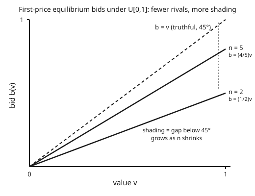

# Grad Game Theory · Lesson 4.2: Auctions and equilibrium bidding

> ⏱ ~15 min · Module 4: Games of incomplete information · Builds on: [4.1 Bayesian games and Bayes–Nash equilibrium](04-01-bayesian-games-bayes-nash.md) · Unlocks: [4.3 The revenue equivalence theorem](04-03-revenue-equivalence-theorem.md)

## Why this matters

An auction is the cleanest Bayesian game there is: each bidder knows exactly one number nobody else knows — their own value — and must turn it into a bid. It is where mechanism design was born, where Vickrey won a Nobel, and where the abstract machinery of 4.1 pays off in a formula you can actually compute. Two questions organize everything: *should you bid your true value?* and *if not, how much should you shave off?* The answers are format-dependent, and the surprise (saved for 4.3) is that despite bidding wildly differently across formats, the seller earns the same on average.

## The idea

Set the stage — **independent private values (IPV)**. There are $n$ bidders. Bidder $i$'s value for the good, $v_i$, is drawn independently from a distribution $F$ on $[0,1]$; each bidder sees only their own draw. "Private" means my value tells me nothing about yours; "independent" means the draws don't move together. One good, highest useful bid wins.

Four canonical formats, but they collapse into two strategic pairs:

- **Second-price (Vickrey), sealed bid:** submit a bid, highest wins, pays the *second*-highest bid. Strategically equivalent to the **English (ascending)** auction — dropping out when the price passes your value is the same as naming your value once.
- **First-price, sealed bid:** highest wins, pays *their own* bid. Strategically equivalent to the **Dutch (descending)** auction — the price ticks down and the moment you shout "mine" is the moment you commit to a number, with no new information gained on the way.

The whole lesson is two facts. In a **second-price** auction, bid your value — full stop, no beliefs required. In a **first-price** auction, you pay what you bid, so bidding your value would guarantee zero profit; you must **shade** below it, and exactly how much depends on how many rivals you face.

The intuition for shading: your bid is a tradeoff. Bid higher → win more often but pocket less when you win. Bid lower → win rarely but richly. The equilibrium shade balances these, and it hinges on how much competition you expect — with many rivals you dare not shade much, with few you shade hard.

## The formal version

**Second-price: truthful bidding is weakly dominant.** In a second-price auction, bidding $b_i = v_i$ weakly dominates every other bid — it does at least as well against *any* profile of opponents' bids, and strictly better against some.

In words: truth-telling is optimal no matter what you believe others will do. This is a **dominant-strategy** claim, stronger than equilibrium — you don't need the common prior, you don't need to know $F$ or even $n$. (Proof in Example 1.)

**First-price: the symmetric Bayes–Nash equilibrium.** Suppose all values are i.i.d. uniform on $[0,1]$. Then the symmetric increasing Bayes–Nash equilibrium has every bidder use

$$b(v) = \frac{n-1}{n}\,v.$$

In words: shade your value down by the factor $\tfrac{n-1}{n}$. With $n=2$ you bid half your value; with $n=10$ you bid $90\%$ of it; as $n\to\infty$ the shading vanishes and bids climb to values. (Derivation in Example 2.)

**Two readings of that formula.**

1. *Best-response / FOC reading.* Given everyone else uses the increasing strategy $b(\cdot)$, you pick a bid to maximize expected surplus $(v - \text{bid})\cdot\Pr(\text{win})$. Setting the derivative to zero and imposing that truthful-type behavior is optimal yields the formula.
2. *Order-statistic reading.* The equilibrium bid equals the expected highest rival value *conditional on your winning*: $b(v) = \mathbb{E}[\,\max\{v_1,\dots,v_{n-1}\} \mid \text{all} < v\,]$. For the uniform, the max of $n-1$ draws conditioned to lie below $v$ has mean $\tfrac{n-1}{n}v$. You bid what you expect the runner-up to be worth — which is exactly what a second-price auction would make you pay.

**Efficiency.** In both the second-price and the symmetric first-price auction, the bidder with the highest value wins (both $b(v)=v$ and $b(v)=\tfrac{n-1}{n}v$ are strictly increasing, so the highest value submits the highest bid). Both formats are **efficient**: the good goes to whoever values it most.

## Picture

## Worked examples

**Example 1 (second-price: the dominance proof + your expected surplus).**

Fix bidder $i$ with value $v$. Let $p$ be the highest bid *among the others* — the price $i$ would pay if $i$ wins, and the number $i$'s own bid must clear to win. Whatever $i$'s bid $b$, the outcome depends only on how $b$ compares to $p$. Compare bidding truthfully ($b=v$) against any deviation:

- **Bid above your value, $b > v$.** This changes the outcome only when $v < p < b$: truthful bidding loses (correctly — the price exceeds your value), but the higher bid *wins* and forces you to pay $p > v$, a **negative** surplus. Overbidding can only buy you a loss. Otherwise identical to truthful.
- **Bid below your value, $b < v$.** This changes the outcome only when $b < p < v$: truthful bidding wins at price $p < v$ for **positive** surplus $v - p$, but the lower bid *loses* and you get zero. Underbidding can only throw away a good deal. Otherwise identical to truthful.

In every case $b = v$ does at least as well, and strictly better in the pivotal ranges. So truthful bidding weakly dominates. The engine of the proof: **your bid decides whether you win, but the second price decides what you pay** — so your bid can never influence your payment except by costing or saving you a good outcome. Truth is safe.

*Expected surplus, $U[0,1]$, $n$ bidders.* You win iff your value is the largest, probability $v^{n-1}$. Given you win, you pay the largest of the other $n-1$ values conditioned below $v$, expected price $\tfrac{n-1}{n}v$. So

$$\text{expected payment}(v) = v^{n-1}\cdot \tfrac{n-1}{n}v = \tfrac{n-1}{n}\,v^{n},\qquad U(v)= v\cdot v^{n-1} - \tfrac{n-1}{n}v^{n} = \frac{1}{n}\,v^{n}.$$

Notice the expected payment $\tfrac{n-1}{n}v^n$ is *identical* to the first-price bidder's expected payment $b(v)\cdot v^{n-1} = \tfrac{n-1}{n}v\cdot v^{n-1}$ — a first glimpse of revenue equivalence (4.3).

**Example 2 (first-price: derive $b(v)=\tfrac{n-1}{n}v$ from scratch).**

Assume a symmetric, strictly increasing equilibrium strategy $b(\cdot)$ with $b(0)=0$; values i.i.d. $U[0,1]$. Bidder with value $v$ considers *pretending* to be type $z$, i.e. bidding $b(z)$. Because $b$ is increasing, you win exactly when your bid tops all others, i.e. when $z$ exceeds all $n-1$ rival values. Each rival value is $U[0,1]$, so

$$\Pr(\text{win}) = \Pr(\text{all } n-1 \text{ rivals} < z) = z^{\,n-1}.$$

Your expected surplus from mimicking type $z$:

$$\Pi(z; v) = \big(v - b(z)\big)\, z^{\,n-1}.$$

Equilibrium requires that the truth $z=v$ is optimal, so $\left.\dfrac{\partial \Pi}{\partial z}\right|_{z=v}=0$:

$$-\,b'(z)\,z^{n-1} + \big(v-b(z)\big)(n-1)z^{n-2}\Big|_{z=v} = 0.$$

Set $z=v$ and multiply through by $v$ (or just tidy powers):

$$b'(v)\,v^{n-1} + (n-1)v^{n-2}\,b(v) = (n-1)v^{n-1}.$$

The left side is an exact product-rule derivative — $\dfrac{d}{dv}\big[v^{n-1}b(v)\big]$ — which is the trick that makes this solvable:

$$\frac{d}{dv}\Big[v^{n-1}b(v)\Big] = (n-1)v^{n-1}.$$

Integrate both sides from $0$ to $v$, using $b(0)=0$:

$$v^{n-1}b(v) = (n-1)\cdot\frac{v^{n}}{n}\quad\Longrightarrow\quad b(v) = \frac{n-1}{n}\,v.$$

*Order-statistic cross-check.* Independently: the bid should equal the expected top rival value given you just barely win. The maximum $Y$ of $n-1$ i.i.d. $U[0,1]$ draws has CDF $y^{n-1}$; conditioned on $Y<v$ its density is $\tfrac{(n-1)y^{n-2}}{v^{n-1}}$ on $[0,v]$, so

$$\mathbb{E}[Y\mid Y<v] = \int_0^v y\,\frac{(n-1)y^{n-2}}{v^{n-1}}\,dy = \frac{n-1}{v^{n-1}}\cdot\frac{v^{n}}{n} = \frac{n-1}{n}\,v.$$

Same answer — you bid the runner-up's expected value. *Checks:* $b$ is strictly increasing (slope $\tfrac{n-1}{n}>0$), so the equilibrium is efficient; and $b(0)=0$. For $n=2$, $b(v)=\tfrac12 v$ — bid half your value against a single rival, the textbook case.

## Watch out

- **Second-price truthfulness needs no beliefs; first-price shading needs all of them.** Vickrey truth-telling is a *dominant strategy* — valid against any opponents, any $F$, any $n$. First-price $b(v)=\tfrac{n-1}{n}v$ is a *Bayes–Nash equilibrium* — it depends on $n$ and on the distribution $F$ (change $F$ and the shading factor changes). Don't file them under the same solution concept.
- **What makes Vickrey honest is that your bid isn't your price.** You might think "I bid my value, so I pay my value" — no: you pay the *second* price. Your bid only decides *whether* you win; the price is set by someone else. That decoupling is precisely why raising or lowering your bid can never help you (Example 1).
- **More bidders → less shading, not more.** Intuition can misfire here: with a crowd you'd think you can hide behind them and lowball. The opposite — the winning threshold rises with $n$, so $\tfrac{n-1}{n}\to 1$ and equilibrium bids approach true values. Thin competition, not thick, is what lets you shade.
- **This is all private values.** With *common* values (everyone's after the same unknown quantity, like an oil tract's yield), winning means you were the most optimistic estimator — the **winner's curse**. Rational bidders shade for that too, but it's a different mechanism and out of scope here; IPV shading is about payment, not about learning bad news from winning.

## One-liner

> In a second-price auction bid your value and stop thinking; in a first-price auction bid the runner-up's expected value — $\tfrac{n-1}{n}v$ under the uniform — and shade less the more rivals you face.

## Problems

**P1 (🟢)** In a second-price auction your value is $v=0.7$ and the other bids submitted are $\{0.3,\,0.55,\,0.62\}$. Do you win, and what do you pay? Now suppose you had instead bid $0.5$ — what changes? Use this to state in one sentence why deviating from truthful bidding didn't help.

**P2 (🟡)** Three bidders, values i.i.d. $U[0,1]$, first-price auction. (a) Write the symmetric equilibrium bid $b(v)$. (b) A bidder with $v=0.9$ bids accordingly — what is their bid, and what is their probability of winning? (c) Compute this bidder's expected surplus $U(v)$ at $v=0.9$ using the $\tfrac1n v^n$ formula, and confirm it matches $\big(v-b(v)\big)\cdot\Pr(\text{win})$.

**P3 (🔴, optional)** Redo the first-price derivation for general $F$ (not just uniform): show the symmetric equilibrium is $b(v)=\mathbb{E}[Y\mid Y<v]$ where $Y$ is the maximum of $n-1$ rival values, i.e. $b(v)=\dfrac{\int_0^v y\,dG(y)}{G(v)}$ with $G(y)=F(y)^{n-1}$. (Set up the maximization, hit the product-rule integrating factor, and integrate.)

Solutions

**P1** The highest competing bid is $0.62$. Your bid $0.7 > 0.62$, so you **win and pay $0.62$**, for surplus $0.7-0.62 = 0.08$. If you had bid $0.5$ instead, then $0.5 < 0.62$ and you would **lose**, getting surplus $0$. Deviating downward only converted a profitable win ($+0.08$) into nothing — because your bid never affected the price you'd pay (that's fixed at the second-highest, $0.62$), lowering it could only cost you the good. Truthful bidding was (weakly) best.

**P2** (a) With $n=3$: $b(v)=\tfrac{n-1}{n}v = \tfrac23 v$.
(b) At $v=0.9$: bid $b = \tfrac23(0.9) = 0.6$. Win probability = both rivals below $0.9$ = $0.9^{2} = 0.81$.
(c) Formula: $U(v)=\tfrac1n v^n = \tfrac13(0.9)^3 = \tfrac13(0.729) = 0.243$. Direct: $\big(v-b(v)\big)\cdot\Pr(\text{win}) = (0.9-0.6)(0.81) = 0.3\times0.81 = 0.243$. ✓ Match.

**P3** Let $G(y)=F(y)^{n-1}$ be the CDF of $Y=\max$ of $n-1$ i.i.d. rival values (each with CDF $F$). In a symmetric increasing equilibrium $b(\cdot)$, a bidder with value $v$ mimicking type $z$ wins iff all rivals are below $z$, probability $G(z)$, for expected surplus

$$\Pi(z;v) = \big(v-b(z)\big)\,G(z).$$

FOC at $z=v$: $-b'(v)G(v) + \big(v-b(v)\big)G'(v) = 0$, i.e.

$$b'(v)G(v) + b(v)G'(v) = v\,G'(v)\ \Longrightarrow\ \frac{d}{dv}\big[b(v)G(v)\big] = v\,G'(v).$$

Integrate from $0$ to $v$ with $b(0)G(0)=0$:

$$b(v)G(v) = \int_0^v y\,G'(y)\,dy = \int_0^v y\,dG(y)\ \Longrightarrow\ b(v) = \frac{\int_0^v y\,dG(y)}{G(v)} = \mathbb{E}[Y\mid Y<v].$$

For $F$ uniform, $G(y)=y^{n-1}$, $dG = (n-1)y^{n-2}dy$, and $\int_0^v y(n-1)y^{n-2}dy = \tfrac{n-1}{n}v^{n}$, so $b(v)=\tfrac{n-1}{n}v$ — recovering Example 2. The equilibrium bid is *always* the conditional-expected runner-up value; the uniform just makes it linear.

## Flashback

**From Lesson 4.1 (Bayesian games and Bayes–Nash equilibrium):** Two firms simultaneously choose whether to Enter a market. Firm $i$'s entry cost is its private type $c_i$, drawn i.i.d. uniform on $[0,1]$; each firm knows only its own $c_i$. If a firm enters and is the *only* entrant it earns gross profit $1$; if *both* enter they split and each earns gross profit $\tfrac12$; staying out earns $0$. So a firm's net payoff from entering is $1 - c_i$ if alone and $\tfrac12 - c_i$ if the rival also enters. Find the symmetric Bayes–Nash equilibrium in cutoff strategies ("Enter iff $c_i \le c^*$") and solve for the threshold $c^*$.

Solution

By symmetry, firm $j$ enters iff $c_j \le c^*$, so from firm $i$'s view the rival enters with probability $\Pr(c_j \le c^*) = c^*$ (uniform). Firm $i$'s expected payoff from entering, given cost $c_i$:

$$\mathbb{E}[\text{enter}] = \underbrace{(1-c^*)}_{\text{rival stays out}}\cdot(1 - c_i) + \underbrace{c^*}_{\text{rival enters}}\cdot\left(\tfrac12 - c_i\right) = (1-c_i) - c^*\cdot\tfrac12.$$

Staying out yields $0$. The marginal type $c_i = c^*$ is indifferent, so set the entry payoff to $0$ at $c_i=c^*$:

$$(1 - c^*) - \tfrac12 c^* = 0 \ \Longrightarrow\ 1 - \tfrac32 c^* = 0 \ \Longrightarrow\ c^* = \tfrac23.$$

So each firm enters iff its cost is at most $\tfrac23$. Sanity check: the payoff to entering, $(1-c_i) - \tfrac12 c^* = \tfrac23 - c_i$, is decreasing in $c_i$ and crosses zero exactly at $c_i=\tfrac23$ — low-cost firms enter, high-cost firms abstain, confirming the cutoff structure. This is the same *own-type-only best response against a distribution of rival types* that drives auction bidding: replace "enter iff cost low" with "bid a shaded function of value," and the machinery is identical.

## Connections

- **Backward:** an auction *is* a Bayesian game from [4.1](04-01-bayesian-games-bayes-nash.md) — Harsanyi types are values, the common prior is $F$, and equilibrium bidding is Bayes–Nash. The surplus computations lean on expected-utility payoffs from Lesson 1.5 (vNM).
- **Forward:** [4.3 revenue equivalence](04-03-revenue-equivalence-theorem.md) proves the punchline hinted twice above — first- and second-price auctions (any efficient, IPV format with the same participation) yield the *same* expected revenue; the seller is indifferent. Then Module 5 designs auctions: Lesson 5.3 shows the Vickrey auction is a special case of the **VCG** mechanism (truthful dominance generalized to many goods), and Lesson 5.4 (Myerson) adds a **reserve price** to trade a little efficiency for more revenue.
- **Sideways (mechanism design):** the second-price auction is the poster child for *strategyproofness* — making truth a dominant strategy. That design goal, and the screening logic behind shading, run through [grad-micro](../../grad-micro/syllabus.md)'s mechanism-design and adverse-selection chapters.
- **Sideways (probability):** everything here is **order statistics** — you win with the max, you pay (in expectation) the second-highest, and the shading factor $\tfrac{n-1}{n}$ is the mean of a conditional maximum. The distributional toolkit is [probability-theory](../../probability-theory/syllabus.md).
