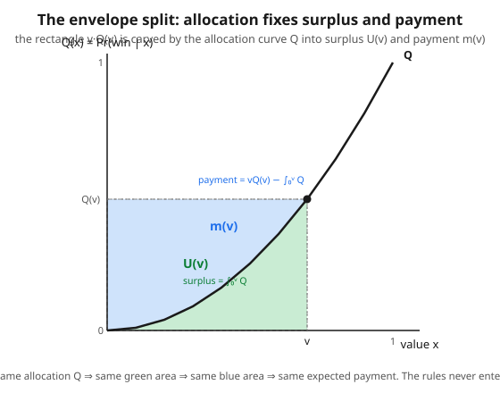

# Grad Game Theory · Lesson 4.3: The revenue equivalence theorem

> ⏱ ~15 min · Module 4: Games of incomplete information · Builds on: [4.2 Auctions and equilibrium bidding](04-02-auctions-equilibrium-bidding.md) · Unlocks: [4.4 Perfect Bayesian and sequential equilibrium](04-04-perfect-bayesian-sequential-equilibrium.md)

## Why this matters

In 4.2 you solved two auctions and got two very different-looking equilibria: in a second-price auction everyone bids their true value; in a first-price auction everyone shades down to $\frac{n-1}{n}v$. Different rules, different bids, sometimes different winners' payments on a given day. So a seller should care a lot which format to run — right?

Here is the punchline of the whole module: **on average, it makes no difference.** First-price, second-price, English, Dutch, even the bizarre all-pay auction where losers still pay — all hand the seller the *same expected revenue*, as long as the good ends up with the highest-value bidder and the lowest type expects to pay nothing. This is the revenue equivalence theorem, and the argument behind it (the envelope theorem applied to incentive compatibility) is the exact engine that drives the revelation principle (5.2) and Myerson's optimal-auction theory (5.4). Learn this proof and you have most of mechanism design in your hands.

## The idea

Fix any one bidder and ask a selfish question: *what do I get, in expectation, from participating, as a function of my private value $v$?* Call that number $U(v)$ — my interim expected surplus (expected value-of-winning minus expected payment), computed in equilibrium, averaging over everyone else's values.

Now the key observation. Suppose my true value is $v$ but I consider deviating to bid *as if* my value were some other number $z$. Because I'm in a Bayes–Nash equilibrium, telling the truth ($z=v$) must beat every lie — my surplus is maximized at $z=v$. Whenever a function is maximized in one variable, its derivative in the *other* variable is all that survives (this is the envelope theorem). Working that out, the payment terms cancel and you're left with something clean:

$$U'(v) = Q(v) = \Pr(\text{I win} \mid \text{my value is } v).$$

**In words:** raising your value by a dollar raises your equilibrium surplus by exactly your probability of winning — nothing else. The auction's pricing rules, however baroque, have vanished from the derivative.

Integrate that and you've pinned down $U(v)$ from the *allocation alone*. And once you know surplus and allocation, you know payment: payment $=$ (value if you win)$\times$(win probability) $-$ surplus. So two auctions with the **same allocation rule** and the **same surplus for the bottom type** must charge every type the same expected payment — hence deliver the same revenue. The bidding formulas differ; the money changing hands, in expectation, does not.

## The formal version

Setup: $n$ bidders, each value $v_i$ drawn i.i.d. from a distribution $F$ with density $f$ on $[0,\bar v]$, values private. Fix a Bayes–Nash equilibrium of some auction. For a bidder of value $v$, define the **interim** (value-conditioned, opponent-averaged) quantities

$$Q(v) = \Pr(\text{this bidder wins} \mid v), \qquad m(v) = \mathbb{E}[\text{this bidder's payment} \mid v],$$

$$U(v) = v\,Q(v) - m(v) = \text{interim expected surplus}.$$

**In words:** $Q$ is your win probability, $m$ your expected payment, $U$ what you net, each conditioned on your own value and averaged over rivals.

**Incentive compatibility.** In equilibrium, misreporting your type can't help. Writing your surplus from *behaving like type $z$* while truly being $v$ as $\;v\,Q(z) - m(z)$, truthfulness requires

$$U(v) = \max_{z}\;\big[\,v\,Q(z) - m(z)\,\big], \quad\text{attained at } z=v.$$

**In words:** among all the types you could imitate, imitating yourself is optimal.

**Envelope theorem.** Differentiating the value of a maximization problem in a parameter ($v$) equals the partial derivative of the objective in that parameter, evaluated at the optimizer. Here the objective is $v\,Q(z)-m(z)$ and the parameter $v$ multiplies $Q(z)$, so

$$\boxed{\,U'(v) = Q(v)\,.}$$

**In words:** the marginal surplus of a higher value is exactly the win probability; the payment term $m$ never appears because we're at the optimum in $z$. (This is *the same* envelope theorem you'll meet in [grad-micro](../../grad-micro/syllabus.md) — Roy's identity, Shephard's lemma, Hotelling's lemma are all this one move.)

**Integrating** from $0$ to $v$:

$$U(v) = U(0) + \int_0^v Q(x)\,dx.$$

**Revenue Equivalence Theorem.** *Consider two auction mechanisms with symmetric, increasing Bayes–Nash equilibria. If they (i) have the same allocation rule — the same $Q(\cdot)$, e.g. both always give the good to the highest value — and (ii) give the lowest type the same surplus $U(0)$ (normally $U(0)=0$), then every type pays the same expected amount:*

$$m(v) = v\,Q(v) - U(0) - \int_0^v Q(x)\,dx.$$

*Consequently the two mechanisms yield the seller the same expected revenue.*

**In words:** allocation plus one boundary condition determines all payments. Same "who wins" $\Rightarrow$ same "who pays what," on average. The bidding language is irrelevant. Expected seller revenue is $\;R = n\,\mathbb{E}_v[m(v)]\;$ — the same number for both.

## Picture

The rectangle has height $Q(v)$ and width $v$, so its area is $v\,Q(v)$ — total value-if-you-win-weighted-by-winning. The allocation curve $Q$ slices it: the area *under* the curve is $\int_0^v Q = U(v)$, your surplus; what's left, $v\,Q(v) - \int_0^v Q = m(v)$, is your expected payment. Both pieces are determined the instant $Q$ is fixed — the auction's rulebook never enters the figure.

## Worked examples

**Example 1 (the two auctions match — $n$ bidders, $v \sim U[0,1]$).** Here $F(v)=v$, $f(v)=1$, and the good goes to the highest value in both formats, so both have $Q(v)=\Pr(\text{all }n-1\text{ rivals below }v)=v^{n-1}$.

*Second-price.* You pay the highest rival value *when you win*. Seller revenue $=$ expected second-highest of $n$ draws $=\mathbb{E}[V_{(2)}]$. The density of the second-highest order statistic (from [probability-theory](../../probability-theory/syllabus.md)) is $f_{(2)}(x)=n(n-1)x^{n-2}(1-x)$, so

$$R_{\text{2nd}}=\int_0^1 x\,n(n-1)x^{n-2}(1-x)\,dx = n(n-1)\!\left[\tfrac{1}{n}-\tfrac{1}{n+1}\right] = n(n-1)\cdot\frac{1}{n(n+1)} = \frac{n-1}{n+1}.$$

*First-price.* From 4.2 the equilibrium bid is $b(v)=\frac{n-1}{n}v$, and the winner (value $v$, probability density of *being* the winner with value $v$ is $n f(v)Q(v)=n v^{n-1}$) pays their own bid. Seller revenue:

$$R_{\text{1st}}=\int_0^1 b(v)\cdot n v^{n-1}\,dv = \int_0^1 \frac{n-1}{n}v \cdot n v^{n-1}\,dv = (n-1)\int_0^1 v^{n}\,dv = \frac{n-1}{n+1}.$$

Identical: $\dfrac{n-1}{n+1}$. (Sanity checks: $n=2\Rightarrow\frac13$, $n=3\Rightarrow\frac12$, $n=4\Rightarrow\frac35$ — revenue rises toward $1$ as competition intensifies.) This is the second half of Boss Problem 4.

**Example 2 (the all-pay auction — everyone pays their bid, win or lose).** This is the striking case: losers don't get their money back (think lobbying, R&D races, costly political contests). Same allocation — highest bid, hence highest value, wins — so revenue equivalence *predicts* the same $\frac{n-1}{n+1}$ before we solve a thing. Let's confirm by deriving the equilibrium bid from the envelope formula.

With $U(0)=0$, expected payment is $m(v)=v\,Q(v)-\int_0^v Q(x)\,dx$. In an all-pay auction you pay your bid $a(v)$ *always*, so your expected payment simply *is* your bid: $m(v)=a(v)$. Therefore

$$a(v)=v\,Q(v)-\int_0^v Q(x)\,dx = v\cdot v^{n-1}-\int_0^v x^{n-1}\,dx = v^n - \frac{v^n}{n} = \frac{n-1}{n}\,v^{n}.$$

**In words:** the envelope formula *hands you the equilibrium bid directly* from the allocation — no differential equation to solve. Now the seller collects $a$ from all $n$ bidders every time:

$$R_{\text{all-pay}} = n\int_0^1 a(v)f(v)\,dv = n\int_0^1 \frac{n-1}{n}v^{n}\,dv = (n-1)\int_0^1 v^n\,dv = \frac{n-1}{n+1}.\ \checkmark$$

Three completely different games — sealed high-bid, sealed second-price, everyone-pays — one revenue. That is revenue equivalence with teeth.

## Watch out

- **You might think** revenue equivalence says any two auctions raise the same money, **but actually** it needs *both* hypotheses: the same allocation (highest value wins) *and* $U(0)=0$ (lowest type pays nothing in expectation). Break either and revenue moves. A binding **reserve price** does both — it sometimes withholds the good from the highest bidder (allocation changes) and it screens out low types — which is exactly the lever Myerson (5.4) pulls to *beat* $\frac{n-1}{n+1}$. **Asymmetric** bidders (non-identical $F$) or **risk-averse** bidders also break it: risk-averse bidders bid *more* in first-price, so first-price then raises *more* than second-price.
- **You might think** the *realized* payments coincide, **but actually** it's only *expected* revenue that's equal. On a given day the first-price winner pays their shaded bid $\frac{n-1}{n}v_{(1)}$ while the second-price winner pays $v_{(2)}$; these differ sample by sample and only agree in expectation.
- **You might think** the envelope step is a slick trick special to auctions, **but actually** it's the plain envelope theorem: $m(v)$ is the *constant of integration* that incentive compatibility fixes once you know $U(0)$. Payments are pinned by allocation the same way a potential is pinned by its gradient plus one boundary value.

## One-liner

> Incentive compatibility forces $U'(v)=Q(v)$, so allocation plus $U(0)$ determines every payment — different auction formats are just different handwriting on the same expected check.

## Problems

**P1 (🟢)** Two symmetric bidders, values i.i.d. $U[0,1]$. Using the envelope characterization (not by re-solving the auction), find the interim expected payment $m(v)$ of a bidder with value $v$ in *any* efficient auction with $U(0)=0$, then verify $n\,\mathbb{E}[m(V)]=\frac13$.

**P2 (🟡)** A "top-two-pay" auction with $n=3$, values i.i.d. $U[0,1]$: the highest bidder wins the good, and the *two* highest bidders each pay their own bid (the lowest pays nothing). Does revenue equivalence apply? State the equilibrium bid function and the seller's expected revenue, justifying each with the theorem rather than a fresh equilibrium computation.

**P3 (🔴, optional)** Show revenue equivalence can *fail* under a reserve price. In a second-price auction with $n=2$, $v\sim U[0,1]$, and reserve $r=\frac12$ (the good is sold only if some bid $\ge r$, and the winner pays $\max(r,\ \text{other bid})$), compute the seller's expected revenue and compare it to the no-reserve value $\frac13$. Which is larger, and what does that foreshadow about Myerson?

Solutions

**P1** With $n=2$, $F(v)=v$, the good goes to the higher value so $Q(v)=\Pr(V_2<v)=v$. The envelope/RET formula with $U(0)=0$:

$$m(v)=v\,Q(v)-\int_0^v Q(x)\,dx = v\cdot v-\int_0^v x\,dx = v^2-\frac{v^2}{2}=\frac{v^2}{2}.$$

Expected revenue $=n\,\mathbb{E}[m(V)]=2\displaystyle\int_0^1 \frac{v^2}{2}\,dv = \int_0^1 v^2\,dv=\frac13.$ ✓ (Matches $\frac{n-1}{n+1}$ at $n=2$, and it fell out of the *allocation only* — we never named first- or second-price.)

**P2** Yes, the theorem applies: the highest bidder still wins (allocation is efficient, same $Q(v)=v^{n-1}=v^2$ for $n=3$) and the lowest type pays nothing, so $U(0)=0$. Hence every type's *interim expected payment* is the same as in every other efficient, $U(0)=0$ auction:

$$m(v)=v\,Q(v)-\int_0^v Q = v\cdot v^2 - \int_0^v x^2\,dx = v^3-\frac{v^3}{3}=\frac{2}{3}v^3.$$

Seller revenue is therefore unchanged at $\frac{n-1}{n+1}=\frac{3-1}{3+1}=\frac12$ — the theorem guarantees it without solving the "top-two-pay" game. (The *bid* function does differ from first-price, but expected revenue can't: you pay when you're in the top two, and $m(v)$ already accounts for that in expectation. Concretely, if $a(v)$ is the bid and $\Pr(\text{in top two}\mid v)=1-(\text{prob both rivals exceed }v)=1-(1-v)^2$, then $m(v)=a(v)\cdot[1-(1-v)^2]$ pins down $a$ — but you never need it for the revenue answer.)

**P3** With reserve $r=\frac12$, $n=2$, uniform values. The good is sold iff at least one value $\ge\frac12$; it goes unsold (revenue $0$) iff both values $<\frac12$, probability $\frac14$. Compute expected revenue by cases on the values $(v_1,v_2)$, uniform on the unit square. Let the winner be the higher value $v_{(1)}$, loser $v_{(2)}$; the winner pays $\max(r, v_{(2)})$ when $v_{(1)}\ge r$.

- **Both below $r$** (area $\frac14$): no sale, revenue $0$.
- **Exactly one $\ge r$** (the winner $\ge\frac12$, loser $<\frac12$; area $2\cdot\frac12\cdot\frac12=\frac12$): winner pays the reserve $r=\frac12$. Contribution $=\frac12\cdot\frac12=\frac14$.
- **Both $\ge r$** (area $\frac14$): winner pays the loser's value $v_{(2)}$, which is the *second*-highest of two draws conditioned on both being in $[\frac12,1]$. Rescale $u=\frac{v-1/2}{1/2}\in[0,1]$: $v_{(2)}=\frac12+\frac12 u_{(2)}$ with $\mathbb{E}[u_{(2)}]=\frac13$ (second-highest of 2 uniforms). So $\mathbb{E}[v_{(2)}\mid\text{both}\ge r]=\frac12+\frac12\cdot\frac13=\frac23$. Contribution $=\frac14\cdot\frac23=\frac16$.

Total expected revenue $=0+\frac14+\frac16=\frac{3}{12}+\frac{2}{12}=\frac{5}{12}\approx 0.417.$

This **exceeds** the no-reserve $\frac13\approx0.333$. Revenue equivalence has broken — the reserve changes the allocation (the good is sometimes withheld even though a bidder values it above $0$) and the low types no longer participate freely. That a well-chosen reserve *raises* revenue above every efficient auction is exactly the door Myerson's optimal-auction theorem (5.4) walks through: the revenue-maximizing auction is *not* efficient. (For uniform $[0,1]$, Myerson's optimal reserve is indeed $r^*=\frac12$.)

## Flashback

**From Lesson 4.2 (Auctions and equilibrium bidding):** Three bidders have i.i.d. values $v\sim U[0,1]$ and compete in a *first-price* sealed-bid auction. (a) State the symmetric equilibrium bid $b(v)$. (b) A bidder has value $v=0.6$. What is the probability she wins, and what is her expected payment *conditional on winning*?

Solution

(a) With $n=3$ uniform bidders, the symmetric equilibrium bid is $b(v)=\frac{n-1}{n}v=\frac{2}{3}v$. (General uniform result from 4.2: shade by the factor $\frac{n-1}{n}$.)

(b) She wins iff both rivals have lower values: $Q(0.6)=\Pr(V<0.6)^2=0.6^2=0.36$. In a first-price auction the winner pays her own bid, which is deterministic given her value: $b(0.6)=\frac{2}{3}(0.6)=0.4$. So her expected payment conditional on winning is exactly $0.40$. (Contrast: in a *second*-price auction she'd bid $0.6$ but pay the higher rival's value, expected $\mathbb{E}[V_{(1)}\text{ of two draws}\mid \text{both}<0.6]=0.6\cdot\frac23=0.4$ — the same conditional-on-winning expected payment, a live instance of revenue equivalence.)

## Connections

- **Backward:** this unifies the two auctions of [4.2](04-02-auctions-equilibrium-bidding.md) — their different bid functions were a distraction; the shared allocation was the substance. The whole argument lives inside a Bayes–Nash equilibrium of an incomplete-information game ([4.1](04-01-bayesian-games-bayes-nash.md)).
- **Forward:** the characterization "$U'(v)=Q(v)$, payments $=$ allocation $+$ boundary" *is* the incentive-compatibility constraint that the revelation principle (5.2) lets us impose without loss, and that Myerson's optimal auction (5.4) maximizes revenue subject to. P3 previews why the optimum sacrifices efficiency.
- **Sideways (grad-micro):** the envelope theorem here is identical to the one behind Roy's identity and Shephard's lemma; mechanism design and consumer theory run on the same lemma — see [grad-micro](../../grad-micro/syllabus.md).
- **Sideways (probability):** every revenue number is an order-statistic expectation — second-price revenue is literally $\mathbb{E}[V_{(2)}]$; the machinery is [probability-theory](../../probability-theory/syllabus.md)'s order statistics.
