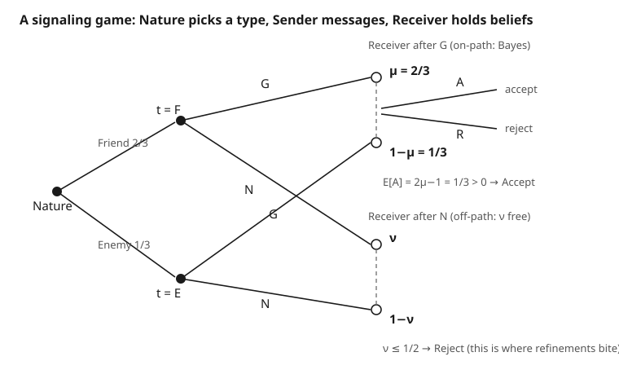

# Grad Game Theory · Lesson 4.4: Perfect Bayesian and sequential equilibrium

> ⏱ ~15 min · Module 4: Games of incomplete information · Builds on: [4.3 The revenue equivalence theorem](04-03-revenue-equivalence-theorem.md) · Unlocks: [4.5 Signaling games and refinements](04-05-signaling-games-refinements.md)

## Why this matters

In [3.2](03-02-backward-induction-subgame-perfection.md) subgame perfection killed non-credible threats by pruning the tree from the leaves. That trick quietly assumed players *know which node they're standing at*. Once information is incomplete — a firm that doesn't know its rival's costs, an entrant facing a possibly-tough incumbent, a buyer reading a seller's price — a player is stuck at a non-singleton information set and must act *without knowing where she is*. Backward induction has nothing to grab onto: there are almost no proper subgames to be perfect on. The fix is to make the player's **beliefs** about where she is part of the equilibrium itself. That idea — a strategy profile *plus* a belief system — is the workhorse of every model in the rest of this course: signaling, screening, reputation, mechanism design.

## The idea

Picture a receiver at an information set containing two nodes: "the sender was Strong" and "the sender was Weak." To choose rationally she needs a probability $\mu$ that she's at the first node. Where does $\mu$ come from? From the sender's strategy, run through Bayes' rule: if only the Strong type sends this message, then seeing it means $\mu = 1$; if both types send it with equal probability, seeing it is uninformative and $\mu$ equals the prior.

Two demands make this an equilibrium. First, **sequential rationality**: given her belief $\mu$, the receiver plays a best response — and the *sender*, anticipating that response, best-responds too. Second, **consistency**: the belief $\mu$ isn't invented, it's the Bayesian update of the actual strategies. The catch — and the entire drama of the next two lessons — is that Bayes' rule is silent at information sets that the equilibrium strategies *never reach*. There the update is $0/0$, so beliefs are free, and free beliefs breed many equilibria. Disciplining those off-path beliefs is what "sequential equilibrium" and the refinements of [4.5](04-05-signaling-games-refinements.md) are for.

## The formal version

Fix a finite extensive-form game of incomplete information. An **assessment** is a pair $(\sigma, \mu)$: a behavior-strategy profile $\sigma$ (what each player does at each of her information sets) and a **belief system** $\mu$ assigning, to every information set $I$, a probability distribution $\mu(\cdot \mid I)$ over the nodes in $I$.

**In words:** the solution object is *strategies together with beliefs* — a plan of play plus, at every "you are here (somewhere)" set, a guess about which node it is.

An assessment $(\sigma,\mu)$ is a **Perfect Bayesian Equilibrium (PBE)** if it satisfies:

1. **Sequential rationality.** At every information set $I$ (whether or not it is reached in equilibrium), the player who moves there chooses a continuation strategy maximizing her expected payoff, computed using her belief $\mu(\cdot\mid I)$ and the others' strategies $\sigma_{-i}$.

   **In words:** *at every decision point, given what you believe and what everyone else does, you're playing optimally* — no empty threats survive, because a threat off the path must still be something you'd actually want to carry out.

2. **Belief consistency (Bayes wherever possible).** For every information set $I$ reached with positive probability under $\sigma$, the belief $\mu(\cdot\mid I)$ is obtained from the prior and $\sigma$ by Bayes' rule:
$$\mu(x \mid I) = \frac{\Pr\nolimits_\sigma(x)}{\sum_{x' \in I}\Pr\nolimits_\sigma(x')}, \qquad \text{whenever } \textstyle\sum_{x'\in I}\Pr\nolimits_\sigma(x') > 0.$$

   **In words:** *on the equilibrium path, beliefs are pinned down by the strategies* — you update rationally on what you expected to see. Here $\Pr_\sigma(x)$ is the probability the game reaches node $x$ under Nature's prior and the strategies $\sigma$.

The denominator is the whole story. On the equilibrium path it is positive, and $\mu$ is *forced*. Off the path it is zero — the information set is reached only if someone deviates — and Bayes' rule gives $0/0$, so PBE leaves $\mu(\cdot\mid I)$ **unrestricted**. Different off-path beliefs give different equilibria.

**Sequential equilibrium (Kreps–Wilson).** An assessment $(\sigma,\mu)$ is a **sequential equilibrium** if it is sequentially rational and **consistent** in the limit sense: there is a sequence of *totally mixed* strategy profiles $\sigma^k \to \sigma$ (every action played with strictly positive probability, so *every* information set is reached) whose Bayes-updated beliefs $\mu^k \to \mu$.

**In words:** *pretend every player's hand trembles slightly, so every node has positive probability and Bayes applies everywhere; off-path beliefs must be the limit of honest Bayesian updates as the trembles vanish.* This is what tames off-path beliefs — they can no longer be anything at all; they must be justifiable by *some* vanishing sequence of mistakes.

**The hierarchy.** Sequential rationality plus limit-consistency is strictly stronger than Bayes-where-possible, so
$$\text{sequential equilibrium} \implies \text{PBE} \implies \text{subgame perfection} \implies \text{Nash}.$$
Sequential equilibrium is the normal-form cousin of **trembling-hand perfection** (Selten): both discipline behavior by requiring robustness to small mistakes, one on the tree, one on the payoff matrix. In finite games a trembling-hand perfect equilibrium is sequential, and generically the two agree.

## Picture

The receiver's two dashed information sets each contain a Friend-node and an Enemy-node. On the path she updates by Bayes to $\mu=2/3$ and accepts; off the path her belief $\nu$ is unconstrained by Bayes — and that freedom is exactly where equilibria multiply.

## Worked examples

**The gift game (used in both examples).** Nature draws the sender's type: **Friend** ($F$) with probability $2/3$, **Enemy** ($E$) with probability $1/3$. The sender, knowing her type, either gives a gift ($G$, which costs her $1$) or not ($N$). The receiver sees the message, not the type, and **accepts** ($A$) or **rejects** ($R$). Payoffs (sender, receiver):

| outcome | $F$ | $E$ |
|---|---|---|
| $G, A$ | $(2,\;1)$ | $(2,\;-1)$ |
| $G, R$ | $(-1,\;0)$ | $(-1,\;0)$ |
| $N, A$ | $(3,\;1)$ | $(3,\;0)$ |
| $N, R$ | $(0,\;0)$ | $(0,\;0)$ |

The sender always wants to be accepted and, once accepted, prefers to have saved the gift ($3>2$). The receiver wants to accept a Friend ($+1$) and reject an Enemy (avoid $-1$): with belief $q = \Pr(F\mid \text{message})$, accepting yields $q(1)+(1-q)(-1)=2q-1$, so **accept iff $q>\tfrac12$**.

Note first: the receiver's two information sets each hold two nodes, so *the only proper subgame is the whole game*. Subgame perfection is therefore vacuous here — it rules out nothing — which is precisely why we need beliefs.

**Example 1 — a pooling PBE, beliefs computed.** Conjecture: *both types send $G$; the receiver accepts after $G$ and rejects after $N$.*

*On-path belief (Bayes, forced).* Both types send $G$, so $G$ carries no information about type and the posterior equals the prior:
$$\mu(F\mid G) = \frac{\tfrac23\cdot 1}{\tfrac23\cdot 1 + \tfrac13\cdot 1} = \tfrac23.$$

*Sequential rationality of the receiver after $G$.* With $\mu=\tfrac23>\tfrac12$, accepting gives $2(\tfrac23)-1=\tfrac13>0$, so $A$ is optimal. ✓

*Off-path belief and the receiver after $N$.* Nobody sends $N$, so Bayes is silent: assign any $\nu=\mu(F\mid N)\le \tfrac12$. Then accepting gives $2\nu-1\le0$, so $R$ is optimal. ✓

*Sequential rationality of the sender.* Sending $G$ yields (accepted) $2$; deviating to $N$ triggers $R$, yielding $0<2$. Both types prefer $G$. ✓

All three conditions hold, so this is a PBE. Notice what carries it: the **off-path threat "reject a no-gift"** deters deviation, and that threat is credible only because we chose a pessimistic off-path belief $\nu\le\tfrac12$. Had we set $\nu>\tfrac12$, the receiver would accept after $N$, and both types would bolt to $N$ for a payoff of $3>2$ — the pooling-on-$G$ equilibrium would collapse. **Off-path beliefs are pivotal**, and Nash/subgame perfection say nothing about them.

**Example 2 — multiplicity off path, and a sequential-equilibrium check.** The pooling-on-$G$ assessment is not one equilibrium but a *family*: every $\nu\in[0,\tfrac12]$ gives a distinct PBE with identical on-path play. They differ *only* in a belief at a node no one visits.

Is the $\nu=0$ assessment a genuine **sequential equilibrium**? Build a trembling sequence. Let both types tremble onto the off-path message $N$, with the Enemy trembling much more than the Friend:
$$\sigma^k_F(N) = \varepsilon_k^2, \qquad \sigma^k_E(N) = \varepsilon_k, \qquad \varepsilon_k \to 0.$$
These are totally mixed, so the $N$-information set is now reached and Bayes applies:
$$\nu^k = \frac{\tfrac23\,\varepsilon_k^2}{\tfrac23\,\varepsilon_k^2 + \tfrac13\,\varepsilon_k} = \frac{\tfrac23\,\varepsilon_k}{\tfrac23\,\varepsilon_k + \tfrac13} \xrightarrow{\;k\to\infty\;} 0.$$
So $\nu^k\to 0$, matching the assessment: the $\nu=0$ PBE *is* a sequential equilibrium. But nothing forces the Enemy to tremble more — take $\sigma^k_E(N)=\varepsilon_k^2$, $\sigma^k_F(N)=\varepsilon_k$ instead and you get $\nu^k\to 1$. In this simple signaling game **many off-path beliefs are limit-consistent**, so sequential equilibrium *narrows but does not eliminate* the multiplicity. That residual freedom is exactly the gap the intuitive criterion of [4.5](04-05-signaling-games-refinements.md) is built to close.

## Watch out

- **You might think** subgame perfection handles dynamic games with incomplete information. **Actually** it is usually toothless: non-singleton information sets mean few or no proper subgames, so SPE reduces to Nash and never touches off-path credibility. PBE restores discipline by adding beliefs and demanding sequential rationality at *every* information set.
- **You might think** Bayes' rule pins down all beliefs. **Actually** it pins them down *only on the equilibrium path*, where the denominator is positive. Off the path it delivers $0/0$; those beliefs are the free parameters that generate equilibrium multiplicity — the refinement battleground.
- **You might think** sequential rationality only concerns reached information sets. **Actually** it must hold at *every* information set, including off-path ones, evaluated against the belief there — that is precisely how empty threats are ruled out.
- **You might think** PBE is stronger than sequential equilibrium because "perfect" sounds stronger. **Actually** it is the other way: sequential equilibrium adds limit-consistency on top of PBE's requirements, so $\text{sequential}\subseteq\text{PBE}$.
- **You might think** you find the strategies first and read off the beliefs afterward. **Actually** the belief system is *part of* the equilibrium object — you propose $(\sigma,\mu)$ together and check both conditions jointly.

## One-liner

> With incomplete information, an equilibrium is strategies **plus** beliefs: Bayes pins beliefs on the path, sequential rationality makes every threat credible, and the untamed off-path beliefs are where refinements earn their keep.

## Problems

**P1 (🟢)** In the gift game above, verify that **pooling on $N$** (both types send no gift; the receiver accepts after $N$) is a PBE. Compute the on-path belief by Bayes, check the receiver's and both sender types' incentives, and show the deviation to $G$ is deterred *for every* off-path belief $\mu(F\mid G)$.

**P2 (🟡)** Change the prior to $\Pr(F)=\tfrac25$ (so Enemies are now more likely), keeping all payoffs. Is pooling on $G$ (receiver accepts after $G$) still a PBE? Explain using the on-path belief, and state what the receiver does after $G$.

**P3 (🔴, optional)** Consider the assessment "pooling on $G$, receiver rejects after $G$." Show it is *not* a PBE, identifying exactly which condition fails and why no choice of off-path belief can rescue it. Relate the failure to the fact that this profile is nonetheless (trivially) subgame perfect.

Solutions

**P1.** On path, both types send $N$, so $N$ is uninformative and Bayes gives
$$\mu(F\mid N)=\frac{\tfrac23}{\tfrac23+\tfrac13}=\tfrac23>\tfrac12,$$
so accepting yields $2(\tfrac23)-1=\tfrac13>0$: the receiver accepts after $N$. ✓ Each sender type then gets $(N,A)=3$. Deviating to $G$: the receiver's response depends on the off-path belief $\mu(F\mid G)=\beta$. If $\beta\le\tfrac12$ she rejects, giving the deviator $(G,R)=-1<3$; if $\beta>\tfrac12$ she accepts, giving $(G,A)=2<3$. Either way the deviation is strictly worse, so **for every** off-path belief the deviation is deterred and pooling on $N$ is a PBE (sender payoff $3$). (Compared with Example 1's pooling-on-$G$, here the sender achieves acceptance *and* saves the gift — the pooling-on-$G$ equilibrium is the wasteful one, sustained only by pessimistic off-path beliefs.)

**P2.** On path both types send $G$, so the belief equals the prior: $\mu(F\mid G)=\tfrac25$. Now $2\mu-1=2(\tfrac25)-1=-\tfrac15<0$, so the receiver's best response after $G$ is to **reject**, not accept. With rejection on the path, each sender type earns $(G,R)=-1$, and deviating to $N$ can only help (it yields at least $0>-1$). So the conjectured assessment fails sequential rationality *on the path*: pooling on $G$ **with acceptance is not a PBE** at this prior — the receiver would reject, because seeing a gift no longer makes a Friend more likely than not.

**P3.** The information set after $G$ is on the equilibrium path (both types send $G$), so belief consistency *forces* $\mu(F\mid G)=\tfrac23$ by Bayes — this is not a free parameter. Given $\mu=\tfrac23$, accepting yields $\tfrac13>0$, so **rejecting is not sequentially rational**: condition (1) fails at a *reached* information set. Because the belief is pinned by Bayes on the path, no choice of off-path belief is even available to rescue it — the failure is on-path. The instructive part: this profile *is* trivially subgame perfect, since the only proper subgame is the whole game, so subgame perfection flags nothing. PBE catches it precisely because it forces the on-path belief and then demands optimality against it. (Equivalently: on the path, PBE and Nash already coincide, and this profile is not even Nash — the receiver strictly prefers to accept given the on-path type distribution.)

## Flashback

**From Lesson 3.2 (Backward induction and subgame perfection):** An entrant chooses **In** or **Out**. If In, the incumbent chooses **Fight** or **Accommodate**. Payoffs (entrant, incumbent): Out $\to(0,\,2)$; In then Fight $\to(-1,\,0)$; In then Accommodate $\to(1,\,1)$. Find the subgame-perfect equilibrium by backward induction, and identify a Nash equilibrium that is *not* subgame perfect, naming the non-credible threat.

Solution

Backward induction: at the incumbent's node (reached only after In), Fight gives $0$ and Accommodate gives $1$, so the incumbent **accommodates**. Anticipating this, the entrant compares In $\to 1$ against Out $\to 0$ and enters. The **SPE is (In, Accommodate)** with payoffs $(1,1)$.

The strategy profile **(Out, Fight)** is a Nash equilibrium: given the incumbent's plan to Fight, the entrant's best response is Out ($0>-1$); and given the entrant stays Out, the incumbent's off-path plan is never tested, so Fight is a (weak) best response. But it is **not** subgame perfect: in the subgame after In, Fight ($0$) is dominated by Accommodate ($1$), so "Fight" is a **non-credible threat** — exactly the kind of off-path incredibility that, in the incomplete-information setting of this lesson, sequential rationality against explicit beliefs is designed to eliminate.

## Connections

- **Backward:** this is [3.2](03-02-backward-induction-subgame-perfection.md)'s subgame perfection generalized to non-singleton information sets — when there are no proper subgames to prune, beliefs stand in for backward induction. It marries that logic to the Bayesian updating of [4.1](04-01-bayesian-games-bayes-nash.md): PBE is "Bayes–Nash with sequential rationality and a belief system attached." The prior-to-posterior mechanics are the conditional-probability machinery from [probability-theory](../../probability-theory/syllabus.md).
- **Forward:** [4.5](04-05-signaling-games-refinements.md) runs the gift-game machinery at full scale — Spence signaling, pooling vs. separating equilibria, and the **intuitive criterion**, which is a principled restriction on exactly the off-path beliefs this lesson left free. PBE is also the equilibrium concept for the implementation results of Module 5 ([syllabus](../syllabus.md)) on mechanism design.
- **Sideways (grad-micro):** the signaling and screening models of information economics — education signaling, insurance screening, limit pricing — are all PBE analyses of dynamic incomplete-information games; the pooling/separating language transfers verbatim. See [grad-micro](../../grad-micro/syllabus.md).
