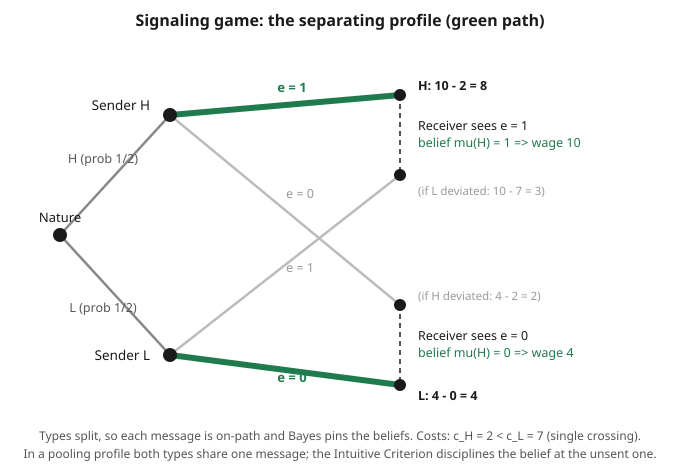

# Grad Game Theory · Lesson 4.5: Signaling games and refinements

> ⏱ ~15 min · Module 4: Games of incomplete information · Builds on: [4.4 Perfect Bayesian and sequential equilibrium](04-04-perfect-bayesian-sequential-equilibrium.md) · Unlocks: [5.1 Social choice and impossibility](05-01-social-choice-impossibility.md)

## Why this matters

An informed party often wants to *prove* something it can't just assert — that its product is durable, its firm profitable, its ability high. Talk is cheap, so it burns money instead: a costly action the good type can afford and the bad type can't. Spence's job-market model makes this the founding story of information economics: education need not raise your productivity one bit yet can still command a wage, purely because it is cheaper for the able to acquire. Signaling games are how we model this — and they come with a nasty surprise. The equilibrium concept from 4.4 (perfect Bayesian) admits *too many* answers, because it leaves beliefs after unexpected moves unconstrained. **Refinements** are the tools that throw out the silly ones, and the Intuitive Criterion is the one every applied theorist reaches for first.

## The idea

Two players. **Nature** privately hands the **Sender** a type — high (H) or low (L). The Sender, knowing its type, picks a **message** whose cost depends on the type. The **Receiver** sees the message but *not* the type, updates its belief, and takes an action. Because the message is all the Receiver has, the message *is* the channel — and whether information gets through depends on whether the two types can bear to choose differently.

Three outcomes are possible. In a **separating** equilibrium the types send different messages, so the Receiver reads the type off perfectly — information flows. In a **pooling** equilibrium every type sends the *same* message, the Receiver learns nothing new, and its belief after the message equals its prior. In between sits **semi-separating** (some types randomize). The engine of separation is a cost difference: if the high type finds the signal *cheaper* — the **single-crossing** property — it can climb to a message level the low type won't imitate even to be mistaken for high.

The catch: an equilibrium must also say what the Receiver believes after a message *nobody was supposed to send*. Bayes' rule is silent there (you can't condition on a zero-probability event), so the modeler is free to pencil in any belief — and a sufficiently *pessimistic* off-path belief ("anyone deviating must be the low type") can prop up a pooling equilibrium that no sensible player would actually expect. Refinements attack exactly this freedom.

## The formal version

A **signaling game**: types $\theta \in \Theta$ with prior $p(\theta)$; messages $m \in M$; actions $a \in A$; payoffs $u_S(\theta, m, a)$ for the Sender and $u_R(\theta, m, a)$ for the Receiver. A **strategy profile** is a Sender rule $\sigma(m \mid \theta)$, a Receiver rule $\alpha(a \mid m)$, and a **belief system** $\mu(\theta \mid m)$.

A **perfect Bayesian equilibrium (PBE)** (from [4.4](04-04-perfect-bayesian-sequential-equilibrium.md)) requires:

1. **Sender optimality:** each type $\theta$ sends a message maximizing $u_S(\theta, m, \alpha(\cdot\mid m))$, anticipating the Receiver's reaction.
2. **Receiver sequential rationality:** after each message, $\alpha(\cdot \mid m)$ maximizes expected payoff $\sum_\theta \mu(\theta\mid m)\, u_R(\theta, m, a)$.
3. **Belief consistency (Bayes on path):** for any message sent with positive probability,
$$\mu(\theta \mid m) = \frac{p(\theta)\,\sigma(m\mid\theta)}{\sum_{\theta'} p(\theta')\,\sigma(m\mid\theta')}.$$

*In words:* everybody best-responds given beliefs, and beliefs match the true type frequencies at messages actually used. **Off-path messages carry no Bayes constraint — $\mu(\cdot\mid m)$ can be anything.** That freedom is the multiplicity problem.

**Single-crossing (Spence–Mirrlees).** Order messages by cost. The property holds if the Sender's indifference curves in (message, action) space satisfy: raising the message is *less* painful for H than for L, so their indifference curves cross exactly once. *In words:* the high type has a lower marginal cost of signaling, so there is a signal level H will pay for and L won't — the precondition for any separation. (This condition is developed market-side, with welfare, in [grad-micro](../../grad-micro/syllabus.md)'s signaling and screening lessons.)

**The Intuitive Criterion (Cho–Kreps).** Fix a PBE with equilibrium payoff $u_S^*(\theta)$ for each type. For an off-path message $m$, call type $\theta$ **equilibrium-dominated at $m$** if
$$u_S^*(\theta) \;>\; \max_{a \in \mathrm{BR}(m)} u_S(\theta, m, a),$$
where $\mathrm{BR}(m)$ is the set of Receiver best responses to *some* belief over the types not ruled out. *In words:* even in the best case — the Receiver reacting as favorably as it ever rationally could — type $\theta$ still does worse by sending $m$ than by staying put, so $\theta$ could never gain from $m$. The criterion demands: **put zero belief weight on every equilibrium-dominated type at $m$.** If, after deleting those types, some *remaining* type would then strictly prefer to deviate, the equilibrium **fails** the Intuitive Criterion. *In words:* don't blame a deviation on a type that could not possibly have wanted it — and if the only types who *could* want it would then actually be rewarded, the equilibrium unravels.

## Picture

## Worked examples

We use one concrete game throughout — a discrete Spence model.

**Setup.** Types $H$ (productivity $10$) and $L$ (productivity $4$), prior $p(H)=p(L)=\tfrac12$. The Sender picks education $e \in \{0,1\}$. Education is pure signal (it does *not* change productivity). Cost of $e=1$ is $c_L = 7$ for the low type and $c_H = 2$ for the high type; $e=0$ costs $0$. Single crossing holds: $c_H < c_L$. The Receiver is a competitive labor market that pays a **wage equal to expected productivity** given its belief: $w(m) = \mu(H\mid m)\cdot 10 + \big(1-\mu(H\mid m)\big)\cdot 4$. Sender payoff is $w - (\text{cost})$; all numbers are in utility units.

**Example 1 (a separating and a pooling PBE).**

*Separating:* propose $H \to e=1$, $L \to e=0$. Both messages are on-path, so Bayes pins beliefs: $\mu(H\mid e{=}1)=1$, $\mu(H\mid e{=}0)=0$, giving wages $w(1)=10$, $w(0)=4$. Check the only thing that can fail — that no type wants to imitate the other:
- $L$ stays: $w(0)-0 = 4$. $L$ deviates to $e{=}1$: $w(1)-c_L = 10-7 = 3 < 4$. ✓ (single crossing is doing the work: schooling is too expensive for $L$.)
- $H$ stays: $w(1)-c_H = 10-2 = 8$. $H$ deviates to $e{=}0$: $w(0) = 4 < 8$. ✓

A valid PBE. Information flows; $H$ burns $2$ units to distinguish itself.

*Pooling:* propose both types $\to e=0$. On path, Bayes gives $\mu(H\mid e{=}0)=\tfrac12$, so $w(0) = \tfrac12(10)+\tfrac12(4) = 7$. The message $e=1$ is now **off path** — choose the pessimistic belief $\mu(H\mid e{=}1)=0$, so $w(1)=4$. Check:
- $H$ stays: $7$. Deviates: $w(1)-c_H = 4-2 = 2 < 7$. ✓
- $L$ stays: $7$. Deviates: $4-7 = -3 < 7$. ✓

Also a valid PBE — nothing conveyed, sustained entirely by the threat "deviate and we treat you as low." Two equilibria, radically different economics. Which is real?

**Example 2 (the Intuitive Criterion kills the pooling).**

Interrogate the pooling equilibrium (payoff $7$ to each type) at the off-path message $e=1$. Ask, for each type, the *best it could possibly do* by sending $e=1$ — i.e. give it the most favorable rational wage, which is at most $w=10$ (belief $\mu(H)=1$):
- $L$: best case $10 - c_L = 10 - 7 = 3 < 7$. Even treated as high, $L$ loses. **$L$ is equilibrium-dominated at $e=1$.**
- $H$: best case $10 - c_H = 10 - 2 = 8 > 7$. $H$ could gain. Not dominated.

The criterion forces the Receiver to place **zero** weight on $L$ at $e=1$: $\mu(H\mid e{=}1)=1$, hence $w(1)=10$. But then $H$'s *actual* deviation payoff is $10 - 2 = 8 > 7$ — so $H$ strictly prefers to deviate. The pooling equilibrium **fails the Intuitive Criterion**: it survived only on the fiction that a deviator might be low, and that fiction is untenable because $L$ would never make the move.

What survives is the **least-cost separating equilibrium** from Example 1 (here the only separating one), where $H$ signals with the *cheapest* education that keeps $L$ away. This is the canonical punchline: refinements select the least-cost separating outcome and discard implausible pooling.

## Watch out

- **You might think a pooling equilibrium is "as good as" a separating one because both are PBE — but** many pooling equilibria stand only on unreasonable off-path beliefs. That's precisely the crack refinements pry open; a PBE is not automatically credible.
- **You might think the Intuitive Criterion restricts strategies — but** it restricts *beliefs*. It deletes equilibrium-dominated types from the support of the off-path belief; the collapse of the equilibrium is then a *consequence*, when a surviving type finds the newly-forced belief rewarding.
- **You might think separation is always available — but** without single crossing (differential signaling cost) there is no message the high type will pay for and the low type won't mimic. Equal costs $\Rightarrow$ no separating equilibrium, only pooling.
- **You might think signaling is efficient because it's an equilibrium — but** the signal is often pure waste: in Example 1, $H$ destroys $2$ units of value to prove a type the Receiver would have valued anyway. This dissipation is the welfare critique developed in [grad-micro](../../grad-micro/syllabus.md).
- **The opposite extreme is cheap talk:** costless messages ($c_H = c_L = 0$). With no cost to separate on, credible information transmission becomes far harder — a separate theory (Crawford–Sobel), noted here for contrast.

## One-liner

> A costly signal separates types only when it's cheaper for the type worth revealing (single crossing); perfect Bayesian equilibrium leaves off-path beliefs free, and the Intuitive Criterion tightens them by refusing to blame a deviation on a type that could never have wanted it.

## Problems

**P1 (🟢)** In the Example-1 game, change the high type's cost to $c_H = 5$ (keep $c_L = 7$, productivities $10$ and $4$). Does the separating profile $H\to e{=}1$, $L\to e{=}0$ (with beliefs $\mu(H\mid1)=1$, $\mu(H\mid0)=0$) still form a PBE? Check both incentive constraints.

**P2 (🟡)** Keep the original costs ($c_H=2$, $c_L=7$) but change the prior to $p(H)=0.8$. Recompute the pooling wage $w(0)$ at $e=0$. Then redo the Intuitive-Criterion test on the pooling equilibrium: is $L$ still equilibrium-dominated at $e=1$? Does the pooling equilibrium still fail?

**P3 (🔴, optional)** A firm is either High or Low quality (prior $\tfrac12$ each) and chooses a warranty length $m\in\{0,1\}$. A consumer then buys (action $b$) or not (action $n$). The warranty costs the High firm $1$ and the Low firm $4$ per unit. If the consumer buys, payoffs to the firm are: revenue $6$ minus warranty cost; if not, $0$ minus warranty cost. The consumer earns $+3$ from buying High, $-3$ from buying Low, and $0$ from not buying.
(a) Find a separating PBE (High offers $m=1$, Low offers $m=0$) and specify the consumer's beliefs and best responses.
(b) Is there a pooling-on-$m=0$ PBE? If so, what off-path belief sustains it, and does it survive the Intuitive Criterion?

Solutions

**P1** Beliefs and wages are unchanged: $w(1)=10$, $w(0)=4$.
- $L$: stay $4$; deviate to $e{=}1$: $10 - 7 = 3 < 4$. ✓
- $H$: stay $w(1)-c_H = 10 - 5 = 5$; deviate to $e{=}0$: $4 < 5$. ✓

Both hold, so it **remains a PBE**. Raising $c_H$ from $2$ to $5$ shrinks $H$'s surplus ($8 \to 5$) but doesn't overturn separation — $H$ still prefers signaling to being pooled down to a low wage, and single crossing ($5 < 7$) still keeps $L$ out. (Once $c_H$ exceeds $6$, though, $H$'s payoff $10-c_H$ would drop below $4$ and separation would break.)

**P2** On-path pooling belief is the prior, $\mu(H\mid 0)=0.8$, so
$$w(0) = 0.8(10) + 0.2(4) = 8 + 0.8 = 8.8.$$
Equilibrium payoff to each type under pooling is $8.8$.

Intuitive-Criterion test at off-path $e=1$ (best-case wage $10$):
- $L$: best case $10 - 7 = 3 < 8.8$. Still **equilibrium-dominated**.
- $H$: best case $10 - 2 = 8 < 8.8$. Now $H$ is *also* dominated — $H$ cannot beat the pooling payoff either, because the pool already pays $8.8$.

After deleting $L$ (dominated), the belief is forced to $\mu(H\mid1)=1$, $w(1)=10$, and $H$'s actual deviation gives $10-2=8 < 8.8$. **No type wants to deviate**, so the pooling equilibrium now **survives** the Intuitive Criterion. Lesson: when the prior is high enough, the pooled wage is so good that even the high type won't pay to break out — refinement power depends on the numbers.

**P3** Firm payoff if consumer buys: $6 - c\cdot m$; if not: $-c\cdot m$, with $c_H=1$, $c_L=4$. Consumer best response given belief $\mu(H\mid m)$: buy iff expected value $\mu(3) + (1-\mu)(-3) \ge 0 \iff \mu \ge \tfrac12$.

(a) *Separating:* High $\to m=1$, Low $\to m=0$. On-path Bayes: $\mu(H\mid1)=1$ (buy), $\mu(H\mid0)=0$ (not buy). Check the firms:
- High plays $m{=}1$, consumer buys: $6 - 1 = 5$. Deviate to $m{=}0$: consumer doesn't buy, payoff $0$. $5>0$. ✓
- Low plays $m{=}0$, no buy: $0$. Deviate to $m{=}1$: consumer buys, payoff $6 - 4 = 2$. Since $2 > 0$, **Low wants to deviate** — this is *not* an equilibrium as stated.

So we must check whether the warranty is a strong enough signal. It isn't here: mimicking costs Low $4$ but the sale is worth $6$, netting $+2$. For separation we'd need the warranty costlier or the sale less lucrative. As posed, **no separating PBE of this form** — a clean reminder that single crossing ($c_H<c_L$) is necessary but the cost gap must be *large enough* to deter mimicry.

(b) *Pooling on $m=0$:* both types offer $m=0$. On-path $\mu(H\mid0)=\tfrac12$, so consumer is indifferent; take the buying best response, payoff to consumer $\tfrac12(3)+\tfrac12(-3)=0 \ge 0$ ✓. Firm payoffs: High $6-0=6$, Low $6-0=6$. Off-path $m=1$: set pessimistic belief $\mu(H\mid1)=0$ (consumer does not buy). Then deviating to $m=1$ gives High $-1$, Low $-4$, both worse than $6$. **Valid pooling PBE.**

*Intuitive Criterion* at $m=1$: best-case is the consumer buying (wage-equivalent: firm gets $6 - c$). High best case: $6-1=5 < 6$. Low best case: $6-4=2 < 6$. **Both types are equilibrium-dominated** at $m=1$ (each already earns $6$ by pooling, more than any deviation can yield). No type survives to profit, so the criterion imposes no profitable deviation: the **pooling equilibrium survives**. Here the market is efficient without signaling — everyone buys, nobody wastes money on a warranty — which is exactly why no one needs to signal.

## Flashback

**From Lesson 4.4 (Perfect Bayesian and sequential equilibrium):** A Sender has two types, $\theta_A$ (prior $0.7$) and $\theta_B$ (prior $0.3$). In a proposed profile both types send message $L$; a second message $R$ is available. After a message the Receiver chooses $u$ or $d$, with payoffs: $u$ yields the Receiver $1$ against $\theta_A$ and $0$ against $\theta_B$; $d$ yields $0$ against $\theta_A$ and $1$ against $\theta_B$.
(a) What belief does Bayes' rule force at $L$, and what is the Receiver's sequentially rational action there?
(b) Message $R$ is off path. What does PBE require of the belief $\mu(\theta_A\mid R)$?

Solution

(a) Both types send $L$, so $L$ is on-path and Bayes gives the prior: $\mu(\theta_A\mid L)=0.7$. The Receiver's expected payoffs are $\mathbb{E}[u]=0.7(1)+0.3(0)=0.7$ and $\mathbb{E}[d]=0.7(0)+0.3(1)=0.3$. Since $0.7>0.3$, the sequentially rational action at $L$ is **$u$**.

(b) $R$ is reached with zero probability, so Bayes' rule doesn't apply — **PBE places no restriction on $\mu(\theta_A\mid R)$; any value in $[0,1]$ is admissible.** (This is precisely the latitude the refinements of Lesson 4.5 exist to remove: a sequential equilibrium would additionally require the belief to be a limit of totally-mixed perturbations, and the Intuitive Criterion would delete any type that could never benefit from sending $R$.)

## Connections

- **Backward:** the whole apparatus is the [4.4](04-04-perfect-bayesian-sequential-equilibrium.md) machinery — sequential rationality plus Bayes on path — applied to Sender–Receiver structure; the multiplicity that motivates refinements is 4.4's unconstrained off-path beliefs made vivid. The type/prior/belief scaffolding traces to Module 4's opening on Bayesian games (4.1).
- **Forward:** signaling is the "informed party moves first" mirror of the mechanism-design problems in [5.1–5.2](05-01-social-choice-impossibility.md), where the *uninformed* party designs the game and the revelation principle lets us assume truth-telling — the reverse of Senders straining to prove their type.
- **Sideways (grad-micro):** Spence signaling and its screening dual (Rothschild–Stiglitz insurance, second-degree price discrimination) are the *same* models market-framed, with single crossing and the welfare cost of dissipated signaling worked out explicitly — see [grad-micro](../../grad-micro/syllabus.md). The education example here is that literature's cornerstone.
- **Sideways (foundations):** the belief-updating is Bayes' rule from [probability-theory](../../probability-theory/syllabus.md); the "informed vs uninformed" framing and separating/pooling vocabulary first appeared informally in [game-theory-refresher](../../game-theory-refresher/syllabus.md).
- Full course map: [syllabus](../syllabus.md).
