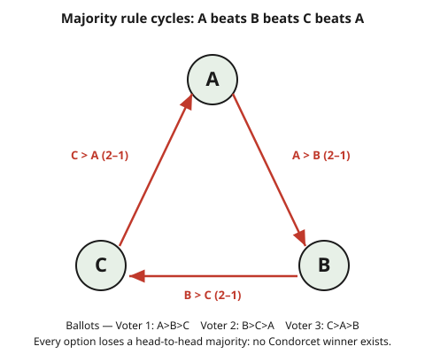

# Grad Game Theory · Lesson 5.1: Social choice and impossibility

> ⏱ ~15 min · Module 5: Mechanism design · Builds on: [4.5 Signaling games and refinements](04-05-signaling-games-refinements.md) · Unlocks: [5.2 The revelation principle and incentive compatibility](05-02-revelation-principle-incentive-compatibility.md)

## Why this matters

Mechanism design is the engineering half of game theory: instead of taking a game and predicting play, we *build* the game so that self-interested play yields an outcome we want. The prototype problem is aggregation — a committee, an electorate, or a market must fold many private preferences into one collective decision. Before we design anything clever, honesty demands we first map the walls. This lesson is the three great impossibility results (Condorcet, Arrow, Gibbard–Satterthwaite) plus the one clean escape (single-peakedness and the median voter). Every positive result in the rest of the module is a way of climbing over one of these walls.

## The idea

Take three friends choosing a restaurant among A, B, C by majority vote. Ann likes A best, then B; Bo likes B best, then C; Cal likes C best, then A. Ask "A or B?" and two of three say A. Ask "B or C?" and two of three say B. So A beats B beats C — you'd expect A to beat C. Ask anyway: "A or C?" and two of three say **C**. Majority preference *cycles*: $A \succ B \succ C \succ A$. There is no most-preferred option; whoever controls the *agenda* (which pair gets voted on last) controls the winner.

That's the Condorcet paradox, and it is not a fluke of this example — it's a symptom. **Arrow's theorem** says the disease is incurable: no rule for turning individual rankings into a social ranking can be simultaneously sensible (respects unanimity), informationally clean (ignores irrelevant options), and democratic (no dictator), once there are three or more alternatives. **Gibbard–Satterthwaite** is the same wall wearing strategic clothes: any reasonable rule for *choosing* a winner can be gamed — some voter, somewhere, does better by lying about their preferences.

The one reliable way out is to give up on ranking *arbitrary* options. If alternatives sit on a line (tax rates, thermostat settings, left–right politics) and each voter has a single most-preferred point with falling enthusiasm as you move away, the cycles vanish and the **median voter's** ideal point wins — and no one can gain by lying. Restricting the *domain* of preferences is how design becomes possible. That is the thread through the whole module.

## The formal version

Let $X$ be a finite set of alternatives with $|X| \ge 3$, and let there be $n$ agents. Each agent $i$ has a preference ordering $\succ_i$ — a complete, transitive strict ranking of $X$ (write $x \succ_i y$ for "$i$ strictly prefers $x$ to $y$"). A **profile** $\succ\, = (\succ_1, \dots, \succ_n)$ lists everyone's ranking.

**Condorcet winner.** An alternative $x$ is a *Condorcet winner* if it beats every other alternative in pairwise majority voting: for all $y \ne x$, a strict majority of agents have $x \succ_i y$.

> In words: the option that would win every head-to-head runoff. The paradox is that it need not exist — majority preference can cycle.

**Social welfare function (SWF).** A map $F$ from profiles to a *social ordering* $\succ_F$ of $X$ (again complete and transitive). Arrow's four axioms:

- **Unrestricted domain (U):** $F$ is defined on *every* logically possible profile of rational orderings.
  > In words: the rule must return an answer no matter how people rank things; no profiles are ruled out in advance.
- **Weak Pareto (P):** if $x \succ_i y$ for *every* agent $i$, then $x \succ_F y$.
  > In words: if everybody strictly prefers $x$ to $y$, so does society.
- **Independence of irrelevant alternatives (IIA):** society's ranking of $x$ versus $y$ depends only on how each agent ranks $x$ versus $y$ — not on where any third option $z$ sits.
  > In words: to decide $x$ vs $y$, look only at $x$-vs-$y$ opinions; a distant option $z$ can't flip the verdict.
- **Non-dictatorship (D):** there is no agent $i$ such that $x \succ_i y \Rightarrow x \succ_F y$ for all pairs and all profiles.
  > In words: no single person's strict ranking is always copied by society.

**Arrow's Impossibility Theorem.** If $|X| \ge 3$, no SWF satisfies U, P, IIA, and D simultaneously. Equivalently: any SWF satisfying U, P, and IIA is a *dictatorship*.

> In words: sensible, informationally-clean aggregation of rankings over three-plus options forces exactly one person to be king.

*Why (decisive-set contraction, honest sketch).* Call a coalition $S$ **decisive for $x$ over $y$** if, whenever every member of $S$ has $x \succ_i y$, society has $x \succ_F y$. Weak Pareto says the whole population is decisive (for every pair). Two lemmas do the work. **Field expansion:** using IIA and U, if $S$ is decisive for *some* pair, it is decisive for *every* pair — "locally decisive" upgrades to "globally decisive." **Group contraction:** if a globally decisive coalition has more than one member, split it in two; a clever profile plus IIA forces one of the halves to be decisive by itself. Start from the whole population and contract, halving again and again, until a *single* agent is decisive over everything — a dictator. The engine is IIA: it lets a verdict on one pair pin down verdicts on others, so power can't stay diffuse.

**Social choice function (SCF).** A map $f$ from profiles directly to a *single chosen alternative* $f(\succ) \in X$. Call $f$ **onto** if every alternative is chosen for some profile (so the effective range has $\ge 3$ options), and **dictatorial** if some agent's top choice is always selected. Define, for the strategic question, agent $i$'s *reported* ranking $\succ_i'$ (possibly a lie).

$f$ is **strategy-proof** if for every agent $i$, every profile, and every misreport $\succ_i'$,
$$f(\succ_i, \succ_{-i}) \;\succeq_i\; f(\succ_i', \succ_{-i}),$$
where $\succ_{-i}$ is everyone else's reports and $\succeq_i$ is $i$'s *true* preference.

> In words: telling the truth is a dominant strategy — whatever others report, you never do strictly better by misreporting your ranking.

**Gibbard–Satterthwaite Theorem.** If $|X| \ge 3$ and $f$ is onto and strategy-proof, then $f$ is dictatorial. Equivalently: any non-dictatorial, onto SCF over three-plus alternatives is **manipulable** — some agent, at some profile, strictly gains by lying.

> In words: the strategic twin of Arrow. You cannot design a non-dictatorial voting rule where honesty is always optimal. This is *the* motivation for mechanism design: if truthfulness is impossible in general, when is it possible? (Answer, later in the module: restrict the domain, or add money.)

**The escape — single-peaked preferences.** Suppose $X$ sits on a line (identify $X$ with points on $\mathbb{R}$). Agent $i$'s preference is **single-peaked** if there is an ideal point $p_i$ such that moving away from $p_i$ in either direction strictly lowers $i$'s ranking: if $p_i \le y < z$ or $z < y \le p_i$, then $y \succ_i z$.

> In words: each voter has one favorite point and likes options less the farther they are from it — one peak, slopes down on both sides.

**Median Voter Theorem.** With single-peaked preferences and an odd number $n$ of agents, let $p_{(m)}$ be the *median* of the ideal points $p_1, \dots, p_n$. Then $p_{(m)}$ is a Condorcet winner, and the rule "choose the median reported peak" is strategy-proof.

> In words: line up everyone's favorite point; the middle one wins every runoff, and no one can move the outcome toward themselves by lying about their peak.

## Picture

## Worked examples

**Example 1 (mechanical — the Condorcet paradox, fully computed).** Three voters over $X = \{A, B, C\}$:

| Voter | Ranking |
|-------|---------|
| 1 | $A \succ B \succ C$ |
| 2 | $B \succ C \succ A$ |
| 3 | $C \succ A \succ B$ |

Compute all three pairwise majorities (each voter votes for whichever of the pair they rank higher):

- **A vs B:** Voter 1 → A, Voter 2 → B, Voter 3 → A. Tally 2–1, so $A \succ B$ socially.
- **B vs C:** Voter 1 → B, Voter 2 → B, Voter 3 → C. Tally 2–1, so $B \succ C$.
- **C vs A:** Voter 1 → A, Voter 2 → C, Voter 3 → C. Tally 2–1, so $C \succ A$.

Putting it together: $A \succ B \succ C \succ A$. The social "preference" is a **cycle**, hence intransitive. No alternative beats both others, so there is **no Condorcet winner**. Consequence: sequential agenda voting is a dictatorship of the agenda-setter. Vote {A vs B} first, winner vs C: A beats B, then C beats A — C wins. Vote {B vs C} first, winner vs A: B beats C, then A beats B — A wins. Same electorate, same preferences, different winner just from the order. This is exactly why aggregation is hard, and why Arrow's negative result feels inevitable once you've seen it.

**Example 2 (why you'd care — single-peakedness rescues the vote, and rewards honesty).** Five voters must pick a property-tax rate from $X = \{0,2,4,6,8,10\}$ percent. Ideal rates (peaks) are
$$p_1 = 1,\quad p_2 = 3,\quad p_3 = 6,\quad p_4 = 8,\quad p_5 = 9,$$
and each voter's preference is single-peaked (closer to my ideal is strictly better). The median peak is $p_{(3)} = 6$.

*Claim: 6 is the Condorcet winner.* Take any challenger, say $y = 4$ (to the left of 6). Everyone with a peak $\ge 6$ — voters 3, 4, 5 — is closer to 6 than to 4, so they prefer 6; that's already a strict majority (3 of 5). By the mirror argument any challenger $y > 6$ loses because voters 1, 2, 3 (peaks $\le 6$) are closer to 6. So 6 beats every alternative pairwise: Condorcet winner. Single-peakedness killed the cycle — the "left of the median" and "right of the median" coalitions can never both muster a majority against the median, because the median voter sits in whichever coalition faces the challenger.

*Claim: the median rule is strategy-proof here.* Consider voter 5 (true peak 9), unhappy that 6 won. Can lying help? Reported peaks are $1,3,6,8,\,p_5'$; the outcome is their median. If voter 5 reports anything $\ge 6$ (including the truth), the sorted middle value stays 6 — no change. If voter 5 reports something $< 6$, the median can only move *down*, i.e., *farther* from 9 — strictly worse. There is no report that pulls the median up toward 9, because 9 is already above the median: voter 5 is on the outside and cannot cross the middle. Every voter faces the same logic, so truth-telling is dominant. This is the constructive heart of the whole module: **restrict the domain to single-peaked preferences and you get a rule that is both Condorcet-consistent and strategy-proof** — precisely what Arrow and Gibbard–Satterthwaite forbid on the unrestricted domain.

## Watch out

- **Arrow is about ordinal, non-comparable rankings.** The axioms feed on *orderings* only — no strength of preference, no interpersonal comparison. The moment you allow cardinal utilities you can compare across people (utilitarian sums, or money transfers), you leave Arrow's world. That's not a loophole in the proof; it's a different object. VCG (Lesson 5.3) escapes precisely by buying strength-of-preference information with transfers.
- **IIA is the contentious axiom, and it's what powers the proof.** Weak Pareto and non-dictatorship are hard to argue with; unrestricted domain is a modeling choice. IIA — "the social ranking of $x$ vs $y$ ignores everything about $z$" — is what rules out Borda counts and any scoring rule, and it's the lever the decisive-set contraction pulls. Most "solutions to Arrow" are really rejections of IIA.
- **Gibbard–Satterthwaite is not Arrow, though they're twins.** Arrow aggregates *orderings* into an ordering; GS chooses a *single winner* and asks about *lying*. They're proved from each other, but keep the objects straight: SWF (ranking out) versus SCF (one alternative out), and "inconsistent axioms" versus "manipulable." Confusing them will cost you on a qualifying exam.
- **Single-peakedness is a restriction on preferences, not on alternatives.** The alternatives always sit on the line; the assumption is that *every voter's* preference is a tent over that line. One voter with two peaks (loves extremes, hates the middle) can bring the cycle back. The theorem needs the whole profile inside the restricted domain.
- **Strategy-proof means truth is a *dominant* strategy** — best regardless of others' reports — not merely a Nash equilibrium. It's the strongest incentive guarantee, which is exactly why GS says you usually can't have it.

## One-liner

> Aggregating three-plus ordinal preferences into a sensible, non-dictatorial rule is impossible (Arrow) and unavoidably manipulable (Gibbard–Satterthwaite) — unless you restrict the domain, and single-peaked preferences hand you the median voter, who wins honestly.

## Problems

**P1 (🟢)** Three voters rank $X = \{a, b, c\}$:

| Voter | Ranking |
|-------|---------|
| 1 | $a \succ b \succ c$ |
| 2 | $c \succ a \succ b$ |
| 3 | $b \succ c \succ a$ |

Compute the three pairwise majority outcomes and state whether a Condorcet winner exists.

**P2 (🟡)** Five voters have single-peaked preferences over $X = \{1,2,3,4,5,6,7\}$ with peaks $p = (2, 2, 5, 6, 7)$.
(a) Which alternative is the Condorcet winner under majority rule? Justify with one pairwise check against an alternative on each side.
(b) The voter with peak 2 would love a lower outcome. Under the "median of reported peaks" rule, show they cannot gain by misreporting.

**P3 (🔴, optional)** *Manipulating plurality — a Gibbard–Satterthwaite instance.* Nine voters choose among $\{L, M, R\}$ by plurality (each casts one vote for their reported top choice; most votes wins, ties broken alphabetically). True preferences:

- 4 voters: $R \succ M \succ L$
- 3 voters: $L \succ M \succ R$
- 2 voters: $M \succ L \succ R$

(a) Find the sincere-voting winner. (b) Exhibit a group of voters who, by *misreporting* their top choice, change the winner to an outcome they *all strictly prefer* to the sincere result. (c) In one sentence, connect this to Gibbard–Satterthwaite.

Solutions

**P1** Each voter backs whichever option they rank higher.

- **a vs b:** Voter 1 → a, Voter 2 → a ($a \succ b$ inside $c \succ a \succ b$), Voter 3 → b. Tally 2–1: $a \succ b$.
- **b vs c:** Voter 1 → b, Voter 2 → c ($c \succ b$), Voter 3 → b. Tally 2–1: $b \succ c$.
- **c vs a:** Voter 1 → a, Voter 2 → c, Voter 3 → c ($c \succ a$ inside $b \succ c \succ a$). Tally 2–1: $c \succ a$.

Social preference is $a \succ b \succ c \succ a$ — a cycle, intransitive. **No Condorcet winner exists:** each option loses one of its two head-to-heads.

**P2** Sort the peaks: $2, 2, 5, 6, 7$. The median (3rd of 5) is $p_{(3)} = 5$.

(a) **The Condorcet winner is 5.** Check a challenger on each side.
- Against $y = 3$ (left of 5): voters with peaks $\ge 5$ — the ones at 5, 6, 7 — are all at least as close to 5 as to 3, and strictly closer, so they prefer 5. That's 3 of 5, a majority. So $5 \succ 3$.
- Against $y = 6$ (right of 5): voters with peaks $\le 5$ — the two at 2 and the one at 5 — are closer to 5 than to 6, so they prefer 5. Again 3 of 5. So $5 \succ 6$.

The median voter (peak 5) joins whichever side opposes the challenger, giving that side the majority every time; hence 5 beats all alternatives.

(b) A voter with true peak 2 wants a *lower* outcome, but the current outcome 5 is *above* their peak, so they'd want to pull the median *down*. Reported peaks are $2, ?, 5, 6, 7$ with "?" the deviator's report. The outcome is the median (3rd-smallest) of the five reports.
- Report anything $\le 5$ (including the truth, 2): the sorted middle stays 5 — the two values 5, 6, 7 still occupy the top three slots, so the 3rd-smallest is 5. No change.
- Report anything $> 5$: you've only added a *higher* value, so the median stays 5 or rises — moving *away* from 2, strictly worse.

No report lowers the outcome below 5, because to move the median down you'd need to displace one of the values $\{5,6,7\}$ from the top three, and a single voter reporting low cannot do that (there are still three reports $\ge 5$). Truth-telling is (weakly) best: the rule is strategy-proof for this voter, and by symmetry for all.

**P3**
(a) **Sincere tallies:** $R = 4$, $L = 3$, $M = 2$. Plurality winner is **R** (most votes).

(b) The 3 voters with $L \succ M \succ R$ get their worst outcome, R, under sincere voting. If they **misreport their top as $M$** instead of $L$, the tallies become $R = 4$, $M = 2 + 3 = 5$, $L = 0$. Now **M wins**. Each of these three voters strictly prefers M to R (their sincere-vote result), so all three are strictly better off — a profitable joint manipulation. (Even the 2 sincere $M$-voters are happier, but the point is the deviators gain.)

(c) Plurality over three alternatives is onto and non-dictatorial, so Gibbard–Satterthwaite guarantees it must be manipulable at some profile — and this is such a profile, where "compromise" voting (abandoning a doomed favorite for a viable second choice) strictly helps the manipulators.

## Flashback

**From Lesson 2.1 (Normal form: dominance and rationalizability):** In the game below, Player 1 chooses a row $\{U, M, D\}$ and Player 2 a column $\{L, C, R\}$; entries are $(u_1, u_2)$. Find the strategies surviving iterated elimination of strictly dominated strategies, and the resulting outcome.

|        | L | C | R |
|--------|-------|-------|-------|
| **U** | $(4,3)$ | $(5,1)$ | $(6,2)$ |
| **M** | $(2,1)$ | $(8,4)$ | $(3,6)$ |
| **D** | $(3,0)$ | $(9,6)$ | $(2,8)$ |

Solution

Eliminate iteratively, checking strict dominance at each step.

1. **Player 2's column C is strictly dominated by R.** Compare Player 2's payoffs: column C gives $(1, 4, 6)$ across rows $U, M, D$; column R gives $(2, 6, 8)$. Since $2 > 1$, $6 > 4$, $8 > 6$, R strictly dominates C. Delete **C**.

2. Remaining board (columns L, R):

   |        | L | R |
   |--------|-------|-------|
   | **U** | $(4,3)$ | $(6,2)$ |
   | **M** | $(2,1)$ | $(3,6)$ |
   | **D** | $(3,0)$ | $(2,8)$ |

   **Player 1's row M is strictly dominated by U:** U gives $(4, 6)$ across L, R; M gives $(2, 3)$. Since $4 > 2$ and $6 > 3$, delete **M**.

3. Remaining rows U, D:

   |        | L | R |
   |--------|-------|-------|
   | **U** | $(4,3)$ | $(6,2)$ |
   | **D** | $(3,0)$ | $(2,8)$ |

   **Row D is strictly dominated by U:** U gives $(4, 6)$, D gives $(3, 2)$; $4 > 3$ and $6 > 2$. Delete **D**. Only **U** remains for Player 1.

4. With Player 1 fixed at U, Player 2 chooses between L (payoff 3) and R (payoff 2), so picks **L**.

**Unique survivor: $(U, L)$, with payoffs $(4, 3)$.** The game is dominance-solvable, so this profile is also the unique rationalizable outcome and the unique Nash equilibrium. Note the order of elimination didn't matter here — but with *strict* dominance the surviving set is order-independent in general, which is why IESDS is well-defined.

## Connections

- **Backward:** the flashback ties this to [2.1](02-01-normal-form-dominance-rationalizability.md)'s dominance — strategy-proofness is just "truth strictly/weakly dominates every lie," dominance applied to a reporting game. And single-peakedness echoes the *quasiconcavity* that made best responses well-behaved back in [1.1](01-01-convex-sets-functions-separating-hyperplanes.md).
- **Forward:** because manipulation is the enemy, [5.2 The revelation principle](05-02-revelation-principle-incentive-compatibility.md) shows we lose nothing by restricting attention to *truthful direct mechanisms* — turning "design any mechanism" into "design an incentive-compatible one." [5.3 VCG](05-03-dominant-strategy-mechanisms-vcg.md) then escapes Gibbard–Satterthwaite by adding money (transfers buy the cardinal information Arrow forbade), and [5.5 Myerson–Satterthwaite](05-05-limits-of-efficient-design.md) shows a fresh impossibility survives *even with* transfers — the bilateral-trade wall. The whole module is walls and ladders.
- **Sideways (welfare economics):** Arrow's theorem is the capstone of general-equilibrium welfare theory — read there as "there is no social welfare ordering aggregating consumers' preferences that respects unanimity and independence without a dictator," the market-framed version of the very same result. See [grad-micro](../../grad-micro/syllabus.md).
- **Sideways (proof craft):** the decisive-set contraction is a model impossibility argument — assume the axioms, extract a structural object (a decisive coalition), and shrink it to a contradiction with non-dictatorship. The template (Pareto seeds it, IIA propagates it, contraction collapses it) recurs across economic theory; see [proofs-primer](../../proofs-primer/syllabus.md) on structuring impossibility and no-go proofs.
- **The syllabus** spine for this course lives at [syllabus](../syllabus.md).
