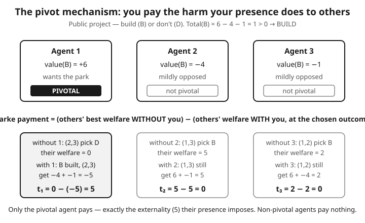

# Grad Game Theory · Lesson 5.3: Dominant-strategy mechanisms — VCG

> ⏱ ~15 min · Module 5: Mechanism design · Builds on: [5.2 The revelation principle and incentive compatibility](05-02-revelation-principle-incentive-compatibility.md) · Unlocks: [5.4 Bayesian mechanism design and the optimal auction](05-04-bayesian-mechanism-design-optimal-auction.md)

## Why this matters

You want to choose the socially best outcome — allocate a good to whoever values it most, build a bridge exactly when it's worth building — but the values live private in people's heads, and asking invites lying. The revelation principle ([5.2](05-02-revelation-principle-incentive-compatibility.md)) told us we can restrict attention to truthful direct mechanisms; it did *not* tell us one exists that's also efficient. This lesson delivers the punchline of dominant-strategy design: with money on the table, you *can* make honesty a dominant strategy while still selecting the welfare-maximizing outcome. The trick — VCG — is the single most important positive result in mechanism design, and the second-price auction you already met in [4.2](../../game-theory-refresher/syllabus.md) is just its smallest instance.

## The idea

Here's the whole thing in one sentence: **make each agent's paycheck equal to the total welfare of everyone else, so that maximizing their own payoff means maximizing the group's.**

Suppose a planner will pick some alternative $x$ (who wins the item, whether to build the bridge) after each agent $i$ reports a value $v_i(x)$ for each option. The efficient choice is the $x$ that maximizes the *sum* of everyone's values. The danger: if agent $i$'s payment doesn't depend on the others, $i$ just reports whatever tilts $x$ their way, truth be damned.

Groves' fix: tie $i$'s payment to *the others' reported welfare at the chosen $x$*. Then $i$'s total payoff becomes "my own value plus everybody else's value" — which is exactly the quantity the planner is maximizing. Agent $i$ now *wants* the efficient alternative chosen, because their interests and society's have been welded together. And since the planner picks the welfare-maximizer given the reports, $i$'s best move is to report honestly so the planner computes on true numbers.

The Clarke pivot is the natural way to set the free constant: charge each agent **the externality they impose on everyone else** — how much worse off the rest of the world is *because you showed up*. If your presence changes nothing about what the others get, you pay nothing. If your presence bumps someone out of a good, you pay the harm you caused. That's it: you pay for the difference your existence makes to the group.

## The formal version

Setup: agents $i = 1,\dots,n$, a set of alternatives $X$, quasilinear utility

$$u_i = v_i(x) - t_i,$$

where $v_i(x)$ is $i$'s value for alternative $x$ (private) and $t_i$ is the payment $i$ makes to the planner. Reports are $\hat v_i$; let $\hat v = (\hat v_1,\dots,\hat v_n)$ and $\hat v_{-i}$ be everyone's reports but $i$'s.

**Efficient allocation.** The planner chooses

$$x^*(\hat v) \in \arg\max_{x \in X} \sum_{j=1}^{n} \hat v_j(x).$$

*In words:* pick the alternative that maximizes the total reported value.

**Groves mechanism.** Charge

$$t_i = h_i(\hat v_{-i}) - \sum_{j \neq i} \hat v_j\big(x^*(\hat v)\big),$$

where $h_i$ is any function of the *other* agents' reports (not of $\hat v_i$). *In words:* your bill is some baseline that doesn't depend on you, minus the welfare everyone else gets under the chosen alternative — so you're rebated the good you do for others.

**Theorem (Groves).** In any Groves mechanism, truthful reporting $\hat v_i = v_i$ is a *dominant strategy* for every agent. *In words:* whatever anyone else reports, honesty maximizes your payoff — no beliefs about others required.

*Why:* fix $\hat v_{-i}$. Agent $i$'s payoff from inducing alternative $x$ is

$$v_i(x) - t_i = v_i(x) + \sum_{j\neq i}\hat v_j(x) - h_i(\hat v_{-i}).$$

The $h_i$ term is a constant to $i$. So $i$ wants the planner to choose the $x$ maximizing $v_i(x) + \sum_{j\neq i}\hat v_j(x)$ — using $i$'s *true* $v_i$. But the planner maximizes $\hat v_i(x) + \sum_{j\neq i}\hat v_j(x)$. Setting $\hat v_i = v_i$ makes those objectives identical, so truth secures $i$'s most-preferred outcome. $\square$

**VCG / Clarke pivot.** Take the specific baseline

$$h_i(\hat v_{-i}) = \max_{x \in X} \sum_{j \neq i} \hat v_j(x),$$

the best welfare the *others* could achieve if $i$ were absent. Then

$$t_i = \underbrace{\max_{x}\sum_{j\neq i}\hat v_j(x)}_{\text{others' welfare without } i} \;-\; \underbrace{\sum_{j\neq i}\hat v_j\big(x^*(\hat v)\big)}_{\text{others' welfare with } i}.$$

*In words:* you pay exactly the externality you impose — the drop in everyone else's total welfare caused by your being in the room. Each term is a welfare of *others only*; compute both and subtract.

**Properties.** VCG is (i) **efficient** — it implements $x^*$; (ii) **DSIC** — truth is dominant, a Groves mechanism; (iii) **individually rational** and (iv) **no positive transfers** (agents never get paid, only pay) under standard conditions (nonnegative values, free disposal). Both terms in $t_i$ are welfares over the same alternative set, so $t_i \ge 0$, and pivotal agents pay while non-pivotal agents pay $0$.

## Picture

## Worked examples

**Example 1 (public project — build or not).** Three residents decide whether to build a shared park ("build" $B$ vs "don't" $D$). Values for $B$ relative to $D$ (which is normalized to $0$ for all):

$$v_1(B) = 6,\quad v_2(B) = -4,\quad v_3(B) = -1.$$

Agent 1 wants it; agents 2 and 3 mildly don't (say the park costs them peace and quiet).

*Efficient decision.* Total value of $B$ is $6 - 4 - 1 = 1 > 0$, and of $D$ is $0$. So $x^* = B$: **build**.

*Clarke payments.* For each $i$, compare the others' best welfare without $i$ against their welfare at $x^*=B$.

- **Agent 1.** Without 1, the others are agents 2,3 with values $v_2(B)+v_3(B) = -5$ for $B$ vs $0$ for $D$ — they'd choose $D$, welfare $0$. With 1 present, $x^*=B$ and the others get $-4 + (-1) = -5$. Externality $t_1 = 0 - (-5) = 5$. Agent 1 is **pivotal**: her presence flipped the decision to build, harming the others by $5$, so she pays $5$. Her payoff: $6 - 5 = 1 > 0$.
- **Agent 2.** Without 2, others are 1,3 with $6 + (-1) = 5$ for $B$ vs $0$ — they'd choose $B$, welfare $5$. With 2 present, $x^* = B$ still, others (1,3) get $6 + (-1) = 5$. Externality $t_2 = 5 - 5 = 0$. **Not pivotal** — the outcome $B$ would have happened without him — so he pays $0$.
- **Agent 3.** Symmetric: without 3, agents 1,2 have $6 + (-4) = 2 > 0$, choose $B$, welfare $2$; with 3, they get $6 + (-4) = 2$. Externality $t_3 = 2 - 2 = 0$. Pays $0$.

Only the pivotal agent (1) pays, and she pays exactly the harm she caused. **Truth is dominant:** could agent 2 gain by lying? To flip the decision to $D$ he'd need to report $\hat v_2(B) \le -7$ (so the reported total drops below $0$). Then $x^*=D$, and his Clarke bill is again the others' externality — but he's now stuck with $D$ when he actually *slightly* preferred nothing anyway... check payoff: truthful gives him $v_2(B) - 0 = -4$; lying to force $D$ gives $v_2(D) - t_2 = 0 - t_2$. His $t_2$ under $D$: others without 2 get $\max(5, 0) = 5$; others with 2 at $x^*=D$ get $0$; so $t_2 = 5 - 0 = 5$, payoff $0 - 5 = -5 < -4$. Lying is strictly worse. The externality payment perfectly punishes manipulation.

**Example 2 (single item: VCG = second-price).** One indivisible good, bidders with values $v_1 = 10 > v_2 = 7 > v_3 = 3$. Alternatives: give it to 1, 2, or 3. Efficient: give to bidder 1 (highest value), welfare $10$.

Bidder 1's Clarke payment: others' best welfare without 1 is give-to-2, worth $7$. Others' welfare with 1 present (item goes to 1, so 2 and 3 get $0$) is $0$. So

$$t_1 = 7 - 0 = 7 = v_2,$$

the **second-highest value** — the winner pays the runner-up's bid. That's the Vickrey second-price auction, recovered exactly. Bidders 2 and 3 are non-pivotal (the item goes to 1 with or without them), so they pay $0$. VCG is the multi-item, combinatorial generalization of this one move.

*Budget note.* Here the seller collects $7$ and keeps it — money leaves the agents. That's fine for an auction (revenue), but the same "money must exit" feature becomes a *deficit* in public-goods settings where there's no seller to absorb it (Example 1: the planner collects $5$ from agent 1 and cannot rebate it without breaking incentives). VCG is **not budget-balanced** in general.

## Watch out

- **You might think** the pivot payment is about *your own* value. **Actually** it's the externality on *others*: compute the others' welfare with you vs. without you, and subtract. Your own $v_i$ enters only through *which* alternative gets chosen, never directly into your bill.
- **You might think** VCG's dominant-strategy truthfulness makes it manipulation-proof. **Actually** it's only *unilateral* deviations that fail. VCG is notoriously vulnerable to **collusion** (a losing coalition coordinating bids to lower payments) and **shill / false-name bids** (one agent entering as several to shrink the "world without me"). DSIC ≠ coalition-proof.
- **You might think** efficiency comes free. **Actually** VCG is generically **not budget-balanced** — payments needn't sum to any target, so surplus money must leave the system, and in public-goods problems the mechanism runs a *deficit*. You can't redistribute the collected payments back without destroying the incentives. This tension is the heart of the Myerson–Satterthwaite impossibility ([5.5]).
- **You might think** efficient means revenue-maximizing. **Actually** VCG maximizes *welfare*, not the seller's *revenue* — a revenue-optimal auction (Myerson, [5.4](05-04-bayesian-mechanism-design-optimal-auction.md)) deliberately distorts the allocation (reserve prices, exclusion) and is a different object entirely.

## One-liner

> Pay each agent the welfare of everyone else — equivalently, charge them the harm their presence does to the group — and truth becomes dominant while the efficient outcome is chosen; the second-price auction is this idea with one item.

## Problems

**P1 (🟢)** Two bidders want one item, values $v_1 = 12$, $v_2 = 5$. Find the efficient allocation and each bidder's VCG (Clarke pivot) payment. Confirm it matches the second-price rule and state each bidder's net payoff.

**P2 (🟡)** A public project has value $v_1 = 8$, $v_2 = 3$, $v_3 = -6$ for "build" (with "don't" $= 0$ for all). (a) Is building efficient? (b) Compute each agent's Clarke payment and identify who is pivotal. (c) Show that agent 3 cannot profit by exaggerating his opposition to $\hat v_3 = -20$.

**P3 (🔴, optional)** Two identical items, three bidders, each wanting *at most one* item, with values $v_1 = 9$, $v_2 = 6$, $v_3 = 4$. Items go to the two highest values. (a) Find the efficient allocation and each winner's VCG payment (each winner's externality = the value of the highest *excluded* bidder they displace). (b) Compute total revenue and comment on whether the two winners pay the same.

Solutions

**P1** Efficient: give the item to bidder 1 (higher value), welfare $12$.
Bidder 1's Clarke payment: others' welfare without 1 is give-to-2 $= 5$; others' welfare with 1 (item to 1, so 2 gets $0$) is $0$. $t_1 = 5 - 0 = 5 = v_2$ — the second price. ✓
Bidder 2 is non-pivotal (item goes to 1 regardless of 2), $t_2 = 0$.
Net payoffs: bidder 1 gets $12 - 5 = 7$; bidder 2 gets $0$. Truth-telling matches the classic Vickrey outcome.

**P2** (a) Total value of build $= 8 + 3 - 6 = 5 > 0$, so **building is efficient**.

(b) For each $i$: others' best welfare without $i$ minus others' welfare at $x^*=$ build.
- Agent 1: without 1, others (2,3) have $3 - 6 = -3$ for build vs $0$ → choose don't, welfare $0$. With 1, others get $3 - 6 = -3$. $t_1 = 0 - (-3) = 3$. **Pivotal** (his presence flips to build), pays $3$; payoff $8 - 3 = 5$.
- Agent 2: without 2, others (1,3) have $8 - 6 = 2 > 0$ → build, welfare $2$. With 2, others get $8 - 6 = 2$. $t_2 = 2 - 2 = 0$. Not pivotal.
- Agent 3: without 3, others (1,2) have $8 + 3 = 11 > 0$ → build, welfare $11$. With 3, others get $8 + 3 = 11$. $t_3 = 11 - 11 = 0$. Not pivotal.

Only agent 1 is pivotal and pays $3$.

(c) Truthful, agent 3's payoff is $v_3(\text{build}) - t_3 = -6 - 0 = -6$. To change the outcome he must force "don't," which needs the reported total $\le 0$, i.e. $\hat v_3 \le -11$; $\hat v_3 = -20$ does it. Then $x^* = $ don't. Agent 3's Clarke bill under "don't": others without 3 get $\max(11, 0) = 11$; others with 3 at $x^*=$ don't get $0$; so $t_3 = 11 - 0 = 11$. Payoff $= v_3(\text{don't}) - 11 = 0 - 11 = -11 < -6$. Lying is strictly worse — the externality he'd impose by blocking the project ($11$) is charged straight to him.

**P3** (a) Two highest values are bidders 1 ($9$) and 2 ($6$); bidder 3 ($4$) is excluded. Efficient welfare $= 9 + 6 = 15$.
Each winner's externality is the harm to others from taking one of the two slots — namely the value of the top *excluded* bidder they push out.
- Bidder 1's payment: others' best welfare without 1 is give both items to the next two, bidders 2 and 3: $6 + 4 = 10$. Others' welfare with 1 (items to 1 and 2, so bidder 3 excluded, bidder 2 gets $6$): $6$. $t_1 = 10 - 6 = 4$.
- Bidder 2's payment: others' best welfare without 2 is items to 1 and 3: $9 + 4 = 13$. Others' welfare with 2 (items to 1 and 2, bidder 3 gets $0$, bidder 1 gets $9$): $9$. $t_2 = 13 - 9 = 4$.

Both winners pay $4$ — the value of the highest excluded bidder ($v_3 = 4$), which is the uniform market-clearing price for a homogeneous good.

(b) Total revenue $= t_1 + t_2 = 8$. Yes, the two winners pay the *same* price $4$, even though their values ($9$ and $6$) differ: with identical items and unit demand, each winner's externality is the same displaced bidder, so VCG reduces to a uniform-price auction at the highest losing bid. (Net payoffs: bidder 1 gets $9 - 4 = 5$, bidder 2 gets $6 - 4 = 2$.)

## Flashback

**From Lesson 5.2 (The revelation principle and incentive compatibility):** A direct mechanism has one agent with two possible types, $\theta_H$ and $\theta_L$. Under truthful reporting, type $\theta_H$ gets allocation-value $9$ and pays $5$; type $\theta_L$ gets value $4$ and pays $1$. State the two incentive-compatibility (IC) constraints this mechanism must satisfy, and verify they hold.

Solution

IC requires each type to prefer reporting truthfully over mimicking the other. With quasilinear utility $u = v - t$:

- **Type $\theta_H$ won't mimic $\theta_L$:** truthful payoff $9 - 5 = 4$ must be $\ge$ payoff from claiming $\theta_L$. If $\theta_H$ reports $\theta_L$, she gets the $\theta_L$ *outcome* — but valued at *her* type. Here the allocation value listed ($4$, $9$) is the type's own value for the allocation it receives; a high type mimicking low gets the low allocation, worth (say) her value for it. Taking the mechanism's stated own-values, the binding comparison is $9 - 5 = 4 \ge 4' - 1$ where $4'$ is $\theta_H$'s value for the low allocation. With the low allocation worth no more to $\theta_H$ than $4' \le 5$, i.e. $4 \ge 4' - 1 \iff 4' \le 5$, IC-H holds.
- **Type $\theta_L$ won't mimic $\theta_H$:** truthful payoff $4 - 1 = 3$ must be $\ge$ payoff from claiming $\theta_H$, which gives the high allocation valued at $\theta_L$'s value $v_L^H$ minus payment $5$: $3 \ge v_L^H - 5 \iff v_L^H \le 8$.

The clean takeaway (and the point of the drill): **IC is a pair of "no-envy across types" inequalities** — each type's truthful net utility must weakly beat what it would get by grabbing the other type's (allocation, payment) bundle. The high type's constraint typically binds (she's tempted to understate to pay the low price), which is exactly the information rent that reappears in [5.4](05-04-bayesian-mechanism-design-optimal-auction.md).

## Connections

- **Backward:** [5.2](05-02-revelation-principle-incentive-compatibility.md) let us restrict to truthful direct mechanisms; VCG is a *constructive* proof that an efficient one exists in dominant strategies. It's why transfers matter — [5.1] showed Gibbard–Satterthwaite dooms non-trivial dominant-strategy implementation *without* money; VCG escapes precisely because quasilinear payments break the theorem's no-transfer assumption.
- **Backward:** the second-price auction from [4.2](../../game-theory-refresher/syllabus.md) — where truthful bidding is weakly dominant and the winner pays the runner-up — is exactly VCG with one item (Example 2, P1).
- **Forward:** [5.4](05-04-bayesian-mechanism-design-optimal-auction.md) drops the demand for full efficiency and maximizes the *seller's* revenue instead (Myerson's optimal auction), trading welfare for money via reserve prices — the deliberate opposite of VCG.
- **Forward:** [5.5] (Myerson–Satterthwaite) formalizes VCG's Achilles' heel — you cannot generally have efficiency *and* budget balance *and* individual rationality at once; VCG buys the first and third by sacrificing the second.
- **Sideways (grad micro):** VCG is the canonical device for eliciting valuations of a **public good** and deciding whether to provide it (Example 1 is the two-outcome case) — the same problem, and the same deficit pathology, studied under public-goods provision in [grad-micro](../../grad-micro/syllabus.md).
