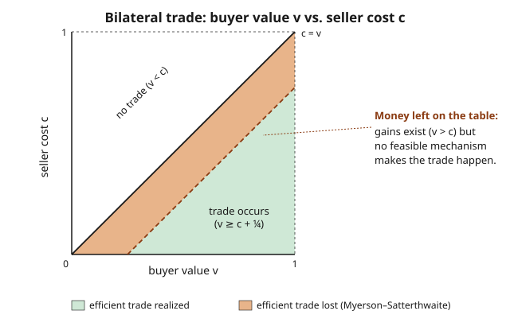

# Grad Game Theory · Lesson 5.5: The limits of efficient design

> ⏱ ~15 min · Module 5: Mechanism design · Builds on: [5.4 Bayesian mechanism design and the optimal auction](05-04-bayesian-mechanism-design-optimal-auction.md) · Unlocks: [6.1 Coalitional games and the core](06-01-coalitional-games-core.md)

## Why this matters

So far mechanism design has felt like a workshop with the right tool for every job: want a truthful efficient outcome? Build [VCG](05-03-dominant-strategy-mechanisms-vcg.md). Want maximum revenue? Build [Myerson's optimal auction](05-04-bayesian-mechanism-design-optimal-auction.md). It's tempting to think that with enough cleverness you can get *everything at once*. This lesson is the wall you hit. The **Myerson–Satterthwaite theorem** proves that in the simplest interesting trade — one buyer, one seller, private values on both sides — no mechanism can be simultaneously efficient, voluntary, and self-funding. Some mutually beneficial trades are *doomed to fail*, not by bad design but by the mathematics of private information. This is also the precise sense in which the Coase theorem — "bargaining fixes any externality" — breaks under asymmetric information, the bridge into [grad-micro](../../grad-micro/syllabus.md).

## The idea

Picture a homeowner (seller) and a would-be buyer. The house is worth $c$ to the seller and $v$ to the buyer; each knows their own number, neither knows the other's, and both know only that the other's number is drawn from some distribution. Trade is *efficient* whenever $v > c$: the house should move to whoever values it more.

Here's the friction. To capture surplus, the buyer wants to **understate** how much she values the house (pay less), and the seller wants to **overstate** his cost (charge more). Each shades toward the middle to grab a bigger slice. When $v$ and $c$ are close — say the buyer values it at 0.55 and the seller at 0.50, so there's a real 0.05 of surplus to split — both sides' shading can push their *reported* positions past each other, and the deal quietly dies. This is the **double marginalization of private information**: two-sided hidden information taxes trade from both ends, and near the break-even line the tax exceeds the surplus. No pricing rule escapes it, because the shading is the *rational response* to any rule that leaves either party a slice.

The three things you'd want, and can't all have:

- **Efficiency** — trade happens exactly when $v > c$.
- **Individual rationality (IR)** — nobody is forced in; each party's expected payoff from participating is $\geq 0$ (their outside option).
- **Budget balance (BB)** — the mechanism neither burns money nor needs an outside subsidy; payments net to zero.

Plus the always-required **Bayesian incentive compatibility (BIC)** — truth-telling is a Bayes–Nash equilibrium. You can satisfy any three. You cannot satisfy all four.

## The formal version

Setup: a single indivisible good. The seller's cost $c$ is drawn from a distribution with density $g$ on an interval $[\underline c, \bar c]$; the buyer's value $v$ from density $f$ on $[\underline v, \bar v]$. The two draws are independent, and — the crucial hypothesis — **the supports overlap**: $\underline v < \bar c$ and $\underline c < \bar v$, so it is genuinely uncertain whether gains from trade exist. A mechanism chooses a probability of trade $p(v,c) \in [0,1]$ and expected transfers.

**Myerson–Satterthwaite (1983).** Under these assumptions, there is **no** mechanism that is simultaneously Bayesian incentive compatible, interim individually rational, budget-balanced, and *ex-post efficient* (i.e. $p(v,c) = 1$ whenever $v > c$ and $0$ otherwise).

> **In words:** whenever both sides have private information and it's not already known that trade is worthwhile, every voluntary, self-funding, truthful mechanism must sometimes fail to trade even though the buyer values the good more than the seller. Guaranteed inefficiency.

**Why the proof works (the structure).** Use the same envelope/payoff-equivalence machinery as [4.3 revenue equivalence](04-03-revenue-equivalence-theorem.md) and [5.4](05-04-bayesian-mechanism-design-optimal-auction.md). BIC pins each party's interim payoff down to its allocation rule plus one constant, so integrating the envelope condition gives each agent's **information rent**. The lowest-value buyer ($v=\underline v$) and highest-cost seller ($c = \bar c$) are the participation-binding types; IR forces their payoffs to be $\geq 0$. Now add up the whole mechanism's expected surplus two ways. The identity you land on (the Myerson–Satterthwaite lemma) is

$$\mathbb{E}\big[\,\text{budget surplus}\,\big] \;=\; \mathbb{E}\big[(v - c)\,p(v,c)\big] \;-\; \underbrace{\int_{\underline v}^{\bar v}\!\! \frac{1-F(v)}{f(v)}\,(\cdots)\; -\; \int (\cdots)\, \frac{G(c)}{g(c)}}_{\text{total information rents}}.$$

> **In words:** the money the designer can collect equals the real gains from trade *minus* the rents that BIC + IR force you to hand to both sides.

Plug in the **efficient** rule $p = \mathbf{1}\{v>c\}$. The rents are strictly positive (because supports overlap, so the correction terms don't vanish), and the arithmetic makes the expected budget surplus **strictly negative**: the efficient rule requires an outside subsidy. A negative budget surplus is exactly a violation of budget balance. So efficiency + BIC + IR $\Rightarrow$ deficit; you cannot also have BB. $\blacksquare$

**Where this sits among the impossibility results.** VCG ([5.3](05-03-dominant-strategy-mechanisms-vcg.md)) keeps efficiency + incentive compatibility and pays for it by running a deficit — sacrificing budget balance. Myerson ([5.4](05-04-bayesian-mechanism-design-optimal-auction.md)) keeps incentives + a healthy budget and pays for it by trading too little — sacrificing efficiency. Myerson–Satterthwaite says these sacrifices aren't failures of imagination: the frontier is real, and *something* must give.

## Picture

The solid diagonal is the efficiency frontier $c = v$; everything below it (green + amber) is where trade *should* happen. The dashed line $c = v - \tfrac14$ is where the best feasible mechanism actually trades. The amber sliver between them — real gains from trade, left unrealized — is Myerson–Satterthwaite made visible.

## Worked examples

**Example 1 (the uniform bilateral-trade benchmark — the impossibility, quantified).**
Let $v \sim U[0,1]$ and $c \sim U[0,1]$, independent. Supports coincide, so the theorem bites. Consider the **linear-equilibrium double auction** (Chatterjee–Samuelson): buyer submits a bid $b$, seller an ask $s$; trade occurs iff $b \geq s$ at price $\tfrac{b+s}{2}$. The symmetric linear equilibrium strategies are

$$b(v) = \tfrac23 v + \tfrac1{12}, \qquad s(c) = \tfrac23 c + \tfrac14.$$

Trade happens iff $b(v) \geq s(c)$:

$$\tfrac23 v + \tfrac1{12} \;\geq\; \tfrac23 c + \tfrac14 \;\Longleftrightarrow\; \tfrac23(v-c) \geq \tfrac16 \;\Longleftrightarrow\; v \geq c + \tfrac14.$$

So this BIC, IR, budget-balanced mechanism trades **iff $v \geq c + \tfrac14$** — never in the amber band $0 < v - c < \tfrac14$. Quantify the loss. The first-best expected gains from trade are

$$\mathbb{E}\big[(v-c)^+\big] = \int_0^1\!\!\int_c^1 (v-c)\,dv\,dc = \int_0^1 \tfrac12(1-c)^2\,dc = \tfrac16 \approx 0.1667.$$

The surplus lost to the band:

$$L = \int_0^{3/4}\!\!\int_c^{c+1/4}\!\!(v-c)\,dv\,dc \;+\; \int_{3/4}^{1}\!\!\int_c^{1}(v-c)\,dv\,dc = \frac{3}{128} + \frac{1}{384} = \frac{10}{384} = \frac{5}{192} \approx 0.0260.$$

That's $\dfrac{5/192}{1/6} = \dfrac{5}{32} \approx 15.6\%$ of all available gains from trade, destroyed — and remarkably, Myerson–Satterthwaite show this double auction is the **second-best**: no BIC-IR-BB mechanism does better. The impossibility isn't a rounding error; it costs a sixth of a sixth of the pie.

**Example 2 (drop one requirement — which constraint binds?).**
Take the same uniform setup and run **VCG with an outside sponsor**. Efficient allocation: trade iff $v \geq c$. Pivot payments make the buyer pay the seller's reported cost $c$ and the seller receive the buyer's reported value $v$. Check the properties:

- *Incentive compatibility:* the buyer's report never changes her price (she pays $c$, the threshold), only whether she trades — so she wants to trade exactly when $v \geq c$, i.e. reports truthfully. Symmetrically for the seller. DSIC. ✓
- *Individual rationality:* on a trade the buyer nets $v - c \geq 0$, the seller nets $v - c \geq 0$. ✓
- *Efficiency:* trade iff $v \geq c$, by construction. ✓
- *Budget:* the mechanism collects $c$ and pays out $v$, netting $c - v < 0$ on every trade. Expected deficit $= \mathbb{E}[(v-c)^+] = \tfrac16$.

So dropping *only* budget balance restores full efficiency — and the required subsidy is exactly the first-best surplus $\tfrac16$, because VCG hands the entire pie to *each* side. The binding constraint is pinpointed: it's budget balance that efficiency + IC + IR cannot survive. (Equally, a non-IR mechanism that could *force* participation and confiscate rents would also trade efficiently — the theorem needs all four constraints live at once.)

## Watch out

- **You might think** the theorem says trade always breaks down. **Actually** it needs *overlapping supports* — genuine two-sided uncertainty about whether gains exist. If it's common knowledge that $v > c$ (say $v \in [2,3]$, $c \in [0,1]$), the impossibility evaporates: split-the-difference trades every time, efficiently and voluntarily. No overlap, no bite.
- **You might think** "inefficiency" means the mechanism is clumsy. **Actually** it means some mutually beneficial trades don't occur *under the best possible design*. It's a fundamental limit of private information, not an engineering defect — you cannot optimize your way out.
- **You might think** you can rescue efficiency by dropping incentive compatibility and just "asking nicely." **Actually** BIC is non-negotiable if reports are private and payoffs depend on them — drop it and agents lie, so the "efficient" rule you wrote down isn't the rule that runs. The genuine escape hatches are IR (compulsion) or BB (subsidy), each with an obvious real-world cost.
- **You might think** this is an ex-post statement about a particular $(v,c)$. **Actually** it's a Bayesian (interim) result: it constrains the mechanism *before* types are known, via expected budget and interim IR. A given draw might trade fine — the impossibility is about the whole rule.

## One-liner

> With private information on both sides of a trade, you can have efficiency, voluntary participation, and no subsidy — pick any three; two-sided information rents guarantee that some worthwhile trades never happen.

## Problems

**P1 (🟢)** In the uniform double auction of Example 1, a buyer with $v = 0.6$ faces a seller with $c = 0.4$. Should trade happen for efficiency? Does it happen under the mechanism? What if instead $c = 0.30$?

**P2 (🟡)** Suppose instead it is common knowledge that the seller's cost is $c = 0$ (only the buyer's value $v \sim U[0,1]$ is private). Exhibit a BIC, IR, budget-balanced, *efficient* mechanism, and explain in one sentence why this does not contradict Myerson–Satterthwaite.

**P3 (🔴, optional)** Using the Myerson–Satterthwaite lemma structure, argue at the level of the rent terms why *shrinking* the overlap of the supports toward a single point drives the unavoidable expected deficit of the efficient rule to zero. (No full integration required — reason about the correction terms $\tfrac{1-F(v)}{f(v)}$ and $\tfrac{G(c)}{g(c)}$.)

Solutions

**P1** Efficiency wants trade whenever $v > c$. With $v=0.6,\,c=0.4$: $v - c = 0.2 < \tfrac14$, so trade is efficient but the mechanism (which trades only if $v \geq c + \tfrac14 = 0.65$) **fails to trade** — a point in the amber band. With $c = 0.30$: $v - c = 0.30 \geq \tfrac14$, equivalently $v = 0.6 \geq c + \tfrac14 = 0.55$, so the mechanism **does trade**, efficiently. The lesson in miniature: only near the diagonal does the deal die.

**P2** With $c = 0$ known, only the buyer has private information — this is a one-sided screening problem, and posting a **price of $0$** (the seller gives the good away, or sells at any fixed price $p=0$) trades whenever $v > 0$, which is efficient. Concretely: fixed price $p = 0$, buyer buys iff $v \geq 0$ (always), transfer $0$, budget balanced, buyer's surplus $v \geq 0$ (IR), truthful trivially (BIC). Efficiency holds because trade should occur for all $v > 0 = c$. No contradiction: Myerson–Satterthwaite *requires two-sided private information with overlapping supports*; here the seller's cost is common knowledge, so the hypothesis fails and the impossibility does not apply.

**P3** The efficient rule's expected budget surplus is (first-best gains) minus (total information rents), and the rents enter through the correction terms $\frac{1-F(v)}{f(v)}$ on the buyer side and $\frac{G(c)}{g(c)}$ on the seller side, integrated over the region where the supports overlap and trade is contested. As the supports shrink toward disjoint (or toward a single common point with no genuine two-sided uncertainty), the overlap region — where a buyer type might be below a seller type — collapses, so the mass over which these rent corrections are collected vanishes. The deficit is an integral over that shrinking region; as the region's measure $\to 0$, the forced deficit $\to 0$, and in the limit an efficient budget-balanced IR mechanism exists. This is exactly why "commonly-known gains from trade" is the boundary case where the theorem stops biting.

## Flashback

**From Lesson 5.4 (Bayesian mechanism design and the optimal auction):** A single bidder's value is drawn from $F(v) = v^2$ on $[0,1]$ (so density $f(v) = 2v$). For a single-item Myerson auction, compute the **virtual valuation** $\psi(v)$ and the **optimal reserve price** $r^*$.

Solution

The virtual valuation is $\psi(v) = v - \dfrac{1 - F(v)}{f(v)} = v - \dfrac{1 - v^2}{2v}$. Combine over $2v$:

$$\psi(v) = \frac{2v^2 - (1 - v^2)}{2v} = \frac{3v^2 - 1}{2v}.$$

This is increasing on $(0,1]$ (the distribution is regular). The optimal reserve is the value where the virtual valuation crosses zero — sell only to virtual values $\geq 0$:

$$\psi(r^*) = 0 \;\Longrightarrow\; 3(r^*)^2 - 1 = 0 \;\Longrightarrow\; r^* = \frac{1}{\sqrt3} \approx 0.577.$$

(Sanity check against the uniform case: if $F(v) = v$, then $\psi(v) = 2v - 1$ and $r^* = \tfrac12$, the familiar answer. The steeper CDF $v^2$ puts more mass high, nudging the reserve up.)

## Connections

- **Backward:** the proof runs on the envelope/payoff-equivalence characterization from [4.3](04-03-revenue-equivalence-theorem.md) — the same integration of the interim allocation that pins down information rents. [5.3 (VCG)](05-03-dominant-strategy-mechanisms-vcg.md) is the concrete mechanism that keeps efficiency by conceding budget balance; [5.4 (Myerson)](05-04-bayesian-mechanism-design-optimal-auction.md) keeps the budget by conceding efficiency. Myerson–Satterthwaite is the theorem that says one of them *had* to give.
- **Forward:** cooperative game theory ([6.1 the core](06-01-coalitional-games-core.md) onward) sidesteps this wall by *assuming binding agreements* — players write enforceable contracts over the joint surplus, so the incentive-to-shade that kills trade here is legislated away. Watching what that assumption buys is the whole point of Module 6.
- **Sideways (grad-micro):** this is the rigorous failure of the **Coase theorem**. "Assign property rights and let the parties bargain to efficiency" is exactly bilateral trade — and Myerson–Satterthwaite proves that under two-sided private information the efficient bargain generically *doesn't close*. See externalities and the Coase theorem, and the bilateral-monopoly setup, in [grad-micro](../../grad-micro/syllabus.md).
- **Sideways (probability):** the whole apparatus — interim payoffs, virtual valuations, the rent integrals — is expectation-over-densities and conditioning from [probability-theory](../../probability-theory/syllabus.md); the $\tfrac{1-F}{f}$ inverse-hazard term is the same object that governs order statistics and reliability.
