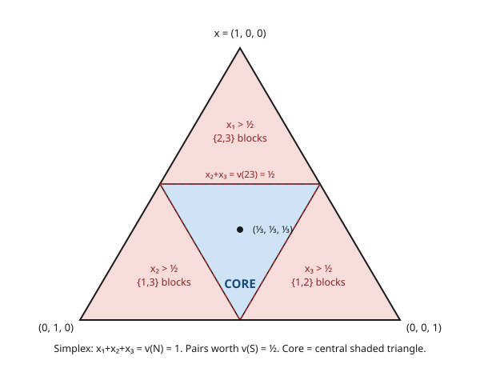

# Grad Game Theory · Lesson 6.1: Coalitional games and the core

> ⏱ ~15 min · Module 6: Cooperative game theory and matching · Builds on: [5.5 The limits of efficient design](05-05-limits-of-efficient-design.md) · Unlocks: [6.2 The Shapley value](06-02-shapley-value.md)

## Why this matters

Everything so far assumed players act alone: they choose strategies, best-respond, and can't sign enforceable contracts — the whole point of Nash equilibrium is *self*-enforcement. Module 5 showed how much that non-cooperative straitjacket costs us: efficient, budget-balanced, incentive-compatible mechanisms often simply don't exist.

Cooperative game theory changes the rules. Now **binding agreements are possible** — coalitions can commit to joint plans and to any split of the proceeds. The questions flip: not "what will a lone agent do?" but *which groups form, and how do they divide the value they create?* The central stability notion — the **core** — asks for a division of the pie that no subgroup can beat by walking out. It is the same object as the core of an exchange economy in [grad-micro](../../grad-micro/syllabus.md), the same idea behind stable matchings (6.3), and the launch pad for the Shapley value (6.2). And unlike Nash equilibrium, it can fail to exist — knowing exactly when is a clean theorem.

## The idea

Three roommates can rent a large apartment together for a total value they all agree beats living apart. Fine — but *how* do they split the rent and rooms? Suppose you propose a split. Two of them huddle and realize: "the two of us could rent a smaller place on our own and each do better than what you're offering." That pair will **defect**. Your proposed split was not stable.

The core is the set of splits that survive *every* such huddle. A division of the total is in the core when no coalition — no single player, no pair, not any subgroup — can break off and guarantee all its members strictly more than they're currently getting. It's a very demanding stability test: not just "no individual wants out" (that's individual rationality), but "no *group* wants out."

Two features make the core interesting rather than trivial. First, what a coalition can "guarantee itself" is data we specify up front: a number $v(S)$ for each possible group $S$. Second — and this is the twist — sometimes **no split passes the test**. If any two of three players can grab the whole pie, then whatever you give the third, the other two can always promise themselves a hair more by cutting that third player out. The core is *empty*, and there is no stable way to share. That possibility, and its exact characterization, is the heart of the lesson.

## The formal version

**Coalitional (TU) game.** A *transferable-utility* game is a pair $(N, v)$ where $N = \{1, \dots, n\}$ is the set of players and the **characteristic function** $v : 2^N \to \mathbb{R}$ assigns to every coalition $S \subseteq N$ a number $v(S)$, with $v(\emptyset) = 0$.

**In words:** $v(S)$ is the total worth coalition $S$ can *guarantee itself* — the surplus its members can produce and freely split among themselves — **independent of what the players outside $S$ do**. "Transferable utility" means value is like money: one common currency the coalition divides in any proportion.

**Superadditivity.** $v$ is *superadditive* if $v(S \cup T) \ge v(S) + v(T)$ for all disjoint $S, T$. **In words:** merging two separate groups never destroys value, so the grand coalition $N$ is (weakly) the most productive — which is why we look for ways to split $v(N)$.

**Imputation.** A payoff vector $x = (x_1, \dots, x_n) \in \mathbb{R}^N$ is an *imputation* if

$$\sum_{i \in N} x_i = v(N) \quad (\textbf{efficiency}), \qquad x_i \ge v(\{i\}) \ \text{for all } i \quad (\textbf{individual rationality}).$$

**In words:** the players split exactly the grand coalition's worth (nothing wasted, nothing invented), and no player accepts less than she could get entirely alone.

**The core.** The *core* $C(v)$ is the set of imputations that *no* coalition can improve upon:

$$C(v) = \left\{ x \in \mathbb{R}^N : \sum_{i \in N} x_i = v(N), \ \ \sum_{i \in S} x_i \ge v(S) \ \text{ for all } S \subseteq N \right\}.$$

**In words:** a stable division where every coalition $S$ already receives at least the $v(S)$ it could secure on its own — so no group has any incentive to break away. (Individual rationality is just the $S = \{i\}$ case, so the core's conditions *contain* the imputation conditions.) This is exactly the exchange-economy core from [grad-micro](../../grad-micro/syllabus.md): an allocation no group of traders can improve by trading only among themselves.

**Bondareva–Shapley: when is the core nonempty?** A collection of coalitions with nonnegative weights $\{\lambda_S\}_{S \subseteq N}$ is **balanced** if every player's weights sum to one: for each $i \in N$, $\sum_{S \ni i} \lambda_S = 1$. The game $(N,v)$ is **balanced** if for *every* balanced weighting,

$$\sum_{S \subseteq N} \lambda_S\, v(S) \ \le\ v(N).$$

> **Theorem (Bondareva 1963, Shapley 1967).** The core $C(v)$ is nonempty **if and only if** the game is balanced.

**In words:** think of $\lambda_S$ as the fraction of time coalition $S$ is "active." Balanced weights are a way to have every player fully employed across overlapping part-time coalitions. The game is balanced when no such fractional patchwork of coalitions can out-produce the grand coalition. If some patchwork *beats* $v(N)$, the pie is too small to satisfy everyone at once and the core is empty.

This is a **linear-programming duality** result, nothing more. The core is the feasible set of the LP "minimize $\sum_i x_i$ subject to $\sum_{i \in S} x_i \ge v(S)$ for all $S$"; the core is nonempty exactly when that minimum equals $v(N)$, and the dual variables of the constraints are precisely the balancing weights $\lambda_S$. (LP duality: [linalg-refresher](../../linalg-refresher/syllabus.md).)

**Convex games (preview).** $v$ is *convex* if $v(S \cup T) + v(S \cap T) \ge v(S) + v(T)$ for all $S,T$ — a coalition is worth more to a *bigger* group it joins (increasing returns to membership). Convex games are always balanced, so their cores are nonempty; in fact the core is large, and its barycenter is the Shapley value of 6.2.

## Picture

Every imputation of a 3-player game with $v(N)=1$ lives on the triangle $x_1 + x_2 + x_3 = 1$, $x_i \ge 0$ — each corner is "one player takes everything." A coalition constraint $x_i + x_j \ge v(\{i,j\})$ is equivalent to $x_k \le 1 - v(\{i,j\})$: it slices off the corner where player $k$ (the excluded one) gets too much. Here every pair is worth $\tfrac12$, so each constraint reads $x_k \le \tfrac12$ and chops off a corner. What survives all three cuts is the shaded central triangle — the core.

## Worked examples

Run a whole family at once: the symmetric 3-player game with $v(N) = 1$, singletons $v(\{i\}) = 0$, and every pair worth the same $v(\{i,j\}) = a \ge 0$.

**Example 1 (a nonempty core — $a = \tfrac12$).** The core conditions are $x_1 + x_2 + x_3 = 1$, each $x_i \ge 0$, and the three pair constraints

$$x_1 + x_2 \ge \tfrac12, \quad x_1 + x_3 \ge \tfrac12, \quad x_2 + x_3 \ge \tfrac12.$$

Using $x_1 + x_2 + x_3 = 1$, each pair constraint says $1 - x_k \ge \tfrac12$, i.e. $x_k \le \tfrac12$. So

$$C(v) = \{\, x : x_1+x_2+x_3 = 1,\ \ 0 \le x_k \le \tfrac12 \ \text{for all } k \,\}.$$

This is nonempty — the equal split $(\tfrac13, \tfrac13, \tfrac13)$ sits inside it — and it's a genuine two-dimensional region: the triangle with vertices $(\tfrac12,\tfrac12,0)$, $(\tfrac12,0,\tfrac12)$, $(0,\tfrac12,\tfrac12)$ (the shaded triangle in the figure). Any two players together are guaranteed their $\tfrac12$, and there's room to spare, so many stable splits coexist.

**When does this family's core survive?** The upper bounds $x_k \le 1-a$ must leave room for $\sum x_k = 1$, i.e. $3(1-a) \ge 1$, so

$$C(v) \ne \emptyset \iff a \le \tfrac23.$$

At the knife-edge $a = \tfrac23$ the core collapses to the single point $(\tfrac13,\tfrac13,\tfrac13)$; beyond it, empty. **This threshold is Bondareva–Shapley in action:** put weight $\lambda_S = \tfrac12$ on each of the three pairs. Every player lies in exactly two pairs, so his weights sum to $\tfrac12 + \tfrac12 = 1$ — a balanced collection. Balancedness demands $\sum_S \lambda_S v(S) = 3 \cdot \tfrac12 \cdot a = \tfrac32 a \le v(N) = 1$, i.e. $a \le \tfrac23$. Exactly the boundary, derived from the dual side. (This is the first part of Boss Problem 6.)

**Example 2 (an empty core — the 3-player majority game, $a = 1$).** Now any two players can seize the entire pie: $v(S) = 1$ if $|S| \ge 2$, and $0$ otherwise. The core would need

$$x_1 + x_2 \ge 1, \qquad x_1 + x_3 \ge 1, \qquad x_2 + x_3 \ge 1.$$

Add all three: $2(x_1 + x_2 + x_3) \ge 3$, so $x_1 + x_2 + x_3 \ge \tfrac32$. But efficiency forces $x_1 + x_2 + x_3 = 1 < \tfrac32$. **Contradiction — the core is empty.** No matter how you split one unit among three, some pair is getting less than the $1$ it could grab alone, so that pair defects; every division is unstable.

The Bondareva certificate is the same balanced weighting $\lambda = \tfrac12$ on each pair: $\sum_S \lambda_S v(S) = \tfrac32 \cdot 1 = \tfrac32 > 1 = v(N)$. The game is *not* balanced, so by the theorem the core must be empty — matching the direct computation. Note this game *is* superadditive (merging never hurts), yet stability fails anyway: superadditivity is not enough.

## Watch out

- **You might think** individual rationality ($x_i \ge v(\{i\})$) is the whole stability requirement, **but actually** the core demands the far stronger $\sum_{i\in S} x_i \ge v(S)$ for *every* coalition $S$, not just singletons. A split can be individually rational yet blocked by a pair. Coalitional stability is where the action — and the difficulty — lives.
- **You might think** a stable division always exists, the way a Nash equilibrium always does (Nash's theorem, 2.3). **But actually** the core can be empty (Example 2). Non-cooperative existence is guaranteed by a fixed-point theorem; cooperative stability is guaranteed by *nothing* — it hinges on the game being balanced, which is a real condition that fails for majority-type games.
- **You might think** $v(S)$ might depend on what outsiders do — like a Nash payoff, which depends on everyone's strategy. **But actually** in a TU game $v(S)$ is what $S$ can guarantee *by itself*, a fixed number independent of $N \setminus S$. (Turning a strategic game into a characteristic function requires a choice about how pessimistic $S$ is about outsiders; here we take $v(S)$ as given.)
- **You might think** balancedness is an exotic side condition. **But actually** "balanced $\iff$ nonempty core" (Bondareva–Shapley) is exactly LP strong duality: primal feasibility of the core versus dual feasibility of the balancing weights. Same theorem you met for zero-sum games (1.4) and minimax.

## One-liner

> The core is the set of efficient splits that no coalition can beat on its own — and by Bondareva–Shapley it's nonempty exactly when the game is balanced, which (unlike Nash equilibrium) is never automatic.

## Problems

**P1 (🟢)** A 3-player TU game has $v(N) = 12$; $v(\{1,2\}) = 8$, $v(\{1,3\}) = 6$, $v(\{2,3\}) = 4$; and $v(\{i\}) = 0$ for each $i$. (a) Is $x = (5,4,3)$ an imputation? (b) Is it in the core? (c) Find the full range of payoffs player 1 can receive across all core allocations.

**P2 (🟡)** Consider the symmetric game $v(N) = 1$, singletons $0$, every pair worth $a = \tfrac34$. (a) Show directly, by summing coalition constraints, that the core is empty. (b) Exhibit an explicit balanced collection of weights $\{\lambda_S\}$ whose inequality $\sum_S \lambda_S v(S) > v(N)$ certifies emptiness via Bondareva–Shapley.

**P3 (🔴, optional)** *Gloves market (bridge to competitive equilibrium).* Players $1$ and $2$ each own one **left** glove; player $3$ owns one **right** glove. A matched left–right pair sells for $1$; unmatched gloves are worthless. So $v(S)$ = the number of complete pairs formable within $S$: $v(\{1,3\}) = v(\{2,3\}) = 1$, $v(\{1,2\}) = 0$, $v(N) = 1$, singletons $0$. Find the core. Interpret the answer as a statement about scarcity and market price.

Solutions

**P1** (a) Efficiency: $5 + 4 + 3 = 12 = v(N)$ ✓. Individual rationality: each $x_i \ge 0 = v(\{i\})$ ✓. So $x$ is an imputation.

(b) Check the three pair constraints: $x_1 + x_2 = 9 \ge 8$ ✓, $x_1 + x_3 = 8 \ge 6$ ✓, $x_2 + x_3 = 7 \ge 4$ ✓. All coalition constraints hold, so $x = (5,4,3) \in C(v)$.

(c) Rewrite each pair constraint using $x_1 + x_2 + x_3 = 12$: $x_1 + x_2 \ge 8 \iff x_3 \le 4$; $x_1 + x_3 \ge 6 \iff x_2 \le 6$; $x_2 + x_3 \ge 4 \iff x_1 \le 8$. Together with $x_i \ge 0$, the core is $\{x : x_1+x_2+x_3 = 12,\ x_1 \le 8,\ x_2 \le 6,\ x_3 \le 4,\ x_i \ge 0\}$.

- *Maximum of $x_1$:* $x_1 = 12 - x_2 - x_3$, largest when $x_2 + x_3$ is smallest. The binding lower bound comes from $x_1 \le 8$ itself, i.e. $x_2 + x_3 \ge 4$; achieved at $x_2 = x_3 = 2$ (or any split with $x_2+x_3=4$), giving $x_1 = 8$. Feasible: $(8,2,2)$ satisfies every constraint. So $\max x_1 = 8$.
- *Minimum of $x_1$:* $x_1 = 12 - x_2 - x_3 \ge 12 - 6 - 4 = 2$, using $x_2 \le 6$, $x_3 \le 4$. Achieved at $(2, 6, 4)$: check $x_1 + x_2 = 8 \ge 8$ ✓, $x_1 + x_3 = 6 \ge 6$ ✓, $x_2 + x_3 = 10 \ge 4$ ✓. So $\min x_1 = 2$.

Player 1's core payoff ranges over $[2, 8]$.

**P2** (a) The core would require $x_1 + x_2 \ge \tfrac34$, $x_1 + x_3 \ge \tfrac34$, $x_2 + x_3 \ge \tfrac34$. Summing: $2(x_1+x_2+x_3) \ge \tfrac94$, so $x_1 + x_2 + x_3 \ge \tfrac98$. But efficiency forces the sum to equal $v(N) = 1 < \tfrac98$ — contradiction. The core is empty.

(b) Take $\lambda_S = \tfrac12$ on each of the three pairs $\{1,2\}, \{1,3\}, \{2,3\}$ (and $0$ elsewhere). Each player belongs to exactly two pairs, so $\sum_{S \ni i} \lambda_S = \tfrac12 + \tfrac12 = 1$ — the collection is balanced. Then

$$\sum_S \lambda_S v(S) = 3 \cdot \tfrac12 \cdot \tfrac34 = \tfrac98 > 1 = v(N),$$

which violates the balancedness inequality. By Bondareva–Shapley the game is unbalanced, so the core is empty — consistent with (a). (The weights $\tfrac12$ are exactly the dual multipliers on the three constraints we summed in (a).)

**P3** Write $x = (x_1, x_2, x_3)$ with $x_1 + x_2 + x_3 = 1$ and each $x_i \ge 0$. The binding coalition constraints are

$$x_1 + x_3 \ge 1 \quad(\{1,3\}\ \text{can make a pair}), \qquad x_2 + x_3 \ge 1 \quad(\{2,3\}\ \text{can make a pair}).$$

From $x_1 + x_3 \ge 1$ and $x_1 + x_2 + x_3 = 1$ we get $x_2 \le 0$, hence $x_2 = 0$. Symmetrically $x_2 + x_3 \ge 1$ forces $x_1 = 0$. Then efficiency gives $x_3 = 1$. Check the remaining constraints for $(0,0,1)$: $x_1 + x_2 = 0 \ge 0 = v(\{1,2\})$ ✓, $x_1 + x_3 = 1 \ge 1$ ✓, $x_2 + x_3 = 1 \ge 1$ ✓. So

$$C(v) = \{(0, 0, 1)\}.$$

The core is the single point where the **right-glove owner captures the entire surplus** and each left-glove owner gets nothing. Interpretation: right gloves are the scarce side of the market (two lefts chasing one right). Competition between the two identical left-glove owners bids their price to zero; the short side extracts all the gains from trade. This is precisely the competitive-equilibrium price outcome — and the coincidence is no accident: for market games the core shrinks toward the set of Walrasian allocations, the core-convergence theme of [grad-micro](../../grad-micro/syllabus.md).

## Flashback

**From Module 2 (Nash equilibrium) — a bridge to today.** Two firms simultaneously choose Cooperate ($C$) or Defect ($D$) in a Hawk–Dove/Chicken game with payoffs (row, column):

$$\begin{array}{c|cc} & C & D \\ \hline C & 3,\,3 & 1,\,4 \\ D & 4,\,1 & 0,\,0 \end{array}$$

(a) Find the symmetric mixed-strategy Nash equilibrium and each player's expected payoff there. (b) Which outcome maximizes the *total* payoff, and what would it take to sustain it? Connect your answer to why cooperative game theory exists.

Solution

(a) Let the opponent play $C$ with probability $p$. The row player's expected payoffs are $C$: $3p + 1(1-p) = 1 + 2p$; $D$: $4p + 0(1-p) = 4p$. Indifference (required for a mixed best response) means $1 + 2p = 4p \Rightarrow p = \tfrac12$. By symmetry each player plays $C$ with probability $\tfrac12$. Expected payoff to each: $1 + 2 \cdot \tfrac12 = 2$. (There are also two asymmetric pure equilibria, $(C,D)$ and $(D,C)$.)

(b) Total payoffs: $(C,C) = 6$, $(C,D) = (D,C) = 5$, $(D,D) = 0$. The efficient outcome is $(C,C)$ with total $6$ — but it is *not* a Nash equilibrium: from $(C,C)$ either player gains by deviating to $D$ ($3 \to 4$). Non-cooperatively it unravels, and the mixed equilibrium wastes value ($4$ total against a possible $6$). Sustaining $(C,C)$ requires a **binding agreement** not to deviate — exactly the ingredient non-cooperative theory forbids and cooperative theory (the core) assumes. Model it as a TU game with $v(\{1,2\}) = 6$ and $v(\{i\}) = $ each player's non-cooperative secure payoff: the core describes the enforceable splits of the cooperative surplus $6$.

## Connections

- **Backward:** Module 5 showed that with only non-cooperative instruments, efficient design bumps into impossibility ([5.5](05-05-limits-of-efficient-design.md)). Cooperative theory sidesteps those limits by *assuming* binding agreements — the core asks which efficient outcomes are then stable. The Bondareva–Shapley theorem is the LP duality of [1.4](01-04-zero-sum-minimax-lp-duality.md), and convex/balanced structure rests on the convexity toolkit of [1.1](01-01-convex-sets-functions-separating-hyperplanes.md).
- **Forward:** the Shapley value ([6.2](06-02-shapley-value.md)) picks a *single* fair split; it always lies in the core for convex games but can fall outside it otherwise. Matching stability ([6.3](06-03-stable-matching-market-design.md)) is literally the core of a matching game — a blocking pair is a blocking coalition of size two.
- **Sideways (grad-micro):** the core of a coalitional game *is* the core of an exchange economy — no group of traders can improve by re-trading among themselves — and as the economy is replicated it shrinks to the set of Walrasian equilibria (core convergence). Same concept, different vocabulary: [grad-micro](../../grad-micro/syllabus.md).
- **Sideways (linear algebra):** nonemptiness of the core is a feasibility question answered by LP duality — the balancing weights are dual variables ([linalg-refresher](../../linalg-refresher/syllabus.md)).
