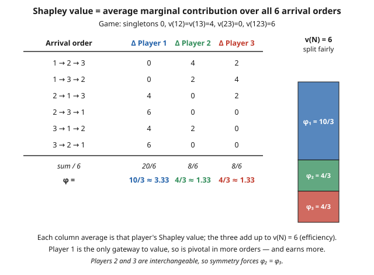

# Grad Game Theory · Lesson 6.2: The Shapley value

> ⏱ ~15 min · Module 6: Cooperative game theory and matching · Builds on: [6.1 Coalitional games and the core](06-01-coalitional-games-core.md) · Unlocks: [6.3 Stable matching and market design](06-03-stable-matching-market-design.md)

## Why this matters

Lesson 6.1 asked *which divisions of the pie are stable* and answered with the **core** — a set. But a set is an awkward answer to a practical question. Three firms merge and clear a combined surplus: who gets what *single* number? A shared runway costs a fixed amount: what is each airline's *one* fair bill? A coalition government forms: how much *power* does each party actually hold? The core often contains a whole polytope of allocations (and sometimes nothing at all), so it can't name a fair split by itself. The Shapley value does: it is the unique division that satisfies four fairness axioms simultaneously, and it underlies real cost-allocation formulas, the Shapley–Shubik index of voting power, and modern feature-attribution in machine learning.

## The idea

Here is the whole thing in one sentence: **your fair share is your average marginal contribution.**

Imagine the grand coalition doesn't form all at once — the players walk into the room one at a time, in some order. Each arrival brings whatever *extra* value they add to the group already present: if the players already inside are worth $v(S)$ and you push the worth to $v(S \cup \{i\})$, you contributed the difference. That difference is your **marginal contribution**, and it depends on *who is already in the room* — you might be worth a lot to an empty room and nothing to a full one, or vice versa.

Of course the order is arbitrary, and different orders credit you differently. The Shapley value refuses to privilege any order: it averages your marginal contribution over **all** $n!$ arrival orders, each treated as equally likely. Whatever you're worth on average across every possible way the coalition could assemble — that's your share. No axioms needed to *feel* the fairness; the axioms come next to prove it's the *only* rule that works.

## The formal version

Fix a transferable-utility game $(N, v)$ with player set $N = \{1, \dots, n\}$ and characteristic function $v: 2^N \to \mathbb{R}$, $v(\emptyset) = 0$ (from 6.1: $v(S)$ is the worth a coalition $S$ can guarantee itself). A **value** is a rule $\varphi$ assigning each game a payoff vector $\varphi(v) = (\varphi_1(v), \dots, \varphi_n(v))$.

**The Shapley axioms.** Shapley asked which value satisfies all four of:

- **Efficiency.** $\sum_{i \in N} \varphi_i(v) = v(N)$. *In words: the whole pie is divided, nothing left over or invented.*
- **Symmetry.** If players $i$ and $j$ are interchangeable — $v(S \cup \{i\}) = v(S \cup \{j\})$ for every $S$ containing neither — then $\varphi_i(v) = \varphi_j(v)$. *In words: players who contribute identically to every coalition get equal shares; names don't matter.*
- **Null player.** If $v(S \cup \{i\}) = v(S)$ for every $S$, then $\varphi_i(v) = 0$. *In words: someone who adds nothing anywhere gets nothing.*
- **Additivity.** For two games $v, w$ on the same players, $\varphi_i(v + w) = \varphi_i(v) + \varphi_i(w)$, where $(v+w)(S) = v(S) + w(S)$. *In words: play two games and the fair shares just add — you can settle them separately.*

**Shapley's theorem (1953).** There is exactly **one** value satisfying all four axioms, given by

$$\varphi_i(v) = \sum_{S \subseteq N \setminus \{i\}} \frac{|S|!\,(n - |S| - 1)!}{n!}\,\big[\,v(S \cup \{i\}) - v(S)\,\big].$$

*In words: sum player $i$'s marginal contribution $v(S \cup \{i\}) - v(S)$ over every coalition $S$ that doesn't contain $i$, each weighted by how many arrival orders produce exactly that predecessor set.*

**The order interpretation (the way you actually compute).** That combinatorial weight is doing bookkeeping: $|S|!\,(n-|S|-1)!$ is the number of the $n!$ orders in which the players of $S$ arrive first (in some order), then $i$, then everyone else. So the formula is identical to

$$\varphi_i(v) = \frac{1}{n!} \sum_{\pi} \Big[\, v\big(P_i^{\pi} \cup \{i\}\big) - v\big(P_i^{\pi}\big)\Big],$$

where the sum runs over all $n!$ orderings $\pi$ and $P_i^{\pi}$ is the set of players preceding $i$ in $\pi$. *In words: average $i$'s marginal contribution over all arrival orders — exactly the idea above.* For $n = 3$ that's six orders you can tabulate by hand.

## Picture

## Worked examples

**Example 1 (both formulas, then the core check — Boss Problem 6).** Three partners. Alone, no one produces anything: $v(1) = v(2) = v(3) = 0$. Player 1 is the essential connector — paired with either 2 or 3 the venture is worth 4, but 2 and 3 together produce nothing: $v(12) = v(13) = 4$, $v(23) = 0$. All three together: $v(123) = 6$.

*Order interpretation.* Tabulate each player's marginal contribution across all $3! = 6$ orders (the arrival brings $v(\text{room}\cup\{i\}) - v(\text{room})$):

| Order | $\Delta_1$ | $\Delta_2$ | $\Delta_3$ |
|-------|-----------|-----------|-----------|
| $1,2,3$ | $0$ | $4$ | $2$ |
| $1,3,2$ | $0$ | $2$ | $4$ |
| $2,1,3$ | $4$ | $0$ | $2$ |
| $2,3,1$ | $6$ | $0$ | $0$ |
| $3,1,2$ | $4$ | $2$ | $0$ |
| $3,2,1$ | $6$ | $0$ | $0$ |
| **sum** | $20$ | $8$ | $8$ |

Divide each column sum by $6$:

$$\varphi = \left(\tfrac{20}{6}, \tfrac{8}{6}, \tfrac{8}{6}\right) = \left(\tfrac{10}{3}, \tfrac{4}{3}, \tfrac{4}{3}\right) \approx (3.33,\ 1.33,\ 1.33).$$

Efficiency check: $\tfrac{10}{3} + \tfrac{4}{3} + \tfrac{4}{3} = \tfrac{18}{3} = 6 = v(N)$. ✓ And players 2, 3 are interchangeable, so symmetry forces $\varphi_2 = \varphi_3$. ✓

*Weighted-formula cross-check for player 1.* Sum over $S \subseteq \{2,3\}$, weight $\tfrac{|S|!\,(n-|S|-1)!}{n!}$ with $n=3$:

$$
\begin{aligned}
S = \emptyset:\quad & \tfrac{0!\,2!}{3!}\,[v(1) - v(\emptyset)] = \tfrac{2}{6}\cdot 0 = 0,\\
S = \{2\}:\quad & \tfrac{1!\,1!}{3!}\,[v(12) - v(2)] = \tfrac{1}{6}\cdot 4 = \tfrac{4}{6},\\
S = \{3\}:\quad & \tfrac{1!\,1!}{3!}\,[v(13) - v(3)] = \tfrac{1}{6}\cdot 4 = \tfrac{4}{6},\\
S = \{2,3\}:\quad & \tfrac{2!\,0!}{3!}\,[v(123) - v(23)] = \tfrac{2}{6}\cdot 6 = 2.
\end{aligned}
$$

Total: $0 + \tfrac{4}{6} + \tfrac{4}{6} + 2 = \tfrac{20}{6} = \tfrac{10}{3}$. ✓ Same answer, both ways.

*Is the Shapley value in the core?* The core (6.1) requires an allocation $x$ with $\sum_i x_i = 6$ and $\sum_{i \in S} x_i \ge v(S)$ for every $S$. The binding constraints are $x_1 + x_2 \ge 4$ and $x_1 + x_3 \ge 4$ (the rest are slack: $x_2 + x_3 \ge 0$ and singletons $\ge 0$). With the total fixed at 6, these say $x_3 \le 2$ and $x_2 \le 2$, so the core is $\{(6 - x_2 - x_3,\, x_2,\, x_3) : 0 \le x_2 \le 2,\ 0 \le x_3 \le 2\}$ — nonempty. Now test $\varphi$: $\varphi_2 = \tfrac{4}{3} \le 2$ ✓, $\varphi_3 = \tfrac{4}{3} \le 2$ ✓, and $\varphi_1 + \varphi_2 = \tfrac{14}{3} \approx 4.67 \ge 4$ ✓. **The Shapley value lies in the core.** That's not automatic — this game is *not* convex (player 2's marginal contribution to $\{1\}$ is $4$ but to $\{1,3\}$ is only $2$, so worth is not supermodular), so we had to check by hand. When it lands inside, it means the canonical fair split is also *stable*: no coalition can credibly walk away and do better. Boss Problem 6, complete.

**Example 2 (cost sharing — the airport game).** One runway serves three airlines. A small plane needs a runway costing 3; a medium plane, 6; a large plane, 9. A coalition must build a runway long enough for its *biggest* member, so the cost function is $c(S) = \max_{i \in S} c_i$: $c(1)=3,\ c(2)=6,\ c(3)=9$, $c(12)=6,\ c(13)=9,\ c(23)=9,\ c(123)=9$. We split the total cost 9 by the Shapley value of the cost game (marginal *cost* each airline adds on arrival).

Average the marginal cost over all six orders (e.g. airline 1 pays $c(1)-c(\emptyset)=3$ when first, but $0$ whenever a bigger plane is already present):

$$
\varphi_1 = \tfrac{3+3+0+0+0+0}{6} = 1,\quad
\varphi_2 = \tfrac{3+0+6+6+0+0}{6} = 2.5,\quad
\varphi_3 = \tfrac{3+6+3+3+9+9}{6} = 5.5.
$$

Total $1 + 2.5 + 5.5 = 9 = c(N)$. ✓ There's a beautiful reading: think of the runway as three segments. The first segment (cost 3) is needed by *all three* planes, so split it three ways — 1 each. The second segment (cost 3 more) is needed only by the medium and large planes — split two ways, 1.5 each. The final segment (cost 3 more) serves only the large plane — it pays the whole 3. Adding up: $1$, $1 + 1.5 = 2.5$, $1 + 1.5 + 3 = 5.5$. The Shapley value *is* the "each segment split equally among those who use it" rule, and the airline that alone demands extra capacity pays for it alone. (Replace "runway length" with "voting weight" and the same averaging gives the **Shapley–Shubik power index** — the share of orderings in which a party is the pivotal vote that turns a losing coalition into a winning one.)

## Watch out

- **A point versus a set.** The Shapley value is a single allocation (unique fair division); the core is a region (all stable allocations). They answer different questions — *fairness* versus *stability* — and can disagree. The Shapley value can sit **outside** a nonempty core, and it is defined even when the core is **empty**, whereas the core says nothing about fairness among its many points.
- **When they *do* agree: convex games.** If $v$ is convex (supermodular: $v(S \cup \{i\}) - v(S)$ is nondecreasing as $S$ grows — the more people already inside, the more you're worth), then the core is guaranteed nonempty *and* the Shapley value is its **barycenter**, hence always in the core. Convexity is sufficient, not necessary: Example 1 wasn't convex yet the Shapley value still landed inside.
- **Marginal contribution is relational.** $v(S \cup \{i\}) - v(S)$ is not a fixed property of $i$ — it depends on exactly who is already present. The averaging over all $n!$ orders is precisely what turns this context-dependent quantity into a single well-defined number; you cannot shortcut it by evaluating "$i$'s contribution" in one convenient coalition.
- **Additivity is the subtle axiom.** Efficiency, symmetry, and null-player feel self-evident; additivity — that shares from two independent games simply add — is the one doing quiet heavy lifting, and it's the one to name if asked which axiom you'd most want to scrutinize. It is exactly what makes $\varphi$ **linear** in $v$.

## One-liner

> Your fair share is your average marginal contribution over all arrival orders — the unique split obeying efficiency, symmetry, null-player, and additivity, and (for convex games) always in the core.

## Problems

**P1 (🟢)** In a three-player game the singletons are worth 0, and $v(12) = 90$, $v(13) = 0$, $v(23) = 0$, $v(123) = 90$. Compute the Shapley value. (Hint: identify the axioms that pin it down before touching the formula.)

**P2 (🟡)** A committee has three members voting on a motion, with weights $w_1 = 3$, $w_2 = 2$, $w_3 = 1$ and quota $4$: a coalition wins (worth 1) iff its total weight is at least 4, else it's worth 0. Compute the Shapley–Shubik power index (the Shapley value of this voting game) and comment on how power compares to raw weight.

**P3 (🔴, optional)** Show the two Shapley formulas agree. Specifically: of the $n!$ orderings of $N$, prove that exactly $|S|!\,(n - |S| - 1)!$ of them place a given player $i$ immediately after the set $S$ (with $S = P_i^\pi$, i.e. $S$ is precisely the set of predecessors of $i$). Conclude that the order-average formula equals the weighted-sum formula.

Solutions

**P1** Player 3 is a **null player**: $v(S \cup \{3\}) = v(S)$ for every $S$ — check $v(3)-v(\emptyset)=0$, $v(13)-v(1)=0$, $v(23)-v(2)=0$, $v(123)-v(12)=90-90=0$. So $\varphi_3 = 0$. Players 1 and 2 are **interchangeable** (swapping them leaves every coalition's worth unchanged: $v(13)=v(23)=0$, and $1,2$ enter symmetrically into $v(12)$ and $v(123)$), so by symmetry $\varphi_1 = \varphi_2$. By efficiency $\varphi_1 + \varphi_2 = v(N) = 90$. Therefore

$$\varphi = (45,\ 45,\ 0).$$

The three axioms alone determined the answer — no summation required. (You can confirm via orderings: player 3's marginal is 0 in all six; the surplus 90 appears exactly when the *second* of $\{1,2\}$ arrives, splitting evenly.)

**P2** List coalition weights: $\{1\}=3$ (lose), $\{2\}=2$, $\{3\}=1$ (lose); $\{12\}=5$, $\{13\}=4$, $\{123\}=6$ (win); $\{23\}=3$ (lose). In each ordering, the **pivotal** player is the one whose entry first pushes the running weight to $\ge 4$:

| Order | pivot |
|-------|-------|
| $1,2,3$ | $2$ (3→5) |
| $1,3,2$ | $3$ (3→4) |
| $2,1,3$ | $1$ (2→5) |
| $2,3,1$ | $1$ (3→6) |
| $3,1,2$ | $1$ (1→4) |
| $3,2,1$ | $1$ (3→... $\{3,2\}=3$ lose, then 1: →6) |

Player 1 is pivotal in 4 of 6 orders, players 2 and 3 in 1 each:

$$\varphi = \left(\tfrac{4}{6}, \tfrac{1}{6}, \tfrac{1}{6}\right) = \left(\tfrac{2}{3}, \tfrac{1}{6}, \tfrac{1}{6}\right).$$

Player 1 holds half the total weight ($3$ of $6$) but two-thirds of the power, while player 3 has one-sixth the weight and one-sixth the power. Power is *not* proportional to weight: what matters is how often you're the swing vote. (Note players 2 and 3 have equal power despite unequal weight — here every winning coalition containing 2 that's decided by 2 could equally be decided by 3.)

**P3** Fix player $i$ and a set $S \subseteq N \setminus \{i\}$ with $|S| = s$. We count orderings $\pi$ whose predecessor set of $i$ is exactly $S$ — meaning: all $s$ members of $S$ come before $i$, $i$ occupies position $s + 1$, and the remaining $n - s - 1$ players come after. The members of $S$ can fill the first $s$ positions in $s!$ ways; $i$ is fixed in position $s+1$; the other $n - s - 1$ players fill the last positions in $(n - s - 1)!$ ways. These choices are independent, so the count is

$$s!\,(n - s - 1)! = |S|!\,(n - |S| - 1)!.$$

Now group the $n!$ orderings in the order-average formula by the predecessor set $S = P_i^\pi$. Every $\pi$ with $P_i^\pi = S$ contributes the *same* marginal $v(S \cup \{i\}) - v(S)$, and there are $|S|!\,(n-|S|-1)!$ of them, so

$$\varphi_i = \frac{1}{n!}\sum_{\pi}\big[v(P_i^\pi \cup \{i\}) - v(P_i^\pi)\big] = \sum_{S \subseteq N \setminus \{i\}} \frac{|S|!\,(n - |S| - 1)!}{n!}\big[v(S \cup \{i\}) - v(S)\big],$$

which is exactly the weighted-sum formula. The mysterious combinatorial weight is just the fraction of arrival orders producing predecessor set $S$. $\blacksquare$

## Flashback

**From Lesson 6.1 (Coalitional games and the core):** Consider the game with $v(1) = v(2) = v(3) = 0$, $v(12) = 8$, $v(13) = 6$, $v(23) = 4$, $v(123) = 12$. Someone proposes the allocation $x = (3, 4, 5)$. Is it in the core? If not, name a coalition that blocks it and by how much.

Solution

Check the core conditions. Efficiency: $3 + 4 + 5 = 12 = v(N)$ ✓. Now the coalition inequalities $\sum_{i \in S} x_i \ge v(S)$:

- $\{1,2\}$: $x_1 + x_2 = 3 + 4 = 7$, but $v(12) = 8$. **Violated** — short by 1.
- $\{1,3\}$: $3 + 5 = 8 \ge 6$ ✓.
- $\{2,3\}$: $4 + 5 = 9 \ge 4$ ✓.
- singletons: all $\ge 0$ ✓.

So $x$ is **not in the core**: coalition $\{1,2\}$ blocks it, because together they can secure 8 on their own but this allocation gives them only 7. They'd split off and improve. (The core here is nonempty — e.g. $(6,4,2)$ satisfies all constraints — so a stable division does exist; this proposal just isn't one.)

## Connections

- **Backward (6.1):** the core gave a *set* of stable allocations (or none); the Shapley value collapses fairness to a *single* point via marginal contribution. Example 1 sews them together — computing both for one game and checking membership completes Boss Problem 6. Convex games (6.1's balancedness gave nonemptiness) are where the two ideas coincide: Shapley value = core barycenter.
- **Forward (6.3):** stable matching is cooperative theory without transferable money — "no blocking pair" is the core idea specialized to two-sided markets, and Gale–Shapley's deferred acceptance is a constructive fairness rule the way the Shapley value is an axiomatic one.
- **Sideways (grad-micro):** cost allocation and cooperative-surplus division are the same mathematics — the airport game is a staple of [`grad-micro`](../../grad-micro/syllabus.md)'s treatment of shared-cost and public-good problems, and VCG payments (5.3) share the "pay your marginal externality" DNA.
- **Sideways (linalg-refresher):** additivity makes $\varphi$ **linear** in $v$ — the value is a linear operator on the vector space of games, and the unanimity games form a basis on which $\varphi$ acts diagonally ([`linalg-refresher`](../../linalg-refresher/syllabus.md)).
- **Sideways (probability-theory):** the order interpretation is an **expectation** — draw an arrival order uniformly at random and $\varphi_i = \mathbb{E}[\text{marginal contribution of } i]$. Averaging over all $n!$ equally likely permutations is exactly the uniform expectation from [`probability-theory`](../../probability-theory/syllabus.md), and Monte-Carlo sampling of orders is how Shapley values get estimated when $n$ is large.
