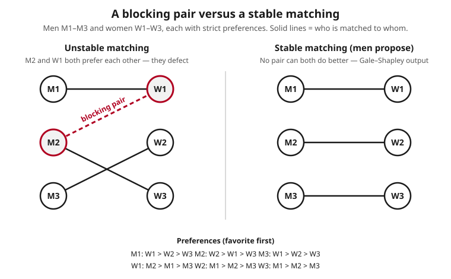

# Grad Game Theory · Lesson 6.3: Stable matching and market design

> ⏱ ~15 min · Module 6: Cooperative game theory and matching · Builds on: [6.2 The Shapley value](06-02-shapley-value.md) · Unlocks: [6.4 Evolutionary game theory](06-04-evolutionary-game-theory.md)

## Why this matters

Every year about forty thousand new U.S. doctors are assigned to residency programs not by a market with prices but by an *algorithm* — the National Resident Matching Program. The same machinery routes students to public schools in Boston and New York and pairs incompatible kidney-donor patients into swap chains. These are markets with no money on one or both sides, where what you can get depends on who else wants it. The question that organizes all of them is: **when is an assignment self-enforcing — no pair of participants able to walk away and do better on their own?** That property is called stability, and unlike the core of a general cooperative game (6.1), which can be empty, a stable matching *always exists* and can be *built*. This lesson is where cooperative game theory stops being an existence theorem and starts running real institutions.

## The idea

Two sides — call them men and women, or doctors and hospitals, or students and schools. Each person on each side has a strict ranking of the people on the other side. A **matching** just pairs them up. The danger is a **blocking pair**: a man and a woman who are *not* matched to each other but who each prefer the other to their current partner. If such a pair exists, the matching won't hold — those two have every incentive to abandon their assignments and elope. A matching with **no blocking pair** is **stable**: nobody can find a willing partner they'd both rather be with.

Here is the beautiful part. There is a dead-simple procedure that always lands on a stable matching. Men propose in order down their lists; each woman holds onto the best proposal she has seen so far and rejects the rest; rejected men move to their next choice and propose again. Because a woman only ever trades *up*, and men only ever move *down* their lists, the process cannot cycle — it grinds to a halt, and when it does, no blocking pair can survive. The reason is a one-line argument you should carry around: *if a man preferred some other woman to his partner, he must have already proposed to her and been rejected — which means she has someone she likes better than him.* So he can't be half of a blocking pair. That sentence is the whole theory.

## The formal version

Let $M$ and $W$ be two finite disjoint sets (say $|M| = |W| = n$). Each $m \in M$ has a strict preference order $\succ_m$ over $W$, and each $w \in W$ a strict order $\succ_w$ over $M$. A **matching** is a bijection $\mu: M \to W$; write $\mu(m)$ for $m$'s partner and $\mu^{-1}(w)$ for $w$'s.

**Definition (blocking pair).** A pair $(m, w)$ with $\mu(m) \neq w$ **blocks** $\mu$ if
$$w \succ_m \mu(m) \quad\text{and}\quad m \succ_w \mu^{-1}(w).$$

*In words:* $m$ prefers $w$ to his assigned partner, **and** $w$ prefers $m$ to hers — both would defect, so it takes two.

**Definition (stable matching).** $\mu$ is **stable** if no pair blocks it (with strict preferences and equal sides, every agent prefers being matched to being alone, so we ignore the option of staying single).

*In words:* a matching is stable exactly when it lies in the **core of the matching game** — no coalition, and in fact no pair, can break off and improve.

**Gale–Shapley deferred-acceptance algorithm (men proposing).**
1. Each unmatched man proposes to his most-preferred woman who has not yet rejected him.
2. Each woman who received proposals *tentatively holds* the best (by $\succ_w$) of the proposals in hand — including anyone she is already holding — and rejects all others.
3. Repeat until no man is rejected. The held pairs become the final matching.

**Theorem (Gale–Shapley, 1962).** The algorithm terminates, and its output is a stable matching. Hence a stable matching always exists.

*In words:* the procedure can't run forever, and what it stops on has no blocking pair — so stability is not just possible but constructible.

**Proof sketch.** *Termination:* a man never proposes to the same woman twice, so there are at most $n^2$ proposals total; the process halts. *Stability:* take any pair $(m,w)$ with $\mu(m)\ne w$, and suppose $w \succ_m \mu(m)$. Since $m$ prefers $w$ to where he ended, he must have proposed to $w$ earlier and been rejected (or dropped). A woman only ever rejects to hold someone she likes better, and her held partner only improves over time — so her final partner $\mu^{-1}(w)$ satisfies $\mu^{-1}(w) \succ_w m$. Thus $(m,w)$ is *not* blocking. As $(m,w)$ was arbitrary, $\mu$ is stable. $\blacksquare$

**Theorem (proposer optimality).** Among *all* stable matchings, the men-proposing output gives **every man simultaneously his best achievable stable partner** (and, dually, every woman her *worst* stable partner). Symmetrically, the women-proposing version is women-optimal.

*In words:* which side proposes is not cosmetic — the proposers get the best stable outcome they could possibly get, all at once, and the receivers get the worst. (The set of stable matchings in fact forms a **lattice** under "all men agree it's better," with the two optimal matchings as top and bottom.)

**Strategy-proofness (Dubins–Freedman / Roth).** Under the men-proposing mechanism, **truth-telling is a dominant strategy for every man**: no man can ever get a better stable partner by misreporting his preferences. But the *receiving* side can sometimes gain by lying, and **no stable matching mechanism is strategy-proof for both sides at once** — an impossibility in the spirit of the strategy-proofness limits from [5.1](05-01-social-choice-impossibility.md).

*In words:* the proposers are safe being honest; the receivers may profitably scheme; and you cannot design a stable mechanism that makes *everyone* honest.

## Picture

The left matching pairs M2 with W3, but M2 prefers W1 and W1 prefers M2 to her partner M1 — a blocking pair, drawn dashed. The right matching, produced by deferred acceptance, has no such pair anywhere.

## Worked examples

Both examples use the profile in the figure. Men rank women, women rank men, favorite first:

| | 1st | 2nd | 3rd | | | 1st | 2nd | 3rd |
|---|---|---|---|---|---|---|---|---|
| **M1** | W1 | W2 | W3 | | **W1** | M2 | M1 | M3 |
| **M2** | W2 | W1 | W3 | | **W2** | M1 | M2 | M3 |
| **M3** | W1 | W2 | W3 | | **W3** | M1 | M2 | M3 |

**Example 1 (mechanical — run men-proposing deferred acceptance).**

- **Round 1.** M1 → W1, M2 → W2, M3 → W1. Now W1 holds two offers, M1 and M3; since $M1 \succ_{W1} M3$, she holds M1 and **rejects M3**. W2 holds M2.
- **Round 2.** M3 (rejected) proposes to his next choice, W2. W2 now holds M2 and M3; $M2 \succ_{W2} M3$, so she holds M2 and **rejects M3**.
- **Round 3.** M3 proposes to W3, his last choice. W3 was empty, so she holds M3.
- No man is rejected. **Stop.** Output $\mu = \{\,M1\text{–}W1,\ M2\text{–}W2,\ M3\text{–}W3\,\}$.

*Verify no blocking pair.* M1 and M2 each got their **top** choice, so neither will ever defect. That leaves only M3, matched to his last choice W3; M3 would prefer W1 or W2 — but $W1$ holds M1 with $M1 \succ_{W1} M3$, and $W2$ holds M2 with $M2 \succ_{W2} M3$, so neither woman will take him. No blocking pair exists; $\mu$ is stable. ✓

**Example 2 (why it matters — proposer optimality).** Now run the *women-proposing* version on the same profile.

- **Round 1.** W1 → M2, W2 → M1, W3 → M1. M1 holds two, W2 and W3; $W2 \succ_{M1} W3$, so M1 holds W2 and **rejects W3**. M2 holds W1.
- **Round 2.** W3 → M2 (her next choice). M2 holds W1 and W3; $W1 \succ_{M2} W3$, so M2 holds W1 and **rejects W3**.
- **Round 3.** W3 → M3, who was empty and holds her.
- **Stop.** Output $\mu' = \{\,M1\text{–}W2,\ M2\text{–}W1,\ M3\text{–}W3\,\}$.

Both $\mu$ and $\mu'$ are stable, but they are **different**, and the difference is exactly who proposed:

| | M1 | M2 | W1 | W2 |
|---|---|---|---|---|
| men-optimal $\mu$ | **W1 (1st)** | **W2 (1st)** | M1 (2nd) | M2 (2nd) |
| women-optimal $\mu'$ | W2 (2nd) | W1 (2nd) | **M2 (1st)** | **M1 (1st)** |

In $\mu$ the men get their first choices and the women their seconds; in $\mu'$ it flips exactly. Each side strictly prefers the matching where *it* proposed. This is proposer-optimality and receiver-pessimality in one table: **the men-proposing mechanism is the best stable outcome for men and the worst for women, and vice versa.** (M3 and W3, the least-desired on each side, are stuck with each other either way — the residue after everyone else sorts out.)

## Watch out

- **"Stable" means no blocking *pair* — it is pairwise, and it is the core of the matching game.** You are not checking whether some big coalition can improve; with two-sided strict preferences, if no *pair* can defect, no coalition can either. Do not conflate stability with efficiency: a stable matching is Pareto efficient *within a side's rankings*, but "stable" is specifically the no-blocking-pair condition.
- **A stable matching always exists — this is special.** Deferred acceptance *constructs* one, so unlike the general core of a TU game (6.1), which can be empty, the matching core is never empty. Don't import the "the core might not exist" worry from cooperative games into matching.
- **Which side proposes changes the outcome.** Deferred acceptance is proposer-*optimal* and receiver-*pessimal*. The residency match famously switched to the *applicant*-proposing version precisely so applicants, not hospitals, get their best stable outcome. If someone says "the Gale–Shapley matching," ask *who proposes*.
- **It is strategy-proof for proposers only, not both sides.** A man can safely report truthfully; a woman sometimes gains by truncating or reordering her stated list. Believing the mechanism is manipulation-proof for everyone is the classic trap — no stable mechanism can be.
- **Blocking needs *both* parties to prefer the deviation.** A man who envies another woman does not create instability unless *she* also prefers *him*. One-sided longing is not a blocking pair.

## One-liner

> A matching is stable when no couple would both rather elope; Gale–Shapley always builds one by having one side propose and the other tentatively hold — and the proposers get the best stable deal, honestly.

## Problems

**P1 (🟢)** Consider two men $\{a,b\}$ and two women $\{x,y\}$ with preferences $a\!: x \succ y$, $b\!: y \succ x$, $x\!: b \succ a$, $y\!: a \succ b$. List all four matchings and determine which are stable by checking for blocking pairs. What does men-proposing deferred acceptance return, and is it the *only* stable matching here?

**P2 (🟡)** Take the profile
$$m_1: w_1 \succ w_2 \succ w_3,\quad m_2: w_1 \succ w_3 \succ w_2,\quad m_3: w_1 \succ w_2 \succ w_3,$$
$$w_1: m_1 \succ m_2 \succ m_3,\quad w_2: m_2 \succ m_1 \succ m_3,\quad w_3: m_1 \succ m_2 \succ m_3.$$
Run men-proposing deferred acceptance round by round and give the resulting stable matching.

**P3 (🔴, optional)** In the Example-2 profile, the women-optimal stable matching $\mu'$ gives W1 her first choice M2. Suppose instead the men-proposing mechanism is used (so truthful reporting yields the men-optimal $\mu$, where W1 gets only her second choice M1). Show that **W1 can profitably manipulate**: find a *false* preference list W1 could submit so that men-proposing deferred acceptance, run on the reported profile, matches her to M2. Explain why no man has any analogous profitable lie under men-proposing.

Solutions

**P1** The four matchings:
- $\mu_1 = \{a\text{–}x,\ b\text{–}y\}$: $a$ has his top $x$, $b$ has his top $y$ — no one wants to move. **Stable.**
- $\mu_2 = \{a\text{–}y,\ b\text{–}x\}$: $a$ prefers $x$ to $y$, and $x$ prefers $a$? $x\!: b \succ a$, so $x$ has her top $b$ and won't move. Check $(b,y)$: $b$ prefers $y$ to $x$, and $y$ prefers $b$? $y\!: a\succ b$, no. Actually check all pairs — $(a,x)$: $a$ prefers $x$✓ but $x$ prefers her partner $b$✗. $(b,y)$: $b$ prefers $y$✓ but $y$ prefers her partner $a$✗. No blocking pair. **Stable.**
- $\mu_3 = \{a\text{–}x, b\text{–}y\}$ is $\mu_1$; $\mu_4 = \{a\text{–}y,b\text{–}x\}$ is $\mu_2$ — there are only two perfect matchings on two pairs.

So *both* perfect matchings are stable. Men-proposing: Round 1, $a\to x$, $b \to y$; each woman holds her only offer, done. Returns $\mu_1 = \{a\text{–}x, b\text{–}y\}$ — the men's top choices, the men-optimal one. It is **not** the only stable matching: $\mu_2$ (the women-optimal one, giving $x$ and $y$ their tops) is stable too. This is the smallest example where the two optimal matchings differ.

**P2** Men-proposing:
- **Round 1.** $m_1 \to w_1$, $m_2 \to w_1$, $m_3 \to w_1$. All three chase $w_1$. She ranks $m_1 \succ m_2 \succ m_3$, holds $m_1$, **rejects $m_2$ and $m_3$**.
- **Round 2.** $m_2 \to w_3$ (his 2nd), $m_3 \to w_2$ (his 2nd). $w_3$ holds $m_2$; $w_2$ holds $m_3$. No one rejected.
- **Stop.** $\mu = \{\,m_1\text{–}w_1,\ m_2\text{–}w_3,\ m_3\text{–}w_2\,\}$.

*Check:* $m_1$ has his top. $m_2$ has $w_3$ (3rd) and prefers $w_1, w_3$... he prefers $w_1$ (top) — but $w_1$ holds $m_1$ with $m_1 \succ_{w_1} m_2$, so no. $m_3$ has $w_2$ (2nd) and prefers $w_1$ — but $w_1$ prefers $m_1$ to $m_3$. No blocking pair; stable. ✓

**P3** W1's true list is $M2 \succ M1 \succ M3$; under men-proposing she gets M1 (from the run in Example 1: M1 proposed to her and she held him over M3). The manipulation: **W1 submits the false list $M2 \succ M3 \succ M1$** — she demotes M1 below M3, pretending she'd rather have M3 than M1.

Rerun men-proposing on the reported profile (only W1's list changed):
- **Round 1.** M1 → W1, M2 → W2, M3 → W1. W1 now *reportedly* ranks $M2 \succ M3 \succ M1$, so among {M1, M3} she holds **M3** and rejects M1.
- **Round 2.** M1 (rejected) → W2 (his 2nd). W2 holds M2 and M1; truthfully $M1 \succ_{W2} M2$, so she holds **M1** and rejects M2.
- **Round 3.** M2 → W1 (his 2nd). W1 holds M3 and M2; reportedly $M2 \succ M3$, so she holds **M2**, rejects M3.
- **Round 4.** M3 → W2 (his 2nd). W2 holds M1, prefers M1 to M3, rejects M3.
- **Round 5.** M3 → W3, held.
- **Stop.** Reported outcome: $\{M2\text{–}W1,\ M1\text{–}W2,\ M3\text{–}W3\} = \mu'$.

W1 is now matched to **M2, her true first choice** — strictly better than the M1 she'd get by reporting honestly. By lying about the *relative* rank of her worse options, she knocked M1 out of the running and drew in M2. So the receiving side can manipulate.

*Why no man can.* By the proposer-optimality theorem, truthful men-proposing already gives each man his best *achievable* stable partner. Any report a man submits still produces a stable matching of the true profile (as far as his realized options go), and no stable matching can give him better than his men-optimal partner — so there is no lie that improves his outcome. Formally this is the Dubins–Freedman result: men-proposing deferred acceptance is dominant-strategy incentive compatible for the men. The asymmetry — proposers safe, receivers not — is exactly why the "no stable mechanism is strategy-proof for both sides" impossibility bites.

## Flashback

**From Lesson 6.1 (Coalitional games and the core):** Consider the 3-player TU game with $v(\{i\}) = 0$ for singletons, $v(S) = 0$ for every two-player coalition $S$, and $v(N) = 1$ for the grand coalition of all three. Is the core nonempty? Give an imputation in it, or show none exists. Then state in one sentence how this contrasts with the matching game of this lesson.

Solution

An imputation is a payoff vector $x = (x_1, x_2, x_3)$ with $x_i \ge v(\{i\}) = 0$ (individual rationality) and $\sum_i x_i = v(N) = 1$ (efficiency). The core additionally requires $\sum_{i \in S} x_i \ge v(S)$ for every coalition $S$. Here the binding coalition constraints are the pairs: $x_i + x_j \ge v(\{i,j\}) = 0$, which is automatic since payoffs are nonnegative. So the core is simply
$$\{x : x_1, x_2, x_3 \ge 0,\ x_1 + x_2 + x_3 = 1\},$$
the whole simplex — **nonempty** (e.g. $(\tfrac13,\tfrac13,\tfrac13)$ is in it). (Had we instead set $v(\{i,j\}) = 1$ for the pairs, every pair could guarantee itself the whole value 1, forcing $x_i + x_j \ge 1$ for all pairs, hence $2(x_1+x_2+x_3) \ge 3 > 2$, contradicting $\sum x_i = 1$ — an **empty** core. That is the standard majority-game counterexample.)

*Contrast:* in a general TU cooperative game the core can be empty, so a self-enforcing division of value may simply not exist — whereas in the two-sided matching game the core (= the set of stable matchings) is **never** empty, because Gale–Shapley constructs a stable matching for any preference profile.

## Connections

- **Backward:** stability is precisely the **core of the matching game** from [6.1](06-01-coalitional-games-core.md) — a blocking pair is a two-player coalition that can improve on its own. The headline is that this core, unlike the general TU core, is *always* nonempty and *constructible*. The proposer-optimality lattice is the matching analogue of asking which core allocation a bargaining process selects; the fairness contrast is with the single-point [Shapley value](06-02-shapley-value.md) of 6.2.
- **Forward:** [5.1](05-01-social-choice-impossibility.md)'s Gibbard–Satterthwaite and incentive-compatibility lens is what turns "can a woman lie?" into the strategy-proofness results here; the *impossibility* of a two-sided strategy-proof stable mechanism is a mechanism-design limit of exactly that flavor. Later, [6.5](06-05-learning-nash-program.md) revisits stability as the rest point of a *decentralized* process — agents proposing and rejecting without a central clearinghouse — connecting deferred acceptance to learning dynamics.
- **Sideways (economics):** this is the theory of **two-sided markets and assignment** — see [grad-micro](../../grad-micro/syllabus.md) on matching markets and the assignment model with transfers (where prices reappear and stability becomes a competitive-equilibrium condition). Roth's redesign of the medical residency match, and school-choice and kidney-exchange mechanisms, are this lesson deployed at scale.
- **Sideways (proofs):** the existence theorem here is a model **constructive / algorithm-correctness proof** — existence is established by exhibiting a terminating procedure and proving its output has the desired property, rather than by a fixed-point or compactness argument. See [proofs-primer](../../proofs-primer/syllabus.md) on constructive existence and loop-invariant reasoning (the "a woman's held partner only improves" step is a monotone invariant).
