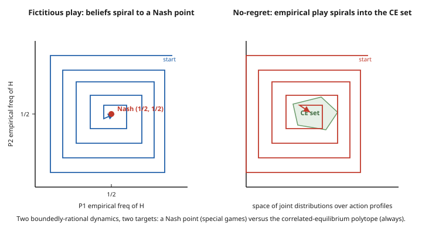

# Grad Game Theory · Lesson 6.5: Learning in games and the Nash program

> ⏱ ~15 min · Module 6: Cooperative game theory and matching · Builds on: [6.4 Evolutionary game theory](06-04-evolutionary-game-theory.md) · Unlocks: (capstone — the end of the course)

## Why this matters

Every equilibrium concept in this course has quietly assumed a miracle: that players somehow *arrive* at a fixed point — each already best-responding to the others, as if by prearranged agreement. But nobody hands the players the equilibrium. So the two questions that have hovered over the whole subject are finally due. **Where does equilibrium come from** — can players who are merely adaptive, not omniscient, grope their way to it by watching what happened and adjusting? And do the two halves of the course — the *noncooperative* machinery of Modules 2–5 and the *cooperative* solution concepts of Module 6 — actually describe one world or two? This lesson answers both. Boundedly-rational learning reaches equilibrium in some games and provably cannot in others, and the concept it reliably reaches turns out to be correlated equilibrium ([2.5](02-05-correlated-equilibrium.md)) — not Nash. And the **Nash program** shows the cooperative and noncooperative pictures are the same picture, seen from two sides.

## The idea

Forget rationality-as-clairvoyance. Give each player a *rule of thumb* that only looks backward at history, and let them play the same game over and over. Two rules dominate the theory.

**Fictitious play.** Treat the opponent's past as a coin whose bias is the empirical frequency of what they've done, and best-respond to that coin. If your rival swerved 60% of the time so far, act as though they'll swerve with probability 0.6 next round. It is the most naïve possible learner: it assumes the opponent is stationary (they aren't — they're learning too), yet it works astonishingly often.

**No-regret learning.** Don't model the opponent at all. Just make sure that, looking back, you don't badly wish you'd always played some single fixed action instead of the mixture you actually played. An algorithm with this property — you can picture it as putting more weight on actions that *would have* done well and less on the losers — is called *no-regret*. It makes no assumption about anyone; it's a solitary promise about your own hindsight.

Here is the punchline that closes the course. Fictitious play converges to **Nash** only in special games and can cycle forever otherwise. But no-regret learning, run by *everyone at once*, always drives the empirical pattern of joint play into the set of **correlated equilibria**. That is *why* correlated equilibrium (2.5) is the natural concept: it is what decentralized, referee-free learning actually reaches. Nash is harder — computationally hard, in fact — and adaptive play does not generally find it.

And there is a second bridge. The **Nash program** is the research agenda of grounding every *cooperative* solution — the Nash bargaining split, the core, the Shapley value — in the equilibrium of an explicit *strategic* game. When it succeeds (as it does for bargaining, [3.5](03-05-bargaining.md)), the axiomatic "fair outcome" and the strategic "equilibrium outcome" coincide. Learning grounds equilibrium in dynamics; the Nash program grounds cooperation in strategy. Together they are the course's two loose ends tied off.

## The formal version

Fix a finite game: players $i = 1,\dots,n$, finite action sets $A_i$, payoffs $u_i$. The same game (the *stage game*) is played at times $t = 1, 2, \dots$; write $a_i^t$ for player $i$'s action at time $t$.

**Fictitious play.** Each player holds an empirical distribution of each opponent's past actions,

$$\hat{p}_{-i}^{\,t}(a_{-i}) = \frac{1}{t-1}\,\#\{\tau < t : a_{-i}^\tau = a_{-i}\},$$

and plays a best response to it: $a_i^t \in \arg\max_{a_i} u_i(a_i, \hat{p}_{-i}^{\,t})$.

*In words:* count how often the others have played each profile, treat those frequencies as their mixed strategy, and best-respond. The state you watch is the vector of empirical frequencies, not the raw actions.

**What fictitious play does — and doesn't — reach.** If the empirical frequencies converge, their limit is a Nash equilibrium. Convergence is guaranteed for:

- **zero-sum games** (Robinson, 1951),
- **$2\times 2$ games** (Miyasawa, 1961),
- **potential games** (Monderer–Shapley, 1996), and
- **dominance-solvable games**.

*In words:* in these classes the naïve learner really does home in on Nash. But **not in general**: Shapley (1964) exhibited a $3\times 3$ game (a modified Rock–Paper–Scissors) in which fictitious play **cycles forever**, the empirical frequencies orbiting the Nash point without ever settling. Naïve learning is not a universal route to Nash.

**No-regret (no external regret).** After $T$ rounds, player $i$'s **external regret** is

$$R_i^T = \max_{a_i \in A_i} \frac{1}{T}\sum_{t=1}^{T} u_i(a_i, a_{-i}^t) \;-\; \frac{1}{T}\sum_{t=1}^{T} u_i(a_i^t, a_{-i}^t).$$

*In words:* the most you could have gained by replacing your entire realized play with the single best fixed action, judged against the opponents' actual moves. An algorithm is **no-regret** if $R_i^T \to 0$ as $T\to\infty$ *against any opponent sequence whatsoever*. Such algorithms exist — multiplicative weights / Hedge, and Hart–Mas-Colell **regret matching** — with $R_i^T = O(1/\sqrt{T})$.

**The learning–equilibrium bridge (Hart–Mas-Colell, 2000).** Let $z_T$ be the **empirical distribution of joint play**, $z_T(a) = \tfrac1T \#\{t : a^t = a\}$, a distribution over full action profiles. Then:

$$\text{all players no-external-regret} \implies \text{every limit point of } z_T \text{ is a } \textbf{coarse correlated equilibrium},$$
$$\text{all players no-internal- (swap-) regret} \implies \text{every limit point of } z_T \text{ is a } \textbf{correlated equilibrium}.$$

*In words:* if nobody regrets a fixed action, the joint play settles into the (larger) coarse-CE set; if nobody even regrets swapping one action for another whenever recommended action $a$ came up (*internal* regret), it settles into the correlated-equilibrium polytope of 2.5 — *precisely*. Decentralized learners reach CE with **no referee at all**: the correlating device of 2.5 is manufactured by history itself. Crucially, this does **not** deliver Nash — Nash is a PPAD-hard fixed point, and no simple dynamics is known to reach it in general.

**The Nash program.** A cooperative solution concept assigns outcomes from primitives (a characteristic function, a bargaining set) via axioms, ignoring the mechanics of interaction. The **Nash program** demands that each such concept be *reconstructed* as the equilibrium of a fully specified noncooperative game:

$$\text{cooperative solution} \;=\; \text{equilibrium of a well-designed strategic game.}$$

*In words:* every "reasonable outcome" story should be cashed out as "here is the game, and here is its equilibrium — and they match." Landmark cases: the **Nash bargaining solution** implemented by Rubinstein alternating-offers SPE as players become patient (3.5); the **core** implemented by strategic market/bargaining games; the **Shapley value** implemented by bidding mechanisms. It is a program — a standard of explanation — not a single theorem.

## Picture

Two adaptive dynamics, side by side. On the left, fictitious-play beliefs in matching pennies spiral toward the single Nash point — this convergence is *guaranteed* only because the game is zero-sum. On the right, no-regret joint play spirals not to a point but into a whole *region*: the correlated-equilibrium polytope of 2.5, which the learners reach in **any** game.

## Worked examples

**Example 1 (fictitious play on matching pennies — beliefs converge, play cycles).** Player 1 (the *matcher*) wants to match; player 2 (the *mismatcher*) wants to differ. Payoff to player 1 (zero-sum, so $u_2 = -u_1$):

$$
\begin{array}{c|cc}
 & H & T \\\hline
H & 1,\,-1 & -1,\,1 \\
T & -1,\,1 & 1,\,-1
\end{array}
$$

The unique equilibrium is mixed: each plays $H$ with probability $\tfrac12$. Best-response rules: the matcher plays whichever action the opponent's empirical frequency favors; the mismatcher plays the *opposite* of the opponent's favored action. Start each player believing the other has played $H$ once (a prior count of $(H{:}1,\,T{:}0)$); break exact ties by repeating last period's action. Track each player's belief as the opponent's empirical frequency of $H$.

| Round | P1 sees $\hat p_2(H)$ | P1 plays | P2 sees $\hat p_1(H)$ | P2 plays | outcome |
|---|---|---|---|---|---|
| 1 | $1/1=1.00$ | H | $1/1=1.00$ | T | (H,T) |
| 2 | $1/2=0.50$ (tie→H) | H | $2/2=1.00$ | T | (H,T) |
| 3 | $1/3=0.33$ | T | $3/3=1.00$ | T | (T,T) |
| 4 | $1/4=0.25$ | T | $3/4=0.75$ | T | (T,T) |
| 5 | $1/5=0.20$ | T | $3/5=0.60$ | T | (T,T) |
| 6 | $1/6=0.17$ | T | $3/6=0.50$ (tie→T) | T | (T,T) |
| 7 | $1/7=0.14$ | T | $3/7=0.43$ | H | (T,H) |
| 8 | $2/8=0.25$ | T | $3/8=0.38$ | H | (T,H) |

Read the two things happening at once. **Actual play cycles in blocks** — a run of $(H,T)$, then a long run of $(T,T)$, then $(T,H)$ starts — and these blocks *lengthen* as the game goes on; play never settles down. Yet the **empirical frequencies drift toward $\tfrac12$**: after round 8 player 1 has played $H$ twice in eight rounds ($0.25$) and climbing, player 2's $H$-frequency is rising off zero. Robinson's theorem promises the frequency pair converges to $(\tfrac12,\tfrac12)$ — the mixed Nash — but the convergence is *slow and cyclic*, exactly the left panel of the figure. This is the single most important nuance of the whole topic: **convergence of empirical frequencies is not convergence of play.**

**Example 2 (the Nash program — Rubinstein's SPE builds the Nash bargaining solution).** Recall the two utterly different answers to "how do two players split a pie of size 1?" from [3.5](03-05-bargaining.md).

*Axiomatic (cooperative).* The **Nash bargaining solution** maximizes the Nash product $(u_1 - d_1)(u_2 - d_2)$ over the feasible set. For a pie with frontier $u_1 + u_2 = 1$ and disagreement $d = (0,0)$, symmetry forces the split $(\tfrac12, \tfrac12)$.

*Strategic (noncooperative).* **Rubinstein alternating offers**: players take turns proposing splits, and a share $t$ periods away is discounted by $\delta^t$. The game has a unique subgame-perfect equilibrium, in which agreement is immediate and the first mover gets

$$x_1^*(\delta_1,\delta_2) = \frac{1-\delta_2}{1-\delta_1\delta_2}.$$

Now take the frictionless limit $\delta_1,\delta_2 \to 1$. Set $\delta_1 = \delta_2 = \delta$ and compute:

$$\lim_{\delta \to 1} \frac{1-\delta}{1-\delta^2} = \lim_{\delta \to 1}\frac{1-\delta}{(1-\delta)(1+\delta)} = \lim_{\delta \to 1}\frac{1}{1+\delta} = \frac12.$$

The strategic split converges to $(\tfrac12,\tfrac12)$ — **exactly the axiomatic Nash bargaining solution.** Two theories built from unrelated primitives (fairness axioms versus impatience and turn-taking) meet at the same point. That coincidence *is* the Nash program: the cooperative "fair division" is not a separate postulate but the equilibrium of a concrete game. (Asymmetric discounting reproduces the *generalized* Nash solution with bargaining weights — Problem 3.)

## Watch out

- **Fictitious play converges only in special classes.** Zero-sum, $2\times2$, potential, dominance-solvable — yes. In general, no: Shapley's $3\times3$ game cycles forever. Do not state "fictitious play converges to Nash" as a theorem; it is a theorem *only with a hypothesis on the game*.
- **No-regret reaches correlated equilibrium, not Nash.** The Hart–Mas-Colell guarantee lands you in the CE (or coarse-CE) polytope, never necessarily at a Nash equilibrium. Nash is a PPAD-hard fixed point; correlated equilibrium is the linear-programming object that simple dynamics can actually find. If you expected learning to deliver Nash, that expectation is the misconception.
- **"Learning" here is history-matching, not Bayesian updating.** Fictitious play and regret matching adjust to *observed frequencies*; they carry no prior over opponent *types* and do not update beliefs by Bayes' rule (that is the Bayesian-games machinery of [4.1](04-01-bayesian-games-bayes-nash.md), a different animal). Don't conflate the two senses of "learning."
- **Empirical convergence $\neq$ convergence of actual play.** As Example 1 shows starkly, the frequency vector can converge to the mixed Nash while the realized actions cycle in ever-longer blocks and never settle. The two notions of "the dynamics converged" are genuinely different.
- **The Nash program is a standard, not a single result.** It is the *agenda* of implementing cooperative concepts strategically; each concept (bargaining, core, Shapley value) is its own construction, and some implementations are cleaner than others. Do not look for "the Nash program theorem."

## One-liner

> Naïve players groping through history reach *correlated* equilibrium, not Nash — and the Nash program shows every cooperative solution is secretly the equilibrium of some strategic game; learning grounds equilibrium in dynamics, the Nash program grounds cooperation in strategy.

## Problems

**P1 (🟢)** In a $2\times 2$ coordination game
$$
\begin{array}{c|cc}
 & L & R \\\hline
T & 3,\,3 & 0,\,0 \\
B & 0,\,0 & 1,\,1
\end{array}
$$
each player runs fictitious play. Player 1 starts believing player 2 has played $L$ once ($(L{:}1,R{:}0)$); player 2 starts believing player 1 has played $T$ once ($(T{:}1,B{:}0)$). Give the first three rounds of play and state what the empirical frequencies converge to. (Best-response rule: player 1 plays $T$ if $\hat p_2(L) > \tfrac14$; player 2 plays $L$ if $\hat p_1(T) > \tfrac14$.)

**P2 (🟡)** A player uses two actions, $X$ and $Y$, over $T = 4$ rounds, playing $X, Y, X, Y$. The realized per-round payoffs *and* the counterfactual payoff of the fixed alternative are: had they always played $X$ they'd have earned per-round $2, 2, 2, 2$; always $Y$: $0, 3, 0, 3$; their actual realized payoffs were $2, 3, 2, 3$. Compute the external regret $R^T$. Is this play (so far) consistent with a no-regret trajectory, and what equilibrium set would the joint empirical distribution approach if *all* players had vanishing external regret?

**P3 (🔴, optional)** Rubinstein with **asymmetric** discounting, $\delta_1 \ne \delta_2$. (a) Take the patient limit *along a ray* $\delta_1 = e^{-r_1\Delta}$, $\delta_2 = e^{-r_2\Delta}$ with $\Delta \to 0^+$ (period length shrinking; $r_i > 0$ are fixed impatience rates). Show $x_1^* \to \dfrac{r_2}{r_1 + r_2}$. (b) Interpret: which player gets more, and how does this match the *generalized* Nash bargaining solution $\arg\max\, u_1^{\alpha} u_2^{1-\alpha}$ on the frontier $u_1 + u_2 = 1$? Identify the weight $\alpha$.

Solutions

**P1** The threshold is $\tfrac14$ because $T$ beats $B$ once $\hat p_2(L)\cdot 3 > (1-\hat p_2(L))\cdot 1$, i.e. $\hat p_2(L) > \tfrac14$ (and symmetrically for player 2).

*Round 1.* P1 sees $\hat p_2(L) = 1/1 = 1 > \tfrac14 \Rightarrow T$. P2 sees $\hat p_1(T) = 1 > \tfrac14 \Rightarrow L$. Play $(T,L)$.

*Round 2.* Counts update: P1's belief about P2 is now $(L{:}2,R{:}0)$, so $\hat p_2(L) = 1 \Rightarrow T$; P2's belief about P1 is $(T{:}2,B{:}0)$, $\hat p_1(T)=1 \Rightarrow L$. Play $(T,L)$.

*Round 3.* Beliefs only reinforce: $\hat p_2(L) = 1$, $\hat p_1(T)=1$. Play $(T,L)$.

Play locks onto the efficient pure Nash $(T,L)$ **immediately** and stays; the empirical frequencies converge to the pure Nash equilibrium $(T,L)$ with payoff $(3,3)$. (Contrast Example 1: a coordination game — a potential game — converges fast and to a *pure* point, whereas zero-sum matching pennies cycles toward a mixed point. Both are covered by the positive convergence classes, but they look completely different.)

**P2** Actual average payoff: $\tfrac14(2+3+2+3) = \tfrac{10}{4} = 2.5$. Best fixed action in hindsight: always $X$ gives $\tfrac14(2+2+2+2) = 2$; always $Y$ gives $\tfrac14(0+3+0+3) = 1.5$. The max over fixed actions is $2$. External regret:

$$R^T = \max\{2,\ 1.5\} - 2.5 = 2 - 2.5 = -0.5.$$

The regret is **negative**: the player's alternating play *beat* every fixed action — comfortably consistent with a no-regret trajectory (no-regret only requires $R^T \to 0^+$; doing strictly better than any fixed action is fine). If *all* players drive external regret to zero, the joint empirical distribution $z_T$ approaches the set of **coarse correlated equilibria** (Hart–Mas-Colell); to pin down the *correlated*-equilibrium polytope precisely you'd need the stronger *internal/swap*-regret to vanish.

**P3** (a) Substitute the exponentials into $x_1^* = \dfrac{1-\delta_2}{1-\delta_1\delta_2}$ and let $\Delta \to 0^+$. Using $1 - e^{-r\Delta} = r\Delta + o(\Delta)$:

$$\text{numerator } 1-\delta_2 = 1 - e^{-r_2\Delta} = r_2\Delta + o(\Delta),$$
$$\text{denominator } 1 - \delta_1\delta_2 = 1 - e^{-(r_1+r_2)\Delta} = (r_1+r_2)\Delta + o(\Delta).$$

Therefore

$$x_1^* = \frac{r_2\Delta + o(\Delta)}{(r_1+r_2)\Delta + o(\Delta)} \;\xrightarrow[\Delta\to0^+]{}\; \frac{r_2}{r_1+r_2}.$$

(b) The *more patient* player — smaller $r_i$ — gets the *larger* share: if $r_1 < r_2$ then $x_1^* = \tfrac{r_2}{r_1+r_2} > \tfrac12$. Patience is bargaining power, because the impatient opponent dreads delay and concedes. This matches the generalized Nash bargaining solution: maximizing $u_1^{\alpha}u_2^{1-\alpha}$ on $u_1+u_2=1$ gives $u_1 = \alpha$ (take logs, $\alpha \ln u_1 + (1-\alpha)\ln(1-u_1)$, set derivative to zero: $\tfrac{\alpha}{u_1} = \tfrac{1-\alpha}{1-u_1} \Rightarrow u_1 = \alpha$). So the weight is

$$\alpha = \frac{r_2}{r_1+r_2},$$

the **relative patience** of player 1. The strategic bargaining power (who can afford to wait) *is* the axiomatic bargaining weight — the Nash program at its sharpest.

## Flashback

**From Lesson 2.5 (Correlated equilibrium):** In Battle of the Sexes,
$$
\begin{array}{c|cc}
 & O & F \\\hline
O & 2,\,1 & 0,\,0 \\
F & 0,\,0 & 1,\,2
\end{array}
$$
consider the device $p(O,O) = p(F,F) = \tfrac12$, $p(O,F) = p(F,O) = 0$ (a public fair coin choosing which pure equilibrium to play). Verify it is a correlated equilibrium and compute each player's expected payoff. Why is this exactly the kind of outcome no-regret learning would settle into?

Solution

Check player 1's incentive constraints (player 2's are symmetric).

*Told $O$* (probability $\tfrac12$): the device only ever puts weight on the diagonal, so told $O$, player 2 was certainly told $O$ — posterior $\Pr(O \mid O) = 1$. Obey $O$: $u_1(O,O) = 2$; deviate to $F$: $u_1(F,O) = 0$. Since $2 \ge 0$, obey. ✓

*Told $F$* (probability $\tfrac12$): player 2 certainly told $F$, $\Pr(F\mid F)=1$. Obey $F$: $u_1(F,F) = 1$; deviate to $O$: $u_1(O,F) = 0$. Since $1 \ge 0$, obey. ✓

Both hold, so $p$ is a correlated equilibrium. Expected payoff to each player: $\tfrac12 u_1(O,O) + \tfrac12 u_1(F,F) = \tfrac12(2) + \tfrac12(1) = \tfrac32$, and by symmetry player 2 also gets $\tfrac32$ — the fair split that eliminates the miscoordination the mixed Nash suffers. This is precisely a limit point that no-regret dynamics land on: a correlated distribution supported on the two pure equilibria, with the "public coin" role played by shared history rather than a referee.

## Connections

- **Backward — correlated equilibrium ([2.5](02-05-correlated-equilibrium.md)):** the loop closes here. 2.5 introduced CE as the outcome of a trusted referee whispering private recommendations; this lesson shows the referee is *dispensable* — no-regret learners manufacture the correlating device out of their own play history, which is the deepest justification for taking CE seriously.
- **Backward — Nash existence ([2.3](02-03-existence-of-nash-equilibrium.md)):** Kakutani *proved* a Nash equilibrium exists, but the proof is non-constructive — it never says how players get there. This lesson supplies the missing dynamics, and its verdict is sobering: adaptive play reaches Nash only in special games (fictitious play) and generally reaches CE instead (no-regret), consistent with Nash being PPAD-hard.
- **Backward — bargaining and the Nash program ([3.5](03-05-bargaining.md)):** Example 2 is the flagship success of the Nash program — Rubinstein's strategic SPE reconstructs the axiomatic Nash bargaining solution in the patient limit.
- **Backward — cooperative concepts ([6.1](06-01-coalitional-games-core.md), [6.2](06-02-shapley-value.md)):** the core and the Shapley value are exactly the cooperative solutions the Nash program seeks to ground — the core via strategic bargaining/market games, the Shapley value via bidding mechanisms — so this lesson is the strategic *foundation* under Module 6's axiomatics.
- **Sideways — evolutionary dynamics ([6.4](06-04-evolutionary-game-theory.md)):** replicator dynamics is yet another "learning" model — population-level rather than belief-level — and it too converges only conditionally (to ESS/Nash in some games, limit cycles in others). Fictitious play, no-regret, and the replicator are three lenses on the same question: which equilibria are dynamically reachable.
- **Sideways — general-equilibrium stability ([grad-micro](../../grad-micro/syllabus.md)):** the same worry animates Walrasian *tâtonnement* — does a price-adjustment process actually converge to a competitive equilibrium? The Sonnenschein–Mantel–Debreu results there are the microeconomic cousin of Shapley's cycling counterexample: existence does not imply reachability.
- **Sideways — dynamics and convergence ([ode-refresher](../../ode-refresher/syllabus.md)):** continuous-time versions of these learners (continuous fictitious play, replicator flows) are genuine ODE systems, and their convergence, cycles, and limit sets are studied with the stability theory of that course.
- [syllabus](../syllabus.md)

---

**Capstone reflection — the whole course in one breath.** We began with *foundations*: convexity, fixed points, and expected utility (Module 1) — the mathematical soil. From that soil grew *equilibrium*: dominance, Nash, its existence, and its correlated generalization (Module 2). We watched equilibrium unfold in *time* — extensive form, repeated games, folk theorems, bargaining (Module 3) — and under *incomplete information* — Bayesian games, auctions, signaling (Modules 4). We turned the telescope around in *mechanism design*, choosing the game to engineer an outcome (Module 5). And we studied *cooperation* directly — the core, the Shapley value, stable matching (Module 6). This final lesson is where those threads knot together: **learning** answers where equilibrium comes from (dynamics, not clairvoyance — and what it reaches is correlated equilibrium), and the **Nash program** answers whether cooperation and strategy are one subject (they are — every cooperative solution aspires to be some game's equilibrium). Foundations → equilibrium → dynamics → design → cooperation, and now dynamics and cooperation folded back onto the equilibria we started with. That circle — existence made reachable, cooperation made strategic — is the whole of game theory in miniature. Course complete.
