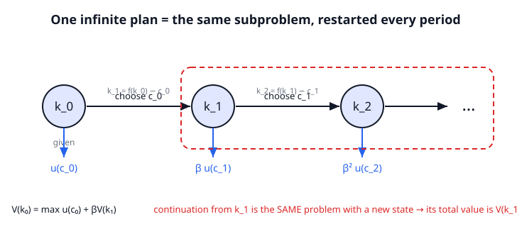

# Grad Macroeconomics · Lesson 1.1: Sequence vs. recursive problems

> ⏱ ~15 min · Module 1: The dynamic optimization toolkit · Builds on: [grad-micro's dynamic optimization](../../grad-micro/syllabus.md) · Unlocks: [1.2 The principle of optimality](01-02-principle-of-optimality.md)

## Why this matters

Almost every model in this course is one agent (or economy) choosing an *infinite* stream of actions — consume how much each year, forever — to maximize discounted lifetime payoff. Written honestly, that's an optimization over infinitely many variables at once. You cannot take an infinite gradient and set it to zero. The single move that makes first-year macro tractable is to stop looking at the whole infinite plan and instead look at **one period plus a summary of the future** — and discover that the "summary of the future" is itself the answer to the very same problem. That reframing, from a *sequence* problem into a *recursive* one, is the spine of the entire course. Get it once, cleanly, and Solow, Ramsey, RBC, asset pricing, and search models are all variations on it.

## The idea

Suppose you're maximizing $\sum_{t=0}^\infty \beta^t u(c_t)$ — the discounted sum of period payoffs. Stand at time $0$, make your first choice $c_0$, and then look at what's left: from time $1$ onward you face *another* infinite discounted sum, $\sum_{t=1}^\infty \beta^t u(c_t)$, subject to the same kind of constraint, starting from whatever resources $c_0$ left behind. Factor out the discounting: that continuation is worth $\beta \sum_{s=0}^\infty \beta^s u(c_{1+s})$ — an infinite-horizon problem structurally *identical* to the one you started with, just launched from a new starting point.

So the future doesn't need to be re-optimized from scratch. Define $V(k)$ = "the best total discounted payoff achievable starting with resources $k$." Then the whole plan collapses to a choice about *today only*: pick today's action to trade off today's payoff against the value of the resources you hand to tomorrow — and tomorrow's value is measured by the same $V$. An infinite-dimensional plan becomes **one equation in one unknown function**. That equation is the Bellman equation, and the picture below is the whole idea: a repeating self-similar structure, where the dashed box (everything from tomorrow on) is a shrunken copy of the whole.

## The formal version

**The sequence problem (SP).** Choose an infinite plan $\{c_t, k_{t+1}\}_{t=0}^\infty$ to
$$\max \ \sum_{t=0}^{\infty} \beta^t\, u(c_t) \quad \text{s.t.}\quad k_{t+1} = f(k_t) - c_t,\quad c_t \ge 0,\quad k_0 \text{ given}.$$
Here $u$ is the per-period **payoff (utility) function**; $\beta \in (0,1)$ is the **discount factor** (one util tomorrow is worth $\beta$ utils today, so $\beta$ close to 1 means patient); $c_t$ is **consumption**; $k_t$ is a resource carried between periods (call it capital); $f$ maps this period's stock into next period's available output. *In words: line up every choice for all of time and pick the whole ribbon at once.* This is an optimization over infinitely many variables.

**State vs. control.** The **state** is what you carry into a period and cannot change *this instant* — here $k_t$. It is a sufficient summary of the past: given $k_t$, nothing else about history matters for what you can do next. The **control** is what you freely choose this period — here $c_t$ (equivalently $k_{t+1}$, since the constraint links them one-to-one). Choosing the control moves the state: $k_{t+1} = f(k_t) - c_t$ is the **law of motion**.

**The recursive / functional-equation problem (FE).** Define the **value function** $V$ by
$$V(k) = \max_{\,c\,\ge 0,\ k' = f(k)-c\ \ge 0} \Big\{\, u(c) + \beta\, V(k') \,\Big\}.$$
This is the **Bellman equation**. *In words: the best you can do from stock $k$ equals the best over today's choice of [today's payoff plus the discounted best-you-can-do from whatever stock you leave behind].* The maximizer is the **policy function**
$$g(k) = \arg\max_{\,c} \Big\{\, u(c) + \beta\, V\!\big(f(k)-c\big) \,\Big\},$$
a rule "given state $k$, consume $g(k)$." Notice what happened to dimensionality: the SP has infinitely many unknowns $\{c_t\}$; the FE has exactly **one unknown object**, the function $V$, defined on the (finite-dimensional) state space. That is the whole payoff of going recursive — it's computable, and it hands you the decision rule $g$ directly.

**Stationarity.** Time $t$ does not appear anywhere in the Bellman equation — not in $u$, not in $f$, not in $\beta$'s role. Because the problem faced from any date looks identical once you know the current state, the same $V$ and the same $g$ work at *every* date. *In words: the optimal rule is "what state am I in?", never "what year is it?"* This is why we can drop time subscripts and write $V(k)$, $g(k)$ rather than $V_t(k_t)$ — time-invariance is a consequence of the infinite horizon plus stationary primitives.

**Why the two are the same problem (sketch).** The claim, made rigorous in [1.2](01-02-principle-of-optimality.md), is an *equivalence* $\text{SP} \iff \text{FE}$:

1. *Values coincide.* The $V$ solving the Bellman equation equals the SP's optimal value, $V(k_0) = \max \sum_t \beta^t u(c_t)$.
2. *Policies generate plans.* Iterating the policy function — $c_t = g(k_t)$, $k_{t+1} = f(k_t) - c_t$ — reconstructs the SP's optimal sequence $\{c_t^*\}$ exactly.

The intuition is precisely the factoring from *The idea*: the "$+\,\beta V(k')$" term is the entire optimized future, bottled. What could go wrong (and why we need conditions like discounting and boundedness) is the subject of 1.2 — for now, take the equivalence as the license to swap an infinite optimization for one functional equation.

## Picture

The black spine is the state marching forward under the law of motion; the blue drops are the discounted payoffs you collect; the red dashed box is the self-similarity — everything from $k_1$ on is a scale copy of everything from $k_0$ on, which is exactly why one function $V$ describes both.

## Worked examples

**Example 1 — Cake-eating: writing both forms.** You have a cake of size $W$. Each period you eat $c_t \ge 0$; the cake doesn't grow. You want to maximize $\sum_{t=0}^\infty \beta^t u(c_t)$.

- *Sequence problem:* $\displaystyle \max_{\{c_t\}} \sum_{t=0}^\infty \beta^t u(c_t)$ s.t. $\sum_{t=0}^\infty c_t \le W$, $c_t \ge 0$. Equivalently, with $k_t$ = cake remaining at the start of period $t$, the law of motion is $k_{t+1} = k_t - c_t$, $k_0 = W$.
- *State and control:* the **state** is $k_t$, the cake remaining — that single number is all you need to know to decide (the cake has no memory of how it got that small). The **control** is $c_t$, how much to eat now.
- *Bellman equation:* substituting $c = k - k'$,
$$V(k) = \max_{0 \le c \le k}\Big\{\, u(c) + \beta\, V(k - c)\,\Big\}.$$

That's it — the same tension in two costumes: eat now (payoff $u(c)$) vs. save cake for a future that's worth $\beta V(k-c)$.

**Example 2 — Guess-and-verify with log utility.** Take cake-eating with $u(c) = \ln c$ and law of motion $k' = k - c$. We'll *guess* the value function has the form
$$V(k) = A + B\ln k$$
for constants $A, B$ to be pinned down, plug it into the Bellman equation, and demand it hold for all $k$. If it does, guess-and-verify is a proof: a function satisfying the Bellman equation (with the right boundedness) *is* the value function.

Plug the guess in:
$$A + B\ln k = \max_{0\le c\le k}\Big\{ \ln c + \beta\big(A + B\ln(k-c)\big)\Big\}.$$

**Optimize the right side.** First-order condition in $c$:
$$\frac{1}{c} - \frac{\beta B}{k - c} = 0 \ \Longrightarrow\ \frac{k-c}{c} = \beta B \ \Longrightarrow\ \frac{k}{c} = 1 + \beta B \ \Longrightarrow\ c = \frac{k}{1 + \beta B}.$$
So consumption is a constant fraction of the remaining cake, and $k' = k - c = \dfrac{\beta B}{1+\beta B}\,k$.

**Match coefficients.** Substitute the optimal $c$ and $k'$ back. Using $\ln c = \ln k - \ln(1+\beta B)$ and $\ln k' = \ln k + \ln\frac{\beta B}{1+\beta B}$:
$$A + B\ln k = \underbrace{\big(1 + \beta B\big)}_{\text{coeff. of }\ln k}\ln k \;+\; \underbrace{\Big[-\ln(1+\beta B) + \beta A + \beta B\ln\tfrac{\beta B}{1+\beta B}\Big]}_{\text{constant}}.$$
The $\ln k$ terms must match:
$$B = 1 + \beta B \ \Longrightarrow\ B(1-\beta) = 1 \ \Longrightarrow\ \boxed{B = \frac{1}{1-\beta}}.$$
Then $\beta B = \dfrac{\beta}{1-\beta}$ and $1 + \beta B = \dfrac{1}{1-\beta}$, so the policy is
$$c = \frac{k}{1+\beta B} = (1-\beta)\,k \qquad\Longrightarrow\qquad g(k) = (1-\beta)k,\quad k' = \beta k.$$
*A patient agent (large $\beta$) eats a small slice $(1-\beta)$ each period and lets the cake shrink slowly at rate $\beta$ — clean, intuitive, and it drops straight out of the recursive form.* (The constant $A$ is then forced too: matching the constant terms gives $A(1-\beta) = \ln(1-\beta) + \frac{\beta}{1-\beta}\ln\beta$, i.e. $A = \frac{1}{1-\beta}\ln(1-\beta) + \frac{\beta}{(1-\beta)^2}\ln\beta$. We rarely need $A$ — it shifts the level of $V$ but not the decision.)

## Watch out

- **State is not a stock of stuff — it's an information summary.** The state is *whatever you must know to face the future optimally.* Sometimes that's capital; add a shock and it's (capital, shock); add a habit and it's (capital, last period's consumption). Picking too small a state (forgetting something payoff-relevant) breaks the recursion; picking too big just wastes effort. Choosing the state well is half of setting up any model.
- **Control vs. next-state are interchangeable only through the constraint.** We used $c$ and $k'$ as "the control" interchangeably because $k' = f(k) - c$ ties them one-to-one. Whenever the law of motion is invertible like this, optimize over whichever is more convenient — but say which, and keep the constraint in view.
- **Stationarity is earned, not assumed.** $V$ and $g$ are time-invariant *because* the horizon is infinite and the primitives $(u, f, \beta)$ don't depend on $t$. In a *finite*-horizon problem the value function carries a time subscript $V_t$ and you solve backward from the last period — the infinite horizon is exactly what buys you a single stationary $V$.
- **Guess-and-verify only proves you found *a* solution.** It's airtight *here* because log/CRRA utility with these linear laws of motion yields a bounded, well-behaved problem where the Bellman solution is unique. In general you need the contraction-mapping machinery (real-analysis: the Bellman operator is a contraction, so it has a unique fixed point) to know the guess is *the* value function — that's [1.2](01-02-principle-of-optimality.md).

## One-liner

> An infinite-horizon plan is self-similar: tomorrow's continuation is the same problem from a new state, so the whole thing collapses into one Bellman equation for the value function $V$ and the policy $g$ it induces.

## Problems

**P1 (🟢)** An agent solves $\displaystyle\max_{\{c_t\}} \sum_{t=0}^\infty \beta^t u(c_t)$ subject to $k_{t+1} = (1-\delta)k_t + w - c_t$ with $k_0$ given (here $w$ is a constant income each period and $\delta \in (0,1)$ a depreciation rate). Write the Bellman equation for this problem, and name the state and the control.

**P2 (🟡)** Solve log-utility cake-eating by guess-and-verify, filling in every step: with $u(c)=\ln c$, $k'=k-c$, guess $V(k)=A+B\ln k$, and show the guess satisfies the Bellman equation only if $B = \frac{1}{1-\beta}$, yielding the policy $c_t = (1-\beta)k_t$. (You may quote the value of $A$ without deriving it.)

**P3 (🔴)** A household values both consumption and leisure. Each period it has one unit of time, splits it into work $n_t$ and leisure $1-n_t$, produces output $f(k_t, n_t)$, and accumulates capital via $k_{t+1} = (1-\delta)k_t + f(k_t, n_t) - c_t$. Lifetime payoff is $\sum_{t=0}^\infty \beta^t\, u(c_t,\, 1-n_t)$. Write the Bellman equation, state what the state and the controls are, and derive the two within-period first-order conditions.

Solutions

**P1.** The single quantity carried across periods is $k_t$, so the **state** is $k$ (capital/wealth); the **control** is $c$ (consumption), with $k' = (1-\delta)k + w - c$ following once $c$ is chosen. Substituting the law of motion:
$$V(k) = \max_{0 \le c}\Big\{\, u(c) + \beta\, V\big((1-\delta)k + w - c\big)\,\Big\}.$$
Equivalently, optimizing over $k'$ directly with $c = (1-\delta)k + w - k'$:
$$V(k) = \max_{k'}\Big\{\, u\big((1-\delta)k + w - k'\big) + \beta\, V(k')\,\Big\}.$$
Either form is correct; both have the single state $k$.

**P2.** Guess $V(k) = A + B\ln k$. The Bellman equation is
$$A + B\ln k = \max_{0\le c\le k}\Big\{\ln c + \beta\big(A + B\ln(k-c)\big)\Big\}.$$
FOC in $c$: $\ \dfrac{1}{c} = \dfrac{\beta B}{k - c}\ \Rightarrow\ k - c = \beta B\,c\ \Rightarrow\ c = \dfrac{k}{1+\beta B}$, and $k' = k - c = \dfrac{\beta B}{1+\beta B}k$.

Substitute back. With $\ln c = \ln k - \ln(1+\beta B)$ and $\ln k' = \ln k + \ln\frac{\beta B}{1+\beta B}$,
$$A + B\ln k = (1+\beta B)\ln k \;-\; \ln(1+\beta B) + \beta A + \beta B\ln\tfrac{\beta B}{1+\beta B}.$$
Equating the coefficients of $\ln k$: $\ B = 1 + \beta B \Rightarrow B(1-\beta)=1 \Rightarrow B = \dfrac{1}{1-\beta}$.

Then $1 + \beta B = 1 + \dfrac{\beta}{1-\beta} = \dfrac{1}{1-\beta}$, so
$$c = \frac{k}{1+\beta B} = (1-\beta)k, \qquad g(k) = (1-\beta)k,\qquad k' = \beta k.$$
Matching the constant terms pins down $A = \dfrac{1}{1-\beta}\ln(1-\beta) + \dfrac{\beta}{(1-\beta)^2}\ln\beta$. The guess satisfies the Bellman equation for these $(A,B)$, and since the problem is bounded and well-posed, this $V$ is the value function and $g(k)=(1-\beta)k$ is optimal. ✓

**P3.** The only object carried across periods is capital, so the **state** is $k$. There are **two controls**: consumption $c$ and labor $n$ (leisure $1-n$ is then determined; capital $k'$ is pinned down by the resource constraint once $(c,n)$ are chosen). Substituting $c = (1-\delta)k + f(k,n) - k'$ to optimize over $(n, k')$:
$$V(k) = \max_{n,\,k'}\Big\{\, u\big((1-\delta)k + f(k,n) - k',\; 1-n\big) + \beta\,V(k')\,\Big\}.$$
Let $u_c$ and $u_\ell$ denote the partials of $u$ with respect to consumption and leisure.

*FOC in $n$* (raising $n$ adds $f_n$ to output/consumption but costs one unit of leisure):
$$u_c\cdot f_n - u_\ell = 0 \quad\Longrightarrow\quad \frac{u_\ell}{u_c} = f_n.$$
*In words:* the marginal rate of substitution between leisure and consumption equals the marginal product of labor — the intratemporal labor–leisure condition.

*FOC in $k'$* (saving one more unit costs $u_c$ today, buys $\beta V'(k')$ tomorrow):
$$-\,u_c + \beta\,V'(k') = 0 \quad\Longrightarrow\quad u_c = \beta\, V'(k').$$
*In words:* the marginal utility cost of saving equals the discounted marginal value of the extra capital — the intertemporal (consumption–savings) condition. Turning $V'(k')$ into observables via the envelope theorem is exactly what [1.4](01-04-envelope-theorem-dynamics.md) does, producing the consumption Euler equation.

## Connections

- **Backward (grad-micro):** you already optimized dynamically with Lagrangians and Kuhn–Tucker over finite horizons in [grad-micro](../../grad-micro/syllabus.md); this lesson swaps that "solve the whole path at once" approach for the recursive one that scales to infinite horizons.
- **Forward:** [1.2](01-02-principle-of-optimality.md) proves the SP $\iff$ FE equivalence rigorously (why the Bellman operator has a unique fixed point); [1.3](01-03-euler-transversality.md) extracts the Euler equation and transversality condition; [1.4](01-04-envelope-theorem-dynamics.md) evaluates $V'(k')$ via the envelope theorem; [1.5](01-05-stochastic-dynamic-programming.md) adds shocks, expanding the state to include them. Every model from Solow ([2.1](02-01-solow-model.md)) through asset pricing ([5.4](05-04-consumption-based-asset-pricing.md)) is a special case of this setup.
- **Sideways (dynamics):** the law of motion $k_{t+1} = g\text{-induced map}(k_t)$ is a discrete dynamical system on the state — its fixed points and stability (steady states, saddle paths) are exactly the [dynamical-systems](../../dynamical-systems/syllabus.md) toolkit applied to the policy function.
- **Sideways (optimal control):** engineers call the state/control split "state and control variables" and solve the same trade-off with Pontryagin's maximum principle in continuous time; the Bellman equation is the discrete-time, dynamic-programming face of that same coin (the Hamilton–Jacobi–Bellman equation is its continuous-time limit).
