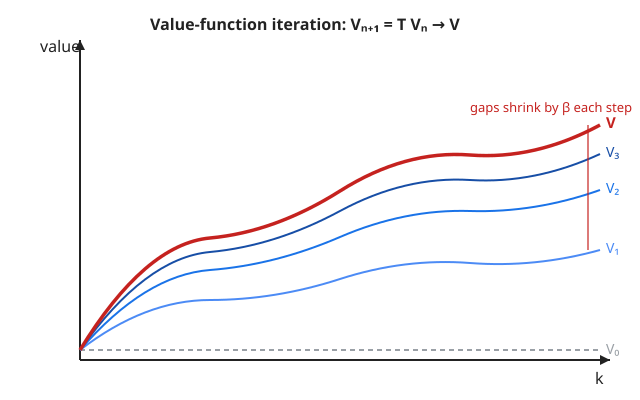

# Grad Macroeconomics · Lesson 1.2: The principle of optimality

> ⏱ ~15 min · Module 1: The dynamic optimization toolkit · Builds on: [1.1 Sequence vs. recursive problems](01-01-sequence-vs-recursive.md) · Unlocks: [1.3 Euler equations and transversality](01-03-euler-transversality.md)

## Why this matters

In [1.1](01-01-sequence-vs-recursive.md) we wrote down the Bellman equation and treated it as obviously true: the value of being at state $k$ equals the best you can do this period plus the discounted value of where you land. But we cheated twice. First, *does a function $V$ solving that equation even exist?* — the equation has $V$ on both sides, so it's a fixed-point condition, not a formula. Second, *is the recursive solution the same as the original infinite-horizon plan?* — maybe optimizing period-by-period throws away something a farsighted planner would keep.

This lesson closes both gaps. It's the theory that lets you use dynamic programming without guilt: the Bellman equation has exactly one bounded solution, it *is* the sequence problem's value, and there's a mechanical procedure — iterate an operator — that finds it and provably converges. Every recursive model in this course rests on what follows.

## The idea

**Bellman's principle of optimality**, in one sentence: *an optimal plan, viewed from any later date, is still optimal for the problem that starts at that date.* If the best lifetime consumption path has you holding capital $k_1$ tomorrow, then from tomorrow on, your path must be the best possible path *starting from $k_1$* — otherwise you could swap in the better continuation and improve the whole plan, contradicting that it was optimal. The future doesn't "know" it's a continuation; it only sees its own starting state.

That single observation does all the work. It says the giant infinite-horizon problem (the **sequence problem**, SP) collapses onto its one-period shadow (the **functional equation**, FE, i.e. the Bellman equation), because the entire tail of an optimal plan is summarized by *one number* — the value of the state you carry into it. You never need to re-solve the future; you need only its value function.

The second idea is how to actually *find* $V$. Read the Bellman equation as a machine. Feed it any candidate value function $f$, and it hands back a new function $Tf$: "if the future were worth $f$, here's what today would be worth." A genuine value function is one the machine leaves unchanged — a **fixed point**, $TV = V$. And because future payoffs are discounted by $\beta < 1$, the machine is a *contraction*: it pulls any two candidates closer together every time you apply it. Iterate from any starting guess and you spiral into the unique fixed point. That spiral is **value-function iteration**, and $\beta < 1$ is the whole reason it works.

## The formal version

Set up the canonical problem. A planner chooses next-period state $k'$ from a feasible set $\Gamma(k)$, earns period return $F(k,k')$, and discounts by $\beta \in (0,1)$.

**Sequence problem (SP).**
$$v^*(k_0) = \sup_{\{k_{t+1}\}} \ \sum_{t=0}^{\infty} \beta^t F(k_t, k_{t+1}), \quad k_{t+1}\in\Gamma(k_t),\ k_0 \text{ given.}$$

**Functional equation (FE) / Bellman equation.**
$$V(k) = \max_{k'\in\Gamma(k)} \ \big\{ F(k,k') + \beta V(k') \big\}.$$

*In words:* SP is the full lifetime plan; FE is the same objective folded into a single recursive step, with $V$ standing in for the entire discounted future.

**Equivalence theorem (Stokey–Lucas, high level).** Under standard regularity — $F$ bounded and continuous, $\Gamma$ a nonempty, compact-valued, continuous correspondence, $\beta\in(0,1)$ — the following hold:

1. The SP value $v^*$ **solves the FE**: $v^* = V$. (Principle of optimality, forward direction.)
2. Any bounded solution $V$ of the FE **equals the SP value** $v^*$, and a policy $g(k)\in\arg\max$ attaining the Bellman RHS **generates an optimal SP plan** via $k_{t+1}=g(k_t)$. (Reverse direction; boundedness rules out bubble-like phantom solutions.)

*In words:* solving the little recursive equation is not an approximation to the big problem — it *is* the big problem, and its policy is the optimal plan. (Stokey & Lucas, *Recursive Methods*, Ch. 4, package the precise measurability/continuity hypotheses; take them as satisfied here.)

**The Bellman operator.** Let $B$ be the space of bounded continuous functions $f:K\to\mathbb{R}$ on the (compact) state space, with the **sup norm** $\|f\| = \sup_k |f(k)|$. Define $T:B\to B$ by
$$(Tf)(k) = \max_{k'\in\Gamma(k)} \ \big\{ F(k,k') + \beta f(k') \big\}.$$
$T$ takes a value-function *candidate* and returns a value-function *candidate*. The FE is exactly the statement $TV=V$.

**Contraction Mapping Theorem (Banach).** $(B,\|\cdot\|)$ is a **complete** metric space (uniform limits of bounded continuous functions are bounded and continuous — this is the `real-analysis` fact that makes everything below legal). A map $T$ is a **contraction with modulus $\beta<1$** if $\|Tf-Tg\|\le \beta\|f-g\|$ for all $f,g$. Banach's theorem then guarantees:

- **existence & uniqueness** — $T$ has exactly one fixed point $V$;
- **global convergence** — for *any* starting $V_0\in B$, the iterates $V_{n+1}=TV_n$ satisfy $V_n\to V$ (uniformly);
- **geometric rate** — $\|V_n - V\| \le \beta^n\|V_0-V\|$.

*In words:* one $V$ exists, it's unique, and you can compute it by cranking $T$ from anywhere — the error falls by a factor $\beta$ per crank.

**Blackwell's sufficient conditions.** Checking $\|Tf-Tg\|\le\beta\|f-g\|$ head-on can be awkward. Blackwell gives two easy-to-verify conditions that *imply* it. For $T:B\to B$ (with $B$ a space of bounded functions):

- **(i) Monotonicity.** $f\le g$ pointwise $\implies Tf\le Tg$ pointwise.
- **(ii) Discounting.** There is $\beta\in(0,1)$ such that for every constant $c\ge 0$, $\ T(f+c) \le Tf + \beta c$ (adding a constant $c$ to the input raises the output by at most $\beta c$).

*In words:* (i) a better-looking future makes today look better; (ii) shifting all future values up by a flat $c$ moves today up by only $\beta c$ — the future gets discounted. Conditions (i)–(ii) $\implies$ $T$ is a $\beta$-contraction. Both are transparent for the standard Bellman operator, and (ii) is where $\beta<1$ enters: **discounting is what shrinks distances, and shrinking distances is what makes infinite-horizon DP solvable.**

## Picture

Start from a flat guess $V_0=0$. Each application of $T$ produces a new curve; successive curves march monotonically upward toward $V$, and the vertical gap between consecutive curves shrinks by a factor $\beta$ every step. Convergence isn't hoped for — it's the geometry of a contraction.

## Worked examples

**Example 1 — verify Blackwell's two conditions, conclude $\beta$-contraction.**

Take the standard operator $(Tf)(k)=\max_{k'\in\Gamma(k)}\{F(k,k')+\beta f(k')\}$ with $\beta\in(0,1)$.

*Monotonicity.* Suppose $f\le g$ everywhere. For each fixed $k'$, $F(k,k')+\beta f(k') \le F(k,k')+\beta g(k')$ since $\beta>0$. Taking $\max$ over $k'$ preserves the inequality (a max of smaller things is smaller):
$$(Tf)(k)=\max_{k'}\{F+\beta f(k')\}\le \max_{k'}\{F+\beta g(k')\}=(Tg)(k).\ \checkmark$$

*Discounting.* Let $c\ge 0$ be a constant. Then
$$\big(T(f+c)\big)(k)=\max_{k'}\{F(k,k')+\beta(f(k')+c)\}=\max_{k'}\{F(k,k')+\beta f(k')\}+\beta c=(Tf)(k)+\beta c,$$
because the additive term $\beta c$ doesn't depend on the choice variable $k'$ and slides straight out of the $\max$. So $T(f+c)=Tf+\beta c \le Tf+\beta c$. $\checkmark$ (Here it's an equality, which certainly satisfies the "$\le$" Blackwell asks for.)

Both conditions hold, so **$T$ is a contraction of modulus $\beta$** on $B$. By Banach it has a unique fixed point $V$ and value-function iteration converges to it from any start. Notice discounting used $\beta<1$ in an essential way: had $\beta\ge 1$, adding $c$ to the future would raise today by $\ge c$, distances wouldn't shrink, and the whole apparatus would collapse.

**Example 2 — value-function iteration by hand: log cake-eating.**

You hold a cake of size $k$, eat $c=k-k'$ this period (leaving $k'\in[0,k]$), and value consumption by $\ln c$ with discount $\beta$. The Bellman equation is
$$V(k)=\max_{0\le k'\le k}\ \big\{\ln(k-k')+\beta V(k')\big\},\qquad (Tf)(k)=\max_{k'}\{\ln(k-k')+\beta f(k')\}.$$

Iterate from $V_0(k)=0$.

*Step 1.* $V_1(k)=\max_{k'}\{\ln(k-k')+\beta\cdot 0\}$. Consumption is maximized by eating everything, $k'=0$, giving
$$V_1(k)=\ln k.$$

*Step 2.* $V_2(k)=\max_{k'}\{\ln(k-k')+\beta\ln k'\}$. First-order condition: $-\dfrac{1}{k-k'}+\dfrac{\beta}{k'}=0\Rightarrow \beta(k-k')=k'\Rightarrow k'=\dfrac{\beta}{1+\beta}k$. Then $c=k-k'=\dfrac{1}{1+\beta}k$, and
$$V_2(k)=\ln\!\frac{k}{1+\beta}+\beta\ln\!\frac{\beta k}{1+\beta}=(1+\beta)\ln k+\underbrace{\big[\beta\ln\beta-(1+\beta)\ln(1+\beta)\big]}_{\text{constant}}.$$

*Step 3.* Repeating the same FOC with $V_2$ in the continuation gives a $\ln k$ coefficient of $1+\beta+\beta^2$. The pattern is clean: after $n$ steps the coefficient on $\ln k$ is
$$1+\beta+\beta^2+\cdots+\beta^{n-1}=\frac{1-\beta^n}{1-\beta}\ \xrightarrow[n\to\infty]{}\ \frac{1}{1-\beta}.$$

So $V_n(k)=A_n+B_n\ln k$ with $B_n\uparrow \dfrac{1}{1-\beta}$ (and $A_n$ converging too). The limit is exactly the guess-and-verify answer $V(k)=A+B\ln k$ with $B=\dfrac{1}{1-\beta}$ and optimal policy $k'=\beta k$. Watch the contraction literally: the coefficient's distance from its target, $\big|\frac{1-\beta^n}{1-\beta}-\frac{1}{1-\beta}\big|=\frac{\beta^n}{1-\beta}$, falls by a factor $\beta$ each iteration — the $\|V_n-V\|\le\beta^n\|V_0-V\|$ bound, made visible.

## Watch out

- **Boundedness is not decoration.** The reverse equivalence ("any FE solution equals $v^*$") needs the solution to be *bounded*. Drop it and spurious solutions appear — e.g. explosive paths that satisfy the FE algebraically but violate the transversality condition. That's the hole [1.3](01-03-euler-transversality.md) plugs. If $F$ is unbounded (log or CRRA utility with unbounded capital), the plain sup-norm theorem doesn't apply verbatim; you use a weighted norm or bound the state space, but the *spirit* survives.
- **Blackwell's conditions are sufficient, not necessary.** Failing them doesn't prove $T$ isn't a contraction — it just means this particular shortcut is silent. And they only apply once you already know $T$ maps $B$ into $B$ (bounded continuous $\to$ bounded continuous); establishing that is a separate, prior step.
- **Contraction gives a *unique* fixed point globally, but each iterate is only as good as its own accuracy.** VFI converges from any $V_0$, yet on a computer the max and the interpolation introduce error every step — the theorem bounds the *idealized* iterates, not your grid approximation.
- **Don't confuse the policy with the value.** $T$ acts on value functions; the optimal policy $g$ is a *byproduct* (the argmax). Two different value candidates can share regions of the same argmax — convergence of $V_n$ is the thing guaranteed, not monotone convergence of the implied policies.

## One-liner

> Discounting the future by $\beta<1$ makes the Bellman operator a contraction, so the value function exists, is unique, and is found by iterating from any guess — that single fact is why infinite-horizon dynamic programming works at all.

## Problems

**P1 (🟢)** Consider the operator $(Tf)(x)=\max_{a\in[0,\,x]}\big\{\sqrt{a}+0.95\,f(x-a)\big\}$ on the space of bounded continuous functions on $[0,\bar x]$. Verify Blackwell's monotonicity and discounting conditions, and state the resulting contraction modulus.

**P2 (🟡)** Prove *directly* (without Blackwell) that the Bellman operator $(Tf)(k)=\max_{k'\in\Gamma(k)}\{F(k,k')+\beta f(k')\}$ satisfies $\|Tf-Tg\|\le\beta\|f-g\|$ in the sup norm, hence is a $\beta$-contraction.

**P3 (🔴)** Using only the contraction property $\|Tf-Tg\|\le\beta\|f-g\|$ (so $V=TV$ is the fixed point and $V_{n+1}=TV_n$), derive the *a priori* error bound
$$\|V_n - V\|\ \le\ \frac{\beta^{\,n}}{1-\beta}\,\|V_1-V_0\|,$$
which lets you certify accuracy after $n$ iterations *without knowing $V$*. As a check, also show the shorter $\|V_n-V\|\le\beta^n\|V_0-V\|$.

Solutions

**P1.** *Monotonicity.* If $f\le g$ pointwise, then for each feasible $a$, $\sqrt a+0.95\,f(x-a)\le \sqrt a+0.95\,g(x-a)$ (coefficient $0.95>0$). Taking $\max$ over $a\in[0,x]$ preserves the order, so $(Tf)(x)\le(Tg)(x)$. $\checkmark$

*Discounting.* For a constant $c\ge0$,
$$\big(T(f+c)\big)(x)=\max_{a}\{\sqrt a+0.95(f(x-a)+c)\}=\max_a\{\sqrt a+0.95\,f(x-a)\}+0.95\,c=(Tf)(x)+0.95\,c,$$
since $0.95\,c$ is independent of $a$ and pulls out of the $\max$. Thus $T(f+c)\le Tf+0.95\,c$. $\checkmark$

Both hold with $\beta=0.95$, so $T$ is a **contraction of modulus $0.95$**; by Banach it has a unique bounded fixed point and VFI converges to it.

**P2.** Fix any $k$. Let $k_f'\in\Gamma(k)$ attain $(Tf)(k)$, i.e. $(Tf)(k)=F(k,k_f')+\beta f(k_f')$. Since $k_f'$ is merely *feasible* for the $g$-problem (not necessarily optimal), it gives a lower bound on the max:
$$(Tg)(k)\ \ge\ F(k,k_f')+\beta g(k_f').$$
Subtract:
$$(Tf)(k)-(Tg)(k)\ \le\ \beta\big(f(k_f')-g(k_f')\big)\ \le\ \beta\,\|f-g\|,$$
using $f(k_f')-g(k_f')\le\sup_{k'}|f-g|=\|f-g\|$. The argument is symmetric in $f,g$ (swap their roles, using the $g$-maximizer to bound the $f$-problem), giving $(Tg)(k)-(Tf)(k)\le\beta\|f-g\|$. Hence $|(Tf)(k)-(Tg)(k)|\le\beta\|f-g\|$ for every $k$. Taking the sup over $k$:
$$\|Tf-Tg\|\le\beta\|f-g\|.\qquad\blacksquare$$
(The trick is the one-sided "feasible-but-suboptimal choice bounds the other max" move — it turns two separate maximizations into a single clean inequality.)

**P3.** *A priori bound.* First bound one step of iterate-to-iterate movement. For any $n\ge1$,
$$\|V_{n+1}-V_n\|=\|TV_n-TV_{n-1}\|\le\beta\|V_n-V_{n-1}\|,$$
so by induction $\|V_{n+1}-V_n\|\le\beta^n\|V_1-V_0\|$. Now for any $m>n$, telescope and use the triangle inequality:
$$\|V_m-V_n\|\le\sum_{j=n}^{m-1}\|V_{j+1}-V_j\|\le\sum_{j=n}^{m-1}\beta^{\,j}\|V_1-V_0\|\le \beta^{\,n}\|V_1-V_0\|\sum_{i=0}^{\infty}\beta^i=\frac{\beta^{\,n}}{1-\beta}\|V_1-V_0\|.$$
The bound is uniform in $m$; let $m\to\infty$, and since $V_m\to V$ (Banach) the left side $\to\|V-V_n\|$:
$$\|V_n-V\|\le\frac{\beta^{\,n}}{1-\beta}\|V_1-V_0\|.\qquad\blacksquare$$
Everything on the right is computable after one iteration ($\|V_1-V_0\|$) — no knowledge of $V$ needed, which is what makes it a usable stopping rule.

*Shorter a posteriori-style bound.* Since $V$ is the fixed point, $V=TV$, so applying the contraction $n$ times,
$$\|V_n-V\|=\|T^nV_0-T^nV\|\le\beta\|T^{n-1}V_0-T^{n-1}V\|\le\cdots\le\beta^{\,n}\|V_0-V\|.$$
This is tighter but requires $\|V_0-V\|$, i.e. knowing $V$; the a priori bound trades a factor $\frac{1}{1-\beta}$ for not needing it.

## Connections

- **Backward — [1.1](01-01-sequence-vs-recursive.md):** the Bellman equation we simply asserted is now earned. The equivalence theorem says the recursive FE and the lifetime SP share a value and a policy; the contraction says that value actually exists and is unique.
- **Forward — [1.3](01-03-euler-transversality.md) & [1.4](01-04-envelope-theorem-dynamics.md):** now that $V$ provably exists we can differentiate it — the Euler equation and the envelope theorem both differentiate the value function, and transversality is precisely the boundedness condition that pins down the *right* FE solution (the loophole flagged in "Watch out"). Every recursive method downstream — [stochastic DP](01-05-stochastic-dynamic-programming.md), [recursive competitive equilibrium](01-06-recursive-competitive-equilibrium.md) — inherits this existence guarantee.
- **Sideways — [`real-analysis`](../../real-analysis/syllabus.md):** this lesson *is* the Banach fixed-point theorem's flagship economic application. Completeness of the bounded-continuous-function space under the sup norm (a `real-analysis` staple) is exactly what licenses "iterate from any guess and it converges."
- **Sideways — [`dynamical-systems`](../../dynamical-systems/syllabus.md):** value-function iteration is a discrete dynamical system on function space whose stable fixed point is $V$; the contraction modulus $\beta$ is its (global) convergence rate. Same fixed-point-and-stability lens, one dimension up.
