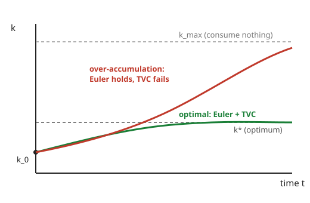

# Grad Macroeconomics · Lesson 1.3: Euler equations and transversality

> ⏱ ~15 min · Module 1: The dynamic optimization toolkit · Builds on: [1.2 The principle of optimality](01-02-principle-of-optimality.md) · Unlocks: [1.4 The envelope theorem in dynamics](01-04-envelope-theorem-dynamics.md)

## Why this matters

The Bellman equation of [1.2](01-02-principle-of-optimality.md) tells you an optimum *exists* and is recursive, but it doesn't hand you a testable condition on the actual path of consumption and capital. This lesson gives you two — and together they *are* the solution. The **Euler equation** is the intertemporal first-order condition: a marginal, period-by-period no-arbitrage rule. The **transversality condition (TVC)** is the boundary condition at $t=\infty$ that infinite-horizon problems need in place of a terminal date. Euler alone is not enough: a whole zoo of wasteful, over-accumulating paths satisfies it. TVC is what throws them out and pins down the one path you'd actually choose. And the punchline — the Euler equation is literally the asset-pricing equation $1=\mathbb{E}[mR]$ — is the bridge that carries macro into finance.

## The idea

Sit at the optimum and try to improve it by a tiny, costless-looking experiment: **eat one less unit today, invest it, eat the proceeds tomorrow.** Giving up a unit of $c_t$ costs you $u'(c_t)$ in utility now. That unit, saved, earns a gross return $R_{t+1}$ (its marginal product plus whatever's left after depreciation), so tomorrow you get $R_{t+1}$ extra units of $c_{t+1}$, worth $\beta\,u'(c_{t+1})\,R_{t+1}$ in today's terms (discount by $\beta$, value at tomorrow's marginal utility). At a true optimum this swap must be a wash — otherwise you'd keep doing it. Set cost equal to benefit:

$$u'(c_t) = \beta\,u'(c_{t+1})\,R_{t+1}.$$

That's the whole Euler equation, read off an arbitrage picture before any calculus.

But this argument is *local* — it only rules out one-step deviations. It says nothing about a plan that saves a little too much every period and keeps a growing pile of capital forever, enjoying it never. Every one of those plans passes the Euler test at every date, yet each leaves utility on the table. You need one more condition to say "and don't do *that*" — a rule about the far future. That's transversality.

## The formal version

**The environment.** One-sector optimal growth. A representative agent solves

$$\max_{\{c_t,\,k_{t+1}\}} \ \sum_{t=0}^{\infty}\beta^t u(c_t)\quad\text{s.t.}\quad k_{t+1}=f(k_t)+(1-\delta)k_t-c_t,\ \ c_t\ge 0,\ k_0\text{ given},$$

where $c_t\ge0$ is consumption, $k_t\ge0$ is capital, $u$ is a strictly increasing, strictly concave period utility, $\beta\in(0,1)$ is the discount factor, $f$ is a strictly increasing, concave production function, and $\delta\in[0,1]$ is the depreciation rate. Write the **gross return on saving** as

$$R_{t+1}\equiv f'(k_{t+1})+1-\delta,$$

the extra output one more unit of capital produces next period, plus the fraction $1-\delta$ of that unit that survives.

**The Euler equation.**

$$\boxed{\,u'(c_t)=\beta\,u'(c_{t+1})\big[f'(k_{t+1})+1-\delta\big]\,}$$

*In words:* at the optimum the marginal utility of a unit consumed today equals the discounted marginal utility of what that unit becomes tomorrow if saved — you cannot gain by shifting consumption across adjacent periods.

**The transversality condition.**

$$\boxed{\,\lim_{t\to\infty}\beta^t\,u'(c_t)\,k_{t+1}=0\,}$$

*In words:* the present discounted value (in utility) of the capital you're still holding must vanish in the limit. Capital is valuable, so carrying a positive discounted amount of it into the infinite future means you hoarded resources you could have consumed — "wealth left on the table." TVC forbids exactly that.

**Necessity and sufficiency (the theorem that makes these the answer).**
- *Necessity.* If $\{c_t,k_{t+1}\}$ is optimal (interior, with $u,f$ concave), then it satisfies the Euler equation at every $t$ **and** the TVC. Euler comes from the sequence Lagrangian; TVC comes from ruling out profitable deviations that shift the endpoint.
- *Sufficiency.* Conversely — and this is the workhorse direction — if the problem is concave (concave $u$, concave $f$) and a feasible path satisfies **both** the Euler equation for all $t$ **and** the TVC, then it **is** optimal. Concavity turns first-order conditions plus the right boundary condition into a global guarantee.

So the recipe is complete: find a path solving Euler, check TVC, and you're done — no second-order fuss, no comparing infinitely many candidates by hand.

**The asset-pricing bridge.** Define the **stochastic discount factor (SDF)**

$$m_{t+1}\equiv \beta\,\frac{u'(c_{t+1})}{u'(c_t)}.$$

Divide the Euler equation by $u'(c_t)$ and it becomes $1=m_{t+1}R_{t+1}$; with uncertainty, taking the conditional expectation $\mathbb{E}_t$,

$$1=\mathbb{E}_t\!\big[m_{t+1}R_{t+1}\big].$$

*In words:* every asset's expected return, weighted by how hungry you'll be when it pays off, must price at par. This one equation prices *all* assets — it is the exact object `](../../mathematical-finance/syllabus.md)` builds its whole pricing theory on, and it reappears in [5.4](05-04-consumption-based-asset-pricing.md).

## Picture

Both paths start at $k_0$ and obey the Euler equation at *every* date — the difference is entirely in the tail. The green path settles at the steady-state capital $k^*$ and its discounted capital value dies out (TVC holds). The red path keeps saving a touch too much forever, drifting toward the "consume nothing" corner $k_{\max}$; its discounted capital value does **not** vanish, so TVC fails and it is not optimal. TVC is the selector that keeps green and discards red.

## Worked examples

**Example 1 — deriving the Euler equation via the sequence Lagrangian.** Attach a multiplier $\lambda_t$ to each period's resource constraint:

$$\mathcal{L}=\sum_{t=0}^\infty\Big\{\beta^t u(c_t)+\lambda_t\big[f(k_t)+(1-\delta)k_t-c_t-k_{t+1}\big]\Big\}.$$

Two first-order conditions. Differentiate in $c_t$:

$$\frac{\partial\mathcal{L}}{\partial c_t}=\beta^t u'(c_t)-\lambda_t=0\ \Rightarrow\ \lambda_t=\beta^t u'(c_t).$$

Now differentiate in $k_{t+1}$. This variable appears twice: with a $-\lambda_t$ from period $t$'s constraint, and inside period $t{+}1$'s constraint multiplied by $\lambda_{t+1}$:

$$\frac{\partial\mathcal{L}}{\partial k_{t+1}}=-\lambda_t+\lambda_{t+1}\big[f'(k_{t+1})+1-\delta\big]=0\ \Rightarrow\ \lambda_t=\lambda_{t+1}\big[f'(k_{t+1})+1-\delta\big].$$

Substitute $\lambda_t=\beta^t u'(c_t)$ and $\lambda_{t+1}=\beta^{t+1}u'(c_{t+1})$ and cancel $\beta^t$:

$$\beta^t u'(c_t)=\beta^{t+1}u'(c_{t+1})\big[f'(k_{t+1})+1-\delta\big]\ \Longrightarrow\ u'(c_t)=\beta\,u'(c_{t+1})\big[f'(k_{t+1})+1-\delta\big].$$

The multiplier is the shadow value of resources, $\lambda_t=\beta^t u'(c_t)$; the TVC $\lim_t \lambda_t k_{t+1}=0$ is just "the shadow value of leftover capital vanishes." (In [1.4](01-04-envelope-theorem-dynamics.md) we'll get the same equation from the Bellman FOC $u'(c_t)=\beta V'(k_{t+1})$ plus the envelope result $V'(k)=u'(c)\,R$ — a preview: the envelope theorem is what makes $V'$ computable.)

**Example 2 — the log / full-depreciation case, solved and TVC-checked.** Take $u(c)=\ln c$, $f(k)=k^\alpha$ with $\alpha\in(0,1)$, and $\delta=1$ (capital fully depreciates each period, so $k_{t+1}=k_t^\alpha-c_t$). Then $u'(c)=1/c$ and $f'(k)=\alpha k^{\alpha-1}$, and since $1-\delta=0$ the Euler equation becomes

$$\frac{1}{c_t}=\beta\,\frac{1}{c_{t+1}}\,\alpha k_{t+1}^{\alpha-1}.$$

*Guess* the linear policy $c_t=(1-\alpha\beta)k_t^\alpha$ (consume a fixed fraction of output). Then saving is $k_{t+1}=k_t^\alpha-c_t=\alpha\beta k_t^\alpha$, and $c_{t+1}=(1-\alpha\beta)k_{t+1}^\alpha$. *Verify Euler* — right-hand side:

$$\beta\,\frac{\alpha k_{t+1}^{\alpha-1}}{(1-\alpha\beta)k_{t+1}^\alpha}=\frac{\alpha\beta}{(1-\alpha\beta)\,k_{t+1}}=\frac{\alpha\beta}{(1-\alpha\beta)\,\alpha\beta k_t^\alpha}=\frac{1}{(1-\alpha\beta)k_t^\alpha}=\frac{1}{c_t}.\ \checkmark$$

*Verify TVC:*

$$\beta^t u'(c_t)\,k_{t+1}=\beta^t\,\frac{k_{t+1}}{c_t}=\beta^t\,\frac{\alpha\beta k_t^\alpha}{(1-\alpha\beta)k_t^\alpha}=\beta^t\,\frac{\alpha\beta}{1-\alpha\beta}\xrightarrow[t\to\infty]{}0,$$

since $0<\beta<1$. Euler ✓ and TVC ✓, so by sufficiency this policy is the *unique* optimum. This is the exact closed form Boss Problem 1 is built around.

## Watch out

- **Euler is necessary, not sufficient.** Passing the Euler test at every date does *not* make a path optimal — the over-accumulating red path in the Picture is the standing counterexample. Always check TVC before declaring victory. (Problem 3 constructs an explicit Euler-satisfying, TVC-violating path.)
- **The gross return includes undepreciated capital.** $R_{t+1}=f'(k_{t+1})+1-\delta$, not just $f'(k_{t+1})$. Dropping the $1-\delta$ is the most common algebra slip; it only disappears when $\delta=1$ (as in Example 2).
- **TVC is about the discounted value of capital, not capital itself.** $k_{t+1}$ can grow without bound and TVC can still hold, as long as $\beta^t u'(c_t)$ shrinks faster. It's the *product* $\beta^t u'(c_t)k_{t+1}$ that must vanish.
- **Index bookkeeping.** The return that rewards saving done at $t$ is dated $t{+}1$, because the capital $k_{t+1}$ produces next period. Line up your time subscripts before differentiating.

## One-liner

> The Euler equation says you can't profit by shifting consumption one period; transversality says you can't profit by shifting resources into the infinite future — together, under concavity, they *are* the optimum.

## Problems

**P1 (🟢)** Let period utility be CRRA, $u(c)=\dfrac{c^{1-\sigma}}{1-\sigma}$ with $\sigma>0$. Write the Euler equation for the growth model, solve it for the consumption growth ratio $c_{t+1}/c_t$, and say in one sentence how the parameter $\sigma$ controls the economy's willingness to tilt consumption across time.

**P2 (🟡 — Boss Problem 1 core)** In the log / Cobb–Douglas / full-depreciation model of Example 2, a colleague proposes the policy $c_t=(1-\alpha\beta)\,k_t^\alpha$. Verify from scratch that it satisfies **both** the Euler equation and the transversality condition, and state why those two checks are enough to conclude it is optimal.

**P3 (🔴)** Stay in the log / $\delta=1$ model. Let $s_t\equiv k_{t+1}/k_t^\alpha$ be the saving rate, so $c_t=(1-s_t)k_t^\alpha$.
(a) Show the Euler equation is equivalent to the recursion $s_{t+1}=1+\alpha\beta-\dfrac{\alpha\beta}{s_t}$, and that $s_t\equiv\alpha\beta$ is a constant solution (the Example-2 optimum).
(b) Show this fixed point is *unstable* going forward: any path with $s_0$ slightly above $\alpha\beta$ has $s_t\to 1$ (over-accumulation toward "consume nothing").
(c) Along such a path, show the transversality term $\beta^t u'(c_t)k_{t+1}$ **diverges**, so the path satisfies the Euler equation at every date yet is not optimal.

Solutions

**P1.** With $u'(c)=c^{-\sigma}$ the Euler equation is

$$c_t^{-\sigma}=\beta\,c_{t+1}^{-\sigma}\big[f'(k_{t+1})+1-\delta\big]=\beta\,c_{t+1}^{-\sigma}R_{t+1}.$$

Divide by $c_{t+1}^{-\sigma}$ and rearrange: $\big(c_{t+1}/c_t\big)^{\sigma}=\beta R_{t+1}$, so

$$\frac{c_{t+1}}{c_t}=\big(\beta R_{t+1}\big)^{1/\sigma}.$$

The exponent $1/\sigma$ is the **intertemporal elasticity of substitution**: it is how strongly consumption growth responds to the return $R_{t+1}$. Large $\sigma$ (small $1/\sigma$) means a strong desire to *smooth* — the agent barely tilts consumption even when the return is high; small $\sigma$ means the agent readily front- or back-loads consumption to chase returns.

**P2.** *Euler.* Here $u'(c)=1/c$, $f'(k)=\alpha k^{\alpha-1}$, $1-\delta=0$, so the Euler equation is $\dfrac{1}{c_t}=\beta\dfrac{1}{c_{t+1}}\alpha k_{t+1}^{\alpha-1}$. Under the proposed policy, $k_{t+1}=k_t^\alpha-c_t=k_t^\alpha-(1-\alpha\beta)k_t^\alpha=\alpha\beta k_t^\alpha$ and $c_{t+1}=(1-\alpha\beta)k_{t+1}^\alpha$. Right-hand side:

$$\beta\,\frac{\alpha k_{t+1}^{\alpha-1}}{(1-\alpha\beta)k_{t+1}^{\alpha}}=\frac{\alpha\beta}{(1-\alpha\beta)k_{t+1}}=\frac{\alpha\beta}{(1-\alpha\beta)\alpha\beta k_t^{\alpha}}=\frac{1}{(1-\alpha\beta)k_t^{\alpha}}=\frac{1}{c_t}.\ \checkmark$$

*TVC.* $\displaystyle\beta^t u'(c_t)k_{t+1}=\beta^t\frac{\alpha\beta k_t^\alpha}{(1-\alpha\beta)k_t^\alpha}=\frac{\alpha\beta}{1-\alpha\beta}\,\beta^t\to0$ as $t\to\infty$ (because $0<\beta<1$). ✓

*Why enough.* The problem is concave: $u=\ln c$ is concave and $f=k^\alpha$ is concave. For a concave problem the Euler equation (all $t$) **plus** the TVC is *sufficient* for a global optimum. Both hold, so the policy is optimal — and since the optimum of a strictly concave problem is unique, it's the only one.

**P3.** (a) Divide the Euler equation $\dfrac1{c_t}=\beta\dfrac1{c_{t+1}}\alpha k_{t+1}^{\alpha-1}$ through, substituting $c_t=(1-s_t)k_t^\alpha$, $k_{t+1}=s_t k_t^\alpha$, and $c_{t+1}=(1-s_{t+1})k_{t+1}^\alpha$:

$$\frac{1}{(1-s_t)k_t^\alpha}=\beta\,\frac{\alpha k_{t+1}^{\alpha-1}}{(1-s_{t+1})k_{t+1}^{\alpha}}=\frac{\alpha\beta}{(1-s_{t+1})\,k_{t+1}}=\frac{\alpha\beta}{(1-s_{t+1})\,s_t k_t^\alpha}.$$

Cancel $k_t^\alpha$ from both sides and cross-multiply: $(1-s_{t+1})\,s_t=\alpha\beta\,(1-s_t)$, hence

$$1-s_{t+1}=\frac{\alpha\beta(1-s_t)}{s_t}\ \Longrightarrow\ s_{t+1}=1+\alpha\beta-\frac{\alpha\beta}{s_t}.$$

Check $s_t\equiv\alpha\beta$: $\;1+\alpha\beta-\dfrac{\alpha\beta}{\alpha\beta}=1+\alpha\beta-1=\alpha\beta$. ✓ Constant solution, and $s=\alpha\beta$ reproduces $k_{t+1}=\alpha\beta k_t^\alpha$ — Example 2's optimum.

(b) Let $g(s)=1+\alpha\beta-\alpha\beta/s$, so $g'(s)=\alpha\beta/s^2$. At the fixed point, $g'(\alpha\beta)=\dfrac{\alpha\beta}{(\alpha\beta)^2}=\dfrac{1}{\alpha\beta}>1$ since $\alpha\beta<1$. A slope above $1$ means the map *repels*: a small displacement $s_0=\alpha\beta+\varepsilon$ grows under iteration, so $s_t$ moves away from $\alpha\beta$. The other fixed point solves $s=1+\alpha\beta-\alpha\beta/s\Rightarrow s^2-(1+\alpha\beta)s+\alpha\beta=0\Rightarrow(s-1)(s-\alpha\beta)=0$, i.e. $s=1$; and $g'(1)=\alpha\beta<1$, so $s=1$ is *attracting*. Starting just above $\alpha\beta$, the path climbs and converges to $s_t\to1$: the agent saves a larger and larger share and eats a vanishing one — over-accumulation.

(c) Near $s=1$ write $s_t=1-\varepsilon_t$ with $\varepsilon_t\to0^+$. Then $\dfrac{\alpha\beta}{s_t}=\dfrac{\alpha\beta}{1-\varepsilon_t}\approx\alpha\beta(1+\varepsilon_t)$, so $s_{t+1}\approx1+\alpha\beta-\alpha\beta(1+\varepsilon_t)=1-\alpha\beta\,\varepsilon_t$, giving $\varepsilon_{t+1}\approx\alpha\beta\,\varepsilon_t$ and thus $\varepsilon_t\approx\varepsilon_0(\alpha\beta)^t$. As $s_t\to1$, capital approaches the corner where $k=k^\alpha$, i.e. $k_t\to1$, so $k_{t+1}\to1$; and consumption $c_t=(1-s_t)k_t^\alpha=\varepsilon_t k_t^\alpha\approx\varepsilon_0(\alpha\beta)^t$. The transversality term is then

$$\beta^t u'(c_t)k_{t+1}=\beta^t\frac{k_{t+1}}{c_t}\approx\beta^t\frac{1}{\varepsilon_0(\alpha\beta)^t}=\frac{1}{\varepsilon_0}\Big(\frac{\beta}{\alpha\beta}\Big)^t=\frac{1}{\varepsilon_0}\Big(\frac1\alpha\Big)^t\xrightarrow[t\to\infty]{}\infty,$$

because $1/\alpha>1$. The term blows up instead of vanishing, so TVC fails. Every such path solves the Euler equation at each date yet wastes resources — you could raise consumption in *every* period by saving slightly less and be strictly better off. That's precisely the plan TVC exists to reject, and the red curve in the Picture made visible.

## Flashback

**From [1.2](01-02-principle-of-optimality.md) (contraction mappings).** Consider the Bellman operator on bounded continuous functions,

$$(Tv)(k)=\max_{0\le c\le f(k)+(1-\delta)k}\ \Big\{u(c)+\beta\,v\big(f(k)+(1-\delta)k-c\big)\Big\}.$$

Using Blackwell's sufficient conditions, show $T$ is a contraction with modulus $\beta$, and say in one line why that guarantees a unique value function.

Solution

Blackwell's two conditions: **monotonicity** and **discounting**.

*Monotonicity.* Suppose $v\le w$ pointwise. For any $k$, take $c^*$ achieving the max in $(Tv)(k)$. Since $v\le w$, replacing $v$ by $w$ at the *same* $c^*$ can only weakly raise the objective, and the max over $c$ is at least that value: $(Tv)(k)\le u(c^*)+\beta w(\cdots)\le (Tw)(k)$. So $Tv\le Tw$. ✓

*Discounting.* For a constant $a\ge0$, adding $a$ to $v$ shifts the objective by exactly $\beta a$ (the constant rides through the max untouched): $\big(T(v+a)\big)(k)=\max_c\{u(c)+\beta[v(\cdots)+a]\}=(Tv)(k)+\beta a$. So $T(v+a)=Tv+\beta a$ with $\beta\in(0,1)$. ✓

Both conditions hold, so by Blackwell's theorem $T$ is a contraction of modulus $\beta$ on the sup norm. By the Banach fixed-point theorem it has a **unique** fixed point $V$, and iterating $T$ from any starting guess converges to it — which is exactly why guess-and-verify from [1.1](01-01-sequence-vs-recursive.md) is legitimate: if your guess satisfies the Bellman equation, it *is* the unique $V$.

## Connections

- **Backward:** the Euler + TVC pair is the concrete solution to the recursive problem set up in [1.1](01-01-sequence-vs-recursive.md) and justified by [1.2](01-02-principle-of-optimality.md); the sufficiency argument leans on the contraction/uniqueness result you just re-derived in the Flashback.
- **Forward:** [1.4](01-04-envelope-theorem-dynamics.md) gets the Euler equation the *other* way — Bellman FOC $u'(c)=\beta V'(k')$ plus the envelope formula for $V'$ — closing the loop between the Lagrangian and recursive derivations. The continuous-time analog is the Ramsey–Keynes rule of [2.3](02-03-ramsey-cass-koopmans.md), where the difference equation becomes an ODE and TVC becomes a boundary condition on the saddle path.
- **Sideways (finance — direct bridge):** the Euler equation, divided by $u'(c_t)$, *is* the stochastic-discount-factor pricing equation $1=\mathbb{E}_t[m_{t+1}R_{t+1}]$ with $m_{t+1}=\beta u'(c_{t+1})/u'(c_t)$. This is the foundation of consumption-based asset pricing in [5.4](05-04-consumption-based-asset-pricing.md) and the entire pricing framework of `](../../mathematical-finance/syllabus.md)`.
- **Sideways (micro):** the intertemporal FOC is the two-period consumer's tangency condition ($MRS = $ price ratio) stretched across infinitely many periods — the intertemporal-choice problem of `](../../grad-micro/syllabus.md)`, with $\beta R_{t+1}$ playing the role of the relative price of tomorrow's consumption.
