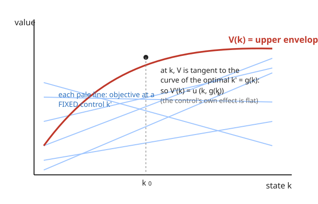

# Grad Macroeconomics · Lesson 1.4: The envelope theorem in dynamics

> ⏱ ~15 min · Module 1: The dynamic optimization toolkit · Builds on: [1.3 Euler equations and transversality](01-03-euler-transversality.md) · Unlocks: [1.5 Stochastic dynamic programming](01-05-stochastic-dynamic-programming.md)

## Why this matters

The Bellman equation gives you a first-order condition — but it's contaminated by an unknown: the derivative $V'$ of the value function you're trying to find. The Euler equation, by contrast, is a clean statement about payoffs you can write down. The bridge between them is one deceptively simple fact about differentiating an *already-optimized* problem. That fact — the **Benveniste–Scheinkman theorem** — is what makes the recursive method usable: it eliminates $V'$, closes the Bellman FOC into the Euler equation, and hands you the economic interpretation of $V'(k)$ as a shadow price (the same object that reappears as Tobin's $q$ in [5.3](05-03-q-theory-investment.md) and as the co-state multiplier from [1.3](01-03-euler-transversality.md)). Learn it once here and every recursive derivation for the rest of the course becomes mechanical.

## The idea

You've maximized something. Now you nudge a parameter and ask: how much did the *optimized value* move? Naively there are two channels — the parameter hits the objective directly, and it also shifts where your optimal choice lands, which moves the objective again. The envelope theorem says: **ignore the second channel entirely.** At an interior optimum the objective is flat in the choice variable (that's the FOC), so a small re-optimization of the control buys you nothing to first order. Only the direct hit survives.

Picture a family of curves, one for each fixed value of the control, all plotted against the parameter. The value function is their **upper envelope** — at each parameter you stand on whichever curve is highest. Because the envelope kisses that top curve tangentially, the slope of the envelope equals the slope of the fixed-control curve *at that point*: you differentiate as if the control were frozen. That's the whole theorem. In our dynamic setting the parameter is the state $k$ (today's capital) and the control is $k'$ (tomorrow's capital), and the payoff is: **the marginal value of an extra unit of the state is just its direct marginal payoff, holding the optimal policy fixed.**

## The formal version

**General envelope theorem.** Let $V(\theta) = \max_x f(x,\theta)$ with maximizer $x^*(\theta)$ interior and $f$ smooth. Then

$$V'(\theta) = f_\theta\big(x^*(\theta),\,\theta\big).$$

In words: to differentiate the optimized value with respect to a parameter, differentiate the objective *directly* with respect to that parameter and evaluate at the optimizer — the term from re-optimizing $x$ vanishes because $f_x(x^*,\theta)=0$. (Proof in one line: $\frac{d}{d\theta}f(x^*(\theta),\theta) = f_x \cdot \frac{dx^*}{d\theta} + f_\theta = 0\cdot\frac{dx^*}{d\theta} + f_\theta = f_\theta$.)

**Benveniste–Scheinkman (the dynamic version).** For the Bellman equation

$$V(k) = \max_{k'}\ \big\{\, u(k,k') + \beta V(k') \,\big\},\qquad k' = g(k)\text{ the optimal policy,}$$

the state $k$ plays the role of $\theta$ and $k'$ the role of $x$. Here $u(k,k')$ is the current return as a function of the state $k$ and the control $k'$; $\beta\in(0,1)$ is the discount factor; $g$ is the policy function. The theorem gives

$$\boxed{\,V'(k) = u_k\big(k,\,g(k)\big)\,}$$

where $u_k$ is the partial derivative of $u$ with respect to its *first* argument (the state), holding the second argument (the control) fixed. In words: the marginal value of the state equals the direct marginal effect of the state on today's return — nothing flows through the policy, because at the optimum the objective is flat in $k'$.

**Closing the FOC into the Euler equation.** The Bellman FOC (differentiate the maximand in $k'$, set to zero) is

$$u_{k'}(k,k') + \beta V'(k') = 0.$$

This still contains the unknown $V'$. But Benveniste–Scheinkman evaluated one period ahead gives $V'(k') = u_k(k',\,g(k'))$ — a statement about *known* payoffs. Substitute:

$$u_{k'}(k,k') + \beta\, u_k\big(k',g(k')\big) = 0.$$

That is exactly the Euler equation of [1.3](01-03-euler-transversality.md), now derived recursively rather than by perturbing the infinite sequence. **Envelope + Bellman FOC = Euler equation** — memorize that as the standard recursive recipe.

**What $V'(k)$ *is*.** It's the **marginal (shadow) value of the state**: how much lifetime discounted utility rises per extra unit of $k$ handed to you today. It equals the Lagrange multiplier on the resource constraint in the sequence problem — the **co-state** $\lambda$ of [1.3](01-03-euler-transversality.md)'s Hamiltonian. Same object, three names: $V'(k) = \lambda = $ shadow price of capital.

## Picture

Each pale line is $u(k,k') + \beta V(k')$ for one *frozen* choice of $k'$. The value function $V(k)$ (red) is their upper envelope: at each $k$ you ride the highest available curve. Because the envelope is tangent to that curve at the optimum, its slope $V'(k)$ equals the slope of the frozen-control curve — i.e. $u_k(k,g(k))$, the direct effect only.

## Worked examples

**Example 1 (the one-sector growth model — envelope → Euler).** Standard setup: a planner maximizes $\sum_t \beta^t u(c_t)$ subject to $c_t + k_{t+1} = f(k_t) + (1-\delta)k_t$, where $c_t$ is consumption, $k_t$ capital, $f$ output, $\delta\in(0,1)$ the depreciation rate, and $u$ increasing and concave. Write the return in Bellman form by substituting the constraint for consumption:

$$V(k) = \max_{k'}\ \Big\{\, u\big(\underbrace{f(k) + (1-\delta)k - k'}_{=\,c}\big) + \beta V(k') \,\Big\}.$$

So $u(k,k') = u\big(f(k)+(1-\delta)k - k'\big)$. Compute the two pieces.

*Bellman FOC* (in $k'$): the control enters $c$ with a $-1$, so
$$-\,u'(c) + \beta V'(k') = 0 \quad\Longrightarrow\quad u'(c) = \beta V'(k').$$

*Envelope* (in $k$): the state enters $c$ through $f(k)+(1-\delta)k$, whose derivative is $f'(k)+1-\delta$; the theorem says differentiate holding $k'$ fixed:
$$V'(k) = u'(c)\,\big[f'(k) + 1 - \delta\big].$$

Push the envelope forward one period, $V'(k') = u'(c')\,[\,f'(k')+1-\delta\,]$, and substitute into the FOC:

$$\boxed{\,u'(c_t) = \beta\, u'(c_{t+1})\,\big[f'(k_{t+1}) + 1 - \delta\big]\,}$$

the consumption Euler equation — marginal utility today equals discounted marginal utility tomorrow scaled by the gross return on capital $R_{t+1}=f'(k_{t+1})+1-\delta$. Identical to [1.3](01-03-euler-transversality.md), obtained without ever touching the infinite sum.

**Example 2 (log utility, Cobb–Douglas, full depreciation — guess-and-verify with the envelope).** Take $u(c)=\ln c$, $f(k)=k^\alpha$ with $\alpha\in(0,1)$, and $\delta=1$ (capital fully depreciates each period, so $c = k^\alpha - k'$). Bellman equation:

$$V(k) = \max_{k'}\ \big\{\, \ln(k^\alpha - k') + \beta V(k') \,\big\}.$$

**Guess** $V(k) = A + B\ln k$ for constants $A,B$ to be found. Then $V'(k) = B/k$.

*Envelope* directly on the guess vs. the theorem must agree. Benveniste–Scheinkman: $V'(k) = u_k = \dfrac{\partial}{\partial k}\ln(k^\alpha - k') = \dfrac{\alpha k^{\alpha-1}}{k^\alpha - k'} = \dfrac{\alpha k^{\alpha-1}}{c}$. Set equal to the guess's derivative $B/k$:

$$\frac{B}{k} = \frac{\alpha k^{\alpha-1}}{c} \quad\Longrightarrow\quad c = \frac{\alpha}{B}\,k^{\alpha} \cdot \frac{k}{k}=\frac{\alpha}{B}k^{\alpha}.$$

*Bellman FOC*: $\dfrac{1}{c} = \beta V'(k') = \beta\dfrac{B}{k'}$, so $k' = \beta B\, c$. Combine with the resource constraint $k' = k^\alpha - c$:

$$\beta B\, c = k^\alpha - c \quad\Longrightarrow\quad c = \frac{k^\alpha}{1+\beta B}.$$

Match the two expressions for $c$: $\dfrac{\alpha}{B} = \dfrac{1}{1+\beta B}$, i.e. $\alpha(1+\beta B) = B$, giving

$$B = \frac{\alpha}{1-\alpha\beta}.$$

Then the policy and consumption rules fall out:
$$k' = k^\alpha - c = k^\alpha - \frac{k^\alpha}{1+\beta B} = k^\alpha\Big(1 - \tfrac{1}{1+\beta B}\Big) = \alpha\beta\, k^\alpha,\qquad c = (1-\alpha\beta)\,k^\alpha.$$

(Using $1+\beta B = 1 + \tfrac{\alpha\beta}{1-\alpha\beta} = \tfrac{1}{1-\alpha\beta}$.) So the optimal savings rate is a constant $\alpha\beta$ — exactly the closed form you'd get from the sequence problem in 1.1/1.3. The envelope condition is what let us pin $B$ without solving the full functional equation by brute force. (The constant $A$ follows by plugging back into the Bellman equation; it never affects the policy, so we skip it.)

## Watch out

- **"Partial, holding the control fixed" means literally freeze $k'$ — do not also differentiate through $g(k)$.** The whole point is that the $g'(k)$ term is multiplied by $u_{k'}+\beta V' = 0$ and dies. Writing the total derivative and *then* claiming it simplifies is fine; forgetting the FOC and keeping the policy term is the classic error.
- **The envelope condition is $V'$, the FOC is a separate equation.** Beginners conflate them. The FOC differentiates the maximand in the *control* $k'$; the envelope differentiates the *value* in the *state* $k$. You need both, and you substitute one into the other.
- **Interiority and differentiability are assumed.** Benveniste–Scheinkman requires $V$ differentiable at $k$ and the optimum interior. [1.2](01-02-principle-of-optimality.md)'s contraction argument delivers a $V$ that exists and is concave; differentiability holds at interior optima (that's actually the content of the B–S paper). At a corner or kink, the clean $V'(k)=u_k$ fails.
- **Sign bookkeeping.** In the growth model the control $k'$ enters $c$ with a minus sign, so the FOC reads $u'(c) = \beta V'(k')$, not $u'(c) = -\beta V'(k')$. Track how the control enters the return before differentiating.

## One-liner

> Differentiate an optimized problem as if the choice were frozen — the policy's own effect is flat at the optimum — so $V'(k)=u_k(k,g(k))$, and that single fact turns the Bellman FOC into the Euler equation.

## Problems

**P1 (🟢)** A household solves $V(a) = \max_{a'}\{\,u(\,(1+r)a - a'\,) + \beta V(a')\,\}$, where $a$ is assets, $r$ the interest rate, and consumption is $c=(1+r)a - a'$. Apply Benveniste–Scheinkman to find $V'(a)$ in terms of $u'$ and the primitives.

**P2 (🟡)** For the growth model with **CRRA** utility $u(c)=\dfrac{c^{1-\sigma}}{1-\sigma}$ (so $u'(c)=c^{-\sigma}$, $\sigma>0$) and production $f(k)=k^\alpha$ with depreciation $\delta$, derive the Euler equation *purely recursively*: state the Bellman FOC, apply the envelope condition, and substitute. Write the final Euler equation in terms of $c_t, c_{t+1}, k_{t+1}$.

**P3 (🔴 — Boss Problem 1)** Guess-and-verify the value function for $u(c)=\ln c$, $f(k)=k^\alpha$, $\delta=1$ using the envelope condition. Take the guess $V(k)=A+B\ln k$, use the envelope to write $V'(k)$, combine with the Bellman FOC to solve for $B$, the policy $g(k)$, and consumption $c(k)$. Then, for extra credit, solve for the constant $A$ explicitly.

Solutions

**P1.** Here $u(a,a') = u\big((1+r)a - a'\big)$. The state $a$ enters $c$ through the factor $(1+r)$; differentiate the return with respect to $a$ holding $a'$ fixed:
$$V'(a) = u'\big((1+r)a - a'\big)\cdot(1+r) = (1+r)\,u'(c).$$
Marginal value of a unit of assets = gross return $\times$ marginal utility of consumption. (Combined with the FOC $u'(c)=\beta V'(a')$ this gives the household Euler equation $u'(c_t)=\beta(1+r)u'(c_{t+1})$.)

**P2.** Return in Bellman form: $u(k,k') = \dfrac{\big(f(k)+(1-\delta)k - k'\big)^{1-\sigma}}{1-\sigma}$ with $c = f(k)+(1-\delta)k-k'$.

*Bellman FOC* in $k'$ (control enters $c$ with $-1$):
$$-\,c^{-\sigma} + \beta V'(k') = 0 \quad\Longrightarrow\quad c^{-\sigma} = \beta V'(k').$$

*Envelope* in $k$ (state enters through $f(k)+(1-\delta)k$, derivative $f'(k)+1-\delta = \alpha k^{\alpha-1}+1-\delta$):
$$V'(k) = c^{-\sigma}\big[\alpha k^{\alpha-1} + 1 - \delta\big].$$

Advance one period, $V'(k_{t+1}) = c_{t+1}^{-\sigma}\big[\alpha k_{t+1}^{\alpha-1}+1-\delta\big]$, and substitute into the FOC $c_t^{-\sigma}=\beta V'(k_{t+1})$:
$$\boxed{\,c_t^{-\sigma} = \beta\, c_{t+1}^{-\sigma}\big[\alpha k_{t+1}^{\alpha-1} + 1 - \delta\big]\,}$$
equivalently $\Big(\dfrac{c_{t+1}}{c_t}\Big)^{\sigma} = \beta\big[\alpha k_{t+1}^{\alpha-1}+1-\delta\big]$ — consumption growth is governed by the gross return on capital relative to impatience.

**P3.** Setup: $c = k^\alpha - k'$ (since $\delta=1$), Bellman equation $V(k)=\max_{k'}\{\ln(k^\alpha-k')+\beta V(k')\}$. Guess $V(k)=A+B\ln k$, so $V'(k)=B/k$.

*Envelope* (Benveniste–Scheinkman): differentiate the return in $k$ holding $k'$ fixed,
$$V'(k) = \frac{\alpha k^{\alpha-1}}{k^\alpha - k'} = \frac{\alpha k^{\alpha-1}}{c}.$$
Equate to the guess: $\dfrac{B}{k} = \dfrac{\alpha k^{\alpha-1}}{c}$, so $c = \dfrac{\alpha}{B}k^{\alpha}$.  … (i)

*Bellman FOC* in $k'$: $\dfrac{1}{c} = \beta V'(k') = \dfrac{\beta B}{k'}$, so $k' = \beta B\, c$.  … (ii)

Resource constraint $k' = k^\alpha - c$ combined with (ii): $\beta B c = k^\alpha - c \Rightarrow c = \dfrac{k^\alpha}{1+\beta B}$.  … (iii)

Match (i) and (iii): $\dfrac{\alpha}{B} = \dfrac{1}{1+\beta B} \Rightarrow \alpha(1+\beta B)=B \Rightarrow \alpha = B(1-\alpha\beta)$, hence
$$B = \frac{\alpha}{1-\alpha\beta}.$$
Then $1+\beta B = \dfrac{1}{1-\alpha\beta}$, so from (iii):
$$c(k) = (1-\alpha\beta)\,k^\alpha,\qquad g(k)=k'=k^\alpha - c = \alpha\beta\,k^\alpha.$$
Constant savings rate $\alpha\beta$, matching the sequence-problem answer from 1.1/1.3. ✓

*Extra credit — solve for $A$.* Plug the guess and policy back into the Bellman equation at the optimum:
$$A + B\ln k = \ln\big[(1-\alpha\beta)k^\alpha\big] + \beta\big[A + B\ln(\alpha\beta k^\alpha)\big].$$
Expand the right side:
$$= \ln(1-\alpha\beta) + \alpha\ln k + \beta A + \beta B\ln(\alpha\beta) + \alpha\beta B\ln k.$$
Match $\ln k$ coefficients: $B = \alpha + \alpha\beta B \Rightarrow B=\dfrac{\alpha}{1-\alpha\beta}$ ✓ (consistency check passes). Match constants:
$$A = \ln(1-\alpha\beta) + \beta B\ln(\alpha\beta) + \beta A \quad\Longrightarrow\quad A(1-\beta) = \ln(1-\alpha\beta) + \frac{\alpha\beta}{1-\alpha\beta}\ln(\alpha\beta),$$
$$\boxed{\,A = \frac{1}{1-\beta}\left[\ln(1-\alpha\beta) + \frac{\alpha\beta}{1-\alpha\beta}\ln(\alpha\beta)\right].}$$
Because $A$ is independent of $k$, it never enters the policy — which is exactly why the envelope method let us find $g$ and $c$ without computing $A$ first.

## Flashback

**From [1.3](01-03-euler-transversality.md) (Euler equations).** Consider the growth model with **no depreciation** ($\delta=0$), utility $u(c)$, and production $f(k)$, solved as a sequence problem $\max\sum_t\beta^t u(c_t)$ s.t. $c_t+k_{t+1}=f(k_t)+k_t$. Derive the Euler equation by the *sequence* method: form the Lagrangian, take FOCs in $k_{t+1}$, and eliminate the multipliers. (Then confirm it matches what the recursive envelope method gives.)

Solution

Lagrangian with multipliers $\lambda_t$ on each period's constraint:
$$\mathcal{L} = \sum_{t=0}^\infty \beta^t u(c_t) + \sum_{t=0}^\infty \lambda_t\big[f(k_t)+k_t - c_t - k_{t+1}\big].$$
FOC in $c_t$: $\beta^t u'(c_t) = \lambda_t$.  
FOC in $k_{t+1}$ (appears in period $t$'s constraint with $-1$ and period $t{+}1$'s with $f'(k_{t+1})+1$):
$$-\lambda_t + \lambda_{t+1}\big[f'(k_{t+1})+1\big] = 0 \quad\Longrightarrow\quad \lambda_t = \lambda_{t+1}\big[f'(k_{t+1})+1\big].$$
Substitute $\lambda_t=\beta^t u'(c_t)$ and $\lambda_{t+1}=\beta^{t+1}u'(c_{t+1})$:
$$\beta^t u'(c_t) = \beta^{t+1}u'(c_{t+1})\big[f'(k_{t+1})+1\big] \;\Longrightarrow\; \boxed{\,u'(c_t) = \beta u'(c_{t+1})\big[f'(k_{t+1})+1\big].}$$
This is Example 1 with $\delta=0$ (gross return $f'(k_{t+1})+1-\delta \to f'(k_{t+1})+1$). ✓ And note $\lambda_t = \beta^t u'(c_t)$ is the discounted shadow price — the same $V'$ the envelope theorem produces, confirming $V'(k)=\lambda=$ co-state.

## Connections

- **Backward:** [1.2](01-02-principle-of-optimality.md)'s contraction mapping is what guarantees the $V$ we're differentiating actually *exists* and is concave — Benveniste–Scheinkman needs that before it can talk about $V'$. [1.3](01-03-euler-transversality.md) is the Euler equation this lesson re-derives recursively; the co-state $\lambda$ there is precisely $V'(k)$ here.
- **Forward:** [1.5](01-05-stochastic-dynamic-programming.md) reruns this exact machine under uncertainty — the envelope becomes $V'(k,z)=u_k$ and the FOC carries an $\mathbb{E}$, producing the stochastic Euler equation. The log/Cobb–Douglas guess-and-verify of Example 2 is the workhorse test case there and in [2.3 Ramsey–Cass–Koopmans](02-03-ramsey-cass-koopmans.md).
- **Sideways (asset pricing):** in [5.3 q-theory of investment](05-03-q-theory-investment.md), $V'(k)$ = marginal value of installed capital = **Tobin's $q$** — the envelope theorem *is* the statement that $q$ equals the discounted marginal product stream. The same shadow-price reading drives [5.4](05-04-consumption-based-asset-pricing.md).
- **Sideways (micro):** this is the dynamic face of the static envelope theorem in [grad-micro](../../grad-micro/syllabus.md) — Roy's identity, Shephard's lemma, and the interpretation of Lagrange multipliers as shadow prices are all the same "differentiate the optimized value, keep only the direct effect" move.
