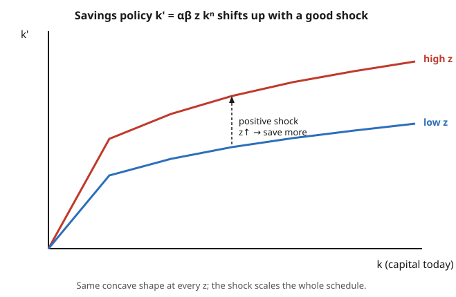

# Grad Macroeconomics · Lesson 1.5: Stochastic dynamic programming

> ⏱ ~15 min · Module 1: The dynamic optimization toolkit · Builds on: [1.4 The envelope theorem in dynamics](01-04-envelope-theorem-dynamics.md) · Unlocks: [1.6 Recursive competitive equilibrium](01-06-recursive-competitive-equilibrium.md)

## Why this matters

Every model so far has been a machine with no dice in it: choose $k'$ today, know exactly what tomorrow's output will be. Real economies don't work that way — a drought, an oil shock, a productivity boom, a financial panic all arrive as *news* the household couldn't have known. The entire quantitative macro program — RBC, New Keynesian, asset pricing, precautionary saving — lives or dies on how agents optimize *in the presence of that news*.

Here is the good part, and the reason we spent four lessons building deterministic dynamic programming first: **almost nothing changes.** You take every object from 1.1–1.4 and slide a conditional expectation $\mathbb{E}_t$ in front of the continuation value. The Bellman equation still contracts, the Euler equation still holds, the envelope condition still fires — each one just wrapped in an expectation. This lesson makes that "slide in $\mathbb{E}_t$" precise, and cashes it out on the model that anchors all of Module 4: the stochastic one-sector growth model.

## The idea

Add a **productivity shock** $z_t$ that multiplies output: this period's technology is $z_t$, next period's is $z_{t+1}$, and — crucially — $z_{t+1}$ is not known when you choose today's saving. The household picks $k'$ *before the die is cast*, so it cannot condition on tomorrow's realization; it can only condition on what tomorrow's shock is *likely* to be, given today's.

That "given today's" is the whole modeling content. We assume $z_t$ is **Markov**: the distribution of tomorrow's shock depends only on today's value, not on the entire history. So a single number $z$ carries all the payoff-relevant information about the future of technology. That is exactly the property that lets us keep a *recursive* formulation — the state just grows by one coordinate, from $k$ to $(k,z)$.

The optimal saving rule becomes a *function of the shock*: $k' = g(k,z)$. When a good shock hits, output is higher, and — as we'll derive — the household splits the windfall between consuming more today and saving more for tomorrow. The policy schedule shifts bodily upward with $z$ (see the Picture). Uncertainty itself changes behavior too, through a channel called prudence, but that is a Module 5 story we only flag here.

## The formal version

**The shock.** Let $z_t$ follow a Markov process with transition kernel $Q(z'\mid z)$ — read "the probability (or density) of tomorrow's shock $z'$ given today's shock is $z$." Two standard concrete forms:

- a finite **Markov chain**, $z \in \{z_1,\dots,z_n\}$ with transition matrix $P_{ij}=\Pr(z_{t+1}=z_j\mid z_t=z_i)$;
- an **AR(1) in logs**, $\ln z_{t+1} = \rho \ln z_t + \varepsilon_{t+1}$, with $|\rho|<1$ and $\varepsilon_{t+1}$ i.i.d. mean-zero.

Define $\mathbb{E}_t[\cdot] \equiv \mathbb{E}[\cdot \mid z_t]$: the **conditional expectation** over next period's shock, using all information dated $t$. Markovness is what makes $z_t$ a sufficient conditioning set.

**The state.** Payoff-relevant information today is now the pair $(k,z)$: capital $k$ you carry in, and the shock $z$ that both scales today's output and forecasts tomorrow's technology.

**The stochastic Bellman equation.**

$$V(k,z) = \max_{k'}\;\Big\{\, u(c) + \beta\, \mathbb{E}\big[\,V(k',z')\mid z\,\big]\,\Big\}, \qquad c = z f(k) + (1-\delta)k - k'.$$

*In words:* the value of being in state $(k,z)$ is the best you can do today — flow utility $u(c)$ plus discounted **expected** continuation value, where the expectation averages $V(k',z')$ over tomorrow's shock $z'\sim Q(\cdot\mid z)$. The only edit from the deterministic Bellman of [1.2](01-02-principle-of-optimality.md) is the $\mathbb{E}[\cdot\mid z]$ wrapper: $k'$ is chosen now, so it comes outside the expectation, but $z'$ (hence $V(k',z')$) is random, so it sits inside.

**Existence and uniqueness still hold.** Define the operator

$$(Tv)(k,z) = \max_{k'}\Big\{u(zf(k)+(1-\delta)k-k') + \beta\,\mathbb{E}[v(k',z')\mid z]\Big\}.$$

$T$ still satisfies **Blackwell's sufficient conditions** — monotonicity and discounting — because taking an expectation is a positive, order-preserving linear operation: if $v\le w$ pointwise then $\mathbb{E}[v]\le\mathbb{E}[w]$, and adding a constant $a$ to $v$ adds exactly $\beta a$ inside. So $T$ is a $\beta$-contraction on the space of bounded continuous functions, and by the same argument as [1.2](01-02-principle-of-optimality.md) it has a **unique fixed point** $V$, reachable by iterating from any guess. Nothing about the contraction cared whether the continuation was a value or an expected value.

**The stochastic Euler equation.** The first-order and envelope conditions carry over verbatim, each under an expectation. FOC in $k'$: $u'(c_t) = \beta\,\mathbb{E}_t\!\big[V_k(k_{t+1},z_{t+1})\big]$. The envelope condition (from [1.4](01-04-envelope-theorem-dynamics.md)) gives $V_k(k,z) = u'(c)\,[zf'(k)+1-\delta]$. Substitute forward one period and combine:

$$\boxed{\;u'(c_t) = \beta\,\mathbb{E}_t\!\Big[\,u'(c_{t+1})\big(z_{t+1}f'(k_{t+1}) + 1-\delta\big)\Big]\;}$$

*In words:* the marginal utility of a dollar consumed today equals the **expected** discounted marginal utility of investing it — one more unit of capital returns $z_{t+1}f'(k_{t+1})+1-\delta$ units of goods tomorrow, valued at tomorrow's (random) marginal utility. Set the variance to zero and $\mathbb{E}_t$ drops away, recovering the deterministic Euler equation of [1.3](01-03-euler-transversality.md) exactly. **The expectation is the only change.** The transversality condition likewise becomes $\lim_{t\to\infty}\beta^t\,\mathbb{E}_0\big[u'(c_t)k_{t+1}\big]=0$.

**Certainty equivalence fails.** You cannot in general replace $z_{t+1}$ by its mean $\mathbb{E}_t z_{t+1}$ and solve the resulting deterministic problem — because $\mathbb{E}_t[u'(c_{t+1})(\cdots)]\neq u'(\mathbb{E}_t c_{t+1})(\cdots)$ whenever $u'$ is nonlinear (Jensen's inequality). Averaging the shock and averaging the marginal payoff are different operations. The one clean exception is the **linear–quadratic** case — quadratic utility, linear constraint — where $u'$ is affine, $\mathbb{E}_t$ passes straight through, and the mean is a sufficient statistic. That special case (Problem 3) is why the permanent-income model is so tractable, and why everyone reaches for it first.

## Picture

The optimal saving rule $k'=g(k,z)$ for the closed-form model below. At every level of capital the schedule is concave in $k$; a positive productivity shock ($z\uparrow$) scales the *entire* schedule upward — the household saves more at every $k$. Consumption $(1-\alpha\beta)zk^\alpha$ scales by the identical factor, so the windfall from a good shock is split in fixed proportions between today's consumption and tomorrow's capital.

## Worked examples

**Example 1 — set up the general stochastic growth model (Bellman + Euler).**

An infinitely-lived household chooses consumption and capital to solve

$$\max\;\mathbb{E}_0\sum_{t=0}^\infty \beta^t u(c_t)\quad\text{s.t.}\quad c_t + k_{t+1} = z_t f(k_t) + (1-\delta)k_t,$$

with $z_t$ Markov, $Q(z'\mid z)$ given, and $k_0,z_0$ known. Recursive form, state $(k,z)$:

$$V(k,z) = \max_{0\le k' \le zf(k)+(1-\delta)k}\Big\{\,u\big(zf(k)+(1-\delta)k-k'\big) + \beta\,\mathbb{E}[V(k',z')\mid z]\,\Big\}.$$

FOC in $k'$ (interior): $\;u'(c) = \beta\,\mathbb{E}[V_k(k',z')\mid z]$. Envelope in $k$: $\;V_k(k,z)=u'(c)\,[zf'(k)+1-\delta]$. Rolling the envelope forward and substituting yields the stochastic Euler equation

$$u'(c_t)=\beta\,\mathbb{E}_t\big[u'(c_{t+1})(z_{t+1}f'(k_{t+1})+1-\delta)\big],$$

closed by the resource constraint, the TVC, and the law of motion of $z$. This four-line derivation is the entire skeleton of the RBC model of [4.1](04-01-real-business-cycle.md); Module 4 only adds labor and calibration.

**Example 2 — BOSS PROBLEM 1: the log / Cobb–Douglas / full-depreciation closed form.**

Specialize: $u(c)=\ln c$, $f(k)=k^\alpha$ with $0<\alpha<1$, and **full depreciation** $\delta=1$ (so all output is either eaten or reinvested). The resource constraint collapses to $c = zk^\alpha - k'$. This is one of the very few macro models with a pencil-and-paper value function — worth knowing cold.

*Guess* the form $V(k,z)=A + B\ln k + C\ln z$ for constants $A,B,C$ to be found. Plug into the Bellman equation:

$$A + B\ln k + C\ln z = \max_{k'}\Big\{\ln(zk^\alpha - k') + \beta\,\mathbb{E}\big[A + B\ln k' + C\ln z' \mid z\big]\Big\}.$$

The expectation only touches the $\ln k'$ and $\ln z'$ terms; $k'$ is chosen now so $B\ln k'$ is deterministic, and $\mathbb{E}[A+B\ln k'+C\ln z'\mid z]=A+B\ln k' + C\,\mathbb{E}[\ln z'\mid z]$. **FOC in $k'$:**

$$\frac{-1}{zk^\alpha - k'} + \frac{\beta B}{k'} = 0 \;\Longrightarrow\; \beta B\,(zk^\alpha - k') = k' \;\Longrightarrow\; k' = \frac{\beta B}{1+\beta B}\,z k^\alpha .$$

So saving is a *constant fraction* $s\equiv \frac{\beta B}{1+\beta B}$ of output $zk^\alpha$, and consumption is the complementary fraction: $c = zk^\alpha - k' = \frac{1}{1+\beta B}zk^\alpha$.

*Verify* by substituting the policy back and matching the coefficient on $\ln k$. Write out the two log terms that carry $\ln k$:

$$\ln c = -\ln(1+\beta B) + \ln z + \alpha\ln k,\qquad \beta B\ln k' = \beta B\ln\!\Big(\tfrac{\beta B}{1+\beta B}\Big) + \beta B\ln z + \alpha\beta B\ln k.$$

On the right-hand side of the Bellman equation the $\ln k$ terms are $\alpha\ln k$ (from $\ln c$) and $\alpha\beta B\ln k$ (from the *discounted* continuation $\beta B\ln k'$ — the $\beta$ rides along because $\ln k'$ enters through $\beta\,\mathbb{E}[V(k',z')\mid z]$). Matching to the $B\ln k$ on the left:

$$B = \alpha + \alpha\beta B \;\Longrightarrow\; B=\frac{\alpha}{1-\alpha\beta}.$$

Now

$$\beta B = \frac{\alpha\beta}{1-\alpha\beta},\qquad s=\frac{\beta B}{1+\beta B}=\frac{\alpha\beta/(1-\alpha\beta)}{1/(1-\alpha\beta)}=\alpha\beta.$$

So the **saving rate is exactly $\alpha\beta$**, and the closed-form policies are

$$\boxed{\;k_{t+1}=\alpha\beta\,z_t k_t^\alpha,\qquad c_t=(1-\alpha\beta)\,z_t k_t^\alpha.\;}$$

Both scale linearly in the current shock $z_t$: a positive productivity shock raises consumption and next-period capital *in the same proportion* — the household banks a fixed share $\alpha\beta$ of every windfall and eats the rest. That is the policy surface in the Picture.

*Confirm the stochastic Euler equation.* With $\delta=1$, $f'(k)=\alpha k^{\alpha-1}$, and $u'(c)=1/c$:

$$\frac{1}{c_t}=\beta\,\mathbb{E}_t\!\Big[\frac{1}{c_{t+1}}\,z_{t+1}\alpha k_{t+1}^{\alpha-1}\Big].$$

Now $c_{t+1}=(1-\alpha\beta)z_{t+1}k_{t+1}^\alpha$, so $\frac{z_{t+1}\alpha k_{t+1}^{\alpha-1}}{c_{t+1}}=\frac{\alpha}{(1-\alpha\beta)k_{t+1}}$ — the random $z_{t+1}$ **cancels exactly**. The RHS is $\beta\cdot\frac{\alpha}{(1-\alpha\beta)k_{t+1}}$, a number known at $t$, so $\mathbb{E}_t$ is trivial. Using $k_{t+1}=\alpha\beta z_tk_t^\alpha$ and $c_t=(1-\alpha\beta)z_tk_t^\alpha$:

$$\text{RHS}=\frac{\alpha\beta}{(1-\alpha\beta)\,\alpha\beta z_t k_t^\alpha}=\frac{1}{(1-\alpha\beta)z_tk_t^\alpha}=\frac{1}{c_t}=\text{LHS}.\;\checkmark$$

*Confirm the TVC.* $\beta^t\mathbb{E}_0[u'(c_t)k_{t+1}] = \beta^t\,\mathbb{E}_0\!\big[\frac{\alpha\beta z_tk_t^\alpha}{(1-\alpha\beta)z_tk_t^\alpha}\big]=\beta^t\frac{\alpha\beta}{1-\alpha\beta}\to0$ since $\beta<1$. The candidate satisfies Bellman, Euler, and transversality, so by the verification theorem of [1.4](01-04-envelope-theorem-dynamics.md) it is *the* optimum. (This log/$\delta=1$ tractability is exactly why it recurs as a calibration sanity check in [4.2](04-02-calibration-stochastic-growth.md).)

## Watch out

- **$k'$ is outside the expectation, $z'$ is inside.** The choice is made before the shock realizes, so $k'$ is $z_t$-measurable and factors out; only $z'$ (and anything depending on it, like $V(k',z')$ or $c_{t+1}$) stays under $\mathbb{E}_t$. Writing $\mathbb{E}_t[k_{t+1}]$ as if $k_{t+1}$ were random is a timing error — $k_{t+1}$ is *decided* at $t$.
- **Certainty equivalence is a trap, not a shortcut.** "Just replace $z_{t+1}$ by its expected value" is legal only under quadratic utility. In general $u'$ is convex (prudence), so $\mathbb{E}_t u'(c_{t+1}) > u'(\mathbb{E}_t c_{t+1})$ and uncertainty *raises* desired saving — the precautionary channel of [5.2](05-02-precautionary-saving.md). Collapsing the shock to its mean silently deletes that entire effect.
- **The state must be the shock, not the shock's history.** Markovness is doing real work: it makes $(k,z)$ a *sufficient* state. If $z_t$ were, say, an ARMA or had regime memory, you would need extra state variables — otherwise the Bellman equation is simply wrong because $V$ isn't a function of $(k,z)$ alone.
- **Expected marginal payoff, not marginal payoff of the expectation.** The Euler equation equates $u'(c_t)$ to $\mathbb{E}_t$ of the *product* $u'(c_{t+1})R_{t+1}$. When consumption and the return covary — as they generally do — that expectation is not the product of expectations; the covariance term is precisely what prices risk in [5.4](05-04-consumption-based-asset-pricing.md).

## One-liner

> Stochastic DP is deterministic DP with $\mathbb{E}_t$ slid in front of every continuation value — the Bellman equation still contracts, the Euler equation still holds, and only quadratic utility lets you pretend the shock equals its mean.

## Problems

**P1 (🟢)** A household has CRRA utility $u(c)=\frac{c^{1-\sigma}-1}{1-\sigma}$ and budget $c_t+k_{t+1}=z_tk_t^\alpha+(1-\delta)k_t$, where $\ln z_{t+1}=\rho\ln z_t+\varepsilon_{t+1}$ with $\varepsilon\sim\text{i.i.d.}$ Write the stochastic Euler equation for this economy, and state precisely which quantities are inside $\mathbb{E}_t$ and which are outside.

**P2 (🟡, BOSS PROBLEM 1)** Redo the guess-and-verify for $u(c)=\ln c$, $f(k)=k^\alpha$, $\delta=1$ *from scratch*: guess $V(k,z)=A+B\ln k+C\ln z$, take the FOC, solve for $B$ by coefficient-matching, and derive the savings policy $k_{t+1}=\alpha\beta z_tk_t^\alpha$. You need not solve for $A$ or $C$ — explain why they don't affect the policy.

**P3 (🔴)** Show certainty equivalence holds for the linear–quadratic case but fails in general. (a) Let $u(c)=-\tfrac12(c-\bar c)^2$ so $u'(c)=\bar c - c$ is affine. Show the stochastic Euler equation reduces to a condition on $\mathbb{E}_t c_{t+1}$ alone, so only the *mean* of the future shock matters. (b) Now let $u'$ be strictly convex ($u'''>0$, "prudence"). Using Jensen's inequality on the Euler equation with a fixed gross return $R$, argue that greater uncertainty in $c_{t+1}$ raises today's marginal utility $u'(c_t)$, hence lowers $c_t$ (more saving). This is the precautionary result previewed in [5.2](05-02-precautionary-saving.md).

Solutions

**P1.** With $u'(c)=c^{-\sigma}$ and gross return to capital $R_{t+1}=z_{t+1}\alpha k_{t+1}^{\alpha-1}+1-\delta$, the envelope-plus-FOC combination gives

$$c_t^{-\sigma}=\beta\,\mathbb{E}_t\!\Big[c_{t+1}^{-\sigma}\big(z_{t+1}\alpha k_{t+1}^{\alpha-1}+1-\delta\big)\Big].$$

*Outside* $\mathbb{E}_t$ (known at $t$): $c_t$, $k_{t+1}$ (chosen today), and the constants $\beta,\alpha,\delta,\sigma$. *Inside* $\mathbb{E}_t$ (random, depend on $z_{t+1}$): $z_{t+1}$, hence $c_{t+1}$ and the gross return $R_{t+1}$. Note $k_{t+1}$ sits inside the bracket but is deterministic, so it can be pulled partly out of the $z_{t+1}$-expectation on the return term; $c_{t+1}$ cannot, since it responds to next period's shock. The expectation is conditional on $z_t$ because the AR(1) is Markov: $\ln z_{t+1}\mid z_t \sim \mathcal N(\rho\ln z_t,\ \sigma_\varepsilon^2)$.

**P2.** Guess $V(k,z)=A+B\ln k+C\ln z$. With $\delta=1$, $c=zk^\alpha-k'$. Bellman:

$$A+B\ln k+C\ln z=\max_{k'}\Big\{\ln(zk^\alpha-k')+\beta\big(A+B\ln k'+C\,\mathbb{E}[\ln z'\mid z]\big)\Big\}.$$

FOC in $k'$: $\dfrac{-1}{zk^\alpha-k'}+\dfrac{\beta B}{k'}=0\Rightarrow k'=\dfrac{\beta B}{1+\beta B}zk^\alpha$, hence $c=\dfrac{1}{1+\beta B}zk^\alpha$.

Match the coefficient on $\ln k$. On the RHS, $\ln k$ appears in $\ln c$ (coefficient $\alpha$, since $\ln c=\ln\frac{1}{1+\beta B}+\ln z+\alpha\ln k$) and in $\beta B\ln k'$ (coefficient $\alpha\beta B$, since $\ln k'=\ln\frac{\beta B}{1+\beta B}+\ln z+\alpha\ln k$). So

$$B=\alpha+\alpha\beta B\;\Longrightarrow\;B=\frac{\alpha}{1-\alpha\beta}.$$

Then $\beta B=\dfrac{\alpha\beta}{1-\alpha\beta}$ and the saving fraction $s=\dfrac{\beta B}{1+\beta B}=\alpha\beta$, giving

$$k_{t+1}=\alpha\beta\,z_tk_t^\alpha,\qquad c_t=(1-\alpha\beta)\,z_tk_t^\alpha.$$

*Why $A,C$ don't matter for the policy:* the FOC only involves the derivative $\partial V/\partial k' = \beta B/k'$; $A$ is an additive constant (derivative zero) and $C\ln z'$ depends on the shock but **not on the choice $k'$** (it enters the objective only through $\beta C\,\mathbb{E}[\ln z'\mid z]$, an additive term independent of $k'$). So neither can shift the optimizer. They pin down the *level* of $V$, not the policy — consistent with the envelope logic of [1.4](01-04-envelope-theorem-dynamics.md), where only the marginal value of the state drives choices. (Coefficient-matching on $\ln z$ would fix $C$ via $C=1+\alpha\beta B+\beta\rho C$ under an AR(1), but it never enters the FOC, so the policy is untouched.)

**P3.** (a) Quadratic case. With $u'(c)=\bar c-c$ and a *fixed* gross return $R$ (e.g. a bond, or $\beta R=1$ for the classic case), the Euler equation $u'(c_t)=\beta R\,\mathbb{E}_t[u'(c_{t+1})]$ becomes

$$\bar c - c_t = \beta R\,\mathbb{E}_t[\bar c - c_{t+1}] = \beta R\big(\bar c - \mathbb{E}_t c_{t+1}\big).$$

Because $u'$ is affine, $\mathbb{E}_t$ passes through it: the equation involves $c_{t+1}$ *only through its conditional mean* $\mathbb{E}_t c_{t+1}$. The distribution of the shock beyond its mean — variance, skewness — is invisible. Setting $\beta R=1$ gives $c_t=\mathbb{E}_t c_{t+1}$: consumption is a **martingale** (Hall's random walk), the sharpest statement of certainty equivalence — today's consumption equals the expected future value, full stop.

(b) General prudent case. Take $u'$ strictly convex ($u'''>0$) and fix the return $R$ for clarity, so the Euler equation is $u'(c_t)=\beta R\,\mathbb{E}_t[u'(c_{t+1})]$. **Jensen's inequality** for a convex function: $\mathbb{E}_t[u'(c_{t+1})]\ge u'(\mathbb{E}_t c_{t+1})$, with strict inequality whenever $c_{t+1}$ is genuinely random. Therefore

$$u'(c_t)=\beta R\,\mathbb{E}_t[u'(c_{t+1})]\;>\;\beta R\,u'(\mathbb{E}_t c_{t+1}).$$

The right-hand side is what the household would face if the future were *certain at its mean* (the certainty-equivalent problem). Since the actual $u'(c_t)$ is **larger** than that benchmark and $u'$ is decreasing, $c_t$ must be **smaller** than its certainty-equivalent level: the household consumes less today and saves more, purely because the future is uncertain. That extra saving is **precautionary**, driven by the convexity of $u'$ (prudence), and it is exactly the effect certainty equivalence erases. Hence certainty equivalence holds iff $u'$ is affine (quadratic $u$); with any prudence it fails, and the mean of the shock is no longer a sufficient statistic. Full development in [5.2](05-02-precautionary-saving.md).

## Flashback

**From Lesson 1.4 (Envelope theorem in dynamics):** In a *deterministic* one-sector growth model with $u(c)=\ln c$, $f(k)=k^\alpha$, $\delta=1$, use the envelope condition to compute $V_k(k)$ for the value function $V(k)=A+B\ln k$, and check it equals $u'(c)f'(k)$ along the optimal policy $k'=\alpha\beta k^\alpha$.

Solution

Direct differentiation of the guess: $V(k)=A+B\ln k$ with $B=\frac{\alpha}{1-\alpha\beta}$, so

$$V_k(k)=\frac{B}{k}=\frac{\alpha}{(1-\alpha\beta)k}.$$

The **envelope theorem** says $V_k(k)=u'(c)\cdot\frac{\partial}{\partial k}\big[f(k)+(1-\delta)k\big]=u'(c)f'(k)$ (with $\delta=1$), evaluated at the optimum. Along the policy, $c=(1-\alpha\beta)k^\alpha$ so $u'(c)=\frac{1}{(1-\alpha\beta)k^\alpha}$, and $f'(k)=\alpha k^{\alpha-1}$. Then

$$u'(c)f'(k)=\frac{\alpha k^{\alpha-1}}{(1-\alpha\beta)k^\alpha}=\frac{\alpha}{(1-\alpha\beta)k}=V_k(k).\;\checkmark$$

The two routes to the marginal value of capital — differentiate the *value function* directly, or read it off the *flow return* via the envelope condition — agree, which is the whole content of the envelope theorem: at the optimum, the indirect effect of $k$ through the reoptimized choice $k'$ contributes nothing. This lesson simply wraps that identity in an $\mathbb{E}_t$: $V_k(k,z)=u'(c)[zf'(k)+1-\delta]$.

## Connections

- **Backward:** this is [1.1](01-01-sequence-vs-recursive.md)–[1.4](01-04-envelope-theorem-dynamics.md) with $\mathbb{E}_t$ inserted at every continuation. The recursive formulation ([1.1](01-01-sequence-vs-recursive.md)), the contraction/Blackwell existence argument ([1.2](01-02-principle-of-optimality.md)), the Euler + transversality pair ([1.3](01-03-euler-transversality.md)), and the envelope condition ([1.4](01-04-envelope-theorem-dynamics.md)) all survive verbatim — the expectation is a positive linear operator that respects every one of those structures.
- **Forward:** [1.6](01-06-recursive-competitive-equilibrium.md) embeds this household in a market with an *aggregate* shock and defines recursive competitive equilibrium. The stochastic growth model set up here is the literal core of Module 4 — [4.1](04-01-real-business-cycle.md) adds labor supply and calibrates it, [4.2](04-02-calibration-stochastic-growth.md) uses the $\delta=1$ closed form as a check, and [4.3](04-03-propagation-impulse-responses.md) traces how a $z$-shock propagates. The covariance-of-marginal-utility idea drives consumption-based asset pricing in [5.4](05-04-consumption-based-asset-pricing.md), and the failure of certainty equivalence is precautionary saving in [5.2](05-02-precautionary-saving.md).
- **Sideways (probability):** conditional expectation, Markov chains, and AR(1) processes are the machinery here — see [`probability-theory`](../../probability-theory/syllabus.md) for the measure-theoretic definition of $\mathbb{E}[\cdot\mid z]$ and the ergodic theory that justifies stationary distributions of $z_t$.
- **Sideways (finance):** the Euler equation $u'(c_t)=\beta\,\mathbb{E}_t[u'(c_{t+1})R_{t+1}]$ is a pricing equation under the *physical* measure; reweighting by marginal utility converts it to the risk-neutral pricing of [`mathematical-finance`](../../mathematical-finance/syllabus.md). The stochastic discount factor $\beta u'(c_{t+1})/u'(c_t)$ is the bridge between this lesson and arbitrage-free asset pricing.
