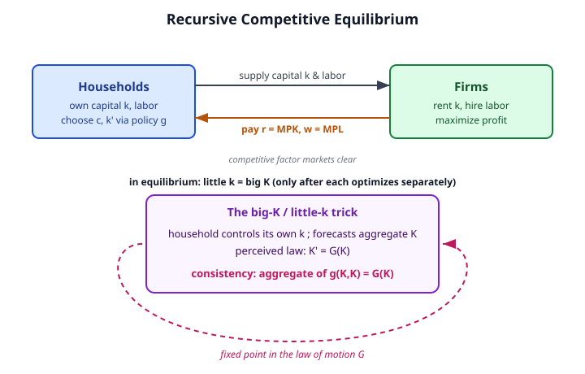

# Grad Macroeconomics · Lesson 1.6: Recursive competitive equilibrium

> ⏱ ~15 min · Module 1: The dynamic optimization toolkit · Builds on: [1.5 Stochastic dynamic programming](01-05-stochastic-dynamic-programming.md) · Unlocks: Module 2 — [2.1 The Solow model](02-01-solow-model.md)

## Why this matters

Everything in Module 1 was a *planner's* problem: one benevolent decision-maker maximizing a single value function. That's a fiction. Real economies have no planner — they have millions of households and firms, each selfishly optimizing, coordinated only by **prices**. This lesson is where you learn to write an economy as an equilibrium of atomized optimizers, and then discover the punchline that makes modern macro tractable: for a frictionless economy, that decentralized outcome is *exactly* the planner's outcome. The First Welfare Theorem lets you solve the easy planner problem and read off the messy market economy for free. Every model from here on — Ramsey, RBC, New Keynesian — is a recursive competitive equilibrium (RCE) with something bolted on. Get the object right once.

## The idea

A planner picks the whole allocation. A market economy instead has each household solving its *own* dynamic program, taking the rental rate on capital $r$ and the wage $w$ as given — the household is one atom in a sea, too small to move prices. Firms rent capital and hire labor and pay each factor its marginal product. Prices adjust until every market clears.

Here's the subtlety that trips everyone. A household deciding how much to save cares about *tomorrow's prices*, and tomorrow's prices depend on tomorrow's **aggregate** capital stock $K'$ — which is the sum of everyone's saving decisions. So the household must **forecast the aggregate** to solve its own problem. Call the household's own capital little-$k$ (a *control* it chooses) and the economy-wide capital big-$K$ (a *state* it can only forecast, via a perceived law of motion $K' = G(K)$).

The household optimizes taking $G$ as given. But $G$ isn't handed down from heaven — it's *generated* by what households actually do. **Equilibrium is the requirement that the perceived law $G$ equals the actual aggregate of individual choices.** That's a fixed point — not in a number, but in a *function*. It's the same contraction-mapping logic from [1.2](01-02-principle-of-optimality.md), lifted one level: there we found a fixed-point value function $V$; here we additionally need a fixed-point *forecast* $G$.

And the magic: because each household and firm optimizes correctly and markets clear, in equilibrium your little-$k$ ends up equal to big-$K$ (everyone's identical, so the average is you) — but *only after* you've solved the problems as if they were separate. Impose $k = K$ too early and you've smuggled in central planning; impose it too late and you've missed the equilibrium. The order is everything.

## The formal version

Consider the frictionless stochastic growth economy of [1.5](01-05-stochastic-dynamic-programming.md), now decentralized. A representative household owns capital and supplies one unit of labor inelastically. A representative firm operates $Y = zF(K,L)$ with productivity $z$.

**Firm's problem (static, per period).** The firm rents capital at rate $r$ and hires labor at wage $w$, both taken as given, and maximizes profit $\max_{K,L}\; zF(K,L) - rK - wL$. With constant returns to scale the first-order conditions are

$$r = z F_K(K,L), \qquad w = z F_L(K,L).$$

*In words:* each factor is paid its marginal product. With CRS, factor payments exactly exhaust output (Euler's theorem), so firms earn zero profit — consistent with free entry.

**Household's problem (recursive).** Let $v(k,K;z)$ be the value of a household with own capital $k$ when aggregate capital is $K$ and productivity is $z$. The household chooses consumption $c$ and next-period own capital $k'$, taking as given the pricing functions $r(K,z), w(K,z)$ and the perceived aggregate law $K' = G(K,z)$:

$$v(k,K;z) = \max_{c,\,k'}\;\Big\{\, u(c) + \beta\, \mathbb{E}\big[\,v(k',K';z')\mid z\,\big] \,\Big\}$$

$$\text{subject to}\quad c + k' = r(K,z)\,k + w(K,z) + (1-\delta)k, \qquad K' = G(K,z).$$

*In words:* budget = capital income $rk$ + labor income $w$ + undepreciated capital $(1-\delta)k$, split between eating and saving. The household's decision rule is a policy function $k' = g(k,K;z)$. Note the **two** state variables: $k$ it controls, $K$ it only forecasts through $G$.

**Definition — Recursive Competitive Equilibrium.** An RCE is a value function $v$, a household policy $g$, pricing functions $r,w$, and an aggregate law $G$ such that:

1. **(Household optimizes)** given $r,w,G$, the functions $v$ and $g$ solve the household Bellman above.
2. **(Firms optimize)** $r(K,z) = z F_K(K,1)$ and $w(K,z) = z F_L(K,1)$ (labor supply $= 1$).
3. **(Markets clear)** capital and labor markets clear ($k=K$, $L=1$) and the goods market clears: $c + k' = zF(K,1) + (1-\delta)K$.
4. **(Consistency)** the individual policy, evaluated at $k=K$ and aggregated, reproduces the perceived law:
$$G(K,z) = g(K,K;z).$$

*In words:* (4) is the fixed point that closes the model — the forecast households use must be the forecast their own behavior generates. Conditions (1)–(3) each hold *taking prices/forecasts as given*; (4) makes the loop consistent.

**First Welfare Theorem (the payoff).** Because this economy has no distortions — complete markets, price-taking, no externalities or taxes — the RCE allocation is Pareto optimal and coincides with the solution to the [1.5](01-05-stochastic-dynamic-programming.md) planner's problem. So you may solve the *planner's* single Bellman equation (one state $K$, no prices), obtain the optimal $K'=G(K,z)$, and then *decentralize*: set $r,w$ to the marginal products at that allocation and check the household is happy. Same allocation, two languages.

## Picture

## Worked examples

**Example 1 (setup — the four conditions in one place).** Write the RCE for $u(c)=\ln c$, $F(K,L)=K^\alpha L^{1-\alpha}$, full depreciation $\delta=1$, productivity $z$.

*Firm.* With $L=1$: $r(K,z) = z\alpha K^{\alpha-1}$ and $w(K,z) = z(1-\alpha)K^{\alpha}$. (Check exhaustion: $rK + w = z\alpha K^\alpha + z(1-\alpha)K^\alpha = zK^\alpha = Y$. ✓ Zero profit.)

*Household.* With $\delta=1$ the undepreciated term vanishes, so the budget is $c + k' = r(K,z)k + w(K,z)$. The Bellman is

$$v(k,K;z)=\max_{k'}\Big\{\ln\!\big(r(K,z)k + w(K,z) - k'\big) + \beta\,\mathbb{E}\big[v(k',K';z')\big]\Big\},\quad K'=G(K,z).$$

*The four RCE conditions.* (1) $v,g$ solve this Bellman given $r,w,G$; (2) $r=z\alpha K^{\alpha-1}$, $w=z(1-\alpha)K^\alpha$; (3) markets clear: $k=K$, $L=1$, $c+k'=zK^\alpha$; (4) consistency: $G(K,z)=g(K,K;z)$. Example 2 finds the actual functions and verifies (4).

**Example 2 (verify — the decentralized economy reproduces the planner).** Guess the household saves a constant fraction of its *income*: with log utility, Cobb–Douglas, $\delta=1$, we expect a linear policy. Conjecture the aggregate law $G(K,z)=s\,zK^\alpha$ for some constant $s$ to be pinned down, i.e. households as a group save fraction $s$ of output.

Solve the household problem given that forecast. Guess $v(k,K;z)=A + B\ln k + (\text{terms in }K,z)$; the $K,z$ terms don't affect the choice of $k'$ because $K'=G(K,z)$ is exogenous to the individual. The intratemporal trade-off gives the Euler equation

$$\frac{1}{c} = \beta\,\mathbb{E}\!\left[\frac{1}{c'}\,\big(r(K',z') + 1-\delta\big)\right] = \beta\,\mathbb{E}\!\left[\frac{r(K',z')}{c'}\right]\quad(\delta=1),$$

with $r(K',z')=z'\alpha (K')^{\alpha-1}$. For log utility this class of problem has the exact solution "consume a constant fraction of current wealth-income." Working it through (the standard log/Cobb–Douglas guess-and-verify), the individual policy is

$$g(k,K;z) = \alpha\beta\big(r(K,z)k + w(K,z)\big).$$

*In words:* save fraction $\alpha\beta$ of your total income. Now impose consistency — set $k=K$ (condition 3) and aggregate (condition 4). At $k=K$, total income is $r(K,z)K + w(K,z) = z\alpha K^\alpha + z(1-\alpha)K^\alpha = zK^\alpha = Y$. Hence

$$G(K,z) = g(K,K;z) = \alpha\beta\, zK^{\alpha}.$$

So the aggregate saving fraction is $s=\alpha\beta$ — the conjecture is confirmed as a genuine fixed point. And this is *identical* to the planner's optimal policy $K'=\alpha\beta zK^\alpha$ derived in [1.5](01-05-stochastic-dynamic-programming.md) by guess-and-verify on the single-agent Bellman. The First Welfare Theorem, made concrete: competitive prices $r=z\alpha K^{\alpha-1}$, $w=z(1-\alpha)K^\alpha$ steer selfish households into precisely the planner's allocation.

## Watch out

- **Setting $k=K$ too early.** If you substitute $k=K$ *inside* the household's optimization, you've made the household internalize how its saving moves aggregate prices — that's a planner, not a price-taker, and you'll get the wrong (or a coincidentally right) answer for the wrong reason. Optimize with $k$ and $K$ *separate*, differentiate w.r.t. the control $k'$ only, and impose $k=K$ afterward.
- **Forgetting the consistency condition.** Conditions (1)–(3) alone leave $G$ free — you can find a household optimum for *any* forecast. It's (4) that selects the equilibrium $G$. An RCE without the fixed-point condition is just a household guessing wrong forever.
- **Expecting equivalence to survive frictions.** The planner=market result rides entirely on the First Welfare Theorem's hypotheses. Add a distortion — a capital tax, monopoly power, an externality, or missing markets — and marginal products no longer equal the prices agents face, so the decentralized allocation departs from the planner's. This is exactly why OLG models ([3.2](03-02-dynamic-inefficiency.md)) can be dynamically inefficient: the welfare theorems *fail* there.
- **Prices are functions, not numbers.** $r(K,z)$ and $w(K,z)$ move with the aggregate state every period. "The interest rate" in these models is an object $r(\cdot)$, evaluated along the equilibrium path.

## One-liner

> A recursive competitive equilibrium is a fixed point in *functions*: households optimize against a forecast of the aggregate, and equilibrium demands that forecast be the one their own choices generate — after which, for a frictionless economy, little-$k$ equals big-$K$ and the market reproduces the planner.

## Problems

**P1 (🟢)** In the Cobb–Douglas economy $Y=zK^\alpha L^{1-\alpha}$ with $L=1$, factor prices equal marginal products. Take $\alpha=1/3$, $z=1$, $K=8$. Compute the rental rate $r$ and wage $w$, and verify that $rK+w=Y$.

**P2 (🟡)** For the log / Cobb–Douglas / $\delta=1$ economy, the individual household policy is $g(k,K;z)=\alpha\beta\big(r(K,z)k+w(K,z)\big)$ with $r=z\alpha K^{\alpha-1}$, $w=z(1-\alpha)K^\alpha$. Verify the **consistency condition** (4): impose $k=K$, aggregate, and show the implied aggregate law $G(K,z)=g(K,K;z)$ equals $\alpha\beta zK^\alpha$ — matching the planner's policy from 1.5.

**P3 (🔴)** (a) Argue in two or three sentences why the RCE allocation of this frictionless economy coincides with the [1.5](01-05-stochastic-dynamic-programming.md) planner's allocation, naming the theorem. (b) Now suppose the government levies a proportional tax $\tau$ on capital income, so households receive net rental rate $(1-\tau)r$ (proceeds rebated lump-sum, but taken as given by each atomistic household). Identify *which* RCE condition now drives a wedge between the market and planner allocations, and state the direction in which equilibrium capital accumulation moves relative to the planner's.

Solutions

**P1** Marginal products with $L=1$:
$$r = z\alpha K^{\alpha-1} = 1\cdot\tfrac{1}{3}\cdot 8^{-2/3} = \tfrac{1}{3}\cdot\tfrac{1}{4} = \tfrac{1}{12}\approx 0.0833,$$
$$w = z(1-\alpha)K^{\alpha} = \tfrac{2}{3}\cdot 8^{1/3} = \tfrac{2}{3}\cdot 2 = \tfrac{4}{3}\approx 1.333.$$
Output: $Y = zK^\alpha = 8^{1/3}=2$. Exhaustion check: $rK + w = \tfrac{1}{12}\cdot 8 + \tfrac{4}{3} = \tfrac{2}{3}+\tfrac{4}{3} = 2 = Y$. ✓ (This is Euler's theorem for the CRS production function: with constant returns, payments to the two factors add up to exactly total output.)

**P2** Impose $k=K$ (capital-market clearing, condition 3) in the individual policy:
$$g(K,K;z) = \alpha\beta\big(r(K,z)K + w(K,z)\big).$$
Compute total income at $k=K$:
$$r(K,z)K + w(K,z) = \big(z\alpha K^{\alpha-1}\big)K + z(1-\alpha)K^\alpha = z\alpha K^\alpha + z(1-\alpha)K^\alpha = zK^\alpha.$$
Therefore
$$G(K,z) = g(K,K;z) = \alpha\beta\, zK^\alpha.$$
This is a genuine fixed point: households were forecasting *some* $G$; the $G$ their own optimal behavior generates is $\alpha\beta zK^\alpha$, and consistency requires the two to coincide, which they do. It is identical to the planner's optimal policy $K'=\alpha\beta zK^\alpha$ from [1.5](01-05-stochastic-dynamic-programming.md) — the First Welfare Theorem in a formula. ✓

**P3** (a) The economy is competitive (all agents price-takers), has complete markets, and no externalities, taxes, or other distortions. By the **First Welfare Theorem**, any competitive equilibrium of such an economy is Pareto optimal; with a representative agent the Pareto-optimal allocation is unique and equals the planner's solution. Hence RCE allocation = planner's allocation. (Equivalently: the household's Euler equation, once you substitute the competitive prices $r=zF_K$, becomes term-for-term the planner's Euler equation, so they generate the same $K'=G(K,z)$.)

(b) The tax breaks **firm optimization / pricing feeding the household** — specifically, condition (2)'s marginal-product pricing no longer equals the price the *household* faces on its saving. The firm still pays $r=zF_K$, but the household earns only $(1-\tau)r$, so its intertemporal Euler equation reads
$$\frac{1}{c} = \beta\,\mathbb{E}\!\left[\frac{1}{c'}\big((1-\tau)r' + 1-\delta\big)\right],$$
whereas the planner (facing no wedge) uses the full $r'$. The private return to saving is depressed below its social marginal product — a wedge between the marginal rate of substitution and the marginal product of capital. Households therefore accumulate **less** capital: the steady-state / policy $K'$ lies *below* the planner's, and the allocation is no longer Pareto optimal. (With lump-sum rebates the tax is purely distortionary at the margin, which is exactly the point: it's the wedge, not the revenue, that breaks the equivalence. This is the template for every distortion you'll meet — monopoly markups in [4.4](04-04-nominal-rigidities-new-keynesian.md), missing markets in OLG [3.2](03-02-dynamic-inefficiency.md).)

## Flashback

**From Lesson 1.5 (Stochastic dynamic programming).** Consider the stochastic growth planner with $u(c)=\ln c$, $F(K)=zK^\alpha$, $\delta=1$, and i.i.d. productivity $z$. Using the guess $V(K,z)=E + F\ln K + H(z)$ for constants $E,F$ and a function $H$, derive the optimal policy $K'=G(K,z)$ and confirm it takes the form $K'=\alpha\beta zK^\alpha$.

Solution

The planner's Bellman (single state $K$, output $zK^\alpha$, $\delta=1$ so $c=zK^\alpha-K'$):
$$V(K,z)=\max_{K'}\Big\{\ln\!\big(zK^\alpha - K'\big) + \beta\,\mathbb{E}\big[V(K',z')\big]\Big\}.$$
Insert the guess $V(K',z')=E+F\ln K' + H(z')$. Only the $F\ln K'$ term depends on the choice $K'$; $\mathbb{E}[H(z')]$ is a constant. First-order condition:
$$-\frac{1}{zK^\alpha - K'} + \beta\,\frac{F}{K'} = 0 \;\Longrightarrow\; \beta F\,(zK^\alpha - K') = K' \;\Longrightarrow\; K' = \frac{\beta F}{1+\beta F}\,zK^\alpha.$$
So the policy is linear in output, $K'=s\,zK^\alpha$ with $s=\tfrac{\beta F}{1+\beta F}$. To pin down $F$, verify the guess: consumption is $c=zK^\alpha-K'=(1-s)zK^\alpha$, so $\ln c=\ln(1-s)+\ln z+\alpha\ln K$. The $\ln K$ terms on both sides of the Bellman must match:
$$F\ln K = \alpha\ln K + \beta F\,\alpha\ln K \;\Longrightarrow\; F=\alpha+\alpha\beta F \;\Longrightarrow\; F=\frac{\alpha}{1-\alpha\beta}.$$
Then $\beta F=\tfrac{\alpha\beta}{1-\alpha\beta}$ and
$$s=\frac{\beta F}{1+\beta F}=\frac{\alpha\beta/(1-\alpha\beta)}{1/(1-\alpha\beta)}=\alpha\beta.$$
Hence $K'=G(K,z)=\alpha\beta\, zK^\alpha$. ✓ This is precisely the aggregate law the decentralized RCE reproduces in Example 2 — same allocation, planner's language.

## Connections

- **Backward:** the household Bellman is the [1.5](01-05-stochastic-dynamic-programming.md) stochastic DP with prices inserted and a *second*, forecasted state $K$; the equilibrium $G$ is a fixed point in function space, the same contraction logic that gave the value function in [1.2](01-02-principle-of-optimality.md). The Euler equation used to characterize $g$ is [1.3](01-03-euler-transversality.md)'s, and the envelope step behind $v_k = (r+1-\delta)u'(c)$ is [1.4](01-04-envelope-theorem-dynamics.md).
- **Forward:** Module 2 decentralizes the deterministic optimal-growth model this way — the Ramsey–Cass–Koopmans economy of [2.3](02-03-ramsey-cass-koopmans.md) is an RCE in continuous time. Module 4's real business cycle model [4.1](04-01-real-business-cycle.md) is *this exact object* with recurring productivity shocks and endogenous labor. And [3.2](03-02-dynamic-inefficiency.md) is the cautionary tale: in OLG the welfare theorems fail and market ≠ planner.
- **Sideways (micro):** this is general-equilibrium theory in a dynamic costume — competitive equilibrium, price-taking, and the First/Second Welfare Theorems, all from [`grad-micro`](../../grad-micro/syllabus.md), now indexed by time and states of nature. The consistency condition is the dynamic analogue of "aggregate demand = aggregate supply at market-clearing prices."
