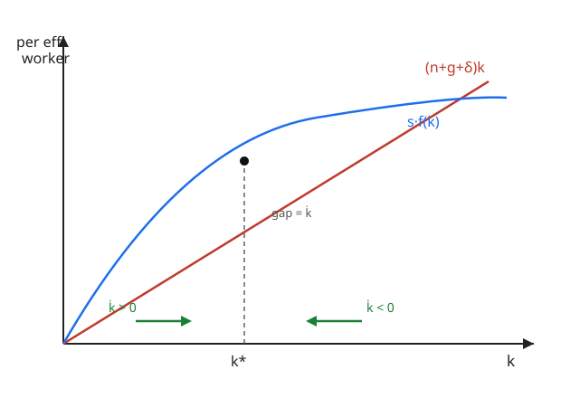

# Grad Macroeconomics · Lesson 2.1: The Solow model

> ⏱ ~15 min · Module 2: Economic growth · Builds on: [1.6 Recursive competitive equilibrium](01-06-recursive-competitive-equilibrium.md) · Unlocks: [2.2 Convergence and the Solow diagram](02-02-convergence-solow-diagram.md)

## Why this matters

Why is South Korea forty times richer per person than it was in 1960, while some economies have barely moved? The Solow model is the first serious answer, and it remains the frame every later growth theory argues with. Its punchline is bracing: **you cannot save your way to permanent growth.** Pile up capital and diminishing returns eventually strangle the payoff — sustained growth in living standards has to come from technology. That single result reorganizes how you read every development debate.

We start here, before the fully optimizing Ramsey model of [2.3](02-03-ramsey-cass-koopmans.md), because Solow's one trick — a saving rate $s$ fixed by assumption rather than chosen — strips the growth mechanics bare. No Euler equation, no value function: just one differential equation whose fixed point tells the whole story. Once you see the mechanics cleanly, endogenizing $s$ in Ramsey is a refinement, not a mystery.

## The idea

Households save a constant fraction $s$ of income. That saving becomes investment, which builds the capital stock $K$. But three forces eat into $K$ per worker at the same time: workers multiply (population growth $n$), technology makes each worker effectively "more numerous" (growth $g$), and machines wear out (depreciation $\delta$). Capital per worker rises when new saving outruns those three drains and falls when it can't.

The reason growth can't last on capital alone is **diminishing returns**: the first tractor on a farm transforms output; the thousandth barely helps. So as capital deepens, each extra unit of saving buys less new output, while the drain $(n+g+\delta)$ grows in lockstep with the capital you're trying to maintain. Eventually the two balance exactly — capital per worker stops changing. That resting point is the **steady state**, and the economy is drawn to it from any starting stock.

The clean way to see this is to measure everything **per effective worker** — divide by $AL$, technology times labor. In those units the growing economy sits still, and all the drift is squeezed into one honest equation.

## The formal version

**Production.** Output is Cobb–Douglas with labor-augmenting ("Harrod-neutral") technology:

$$Y = F(K, AL) = K^{\alpha}(AL)^{1-\alpha}, \qquad 0 < \alpha < 1.$$

Here $K$ is capital, $L$ is labor (workers), $A$ is the technology level, and $\alpha$ is capital's share of income. *In words:* $AL$ is the labor force measured in efficiency units — a worker with better technology counts as more workers. Constant returns to scale (the exponents sum to $1$) lets us divide through by $AL$.

**Per-effective-worker variables.** Define $k \equiv K/(AL)$ and $y \equiv Y/(AL)$. Dividing production by $AL$:

$$y = f(k) = k^{\alpha}.$$

*In words:* output per efficiency unit depends only on capital per efficiency unit. All the messy growth of $A$ and $L$ has been absorbed into the denominator.

**The laws of motion.** Labor grows at rate $n$ and technology at rate $g$:

$$\dot L / L = n, \qquad \dot A / A = g.$$

Capital accumulates from investment $sY$ minus depreciation $\delta K$:

$$\dot K = sY - \delta K.$$

**The fundamental Solow equation.** Differentiate $k = K/(AL)$ and substitute (the derivation is Worked Example 3):

$$\boxed{\dot k = s\,f(k) - (n + g + \delta)\,k.}$$

*In words:* capital per effective worker rises by what you save, $s f(k)$, and falls by what it takes just to stand still, $(n+g+\delta)k$ — enough new capital to equip new workers ($n$), keep pace with rising efficiency units ($g$), and replace worn-out machines ($\delta$). The term $(n+g+\delta)k$ is called **break-even investment**.

**Steady state.** Set $\dot k = 0$: saving exactly equals break-even.

$$s\,f(k^*) = (n+g+\delta)\,k^*.$$

With $f(k)=k^{\alpha}$ this solves in closed form:

$$k^* = \left(\frac{s}{n+g+\delta}\right)^{\frac{1}{1-\alpha}}, \qquad y^* = (k^*)^{\alpha} = \left(\frac{s}{n+g+\delta}\right)^{\frac{\alpha}{1-\alpha}}.$$

**Balanced growth path (BGP).** At $k^*$ the *per-effective-worker* quantities $k, y, c$ are constant. Undoing the normalization ($K = k\,AL$, etc.) gives the growth rates of the actual variables:

| Variable | Grows at rate |
|---|---|
| $K,\; Y,\; C$ (aggregates) | $n + g$ |
| $K/L,\; Y/L,\; C/L$ (per capita) | $g$ |
| $k,\; y,\; c$ (per effective worker) | $0$ |

*In words:* the whole economy expands at $n+g$; living standards — output **per person** — grow at exactly $g$, the rate of technological progress. **Capital deepening contributes nothing to long-run per-capita growth.** That is the model's central, uncomfortable claim.

## Picture

The Solow diagram plots the two sides of the fundamental equation against $k$. The concave blue curve is saving $s f(k)$; the red ray is break-even investment $(n+g+\delta)k$. Where they cross is $k^*$. To the left, saving sits above the ray, the gap $\dot k > 0$ pushes $k$ right; to the right, break-even wins, $\dot k < 0$ pushes $k$ left. Every arrow points at $k^*$ — it is globally stable.

## Worked examples

**Example 1 (steady state by the numbers).** Take $\alpha = 1/3$, $s = 0.24$, $n = 0.01$, $g = 0.02$, $\delta = 0.05$. Then $n+g+\delta = 0.08$ and the exponent is $\frac{1}{1-\alpha} = \frac{3}{2}$.

$$k^* = \left(\frac{0.24}{0.08}\right)^{3/2} = 3^{3/2} = 3\sqrt{3} \approx 5.196.$$

Output per effective worker: $y^* = (k^*)^{1/3} = 3^{(3/2)(1/3)} = 3^{1/2} = \sqrt 3 \approx 1.732$.

Steady-state consumption per effective worker is output minus the investment needed to hold $k$ fixed, $c^* = f(k^*) - (n+g+\delta)k^*$. In steady state that investment equals saving $s f(k^*)$, so simply

$$c^* = (1-s)\,y^* = 0.76 \times 1.732 \approx 1.316.$$

Sanity check: break-even $= 0.08 \times 5.196 = 0.4157$, and saving $= 0.24 \times 1.732 = 0.4157$. ✓ They match, as a steady state demands.

**Example 2 (a permanent rise in $s$ — level effect, not growth effect).** Suppose the economy sits at $k^*$ and $s$ jumps permanently from $0.24$ to $0.30$. Since $k^* \propto s^{3/2}$,

$$\frac{k^*_{\text{new}}}{k^*_{\text{old}}} = \left(\frac{0.30}{0.24}\right)^{3/2} = 1.25^{3/2} \approx 1.398,\qquad \frac{y^*_{\text{new}}}{y^*_{\text{old}}} = 1.25^{1/2}\approx 1.118.$$

So steady-state income per effective worker rises about $11.8\%$. **What happens dynamically:** at the old $k^*$, higher $s$ lifts the saving curve above break-even, so $\dot k > 0$ and $k$ climbs. During the transition, output per capita grows *faster* than $g$ — a temporary growth bonus. But diminishing returns bite: as $k$ approaches the new, higher $k^*$, growth decays back down and per-capita growth returns to exactly $g$.

The lasting effect is a permanently higher *level* of the income path; the long-run *slope* (growth rate) is untouched. Saving buys you a richer plateau, not a steeper climb. This level-vs-growth distinction is the single most tested idea in the model.

**Example 3 (deriving the fundamental equation).** Start from $k = K/(AL)$ and take logs and time derivatives (this is the "growth-rate algebra" every macro derivation leans on):

$$\frac{\dot k}{k} = \frac{\dot K}{K} - \frac{\dot A}{A} - \frac{\dot L}{L} = \frac{\dot K}{K} - g - n.$$

Multiply by $k$: $\ \dot k = \dfrac{\dot K}{K}\,k - (n+g)k$. Now use $\dot K = sY - \delta K$, so $\dfrac{\dot K}{K} = \dfrac{sY}{K} - \delta$, and note $\dfrac{Y}{K}\,k = \dfrac{Y}{K}\cdot\dfrac{K}{AL} = \dfrac{Y}{AL} = f(k)$. Therefore

$$\dot k = \big(\tfrac{sY}{K} - \delta\big)k - (n+g)k = s\,f(k) - \delta k - (n+g)k = s f(k) - (n+g+\delta)k. \qquad\checkmark$$

## Watch out

- **Level vs. growth.** Higher $s$, lower $n$, lower $\delta$ all raise the *level* $y^*$ but leave long-run per-capita growth pinned at $g$. If a policy claim promises permanently faster growth from more saving, Solow says no — only faster technology ($g$) does that.
- **"Per capita" vs. "per effective worker."** In steady state, $y = Y/(AL)$ is *constant* while $Y/L$ *grows at $g$*. Confusing the two is the classic sign error. The normalization is by $AL$; the living-standard variable is per $L$.
- **Break-even is not just depreciation.** New workers and rising efficiency units both need equipping. Forgetting $n$ or $g$ in $(n+g+\delta)$ silently overstates $k^*$.
- **$s$ is exogenous here.** It is handed to us, not chosen by households. Whether the resulting $c^*$ is even desirable is a separate question — the Golden Rule of [2.4](02-04-golden-rule-dynamic-efficiency.md) — and whether households *would* choose this $s$ is the Ramsey question of [2.3](02-03-ramsey-cass-koopmans.md).

## One-liner

> Capital deepening runs into diminishing returns and stops; only technology grows living standards forever — so saving sets your income *level*, not your growth *rate*.

## Problems

**P1 (🟢)** An economy has $\alpha = 1/2$, $s = 0.20$, $n = 0.00$, $g = 0.03$, $\delta = 0.05$. Find $k^*$ and $y^*$.

**P2 (🟡)** Starting from the P1 economy, a policymaker considers two separate reforms: (a) raising the saving rate to $s' = 0.25$, or (b) reducing population growth is moot here since $n=0$, so instead reducing depreciation to $\delta' = 0.03$ (better maintenance). Compute the new $y^*$ under each reform and say which raises steady-state income per effective worker more. Does either change the long-run per-capita *growth* rate?

**P3 (🔴)** Let $f$ be any production function in intensive form with $f(0)=0$, $f'>0$, $f''<0$ (diminishing returns), satisfying the Inada conditions $\lim_{k\to 0^+} f'(k) = \infty$ and $\lim_{k\to\infty} f'(k) = 0$. Prove that the Solow equation $\dot k = s f(k) - (n+g+\delta)k$ has a **unique** strictly positive steady state $k^*$ and that it is **globally stable** (every $k(0)>0$ converges to $k^*$).

Solutions

**P1** Here $n+g+\delta = 0 + 0.03 + 0.05 = 0.08$ and $\frac{1}{1-\alpha} = \frac{1}{1/2} = 2$.

$$k^* = \left(\frac{0.20}{0.08}\right)^{2} = 2.5^{2} = 6.25,\qquad y^* = (k^*)^{1/2} = \sqrt{6.25} = 2.5.$$

(Quick check: $s f(k^*) = 0.20\times 2.5 = 0.5$ and $(n+g+\delta)k^* = 0.08\times 6.25 = 0.5$. ✓)

**P2** Exponent is still $\frac{1}{1-\alpha}=2$ for $k^*$, and $y^* = (k^*)^{1/2}$, so $y^* = \left(\frac{s}{n+g+\delta}\right)^{\frac{\alpha}{1-\alpha}} = \left(\frac{s}{n+g+\delta}\right)^{1}$ since $\frac{\alpha}{1-\alpha} = \frac{1/2}{1/2}=1$. Neatly, $y^* = s/(n+g+\delta)$ here.

- (a) $s' = 0.25$, denominator $0.08$: $\ y^* = 0.25/0.08 = 3.125$. Ratio to baseline $2.5$: factor $1.25$ (a $25\%$ rise).
- (b) $\delta' = 0.03$, denominator $= 0 + 0.03 + 0.03 = 0.06$, $s = 0.20$: $\ y^* = 0.20/0.06 = 3.333$. Ratio to baseline: $3.333/2.5 = 1.333$ (a $33.3\%$ rise).

Reform (b) raises steady-state income per effective worker **more** ($33\%$ vs $25\%$): here it cuts the denominator from $0.08$ to $0.06$, a larger proportional move than raising the numerator from $0.20$ to $0.25$. **Neither** changes the long-run per-capita growth rate — that stays at $g = 0.03$. Both are pure level effects: the economy transitions to a higher plateau, then resumes growing at $g$.

**P3** Work with $\dot k = s f(k) - (n+g+\delta)k$. A positive steady state solves $s f(k^*) = (n+g+\delta)k^*$, i.e., dividing by $k^*>0$,

$$\frac{s f(k^*)}{k^*} = n+g+\delta.$$

*Existence and uniqueness.* Consider the average product $\phi(k) \equiv f(k)/k$ on $k>0$. Its derivative is

$$\phi'(k) = \frac{f'(k)k - f(k)}{k^2}.$$

Since $f$ is strictly concave with $f(0)=0$, we have $f(k) = f(k)-f(0) > f'(k)\,k$ for all $k>0$ (a chord from the origin lies above the tangent's height at $k$; equivalently, the secant slope exceeds the endpoint tangent slope for a strictly concave function through the origin). Hence $f'(k)k - f(k) < 0$, so $\phi'(k) < 0$: **the average product $f(k)/k$ is strictly decreasing.** Therefore $s\,\phi(k)$ is strictly decreasing too.

Its limits, using the Inada conditions and L'Hôpital / the concavity bounds:
$$\lim_{k\to 0^+} \phi(k) = \lim_{k\to 0^+} f'(k) = \infty \quad(\text{since } f(0)=0),\qquad \lim_{k\to\infty}\phi(k) = \lim_{k\to\infty} f'(k) = 0.$$
(For the first: $f(k)/k \ge f'(k)$ by concavity through the origin, and also $f(k)/k \to f'(0^+)=\infty$; for the second, $f(k)/k \le f'(0)$ is not needed — concavity gives $f(k)/k \to 0$ because $f' \to 0$ and $f(k)/k$ is squeezed between $f'(k)$ and the falling average.) So $s\phi(k)$ runs continuously and strictly monotonically from $+\infty$ down to $0$. By the intermediate value theorem it hits the positive constant $n+g+\delta$ **exactly once**. That crossing is the unique $k^*>0$.

*Global stability.* Define $g(k) \equiv \dot k = k\big[s\phi(k) - (n+g+\delta)\big]$. For $0 < k < k^*$: since $\phi$ is decreasing, $s\phi(k) > s\phi(k^*) = n+g+\delta$, so the bracket is positive and $\dot k > 0$ — $k$ rises toward $k^*$. For $k > k^*$: $s\phi(k) < n+g+\delta$, the bracket is negative, $\dot k < 0$ — $k$ falls toward $k^*$. So $k^*$ attracts from both sides. Because $\dot k$ has a strictly definite sign on each side of the single interior zero, $k(t)$ is monotone and bounded (toward $k^*$), hence converges; the only limit consistent with $\dot k \to 0$ is $k^*$. Thus $k^*$ is globally asymptotically stable for every $k(0)>0$. $\blacksquare$

(This is a textbook 1-D autonomous ODE with a single stable fixed point — see the phase-line reasoning in `](../../dynamical-systems/syllabus.md)`. The sign of $\dot k$ on each side of $k^*$ is exactly the phase-line arrow diagram.)

## Flashback

**From [1.3 Euler equation and transversality](01-03-euler-transversality.md):** A household solves $\max \sum_{t=0}^{\infty}\beta^t \ln c_t$ subject to $k_{t+1} = k_t^{\alpha} - c_t$ (full depreciation, no technology growth, $A=L=1$). Derive the consumption Euler equation, and find the constant saving rate $s$ that this optimizing household chooses along its balanced path. Compare it to Solow's *assumed* $s$.

Solution

The Euler equation from maximizing log utility with resource constraint $k_{t+1}=k_t^{\alpha}-c_t$ comes from the first-order / envelope conditions:

$$\frac{1}{c_t} = \beta\,\frac{1}{c_{t+1}}\,f'(k_{t+1}) = \beta\,\frac{\alpha k_{t+1}^{\alpha-1}}{c_{t+1}}.$$

*In words:* the marginal utility cost of saving one unit today equals the discounted marginal utility of the $\alpha k_{t+1}^{\alpha-1}$ extra units of consumption it yields tomorrow.

Guess a constant saving rate: $c_t = (1-s)k_t^{\alpha}$, so $k_{t+1} = s k_t^{\alpha}$. Substitute into the Euler equation:

$$\frac{1}{(1-s)k_t^{\alpha}} = \beta\,\frac{\alpha k_{t+1}^{\alpha-1}}{(1-s)k_{t+1}^{\alpha}} = \beta\,\frac{\alpha}{(1-s)k_{t+1}} = \frac{\beta\alpha}{(1-s)\,s k_t^{\alpha}}.$$

Cancel $\frac{1}{(1-s)k_t^{\alpha}}$ from both sides: $1 = \frac{\beta\alpha}{s}$, hence

$$s = \alpha\beta.$$

So the optimizing household picks a **constant** saving rate $s=\alpha\beta$ — the same constant-$s$ structure Solow simply *assumes*, but now pinned to preferences ($\beta$) and technology ($\alpha$). This is exactly why the Ramsey model of [2.3](02-03-ramsey-cass-koopmans.md) can be read as "Solow with $s$ derived instead of decreed": in the full-depreciation log case it collapses to a constant saving rate, and in general it makes $s$ respond endogenously to the state.

## Connections

- **Backward:** This is the non-optimizing skeleton of Module 1's machinery. [1.6](01-06-recursive-competitive-equilibrium.md) built equilibria from optimizing agents; here we short-circuit the household problem with a fixed $s$ to isolate the growth dynamics. The Flashback shows how [1.3](01-03-euler-transversality.md)'s Euler equation *re-derives* a constant $s$, foreshadowing Ramsey.
- **Forward:** [2.2](02-02-convergence-solow-diagram.md) linearizes this equation around $k^*$ to get the *speed* of convergence and the conditional-convergence prediction. [2.3](02-03-ramsey-cass-koopmans.md) endogenizes $s$ via household optimization (the saving curve becomes a policy function). [2.4](02-04-golden-rule-dynamic-efficiency.md) asks which $s$ maximizes steady-state consumption. [2.5](02-05-endogenous-growth-ak-ideas.md) breaks the model's core limit by relaxing diminishing returns ($f(k)=Ak$), letting capital accumulation itself sustain growth. [2.6](02-06-growth-accounting.md) turns the production function into an empirical decomposition of measured growth into capital, labor, and the technology residual $g$.
- **Sideways (dynamical systems):** the fundamental Solow equation is a textbook 1-D autonomous ODE with a single globally stable fixed point — the phase-line / stability analysis of `](../../dynamical-systems/syllabus.md)` is exactly P3's argument. The concavity-plus-Inada structure guaranteeing a unique attractor is the growth-theory face of a general fixed-point result.
