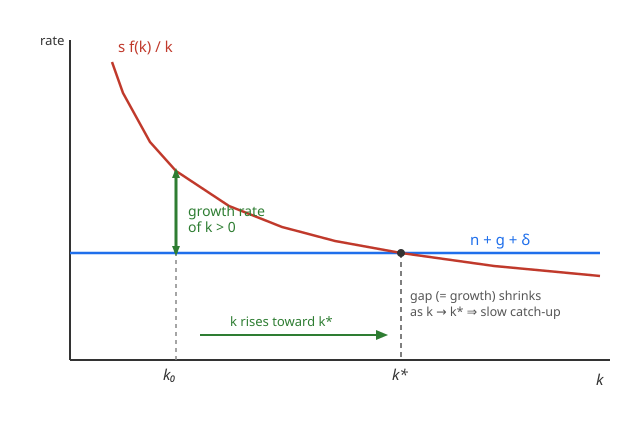

# Grad Macroeconomics · Lesson 2.2: Convergence and the Solow diagram

> ⏱ ~15 min · Module 2: Economic growth · Builds on: [2.1 The Solow model](02-01-solow-model.md) · Unlocks: [2.3 The Ramsey–Cass–Koopmans model](02-03-ramsey-cass-koopmans.md)

## Why this matters

The single most-tested empirical prediction of the Solow model is a claim about *rates*, not levels: **poor countries should grow faster than rich ones**. Sometimes they do (postwar Japan, Korea, now China); sometimes they emphatically don't (much of sub-Saharan Africa has fallen further behind). The Solow model turns out to say exactly *when* to expect catch-up — and getting the conditional-vs-absolute distinction right is what separates a naive reading of the data from the one that actually holds up in the cross-country regressions you'll meet in `](../../econometrics/syllabus.md)`. This lesson is the engine room: why an economy below its steady state grows, why it grows *faster* the farther below it sits, and how fast the gap actually closes.

## The idea

Recall the one-line story from [2.1](02-01-solow-model.md): capital per effective worker $k$ moves according to

$$\dot k = s f(k) - (n+g+\delta)k,$$

and it settles at the steady state $k^*$ where saving-per-unit-capital exactly funds depreciation-plus-dilution. Below $k^*$, investment $sf(k)$ outruns the break-even line $(n+g+\delta)k$, so $\dot k > 0$ and $k$ climbs. That much is level dynamics.

The convergence insight is about the *growth rate*. Divide by $k$:

$$\frac{\dot k}{k} = s\,\frac{f(k)}{k} - (n+g+\delta).$$

**In words: the growth rate of capital is the vertical gap between the saving curve $sf(k)/k$ and the flat break-even line.** Now here is the whole point — the *average product of capital* $f(k)/k$ is **decreasing in $k$** (diminishing returns: each unit of capital is more productive when capital is scarce). So the poorer the economy — the lower its $k$ — the higher $sf(k)/k$ sits above $(n+g+\delta)$, and the faster $k$ grows. Growth isn't just positive below $k^*$; it's *stronger the farther below you are*. That declining gap, closing to zero at $k^*$, **is** convergence.

But notice the fine print already: "faster growth" is measured relative to the economy's *own* $k^*$. Two economies with different saving rates have different curves and different steady states. A country can be dirt poor and still be *at* its steady state — growing at trend, catching up to no one. That distinction is the difference between two very different empirical claims.

## The formal version

**Transition dynamics.** For $0 < k < k^*$ we have $sf(k) > (n+g+\delta)k$, hence $\dot k > 0$; and because $f(k)/k$ falls monotonically in $k$, the per-unit growth rate $\dot k/k$ falls monotonically as $k \to k^*$, reaching $0$ at $k^*$. *In words: you always move toward $k^*$, and you move fastest when you're farthest away — the classic saturating approach.*

**Absolute convergence.** If a set of economies share **the same** $s, n, g, \delta$ (and the same technology $f$), they share one $k^*$, and the initially poorer ones — lower $k_0$, hence lower income per worker — grow faster and catch up. *In words: same steady state ⟹ the poor overtake, mechanically.* This is the strong, seductive claim — and it **fails** across the world as a whole, because countries plainly do *not* share saving rates, population growth, or institutions.

**Conditional convergence.** Drop the shared-parameters assumption. Each economy converges to **its own** $k^*$; controlling for the determinants of $k^*$ (saving/investment rate, $n$, human capital, etc.), an economy that is poorer *relative to its own steady state* grows faster. *In words: everyone races toward their own finish line, and whoever is farther from theirs runs faster.* This is the version the data support — poor-but-near-their-own-$k^*$ countries grow slowly; the "miracles" are countries that were far below a *high* steady state.

**Speed of convergence.** Linearize $\dot k = sf(k) - (n+g+\delta)k$ around $k^*$. Let $\lambda \equiv -\left.\dfrac{d\dot k}{dk}\right|_{k^*}$. A first-order Taylor expansion gives $\dot k \approx -\lambda\,(k - k^*)$, and equivalently for logs (derived in Worked Example 1 and Problem 3),

$$\frac{d}{dt}\ln k \;\approx\; -\lambda\,\big(\ln k - \ln k^*\big), \qquad \boxed{\;\lambda = (1-\alpha)(n+g+\delta)\;}$$

for Cobb–Douglas $f(k)=k^{\alpha}$. *In words: the log-gap to steady state decays exponentially at rate $\lambda$.* A gap of $x$ today is $x e^{-\lambda t}$ later; its **half-life** is $\ln 2/\lambda$. With plausible numbers ($\alpha\approx\frac13$, $n+g+\delta\approx 0.06$) you get $\lambda\approx 0.04$ — and empirically, cross-country and cross-region estimates cluster near the famous **$\lambda \approx 2\%$ per year**, a half-life of about **35 years**. Convergence is real but *glacially slow*.

**Decomposition.** Along the transition, output per worker grows for two reasons: **capital deepening / catch-up** (the transitory $\dot k>0$ term, which dies as $k\to k^*$) plus the **trend** from technological progress $g$ (permanent). *In words: growth = catch-up + trend; only trend survives in the long run.* This split is exactly what [2.6 growth accounting](02-06-growth-accounting.md) measures as capital's contribution versus the Solow residual.

## Picture

The saving curve $sf(k)/k$ slopes *down* (diminishing average product); the break-even requirement $(n+g+\delta)$ is flat. The **vertical gap** is the growth rate of $k$. At $k_0 \ll k^*$ the gap is wide — fast growth; as $k$ rises the gap narrows to zero at $k^*$. Poorer means farther left means faster — *provided both economies live on the same two curves* (same $k^*$).

## Worked examples

**Example 1 (log-linearization → the speed $\lambda$).** Take Cobb–Douglas $f(k)=k^{\alpha}$, so $\dot k = s k^{\alpha} - (n+g+\delta)k$. We want the local decay rate of the gap. Work directly in the variable $z \equiv \ln k$.

First, $\dot z = \dot k / k = s k^{\alpha-1} - (n+g+\delta)$. At the steady state $\dot z = 0$, so $s (k^*)^{\alpha-1} = (n+g+\delta)$, i.e. $s(k^*)^{\alpha-1} = n+g+\delta$. Now differentiate $\dot z$ with respect to $z=\ln k$. Since $k^{\alpha-1} = e^{(\alpha-1)z}$,

$$\frac{d\dot z}{dz} = s(\alpha-1)e^{(\alpha-1)z} = (\alpha-1)\,s k^{\alpha-1}.$$

Evaluate at $k^*$ and substitute $s(k^*)^{\alpha-1} = n+g+\delta$:

$$\left.\frac{d\dot z}{dz}\right|_{k^*} = (\alpha-1)(n+g+\delta) = -(1-\alpha)(n+g+\delta) \equiv -\lambda.$$

So near $k^*$, with $\tilde z \equiv z - \ln k^*$, we have $\dot{\tilde z} \approx -\lambda \tilde z$, whose solution is $\tilde z(t) = \tilde z(0)e^{-\lambda t}$ — exponential convergence at rate

$$\lambda = (1-\alpha)(n+g+\delta).$$

Numbers: $\alpha = \tfrac13$, $n=0.01$, $g=0.02$, $\delta=0.03$ (so $n+g+\delta=0.06$). Then $\lambda = \tfrac23 \times 0.06 = 0.04 = 4\%$/yr, half-life $\ln2/\lambda = 0.693/0.04 \approx 17.3$ years. (Push $\alpha$ up toward $\tfrac23$ — a broad notion of capital including human capital — and $\lambda$ drops to $\tfrac13\times0.06 = 2\%$, half-life $\approx 35$ years, matching the empirical estimates. That the data prefer the *slow* number is itself evidence that capital's effective share is large.)

**Example 2 (two economies: absolute, then conditional).** Two economies, A and B, identical in every parameter — same $s=0.2$, $n+g+\delta=0.05$, same $f(k)=k^{1/2}$ ($\alpha=\tfrac12$) — but B starts poorer: $k_0^A = 9$, $k_0^B = 1$.

*Common steady state.* $s(k^*)^{\alpha-1}=n+g+\delta \Rightarrow 0.2\,(k^*)^{-1/2}=0.05 \Rightarrow (k^*)^{1/2}=4 \Rightarrow k^*=16$. Both share $k^*=16$.

*Who grows faster now?* Growth rate $\dot k/k = s k^{\alpha-1}-(n+g+\delta)=0.2\,k^{-1/2}-0.05$.
- A: $0.2/\sqrt9 - 0.05 = 0.2/3 - 0.05 = 0.0667-0.05 = 1.67\%$.
- B: $0.2/\sqrt1 - 0.05 = 0.20-0.05 = 15\%$.

B, the poorer one, grows nearly ten times faster, and both approach the *same* $k^*=16$: **absolute convergence** holds because the parameters are shared. B catches A.

*Now break it (conditional).* Give B a lower saving rate, $s_B = 0.1$, everything else equal. Then $k_B^*$: $0.1\,(k_B^*)^{-1/2}=0.05 \Rightarrow (k_B^*)^{1/2}=2 \Rightarrow k_B^*=4$. B now converges to $k_B^*=4$, far *below* A's $k^*=16$. B is still poorer and might even still show a positive growth rate at $k=1$ ($0.1/1-0.05=5\%$), but it is heading to a *lower* finish line — it will **never** catch A. The correct comparison isn't "who is poorer" but "who is farther below *their own* $k^*$." That is conditional convergence, and it is why raw cross-country growth regressions show no catch-up until you control for saving/investment rates and $n$.

## Watch out

- **Absolute convergence is the claim that fails.** Plotting growth against initial income for *all* countries shows no downward slope — the world does not share a steady state. The Solow model does **not** predict unconditional catch-up; asserting it does is the classic misreading. What it predicts is *conditional* convergence, and that does show up once you hold the determinants of $k^*$ fixed.
- **"Poor" ≠ "far from steady state."** A country can be poor because its $k^*$ is low (low $s$, high $n$, weak institutions), in which case it's *near* its steady state and will grow slowly. Growth speed keys off the gap $\ln k - \ln k^*$, not the level of $k$ itself.
- **$\lambda$ depends on the capital share, and that's the whole empirical fight.** Textbook $\alpha\approx\tfrac13$ predicts $\lambda\approx4\%$, twice the observed $\approx2\%$. The standard fix — a *broad* capital share $\alpha\approx\tfrac23$ (add human capital) — halves $\lambda$ to match. So the slow observed convergence is read as evidence that capital, broadly defined, is a big slice of output.
- **The linearization is local.** $\dot z \approx -\lambda\tilde z$ is a Taylor approximation near $k^*$; far from steady state the true dynamics are nonlinear (the gap term in levels is $-\lambda(k-k^*)$ plus curvature). It's an excellent guide to *speed near* the target, not an exact global solution.

## One-liner

> Below its own steady state an economy grows faster the poorer it is — but only *relative to that steady state*, and the log-gap closes at the sluggish rate $\lambda=(1-\alpha)(n+g+\delta)\approx 2\%$/yr, a 35-year half-life.

## Problems

**P1 (🟢)** An economy has Cobb–Douglas production with capital share $\alpha = 0.4$, and $n = 0.015$, $g = 0.02$, $\delta = 0.045$. Compute the convergence speed $\lambda$ and the half-life of the gap to steady state.

**P2 (🟡)** Countries X and Y are identical except for their saving rates: $s_X = 0.25$, $s_Y = 0.15$; both have $f(k)=k^{1/3}$ and $n+g+\delta = 0.06$. Country Y is currently poorer (lower $k$). (a) Find each country's steady-state $k^*$. (b) Will Y catch up to X (absolute convergence), or not? Explain which convergence concept applies. (c) If instead the two shared the *same* $s=0.25$ and Y were merely starting from a lower $k_0$, what would you predict?

**P3 (🔴)** Starting from $\dot k = sf(k)-(n+g+\delta)k$ with general $f$, derive the log-linearized convergence equation $\dfrac{d}{dt}\ln k \approx -\lambda(\ln k - \ln k^*)$ and give $\lambda$ in terms of the steady-state elasticity of $f$. Then specialize to $f(k)=k^\alpha$ to recover $\lambda=(1-\alpha)(n+g+\delta)$, and interpret what a *larger* $\lambda$ means economically.

Solutions

**P1** $n+g+\delta = 0.015+0.02+0.045 = 0.08$. Then
$$\lambda = (1-\alpha)(n+g+\delta) = (1-0.4)(0.08) = 0.6 \times 0.08 = 0.048 = 4.8\%\text{/yr}.$$
Half-life $= \dfrac{\ln 2}{\lambda} = \dfrac{0.693}{0.048} \approx 14.4$ years. (A high capital-productivity setting with a small effective capital share converges relatively briskly.)

**P2** (a) Steady state solves $s(k^*)^{\alpha-1} = n+g+\delta$ with $\alpha=\tfrac13$, so $(k^*)^{-2/3} = (n+g+\delta)/s$, i.e. $k^* = \left(\dfrac{s}{n+g+\delta}\right)^{3/2}$ (this is just the [2.1](02-01-solow-model.md) formula $k^*=(s/(n+g+\delta))^{1/(1-\alpha)}$ with $1/(1-\alpha)=3/2$).
- X: $k_X^* = (0.25/0.06)^{3/2} = (4.167)^{3/2} = 4.167\times\sqrt{4.167} = 4.167\times2.041 \approx 8.50$.
- Y: $k_Y^* = (0.15/0.06)^{3/2} = (2.5)^{3/2} = 2.5\times1.581 \approx 3.95$.

(b) **No** — Y will not catch X. They have *different* steady states ($k_Y^* \approx 3.95 < k_X^* \approx 8.50$), so this is **conditional** convergence, not absolute: each heads to its own $k^*$. Y is poorer partly *because* its lower saving rate pins a lower steady state; controlling for $s$ it might be growing fast toward $k_Y^*$, but $k_Y^* < k_X^*$ means the income gap persists in the long run. Absolute convergence requires shared parameters, which fails here.

(c) With identical $s=0.25$ they'd share $k^*\approx 8.50$. Then the only difference is the starting point: Y, being farther below the *common* steady state, grows faster and **catches up** — textbook **absolute convergence**. The lesson: convergence hinges on shared steady states, and saving-rate differences are exactly what break that sharing.

**P3** Work in $z=\ln k$. Growth rate:
$$\dot z = \frac{\dot k}{k} = s\frac{f(k)}{k} - (n+g+\delta).$$
At steady state $\dot z=0$: $s\,f(k^*)/k^* = n+g+\delta$. Linearize $\dot z$ in $z$ around $z^*=\ln k^*$. Since $\dot z$ is a function of $k=e^z$,
$$\frac{d\dot z}{dz} = \frac{d\dot z}{dk}\cdot\frac{dk}{dz} = \frac{d\dot z}{dk}\cdot k.$$
Now $\dot z = s f(k)k^{-1} - (n+g+\delta)$, so
$$\frac{d\dot z}{dk} = s\big(f'(k)k^{-1} - f(k)k^{-2}\big) = \frac{s}{k}\Big(f'(k) - \frac{f(k)}{k}\Big).$$
Multiply by $k$:
$$\frac{d\dot z}{dz} = s\Big(f'(k) - \frac{f(k)}{k}\Big).$$
Evaluate at $k^*$ and use $s\,f(k^*)/k^* = n+g+\delta$:
$$\left.\frac{d\dot z}{dz}\right|_{k^*} = s f'(k^*) - s\frac{f(k^*)}{k^*} = s f'(k^*) - (n+g+\delta).$$
Write the steady-state elasticity $\alpha^* \equiv \dfrac{k^* f'(k^*)}{f(k^*)}$ (capital's output elasticity at $k^*$). Then $s f'(k^*) = \alpha^* \cdot s\,f(k^*)/k^* = \alpha^*(n+g+\delta)$, giving
$$\left.\frac{d\dot z}{dz}\right|_{k^*} = \alpha^*(n+g+\delta) - (n+g+\delta) = -(1-\alpha^*)(n+g+\delta) \equiv -\lambda.$$
Hence, with $\tilde z = \ln k - \ln k^*$,
$$\frac{d}{dt}\ln k = \dot z \approx -\lambda(\ln k - \ln k^*), \qquad \lambda = (1-\alpha^*)(n+g+\delta),$$
solution $\tilde z(t) = \tilde z(0)e^{-\lambda t}$. For $f(k)=k^\alpha$ the elasticity is constant, $\alpha^*=\alpha$, so $\lambda = (1-\alpha)(n+g+\delta)$. ✓

*Interpretation.* $\lambda$ is the fraction of the remaining log-gap closed per year; a **larger** $\lambda$ means faster catch-up (shorter half-life $\ln2/\lambda$). It rises when the effective capital share $\alpha$ is *small* — because sharper diminishing returns make a capital-scarce economy far more productive at the margin, so it lurches toward $k^*$ quickly — and when $n+g+\delta$ is large, since faster dilution/depreciation and technical progress speed the adjustment of $k$ per effective worker.

## Flashback

**From [2.1](02-01-solow-model.md) (the Solow steady state):** An economy has $f(k)=k^{1/2}$, saving rate $s=0.3$, and $n+g+\delta = 0.05$. Find the steady-state capital per effective worker $k^*$ and steady-state output per effective worker $y^*=f(k^*)$. Then, if the depreciation rate rises so that $n+g+\delta$ jumps to $0.075$, what happens to $k^*$ — and (looking ahead) in which direction does the economy now grow?

Solution

Steady state: $sf(k^*) = (n+g+\delta)k^*$, i.e. $0.3\,(k^*)^{1/2} = 0.05\,k^*$. Divide by $(k^*)^{1/2}$: $0.3 = 0.05\,(k^*)^{1/2}$, so $(k^*)^{1/2} = 6$ and
$$k^* = 36, \qquad y^* = (k^*)^{1/2} = 6.$$
After the jump to $n+g+\delta = 0.075$: $0.3 = 0.075\,(k^*)^{1/2} \Rightarrow (k^*)^{1/2} = 4 \Rightarrow k^*_{\text{new}} = 16$, $y^*_{\text{new}} = 4$. The break-even line steepened, so the steady state **falls** ($36 \to 16$). The economy is now *above* its new $k^*$: $sf(k) < (n+g+\delta)k$, so $\dot k < 0$ and $k$ **declines** toward $16$ — convergence from above, the mirror image of this lesson's catch-up-from-below. (This is the same comparative-static from [2.1](02-01-solow-model.md), now read through the transition-dynamics lens of 2.2.)

## Connections

- **Backward:** the entire diagram is [2.1](02-01-solow-model.md)'s Solow diagram divided through by $k$ — the crossing point is the same $k^*$, but now the vertical gap *is* the growth rate, which is what makes convergence visible. The steady-state condition $s f(k^*)/k^* = n+g+\delta$ is 2.1's, reused.
- **Forward:** [2.3 Ramsey–Cass–Koopmans](02-03-ramsey-cass-koopmans.md) replaces the fixed saving rate with optimizing consumers; convergence there is **saddle-path** convergence in a $(k,c)$ phase plane — the optimizing analogue of this monotone approach, with its own local speed set by the linearized eigenvalue. [2.6 growth accounting](02-06-growth-accounting.md) operationalizes the catch-up-vs-trend split as capital deepening versus the Solow residual.
- **Sideways (dynamical systems):** the whole calculation is linearization of an ODE about a fixed point — $\lambda$ is minus the Jacobian eigenvalue at $k^*$, and $\lambda>0$ (stable) is exactly the negative-eigenvalue stability criterion from `](../../dynamical-systems/syllabus.md)`. Convergence *is* asymptotic stability.
- **Sideways (econometrics):** the log-linear law $\frac{d}{dt}\ln k \approx -\lambda(\ln k - \ln k^*)$ integrates to the **convergence regression** $\frac{1}{T}\ln(y_T/y_0) = a - \frac{1-e^{-\lambda T}}{T}\ln y_0 + \text{controls}$ that Barro–Sala-i-Martin run; the negative coefficient on initial income (conditional on the $k^*$-determinants) is the empirical test, developed in `](../../econometrics/syllabus.md)`.
