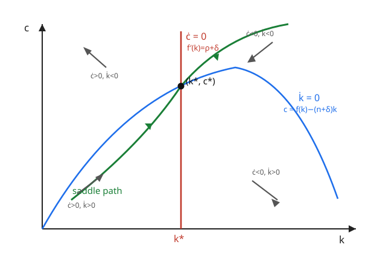

# Grad Macroeconomics · Lesson 2.3: The Ramsey–Cass–Koopmans model

> ⏱ ~15 min · Module 2: Economic growth · Builds on: [2.2 Convergence and the Solow diagram](02-02-convergence-solow-diagram.md) · Unlocks: [2.4 The golden rule and dynamic efficiency](02-04-golden-rule-dynamic-efficiency.md)

## Why this matters

Solow told you where an economy *ends up*, but it cheated on *how* it saves: a constant rate $s$, pulled from thin air. That single assumption is the model's original sin — nothing in it says $s$ is a good idea, so Solow can't tell you whether an economy saves too much, too little, or just right. Ramsey–Cass–Koopmans fixes this by handing the savings decision to an **optimizing household** that trades off consumption today against consumption tomorrow, forever. The payoff is enormous: the same capital-accumulation equation now comes paired with a **consumption rule** (the Keynes–Ramsey rule), the pair forms a **two-dimensional dynamical system**, and its solution is a **saddle path** — the single trajectory a forward-looking agent would ever choose. This is the skeleton of every modern macro model: the RBC model of [Module 4](04-01-real-business-cycle.md) is just this system made stochastic, and the household block of [permanent-income consumption](05-01-permanent-income-life-cycle.md) is exactly this Euler equation. Master the phase diagram here and you can read the rest of the course off it.

## The idea

Replace Solow's rule-of-thumb saver with a household that actually thinks. It lives forever, and it ranks consumption paths by a discounted utility sum: enjoy $c$ today, but weight future enjoyment less because you're impatient (rate $\rho$). Capital still accumulates the same way — output minus consumption minus the capital you must lay down just to stand still — but now $c$ is *chosen*, not left over.

The household faces one central tension. If capital is very productive (its marginal product beats your impatience), you should be **saving hard now** and consuming more later — so consumption is *rising*. If capital is barely productive (return below impatience), you should be eating your capital down — consumption *falling*. Consumption growth is therefore governed by a tug-of-war between the **return on capital** and the **discount rate**, and the moment they balance is where consumption holds steady. That single sentence is the Keynes–Ramsey rule.

Put the capital equation and the consumption equation side by side and you have two arrows at every point of the $(k,c)$ plane: one telling capital which way to drift, one telling consumption. Almost every starting choice of $c$ sends you spiralling off to ruin — capital crashing to zero, or consumption crashing to zero while capital piles up uselessly. Exactly one choice of initial consumption threads the needle and glides into the steady state. That knife-edge is the **saddle path**, and finding it *is* solving the model.

## The formal version

**The household's problem.** A representative household (population growing at rate $n$, so we weight each cohort's per-capita utility by its size) chooses a consumption path to solve

$$\max_{\{c(t)\}}\ \int_0^\infty e^{-\rho t}\,u\big(c(t)\big)\,dt \quad\text{s.t.}\quad \dot k = f(k) - c - (n+\delta)k,\ \ k(0)=k_0 \text{ given.}$$

Here $c$ is per-capita consumption, $k$ per-capita capital, $f(k)$ the per-capita production function (increasing, concave, Inada), $\rho>0$ the **rate of time preference** (impatience), $\delta$ the depreciation rate, and $n$ population growth. The term $(n+\delta)k$ is **break-even investment**: what you must add just to keep $k$ per person constant as people multiply and machines wear out — the same term as Solow's [2.1](02-01-solow-model.md) $\dot k$ equation. We use **CRRA** utility

$$u(c) = \frac{c^{1-\sigma}}{1-\sigma},\qquad u'(c)=c^{-\sigma},\quad \sigma>0,$$

where $\sigma$ is the coefficient of relative risk aversion, and $1/\sigma$ is the **elasticity of intertemporal substitution** — how willing you are to let consumption tilt across time in response to a return. (For $\sigma=1$, $u(c)=\ln c$.)

**The Keynes–Ramsey rule.** Solving the household problem (Example 1 does it with a Hamiltonian) yields the **consumption Euler equation**:

$$\boxed{\ \frac{\dot c}{c} = \frac{1}{\sigma}\big[\,f'(k) - \delta - \rho\,\big]\ }$$

In words: per-capita consumption grows exactly when the **net return on capital** $f'(k)-\delta$ exceeds your impatience $\rho$; the intertemporal elasticity $1/\sigma$ scales how aggressively you tilt. Impatient households ($\rho$ high) front-load and let $c$ fall; patient ones with productive capital back-load. This is the continuous-time twin of the discrete Euler equation $u'(c_t)=\beta u'(c_{t+1})[f'(k_{t+1})+1-\delta]$ from [1.4](01-04-envelope-theorem-dynamics.md) — take logs and let the period shrink.

**The two-equation dynamic system.** The household rule plus the resource constraint is a closed autonomous system in $(k,c)$:

$$\dot k = f(k) - c - (n+\delta)k, \qquad \dot c = \frac{c}{\sigma}\big[f'(k)-\delta-\rho\big].$$

Two states, two laws of motion — a phase plane, exactly the object [dynamical systems](../../dynamical-systems/syllabus.md) studies.

**The steady state.** Set both time-derivatives to zero. From $\dot c = 0$ (with $c>0$):

$$f'(k^*) = \rho + \delta \qquad\text{(the modified golden rule)}.$$

This is a **vertical line** at $k=k^*$ in the phase plane: consumption holds still only at that one capital stock. From $\dot k = 0$:

$$c^* = f(k^*) - (n+\delta)k^*,$$

the **hump-shaped** locus $c=f(k)-(n+\delta)k$ evaluated at $k^*$. In words: at the steady state the marginal product of capital is pinned by impatience-plus-depreciation, and consumption equals whatever output is left after break-even investment.

**Transversality kills the explosions.** The optimum also requires the transversality condition $\lim_{t\to\infty} e^{-\rho t}\mu(t)\,k(t)=0$ (with $\mu$ the shadow value of capital from Example 1) — the same "don't leave value on the table at infinity" condition as [1.3](01-03-euler-transversality.md). Paths that over-accumulate capital forever violate it; paths that drive $c\to0$ violate optimality. What survives is a single trajectory into $(k^*,c^*)$: the **saddle path**.

## Picture

The two nullclines carve the plane into four regions. In each, the sign of $\dot k$ (are you above or below the hump?) and the sign of $\dot c$ (are you left or right of $k^*$?) fix the local arrow. The steady state is a **saddle point**: two arms point in (the stable manifold, drawn green), two point out. The green **saddle path** is the *only* set of $(k,c)$ points from which you converge. Given the inherited $k_0$ (which you can't jump — capital is a stock), the household **jumps $c$ vertically onto the saddle path** and then rides it in. Every other initial $c$ launches you into an explosive region.

## Worked examples

**Example 1 — deriving the Keynes–Ramsey rule from the current-value Hamiltonian.**

Population $L(t)=e^{nt}$, so total welfare $\int_0^\infty e^{-\rho t}u(c)\,e^{nt}\,dt = \int_0^\infty e^{-(\rho-n)t}u(c)\,dt$ (drop the constant). Assume $\rho>n$ so this converges. Form the **current-value Hamiltonian** with co-state $\mu$ — the shadow (marginal) value of an extra unit of capital, the continuous-time cousin of $V'(k)$ from [1.4](01-04-envelope-theorem-dynamics.md) and the Lagrange multiplier $\lambda$ of [1.3](01-03-euler-transversality.md):

$$H = u(c) + \mu\big[\,f(k) - c - (n+\delta)k\,\big].$$

The maximum principle gives three conditions. **(i)** Optimize over the control $c$: $\partial H/\partial c = 0$, so

$$u'(c) = \mu.$$

Marginal utility of consuming today equals the shadow value of the capital you'd forgo — the envelope logic of [1.4](01-04-envelope-theorem-dynamics.md) in continuous time. **(ii)** The co-state law (effective discount $\rho-n$):

$$\dot\mu = (\rho-n)\mu - \frac{\partial H}{\partial k} = (\rho-n)\mu - \mu\big[f'(k)-(n+\delta)\big] = \mu\big[\rho + \delta - f'(k)\big].$$

Notice the two $n$'s — one from welfare-weighting, one from capital dilution — **cancel**, which is why population growth never appears in the Euler equation. So $\dot\mu/\mu = \rho+\delta-f'(k)$. **(iii)** Transversality $\lim_{t\to\infty}e^{-(\rho-n)t}\mu k = 0$.

Now differentiate (i) in time: $\dot\mu = u''(c)\,\dot c$, hence $\dot\mu/\mu = \dfrac{u''(c)\,\dot c}{u'(c)}$. For CRRA, $\dfrac{u''(c)\,c}{u'(c)} = -\sigma$, so $\dfrac{\dot\mu}{\mu} = -\sigma\,\dfrac{\dot c}{c}$. Set the two expressions for $\dot\mu/\mu$ equal:

$$-\sigma\,\frac{\dot c}{c} = \rho + \delta - f'(k)\quad\Longrightarrow\quad \frac{\dot c}{c} = \frac{1}{\sigma}\big[f'(k)-\delta-\rho\big].\ \checkmark$$

**Example 2 — Boss Problem 2 core: CRRA + Cobb–Douglas.** Take $f(k)=k^\alpha$, $0<\alpha<1$, so $f'(k)=\alpha k^{\alpha-1}$. The system becomes

$$\dot k = k^\alpha - c - (n+\delta)k, \qquad \dot c = \frac{c}{\sigma}\big[\alpha k^{\alpha-1} - \delta - \rho\big].$$

*Steady state.* From $\dot c=0$: $\alpha k^{*\,\alpha-1} = \rho+\delta$, so

$$k^* = \left(\frac{\alpha}{\rho+\delta}\right)^{\!1/(1-\alpha)},\qquad c^* = k^{*\,\alpha} - (n+\delta)k^*.$$

*The four regions* (this is where the arrows come from):

- **$\dot c$ sign** depends only on $k$ vs $k^*$. Since $f'$ is *decreasing* (diminishing returns), $k<k^*\Rightarrow f'(k)>\rho+\delta\Rightarrow \dot c>0$ (consumption rises, arrow **up**); $k>k^*\Rightarrow \dot c<0$ (arrow **down**). The divide is the vertical line at $k^*$.
- **$\dot k$ sign** depends on $c$ vs the hump $f(k)-(n+\delta)k$. Below the hump, $c$ is small, investment exceeds break-even, $\dot k>0$ (arrow **right**); above the hump, $\dot k<0$ (arrow **left**).

Crossing them: lower-left region (small $k$, low $c$) has arrows up-and-right — pushing *toward* the steady state; upper-right region has arrows down-and-left — also toward it. Those two regions host the two **stable arms**. The other two regions (upper-left, lower-right) push away. The steady state is a **saddle point**, and the stable arms form the **saddle path**: given $k_0$, set $c_0$ on that path and converge; any other $c_0$ diverges (transversality rejects it). *Golden-rule comparison:* the level that maximizes steady-state consumption solves $f'(k_{\text{gold}})=n+\delta$, i.e. $k_{\text{gold}}=(\alpha/(n+\delta))^{1/(1-\alpha)}$. Because $\rho>n$, we get $\rho+\delta>n+\delta$, so $f'(k^*)>f'(k_{\text{gold}})$, and by diminishing returns $k^*<k_{\text{gold}}$ — the Ramsey economy settles **below** the golden rule. Impatience makes the optimum stop short of maximal consumption. Why that's *efficient* (unlike an over-saving Solow economy) is exactly [2.4](02-04-golden-rule-dynamic-efficiency.md).

## Watch out

- **$c$ jumps, $k$ doesn't.** Capital is a predetermined stock — you inherit $k_0$ and can't teleport it. Consumption is a jump (control) variable: the household picks $c_0$ freely, and optimality forces that pick to land on the saddle path. Reversing which variable jumps is the single most common Ramsey error.
- **Saddle-path stability is not global stability.** Solow converges from *any* start; Ramsey converges only from the measure-zero saddle path. The difference is precisely that $c$ is chosen — the household *selects* the convergent path. Don't carry Solow's "all roads lead to $k^*$" intuition over.
- **The modified golden rule is not the golden rule.** $f'(k^*)=\rho+\delta$ (Ramsey) versus $f'(k_{\text{gold}})=n+\delta$ (max steady-state $c$). They coincide only if $\rho=n$, which is ruled out. The gap $\rho-n>0$ is why $k^*<k_{\text{gold}}$.
- **$n$ is absent from the Euler equation on purpose.** It cancels (Example 1). It still lives in the $\dot k$ equation and hence in $c^*$ and in the golden rule — so it shifts the *hump* and $k_{\text{gold}}$, never the *vertical* nullcline.
- **CRRA sign check.** $\dot c/c$ is positive when $f'(k)-\delta>\rho$. With $\sigma$ large (low intertemporal elasticity), the household resists tilting consumption, so a given return gap moves $c$ *less* — the $1/\sigma$ out front, not a sign flip.

## One-liner

> Hand savings to an optimizing household and Solow's $\dot k$ equation acquires a partner — the Keynes–Ramsey rule $\dot c/c=\tfrac1\sigma[f'(k)-\delta-\rho]$ — turning a diagram into a saddle: jump $c$ onto the one stable path into $f'(k^*)=\rho+\delta$, a point just shy of the golden rule.

## Problems

**P1 (🟢)** Let $f(k)=k^{1/2}$, with $\rho=0.03$, $\delta=0.07$, $n=0.02$. Find the steady-state capital stock $k^*$ from the modified golden rule $f'(k^*)=\rho+\delta$, and then the steady-state consumption $c^*$.

**P2 (🟡)** For the Cobb–Douglas system $\dot k = k^\alpha - c - (n+\delta)k$, $\dot c=\tfrac{c}{\sigma}[\alpha k^{\alpha-1}-\delta-\rho]$, determine the sign of $\dot c$ and of $\dot k$ in **each of the four regions** cut out by the two nullclines, and state which two regions the saddle path passes through. Justify each sign from the equations (not by copying the picture).

**P3 (🔴 — Boss Problem 2)** Full workout. For CRRA utility and $f(k)=k^\alpha$: **(a)** write the two-equation dynamic system in $(k,c)$; **(b)** locate the steady state $(k^*,c^*)$ in closed form; **(c)** describe the phase diagram — both nullclines, the four regions with their arrows, the saddle-point classification, and the saddle path, explaining how $c_0$ is chosen given $k_0$ and how transversality rules out the other paths; **(d)** set up the golden-rule comparison: find $k_{\text{gold}}$, and show $k^*<k_{\text{gold}}$. Use $\alpha=1/3$, $\rho=0.04$, $\delta=0.06$, $n=0.01$ for the numbers.

Solutions

**P1.** $f'(k)=\tfrac12 k^{-1/2}$. Set $\tfrac12 k^{*-1/2}=\rho+\delta=0.10$:

$$k^{*-1/2} = 0.20 \;\Longrightarrow\; k^{*1/2}=5 \;\Longrightarrow\; k^*=25.$$

Then $c^* = k^{*1/2}-(n+\delta)k^* = 5 - (0.09)(25) = 5 - 2.25 = 2.75.$ (Sanity: golden rule would be $\tfrac12 k^{-1/2}=n+\delta=0.09\Rightarrow k^{1/2}=5.56\Rightarrow k_{\text{gold}}\approx30.9>25$, consistent with $k^*<k_{\text{gold}}$.)

**P2.** Read the two equations directly.

*Sign of $\dot c$.* $\dot c = \tfrac{c}{\sigma}[\alpha k^{\alpha-1}-\delta-\rho]$ with $c>0,\sigma>0$, so its sign is the sign of $\alpha k^{\alpha-1}-(\rho+\delta)$. The function $\alpha k^{\alpha-1}=f'(k)$ is strictly decreasing in $k$, and equals $\rho+\delta$ at $k=k^*$. Hence $\dot c>0 \iff k<k^*$ and $\dot c<0 \iff k>k^*$. The boundary is the vertical line $k=k^*$; it depends on $k$ only.

*Sign of $\dot k$.* $\dot k = k^\alpha - c - (n+\delta)k$, i.e. $\dot k = \big[f(k)-(n+\delta)k\big]-c = (\text{hump height})-c$. So $\dot k>0 \iff c< f(k)-(n+\delta)k$ (below the hump) and $\dot k<0 \iff c>f(k)-(n+\delta)k$ (above the hump). Depends on $c$ vs the hump only.

*Four regions* (left/right of $k^*$ × below/above hump):

| region | $k$ vs $k^*$ | $c$ vs hump | $\dot c$ | $\dot k$ | arrow |
|---|---|---|---|---|---|
| SW | $k<k^*$ | below | $+$ | $+$ | up-right |
| NW | $k<k^*$ | above | $+$ | $-$ | up-left |
| NE | $k>k^*$ | above | $-$ | $-$ | down-left |
| SE | $k>k^*$ | below | $-$ | $+$ | down-right |

The saddle path passes through **SW** (approaching from low $k$, low $c$, arrows up-right toward the steady state) and **NE** (approaching from high $k$, high $c$, arrows down-left toward it) — the two regions whose arrows point *into* $(k^*,c^*)$. NW and SE arrows point away.

**P3.**

**(a)** System:
$$\dot k = k^\alpha - c - (n+\delta)k,\qquad \dot c = \frac{c}{\sigma}\big[\alpha k^{\alpha-1}-\delta-\rho\big].$$

**(b)** $\dot c=0$ (with $c>0$): $\alpha k^{*\,\alpha-1}=\rho+\delta \Rightarrow k^* = \big(\tfrac{\alpha}{\rho+\delta}\big)^{1/(1-\alpha)}$. $\dot k=0$ at $k^*$: $c^* = k^{*\,\alpha}-(n+\delta)k^*$.

*Numbers* ($\alpha=1/3,\rho=0.04,\delta=0.06,n=0.01$): $\rho+\delta=0.10$, $\alpha/(\rho+\delta)=(1/3)/0.10=3.\overline{3}$, exponent $1/(1-\alpha)=3/2$:
$$k^* = (3.333)^{1.5} = 3.333\times\sqrt{3.333} = 3.333\times1.826 \approx 6.09.$$
Then $k^{*\,\alpha}=6.09^{1/3}\approx1.826$ and $(n+\delta)k^*=0.07\times6.09\approx0.426$, so $c^*\approx1.826-0.426=1.40.$

**(c)** *Nullclines:* $\dot c=0$ is the vertical line $k=k^*\approx6.09$; $\dot k=0$ is the hump $c=k^\alpha-(n+\delta)k$, which rises from the origin, peaks where $f'(k)=n+\delta$ (i.e. at $k_{\text{gold}}$, to the right of $k^*$), and falls back to zero. *Four regions & arrows:* exactly the table in P2 — $\dot c>0$ left of $k^*$ (up), $<0$ right (down); $\dot k>0$ below the hump (right), $<0$ above (left). *Classification:* linearizing the system at $(k^*,c^*)$, the Jacobian has one positive and one negative eigenvalue (determinant $<0$) — a **saddle point**. Its stable manifold (the two inward arms, in SW and NE) is the **saddle path**. *Selecting the path:* $k_0$ is inherited and cannot jump; $c$ is a free control, so the household chooses the unique $c_0$ that places $(k_0,c_0)$ on the saddle path. *Ruling out the rest:* any higher $c_0$ eventually drives $k\to0$ with $c$ collapsing (infeasible / violates optimality); any lower $c_0$ over-accumulates capital, $c$ shooting up and $k$ past the point where $e^{-(\rho-n)t}\mu k\not\to0$ — the **transversality condition** fails, so it's not optimal. Only the saddle path satisfies both feasibility and transversality.

**(d)** *Golden rule:* maximize steady-state $c=f(k)-(n+\delta)k$ over $k$: $f'(k_{\text{gold}})=n+\delta$, so $k_{\text{gold}}=\big(\tfrac{\alpha}{n+\delta}\big)^{1/(1-\alpha)}$. Numerically $n+\delta=0.07$, $\alpha/(n+\delta)=(1/3)/0.07=4.76$, so $k_{\text{gold}}=4.76^{1.5}\approx10.4$. Since $\rho+\delta=0.10>0.07=n+\delta$, we have $f'(k^*)>f'(k_{\text{gold}})$, and because $f'$ is decreasing this forces $k^*\approx6.09<10.4\approx k_{\text{gold}}$. The Ramsey economy rationally stops **short of** the golden rule: pushing to $k_{\text{gold}}$ would raise steady-state consumption but demand so much saving along the way that an impatient household is worse off. Whether an economy could ever land *above* $k_{\text{gold}}$ — dynamic inefficiency — is the subject of [2.4](02-04-golden-rule-dynamic-efficiency.md).

## Flashback

**From [2.2](02-02-convergence-solow-diagram.md) (convergence speed).** In the *Solow* model with $f(k)=k^\alpha$ and a fixed saving rate $s$, the law of motion is $\dot k = sk^\alpha-(n+\delta)k$. Linearize around the Solow steady state $k^*$ and show the local convergence rate is $\lambda=(1-\alpha)(n+\delta)$. Then, for $\alpha=1/3$ and $n+\delta=0.06$, compute $\lambda$ and the half-life of convergence.

Solution

Near $k^*$, write $\dot k\approx g'(k^*)(k-k^*)$ where $g(k)=sk^\alpha-(n+\delta)k$. Differentiate: $g'(k)=s\alpha k^{\alpha-1}-(n+\delta)$. At the Solow steady state $sk^{*\alpha}=(n+\delta)k^*$, i.e. $sk^{*\,\alpha-1}=n+\delta$, so $s\alpha k^{*\,\alpha-1}=\alpha(n+\delta)$. Hence

$$g'(k^*)=\alpha(n+\delta)-(n+\delta)=-(1-\alpha)(n+\delta)\equiv -\lambda,\qquad \lambda=(1-\alpha)(n+\delta).$$

So $k(t)-k^*\approx (k_0-k^*)e^{-\lambda t}$: the gap decays exponentially at rate $\lambda$. With $\alpha=1/3$: $\lambda=(2/3)(0.06)=0.04$ per year. Half-life $t_{1/2}=\ln 2/\lambda = 0.693/0.04\approx 17.3$ years. (This is the classic "slow convergence" number — and note the Ramsey saddle path linearizes the same way, with $\lambda$ set by the *negative* eigenvalue of the $2\times2$ Jacobian, so optimizing savings changes the destination's efficiency, not the sluggish speed.)

## Connections

- **Backward:** the $\dot k$ equation and break-even investment $(n+\delta)k$ are Solow's from [2.1](02-01-solow-model.md); the convergence linearization is [2.2](02-02-convergence-solow-diagram.md). The Keynes–Ramsey rule is the continuous-time face of the Euler equation derived recursively in [1.4](01-04-envelope-theorem-dynamics.md), and the co-state $\mu$ = shadow value of capital = the multiplier $\lambda$ / $V'(k)$ of [1.3](01-03-euler-transversality.md)–[1.4](01-04-envelope-theorem-dynamics.md). Transversality is the same infinite-horizon condition as [1.3](01-03-euler-transversality.md).
- **Forward:** [2.4](02-04-golden-rule-dynamic-efficiency.md) finishes the golden-rule comparison and asks when an economy over-saves (dynamic inefficiency — impossible in Ramsey, possible in [OLG](03-01-olg-model.md)). [Module 4's RBC model](04-01-real-business-cycle.md) is this exact system made **stochastic** — add productivity shocks and an $\mathbb{E}_t$ to the Euler equation. The household's Euler equation is the engine of [permanent-income consumption](05-01-permanent-income-life-cycle.md) and [consumption-based asset pricing](05-04-consumption-based-asset-pricing.md).
- **Sideways (dynamical systems):** the whole apparatus — nullclines, saddle point, stable manifold, phase portrait — is standard planar-ODE theory; see [dynamical systems](../../dynamical-systems/syllabus.md). "Jump the control onto the stable manifold" is how every saddle-path-stable model in economics is solved.
- **Sideways (mechanics):** the current-value Hamiltonian is the economist's rebrand of the physicist's Hamiltonian — co-state $\mu$ plays the role of momentum, and Pontryagin's principle is the optimal-control generalization of Hamilton's equations (see [analytical mechanics](../../analytical-mechanics/syllabus.md)). Optimizing a discounted integral over time is formally the same move as extremizing an action.
