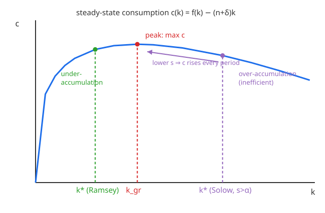

# Grad Macroeconomics · Lesson 2.4: The golden rule and dynamic efficiency

> ⏱ ~15 min · Module 2: Economic growth · Builds on: [2.3 The Ramsey–Cass–Koopmans model](02-03-ramsey-cass-koopmans.md) · Unlocks: [2.5 Endogenous growth: AK and ideas](02-05-endogenous-growth-ak-ideas.md)

## Why this matters

Solow told you saving sets your income *level*. That invites the obvious question: **which level do you want?** More saving means a bigger capital stock and more output forever — but you have to eat, and every unit invested is a unit not consumed. Push saving too hard and you build a gleaming capital stock that nobody enjoys. There is a saving rate that maximizes what people actually consume in the long run: the **golden rule**.

The deeper payoff is a genuine welfare verdict, rare in macro. An economy can save *too little* or *too much*, and the "too much" case is special: it is **dynamically inefficient** — you could raise consumption in *every single period* just by saving less, a free lunch with no cost to anyone. This lesson gives you the exact test for that free lunch, shows that an optimizing Ramsey economy never leaves one on the table, and shows that a mechanical Solow economy (or, later, an overlapping-generations economy in [3.2](03-02-dynamic-inefficiency.md)) can.

Throughout, I set technology growth $g=0$ to keep the marginal-product algebra clean; the general formulas (which just replace $n+\delta$ by $n+g+\delta$) are flagged where they matter.

## The idea

Steady-state consumption per capita is output minus whatever investment it takes to keep capital per worker from falling:

$$c(k) = f(k) - (n+\delta)k.$$

*In words:* in a steady state $\dot k = 0$, so investment exactly equals break-even $(n+\delta)k$ — new workers must be equipped ($n$) and worn machines replaced ($\delta$) — and everything left over, $f(k)-(n+\delta)k$, is eaten.

Now vary $k$. Start low: capital is scarce, its marginal product $f'(k)$ is huge, and one more unit of $k$ adds far more output than the $(n+\delta)$ it costs to maintain — consumption rises. Keep going and diminishing returns shrink $f'(k)$ until the extra output from one more unit of capital *just equals* its maintenance cost. Past that point every added unit of capital costs more to feed than it produces, and consumption *falls*. So $c(k)$ is a **hump**: it rises, peaks, and declines. The peak is the golden rule.

That is a statement about *steady states in isolation* — "if you could pick any $k$ to live at forever, which is best?" It ignores the pain of the journey. The Ramsey household does not ignore that pain: reaching a higher $k$ means sacrificing consumption *now*, and an impatient household ($\rho > 0$) values now more than later. So the household stops short of the golden-rule peak. That deliberate stopping-short is the **modified golden rule**, and it is not a mistake — it is the correct answer to a richer question.

## The formal version

**Golden-rule capital.** Maximize $c(k)=f(k)-(n+\delta)k$ over $k$. First-order condition:

$$\boxed{\,f'(k_{gr}) = n + \delta\,.}$$

*In words:* hold capital at the level where its marginal product equals the effective maintenance rate. Since $f$ is strictly concave, this is the unique maximum. Equivalently, the **net** marginal product of capital — the real interest rate $r \equiv f'(k)-\delta$ — equals the growth rate: $r_{gr} = n$. (With technology growth: $f'(k_{gr}) = n+g+\delta$, i.e. $r_{gr}=n+g$.)

**Modified golden rule (the Ramsey steady state).** The Keynes–Ramsey rule from [2.3](02-03-ramsey-cass-koopmans.md) says consumption growth is $\dot c / c = \tfrac{1}{\theta}\big[f'(k)-\delta-\rho\big]$, where $\rho>0$ is the pure rate of time preference (impatience) and $\theta>0$ the inverse intertemporal elasticity. In steady state $\dot c = 0$, forcing

$$\boxed{\,f'(k^*) = \rho + \delta\,.}$$

*In words:* the optimizing economy parks capital where its net marginal product equals the discount rate, $r^* = f'(k^*)-\delta = \rho$. (With technology growth: $f'(k^*)=\rho+\theta g+\delta$.)

**Why $k^* < k_{gr}$.** A well-posed Ramsey problem requires $\rho > n$ — otherwise lifetime utility diverges and the transversality condition fails (you'd want to accumulate forever). Given $\rho > n$:

$$f'(k^*) = \rho+\delta \;>\; n+\delta = f'(k_{gr}) \quad\Longrightarrow\quad k^* < k_{gr},$$

because $f'$ is *decreasing* — a higher required marginal product means a smaller capital stock. **The optimizing economy deliberately holds less capital than the golden rule.** It could reach the peak of the consumption hump but chooses not to: the extra steady-state consumption isn't worth the up-front sacrifice to an impatient society. This is **efficient under-accumulation**.

**Dynamic efficiency.** An economy is **dynamically inefficient** when it sits *past* the golden rule, $k > k_{gr}$, equivalently

$$r < n \qquad(\text{with technology growth: } r < n+g).$$

*In words:* if the return on capital is below the economy's growth rate, capital is being over-fed. There is then a feasible path that raises consumption at *every* date (proof in the worked examples and P3) — a Pareto improvement, so the original path was not efficient. The test is a single inequality: **compare the interest rate to the growth rate.**

- **Ramsey always passes:** $r^* = \rho > n$. An optimizing economy is never dynamically inefficient — impatience alone rules it out.
- **Solow can fail:** with an *assumed* saving rate $s$, nothing stops $s$ from being so high that $k^* > k_{gr}$ and $r<n$.
- **OLG can fail:** overlapping generations save for retirement without a planner tying the ends together, and can over-accumulate even with optimizing agents — the subject of [3.2](03-02-dynamic-inefficiency.md).

## Picture

The hump is steady-state consumption $c(k)=f(k)-(n+\delta)k$. It peaks at the golden-rule stock $k_{gr}$. The Ramsey optimum $k^*$ sits to the **left** (under-accumulation — efficient, chosen for impatience). A high-saving Solow economy can sit to the **right** at $k^*_{\text{Solow}}$ (over-accumulation — inefficient): slide it back down the hump by saving less and consumption *rises in every period*.

## Worked examples

Use Cobb–Douglas $f(k)=k^{\alpha}$, so $f'(k)=\alpha k^{\alpha-1}$. Two closed forms drive everything:

$$k_{gr} = \left(\frac{\alpha}{n+\delta}\right)^{\frac{1}{1-\alpha}}, \qquad k^* = \left(\frac{\alpha}{\rho+\delta}\right)^{\frac{1}{1-\alpha}}.$$

**Example 1 (Ramsey stops short of the golden rule — by the numbers).** Take $\alpha=\tfrac13$, $n=0.02$, $\delta=0.05$, $\rho=0.05$. Then $\rho=0.05>n=0.02$ ✓ (well-posed). Exponent $\tfrac{1}{1-\alpha}=\tfrac32$.

$$k_{gr}=\left(\frac{1/3}{0.07}\right)^{3/2}=(4.762)^{3/2}\approx 10.39,\qquad k^*=\left(\frac{1/3}{0.10}\right)^{3/2}=(3.333)^{3/2}\approx 6.09.$$

Indeed $k^*=6.09 < k_{gr}=10.39$. Now the consumption each delivers, $c=k^{1/3}-0.07\,k$:

$$c_{gr}=10.39^{1/3}-0.07(10.39)=2.182-0.727=1.455,\qquad c^*=6.09^{1/3}-0.07(6.09)=1.826-0.426=1.400.$$

The Ramsey economy consumes **1.400 in steady state, less than the golden-rule maximum 1.455** — and that is optimal. It refuses to grind through the extra saving needed to climb from $k^*=6.09$ to $k_{gr}=10.39$, because that transition sacrifice, discounted at $\rho$, outweighs a permanent gain of only $0.055$ per period. Impatience prices the journey, and the journey isn't worth it.

**Example 2 (a Solow economy that over-saves — a genuine free lunch).** Same technology and demographics ($\alpha=\tfrac13$, $n=0.02$, $\delta=0.05$), but now an *assumed* Solow saving rate $s=0.5$. The Solow steady state is $k^*=\left(\frac{s}{n+\delta}\right)^{3/2}$:

$$k^*_{\text{Solow}}=\left(\frac{0.5}{0.07}\right)^{3/2}=(7.143)^{3/2}\approx 19.09 \;>\; k_{gr}=10.39.$$

Over-accumulated. Check the interest rate. For Cobb–Douglas at a Solow steady state, $f'(k^*)=\alpha k^{*\,\alpha-1}=\alpha\cdot\frac{n+\delta}{s}$, so

$$r = f'(k^*)-\delta = \frac{\alpha(n+\delta)}{s}-\delta = \frac{(1/3)(0.07)}{0.5}-0.05 = 0.0467-0.05 = -0.003.$$

So $r=-0.3\%$, which is below $n=2\%$ (in fact below zero): **dynamically inefficient**. Steady-state consumption here is $c^*=(1-s)\,y^*=0.5\times 19.09^{1/3}=0.5\times2.672=1.336$. Compare with the golden rule's $c_{gr}=1.455$. Now lower the saving rate to $s_{gr}=\alpha=\tfrac13$ (derived in P1): the economy drifts down to $k_{gr}$ and settles at $c_{gr}=1.455>1.336$. And during the descent you are *dis*investing — consuming the excess capital — so consumption is higher *the whole way down*, not just at the end. Consumption rises at every date and falls at none: a strict Pareto improvement. That is exactly what "dynamically inefficient" means, and why over-accumulation is a real error while Ramsey's under-accumulation is not.

## Watch out

- **Golden rule ≠ modified golden rule.** The golden rule maximizes *steady-state consumption in isolation* ($f'=n+\delta$), a beauty contest among resting points. The modified golden rule ($f'=\rho+\delta$) is the *impatient optimum* that also prices the transition. Society optimally chooses the latter, so $k^* < k_{gr}$ is the correct answer, not a shortfall to be fixed.
- **Under-accumulation is efficient; over-accumulation is not.** Both sit off the peak, but only $k>k_{gr}$ ($r<n$) admits a free lunch. At $k^*<k_{gr}$ you *could* raise steady-state consumption, but only by cutting consumption today — a real trade-off, not a Pareto improvement. Don't call the Ramsey economy "inefficient" for holding less than $k_{gr}$.
- **The test is $r$ vs. the growth rate, not $r$ vs. 0.** A positive real interest rate can still be dynamically inefficient if it's below $n+g$. With technology growth the threshold is $n+g$, not $n$ — compare the return to the *whole* economy's growth rate.
- **This is a knife's edge only for Solow/OLG.** Ramsey is immune: $r^*=\rho>n$ is baked in by the well-posedness condition. If a model *ever* shows $r<n$ in steady state, it is not a Ramsey planner's economy — something (a fixed $s$, missing bequests, generational disconnection) has broken the link between preferences and accumulation.

## One-liner

> The golden rule maximizes steady-state consumption ($f'=n+\delta$); an impatient optimizer stops short of it ($f'=\rho+\delta>n+\delta$, so $k^*<k_{gr}$) — and only the *other* side, over-accumulation with $r<n$, is a genuine free lunch.

## Problems

**P1 (🟢)** For Cobb–Douglas $f(k)=k^\alpha$, show that the **golden-rule saving rate** — the constant Solow $s$ whose steady state lands exactly at $k_{gr}$ — is $s_{gr}=\alpha$. Then, using $\alpha=\tfrac13$, $n=0.02$, $\delta=0.05$, give the numerical $k_{gr}$.

**P2 (🟡)** With $\alpha=\tfrac13$, $\delta=0.05$, $n=0.02$, a Ramsey economy has $\rho=0.04$. Compute $k^*$ and confirm $k^*<k_{gr}$ (use $k_{gr}$ from P1). In two or three sentences, explain why impatience makes $k^*<k_{gr}$ *optimal* rather than a failure to reach the best steady state — what would $k^*$ equal in the limit $\rho\to n^+$?

**P3 (🔴)** Consider a Solow economy with $f(k)=k^\alpha$ and constant saving rate $s$.
(a) Show it is dynamically inefficient — i.e. $k^*>k_{gr}$ — **iff** $s>\alpha$, and show this is equivalent to $r<n$ where $r=f'(k^*)-\delta$.
(b) Suppose $s>\alpha$. Construct an explicit feasible consumption path that Pareto-dominates the steady-state path (consumption at least as high at every date, strictly higher somewhere), proving the inefficiency is a real free lunch.

Solutions

**P1** A Solow steady state satisfies $s f(k^*)=(n+\delta)k^*$, i.e. the saving rate needed to *rest* at a given $k$ is $s(k)=\frac{(n+\delta)k}{f(k)}=(n+\delta)\,k^{1-\alpha}$ (using $f(k)=k^\alpha$). Evaluate at the golden-rule stock $k_{gr}=\left(\frac{\alpha}{n+\delta}\right)^{1/(1-\alpha)}$, for which $k_{gr}^{\,1-\alpha}=\frac{\alpha}{n+\delta}$:

$$s_{gr}=(n+\delta)\,k_{gr}^{\,1-\alpha}=(n+\delta)\cdot\frac{\alpha}{n+\delta}=\alpha.$$

So the golden-rule saving rate equals capital's income share, $s_{gr}=\alpha$ — a clean and famous result. Numerically, with $\alpha=\tfrac13$, $n+\delta=0.07$:

$$k_{gr}=\left(\frac{1/3}{0.07}\right)^{3/2}=(4.762)^{3/2}\approx 10.39.$$

**P2** $k^*=\left(\frac{\alpha}{\rho+\delta}\right)^{1/(1-\alpha)}=\left(\frac{1/3}{0.09}\right)^{3/2}=(3.704)^{3/2}$. Compute: $\sqrt{3.704}=1.9245$, so $k^*=3.704\times1.9245\approx 7.13$. Since $7.13<10.39=k_{gr}$, we have $k^*<k_{gr}$ ✓. (Lowering $\rho$ from $0.05$ toward $n$ pushed $k^*$ up from $6.09$ toward $k_{gr}$, as expected.)

*Why it's optimal, not a shortfall:* reaching $k_{gr}$ from any lower start requires extra saving now, i.e. lower consumption today, in exchange for higher consumption in the distant steady state. An impatient household ($\rho>0$) discounts that future gain, and at the modified-golden-rule stock the marginal future gain from one more unit of capital ($f'(k^*)-\delta=\rho$) exactly balances the marginal impatience cost of deferring consumption. It is a genuine trade-off resolved optimally, not a free lunch forgone. In the limit $\rho\to n^+$, the required marginal product $f'(k^*)=\rho+\delta\to n+\delta=f'(k_{gr})$, so $k^*\to k_{gr}$: a *perfectly patient* society (down to the growth-rate floor) would choose exactly the golden rule. Impatience is the entire wedge.

**P3(a)** Solow steady state: $k^*=\left(\frac{s}{n+\delta}\right)^{1/(1-\alpha)}$, and $k_{gr}=\left(\frac{\alpha}{n+\delta}\right)^{1/(1-\alpha)}$. Since $x\mapsto x^{1/(1-\alpha)}$ is increasing (as $0<\alpha<1$),

$$k^*>k_{gr}\iff \frac{s}{n+\delta}>\frac{\alpha}{n+\delta}\iff s>\alpha.$$

For the interest-rate form, at the Solow steady state $\alpha k^{*\,\alpha-1}=\alpha\cdot\frac{n+\delta}{s}$ (from $k^{*\,\alpha-1}=(s/(n+\delta))^{-1}$), so

$$r=f'(k^*)-\delta=\frac{\alpha(n+\delta)}{s}-\delta.$$

Then $r<n\iff \frac{\alpha(n+\delta)}{s}<n+\delta\iff \frac{\alpha}{s}<1\iff s>\alpha.$ The three conditions $k^*>k_{gr}$, $s>\alpha$, and $r<n$ are identical. ∎

**P3(b)** Suppose $s>\alpha$, so $k^*>k_{gr}$ and the steady-state consumption is $c^*=f(k^*)-(n+\delta)k^*$. Consider this alternative policy: at date $0$, instantaneously reduce capital from $k^*$ to $k_{gr}$ by consuming the difference (a one-time consumption *bonus* of $k^*-k_{gr}>0$ per capita, since disinvesting frees resources), then from date $0^+$ onward hold capital fixed at $k_{gr}$ by investing exactly break-even $(n+\delta)k_{gr}$ each period.

- At date $0$: consumption is the steady-state flow *plus* the bonus stock $k^*-k_{gr}>0$ — strictly higher.
- For all $t>0$: consumption is $c(k_{gr})=f(k_{gr})-(n+\delta)k_{gr}=c_{gr}$. Because $c(k)$ is strictly decreasing for $k>k_{gr}$ and $k^*>k_{gr}$, we have $c_{gr}=c(k_{gr})>c(k^*)=c^*$ — strictly higher than the original path at every date.

So the new path delivers strictly more consumption at *every* $t\ge 0$ (strictly higher everywhere, in fact), using only feasible resources. It Pareto-dominates the original steady state. The over-accumulating economy was throwing away consumption to maintain capital whose marginal product ($r=f'(k^*)-\delta<n$) didn't even cover its growth-adjusted upkeep. That is the free lunch, made explicit. ∎

(A gentler variant avoids the jump: cut $s$ smoothly to $s_{gr}=\alpha$; capital glides down from $k^*$ to $k_{gr}$, and because you're disinvesting the whole way, consumption exceeds $c^*$ at every instant of the transition and lands at $c_{gr}>c^*$. Same conclusion, continuous path.)

## Flashback

**From [2.1 The Solow model](02-01-solow-model.md):** An economy has $\alpha=\tfrac13$, $s=0.28$, $n=0.02$, $g=0$, $\delta=0.05$. Find its steady-state capital per worker $k^*$, and determine whether it is dynamically *efficient* or *inefficient* — both by comparing $k^*$ to the golden-rule stock and by comparing $r$ to $n$. They must agree.

Solution

Break-even rate $n+\delta=0.07$, exponent $\tfrac{1}{1-\alpha}=\tfrac32$:

$$k^*=\left(\frac{0.28}{0.07}\right)^{3/2}=4^{3/2}=8.$$

Golden-rule stock (same $n,\delta,\alpha$): $k_{gr}=\left(\frac{1/3}{0.07}\right)^{3/2}\approx 10.39$. Since $k^*=8<10.39=k_{gr}$, the economy is **under-accumulating → dynamically efficient**.

Cross-check with the interest rate: $r=f'(k^*)-\delta=\alpha\cdot\frac{n+\delta}{s}-\delta=\frac{(1/3)(0.07)}{0.28}-0.05=0.0833-0.05=0.0333$. Since $r=3.33\%>n=2\%$, efficient — the two tests agree. Equivalently, $s=0.28<\alpha=0.333=s_{gr}$, the same verdict a third way. This economy saves a bit *below* the golden rule; it could raise steady-state consumption by saving more, but only at the cost of consumption today — a real trade-off, no free lunch.

## Connections

- **Backward:** This closes the question [2.1](02-01-solow-model.md) left open — *which* $s$ is best? — and completes the Ramsey story of [2.3](02-03-ramsey-cass-koopmans.md): the modified golden rule $f'(k^*)=\rho+\delta$ is precisely why the optimizing economy under-accumulates relative to $k_{gr}$, finishing the Solow-vs-Ramsey comparison at the heart of Module 2's boss problem. Solow's saving-curve/break-even diagram from [2.1](02-01-solow-model.md) is the same $k$-axis this consumption hump lives on.
- **Forward:** [3.2](03-02-dynamic-inefficiency.md) shows overlapping-generations economies can over-accumulate ($r<n$) *even with fully optimizing agents*, because no planner links the generations — dynamic inefficiency without a fixed saving rate, using exactly this $r$ vs. $n$ test. [3.3](03-03-money-rational-bubbles.md) exploits the same condition: when $r<n$, an intrinsically worthless asset (fiat money, a rational bubble) can have positive value and even improve welfare by soaking up the over-accumulated saving. [2.5](02-05-endogenous-growth-ak-ideas.md) removes diminishing returns entirely, changing what "golden rule" can even mean when $f'$ no longer falls to $n+\delta$.
- **Sideways (micro):** the golden rule is a steady-state efficiency notion, and the $r<n$ free-lunch is a violation of intertemporal Pareto efficiency — the dynamic-economy cousin of the static allocative efficiency and the intertemporal consumer optimum studied in [`grad-micro`](../../grad-micro/syllabus.md). The modified golden rule $r^*=\rho$ is just the household's Euler equation evaluated at rest: the interest rate equals the rate of time preference.
