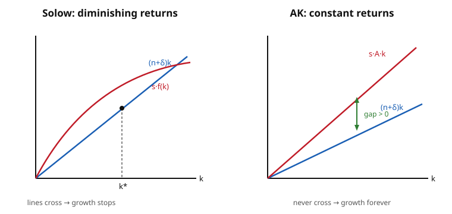

# Grad Macroeconomics · Lesson 2.5: Endogenous growth — AK and ideas

> ⏱ ~15 min · Module 2: Economic growth · Builds on: [2.4 The golden rule and dynamic efficiency](02-04-golden-rule-dynamic-efficiency.md) · Unlocks: [2.6 Growth accounting](02-06-growth-accounting.md)

## Why this matters

Solow and Ramsey both surrender at the same wall: in the long run, per-capita growth equals the *exogenous* technology rate $g$ — a number handed to the model from outside, unexplained. Everything a government might actually do — subsidize saving, fund research, protect patents — moves only the *level* of the balanced growth path, never its slope. That is a deeply unsatisfying answer to the biggest question in the field: why do some economies grow at 2% forever and others stall?

Endogenous growth theory refuses the free parameter. It asks: what would it take for growth to arise *from within* the model, so that policy and preferences pin down the long-run growth *rate* itself? The answer turns out to hinge on a single force we have taken for granted — **diminishing returns** — and on one strange property of ideas that no other economic good shares.

## The idea

Recall exactly *why* Solow growth stops. Capital per worker $k$ accumulates via $\dot k = s f(k) - (n+\delta)k$. Saving builds capital (the $sf(k)$ term); depreciation and a growing population dilute it (the $(n+\delta)k$ term). Because $f$ has **diminishing returns** ($f'' < 0$), each new machine adds less output than the last, so $sf(k)$ bends over and eventually the two forces balance at a finite $k^*$. Growth halts not because we run out of desire to save, but because the *reward* to saving runs down.

Now perform one surgical change: **remove the diminishing returns.** Suppose the marginal product of capital is a constant $A$ — output is simply $Y = AK$, a straight line, not a bending curve. Then $sAk$ is a ray from the origin, and if it starts out steeper than the $(n+\delta)k$ ray, it stays steeper *forever*: the two lines never cross. There is no $k^*$. Capital, and output, grow without bound at a rate you can read off directly — and that rate depends on $s$ and $A$, quantities the economy chooses. **Saving now has a permanent growth effect, not a mere level effect.** That is the whole trick, and it is entirely geometric: kill the force that made the curve bend, and nothing stops the climb.

The obvious objection: constant returns to capital looks absurd — surely a lone worker with a thousand shovels is nearly useless? The defense is to read $K$ as **broad capital**: physical capital *plus human capital* (education, skills), plus the stock of knowledge embodied in how firms operate. When a firm invests, it also trains workers and learns by doing, and — crucially — one firm's knowledge spills over to others (Romer's insight). Measured broadly enough, the accumulable stock need not run into sharply diminishing returns. Whether $\alpha = 1$ *exactly* is a knife-edge we'll flag — but the qualitative lesson survives: the closer the economy's capital share of the accumulable factor is to one, the longer growth persists.

## The formal version

**The AK model.** Let output be linear in broad capital:

$$Y = A K, \qquad A > 0 \text{ constant}.$$

In words: no diminishing returns — the marginal product $f'(k) = A$ is the same for the millionth unit as the first. In per-capita terms $y = Ak$, and the capital accumulation equation (identical machinery to Solow — [2.1](02-01-solow-model.md)) becomes

$$\dot k = s\,A k - (n+\delta)k \quad\Longrightarrow\quad \boxed{\;\frac{\dot k}{k} = sA - (n+\delta)\;}$$

**In words:** the growth rate of capital per worker is a *constant* — it does not fall as the economy gets richer. Call it $g_k \equiv sA - (n+\delta)$. If $sA > n+\delta$ (the saving-fed force beats dilution), then $g_k > 0$ **permanently**. Output per worker grows at the same rate, $\dot y/y = \dot k/k = g_k$. There is no steady-state *level* $k^*$; the "steady state" is a constant growth rate.

The contrast with Solow is stark. In Solow, $\partial g / \partial s = 0$ in the long run (saving is level-only). Here,

$$\frac{\partial g_k}{\partial s} = A > 0,$$

a permanent growth effect. Policies that raise $s$ or $A$ — investment subsidies, better institutions, R&D that lifts total factor productivity — raise the growth rate for good.

**Ideas and R&D (Romer sketch).** AK gets sustained growth by assumption ($f' = A$ constant). Romer's idea-based model *earns* it, from the peculiar economics of knowledge. An **idea** — a blueprint, a formula, a design — is **nonrival**: your using it does not diminish my ability to use the same idea simultaneously. A hammer is rival (one user at a time); the Pythagorean theorem is not (everyone, at once, forever). Split the economy into a goods sector and a research sector. Let $A$ now be the *stock of ideas* (designs), evolving as

$$\dot A = \delta_R\, L_A\, A^{\phi},$$

where $L_A$ is labor devoted to research, $\delta_R > 0$ is research productivity, and $\phi$ governs how the existing stock of knowledge helps produce new knowledge ("standing on shoulders"). **In words:** new designs per unit time rise with how many researchers you deploy and with the knowledge already accumulated. Dividing by $A$:

$$\frac{\dot A}{A} = \delta_R\, L_A\, A^{\phi - 1}.$$

Growth is *sustained by devoting labor to research.* The parameter $\phi$ is a knife-edge. If $\phi = 1$, growth is proportional to $L_A$ — the pure "AK-in-ideas" case, but with a troubling **scale effect**: a bigger research workforce means a permanently higher growth rate (counterfactually, so post-1990 "semi-endogenous" models set $\phi < 1$, making long-run growth depend on *population growth* instead). If $\phi < 1$, diminishing returns to the knowledge stock reappear and growth is not self-sustaining without population growth; if $\phi > 1$, knowledge explodes to infinity in finite time. The interesting economics lives right at the edge.

**The nonrivalry → increasing returns → monopoly chain.** This is the deepest payoff. Produce output with rival inputs (capital $K$, labor $L$) *and* the nonrival stock $A$: $Y = A\,F(K,L)$ with $F$ constant returns to scale in $(K,L)$. Because $A$ is nonrival, you do not need to replicate it to replicate the economy: to double output, double $K$ and $L$ (that doubles $F$) while the *same* $A$ serves both copies. So output is CRS in the rival factors *alone*, which means it exhibits **increasing returns to scale in all three factors together** ($K, L, A$). Increasing returns is incompatible with perfect competition paying every factor its marginal product — by Euler's theorem the rival factors already exhaust output, leaving nothing to compensate the fixed cost of inventing $A$. Someone must fund that R&D, so idea-based economies require **monopoly power** (patents, markups) to reward innovators. That is precisely why the New Keynesian models of Module 4 are built on **monopolistic competition** rather than perfect competition — hold that thread for [4.4](04-04-nominal-rigidities-new-keynesian.md).

**Three engines of growth, contrasted.**

| Model | Source of long-run growth | Does $s$ affect long-run $g$? |
|---|---|---|
| Solow ([2.1](02-01-solow-model.md)) | exogenous $g$ (handed in) | No — level effect only |
| AK | no diminishing returns to broad $K$ | Yes — $g = sA-(n+\delta)$ |
| Ideas (Romer) | nonrival ideas → R&D labor | Yes — via $L_A$, $\delta_R$ |

## Picture

The entire theory is in the two diagrams. Solow's saving curve bends down and *catches* the depreciation line at $k^*$ — the meeting point is where growth dies. Straighten the saving curve into the ray $sAk$ and, so long as it launches above $(n+\delta)k$, the gap between them stays positive forever: capital never stops accumulating.

## Worked examples

**Example 1 (AK — derive the perpetual growth rate and the absent steady state).** An economy has $Y = AK$ with $A = 0.20$, saving rate $s = 0.25$, population growth $n = 0.01$, depreciation $\delta = 0.05$. Per-capita capital obeys $\dot k = sAk - (n+\delta)k$, so

$$\frac{\dot k}{k} = sA - (n+\delta) = (0.25)(0.20) - (0.01 + 0.05) = 0.05 - 0.06 = -0.01.$$

Here $sA < n+\delta$, so capital per worker *shrinks* at 1% — the ray $sAk$ starts *below* $(n+\delta)k$. Now raise saving to $s = 0.40$:

$$\frac{\dot k}{k} = (0.40)(0.20) - 0.06 = 0.08 - 0.06 = 0.02.$$

A permanent **+2% per year** growth rate. Why is there no steady-state level $k^*$? A steady state needs $\dot k = 0$ at some $k > 0$, i.e. $sAk = (n+\delta)k$, i.e. $sA = n+\delta$. Since $sA$ and $n+\delta$ are both constants, either they are equal (then *every* $k$ is a steady state — a degenerate knife-edge) or they differ (then $\dot k$ has the same sign at every $k$ and the lines never meet). Generically the $sAk$ and $(n+\delta)k$ rays only intersect at the origin. Growth never self-arrests — the diminishing-returns brake has been removed.

**Example 2 (ideas — R&D-driven growth and the nonrivalry argument).** Take the knife-edge case $\phi = 1$, so $\dot A = \delta_R L_A A$ and

$$\frac{\dot A}{A} = \delta_R\, L_A.$$

With research productivity $\delta_R = 0.0005$ and $L_A = 40$ (thousand) researchers, technology grows at $g_A = (0.0005)(40) = 0.02$, i.e. 2% per year — *chosen* by how much labor the society allocates to research. Double the research workforce and you double the growth rate (the scale effect that motivates $\phi<1$ corrections).

Now the nonrivalry argument made concrete. Output uses the design stock and rival factors: $Y = A K^{\alpha} L^{1-\alpha}$, with $\alpha + (1-\alpha) = 1$, so $F = K^\alpha L^{1-\alpha}$ is CRS in $(K,L)$. Replicate the whole economy — build an identical second country with its own $K$ and $L$ but *sharing the same blueprints $A$* (legal, because ideas are nonrival). Output doubles while $A$ is used twice over at no extra cost. So doubling $(K,L)$ doubles $Y$ **without** needing to double $A$ — output is CRS in $(K,L)$ and therefore has *increasing* returns in $(K, L, A)$ jointly. By Euler's theorem, paying $K$ and $L$ their marginal products $\big(K\cdot MP_K + L\cdot MP_L = Y\big)$ already uses up all of $Y$; there is nothing left to pay for the fixed cost of having invented $A$. Under perfect competition (price = marginal cost, and the marginal cost of *copying* an existing idea is zero), inventors earn zero and no one invents. The fix is market power — patents let the innovator charge above marginal cost and recoup the R&D outlay. Nonrivalry is thus the taproot of the monopolistic competition that Module 4 will assume.

## Watch out

- **AK is a knife-edge, and that's the honest weak spot.** The result needs the capital exponent to be *exactly* 1. If $Y = AK^{\alpha}$ with $\alpha = 0.99$, diminishing returns are merely faint, not absent, and the economy *does* eventually reach a (very high) $k^*$ — growth stops, just later. Endogenous growth is not "diminishing returns are approximately gone"; it is "the accumulable factor has *exactly* constant returns," which is why the human-capital / spillover justifications matter so much. Don't oversell AK as robust.
- **Level effect vs. growth effect — don't conflate them.** In Solow a higher $s$ shifts the whole path up but leaves its slope $g$ untouched (a one-time level gain). In AK a higher $s$ tilts the slope itself. On a log-scale plot: Solow gives a parallel upward shift, AK gives a permanent *rotation*. A policy evaluation that assumes AK when the world is Solow will wildly overstate the long-run payoff.
- **Nonrivalry is not the same as excludability.** Nonrival = many can use it at once (a property of the good). Excludable = you can legally stop others from using it (a property of the institution). Ideas are inherently nonrival; patents make them *artificially excludable* so innovators can profit. Confusing the two hides why the policy problem exists: society wants ideas spread (nonrival → marginal cost zero → give it away) but wants them invented (needs reward → restrict use). That tension is the whole economics of innovation.
- **The scale effect is empirically false as stated.** Pure $\phi=1$ ideas models predict that a larger research population should mean faster growth — yet growth rates have been roughly flat while researcher counts exploded. This is *why* modern "semi-endogenous" growth (Jones) takes $\phi < 1$, tying long-run growth to population growth. If you cite Romer, know this caveat.

## One-liner

> Growth becomes endogenous the moment diminishing returns to the accumulable factor vanish — AK does it by fiat ($f'=A$), ideas do it because nonrivalry makes knowledge a factor you never have to replicate — and either way $s$ moves the growth *rate*, not just the level.

## Problems

**P1 (🟢)** An AK economy has $A = 0.30$, $s = 0.24$, $n = 0.02$, $\delta = 0.04$. (a) Compute the long-run growth rate of output per worker. (b) A Solow economy with the *same* parameters but a standard concave $f$ eventually reaches its steady state; what is *its* long-run growth rate of output per worker (absent exogenous technical progress)? State the one-sentence reason the two answers differ.

**P2 (🟡)** In the AK model, show algebraically that a permanent rise in the saving rate produces a permanent rise in the growth rate — a *growth effect*, not a level effect. Specifically: (a) write $g(s) = sA - (n+\delta)$ and compute $dg/ds$; (b) contrast this with the Solow claim that $dg/ds = 0$ in the long run, and explain in one or two sentences *which structural feature* of AK is responsible.

**P3 (🔴)** Explain, via nonrivalry, why idea-based growth entails increasing returns to scale and therefore cannot be decentralized under perfect competition. Your answer must: (a) define nonrivalry and state why it lets output be replicated by doubling only the rival factors; (b) conclude increasing returns in $(K, L, A)$ jointly; (c) invoke **Euler's theorem** to show that competitive factor payments to $K$ and $L$ already exhaust output, leaving the fixed cost of $A$ unfunded (the factor-payment exhaustion problem); (d) name the institutional fix.

Solutions

**P1.** (a) $g_y = \dot k/k = sA - (n+\delta) = (0.24)(0.30) - (0.02 + 0.04) = 0.072 - 0.06 = 0.012$, i.e. **1.2% per year**, permanently.

(b) In Solow with a concave $f$ and no exogenous technical progress, per-capita output growth in the long run is **zero** — the economy converges to a finite $k^*$ where $sf(k^*) = (n+\delta)k^*$ and stays there. The reason they differ: **diminishing returns.** Solow's $f'(k) \to$ small as $k$ grows, so the saving curve bends down and meets the depreciation line at $k^*$; AK's $f'(k) = A$ is constant, the saving ray never bends, so it never catches the depreciation ray and accumulation never stops.

**P2.** (a) With $g(s) = sA - (n+\delta)$, treating $A, n, \delta$ as fixed,
$$\frac{dg}{ds} = A > 0.$$
A one-time permanent increase $\Delta s$ raises the growth rate permanently by $A\,\Delta s$ — the slope of the log-output path changes for good.

(b) In Solow the long-run growth rate is $g = 0$ (or the exogenous $g$) *regardless of $s$*, so $dg/ds = 0$; saving only relocates the steady-state *level* $k^*$ (higher $s$ → higher $k^*$, a one-time upward shift of the path). The structural feature responsible is the **absence of diminishing returns**: because $f'(k)=A$ is constant rather than declining, extra saving keeps buying the *same* return $A$ at every level of $k$, so its effect compounds into the growth rate instead of dissipating into a higher plateau. (Geometrically: raising $s$ tilts the $sAk$ ray upward — steeper slope forever — rather than sliding a fixed intersection point.)

**P3.** (a) **Nonrivalry:** a good is nonrival if one agent's use does not reduce the quantity available for others to use *simultaneously* — the same design (a formula, a line of code) can be deployed in unlimited places at once. Because the nonrival stock $A$ need not be *replicated* to serve a second, identical copy of the economy, you can double total output by doubling only the *rival* inputs ($K$ and $L$) while the single existing $A$ serves both copies at no additional cost.

(b) Write $Y = A\,F(K,L)$ with $F$ constant returns to scale in the rival factors: $F(2K, 2L) = 2F(K,L)$. Then $A\,F(2K,2L) = 2\,Y$ — output doubles from doubling $(K,L)$ *alone*, holding $A$ fixed. Considering all three inputs together, doubling $(K, L, A)$ would *more* than double output: $A\cdot 2 \cdot F(2K,2L) = 4Y$. Hence production exhibits **increasing returns to scale in $(K, L, A)$ jointly**.

(c) **Euler's theorem** states that for a function homogeneous of degree one in $(K,L)$,
$$K\,\frac{\partial Y}{\partial K} + L\,\frac{\partial Y}{\partial L} = Y.$$
Since $Y = A\,F(K,L)$ is degree-one (CRS) in the *rival* factors, paying $K$ and $L$ their competitive marginal products exhausts *all* of output: $K\cdot MP_K + L\cdot MP_L = Y$, leaving a residual of exactly **zero** to compensate whoever bore the fixed cost of inventing $A$. Under perfect competition, price equals marginal cost, and the marginal cost of *using* an already-existing nonrival idea is zero — so the innovator's revenue from the idea is zero and no rational agent pays the up-front R&D cost. This is the **factor-payment exhaustion problem**: competitive marginal-product pricing has no money left over for the increasing-returns "fixed cost" that is $A$.

(d) The institutional fix is **market power / intellectual property** — patents, copyrights, trade secrets — which make the nonrival idea *artificially excludable* and let its owner charge a price above (zero) marginal cost. The resulting monopoly rents fund the R&D. This is exactly why endogenous-growth and New Keynesian models are built on **monopolistic competition** rather than perfect competition (see [4.4](04-04-nominal-rigidities-new-keynesian.md)): once fixed costs of creating varieties/ideas exist, some markup is unavoidable.

## Flashback

**From Lesson 2.4 (The golden rule):** In the Solow model with $Y = K^{\alpha}L^{1-\alpha}$, the **golden-rule** capital stock maximizes steady-state consumption per worker and is characterized by $f'(k_{gold}) = n + \delta$. Take $\alpha = 1/3$, $n = 0.02$, $\delta = 0.08$. Find the golden-rule saving rate $s_{gold}$, and state in one sentence how this notion is *lost* once we move to the AK model.

Solution

With $f(k) = k^{\alpha}$, the golden-rule condition is $f'(k_{gold}) = \alpha k_{gold}^{\alpha-1} = n+\delta$. Solving,
$$k_{gold} = \left(\frac{\alpha}{n+\delta}\right)^{\frac{1}{1-\alpha}} = \left(\frac{1/3}{0.10}\right)^{\frac{1}{2/3}} = \left(\tfrac{10}{3}\right)^{1.5} \approx 6.086.$$
At any steady state, saving equals investment equals dilution: $s f(k^*) = (n+\delta)k^*$, so $s = (n+\delta)k^*/f(k^*) = (n+\delta)k^{1-\alpha}/1$. But there is a cleaner route: for Cobb–Douglas the golden-rule saving rate equals the capital share, $s_{gold} = \alpha = \boxed{1/3}$. (Check: at the golden rule $f'(k) = \alpha k^{\alpha-1} = n+\delta$; multiplying the steady-state relation $sk^{\alpha} = (n+\delta)k$ gives $s = (n+\delta)k^{1-\alpha} = \alpha k^{\alpha-1}\cdot k^{1-\alpha} = \alpha$.) So $s_{gold} = 1/3 \approx 33\%$.

How AK loses this: the golden rule is a statement about the best *level* $k^*$ that maximizes steady-state consumption — but **AK has no steady-state level** (the $sAk$ and $(n+\delta)k$ lines never cross), so "the $k$ that maximizes consumption per worker" is not well-defined. In AK, raising $s$ trades current consumption for a permanently higher *growth rate*, a genuine intertemporal trade-off with no static consumption-maximizing target — the golden-rule concept simply doesn't apply.

## Connections

- **Backward:** the whole lesson is [2.1](02-01-solow-model.md)/[2.2](02-02-convergence-solow-diagram.md) run in reverse — Solow's *diminishing returns* ($f''<0$) is precisely the force endogenous growth deletes. The Solow diagram's crossing point $k^*$ is the thing AK's straight lines refuse to produce. And [2.4](02-04-golden-rule-dynamic-efficiency.md)'s golden rule evaporates without a steady-state level (see Flashback).
- **Forward:** nonrivalry → increasing returns → monopoly is the economic bedrock of **monopolistic competition** in the New Keynesian model, [4.4](04-04-nominal-rigidities-new-keynesian.md) — markups aren't a friction bolted on, they're the only way to fund the fixed costs of creating varieties/ideas. And [2.6](02-06-growth-accounting.md) shows how to *measure* the $A$ that this lesson made the engine of growth (the Solow residual).
- **Sideways (micro):** the increasing-returns / natural-monopoly / marginal-cost-pricing tension is core industrial organization — see [`grad-micro`](../../grad-micro/syllabus.md) on increasing returns and monopoly pricing. The "invention has a fixed cost, copying is free" structure is the canonical public-good / non-excludability problem.
- **Sideways (innovation economics, plain language):** this is why patents exist and why they're controversial — a patent deliberately creates temporary monopoly (bad for spreading a nonrival idea, whose ideal price is zero) in order to reward the person who paid to create it (good for having ideas at all). Every debate about drug pricing, open-source software, and copyright length is a fight over exactly this trade-off.
