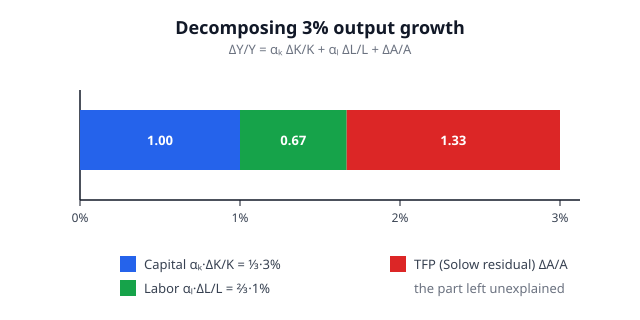

# Grad Macroeconomics · Lesson 2.6: Growth accounting

> ⏱ ~15 min · Module 2: Economic growth · Builds on: [2.5 Endogenous growth: AK and ideas](02-05-endogenous-growth-ak-ideas.md) · Unlocks: Module 3 — [3.1 The OLG model](03-01-olg-model.md)

## Why this matters

The whole of Module 2 hangs on one abstract quantity: technology, $A$. Solow says long-run growth *is* the growth rate of $A$; the AK and ideas models of [2.5](02-05-endogenous-growth-ak-ideas.md) try to explain where $A$ comes from. But $A$ is invisible — no statistics office measures "technology." So how do we ever confront the theory with data?

**Growth accounting** is the bridge. It takes observed growth in output, capital, and labor — all measurable — and backs out the piece of output growth that measured inputs *cannot* explain. That leftover is our empirical stand-in for $\Delta A/A$. The bracing empirical verdict, running from Solow's 1957 paper to modern development accounting, is that this residual — not capital, not labor — accounts for **most** of long-run growth and **most** of the gulf between rich and poor countries. This lesson is where the theory becomes a number you can compute, and it's the direct on-ramp to production-function estimation in `](../../econometrics/syllabus.md)`.

## The idea

Output comes from combining inputs with a recipe: $Y = A\,F(K,L)$, where $F$ is the production function, $K$ is capital, $L$ is labor, and $A$ is the recipe's overall efficiency — **total factor productivity (TFP)**. Growth in $Y$ can only come from three places: you got more machines ($K$ rose), more workers ($L$ rose), or you got better at turning any given machines-and-workers into output ($A$ rose).

The accounting trick is to weight each input's growth by **how much that input matters at the margin** — and under competition, that weight is simply the input's share of national income. Add up the input contributions, subtract from total output growth, and whatever is left over is TFP growth. It's a pure bookkeeping identity, not a theory: it *attributes* growth without explaining why any input grew.

That leftover has a famous nickname — the **Solow residual** — and an even more famous gloss: it is "a measure of our ignorance." Everything you failed to measure (better technology, yes, but also rising skill, better management, reallocation to more productive firms, and every measurement error) piles into it. Interpreting the residual honestly is half the skill.

## The formal version

**Production with TFP.** Write output as

$$Y = A\,F(K,L),$$

where $A$ is total factor productivity (a Hicks-neutral efficiency multiplier), $K$ capital, $L$ labor. *In words:* $A$ scales up the entire recipe — a higher $A$ means the same $K$ and $L$ produce more.

**Log-differentiate.** Take logs, $\ln Y = \ln A + \ln F(K,L)$, and differentiate with respect to time. Writing $\dot X \equiv dX/dt$ and using $\Delta X/X \approx \dot X/X$ for the growth rate,

$$\frac{\dot Y}{Y} = \frac{\dot A}{A} + \frac{F_K K}{F}\frac{\dot K}{K} + \frac{F_L L}{F}\frac{\dot L}{L}.$$

The coefficient $\frac{F_K K}{F}$ is the **output elasticity of capital** — the percent by which output rises when capital rises 1%. Call it $\alpha_K$; call the labor elasticity $\alpha_L$. This gives the

**Growth accounting identity:**

$$\boxed{\;\frac{\Delta Y}{Y} = \frac{\Delta A}{A} + \alpha_K\,\frac{\Delta K}{K} + \alpha_L\,\frac{\Delta L}{L}\;}$$

*In words:* output growth is the sum of TFP growth plus each input's growth scaled by how strongly output responds to it.

**Shares as weights.** Here is the move that makes it operational. Under **perfect competition**, each factor is paid its marginal product ($r = A F_K$, $w = A F_L$), so the output elasticity equals the factor's **income share**:

$$\alpha_K = \frac{F_K K}{F} = \frac{rK}{Y}, \qquad \alpha_L = \frac{F_L L}{F} = \frac{wL}{Y}.$$

Under **constant returns to scale** (F homogeneous of degree 1), Euler's theorem gives $F = F_K K + F_L L$, hence $\alpha_K + \alpha_L = 1$ — the shares exhaust output. (This is P3.) So the weights aren't free parameters to estimate: you read them straight off the national accounts. Empirically $\alpha_K \approx 1/3$, $\alpha_L \approx 2/3$.

**The Solow residual.** Rearrange the identity to isolate the one thing you can't observe:

$$\boxed{\;\underbrace{\frac{\Delta A}{A}}_{\text{TFP growth}} = \frac{\Delta Y}{Y} - \alpha_K\,\frac{\Delta K}{K} - \alpha_L\,\frac{\Delta L}{L}\;}$$

*In words:* TFP growth is measured as the part of output growth left over after subtracting the contributions of measured input growth — the "residual." Everything on the right is data; the left is inferred.

**Per-capita form.** Divide output and capital by labor, $y \equiv Y/L$, $k \equiv K/L$. With $\alpha_L = 1 - \alpha_K$, the identity collapses to

$$\frac{\Delta y}{y} = \frac{\Delta A}{A} + \alpha_K\,\frac{\Delta k}{k}.$$

*In words:* growth in output **per worker** comes from just two sources — **capital deepening** ($\alpha_K \,\Delta k/k$, more machines per worker) and **TFP growth**. This is the cleanest statement of the central empirical question: of the two, which drives living standards? The answer, overwhelmingly, is TFP.

## Picture

The bar decomposes a hypothetical 3% output-growth year into its three sources using $\alpha_K = 1/3$, $\Delta K/K = 3\%$, $\Delta L/L = 1\%$ (this is Worked Example 2). Capital contributes $\tfrac13\cdot3 = 1.00$ point, labor $\tfrac23\cdot1 = 0.67$ point, and the Solow residual — the part *no measured input explains* — is the largest slice at $1.33$ points. The residual is computed, not observed: it is exactly the length of the bar that the two input blocks fail to fill.

## Worked examples

**Example 1 (deriving the identity from Cobb–Douglas).** Take the workhorse $Y = A K^{\alpha} L^{1-\alpha}$ with $0<\alpha<1$. Log it:

$$\ln Y = \ln A + \alpha \ln K + (1-\alpha)\ln L.$$

Differentiate in time (the chain rule turns $\frac{d}{dt}\ln X$ into $\dot X / X$):

$$\frac{\dot Y}{Y} = \frac{\dot A}{A} + \alpha\,\frac{\dot K}{K} + (1-\alpha)\,\frac{\dot L}{L}.$$

For Cobb–Douglas the elasticities are *constants*, $\alpha_K = \alpha$ and $\alpha_L = 1-\alpha$, read straight off the exponents — which is why this functional form is the natural home of growth accounting. Rearranged, $\Delta A/A = \Delta Y/Y - \alpha\,\Delta K/K - (1-\alpha)\,\Delta L/L$: the residual. Note the exponents already sum to 1, so constant returns is built in.

**Example 2 (a numerical decomposition — the figure's numbers).** Suppose over a decade $\Delta Y/Y = 3\%$, $\Delta K/K = 3\%$, $\Delta L/L = 1\%$, and capital's income share is $\alpha = 1/3$ (so $\alpha_L = 2/3$). Then

$$\frac{\Delta A}{A} = 3 - \tfrac13(3) - \tfrac23(1) = 3 - 1 - 0.667 = 1.33\%.$$

So of the 3% output growth, capital deepening explains 1.0 point, labor 0.67 point, and TFP the remaining **1.33 points** — the single largest source, and nobody measured it directly. Sanity check in per-capita form: $\Delta y/y = \Delta Y/Y - \Delta L/L = 3-1 = 2\%$, and $\Delta k/k = \Delta K/K - \Delta L/L = 3-1 = 2\%$, so capital deepening $= \tfrac13(2) = 0.667$ and TFP $= 2 - 0.667 = 1.33\%$. ✓ Same residual, as it must be.

**Example 3 (why the residual is a residual — a cautionary decomposition).** Suppose the true world had *zero* TFP growth, but the statistician mismeasured the capital stock, recording $\Delta K/K = 2\%$ when the true figure was $4\%$. With $\alpha = 1/3$, the identity is fed the wrong $\Delta K/K$, so the measured residual reads

$$\frac{\Delta A}{A}\Big|_{\text{measured}} = \frac{\Delta A}{A}\Big|_{\text{true}} + \alpha\Big(\frac{\Delta K}{K}\Big|_{\text{true}} - \frac{\Delta K}{K}\Big|_{\text{meas}}\Big) = 0 + \tfrac13(4-2) = 0.67\%.$$

A phantom 0.67% of "technical progress" appears purely from undercounting capital (e.g. ignoring that machines ran two shifts instead of one — **capital utilization**). This is the residual's defining hazard: it is the equation's *only* free-floating term, so every error anywhere else lands in it. The residual is TFP **plus a measure of our ignorance**.

## Watch out

- **The residual is not "technology."** It is TFP *plus* everything unmeasured: human-capital quality, reallocation, utilization, markups, and pure measurement error. Calling it "technical change" is a hopeful interpretation, not a definition. Modern practice narrows it by measuring human capital and utilization explicitly — shrinking, never eliminating, the ignorance.
- **Shares equal elasticities only under competition + constant returns.** With market power or increasing returns, $rK/Y \neq F_K K/F$, and the shares are the *wrong* weights. The whole method inherits those two assumptions (P3 is where they earn their keep).
- **Growth accounting attributes; it does not explain.** It tells you capital grew and contributed 1 point — but not *why* capital grew. In Solow, capital accumulation is itself driven by TFP growth (a higher $g$ raises the whole $K$ path), so accounting *understates* technology's ultimate role by crediting the capital it induced to "capital."
- **Levels vs. growth.** The same algebra done on levels (**development accounting**) decomposes cross-country income *differences* rather than time-series growth. There too, TFP — not capital per worker — explains most of the gap. Don't conflate the two exercises, but expect the same punchline.

## One-liner

> Weight each input's growth by its income share, add them up, and call whatever output growth is left over "technology" — the Solow residual is what we couldn't explain, and it's most of the story.

## Problems

**P1 (🟢)** An economy records $\Delta Y/Y = 4\%$, $\Delta K/K = 6\%$, $\Delta L/L = 1.5\%$, with capital's income share $\alpha_K = 1/3$. Compute the Solow residual (TFP growth). What fraction of output growth does TFP explain?

**P2 (🟡)** Over a period, $\Delta Y/Y = 5\%$, $\Delta K/K = 4\%$, $\Delta L/L = 2\%$, and capital's income share is $\alpha_K = 0.4$. Decompose growth in output **per worker** into a capital-deepening term and a TFP term, and say which dominates. (Hint: first get $\Delta y/y$ and $\Delta k/k$.)

**P3 (🔴)** Let $F(K,L)$ be a production function exhibiting constant returns to scale (homogeneous of degree 1) and let factor markets be perfectly competitive, so capital earns rental rate $r = A F_K$ and labor earns wage $w = A F_L$ with $Y = A F(K,L)$. Show that (a) the output elasticity of each factor equals its share of national income, and (b) the two shares sum to 1 — so using income shares as the accounting weights is exactly justified.

Solutions

**P1** Plug into the residual formula with $\alpha_K = 1/3$, $\alpha_L = 2/3$:

$$\frac{\Delta A}{A} = 4 - \tfrac13(6) - \tfrac23(1.5) = 4 - 2 - 1 = 1\%.$$

TFP explains $1/4 = 25\%$ of output growth; the rest is measured input accumulation (capital 2 points, labor 1 point). A tidy check: capital $\tfrac13\cdot6 = 2$, labor $\tfrac23\cdot1.5 = 1$, TFP $1$, summing to $4$. ✓

**P2** First convert to per-worker growth rates (subtract labor growth):

$$\frac{\Delta y}{y} = \frac{\Delta Y}{Y} - \frac{\Delta L}{L} = 5 - 2 = 3\%, \qquad \frac{\Delta k}{k} = \frac{\Delta K}{K} - \frac{\Delta L}{L} = 4 - 2 = 2\%.$$

Now use $\Delta y/y = \Delta A/A + \alpha_K\,\Delta k/k$ with $\alpha_K = 0.4$:

$$\text{capital deepening} = 0.4 \times 2 = 0.8\%, \qquad \frac{\Delta A}{A} = 3 - 0.8 = 2.2\%.$$

**TFP dominates**, and by a wide margin ($2.2$ vs $0.8$ points): more than 70% of the growth in output per worker is the residual, not machines-per-worker. (Cross-check with the aggregate residual: $5 - 0.4(4) - 0.6(2) = 5 - 1.6 - 1.2 = 2.2\%$ ✓ — the per-capita and aggregate routes agree.) This TFP-dominates pattern is the central stylized fact of the literature.

**P3** (a) The output elasticity of capital is, by definition,

$$\alpha_K \equiv \frac{\partial \ln Y}{\partial \ln K} = \frac{\partial Y}{\partial K}\cdot\frac{K}{Y} = \frac{A F_K \cdot K}{Y}.$$

Under competition capital is paid its marginal product, $r = A F_K$, so

$$\alpha_K = \frac{r K}{Y} = \text{capital's share of national income}.$$

Identically for labor, $\alpha_L = A F_L\cdot L/Y = wL/Y$, labor's income share. So each output elasticity *is* the corresponding income share — no estimation required.

(b) Constant returns means $F$ is homogeneous of degree 1: $F(\lambda K, \lambda L) = \lambda F(K,L)$ for all $\lambda>0$. Differentiate both sides with respect to $\lambda$ and set $\lambda = 1$ (this is **Euler's theorem for homogeneous functions**):

$$\frac{d}{d\lambda}F(\lambda K,\lambda L)\Big|_{\lambda=1} = F_K K + F_L L, \qquad \frac{d}{d\lambda}\big[\lambda F(K,L)\big]\Big|_{\lambda=1} = F(K,L).$$

Hence $F_K K + F_L L = F(K,L)$. Multiply by $A/Y = A/(AF) = 1/F$:

$$\alpha_K + \alpha_L = \frac{A F_K K}{Y} + \frac{A F_L L}{Y} = \frac{A(F_K K + F_L L)}{Y} = \frac{A F}{Y} = \frac{Y}{Y} = 1.$$

So the shares sum to exactly 1 — payments to capital and labor exhaust output, leaving no pure profit (the "adding-up" / product-exhaustion theorem). Both facts together justify the accounting: weight each input's growth by its income share, and the weights are the true output elasticities that sum to 1. $\blacksquare$

## Flashback

**From [2.5 Endogenous growth: AK and ideas](02-05-endogenous-growth-ak-ideas.md):** In the AK model output is $Y = AK$ (capital broadly construed, with no diminishing returns), saving rate $s$, depreciation $\delta$. Show that the growth rate of output is $g_Y = sA - \delta$, a *constant* determined by fundamentals rather than a level a residual measures. Then contrast: in the AK world, what would a growth accountant using $\alpha_K = 1/3$ and $\alpha_L = 2/3$ mistakenly attribute to the "Solow residual"?

Solution

With $Y = AK$, per-worker (ignore $L$ growth, $L$ fixed) capital accumulates as $\dot K = sY - \delta K = sAK - \delta K$. Divide by $K$:

$$\frac{\dot K}{K} = sA - \delta.$$

Since $Y = AK$ with $A$ constant, $\dot Y/Y = \dot K/K = sA - \delta \equiv g_Y$. Growth is a **constant** pinned by the saving rate and technology level — no diminishing returns to stop it, so no transition to a zero-growth steady state (that's the whole point of AK versus Solow).

Now the accounting contrast. The *true* elasticity of output with respect to $K$ in $Y=AK$ is $1$ (double $K$, double $Y$) — capital's true share is 100%. But a growth accountant imposes the competitive-looking weights $\alpha_K = 1/3$, $\alpha_L = 2/3$ from the income accounts. With $L$ constant ($\Delta L/L = 0$), the measured residual is

$$\frac{\Delta A}{A}\Big|_{\text{meas}} = \frac{\Delta Y}{Y} - \tfrac13\frac{\Delta K}{K} - \tfrac23(0) = g_Y - \tfrac13 g_Y = \tfrac23\, g_Y.$$

Two-thirds of what is *really* capital accumulation gets misattributed to TFP. The lesson dovetails with Example 3 and the second "Watch out": when the true production structure has larger returns to accumulable factors than the income shares suggest, the residual absorbs the difference — which is precisely how endogenous-growth theorists argue the Solow residual *overstates* exogenous technology and *understates* the growth that accumulation itself drives.

## Connections

- **Backward:** [2.1](02-01-solow-model.md) declared that long-run per-capita growth equals $g = \Delta A/A$, the growth of technology — this lesson is *how you measure that $g$* from data. [2.5](02-05-endogenous-growth-ak-ideas.md)'s endogenous-growth models are attempts to explain the residual rather than leave it exogenous; the Flashback shows how the AK structure would fool a naïve accountant.
- **Forward:** In the real business cycle model of Module 4 ([4.1](04-01-real-business-cycle.md)), the *same* Solow residual, measured at business-cycle frequency, becomes the **TFP shock** that drives fluctuations — a cyclical residual instead of a trend one. [4.2](04-02-calibration-stochastic-growth.md) *calibrates* the model by feeding it the residual's measured volatility and persistence, making this lesson's construct the empirical input to the whole RBC program.
- **Sideways (econometrics):** measuring the residual cleanly is a production-function estimation problem — recovering $\alpha_K$, correcting for utilization and input quality, handling the simultaneity of inputs and productivity. That machinery lives in `](../../econometrics/syllabus.md)`. In plain terms, the exercise is also an **index-number** problem: growth accounting is a Divisia (Törnqvist) index of inputs, and the residual is the ratio of an output index to a share-weighted input index — the same logic as a cost-of-living index, applied to production.
