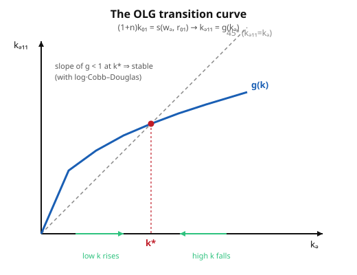

# Grad Macroeconomics · Lesson 3.1: The overlapping-generations model

> ⏱ ~15 min · Module 3: Overlapping generations · Builds on: [2.6 Growth accounting](02-06-growth-accounting.md), [2.3 Ramsey–Cass–Koopmans](02-03-ramsey-cass-koopmans.md) · Unlocks: [3.2 Dynamic inefficiency and over-accumulation](03-02-dynamic-inefficiency.md)

## Why this matters

Ramsey gave us a beautiful, *efficient* economy — but it bought that beauty with a fiction: one immortal household (or a representative dynasty) that internalizes the entire future through a single transversality condition. Real economies are not run by one deathless planner. People are born, work, save, retire, and die, and the person saving today is not the same person who will spend that saving in fifty years. When you take **finite lives seriously**, the clean welfare theorem cracks: the competitive equilibrium can over-accumulate capital, valueless pieces of paper (money, bubbles) can trade at a positive price, and a pay-as-you-go transfer from young to old can make *everyone* better off. Every one of those results — which look like paradoxes in Ramsey — falls out naturally here. The OLG model is the workhorse for public debt, social security, and monetary theory precisely because its inefficiency is a feature, not a bug.

## The idea

Chop the immortal household into a sequence of two-period lives. At each date $t$ a fresh cohort is born. You are **young** for one period and **old** for the next, then you exit. When young you supply one unit of labor, earn a wage, split it between consuming now and saving; when old you consume your saving plus its interest and you're done. At any moment two cohorts coexist — today's young (working, saving) and today's old (retired, dissaving) — which is where the name comes from: generations *overlap*.

The engine of the whole model is one clearing condition. The old own the capital and rent it to firms, then eat it. The **only** source of new capital for tomorrow is *what today's young choose to save*. So the young's total saving *is* tomorrow's capital stock. Compare this to Ramsey, where the same infinitely-lived agent owns capital forever: there, saving and capital-ownership are two faces of one optimizing plan. Here they are severed across people. That severance is the whole story — it means no single agent ever weighs "should the economy as a whole hold this much capital?", so nothing forces the equilibrium onto the efficient path.

## The formal version

**Demographics.** Population of the young at $t$ is $N_t$, growing at rate $n$: $N_{t+1} = (1+n)N_t$. Work with per-young-worker variables; $k_t$ is capital per young worker.

**Households.** A person born at $t$ chooses young-age consumption $c^y_t$, old-age consumption $c^o_{t+1}$, and saving $s_t$ to solve

$$\max_{c^y_t,\,c^o_{t+1}}\ u(c^y_t) + \beta\, u(c^o_{t+1}) \quad\text{s.t.}\quad c^y_t + s_t = w_t,\qquad c^o_{t+1} = (1+r_{t+1})\,s_t,$$

where $w_t$ is the wage, $r_{t+1}$ the net return on saving between $t$ and $t+1$, and $\beta\in(0,1)$ the discount factor. *In words: earn $w_t$ young, eat some and bank the rest; the bank balance plus interest is your entire old-age budget.* Substitute the constraints to get the intertemporal budget $c^y_t + \frac{c^o_{t+1}}{1+r_{t+1}} = w_t$, and the first-order condition is the **Euler equation**

$$u'(c^y_t) = \beta(1+r_{t+1})\,u'(c^o_{t+1}).$$

*In words: the marginal utility given up by saving one more unit today equals the discounted marginal utility it buys tomorrow.* Solving delivers a **savings function** $s_t = s(w_t, r_{t+1})$: saving rises with the wage (more to work with), but its response to the interest rate is ambiguous — income and substitution effects pull against each other (we settle this in Problem 3).

**Firms.** A single competitive firm rents capital and hires labor with a constant-returns technology $F(K,L)$, in intensive form $f(k)$ per worker. Profit maximization sets each factor price to its marginal product (exactly the logic of [1.6 Recursive competitive equilibrium](01-06-recursive-competitive-equilibrium.md)):

$$r_t = f'(k_t) - \delta, \qquad w_t = f(k_t) - k_t f'(k_t),$$

with $\delta$ the depreciation rate. *In words: capital earns its marginal product net of depreciation; labor gets what's left, which for CRS is exactly the wage.*

**Capital-market clearing — the heart of the model.** Tomorrow's capital stock is today's young cohort's saving, spread over tomorrow's larger young cohort:

$$K_{t+1} = N_t\, s_t \quad\Longrightarrow\quad (1+n)\,k_{t+1} = s\big(w_t,\, r_{t+1}\big).$$

*In words: only the young save, and their saving funds the entire capital stock; dividing by the $(1+n)$-times-larger next cohort gives capital per future worker.* This is a **first-order difference equation** in $k$. Its steady state $k^*$ solves $(1+n)k^* = s(w(k^*), r(k^*))$ — and unlike Ramsey, it need be **neither unique nor efficient**. That non-uniqueness and inefficiency is what Module 3 spends its time on.

## Picture

The difference equation, written $k_{t+1} = g(k_t)$ with $g(k) = \frac{1}{1+n}\,s\big(w(k), r(k)\big)$, is a one-dimensional map. Plot it against the 45° line: intersections are steady states, and where $g$ crosses from above with slope less than 1, the steady state is stable — capital cobwebs into it.

## Worked examples

**Example 1 — log utility + Cobb–Douglas: the clean closed form.** Let $u(c)=\ln c$, $f(k)=k^\alpha$, and (to keep the algebra clean) full depreciation $\delta=1$, so $r_{t+1}+1 = f'(k_{t+1}) = \alpha k_{t+1}^{\alpha-1}$ is the gross return.

*Household.* Maximize $\ln c^y_t + \beta \ln c^o_{t+1}$ subject to $c^y_t = w_t - s_t$ and $c^o_{t+1} = (1+r_{t+1})s_t$. Substitute and differentiate in $s_t$:

$$-\frac{1}{w_t - s_t} + \beta\cdot\frac{1+r_{t+1}}{(1+r_{t+1})s_t} = 0 \;\Longrightarrow\; \frac{1}{w_t - s_t} = \frac{\beta}{s_t}.$$

The gross return $1+r_{t+1}$ *cancels* — a signature of log utility, where income and substitution effects exactly offset. Cross-multiplying, $s_t = \beta(w_t - s_t)$, so

$$\boxed{\,s_t = \frac{\beta}{1+\beta}\,w_t\,}\qquad\text{(save a fixed fraction of the wage, independent of }r\text{).}$$

*Prices.* With $f(k)=k^\alpha$, the wage is $w_t = f(k_t) - k_t f'(k_t) = k_t^\alpha - \alpha k_t^\alpha = (1-\alpha)k_t^\alpha$.

*Transition.* Plug into capital-market clearing:

$$(1+n)k_{t+1} = \frac{\beta}{1+\beta}(1-\alpha)k_t^\alpha \;\Longrightarrow\; k_{t+1} = \frac{1}{1+n}\cdot\frac{\beta}{1+\beta}\,(1-\alpha)\,k_t^\alpha.$$

This is the concave map in the Picture. Set $k_{t+1}=k_t=k^*$ and solve $k^{*\,1-\alpha} = \frac{(1-\alpha)\beta}{(1+n)(1+\beta)}$:

$$\boxed{\,k^* = \left[\frac{(1-\alpha)\,\beta}{(1+n)(1+\beta)}\right]^{\frac{1}{1-\alpha}}\,}$$

A single, explicit, stable steady state (here it *is* unique — Cobb–Douglas is well-behaved; general $f$ and $u$ need not be). Note the comparative statics read straight off: more patience $\beta\uparrow$ or a larger labor share $1-\alpha$ raises $k^*$; faster population growth $n\uparrow$ lowers it (the same saving must equip more workers — the capital-dilution effect you met in [2.1 Solow](02-01-solow-model.md)).

**Example 2 — steady-state interest rate, and OLG vs. Ramsey saving.** At $k^*$ the gross return is $1+r^* = \alpha k^{*\,\alpha-1}$. Using $k^{*\,1-\alpha} = \frac{(1-\alpha)\beta}{(1+n)(1+\beta)}$,

$$1+r^* = \alpha\, k^{*\,\alpha-1} = \frac{\alpha}{k^{*\,1-\alpha}} = \frac{\alpha\,(1+n)(1+\beta)}{(1-\alpha)\,\beta}.$$

Now contrast the saving *logic*. In [2.3 Ramsey](02-03-ramsey-cass-koopmans.md), the steady state pins the interest rate to preferences via the **modified golden rule** $r^* = \rho + \theta g$ — the immortal agent's Euler equation forces the return to match its discount rate, *regardless* of technology parameters. Here there is no such forcing: $r^*$ is whatever the collision of the young's mechanical saving rule and the firm's marginal-product schedule produces. Nothing guarantees $r^*$ exceeds $n$. And that is the crack: if $r^* < n$ the economy has over-saved past the golden rule, holding more capital than is efficient — the **dynamic inefficiency** of [3.2](03-02-dynamic-inefficiency.md). In Ramsey the transversality condition rules this out; with finite lives, no agent enforces it.

## Watch out

- **Only the young save — don't double-count the old.** The old are dissaving their entire wealth (they die with nothing), so aggregate saving that funds $K_{t+1}$ is *just* the young cohort's $N_t s_t$. Writing "national saving" as if the old contribute is the classic setup error.
- **The $r$-cancellation is special to log.** Under log utility saving is independent of the interest rate, which is why Example 1 is so clean and why $g$ is a simple power function. For general CRRA the savings function $s(w,r)$ genuinely depends on $r$, and the transition map can be non-monotone or multi-valued — steady states can multiply or vanish (Problem 3).
- **Steady state $\neq$ optimum.** Reaching $k^*$ says the economy has *stopped moving*, not that it landed anywhere good. Ramsey conflates the two (its steady state is efficient by construction); OLG divorces them. Never import Ramsey's welfare intuition here.
- **Full depreciation ($\delta=1$) is an algebraic convenience, not the model.** It makes $1+r=\alpha k^{\alpha-1}$ and kills a term; with $\delta<1$ the same steps go through with $1+r_{t+1}=1-\delta+\alpha k_{t+1}^{\alpha-1}$, just messier.

## One-liner

> Kill the immortal household and the only capital tomorrow is the saving of today's young — a first-order difference equation whose steady state, unlike Ramsey's, can be non-unique and inefficient.

## Problems

**P1 (🟢)** A cohort has log utility $u(c)=\ln c$ over two periods with discount factor $\beta$, wage $w$ when young, and gross return $R=1+r$ on saving. Derive the saving function $s$ from the two-period problem, and confirm it does not depend on $R$. Then state $c^y$ and $c^o$ as fractions of lifetime resources.

**P2 (🟡)** Take the log/Cobb–Douglas economy of Example 1 with $\alpha = \tfrac13$, $\beta = 0.9$, $n = 0$, $\delta = 1$. (a) Write the capital transition $(1+n)k_{t+1} = s(w_t,r_{t+1})$ explicitly. (b) Solve for the steady state $k^*$ numerically. (c) Verify the map is stable there by checking $|g'(k^*)| < 1$.

**P3 (🔴)** Let utility be CRRA, $u(c) = \frac{c^{1-\theta}-1}{1-\theta}$. (a) From the Euler equation and budget constraints, show the saving function is $s(w,R) = \dfrac{w}{1 + \beta^{-1/\theta} R^{(\theta-1)/\theta}}$, where $R = 1+r_{t+1}$. (b) Show that $\frac{\partial s}{\partial R}$ is positive when $\theta > 1$, negative when $\theta < 1$, and zero at $\theta = 1$ — i.e. saving can slope *either way* in the interest rate. Interpret via income vs. substitution effects. (c) Explain in one or two sentences why this makes the OLG steady state $k^*$ potentially non-unique, whereas Example 1's was unique.

Solutions

**P1.** Maximize $\ln(w - s) + \beta\ln(Rs)$ over $s$. FOC:

$$-\frac{1}{w-s} + \beta\cdot\frac{R}{Rs} = 0 \;\Longrightarrow\; \frac{1}{w-s} = \frac{\beta}{s} \;\Longrightarrow\; s = \beta(w-s) \;\Longrightarrow\; s = \frac{\beta}{1+\beta}\,w.$$

The $R$ in the second term cancels top and bottom, so **saving is independent of $R$** — log utility's income and substitution effects exactly offset. Consumption: $c^y = w - s = \frac{1}{1+\beta}w$ and $c^o = Rs = \frac{\beta}{1+\beta}Rw$. As fractions of the *present value* of lifetime resources $w$ (all resources arrive young here): $c^y$ takes fraction $\frac{1}{1+\beta}$, and $c^o$ has present value $\frac{c^o}{R} = \frac{\beta}{1+\beta}w$, fraction $\frac{\beta}{1+\beta}$. The two fractions sum to 1. ✓

**P2.** (a) From Example 1 with $s_t = \frac{\beta}{1+\beta}w_t$ and $w_t = (1-\alpha)k_t^\alpha$, and $n=0$:

$$k_{t+1} = \frac{\beta}{1+\beta}(1-\alpha)\,k_t^\alpha = \frac{0.9}{1.9}\cdot\frac{2}{3}\,k_t^{1/3} = 0.4737\times 0.6667\; k_t^{1/3} = 0.3158\,k_t^{1/3}.$$

(b) Steady state: $k^* = 0.3158\,k^{*\,1/3} \Rightarrow k^{*\,2/3} = 0.3158 \Rightarrow k^* = 0.3158^{3/2} = 0.1775$. (Check the closed form: $k^* = \big[\frac{(1-\alpha)\beta}{(1+n)(1+\beta)}\big]^{1/(1-\alpha)} = 0.3158^{3/2} = 0.1775$. ✓)

(c) $g(k) = 0.3158\,k^{1/3}$, so $g'(k) = \frac{1}{3}\cdot 0.3158\,k^{-2/3}$. At $k^*=0.1775$: $k^{*\,-2/3} = 1/0.3158 = 3.167$, so $g'(k^*) = \frac{1}{3}(0.3158)(3.167) = \frac{1}{3}\cdot 1.0 = 0.333$. Indeed $|g'(k^*)| = \tfrac13 = \alpha < 1$ — **stable**. (In fact for this class $g'(k^*)=\alpha$ always: $g\propto k^\alpha$ gives $g'=\alpha g/k$, and $g(k^*)=k^*$.)

**P3.** (a) Euler equation with CRRA: $u'(c)=c^{-\theta}$, so $u'(c^y) = \beta R\, u'(c^o)$ becomes $(c^y)^{-\theta} = \beta R\,(c^o)^{-\theta}$, i.e. $\frac{c^o}{c^y} = (\beta R)^{1/\theta}$. Budgets: $c^y = w - s$, $c^o = Rs$. Then

$$\frac{Rs}{w-s} = (\beta R)^{1/\theta} \;\Longrightarrow\; Rs = (\beta R)^{1/\theta}(w-s) \;\Longrightarrow\; s\big[R + (\beta R)^{1/\theta}\big] = (\beta R)^{1/\theta} w.$$

Divide numerator and denominator by $(\beta R)^{1/\theta}$:

$$s = \frac{w}{1 + R(\beta R)^{-1/\theta}} = \frac{w}{1 + \beta^{-1/\theta}R^{\,1 - 1/\theta}} = \frac{w}{1 + \beta^{-1/\theta}R^{(\theta-1)/\theta}}.$$

That matches the claimed form. ✓ (At $\theta=1$ the exponent $(\theta-1)/\theta = 0$, so $R$ drops out and $s = \frac{w}{1+\beta^{-1}} = \frac{\beta}{1+\beta}w$ — the log case of P1.)

(b) Only the term $\beta^{-1/\theta}R^{(\theta-1)/\theta}$ in the denominator depends on $R$, and $s$ moves *opposite* to that term (bigger denominator, smaller $s$). Its $R$-exponent is $\frac{\theta-1}{\theta}$:
- $\theta > 1$: exponent $>0$, so $R^{(\theta-1)/\theta}$ *increases* in $R$, the denominator rises, and $s$ *falls*: $\frac{\partial s}{\partial R} < 0$.
- $\theta < 1$: exponent $<0$, so the term *decreases* in $R$, the denominator falls, and $s$ *rises*: $\frac{\partial s}{\partial R} > 0$.
- $\theta = 1$: exponent $0$, the term is constant, $\frac{\partial s}{\partial R} = 0$ (the log case).

  Interpretation: a higher return has a **substitution effect** (saving is cheaper in future-consumption terms → save more) and an **income effect** (you reach any target old-age consumption with less saving → save less). $\theta$ measures how strongly you resist intertemporal substitution: when $\theta<1$ (weak resistance, strong substitution motive) the substitution effect dominates and $s$ rises with $R$; when $\theta>1$ (strong resistance) the income effect dominates and $s$ falls with $R$; at $\theta=1$ (log) they exactly cancel and $s$ is flat in $R$. So the savings function **can slope either way** in the interest rate.

(c) The steady state solves $(1+n)k^* = s\big(w(k^*),\,R(k^*)\big)$ where $R(k^*)=\alpha k^{*\,\alpha-1}$ is *decreasing* in $k^*$. When $s$ depends on $R$ (any $\theta\neq 1$), the right-hand side is no longer a clean power of $k^*$: as $k^*$ rises, $w$ rises (pushing $s$ up) while $R$ falls (pushing $s$ up or down depending on $\theta$). These competing channels can make the map $g$ non-monotone or S-shaped, so the 45° line can be crossed **more than once** — multiple steady states. In Example 1 the $R$-channel is switched off by log utility, leaving $g\propto k^\alpha$, a single concave crossing and hence a unique $k^*$.

## Flashback

**From [2.3 Ramsey–Cass–Koopmans](02-03-ramsey-cass-koopmans.md):** In continuous time with CRRA utility (elasticity of intertemporal substitution $1/\theta$), discount rate $\rho$, technological growth $g$, and production $f(k)$, the consumption Euler equation is $\frac{\dot c}{c} = \frac{1}{\theta}\big(f'(k) - \delta - \rho - \theta g\big)$. State the steady-state ("modified golden rule") condition on $f'(k^*)$, and explain in one sentence why it makes the Ramsey interest rate independent of the production function's *scale*.

Solution

At the steady state consumption is constant, $\dot c = 0$, which requires the bracket to vanish:

$$f'(k^*) - \delta = \rho + \theta g,\qquad\text{i.e.}\qquad r^* = \rho + \theta g \quad\text{(modified golden rule).}$$

*In words: the net return on capital is pinned to the household's effective discount rate $\rho+\theta g$.* Because the immortal household's Euler equation forces $r^*$ to equal a pure-preference number ($\rho,\theta,g$), the steady-state interest rate does **not** depend on the level or scale of $f$ — technology only sets *how much capital* $k^*$ is needed to deliver that return ($f'(k^*)=\rho+\theta g+\delta$), not the return itself. This is exactly the forcing that OLG lacks: with finite lives no agent's Euler equation ties down $r^*$, so $r^*$ can fall below $n$ and the economy can over-accumulate.

## Connections

- **Backward:** this replaces Module 2's growth models — [2.1 Solow](02-01-solow-model.md)'s mechanical saving rate and [2.3 Ramsey](02-03-ramsey-cass-koopmans.md)'s optimizing infinite life — with optimizing *finite* lives, keeping the same Solow capital-dilution term $(1+n)$ but rebuilding saving from microfoundations. Factor prices as marginal products come straight from [1.6 Recursive competitive equilibrium](01-06-recursive-competitive-equilibrium.md).
- **Forward:** the possibility $r^* < n$ opens [3.2 Dynamic inefficiency](03-02-dynamic-inefficiency.md); the same severed intergenerational link lets intrinsically worthless assets carry value in [3.3 Money and rational bubbles](03-03-money-rational-bubbles.md) and makes pay-as-you-go transfers Pareto-improving in [3.4 Social security and transfers](03-04-social-security-transfers.md).
- **Sideways (micro):** the household block is exactly the two-period consumer's intertemporal choice problem — Euler equation, income vs. substitution effects on saving — from [`grad-micro`](../../grad-micro/syllabus.md). Same optimization, embedded in general equilibrium.
- **Sideways (dynamics):** $k_{t+1}=g(k_t)$ is a one-dimensional difference equation; stability via $|g'(k^*)|<1$ and the cobweb picture are the fixed-point tools of [`dynamical-systems`](../../dynamical-systems/syllabus.md), and the multiplicity in Problem 3 is where those tools start to earn their keep.
