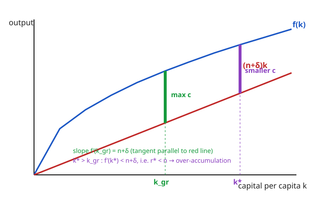

# Grad Macroeconomics · Lesson 3.2: Dynamic inefficiency and over-accumulation

> ⏱ ~15 min · Module 3: Overlapping generations · Builds on: [3.1 The OLG model](03-01-olg-model.md) · Unlocks: [3.3 Money and rational bubbles](03-03-money-rational-bubbles.md)

## Why this matters

The First Welfare Theorem is macro's bedrock: competitive equilibria are Pareto efficient, so laissez-faire needs no fixing. In [3.1](03-01-olg-model.md) you built a competitive OLG economy where every agent optimizes and every market clears — and yet it can land at an equilibrium that a planner could **strictly improve for every generation at once**. Nobody made a mistake; prices are right; markets clear. The theorem simply *fails*, because one market is missing that no price can conjure: the market between the living and the unborn.

The symptom is concrete and testable: the economy can save **too much**, piling up a capital stock so large that shaving it down would raise consumption forever. This single crack — an equilibrium interest rate below the growth rate — is the hinge for the next three lessons: it is exactly when fiat money has value ([3.3](03-03-money-rational-bubbles.md)), when a pay-as-you-go pension is a free lunch ([3.4](03-04-social-security-transfers.md)), and the sharpest counterexample to welfare-theorem complacency you will meet in this course.

## The idea

A single family that lives forever (the Ramsey planner of [2.3](02-03-ramsey-cass-koopmans.md)) never over-saves: capital is worth holding only up to the point where its return $f'(k)-\delta$ equals impatience $\rho$, and beyond that the family would rather consume. That discipline pins the steady state on the *efficient* side of the golden rule.

OLG has no such family. Each cohort is young once, saves for its **own** old age, then dies. The aggregate capital stock is just the pile of savings the current young happen to want — and that pile is chosen to move consumption across *one* lifetime, with zero regard for whether the economy as a whole is holding too much iron. If people are anxious about retirement and the only store of value is capital, they can collectively over-accumulate: build machines whose marginal product has fallen so low that the resources sunk into replacing them each period exceed what they yield.

When that happens there's a costless fix. Suppose the return on capital $r^*$ is below the economy's growth rate $n$. Instead of each young person burying savings in low-return capital, run a **chain**: the young hand goods to the old, and when they're old the *next* (larger, because the economy grew) young cohort hands goods to them. Every participant "invests" at the growth rate $n$ instead of the market return $r^* < n$ — a better deal for everyone — and because the economy keeps growing, no cohort is ever left holding the bill. The scheme is self-financing *forever*. That impossibility-turned-possibility is what "dynamic inefficiency" names.

## The formal version

Work with a steady state where population (or, with labor-augmenting progress, effective labor) grows at rate $n$ and capital depreciates at rate $\delta$. Let $k$ be capital per capita (per effective worker) and $f(k)$ output per capita, $f$ increasing, concave, with $f'>0>f''$.

**Steady-state consumption.** Holding $k$ constant requires replacing depreciation and equipping the extra workers — investment $(n+\delta)k$ per capita. What's left is consumed:

$$c(k) = f(k) - (n+\delta)k.$$

*In words:* steady-state consumption per person is output minus the "break-even" investment needed just to keep $k$ from falling.

**The golden rule.** Maximize $c(k)$ over $k$. The first-order condition $c'(k)=0$ gives

$$f'(k_{gr}) = n + \delta.$$

*In words:* consumption per head is largest when the marginal product of capital equals the growth-adjusted replacement rate — one more unit of capital yields exactly what it costs to sustain, no surplus. Because $f$ is concave, $f'$ is decreasing, so $k > k_{gr} \iff f'(k) < n+\delta$: **past** the golden rule, extra capital lowers steady-state consumption.

**The efficiency test.** In equilibrium the (net) return on capital is the real interest rate, $r = f'(k) - \delta$. Substitute into the golden-rule condition:

$$\boxed{\;r^* < n \iff k^* > k_{gr} \iff \text{the economy is dynamically inefficient (over-accumulated).}\;}$$

*In words:* compare the return on capital to the growth rate of the economy. If capital earns **less** than the economy grows, the steady state is on the wrong side of the golden rule and is Pareto-improvable. The knife-edge $r^*=n$ is the golden rule itself.

**Why the Ramsey model is immune.** Its Euler equation forces $f'(k^*)-\delta = \rho + n$ (with population growth $n$ and pure discount rate $\rho > 0$), so $r^* = \rho + n > n$ — *strictly* efficient, always, with room $\rho$ to spare. The infinitely-lived agent's impatience is exactly the discipline OLG lacks.

## Picture

The whole story lives in one diagram: consumption per capita is the vertical gap between output $f(k)$ and the break-even line $(n+\delta)k$. That gap is widest at $k_{gr}$, where $f$'s slope matches the line's. An over-accumulated equilibrium $k^* > k_{gr}$ sits on the far side, where the gap has *shrunk* — proof that scaling capital back would raise consumption.

## Worked examples

**Example 1 (the golden rule and the $r<n$ criterion, in general).**
Maximize $c(k)=f(k)-(n+\delta)k$. Setting $c'(k)=f'(k)-(n+\delta)=0$ gives $f'(k_{gr})=n+\delta$. Since $c''(k)=f''(k)<0$, this is the unique maximum. Now read off efficiency. The market return is $r=f'(k)-\delta$, so at any steady state $k^*$:

$$r^* - n = \big(f'(k^*)-\delta\big) - n = f'(k^*) - (n+\delta).$$

By concavity $f'$ is strictly decreasing, so $f'(k^*) - (n+\delta)$ and the quantity $k_{gr}-k^*$ share a sign. Hence $r^* < n \iff f'(k^*) < n+\delta \iff k^* > k_{gr}$. The interest-rate test and the capital-stock test are the *same* test. (Contrast Ramsey: $r^*=\rho+n>n$, so $k^* < k_{gr}$ — efficient by a margin of $\rho$.)

**Example 2 (a Cobb–Douglas OLG steady state engineered to over-accumulate).**
Two-period OLG, log utility $U = \ln c_1 + \beta \ln c_2$, population growing at rate $n$. The young supply one unit of labor, earn wage $w_t$, consume $c_{1t}$, and save $s_t = w_t - c_{1t}$; the old consume $c_{2,t+1} = (1+r_{t+1})s_t$. Production is Cobb–Douglas per worker, $f(k)=k^\alpha$, with **full depreciation** $\delta = 1$ over the (generation-length) period, so $r_{t+1} = f'(k_{t+1}) - \delta = \alpha k_{t+1}^{\alpha-1} - 1$ and the gross return is $1+r_{t+1}=\alpha k_{t+1}^{\alpha-1}$.

*Saving.* With log utility the young save a fixed fraction of the wage, independent of the return (income and substitution effects cancel):

$$s_t = \frac{\beta}{1+\beta}\,w_t, \qquad w_t = f(k_t) - k_t f'(k_t) = (1-\alpha)k_t^{\alpha}.$$

*Capital accumulation.* Next period's capital per young worker is this period's saving spread over the larger young cohort:

$$k_{t+1} = \frac{s_t}{1+n} = \frac{\beta}{(1+\beta)(1+n)}(1-\alpha)k_t^{\alpha}.$$

Setting $k_{t+1}=k_t=k^*$ gives the steady state

$$k^* = \left[\frac{\beta(1-\alpha)}{(1+\beta)(1+n)}\right]^{\frac{1}{1-\alpha}}.$$

*Now over-accumulate it.* The golden rule (with $\delta=1$) is $f'(k_{gr})=n+\delta=n+1$, i.e. $\alpha k_{gr}^{\alpha-1}=1+n$, so $k_{gr}=\big(\tfrac{\alpha}{1+n}\big)^{1/(1-\alpha)}$. Compare $k^*$ to $k_{gr}$ by comparing the brackets raised to the same positive power $\tfrac{1}{1-\alpha}$:

$$k^* > k_{gr} \iff \frac{\beta(1-\alpha)}{1+\beta} > \alpha.$$

Take $\alpha=\tfrac14$, $\beta=1$, $n=0$. Left side: $\frac{1\cdot(3/4)}{2}=\tfrac38=0.375$; right side $\alpha=0.25$. Since $0.375>0.25$, we have $k^*>k_{gr}$ — **over-accumulation**. Check the interest rate directly: $k^*=\big[\tfrac{1\cdot(3/4)}{2\cdot1}\big]^{1/(3/4)}=0.375^{4/3}\approx 0.271$, so $1+r^*=\alpha k^{*\,\alpha-1}=0.25\cdot(0.271)^{-3/4}\approx 0.25\cdot 2.66\approx 0.665$, giving $r^*\approx-0.335$. With $n=0$ the test is $r^*<0$: indeed $-0.335<0$. Dynamically inefficient.

*The free lunch.* Introduce a tiny pay-as-you-go transfer: each young person hands over $\varepsilon$ goods, received by the current old. In steady state a person pays $\varepsilon$ when young and receives $(1+n)\varepsilon$ when old (the next cohort is $(1+n)$ times larger). Their lifetime "return" on the transfer is $n$. Since the alternative — saving that $\varepsilon$ in capital — returns only $r^* < n$, **substituting the transfer for a sliver of capital raises the present value of every cohort's resources**, including the launching old generation, who receive $\varepsilon$ for nothing. Every generation strictly gains; none is ever asked to repay, because growth covers it. That is the Pareto improvement the First Welfare Theorem swore couldn't exist here — and the seed of both money ([3.3](03-03-money-rational-bubbles.md)) and social security ([3.4](03-04-social-security-transfers.md)).

## Watch out

- **Over-saving, not under-saving.** Dynamic inefficiency is *too much* capital, the opposite of the usual "poor countries save too little" worry. The cure is to consume some of the capital stock, not to build more.
- **$r<n$ is the whole test — but use the right $r$ and $n$.** It's the *net* real return $r=f'(k)-\delta$ versus the growth rate of the economy (population plus productivity growth). Getting depreciation or the growth adjustment wrong flips the verdict. Empirically the safe-asset return is often below $n$, but the marginal product of *capital* (what the theorem needs) generally exceeds $n$ — most economists judge real economies dynamically *efficient*, so this is a sharp theoretical possibility, not a claimed fact about the U.S.
- **The market didn't fail from mispricing.** Every price is competitive and every agent optimizes. The failure is a *missing market*: the unborn can't show up today to sell the current old a claim. Incompleteness, not irrationality — the same structural reason the welfare theorems can break with infinitely many agents that you'll see stated generally in [grad-micro](../../grad-micro/syllabus.md).
- **Don't expect this in Ramsey/Solow-at-the-optimum.** A benevolent infinitely-lived planner never crosses the golden rule ($r^*=\rho+n>n$). If a model gives you $r<n$, you're in an OLG-type world with a genuine intergenerational gap.

## One-liner

> When capital earns less than the economy grows ($r^*<n$), the OLG economy has over-saved past the golden rule, and passing goods from young to old at the growth rate makes *every* generation richer — the First Welfare Theorem broken by the one market the unborn can't attend.

## Problems

**P1 (🟢)** An economy has $f(k)=k^{1/3}$, depreciation $\delta=0.08$, and population growth $n=0.02$. Its steady-state capital stock is $k^*=30$. Compute the golden-rule capital $k_{gr}$ and state whether the economy has over- or under-accumulated.

**P2 (🟡)** In a two-period OLG steady state, capital per worker is $k^*=4$, the technology is $f(k)=k^{1/2}$ with $\delta=1$ (full depreciation each generation), and population grows at $n=0.5$ per generation. Determine whether this steady state is dynamically efficient using the $r^*$ vs $n$ test.

**P3 (🔴)** An OLG economy is at a steady state with net return $r^*<n$ (so $r^*<n$; take $n$ as the per-period growth rate of the young cohort). Consider a pay-as-you-go scheme: at every date, each young person transfers $\tau>0$ goods to each contemporaneous old person's account, and the transfers are shared so that a representative member of each cohort pays $\tau$ when young and receives $(1+n)\tau$ when old. Show that (a) the scheme balances the budget every period with nothing borrowed, and (b) *every* generation — including the old alive at the launch date — is strictly better off than under pure capital saving. Identify precisely where $r^*<n$ is used.

Solutions

**P1.** Golden rule: $f'(k_{gr})=n+\delta=0.10$. With $f'(k)=\tfrac13 k^{-2/3}$,

$$\tfrac13 k_{gr}^{-2/3}=0.10 \;\Rightarrow\; k_{gr}^{-2/3}=0.30 \;\Rightarrow\; k_{gr}^{2/3}=\tfrac{1}{0.30}=3.333 \;\Rightarrow\; k_{gr}=3.333^{3/2}\approx 6.09.$$

Since $k^*=30 > 6.09 = k_{gr}$, the economy has **over-accumulated** (dynamically inefficient). Cross-check via the interest rate: $r^* = f'(30)-\delta = \tfrac13(30)^{-2/3}-0.08 = \tfrac13(0.1036)-0.08 \approx 0.0345-0.08 = -0.045 < n=0.02$. ✓ Same verdict.

**P2.** The net return on capital is $r^* = f'(k^*)-\delta$. With $f'(k)=\tfrac12 k^{-1/2}$ and $k^*=4$:

$$r^* = \tfrac12(4)^{-1/2} - 1 = \tfrac12\cdot\tfrac12 - 1 = 0.25 - 1 = -0.75.$$

Compare to $n=0.5$: since $r^*=-0.75 < 0.5 = n$, the test says $r^*<n$, so the steady state is **dynamically inefficient** (over-accumulated). Equivalently, $f'(k^*)=0.25 < n+\delta=1.5$, so $k^*>k_{gr}$; indeed $k_{gr}$ solves $\tfrac12 k_{gr}^{-1/2}=1.5$, $k_{gr}^{-1/2}=3$, $k_{gr}=1/9\approx0.11$, far below $4$. ✓

**P3.** *(a) Budget balance.* At any date $t$ there are $N_t$ young and $N_{t-1}$ old, with $N_t=(1+n)N_{t-1}$. Total goods collected from the young: each pays $\tau$, so $N_t\tau$. Total paid to the old: each of the $N_{t-1}$ old receives $(1+n)\tau$, so $N_{t-1}(1+n)\tau = N_t\tau$. Inflows equal outflows every period: the scheme is fully funded by contemporaneous contributions — nothing is borrowed and no debt is issued.

*(b) Every cohort gains.* Take a representative agent born at date $t\ge$ launch. Relative to *not* participating, the scheme changes their lifetime resources by "$-\tau$ when young, $+(1+n)\tau$ when old." The correct way to value that is against the agent's own intertemporal price, the market return $r^*$: saving $\tau$ when young would have yielded $(1+r^*)\tau$ when old. The transfer instead yields $(1+n)\tau$ when old for the same $\tau$ given up when young. Since $r^*<n$,

$$(1+n)\tau > (1+r^*)\tau,$$

so the scheme delivers strictly more old-age consumption per unit of youthful sacrifice than the capital market does. Reallocating a marginal $\tau$ of saving from capital into the transfer therefore strictly relaxes the lifetime budget constraint, and with monotone preferences the agent is strictly better off. This holds for every cohort born from the launch date onward.

The launch-date old are the clincher: they contributed nothing when young (the scheme didn't yet exist) but receive $(1+n)\tau>0$ — a pure gift. And no future cohort is left worse off to pay for it, because part (a) shows each period self-finances. So the launch is a strict Pareto improvement: someone strictly better off (in fact everyone), nobody worse off.

*Where $r^*<n$ is used:* exactly at the inequality $(1+n)\tau>(1+r^*)\tau$. If instead $r^*>n$ (the efficient case, e.g. Ramsey), capital would dominate the transfer, the working cohorts would lose, and no such free lunch exists — the First Welfare Theorem holds. Dynamic inefficiency is *precisely* the wedge $n-r^*>0$ that the transfer harvests.

## Flashback

**From Lesson 3.1 (The OLG model).** In the two-period OLG economy with log utility $U=\ln c_{1t}+\beta\ln c_{2,t+1}$, wage $w_t$ earned when young, and gross return $1+r_{t+1}$ on saving, derive the young agent's saving function $s_t$ and explain in one sentence why it does not depend on $r_{t+1}$.

Solution

The young solve $\max_{c_{1t},c_{2,t+1}} \ln c_{1t}+\beta\ln c_{2,t+1}$ subject to $c_{1t}+s_t=w_t$ and $c_{2,t+1}=(1+r_{t+1})s_t$. Substitute both constraints to write utility in $s_t$:

$$\ln(w_t - s_t) + \beta\ln\big((1+r_{t+1})s_t\big) = \ln(w_t-s_t)+\beta\ln s_t + \beta\ln(1+r_{t+1}).$$

The return enters only through the additive constant $\beta\ln(1+r_{t+1})$, which doesn't affect the maximizer. Differentiate in $s_t$:

$$-\frac{1}{w_t-s_t}+\frac{\beta}{s_t}=0 \;\Rightarrow\; \beta(w_t-s_t)=s_t \;\Rightarrow\; s_t=\frac{\beta}{1+\beta}\,w_t.$$

Saving is a fixed fraction of the wage, independent of $r_{t+1}$: with log utility the substitution effect (a higher return makes saving more attractive) and the income effect (a higher return means less saving is needed to fund old age) cancel exactly. This is the $s_t=\frac{\beta}{1+\beta}w_t$ used in Example 2 above. ✓

## Connections

- **Backward:** [2.4](02-04-golden-rule-dynamic-efficiency.md) defined the golden rule and dynamic efficiency for a *planner*; this lesson shows a decentralized OLG economy can violate it, something the [2.3](02-03-ramsey-cass-koopmans.md) Ramsey economy never does ($r^*=\rho+n>n$). The steady-state machinery and log-utility saving rule come straight from [3.1](03-01-olg-model.md).
- **Forward:** [3.3](03-03-money-rational-bubbles.md) shows fiat money (an intrinsically worthless asset) has positive value in equilibrium *exactly* when $r<n$ — money is the missing intergenerational asset that closes the gap and restores efficiency. [3.4](03-04-social-security-transfers.md) reads P3 as unfunded social security: a welfare-improving pension precisely in a dynamically inefficient economy.
- **Sideways (micro):** this is the canonical failure of the First and Second Welfare Theorems under a *double infinity* (infinitely many agents and dates) with missing markets — see the welfare-theorem treatment in [grad-micro](../../grad-micro/syllabus.md). The economics is the same as any missing-market inefficiency; here the absent traders are the unborn.
